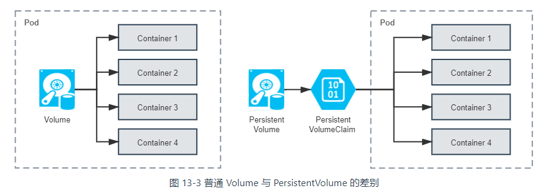
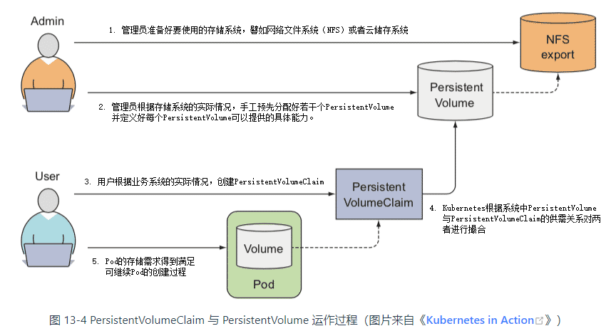

# 存储与配置

[容器存储与生态](http://icyfenix.cn/immutable-infrastructure/storage/)

## 存储

[文档](https://kubernetes.io/zh/docs/concepts/storage/)

Kubernetes 目前提供的存储

| Temp | Ephermeral(Local) | Persistent(Network) | Extension |
|: -- :|: -- :|: -- :|: -- :|
| EmptyDir | HostPath<br>GitRepo<br>Local<br>Secret<br>ConfigMap<br>DownwardAPI | AWS Elastic Block Store<br>GCE Persistent Disk<br>Azure Data Disk<br>Azure File Storage<br>vSphere<br>CephFS and RBD<br>GlusterFS<br>iSCSI<br>Cinder<br>Dell EMC ScaleIO<br>…… | FlexVolume<br>CSI |

### 卷(Volume)

普通 Volume 的设计目标不是为了持久地保存数据，而是为同一个 Pod 中多个容器提供可共享的存储资源，因此 Volume 具有十分明确的生命周期——与挂载它的 Pod 相同的生命周期，

```yaml
apiVersion: v1
kind: Pod
metadata:
  name: test-pd
spec:
  containers:
  - image: k8s.gcr.io/test-webserver
    name: test-container
    volumeMounts:
    - mountPath: /cache
      name: cache-volume
  volumes:
  - name: cache-volume
    emptyDir: {}
```

### 持久卷(Persistent Volume)

[文档](https://kubernetes.io/zh/docs/concepts/storage/persistent-volumes/)



> PersistentVolume 是由管理员负责提供的集群存储。  
> PersistentVolumeClaim 是由用户负责提供的存储请求。

```yaml
apiVersion: v1
kind: PersistentVolume
metadata:
  name: nginx-html
spec:
  capacity:
    storage: 5Gi                          # 最大容量为5GB
  accessModes:
    - ReadWriteOnce                       # 访问模式为RWO
  persistentVolumeReclaimPolicy: Retain	  # 回收策略是Retain
  nfs:                                    # 存储驱动是NFS
    path: /html
    server: 172.17.0.2
```

```yaml
kind: PersistentVolumeClaim
apiVersion: v1
metadata:
  name: nginx-html-claim
spec:
  accessModes:
    - ReadWriteOnce    # 支持RWO访问模式
  resources:
    requests:
      storage: 5Gi     # 最小容量5GB
```



> 持久卷也可以根据声明动态创建，具体看[文档](https://kubernetes.io/zh/docs/concepts/storage/dynamic-provisioning/)

相关命令

```bash
# 查看持久卷
kubectl get pv
# 查看持久卷声明
kubectl get pvc
```

> 持久卷不属于任何命名空间，它跟节点一样是集群层面的资源

## 配置

[文档](https://kubernetes.io/zh/docs/concepts/configuration/)

### ConfigMap

ConfigMap 是一种 API 对象，用来将非机密性的数据保存到键值对中。使用时， Pods 可以将其用作`环境变量`、`命令行参数`或者`存储卷`中的配置文件。

ConfigMap 将您的 `环境配置信息` 和 `容器镜像` 解耦，便于应用配置的修改。

```yaml
apiVersion: v1
kind: ConfigMap
metadata:
  name: game-demo
data:
  # 类属性键；每一个键都映射到一个简单的值
  player_initial_lives: "3"
  ui_properties_file_name: "user-interface.properties"

  # 类文件键
  game.properties: |
    enemy.types=aliens,monsters
    player.maximum-lives=5    
  user-interface.properties: |
    color.good=purple
    color.bad=yellow
    allow.textmode=true   
```

```yaml
apiVersion: v1
kind: Pod
metadata:
  name: configmap-demo-pod
spec:
  containers:
    - name: demo
      image: alpine
      command: ["sleep", "3600"]
      env:
        # 定义环境变量
        - name: PLAYER_INITIAL_LIVES # 请注意这里和 ConfigMap 中的键名是不一样的
          valueFrom:
            configMapKeyRef:
              name: game-demo           # 这个值来自 ConfigMap
              key: player_initial_lives # 需要取值的键
        - name: UI_PROPERTIES_FILE_NAME
          valueFrom:
            configMapKeyRef:
              name: game-demo
              key: ui_properties_file_name
      volumeMounts:
      - name: config
        mountPath: "/config"
        readOnly: true
  volumes:
    # 你可以在 Pod 级别设置卷，然后将其挂载到 Pod 内的容器中
    - name: config
      configMap:
        # 提供你想要挂载的 ConfigMap 的名字
        name: game-demo
        # 来自 ConfigMap 的一组键，将被创建为文件
        items:
        - key: "game.properties"
          path: "game.properties"
        - key: "user-interface.properties"
          path: "user-interface.properties"
```

相关命令

```bash
# 指定字面量创建 configmap
kubectl create configmap <name> --from-literal=<key1>=<value1> --from-literal=<key2>=<value2>
# 通过文件内容创建 configmap
kubectl create configmap <name> --from-file=<key>=<file_path>
# 通过文件夹创建 configmap, 文件夹内的每个文件名作为 key，文件内容作为 value
kubectl create configmap <name> --from-file=<dir_path>
```

### Secret

Secret 结构和 ConfigMap 类似，均是键值对的映射，使用方法也一样。

但是 Secret 只会存储在节点的内存中，永不写入物理存储

> Secret 大小限制为 1M

> Secret 在 etcd 中存储，在 etcd 中并没有加密，如果需要在 etcd 中加密可以使用 [静态加密](https://kubernetes.io/zh/docs/tasks/administer-cluster/encrypt-data/)

> Secret 的 value 在 yaml 定义中要写成 Base64 格式

```yaml
apiVersion: v1
data:
  username: YWRtaW4=
  password: MWYyZDFlMmU2N2Rm
kind: Secret
metadata:
  annotations:
    kubectl.kubernetes.io/last-applied-configuration: { ... }
  creationTimestamp: 2020-01-22T18:41:56Z
  name: mysecret
  namespace: default
  resourceVersion: "164619"
  uid: cfee02d6-c137-11e5-8d73-42010af00002
type: Opaque
```

```yaml
apiVersion: v1
kind: Pod
metadata:
  name: mypod
spec:
  containers:
  - name: mypod
    image: redis
    volumeMounts:
    - name: foo
      mountPath: "/etc/foo"
      readOnly: true
  volumes:
  - name: foo
    secret:
      secretName: mysecret
      optional: false # 默认设置，意味着 "mysecret" 必须已经存在
```

相关命令 

```bash
# 指定字面量创建 secret
kubectl create secret generic <name> --from-literal=<key1>=<value1> --from-literal=<key2>=<value2>
# 通过文件内容创建 secret
kubectl create secret generic <name> --from-file=<key>=<file_path>
# 通过文件夹创建 configmap, 文件夹内的每个文件名作为 key，文件内容作为 value
kubectl create secret generic <name> --from-file=<dir_path>
```

### 默认的 Secret

每个 Pod 都会被自动挂上一个 secret 卷，如下

```yaml
spec:
  containers:
  - image: nginx:latest
    volumeMounts:
    - mountPath: /var/run/secrets/kubernetes.io/serviceaccount
      name: kube-api-access-vgsfd
      readOnly: true
  volumes:
  - name: kube-api-access-vgsfd
    projected:
      defaultMode: 420
      sources:
      - serviceAccountToken:
          expirationSeconds: 3607
          path: token
      - configMap:
          items:
          - key: ca.crt
            path: ca.crt
          # k8s 根证书
          name: kube-root-ca.crt
      - downwardAPI:
          items:
          - fieldRef:
              apiVersion: v1
              fieldPath: metadata.namespace
            path: namespace
```