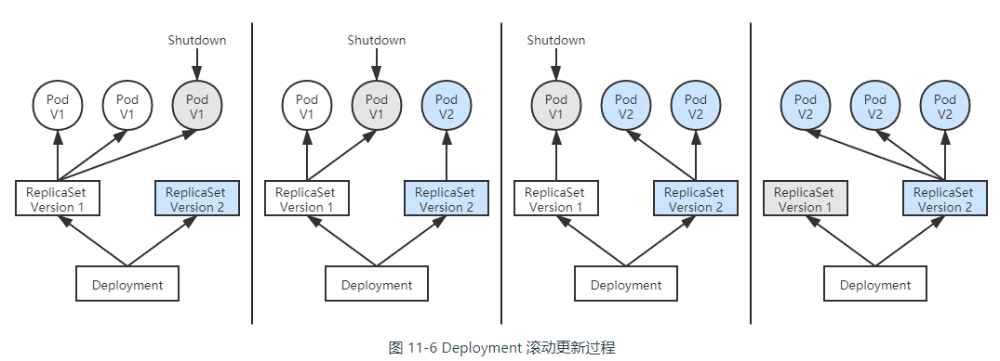
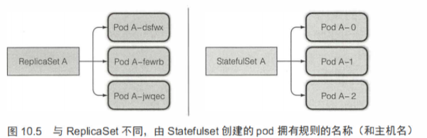
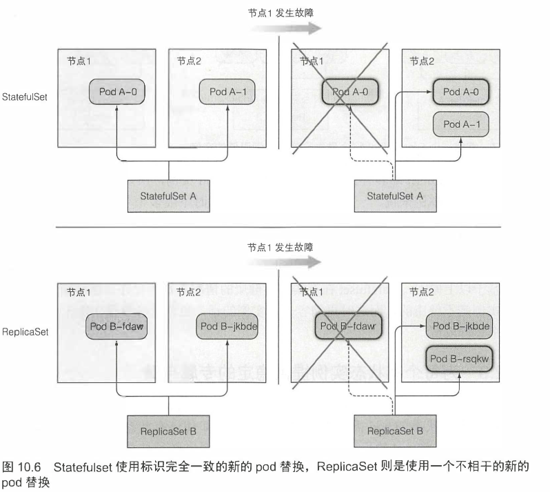

# 工作负载

## Pod

Pod 是 k8s 中最小的可部署单元

> 如果说容器封装了进程，那么 Pod 就是封装了进程组

同一个 Pod 中的多个容器会默认共享以下名称空间：

- UTS 名称空间
- 网络名称空间
- IPC 名称空间
- 时间名称空间

### Kubernetes 中 Pod 名称空间共享的实现细节

Pod 内部多个容器共享 UTS、IPC、网络等名称空间是通过一个名为 `Infra Container` 的容器来实现的，这个容器是整个 Pod 中第一个启动的容器，只有几百 KB 大小（代码只有很短的几十行），Pod 中的其他容器都会以 `Infra Container` 作为父容器，UTS、IPC、网络等名称空间实质上都是来自 Infra Container 容器。

如果容器设置为共享 PID 名称空间的话，`Infra Container` 中的进程将作为 `PID 1` 进程，其他容器的进程将以它的子进程的方式存在，此时将由 Infra Container 来负责进程管理（譬如清理僵尸进程）、感知状态和传递状态。

由于 Infra Container 的代码除了注册 SIGINT、SIGTERM、SIGCHLD 等信号的处理器外，就只是一个以 `pause()` 方法为循环体的无限循环，永远处于 Pause 状态，所以也常被称为 `Pause Container`。

### 容器的存活检测

Kubernetes 可以通过存活探针([liveness probe](https://kubernetes.io/zh/docs/concepts/workloads/pods/pod-lifecycle/#container-probes)) 检查容器是否还在运行。如果探测失败，则会定期执行探针并重新启动容器

相关命令

```bash
# 查看 pod 事件了解重启容器的原因
kubectl describe pod <pod_name>

# 查看前一个已崩溃容器的日志
kubectl logs <pod_name> --previous
```

### 调试运行中的 Pod

[文档](https://kubernetes.io/zh/docs/tasks/debug-application-cluster/debug-running-pod/)

1. 创建运行新命令的 Pod 副本

    ```bash
    kubectl debug <pod_name> -it --copy-to=<debug_pod_name> --container=<container_name_to_debug> -- <cmd> <arg1>...<argN>
    ```

2. 创建运行新镜像的 Pod 副本

    ```bash
    kubectl debug <pod_name> -it --copy-to=<debug_pod_name>  --set-image=<container_name_to_debug>=<new_image>:<tag>
    ```

3. 给 Pod 加临时容器，共享进程命名空间，在临时容器中调试问题容器

    ```bash
    kubectl run <pod_name> --image=<ephermeral_container_name>:<tag> --target=<container_name_to_debug>
    ```

    根据[共享进程命名空间的特性](https://kubernetes.io/zh/docs/tasks/configure-pod-container/share-process-namespace/)调试问题容器

    ```bash
    # 查看进程信息
    ps aux
    # 查看进程文件系统
    cat /proc/1/root/etc/nginx/nginx.conf
    ```

    > minikube 开启临时容器特性： `minikube start --feature-gates=EphemeralContainers=true`

## ReplicaSet

[文档](https://kubernetes.io/zh/docs/concepts/workloads/controllers/replicaset/)

虽然 Pod 本身也是资源，完全可以直接创建，但由 Pod 直接构成的系统是十分脆弱的，如果整个节点宕机了，那么节点上的 Pod 会丢失。

正确的做法是通过副本集（`ReplicaSet`）来创建 Pod。`ReplicaSet` 也是一种资源，是属于工作负荷一类的资源，它代表一个或多个 Pod 副本的集合，你可以在 ReplicaSet 资源的元数据中描述你期望 Pod 副本的数量（即 `spec.replicas` 的值）。

当 ReplicaSet 成功创建之后，副本集控制器就会持续跟踪该资源，如果一旦有 Pod 发生崩溃退出，或者状态异常，ReplicaSet 都会自动创建新的 Pod 来替代异常的 Pod；如果异常多出现了额外数量的 Pod，也会被 ReplicaSet 自动回收掉，总之就是**确保任何时候集群中这个 Pod 副本的数量都向*期望状态*靠拢**。

ReplicaSet 定义有三个主要部分

- 标签选择器
- 副本个数
- pod 模板

示例定义：

```yaml
apiVersion: apps/v1
kind: ReplicaSet
metadata:
  name: frontend
  labels:
    app: guestbook
    tier: frontend
spec:
  # modify replicas according to your case
  replicas: 3
  selector:
    matchLabels:
      tier: frontend
  template:
    metadata:
      labels:
        tier: frontend
    spec:
      containers:
      - name: php-redis
        image: gcr.io/google_samples/gb-frontend:v3

```

> 定义 ReplicaSet 时不用指定 pod 选择器，让 Kubernetes 从 pod 模板提取它，这样 YAML 更简短

> 修改 ResplicSet 中的 Pod 模板，不会影响到已创建的 Pod，只有新创建的 Pod 才会用修改后的模板

相关命令:

```bash
# 通过编辑定义修改 Pod 模板
kubectl edit rs <rs_name>

# 通过编辑定义修改副本数（声明式）
kubectl edit rs <rs_name>

# 命令式修改副本数
kubectl scale rs <rs_name> --replicas=<num>

# 只删除 rs 不删除其管理的 pod
kubectl delete rs <rs_name> --cascade=false
```

## ReplicationController

!> 已经是 depecrated 状态，不推荐使用；因为实践中还有遗留的 ReplicationController 对象存在，需要有所了解

`ReplicaSet` 是 `ReplicationController` 的后继者。二者目的相同且行为类似，只是 `ReplicationController` 不支持 [标签用户指南](https://kubernetes.io/zh/docs/concepts/overview/working-with-objects/labels/#set-based-requirement) 中讨论的基于集合的选择算符需求。 因此，相比于 ReplicationController，应 **优先考虑 ReplicaSet**。

## Deployment

[文档](https://kubernetes.io/zh/docs/concepts/workloads/controllers/deployment/)

> 实际开发中并不是会直接定义 Pod ，而是定义 Deployment

ReplicaSet 可以维持 Pod 的数量满足期望，但是缺乏升级 Pod 的手段。

Deployment 在 ReplicaSet 之上再封装了一层，提供滚动升级能力。

所谓滚动更新（Rolling Updates）是指先停止少量旧副本，维持大量旧副本继续提供服务，当停止的旧副本更新成功，新副本可以提供服务以后，再重复以上操作，直至所有的副本都更新成功。将这个过程放到 ReplicaSet 上，就是先创建新版本的 ReplicaSet，然后一边让新 ReplicaSet 逐步创建新版 Pod 的副本，一边让旧的 ReplicaSet 逐渐减少旧版 Pod 的副本。

> 除了 Deployment，也可以通过 `kubectl rolling-update <rs_name> <rs_name_v2> --image=<image_name>:<v2_tag>` 的方式能实现 rs 的滚动升级，这种方式本质上是通过 kubectl 客户端来负责滚动升级，而且过于命令式，不符合 Kubernetes 声明式的设计理念，不建议使用



相关命令

```bash
# 更新 deployment
kubectl edit deployment <deployment_name>

# 更新镜像
kubectl set image deployment <deployment_name> <container_name>=<image_name>:<new_tag>

# 查看滚动更新状态
kubectl rollout status deployment <deployment_name>

# 查看更新过程
kubectl describe deployment <deployment_name>

# 查看更新历史
kubectl rollout history deployment/nginx-deployment
# 查看某个版本的信息
kubectl rollout history deployment/nginx-deployment --revision=<version_id>

# 回滚到上一个版本
kubectl rollout undo deployment/nginx-deployment
# 回滚到某个版本
kubectl rollout undo deployment/nginx-deployment --to-revision=<version_id>

# 缩放 Deployment
kubectl scale deployment/nginx-deployment --replicas=10
```

!> 建议在 `create` 或者 `edit` deployment 的时候使用 `--record` 选项，这样通过 `rollout history` 才能看到每个版本的变更信息

## StatefulSet

[文档](https://kubernetes.io/zh/docs/concepts/workloads/controllers/statefulset/)

StatefulSet 是专门给有状态的应用设计的资源，主要特点是**StatefulSet 管理下的 Pod 具有唯一标识**（`顺序的名称标识`，`稳定的网络标识`，`稳定的存储`）

对于具有 N 个副本的 StatefulSet，StatefulSet 中的每个 Pod 将被分配一个整数序号， 从 0 到 N-1，该序号在 StatefulSet 上是唯一的





> 缩容时，StatefulSet 任何时候只会操作一个 pod，会先删除最高索引值的 Pod

示例 yaml 定义

```yaml
apiVersion: v1
kind: Service
metadata:
  name: nginx
  labels:
    app: nginx
spec:
  ports:
  - port: 80
    name: web
  clusterIP: None
  selector:
    app: nginx
---
apiVersion: apps/v1
kind: StatefulSet
metadata:
  name: web
spec:
  selector:
    matchLabels:
      app: nginx # has to match .spec.template.metadata.labels
  serviceName: "nginx"
  replicas: 3 # by default is 1
  template:
    metadata:
      labels:
        app: nginx # has to match .spec.selector.matchLabels
    spec:
      terminationGracePeriodSeconds: 10
      containers:
      - name: nginx
        image: k8s.gcr.io/nginx-slim:0.8
        ports:
        - containerPort: 80
          name: web
        volumeMounts:
        - name: www
          mountPath: /usr/share/nginx/html
  volumeClaimTemplates:
  - metadata:
      name: www
    spec:
      accessModes: [ "ReadWriteOnce" ]
      storageClassName: "my-storage-class"
      resources:
        requests:
          storage: 1Gi
```

## DaemonSet

[文档](https://kubernetes.io/zh/docs/concepts/workloads/controllers/daemonset/)

DaemonSet 确保全部（或者某些）节点上运行一个 Pod 的副本。 当有节点加入集群时， 也会为他们新增一个 Pod 。 当有节点从集群移除时，这些 Pod 也会被回收。删除 DaemonSet 将会删除它创建的所有 Pod。

> 相对于 ReplicaSet，DaemonSet 没有副本数的概念，而是每个节点一个副本

> DaemonSet 默认将 Pod 部署到集群中的所有节点上，也可以通过 pod 模板中的 nodeSelector 属性指定只在部分节点上运行

Kubernetes 集群每个节点上的 `kube-proxy` 组件就是通过 DaemonSet 实现的

示例 yaml 定义

```yaml
apiVersion: apps/v1
kind: DaemonSet
metadata:
  name: fluentd-elasticsearch
  namespace: kube-system
  labels:
    k8s-app: fluentd-logging
spec:
  selector:
    matchLabels:
      name: fluentd-elasticsearch
  template:
    metadata:
      labels:
        name: fluentd-elasticsearch
    spec:
      tolerations:
      # this toleration is to have the daemonset runnable on master nodes
      # remove it if your masters can't run pods
      - key: node-role.kubernetes.io/master
        operator: Exists
        effect: NoSchedule
      containers:
      - name: fluentd-elasticsearch
        image: quay.io/fluentd_elasticsearch/fluentd:v2.5.2
        resources:
          limits:
            memory: 200Mi
          requests:
            cpu: 100m
            memory: 200Mi
        volumeMounts:
        - name: varlog
          mountPath: /var/log
        - name: varlibdockercontainers
          mountPath: /var/lib/docker/containers
          readOnly: true
      terminationGracePeriodSeconds: 30
      volumes:
      - name: varlog
        hostPath:
          path: /var/log
      - name: varlibdockercontainers
        hostPath:
          path: /var/lib/docker/containers
```

## Job

[文档](https://kubernetes.io/zh/docs/concepts/workloads/controllers/job/)

前面谈论的 Pod 都是持续运行的，如果进程退出了，也会被重新启动。

对于完成工作就可以退出的 Pod ， Kubernetes 中是通过 Job 来管理的

Job 会创建一个或者多个 Pods，并将继续重试 Pods 的执行，直到指定数量的 Pods 成功终止

示例 yaml 定义

```yaml
apiVersion: batch/v1
kind: Job
metadata:
  name: pi
spec:
  # 要完成的 Pod 数量
  completions: 5
  # 最多可并行的 Pod 数量
  parallelism: 2
  # job 失败重试的次数限制
  backoffLimit: 4
  # job 的完成时间限制
  activeDeadlineSeconds: 100
  # job 成功后默认也会一直存在，以便查看日志，通过设置 ttl 可以自动清理 job 及其管理的 pod
  ttlSecondsAfterFinished: 100
  template:
    spec:
      containers:
      - name: pi
        image: perl
        command: ["perl",  "-Mbignum=bpi", "-wle", "print bpi(2000)"]
      restartPolicy: Never
```

## CronJob

Job 资源会在创建时会立即运行 pod，而实际中有很多任务是需要延迟执行或者定期执行的。

CronJob 资源就是在 Job 资源上面封装了一层，提供了类似于 [crontab](/docs/linux/timed-task?id=周期性任务) 的能力, 用于执行周期性的动作，例如备份、报告生成等。 这些任务中的每一个都应该配置为周期性重复的（例如：每天/每周/每月一次）； 你可以定义任务开始执行的时间间隔。

> 所有 CronJob 的 schedule 时间都是基于 master 节点上的 `kube-controller-manager` 组件容器的时区。

示例 yaml 定义

```yml
apiVersion: batch/v1
kind: CronJob
metadata:
  name: hello
spec:
  schedule: "* * * * *"
  jobTemplate:
    spec:
      template:
        spec:
          containers:
          - name: hello
            image: busybox:1.28
            imagePullPolicy: IfNotPresent
            command:
            - /bin/sh
            - -c
            - date; echo Hello from the Kubernetes cluster
          restartPolicy: OnFailure
```