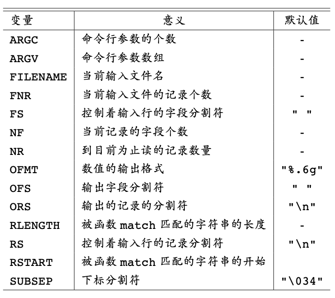

# AWK

awk 常用于机械化的数据处理工作中： 改变数据格式, 验证数据的有效性, 搜索特定的数据项, 求和, 打印报表等

> 实际上, awk 是一个通用编程工具

## 运行 AWK 程序

```
awk [ -F fs ] [ -v var=value ] [ 'prog' | -f progfile ] [ file ...  ]
```

如果命令行省略输入文件，在这种情况下, awk 会将 program 应用到你接下来在终端输入的内容上面, 直到键入一个文件结束标志 (Unix 系统是组合键 Control-d)。

命令行中的程序被单引号包围. 这个规定可以防止程序中的字符 (例如 $) 被 shell 解释, 也可以让程序的长度多于一行.

## AWK 程序结构

每一个 awk 程序都是由一个或多个 **模式–动作** 语句组成的序列:

```awk
pattern { action } 
pattern { action } 
...
```

awk 的基本操作是在由输入行组成的序列中, 陆续地扫描每一行。每一个输入行轮流被每一个模式测试. 每匹配一个模式, 对应的动作 (可能包含多个步骤) 就会执行. 然后 下一行被读取, 匹配重新开始. 这个过程会一起持续到所有的输入被读取完毕为止。

> 特殊的模式 `BEGIN` 在第一个输入文件的第一行之前被匹配, `END` 在最后一个输入文件的最后一行被处理 之后匹配

在一个 **模式–动作** 语句中, 模式或动作可以省略其一, 但不能两者同时被省略. 如果一个模式没有动作，会将每一个匹配行 (也就是条件判断为真的行) 打印出来，也就是默认动作 `{ print }`。如果只有动作而没有模式，对于每一个输入行, 动作 (在这个例子里是打印第 1 个字段) 都会被执行.

> 因为模式与动作都是可选的, 所以用花括号将动作包围起来, 以便区分两者.

一个动作就是一个语句序列, 语句之间用分号或换行符分开.

在这些语句里, 不仅可以 使用内建变量, 比如 NF, 还可以自己定义变量, 这些变量可以用来计算, 存储数据等. 在 awk 中, 用户创建的变 量不需要事先声明就可以使用.

空行会被忽略
一个注释以井号 (#) 开始, 以换行符结束,
一条长语句可以分散成多行, 只要在断行处插入一个反斜杠即可

## 模式


模式汇总:

1. `BEGIN{ statements}`   
    在输入被读取之前, statements 执行一次.
2. `END{ statements}`   
    当所有输入被读取完毕之后, statements 执行一次.
3. `expression{ statements}`   
    每碰到一个使 expression 为真的输入行, statements 就执行. expression 为真指的是其值非零或非空.
4. `/regular expression/ { statements}`   
    当碰到这样一个输入行时, statements 就执行: 输入行含有一段字符串, 而该字符串可 以被 regular expression 匹配.
5. `compound pattern { statements}`   
    一个复合模式将表达式用 &&(AND), ||(OR), !(NOT), 以及括号组合起来; 当 com-pound pattern 为真时, statements 执行.
6. `pattern1, pattern2 { statements}`   
    一个范围模式匹配多个输入行, 这些输入行从匹配 pattern1 的行开始, 到匹配 pattern2 的行结束 (包括这两行), 对这其中的每一行执行 statements

> BEGIN 与 END 不与其他模式组合. 一个范围模式不能是其他模式的一部分. BEGIN 与 END 是唯一两个不能省略动作的模式.

如果有多个 BEGIN, 与其关联的动作会按照它们在程序中出现的顺序执行, 这种行为对多个 END 同样 适用. 我们通常将  BEGIN 放在程序开头, 将 END 放在程序末尾, 虽然这并不是强制的.

BEGIN 的一个常见用途是更改输入行被分割为字段的默认方式. 分割字符由一个内建变量 `FS` 控制. 默认情况下字段由空格或 (和) 制表符分割, 此时 FS 的值被设置为一个空格符. 将 `FS` 设置成一个非空格字符, 就会使该字符成为字段分割符.

任意一个表达式都可以当作模式来使用。如果一个作为模式使用的表达式, 对当前输入行的求值结果非零或不为空, 那么该模式就匹配该行。

在一个关系比较中, 如果两个操作数都是数值, 关系比较将会按照数值比较进行; 否则的话, 数值操作数会被转换成字符串, 再将操作数按字符串的形式进行比较。只有当两个字段都是数值时, 比较才会以数值的形式进行。

### 字符串匹配模式

一个字符串匹配模式 (string-matching pattern) 测试一个字符串是否包含一段可以被正则表达式匹配的子字符串.

1. `/regexpr/`   
    如果当前输入行包含一段能够被 regexpr 匹配的子字符串, 则该模式被匹配.
2. `expression ~ /regexpr/`   
    如果 expression 的字符串值包含一段能够被 regexpr 匹配的子字符串, 则该模式被匹 配.
3. `expression !~ /regexpr/`   
    如果 expression 的字符串值不包含能够被 regexpr 匹配的子字符串, 则该模式被匹配.

> 在 ~ 与 !~ 的语境中, 任意一个表达式都可以用来替换 /regexpr/.

### 范围模式

一个范围模式由两个被逗号分开的模式组成, 正如 `pat1, pat2`

一个范围模式匹配多个输入行, 这些输入行从匹配 `pat1` 的行开始, 到匹配 `pat2` 的行结束, 包括这两行。如果范围模式的第二个模式一直都没有匹配到某个输入行, 那么范围模式会一直匹配到输入结束

## 动作


### 内建变量



字段 变量与其他变量相比没什么不同 — 它们也可以用在算术或字符串运算中, 也可以被赋值.

值得注意的是: 如果 `$0` 发生了改变 (通过赋值或替换), 那么 `$1`, `$2` 等等, 以及 `NF` 就会被重新计算; 同样的道理, 当 `$1` (或 `$2` 等) 被修改了, `$0` 就会被重新构造, 构造的方式是使用 `OFS` 重新分割字段.

字段也可以通过表达式指定. 例如, `$(NF-1)` 表示当前输入行的倒数第 2 个字段. 
如果字段变量引用到了不存在的字段, 例如 `$(NF+1)`, 那么它的值就是初始值-空字符串. 可以通过向一个字段变量赋值来创建它. 

awk 的具体实现通常将字段数上限设置为 100.

当 awk 在运行状态下创建一个字段时, 会自动将它的类型设置为字符串; 另外, 如果字段包含一个机器可识别的数, 它也会给这个字段设置一个数值类型.

### 表达式


每个变量都会默认初始化为空字符串 "" 或数 值 0.

一个赋值语句是一个表达式; 整个表达式的值是左边的变量的新值

#awk 的数据只有两种类型: 数值与由字符组成的字符串。有两种惯用语法可以将表达式从一种类型转换成另一种类型:
- `number ""` 将空字符串拼接到 number 可以将它强制转换成字符串;
- `string + 0` 给字符串加上零可以把它强制转换成数值.

**字符串运算符**：Awk 中只有一种字符运算符 — 拼接. 拼接并没有显式的运算符, 通过陆续写出字符串常量, 变量, 数组元素, 函数返回值, 与其他表达式, 就可以创建一个字符串. 程序 `{ print NR ":" $0 }`

**用作正则表达式的字符串**: 任意一个表达式都可以用作匹配运算符的右操作数. 

```awk
BEGIN { digits = "^[0-9]+$" }
$2 ~ digits
```

### 内建算术函数


### 内建字符串函数


### 表达式运算符


### 流程控制语句


### 数组

Awk 提供了一维数组, 用于存放字符串与数值. 数组与数组元素都不需要事先声明.

Awk 的数组与大多数其他语言最大的不同点是, **数组元素的下标是字符串**. 这个特性使得 awk 具有了一种能力, 这种能力类似于 SNOBOL4 表格的关联内存, 也由于这个原因, awk 的数组称为 `关联数组` (associative arrays).

```
# 判断某个值是否是数组的下标
if ("Africa" in pop)

# 循环删除数组 pop 中所有的元素: 
for (i in pop)
    delete pop[i]

# 多维数组
for (i = 1; i <= 10; i++)
    for (j = 1; j <= 10; j++)
        arr[i, j] = 0

# 测试一个多维下标是否是某个数组的成员
if ((i,j) in arr)
```

在 awk 内部, 下标其实是以字符串的形式存储的, 字符串具有形式 `1 SUBSEP 1`, `1 SUBSEP 2` 等等. 内建变量 `SUBSEP` 用 于分隔下标的各个构成成分, 它的默认值是 "\034", 而不是逗号, 之所以使用 "\034" 是因为这个字符不太可能出现在通常的文本中.

### 用户自定义函数

```awk
function name(parameter-list) { 
    statements
}
```

函数定义可以出现在任何 模式–动作 语句可以出现的地方. 于是, awk 程序的通常形式就变成了一系列的, 由换行符或分号分开的 模式–动作 语句与函数定义.

调用函数时, 函数名与左括号之间不能留有空白.

函数操作的是变量的拷贝, 在函数体内部, 参数是局部变量, 其他所有的变量都是全局的. 参数列表中没有实际参数对应的参数都将作为局部变量使用, 初始值为空值. 虽然这种设计不是非常优雅, 但至少为语言提供了必要的能力. 我们在参数与局部变量之间多放置几个空格, 以区分它们.

### 输出


文件名必须用双引号括起来, 文件名也可以是表达式或变量

在程序运行期间, 文件或管道只被打开一次. 如果文件或管道被显式地关闭, 而后面又使用到了, 那么它们就会被重新打开.


### 输入

如果没有指定输入文件, awk 就从它的标准输入读取数据; 所以, 另一种常用的方法是把另 一个程序的输出以管道的方式输送给 awk.

```bash
egrep 'Asia' countries | awk 'program'
```


因为对于不存在的文件, getline 返回 -1

```
while (getline <"file" > 0) ... # safe
```

命令行变量赋值:

```bash
awk 'program' f1 f2 ...
awk -f progfile f1 f2 ...
awk -Fsep 'program' f1 f2 ... awk -Fsep -f progfile f1 f2 ...
```

f1, f2 等变量是命令行参数, 通常代表文件名. 如果一个文件名具有形式 `var=text`, 那这就表示赋值语句, 把 text 赋值给 var, 当这个参数被当作文件来访问时, 执行赋值 动作. 这种类型的赋值语句允许程序在读文件之前或之后改变变量的值.

```awk
# 回射它的命令行参数:
# echo - print command-line arguments
BEGIN {
    for (i = 1; i < ARGC; i++)
        printf "%s ", ARGV[i]
    printf "\n"
}
```

### 与其他程序的交互

内建函数 system(expression) 用于执行命令, 命令由 expression 给出, system 的返回值 就是命令的退出状态.


## 实用一行手册

```awk
# 输入行的总数
END { print NR }
# 打印第 10 行
NR == 10
# 打印每一个输入行的最后一个字段
{ print $NF }
# 打印最后一行的最后一个字段
{ field = $NF }
END { print field }
# 打印字段数多于 4 个的输入行
NF > 4
# 打印最后一个字段值大于 4 的输入行
$NF > 4
# 打印所有输入行的字段数的总和
{ nf = nf + NF }
END { print nf }
# 打印包含 Beth 的行的数量
/Beth/ { nlines = nlines + 1 }
END { print nlines }
# 打印具有最大值的第一个字段, 以及包含它的行 (假设 $1 总是 正的)
$1 > max { max = $1; maxline = $0 }
END { print max, maxline }
# 打印至少包含一个字段的行
NF > 0
# 打印长度超过 80 个字符的行
length($0) > 80
# 在每一行的前面加上它的字段数
{ print NF, $0 }
# 打印每一行的第 1 与第 2 个字段, 但顺序相反
{ print $2, $1 }
# 交换每一行的第 1 与第 2 个字段, 并打印该行
{ temp = $1; $1 = $2; $2 = temp; print }
# 将每一行的第一个字段用行号代替
{ $1 = NR; print }
# 打印删除了第 2 个字段后的行
{ $2 = ""; print }
# 将每一行的字段按逆序打印
{ for (i = NF; i > 0; i++) printf("%s", $i)
  printf("\n")
}
# 打印每一行的所有字段值之和
{ sum = 0
  for (i = 1; i <= NF; i++) sum += $i
  print sum
}
# 将所有行的所有字段值累加起来
{ for (i = 1; i <= NF; i++) sum += $i }
END { print sum }
# 将每一行的每一个字段用它的绝对值替换
{ for (i = 1; i <= NF; i++) if ($i < 0) $i = -$i 
  print
}
```


