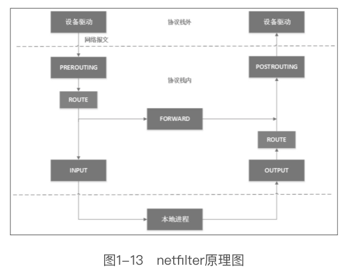
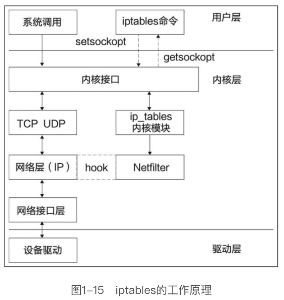
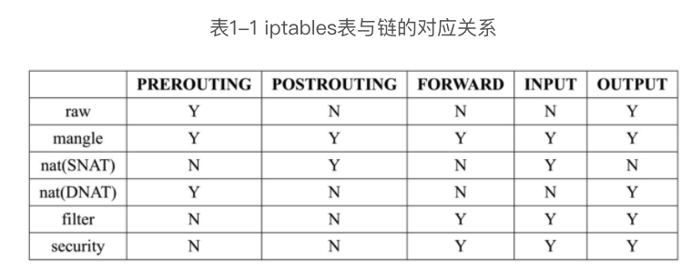
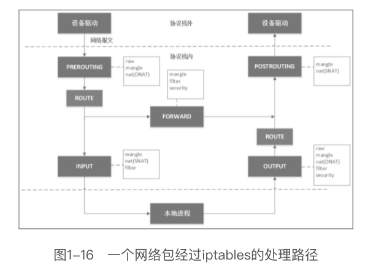

# 防火墙

## netfilter

Linux 内核 2.4 版本网络模块引入了 `netfilter` 子系统，整个 Linux 系统的网络安全都是在 netfilter 之上构建的

netfilter 的架构就是在整个网络流程的若干位置放置一些钩子，并在每个钩子挂在挂载一些处理函数进行处理



## iptables

`iptables` 是基于 netfilter 构建的用户态程序。



### 三板斧: chain, table , rule

#### chain

iptables 的 5 条内置链，对应 netfilter 的 5 个钩子

- `INPUT` 链：一般用于处理输入本地进程的数据包；
- `OUTPUT` 链：一般用于处理本地进程的输出数据包；
- `FORWARD` 链：一般用于处理转发到其他机器/network namespace的数据包；
- `PREROUTING` 链：可以在此处进行 DNAT；
- `POSTROUTING` 链：可以在此处进行 SNAT。

> 除了系统预定义的这 5 条 iptables 链，用户还可以在表中定义自己的链

#### table

- `filter` 表：用于控制到达某条链上的数据包是继续放行、直接丢弃（drop）或拒绝（reject）；
- `nat` 表：用于修改数据包的源和目的地址；
- `mangle` 表：用于修改数据包的IP头信息；
- `raw` 表：iptables 是有状态的，即 iptables 对数据包有连接追踪（connectiontracking）机制，而raw是用来去除这种追踪机制的；
- `security` 表：最不常用的表（通常，我们说iptables只有4张表，security表是新加入的特性），用于在数据包上应用SELinux。

不是每个链上都能挂表，iptables表与链的对应关系





iptables 的表是来分类管理 iptables 规则（rule）的，系统所有的 iptables 规则都被划分到不同的表集合中

#### rule

iptables 的规则是用户真正要书写的规则。

一般情况下，一条 iptables 规则包含两部分信息：匹配条件和动作。
匹配条件很好理解，即匹配数据包被这条iptables规则“捕获”的条件，例如协议类型、源IP、目的IP、源端口、目的端口、连接状态等。
每条iptables规则允许多个匹配条件任意组合，从而实现多条件的匹配，多条件之间是逻辑与（&&）关系。

常见的工作:

- DROP：直接将数据包丢弃，不再进行后续的处理。应用场景是不让某个数据源意识到你的系统的存在，可以用来模拟宕机；
- REJECT：给客户端返回一个connection refused或destination unreachable报文。
- QUEUE：将数据包放入用户空间的队列，供用户空间的程序处理；
- RETURN：跳出当前链，该链里后续的规则不再执行；
- ACCEPT：同意数据包通过，继续执行后续的规则；
- JUMP：跳转到其他用户自定义的链继续执行。

### 常用命令

- 查看规则

    ```bash
    # 查看 filter 表所有规则, -n 使用 IP，-v 输出详细信息
    iptables -L -n -v

    # 查看 nat 表所有规则
    iptables -t nat -L -n -v
    ```

- 配置默认规则

    ```bash
    # 默认不让进
    iptables --policy INPUT DROP
    # 默认不允许转发
    iptables --policy FORWARD DROP
    # 默认可以出去
    iptables --policy OUTPUT ACCEPT
    ```

- 配置防火墙

    语法: `iptables [-AI 链名] [-io 网卡] [-p 协议] [-s 来源IP/网域] [--sport 来源端口] [-d 目标IP/网域] [--dport 目标端口] [-m state --state 包的状态] -j [ACCEPT |DROP|REJECT|LOG]`

    > -A : 在 chain 的后面新增规则  
    > -I : 在 chain 的前面新增规则  
    > -i : 从哪个网卡进来的  
    > -o : 要从哪个网卡出去的  
    > -p : 协议，tcp、udp、icmp、all  
    > -m : 使用插件,常见的有 state , mac  
    > --state: 包的状态，INVALID(无效), ESTABLISHED(已经连接成功),NEW(想要新建连接),RELATED(发出的包的回应)

    ```bash
    # 只要是来自内网的(192.168.100.0/24)的封包通通接受
    iptables -A INPUT -i eth1 -s 192.168.100.0/24 -j ACCEPT 
    # 多个端口
    iptables -A INPUT -i eth0 -p udp --dport 137:139 -j ACCEPT
    # 允许 SSH 连接
    iptables -A INPUT -s 10.20.30.40/24 -p tcp --dport 22 -j ACCEPT
    # 阻止来自某个 IP/网段 的所有连接
    iptables -A INPUT -s 10.10.10.10 -j DROP
    # 端口转发, 80 端口的包转发给 8080 端口
    iptables -t nat -A PERROUTING -i eth0 -p tcp --dport 80 -j REDIRECT --to-port 8080
    # 已建立或相关封包予以通过
    iptables -A INPUT -m state --state RELATED,ESTABLISHED -j ACCEPT
    # 禁用 ping
    iptables -A INPUT -p icmp -j DROP
    # 创建自定义链
    iptables -N BAR
    ```

- DNAT

    ```bash
    iptables -t nat -A PERROUTING -d 1.2.3.4 -p tcp --dport 80 -j DNAT --to-destination 10.20.30.40:8080
    ```

    > 当涉及转发的目的IP地址是外机时，需要确保启用ip forward功能，即把Linux当交换机用，启用命令: `echo 1 > /proc/sys/net/ipv4/ip_forward`

- SNAT

    SNAT根据指定条件修改数据包的源IP地址，即DNAT的逆操作。与DNAT的限制类似，SNAT策略只能发生在nat表的POSTROUTING链

    ```bash
    iptables -t nat -A POSTROUTING -s 192.168.1.2 -j SNAT --to-source 10.172.16.1
    # 使用网卡地址替换源地址
    iptables -t nat -A POSTROUTING -s 192.168.1.2 -o eth0 -j MASQUERADE
    ```

- 保存与恢复

    上述方法对iptables规则做出的改变是临时的，重启机器后就会丢失。如果想永久保存这些更改，则需要运行以下命令

    ```bash
    iptables-save
    # 保存时输出到一个文件中，以便于恢复
    iptables-save > iptables.bak
    # 恢复
    iptables-restore < iptables.bak
    ```

- 清理规则

    ```bash
    # 清理 filter 所有规则
    iptables -F
    # 清理 nat 所有规则
    iptables -t nat -F
    # 清理所有自定义链
    iptables -X
    # 将所有 chain 的计数与流量统计都归零
    iptables -Z
    ```


### 应用

Docker 和 Kubernetes 的网络模块大量使用了 iptables 来做路由处理

## TCP Wrapper

Super daemon 管理的系统服务还可以通过 TCP Wrapper 来进行防护

操作起来很简单，就是在 `/etc/hosts.deny` 和 `/etc/hosts.allow`

格式: `<service(program_name)> : <IP, domain, hostname> `

例如:

`hosts.allow`

```
# 本机可以调用本机所有的服务
ALL: 127.0.0.1 
# rsync 只允许部分网段和特定主机调用
rsync: 192.168.1.0/255.255.255.0 10.0.0.100
```

`hosts.deny`

```
# 将某个主机拉入黑名单
ssh: 192.168.1.2
```


## References

- [防火牆與 NAT 伺服器](http://linux.vbird.org/linux_server/0250simple_firewall.php)