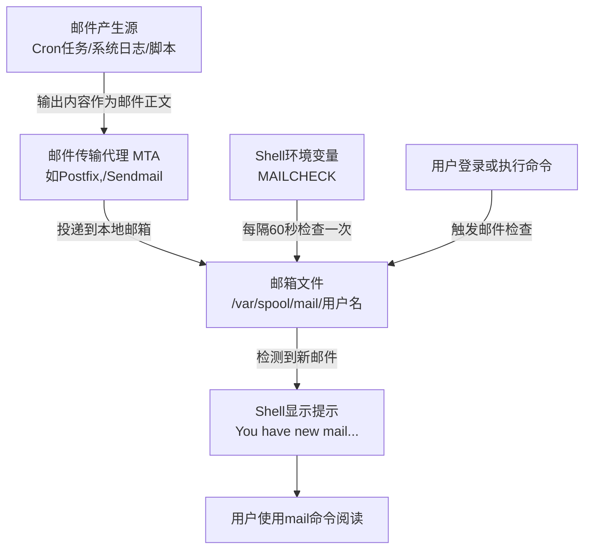

# Linux 系统邮件通知机制：解读 “You have new mail” 及其用法

作为 Linux 用户，你或许在某个清晨登录服务器时，突然在控制台看到一行神秘提示：

```
You have new mail in /var/spool/mail/root
```

这既不是错误，也不是系统故障，而是 Linux 一个历史悠久、默默工作的**系统邮件通知机制**。今天我们就来彻底搞懂：这些邮件从哪来？为什么会出现？以及如何优雅地管理它们。

## 一、机制原理：系统邮件的诞生与提示

Linux 系统内部有一套轻量级的邮件系统，用于将后台程序、定时任务、日志事件等信息以“邮件”的形式发送给本地用户（尤其是 root）。整个过程可以用下面这张流程图清晰概括：



### 1. 邮件从哪来？——三个主要来源

- **定时任务（Cron）**：这是最常见的源头。系统通过 `crontab` 执行的周期性任务，其标准输出和错误输出都会被捕获，并作为邮件发送给任务所有者。如果没有重定向，root 会收到大量 cron 邮件。
- **系统日志与告警**：某些服务（如 `logwatch`、`fail2ban`、磁盘监控脚本）在检测到异常时，会主动发送邮件给管理员。
- **用户脚本或命令**：当你运行一个后台脚本，且输出未被重定向时，也可能触发邮件通知。

### 2. 提示如何出现？——Shell 的定期检查

Shell（bash 等）通过两个环境变量控制新邮件提示：

- `MAIL`：指定邮箱文件路径，默认通常是 `/var/spool/mail/$USER`（例如 root 用户的 `/var/spool/mail/root`）。
- `MAILCHECK`：检查间隔（秒），默认为 `60`。每隔 60 秒，Shell 会检查该文件是否发生变化（如文件大小或修改时间）。一旦发现新邮件，便会在你执行下一条命令后，显示提示信息。

这个机制轻量且不侵入，既不会打断你的工作，又能及时提醒。

## 二、如何处理这些邮件？——`mail` 命令交互指南

既然收到了邮件，就要去查看。Linux 自带 `mail` 命令（属于 `mailx` 或 `mailutils` 包），是阅读系统邮件的标准工具。

### 1. 进入邮件界面

直接在终端输入：

```bash
mail
```

如果邮箱中有邮件，你会看到类似这样的列表：

```
Mail version 8.1 6/6/93.  Type ? for help.
"/var/spool/mail/root": 5 messages 3 new
>N  1 root@server        Wed Apr  2 10:15  45/1234  "Cron test run"
 N  2 root@server        Wed Apr  2 11:20  32/987   "Disk usage warning"
 U  3 root@server        Wed Apr  2 12:05  28/756   "Logwatch for server"
```

- `N` 表示新邮件（未读）
- `U` 表示已读但未删除
- `>` 表示当前邮件

此时提示符变为 `&`，等待你输入命令。

### 2. 最常用的操作命令

| 命令 | 说明 | 示例 |
|------|------|------|
| `h` 或 `headers` | 重新显示邮件列表 | `h` |
| `<编号>` | 阅读指定编号的邮件 | `3` |
| `n` 或 `next` | 阅读下一封邮件 | `n` |
| `d <编号>` | 删除邮件（支持范围，如 `d 2-5`） | `d 1` |
| `u <编号>` | 撤销删除（在退出前有效） | `u 1` |
| `s <编号> <文件名>` | 将邮件保存到文件（含头部） | `s 3 backup.txt` |
| `w <编号> <文件名>` | 仅保存邮件正文（无头部） | `w 3 clean.txt` |
| `R` | 回复发件人（会调用编辑器） | `R` |
| `m <邮箱地址>` | 发送新邮件 | `m admin@example.com` |
| `q` | 退出并应用更改（删除的邮件永久移除） | `q` |
| `x` 或 `exit` | 放弃所有更改，原样退出 | `x` |
| `?` 或 `help` | 显示帮助 | `?` |

#### 典型操作流程示例

```bash
# 进入邮件
mail
& h                     # 查看邮件列表
& 2                     # 阅读第2封邮件
& d 2                   # 删除它
& 1                     # 阅读第1封
& s 1 important.log     # 保存到文件
& q                     # 退出，删除生效
```

### 3. 其他实用小技巧

- **临时执行 Shell 命令**：在 `&` 提示符下输入 `!ls` 可以列出当前目录，完成后按回车返回 `mail`。
- **保留邮件在系统邮箱**：使用 `pre <编号>` 可以阻止邮件在退出时被自动移到 `~/mbox`（默认归档文件）。
- **直接发送邮件而不进入交互**：`echo "正文" | mail -s "主题" root`。

## 三、是否需要关心这些邮件？

**答案是：不要直接忽略。** 系统邮件往往包含重要的运维信息：

- **Cron 任务错误**：例如备份脚本失败、磁盘清理异常。
- **安全告警**：多次失败的登录尝试、关键服务重启。
- **资源预警**：磁盘使用率超过阈值、内存不足。

当然，有些邮件可能只是例行报告（如 `logwatch` 每日摘要）。定期查看、筛选并清理，有助于保持系统健康，也能避免邮箱文件过大占用 inode。

## 四、进阶：让邮件通知更可控

如果你觉得频繁的邮件提示很烦，可以采取以下策略：

1. **重定向 cron 输出**：在 crontab 中将输出重定向到日志文件或 `/dev/null`，例如：
   ```cron
   0 2 * * * /usr/local/bin/backup.sh > /var/log/backup.log 2>&1
   ```

2. **设置 MAILCHECK 为更大的值**：在 `~/.bashrc` 中增加：
   ```bash
   export MAILCHECK=600   # 每10分钟检查一次
   ```

3. **禁止特定 cron 任务发送邮件**：在 crontab 行首添加 `MAILTO=""`。

4. **使用更现代的日志监控**：如 `journald` + `logwatch` 或 `Prometheus` + `Alertmanager` 替代传统系统邮件。

## 五、总结

Linux 的系统邮件机制虽然古老，但仍然是系统通知体系中可靠、轻量的一环。当你下次看到 “You have new mail” 时，可以从容地输入 `mail` 并查看那些潜藏在 `/var/spool/mail/root` 里的重要信息。掌握 `mail` 命令的几个核心操作，你就能轻松管理这些系统邮件，既不错过告警，也不被冗余信息淹没。