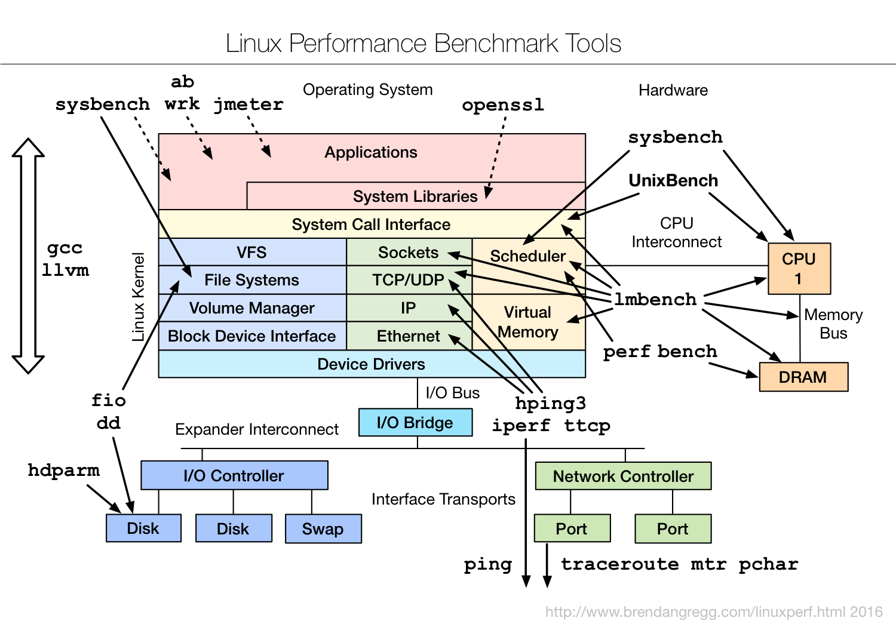
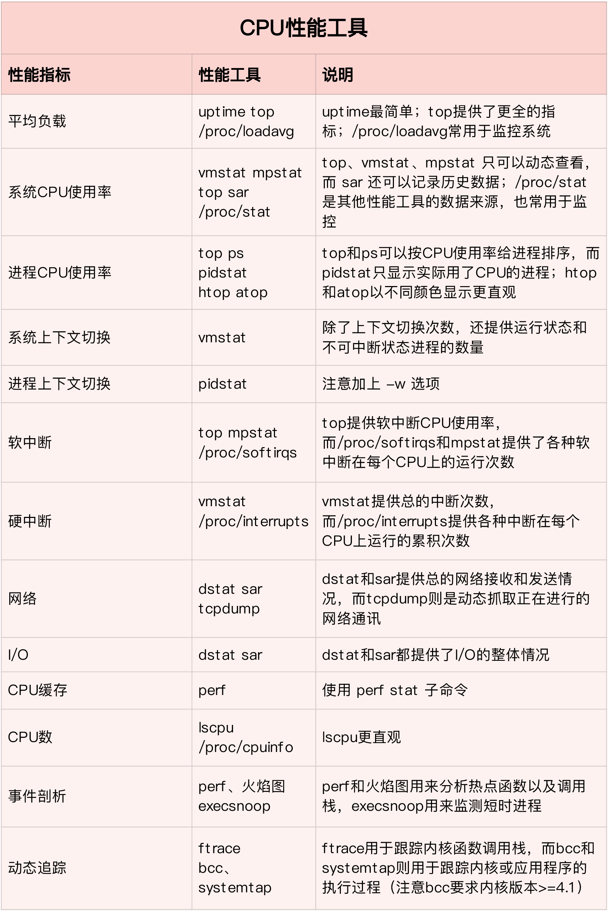
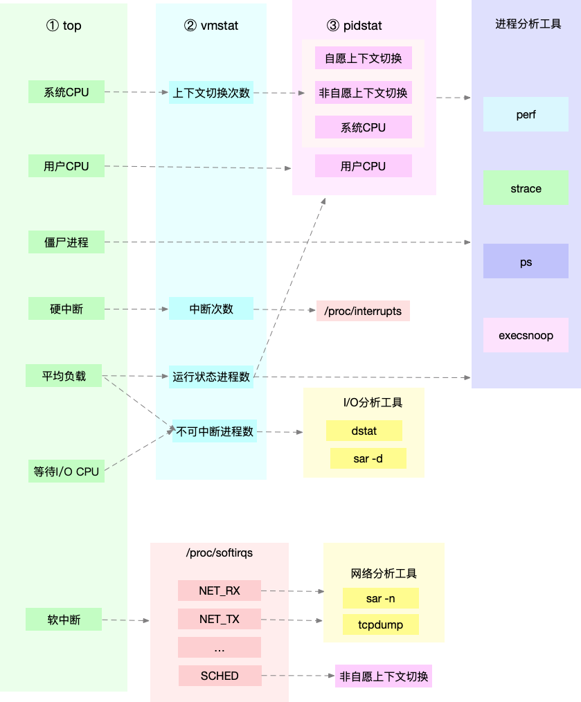
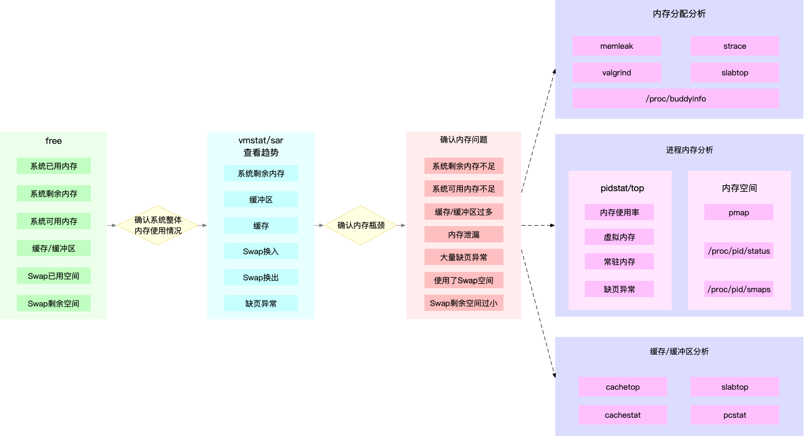
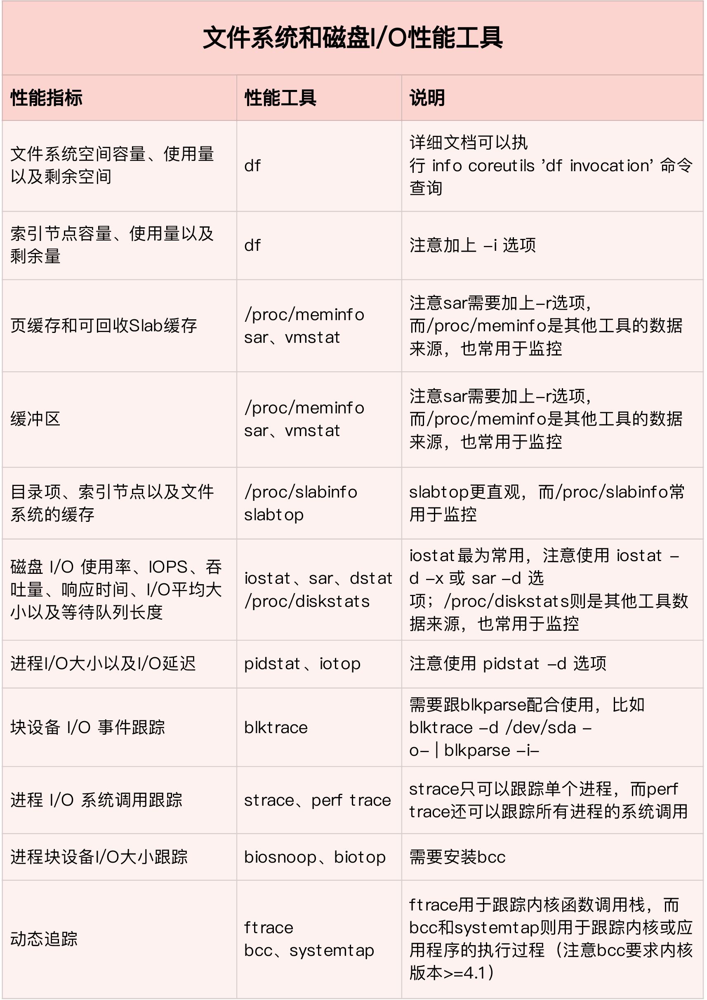
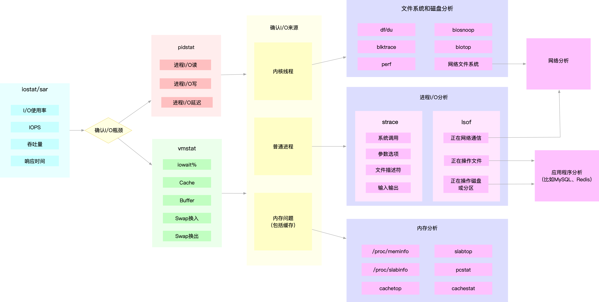
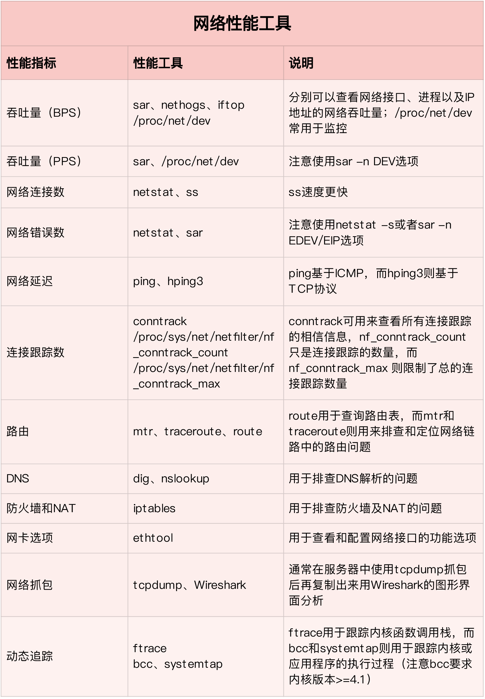
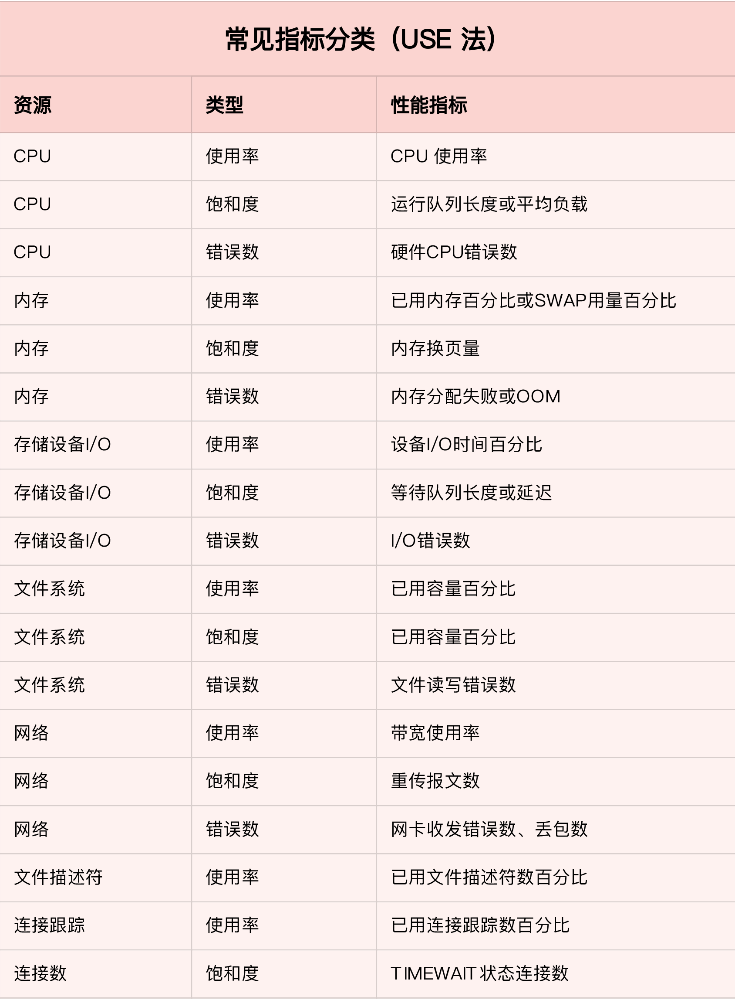

# Linux 性能分析

## 安装常用观测工具

```bash
yum install -y sysstat
yum install -y strace
yum install -y procps
yum install -y coreutils
```

## 了解系统性能概况（**性能分析第一分钟要执行的 10 个命令**）

```bash
uptime
dmesg | tail
vmstat 1
mpstat -P ALL 1
pidstat 1
iostat -xz 1
free -m
sar -n DEV 1
sar -n TCP,ETCP 1
top
```

## CPU Profile

### 追踪

```bash
# 实时追踪进程的系统调用，ttt：time(us) since epoch, -T: syscall tims(s)
strace -tttT -p `pgrep lab002`
```

### 动态追踪

```bash
# objdump -tT /bin/bash | grep readline
00000000007003f8 g    DO .bss	0000000000000004  Base        rl_readline_state
0000000000499e00 g    DF .text	00000000000001c5  Base        readline_internal_char
00000000004993d0 g    DF .text	0000000000000126  Base        readline_internal_setup
000000000046d400 g    DF .text	000000000000004b  Base        posix_readline_initialize
000000000049a520 g    DF .text	0000000000000081  Base        readline
[...]
```

```bash
# bpftrace -e 'uretprobe:/bin/bash:readline { printf("read a line\n"); }'
Attaching 1 probe...
read a line
read a line
read a line
^C
```

## 工具


bpf


基础测试工具



## 系统资源性能分析

从系统资源瓶颈的角度来说，USE 法是最为有效的方法，即从使用率、饱和度以及错误数这三个方面，来分析 CPU、内存、磁盘和文件系统 I/O、网络以及内核资源限制等各类软硬件资源。

### CPU 性能分析

#### 性能指标


##### 平均负载

平均负载是指单位时间内，系统处于可运行状态和不可中断状态的平均进程数，也就是平均活跃进程数，它和CPU使用率并没有直接关系。

所谓可运行状态的进程，是指正在使用CPU或者正在等待CPU的进程，也就是我们常用ps命令看到的，处于`R`状态（`Running` 或 `Runnable`）的进程。

不可中断状态的进程则是正处于内核态关键流程中的进程，并且这些流程是不可打断的，比如最常见的是等待硬件设备的I/O响应，也就是我们在ps命令中看到的`D`状态（`Uninterruptible Sleep`，也称为Disk Sleep）的进程。

平均负载最理想的情况是等于 CPU个数。真实场景，平均负载高于 CPU 数量 `70%` 的时候，你就应该分析排查负载高的问题了

> `lscpu` 或者 `cat /proc/cpuinfo` 可查看cpu个数


平均负载提供了一个快速查看系统整体性能的手段，反映了整体的负载情况。但只看平均负载本身，我们并不能直接发现，到底是哪里出现了瓶颈。所以，在理解平均负载时，也要注意：

- 平均负载高有可能是 CPU 密集型进程导致的；

- 平均负载高并不一定代表 CPU 使用率高，还有可能是 I/O 更繁忙了；

当 `uptime` 发现负载高的时候，你可以使用 `mpstat`、`pidstat` 等工具，辅助分析负载的来源。

```bash
# -d 参数表示高亮显示变化的区域
watch -d uptime

# 查看各 CPU 情况。-P ALL 表示监控所有CPU，后面数字5表示间隔5秒后输出一组数据
mpstat -P ALL 5

# 查看各进程情况。间隔5秒后输出数据，-u表示CPU指标
pidstat -u 5
```

##### CPU 上下文切换

系统调用切换：保存寄存器
进程上下文切换：保存虚拟内存，栈，全局变量，内核堆栈，寄存器。虚拟内存的 TLB 也会被刷新。
线程上下文切换：保存栈，内核堆栈，寄存器
中断上下文切换：中断上下文切换并不涉及到进程的用户态。所以，即便中断过程打断了一个正处在用户态的进程，也不需要保存和恢复这个进程的虚拟内存、全局变量等用户态资源。中断上下文，其实只包括内核态中断服务程序执行所必需的状态，包括CPU 寄存器、内核堆栈、硬件中断参数等。

不管是哪种场景导致的上下文切换，你都应该知道：

- CPU 上下文切换，是保证 Linux 系统正常工作的核心功能之一，一般情况下不需要我们特别关注。

- 但过多的上下文切换，会把CPU时间消耗在寄存器、内核栈以及虚拟内存等数据的保存和恢复上，从而缩短进程真正运行的时间，导致系统的整体性能大幅下降。

查看系统整体的上下文切换情况

```bash
# 每隔5秒输出1组数据
vmstat 5
```

需要特别关注的四列内容：

- cs（context switch）是每秒上下文切换的次数。

- in（interrupt）则是每秒中断的次数。

- r（Running or Runnable）是就绪队列的长度，也就是正在运行和等待CPU的进程数。

- b（Blocked）则是处于不可中断睡眠状态的进程数。

查看各进程上下文切换情况

```bash
# -w 展示进程上下文切换情况。
pidstat -w 5

# -wt 展示线程上下文切换情况
pidstat -wt 1
```

- cswch ，表示每秒自愿上下文切换（voluntary context switches）的次数。是指进程无法获取所需资源，导致的上下文切换
- nvcswch ，表示每秒非自愿上下文切换（non voluntary context switches）的次数。是指进程由于时间片已到等原因，被系统强制调度，进而发生的上下文切换。说明进程较多

每秒上下文切换多少次才算正常呢？

这个数值其实取决于系统本身的 CPU 性能。在我看来，如果系统的上下文切换次数比较稳定，那么从数百到一万以内，都应该算是正常的。但当上下文切换次数超过一万次，或者切换次数出现数量级的增长时，就很可能已经出现了性能问题。

这时，你还需要根据上下文切换的类型，再做具体分析。比方说：

- 自愿上下文切换变多了，说明进程都在等待资源，有可能发生了 I/O 等其他问题；

- 非自愿上下文切换变多了，说明进程都在被强制调度，也就是都在争抢 CPU，说明 CPU 的确成了瓶颈；

- 中断次数变多了，说明 CPU 被中断处理程序占用，还需要通过查看 /proc/interrupts 文件来分析具体的中断类型。

##### CPU 使用率

```bash
# 只保留各个CPU的数据
cat /proc/stat | grep ^cpu
```

CPU 的数据记录在 `/proc/stat`，里面是节拍数的累计值。各列的含义可通过 `man proc` 查看。

`CPU 使用率 = 1 - 空闲时间 / 总 CPU 时间`

为了计算 CPU 使用率，性能工具一般都会取间隔一段时间（比如3秒）的两次值，作差后，再计算出这段时间内的平均 CPU 使用率

> Linux 也给每个进程提供了运行情况的统计信息，也就是 `/proc/[pid]/stat`

> top 和 ps 这两个工具报告的 CPU 使用率，默认的结果很可能不一样，因为 top 默认使用 3 秒时间间隔，而 ps 使用的却是进程的整个生命周期。

> 运行 top 命令，并按下数字 1 ，可切换到每个 CPU 的使用率


top 中的进程状态：

- `R` 是 Running 或 Runnable 的缩写，表示进程在 CPU 的就绪队列中，正在运行或者正在等待运行。
- `D` 是 Disk Sleep 的缩写，也就是不可中断状态睡眠（Uninterruptible Sleep），一般表示进程正在跟硬件交互，并且交互过程不允许被其他进程或中断打断。
- `Z` 是 Zombie 的缩写，如果你玩过“植物大战僵尸”这款游戏，应该知道它的意思。它表示僵尸进程，也就是进程实际上已经结束了，但是父进程还没有回收它的资源（比如进程的描述符、PID 等）。
- `S` 是 Interruptible Sleep 的缩写，也就是可中断状态睡眠，表示进程因为等待某个事件而被系统挂起。当进程等待的事件发生时，它会被唤醒并进入 R 状态。
- `I` 是 Idle 的缩写，也就是空闲状态，用在不可中断睡眠的内核线程上。前面说了，硬件交互导致的不可中断进程用 D 表示，但对某些内核线程来说，它们有可能实际上并没有任何负载，用 Idle 正是为了区分这种情况。要注意，D 状态的进程会导致平均负载升高， I 状态的进程却不会。

> 其它状态详见 `man top`

发现 CPU 使用率过高，接下来就得找出占用 CPU 的代码

```bash
# 实时查看当前热点函数，-g 开启调用关系分析， -p 指定进程
perf top -g -p xxx

# 记录一段时间的热点函数
perf record -g -p xxx
# 查看记录的数据
perf report
```

每一行包含四列，分别是：

- `Overhead` ，是该符号的性能事件在所有采样中的比例，用百分比来表示。

- `Shared` ，是该函数或指令所在的动态共享对象（Dynamic Shared Object），如内核、进程名、动态链接库名、内核模块名等。

- `Object` ，是动态共享对象的类型。比如 `[.]` 表示用户空间的可执行程序、或者动态链接库，而 `[k]` 则表示内核空间。

- `Symbol` 是符号名，也就是函数名。当函数名未知时，用十六进制的地址来表示。

CPU 使用率是最直观和最常用的系统性能指标，更是我们在排查性能问题时，通常会关注的第一个指标。所以我们更要熟悉它的含义，尤其要弄清楚用户（%user）、Nice（%nice）、系统（%system） 、等待 I/O（%iowait） 、中断（%irq）以及软中断（%softirq）这几种不同 CPU 的使用率。比如说：

- 用户 CPU 和 Nice CPU 高，说明用户态进程占用了较多的 CPU，所以应该着重排查进程的性能问题。

- 系统 CPU 高，说明内核态占用了较多的 CPU，所以应该着重排查内核线程或者系统调用的性能问题。

- I/O 等待 CPU 高，说明等待 I/O 的时间比较长，所以应该着重排查系统存储是不是出现了 I/O 问题。

- 软中断和硬中断高，说明软中断或硬中断的处理程序占用了较多的 CPU，所以应该着重排查内核中的中断服务程序。

碰到 CPU 使用率升高的问题，你可以借助 top、pidstat 等工具，确认引发 CPU 性能问题的来源；再使用 perf 等工具，排查出引起性能问题的具体函数。

Linux 中的中断处理程序分为上半部和下半部：

- 上半部对应硬件中断，用来快速处理中断。

- 下半部对应软中断，用来异步处理上半部未完成的工作。

Linux 中的软中断包括网络收发、定时、调度、RCU锁等各种类型，可以通过查看 `/proc/softirqs` 来观察软中断的运行情况。

#### 性能工具



#### 分析思路



实际上，top、pidstat、vmstat 这类工具所汇报的 CPU 性能指标，都源自 `/proc `文件系统（比如`/proc/loadavg`、`/proc/stat`、`/proc/softirqs` 等）。这些指标，都应该通过监控系统监控起来。虽然并非所有指标都需要报警，但这些指标却可以加快性能问题的定位分析。

比如说，当你收到系统的用户 CPU 使用率过高告警时，从监控系统中直接查询到，导致 CPU 使用率过高的进程；然后再登录到进程所在的 Linux 服务器中，分析该进程的行为。

你可以使用 strace，查看进程的系统调用汇总；也可以使用 perf 等工具，找出进程的热点函数；甚至还可以使用动态追踪的方法，来观察进程的当前执行过程，直到确定瓶颈的根源。

### 内存性能分析

#### 性能指标


#### 性能工具

#### 分析思路



### 磁盘和文件系统I/O性能分析

#### 性能指标


#### 性能工具



#### 分析思路



### 网络性能分析

#### 性能指标


#### 性能工具



#### 分析思路


## 系统监控

### USE 法

USE 法把系统资源的性能指标，简化成了三个类别，即使用率、饱和度以及错误数。

- 使用率，表示资源用于服务的时间或容量百分比。100% 的使用率，表示容量已经用尽或者全部时间都用于服务。

- 饱和度，表示资源的繁忙程度，通常与等待队列的长度相关。100% 的饱和度，表示资源无法接受更多的请求。

- 错误数表示发生错误的事件个数。错误数越多，表明系统的问题越严重。



USE 方法只关注能体现系统资源性能瓶颈的核心指标，但这并不是说其他指标不重要。诸如系统日志、进程资源使用量、缓存使用量等其他各类指标，也都需要我们监控起来。只不过，它们通常用作辅助性能分析，而 USE 方法的指标，则直接表明了系统的资源瓶颈。

## References

- [动态追踪技术漫谈](https://blog.openresty.com.cn/cn/dynamic-tracing/)
- [工欲性能调优，必先利其器（1）](https://cn.pingcap.com/blog/iostat-perf-strace)
- [工欲性能调优，必先利其器（2）- 火焰图](https://cn.pingcap.com/blog/flame-graph)
- [性能分析大佬 Brendan Gregg](https://brendangregg.com/)
- [Linux 系统动态追踪技术介绍](https://blog.arstercz.com/introduction_to_linux_dynamic_tracing/)
- [Linux 性能分析前60s](https://netflixtechblog.com/linux-performance-analysis-in-60-000-milliseconds-accc10403c55)
- [USE Method: Linux Performance Checklist](https://brendangregg.com/USEmethod/use-linux.html)
- [Netflix at Velocity 2015: Linux Performance Tools](https://netflixtechblog.com/netflix-at-velocity-2015-linux-performance-tools-51964ddb81cf)
- [bpftrace uprobe](https://github.com/iovisor/bpftrace/blob/master/docs/reference_guide.md#3-uprobeuretprobe-dynamic-tracing-user-level)
- [Linux性能优化实战](https://learn.lianglianglee.com/%E4%B8%93%E6%A0%8F/Linux%E6%80%A7%E8%83%BD%E4%BC%98%E5%8C%96%E5%AE%9E%E6%88%98)