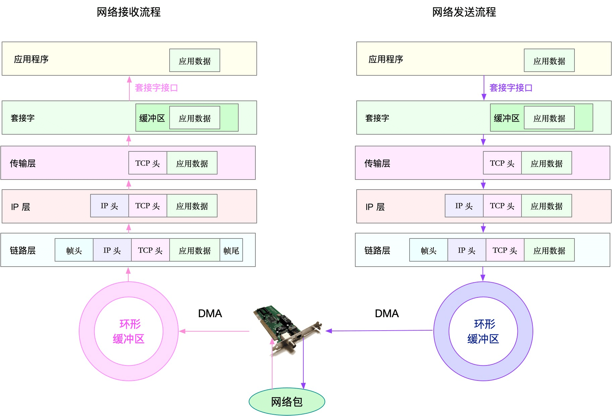

# Linux 性能分析

## 安装常用观测工具

```bash
yum install -y sysstat
yum install -y strace
yum install -y procps
yum install -y coreutils
```

## 了解系统性能概况（**性能分析第一分钟要执行的 10 个命令**）

```bash
uptime
dmesg | tail
vmstat 1
mpstat -P ALL 1
pidstat 1
iostat -xz 1
free -m
sar -n DEV 1
sar -n TCP,ETCP 1
top
```

## CPU Profile

### 追踪

```bash
# 实时追踪进程的系统调用，ttt：time(us) since epoch, -T: syscall tims(s)
strace -tttT -p `pgrep lab002`
```

### 动态追踪

```bash
# objdump -tT /bin/bash | grep readline
00000000007003f8 g    DO .bss	0000000000000004  Base        rl_readline_state
0000000000499e00 g    DF .text	00000000000001c5  Base        readline_internal_char
00000000004993d0 g    DF .text	0000000000000126  Base        readline_internal_setup
000000000046d400 g    DF .text	000000000000004b  Base        posix_readline_initialize
000000000049a520 g    DF .text	0000000000000081  Base        readline
[...]
```

```bash
# bpftrace -e 'uretprobe:/bin/bash:readline { printf("read a line\n"); }'
Attaching 1 probe...
read a line
read a line
read a line
^C
```


## 工具


bpf


基础测试工具


## 性能分析的一般步骤

从系统资源瓶颈的角度来说，`USE` 法是最为有效的方法，即从`使用率`、`饱和度`以及`错误数`这三个方面，来分析 CPU、内存、磁盘和文件系统 I/O、网络以及内核资源限制等各类软硬件资源。

从应用程序瓶颈的角度来说，我们可以把性能问题的来源，分为`资源瓶颈`、`依赖服务瓶颈`以及`应用自身瓶颈`这三类。

- 资源瓶颈跟系统资源瓶颈，本质是一样的。

- 依赖服务瓶颈，你可以使用全链路跟踪系统进行定位。

- 而应用自身的问题，你可以通过系统调用、热点函数，或者应用自身的指标监控以及日志监控等，进行分析定位。

值得注意的是，虽然把瓶颈分为了系统和应用两个角度，但在实际运行时，这两者往往是相辅相成、相互影响的。系统是应用的运行环境，系统的瓶颈会导致应用的性能下降；而应用的不合理设计，也会引发系统资源的瓶颈。做性能分析，就是要结合应用程序和操作系统的原理，揪出引发问题的真凶。

## 系统资源性能分析

### CPU 性能分析

#### 性能指标


##### 平均负载

平均负载是指单位时间内，系统处于可运行状态和不可中断状态的平均进程数，也就是平均活跃进程数，它和CPU使用率并没有直接关系。

所谓可运行状态的进程，是指正在使用CPU或者正在等待CPU的进程，也就是我们常用ps命令看到的，处于`R`状态（`Running` 或 `Runnable`）的进程。

不可中断状态的进程则是正处于内核态关键流程中的进程，并且这些流程是不可打断的，比如最常见的是等待硬件设备的I/O响应，也就是我们在ps命令中看到的`D`状态（`Uninterruptible Sleep`，也称为Disk Sleep）的进程。

平均负载最理想的情况是等于 CPU个数。真实场景，平均负载高于 CPU 数量 `70%` 的时候，你就应该分析排查负载高的问题了

> `lscpu` 或者 `cat /proc/cpuinfo` 可查看cpu个数


平均负载提供了一个快速查看系统整体性能的手段，反映了整体的负载情况。但只看平均负载本身，我们并不能直接发现，到底是哪里出现了瓶颈。所以，在理解平均负载时，也要注意：

- 平均负载高有可能是 CPU 密集型进程导致的；

- 平均负载高并不一定代表 CPU 使用率高，还有可能是 I/O 更繁忙了；

当 `uptime` 发现负载高的时候，你可以使用 `mpstat`、`pidstat` 等工具，辅助分析负载的来源。

```bash
# -d 参数表示高亮显示变化的区域
watch -d uptime

# 查看各 CPU 情况。-P ALL 表示监控所有CPU，后面数字5表示间隔5秒后输出一组数据
mpstat -P ALL 5

# 查看各进程情况。间隔5秒后输出数据，-u表示CPU指标
pidstat -u 5
```

##### CPU 上下文切换

系统调用切换：保存寄存器
进程上下文切换：保存虚拟内存，栈，全局变量，内核堆栈，寄存器。虚拟内存的 TLB 也会被刷新。
线程上下文切换：保存栈，内核堆栈，寄存器
中断上下文切换：中断上下文切换并不涉及到进程的用户态。所以，即便中断过程打断了一个正处在用户态的进程，也不需要保存和恢复这个进程的虚拟内存、全局变量等用户态资源。中断上下文，其实只包括内核态中断服务程序执行所必需的状态，包括CPU 寄存器、内核堆栈、硬件中断参数等。

不管是哪种场景导致的上下文切换，你都应该知道：

- CPU 上下文切换，是保证 Linux 系统正常工作的核心功能之一，一般情况下不需要我们特别关注。

- 但过多的上下文切换，会把CPU时间消耗在寄存器、内核栈以及虚拟内存等数据的保存和恢复上，从而缩短进程真正运行的时间，导致系统的整体性能大幅下降。

查看系统整体的上下文切换情况

```bash
# 每隔5秒输出1组数据
vmstat 5
```

需要特别关注的四列内容：

- cs（context switch）是每秒上下文切换的次数。

- in（interrupt）则是每秒中断的次数。

- r（Running or Runnable）是就绪队列的长度，也就是正在运行和等待CPU的进程数。

- b（Blocked）则是处于不可中断睡眠状态的进程数。

查看各进程上下文切换情况

```bash
# -w 展示进程上下文切换情况。
pidstat -w 5

# -wt 展示线程上下文切换情况
pidstat -wt 1
```

- cswch ，表示每秒自愿上下文切换（voluntary context switches）的次数。是指进程无法获取所需资源，导致的上下文切换
- nvcswch ，表示每秒非自愿上下文切换（non voluntary context switches）的次数。是指进程由于时间片已到等原因，被系统强制调度，进而发生的上下文切换。说明进程较多

每秒上下文切换多少次才算正常呢？

这个数值其实取决于系统本身的 CPU 性能。在我看来，如果系统的上下文切换次数比较稳定，那么从数百到一万以内，都应该算是正常的。但当上下文切换次数超过一万次，或者切换次数出现数量级的增长时，就很可能已经出现了性能问题。

这时，你还需要根据上下文切换的类型，再做具体分析。比方说：

- 自愿上下文切换变多了，说明进程都在等待资源，有可能发生了 I/O 等其他问题；

- 非自愿上下文切换变多了，说明进程都在被强制调度，也就是都在争抢 CPU，说明 CPU 的确成了瓶颈；

- 中断次数变多了，说明 CPU 被中断处理程序占用，还需要通过查看 /proc/interrupts 文件来分析具体的中断类型。

##### CPU 使用率

```bash
# 只保留各个CPU的数据
cat /proc/stat | grep ^cpu
```

CPU 的数据记录在 `/proc/stat`，里面是节拍数的累计值。各列的含义可通过 `man proc` 查看。

`CPU 使用率 = 1 - 空闲时间 / 总 CPU 时间`

为了计算 CPU 使用率，性能工具一般都会取间隔一段时间（比如3秒）的两次值，作差后，再计算出这段时间内的平均 CPU 使用率

> Linux 也给每个进程提供了运行情况的统计信息，也就是 `/proc/[pid]/stat`

> top 和 ps 这两个工具报告的 CPU 使用率，默认的结果很可能不一样，因为 top 默认使用 3 秒时间间隔，而 ps 使用的却是进程的整个生命周期。

> 运行 top 命令，并按下数字 1 ，可切换到每个 CPU 的使用率


top 中的进程状态：

- `R` 是 Running 或 Runnable 的缩写，表示进程在 CPU 的就绪队列中，正在运行或者正在等待运行。
- `D` 是 Disk Sleep 的缩写，也就是不可中断状态睡眠（Uninterruptible Sleep），一般表示进程正在跟硬件交互，并且交互过程不允许被其他进程或中断打断。
- `Z` 是 Zombie 的缩写，如果你玩过“植物大战僵尸”这款游戏，应该知道它的意思。它表示僵尸进程，也就是进程实际上已经结束了，但是父进程还没有回收它的资源（比如进程的描述符、PID 等）。
- `S` 是 Interruptible Sleep 的缩写，也就是可中断状态睡眠，表示进程因为等待某个事件而被系统挂起。当进程等待的事件发生时，它会被唤醒并进入 R 状态。
- `I` 是 Idle 的缩写，也就是空闲状态，用在不可中断睡眠的内核线程上。前面说了，硬件交互导致的不可中断进程用 D 表示，但对某些内核线程来说，它们有可能实际上并没有任何负载，用 Idle 正是为了区分这种情况。要注意，D 状态的进程会导致平均负载升高， I 状态的进程却不会。

> 其它状态详见 `man top`

发现 CPU 使用率过高，接下来就得找出占用 CPU 的代码

```bash
# 实时查看当前热点函数，-g 开启调用关系分析， -p 指定进程
perf top -g -p xxx

# 记录一段时间的热点函数
perf record -g -p xxx
# 查看记录的数据
perf report
```

每一行包含四列，分别是：

- `Overhead` ，是该符号的性能事件在所有采样中的比例，用百分比来表示。

- `Shared` ，是该函数或指令所在的动态共享对象（Dynamic Shared Object），如内核、进程名、动态链接库名、内核模块名等。

- `Object` ，是动态共享对象的类型。比如 `[.]` 表示用户空间的可执行程序、或者动态链接库，而 `[k]` 则表示内核空间。

- `Symbol` 是符号名，也就是函数名。当函数名未知时，用十六进制的地址来表示。

CPU 使用率是最直观和最常用的系统性能指标，更是我们在排查性能问题时，通常会关注的第一个指标。所以我们更要熟悉它的含义，尤其要弄清楚用户（%user）、Nice（%nice）、系统（%system） 、等待 I/O（%iowait） 、中断（%irq）以及软中断（%softirq）这几种不同 CPU 的使用率。比如说：

- 用户 CPU 和 Nice CPU 高，说明用户态进程占用了较多的 CPU，所以应该着重排查进程的性能问题。

- 系统 CPU 高，说明内核态占用了较多的 CPU，所以应该着重排查内核线程或者系统调用的性能问题。

- I/O 等待 CPU 高，说明等待 I/O 的时间比较长，所以应该着重排查系统存储是不是出现了 I/O 问题。

- 软中断和硬中断高，说明软中断或硬中断的处理程序占用了较多的 CPU，所以应该着重排查内核中的中断服务程序。

碰到 CPU 使用率升高的问题，你可以借助 top、pidstat 等工具，确认引发 CPU 性能问题的来源；再使用 perf 等工具，排查出引起性能问题的具体函数。

Linux 中的中断处理程序分为上半部和下半部：

- 上半部对应硬件中断，用来快速处理中断。

- 下半部对应软中断，用来异步处理上半部未完成的工作。

Linux 中的软中断包括网络收发、定时、调度、RCU锁等各种类型，可以通过查看 `/proc/softirqs` 来观察软中断的运行情况。

#### 性能工具


#### 分析思路


实际上，top、pidstat、vmstat 这类工具所汇报的 CPU 性能指标，都源自 `/proc `文件系统（比如`/proc/loadavg`、`/proc/stat`、`/proc/softirqs` 等）。这些指标，都应该通过监控系统监控起来。虽然并非所有指标都需要报警，但这些指标却可以加快性能问题的定位分析。

比如说，当你收到系统的用户 CPU 使用率过高告警时，从监控系统中直接查询到，导致 CPU 使用率过高的进程；然后再登录到进程所在的 Linux 服务器中，分析该进程的行为。

你可以使用 strace，查看进程的系统调用汇总；也可以使用 perf 等工具，找出进程的热点函数；甚至还可以使用动态追踪的方法，来观察进程的当前执行过程，直到确定瓶颈的根源。

例子：

第一个例子，pidstat 输出的进程用户 CPU 使用率升高，会导致 top 输出的用户 CPU 使用率升高。所以，当发现 top 输出的用户 CPU 使用率有问题时，可以跟 pidstat 的输出做对比，观察是否是某个进程导致的问题。

而找出导致性能问题的进程后，就要用进程分析工具来分析进程的行为，比如使用 strace 分析系统调用情况，以及使用 perf 分析调用链中各级函数的执行情况。

第二个例子，top 输出的平均负载升高，可以跟 vmstat 输出的运行状态和不可中断状态的进程数做对比，观察是哪种进程导致的负载升高。

如果是不可中断进程数增多了，那么就需要做 I/O 的分析，也就是用 dstat 或 sar 等工具，进一步分析 I/O 的情况。

如果是运行状态进程数增多了，那就需要回到 top 和 pidstat，找出这些处于运行状态的到底是什么进程，然后再用进程分析工具，做进一步分析。

最后一个例子，当发现 top 输出的软中断 CPU 使用率升高时，可以查看 /proc/softirqs 文件中各种类型软中断的变化情况，确定到底是哪种软中断出的问题。比如，发现是网络接收中断导致的问题，那就可以继续用网络分析工具 sar 和 tcpdump 来分析。

### 内存性能分析

#### 基础知识

##### 内存映射

虚拟地址空间分布：


> 可以通过 `/proc/<pid>/smaps` 查看进程的虚拟地址空间分布

Linux 的四级页表：


用户空间的分布:


##### 内存分布和回收

malloc() 是 C 标准库提供的内存分配函数，对应到系统调用上，有两种实现方式，即 `brk()` 和 `mmap()`。

> 当进程通过 malloc() 申请内存后，内存并不会立即分配，而是在首次访问时，才通过缺页异常陷入内核中分配内存。

对小块内存（小于128K），C 标准库使用 `brk()` 来分配，也就是通过移动堆顶的位置来分配内存。这些内存释放后并不会立刻归还系统，而是被缓存起来，这样就可以重复使用。

而大块内存（大于 128K），则直接使用内存映射 `mmap()` 来分配，也就是在文件映射段找一块空闲内存分配出去。释放后会立即归还给系统。

在应用程序用完内存后，还需要调用 free() 或 unmap() ，来释放这些不用的内存。

在发现内存紧张时，系统就会通过一系列机制来回收内存，比如下面这三种方式：

- 回收缓存，比如使用 LRU（Least Recently Used）算法，回收最近使用最少的内存页面；

- 回收不常访问的内存，把不常用的内存通过交换分区直接写到磁盘中；

    > 由于磁盘读写的速度远比内存慢，Swap 会导致严重的内存性能问题。

- 杀死进程，内存紧张时系统还会通过 OOM（Out of Memory），直接杀掉占用大量内存的进程。

    通过进程的 oom_score 来决定杀掉哪个进程。
    一个进程消耗的内存越大，oom_score 就越大；一个进程运行占用的 CPU 越多，oom_score 就越小。
    可以通过 /proc 文件系统，手动设置进程的 oom_adj ，从而调整进程的 oom_score。
    oom_adj 的范围是 [-17, 15]，数值越大，表示进程越容易被 OOM 杀死
    ```bash
    echo -16 > /proc/$(pidof sshd)/oom_adj
    ```

##### 查看内存使用情况

查看系统内存情况

```bash
$ free
              total        used        free      shared  buff/cache   available
Mem:        8169348      263524     6875352         668     1030472     7611064
Swap:             0           0           0
```

最后一列的可用内存 available 不仅包含未使用内存，还包括了可回收的缓存（并不是所有缓存都可以回收，比如正在使用中的缓存）

从free的 man 手册中，可以看到 buffer 和 cache 的说明。

- Buffers 是内核缓冲区用到的内存，对应的是 `/proc/meminfo` 中的 Buffers 值。

- Cache 是内核页缓存和Slab用到的内存，对应的是 `/proc/meminfo` 中的 Cached 与 SReclaimable 之和。

通过 `man proc` 文档，可以看到：

- `Buffers` 是对原始磁盘块的临时存储，也就是用来缓存磁盘的数据，通常不会特别大（20MB左右）。这样，内核就可以把分散的写集中起来，统一优化磁盘的写入，比如可以把多次小的写合并成单次大的写等等。

- `Cached` 是从磁盘读取文件的页缓存，也就是用来缓存从文件读取的数据。这样，下次访问这些文件数据时，就可以直接从内存中快速获取，而不需要再次访问缓慢的磁盘。

- `SReclaimable` 是 Slab 的一部分。Slab包括两部分，其中的可回收部分，用 SReclaimable 记录；而不可回收部分，用 SUnreclaim 记录。

> Buffer是对磁盘数据的缓存，而Cache是文件数据的缓存，它们既会用在读请求中，也会用在写请求中。

> Buffer 跟块设备直接相关；其他的都是 Cache

查看进程内存情况

```bash
# 按下M切换到内存排序
$ top
...
KiB Mem :  8169348 total,  6871440 free,   267096 used,  1030812 buff/cache
KiB Swap:        0 total,        0 free,        0 used.  7607492 avail Mem


  PID USER      PR  NI    VIRT    RES    SHR S  %CPU %MEM     TIME+ COMMAND
  430 root      19  -1  122360  35588  23748 S   0.0  0.4   0:32.17 systemd-journal
 1075 root      20   0  771860  22744  11368 S   0.0  0.3   0:38.89 snapd
 1048 root      20   0  170904  17292   9488 S   0.0  0.2   0:00.24 networkd-dispat
    1 root      20   0   78020   9156   6644 S   0.0  0.1   0:22.92 systemd
12376 azure     20   0   76632   7456   6420 S   0.0  0.1   0:00.01 systemd
12374 root      20   0  107984   7312   6304 S   0.0  0.1   0:00.00 sshd
...
```

- `VIRT` 是进程虚拟内存的大小，只要是进程申请过的内存，即便还没有真正分配物理内存，也会计算在内。
- `RES` 是常驻内存的大小，也就是进程实际使用的物理内存大小，但不包括 Swap 和共享内存。
- `SHR` 是共享内存的大小，比如与其他进程共同使用的共享内存、加载的动态链接库以及程序的代码段等。
- `%MEM` 是进程使用物理内存占系统总内存的百分比。

#### 性能指标


#### 性能工具


#### 分析思路


分析思路主要有这几步。

- 先用free和top，查看系统整体的内存使用情况。

- 再用vmstat和pidstat，查看一段时间的趋势，从而判断出内存问题的类型。

- 最后进行详细分析，比如内存分配分析、缓存/缓冲区分析、具体进程的内存使用分析等。

例如：

第一个例子，当通过free，发现大部分内存都被缓存占用后，可以使用vmstat或者sar观察一下缓存的变化趋势，确认缓存的使用是否还在继续增大。

如果继续增大，则说明导致缓存升高的进程还在运行，那你就能用缓存/缓冲区分析工具（比如cachetop、slabtop等），分析这些缓存到底被哪里占用。

第二个例子，当free一下，发现系统可用内存不足时，首先要确认内存是否被缓存/缓冲区占用。排除缓存/缓冲区后，你可以继续用pidstat或者top，定位占用内存最多的进程。

找出进程后，再通过进程内存空间工具（比如pmap），分析进程地址空间中内存的使用情况就可以了。

第三个例子，当通过vmstat或者sar发现内存在不断增长后，可以分析中是否存在内存泄漏的问题。

比如你可以使用内存分配分析工具 memleak ，检查是否存在内存泄漏。如果存在内存泄漏问题，memleak会为你输出内存泄漏的进程以及调用堆栈。

### 磁盘和文件系统I/O性能分析

#### 性能指标


#### 性能工具


#### 分析思路


### 网络性能分析

#### 性能指标


#### 性能工具


查看网络配置和网络接口统计信息： `ifconfig eth0` 或者 `ip -s addr show dev eth0`

查看网络接口当前的吞吐量：`sar -n DEV 1`

查看网络接口带宽: `ethtool eth0 | grep Speed`

查看协议栈统计信息：`netstat -s` 或者 `ss -s`

查看套接字信息: `netstat -tlnp` 或者 `ss -tlnp`

查看网络连通性和延时: `ping -c3 114.114.114.114`

#### 分析思路



网络包的接收流程:

当一个网络帧到达网卡后，网卡会通过 DMA 方式，把这个网络包放到**收包队列**中；然后通过硬中断，告诉中断处理程序已经收到了网络包。

接着，网卡中断处理程序会为网络帧分配内核数据结构（sk_buff），并将其拷贝到 **sk_buff 缓冲区**中；然后再通过软中断，通知内核收到了新的网络帧。

> 软中断处理，由专门的内核线程 ksoftirqd 执行。每个 CPU 都会绑定一个 ksoftirqd 内核线程

接下来，内核协议栈从缓冲区中取出网络帧，并通过网络协议栈，从下到上逐层处理这个网络帧。比如，

- 在链路层检查报文的合法性，找出上层协议的类型（比如 IPv4 还是 IPv6），再去掉帧头、帧尾，然后交给网络层。

- 网络层取出 IP 头，判断网络包下一步的走向，比如是交给上层处理还是转发。当网络层确认这个包是要发送到本机后，就会取出上层协议的类型（比如 TCP 还是 UDP），去掉 IP 头，再交给传输层处理。

- 传输层取出 TCP 头或者 UDP 头后，根据 <源 IP、源端口、目的 IP、目的端口> 四元组作为标识，找出对应的 Socket，并把数据拷贝到 Socket 的接收缓存中。

最后，应用程序就可以使用 Socket 接口，读取到新接收到的数据了。

网络包的发送流程: 

首先，应用程序调用 Socket API（比如 sendmsg）发送网络包。

由于这是一个系统调用，所以会陷入到内核态的套接字层中。套接字层会把数据包放到 Socket 发送缓冲区中。

接下来，网络协议栈从 Socket 发送缓冲区中，取出数据包；再按照 TCP/IP 栈，从上到下逐层处理。比如，传输层和网络层，分别为其增加 TCP 头和 IP 头，执行路由查找确认下一跳的 IP，并按照 MTU 大小进行分片。

分片后的网络包，再送到网络接口层，进行物理地址寻址，以找到下一跳的 MAC 地址。然后添加帧头和帧尾，放到发包队列中。这一切完成后，会有软中断通知驱动程序：发包队列中有新的网络帧需要发送。

最后，驱动程序通过 DMA ，从发包队列中读出网络帧，并通过物理网卡把它发送出去。

这个流程涉及到了多个队列和缓冲区，包括：

- 网卡收发网络包时，通过 DMA 方式交互的**环形缓冲区**；
- 网卡中断处理程序为网络帧分配的，内核数据结构 **sk_buff 缓冲**区；
- 应用程序通过套接字接口，与网络协议栈交互时的**套接字缓冲区**

**这些缓冲区都处于内核管理的内存中。**

- 环形缓冲区，由于需要 DMA 与网卡交互，理应属于网卡设备驱动的范围。
- sk_buff 缓冲区，是一个维护网络帧结构的双向链表，链表中的每一个元素都是一个网络帧（Packet）。虽然 TCP/IP 协议栈分了好几层，但上下不同层之间的传递，实际上**只需要操作这个数据结构中的指针，而无需进行数据复制**。
- 套接字缓冲区，则允许应用程序，给每个套接字配置不同大小的接收或发送缓冲区。应用程序发送数据，实际上就是将数据写入缓冲区；而接收数据，其实就是从缓冲区中读取。至于缓冲区中数据的进一步处理，则由传输层的 TCP 或 UDP 协议来完成。

> 实际上，sk_buff、套接字缓冲、连接跟踪等，都通过 slab 分配器来管理。你可以直接通过 /proc/slabinfo，来查看它们占用的内存大小。属于 Cache 内存的一部分

##### 应用程序

应用程序，通常通过套接字接口进行网络操作。由于网络收发通常比较耗时，所以应用程序的优化，主要就是对**网络 I/O 和进程自身的工作模型的优化**。

从网络 I/O 的角度来说，主要有下面两种优化思路。
1. 最常用的 I/O 多路复用技术 epoll，主要用来取代 select 和 poll。这其实是解决 C10K 问题的关键，也是目前很多网络应用默认使用的机制。
2. 使用异步 I/O（Asynchronous I/O，AIO）。AIO 允许应用程序同时发起很多 I/O 操作，而不用等待这些操作完成。等到 I/O完成后，系统会用事件通知的方式，告诉应用程序结果。不过，AIO 的使用比较复杂，你需要小心处理很多边缘情况。

而从进程的工作模型来说，也有两种不同的模型用来优化。
1. 主进程+多个 worker 子进程。其中，主进程负责管理网络连接，而子进程负责实际的业务处理。这也是最常用的一种模型。
2. 监听到相同端口的多进程模型。在这种模型下，所有进程都会监听相同接口，并且开启 SO_REUSEPORT 选项，由内核负责，把请求负载均衡到这些监听进程中去。

除了网络 I/O 和进程的工作模型外，应用层的**网络协议优化**，也是至关重要的一点。我总结了常见的几种优化方法。

1. 使用长连接取代短连接，可以显著降低 TCP 建立连接的成本。在每秒请求次数较多时，这样做的效果非常明显。
2. 使用内存等方式，来缓存不常变化的数据，可以降低网络 I/O 次数，同时加快应用程序的响应速度。
3. 使用 Protocol Buffer 等序列化的方式，压缩网络 I/O 的数据量，可以提高应用程序的吞吐。
4. 使用 DNS 缓存、预取、HTTPDNS 等方式，减少 DNS 解析的延迟，也可以提升网络 I/O 的整体速度。

##### 套接字

套接字可以屏蔽掉 Linux 内核中不同协议的差异，为应用程序提供统一的访问接口。每个套接字，都有一个读写缓冲区。
- 读缓冲区，缓存了远端发过来的数据。如果读缓冲区已满，就不能再接收新的数据。
- 写缓冲区，缓存了要发出去的数据。如果写缓冲区已满，应用程序的写操作就会被阻塞。

所以，为了提高网络的吞吐量，你通常需要**调整这些缓冲区的大小**


> tcp_rmem 和 tcp_wmem 的三个数值分别是 min，default，max，系统会根据这些设置，自动调整TCP接收/发送缓冲区的大小。表格中的数值只提供参考价值，具体应该设置多少，还需要你根据实际的网络状况来确定。

除此之外，套接字接口还提供了一些配置选项，用来修改网络连接的行为：

- 为 TCP 连接设置 TCP_NODELAY 后，就可以禁用 Nagle 算法；

- 为 TCP 连接开启 TCP_CORK 后，可以让小包聚合成大包后再发送（注意会阻塞小包的发送）；

使用 SO_SNDBUF 和 SO_RCVBUF ，可以分别调整套接字发送缓冲区和接收缓冲区的大小。

##### 传输层

传输层最重要的是 TCP 和 UDP 协议，所以这儿的优化，其实主要就是**对这两种协议的优化**。

TCP 提供了面向连接的可靠传输服务。要优化 TCP，我们首先要掌握 TCP 协议的基本原理，比如流量控制、慢启动、拥塞避免、延迟确认以及状态流图（如下图所示）


UDP 优化，相对于 TCP 来说，要简单得多。常见的几种优化方案:

- 跟上篇套接字部分提到的一样，增大套接字缓冲区大小以及 UDP 缓冲区范围；
- 跟前面 TCP 部分提到的一样，增大本地端口号的范围；
- 根据 MTU 大小，调整 UDP 数据包的大小，减少或者避免分片的发生。

##### 网络层

在网络层中，主要是**优化路由、转发、分片以及 ICMP 协议**；

从路由和转发的角度出发，可以调整下面的内核选项。

- 在需要转发的服务器中，比如用作 NAT 网关的服务器或者使用 Docker 容器时，开启 IP 转发，即设置 `net.ipv4.ip_forward = 1`。
- 调整数据包的生存周期 TTL，比如设置 `net.ipv4.ip_default_ttl = 64`。注意，增大该值会降低系统性能。
- 开启数据包的反向地址校验，比如设置 `net.ipv4.conf.eth0.rp_filter = 1`。这样可以防止 IP 欺骗，并减少伪造 IP 带来的 DDoS 问题。

从分片的角度出发，最主要的是调整 MTU（Maximum Transmission Unit）的大小。

通常，MTU 的大小应该根据以太网的标准来设置。以太网标准规定，一个网络帧最大为 `1518B`，那么去掉以太网头部的 `18B` 后，剩余的 `1500` 就是以太网 MTU 的大小。
在使用 VXLAN、GRE 等叠加网络技术时，要注意，网络叠加会使原来的网络包变大，导致 MTU 也需要调整。
另外，现在很多网络设备都支持巨帧，如果是这种环境，你还可以把 MTU 调大为 9000，以提高网络吞吐量。

从 ICMP 的角度出发，为了避免 ICMP 主机探测、ICMP Flood 等各种网络问题，可以通过内核选项，来限制 ICMP 的行为。

- 禁止 ICMP 协议，即设置 `net.ipv4.icmp_echo_ignore_all = 1`。这样，外部主机就无法通过 ICMP 来探测主机。
- 禁止广播 ICMP，即设置 `net.ipv4.icmp_echo_ignore_broadcasts = 1`。

##### 链路层

链路层中，主要是**优化网络包的收发、网络功能卸载以及网卡选项**。

由于网卡收包后调用的中断处理程序（特别是软中断），需要消耗大量的 CPU。所以，将这些中断处理程序调度到不同的 CPU 上执行，就可以显著提高网络吞吐量。

- 可以为网卡硬中断配置 CPU 亲和性（smp_affinity），或者开启 irqbalance 服务。
- 可以开启 RPS（Receive Packet Steering）和 RFS（Receive Flow Steering），将应用程序和软中断的处理，调度到相同CPU 上，这样就可以增加 CPU 缓存命中率，减少网络延迟。

现在的网卡都有很丰富的功能，原来在内核中通过软件处理的功能，可以卸载到网卡中，通过硬件来执行
- TSO（TCP Segmentation Offload）和 UFO（UDP Fragmentation Offload）：在 TCP/UDP 协议中直接发送大包；而TCP 包的分段（按照 MSS 分段）和 UDP 的分片（按照 MTU 分片）功能，由网卡来完成 。
- GSO（Generic Segmentation Offload）：在网卡不支持 TSO/UFO 时，将 TCP/UDP 包的分段，延迟到进入网卡前再执行。这样，不仅可以减少 CPU 的消耗，还可以在发生丢包时只重传分段后的包。
- LRO（Large Receive Offload）：在接收 TCP 分段包时，由网卡将其组装合并后，再交给上层网络处理。不过要注意，在需要 IP 转发的情况下，不能开启 LRO，因为如果多个包的头部信息不一致，LRO 合并会导致网络包的校验错误。
- GRO（Generic Receive Offload）：GRO 修复了 LRO 的缺陷，并且更为通用，同时支持 TCP 和 UDP。
- RSS（Receive Side Scaling）：也称为多队列接收，它基于硬件的多个接收队列，来分配网络接收进程，这样可以让多个 CPU 来处理接收到的网络包。
- VXLAN 卸载：也就是让网卡来完成 VXLAN 的组包功能。

对于网络接口本身，也有很多方法，可以优化网络的吞吐量。

- 可以开启网络接口的多队列功能。这样，每个队列就可以用不同的中断号，调度到不同 CPU 上执行，从而提升网络的吞吐量。
- 可以增大网络接口的缓冲区大小，以及队列长度等，提升网络传输的吞吐量（注意，这可能导致延迟增大）。
- 可以使用 Traffic Control 工具，为不同网络流量配置 QoS。

#### C10K 和 C1000K 问题

> C10K 和 C1000K 的首字母 C 是 Client 的缩写。C10K 就是单机同时处理 1 万个请求（并发连接1万）的问题，而 C1000K 也就是单机支持处理 100 万个请求（并发连接100万）的问题。

> 主要要考虑网络带宽和内存资源能否满足

C10K 问题的根源，一方面在于系统有限的资源；另一方面，也是更重要的因素，是同步阻塞的 I/O 模型以及轮询的套接字接口，限制了网络事件的处理效率。Linux 2.6 中引入的 epoll ，完美解决了 C10K 的问题，现在的高性能网络方案都基于 epoll。

从 C10K 到 C100K ，可能只需要增加系统的物理资源就可以满足；但从 C100K 到 C1000K ，就不仅仅是增加物理资源就能解决的问题了。这时，就需要多方面的优化工作了，从硬件的中断处理和网络功能卸载、到网络协议栈的文件描述符数量、连接状态跟踪、缓存队列等内核的优化，再到应用程序的工作模型优化，都是考虑的重点。

再进一步，要实现 C10M ，就不只是增加物理资源，或者优化内核和应用程序可以解决的问题了。这时候，就需要用 XDP 的方式，在内核协议栈之前处理网络包；或者用 DPDK 直接跳过网络协议栈，在用户空间通过轮询的方式直接处理网络包。

当然了，实际上，在大多数场景中，我们并不需要单机并发 1000 万的请求。通过调整系统架构，把这些请求分发到多台服务器中来处理，通常是更简单和更容易扩展的方案。

#### 网络基准测试

基于 HTTP 或者 HTTPS 的 Web 应用程序，显然属于应用层，需要我们测试 HTTP/HTTPS 的性能；

而对大多数游戏服务器来说，为了支持更大的同时在线人数，通常会基于 TCP 或 UDP ，与客户端进行交互，这时就需要我们测试 TCP/UDP 的性能；

当然，还有一些场景，是把 Linux 作为一个软交换机或者路由器来用的。这种情况下，你更关注网络包的处理能力（即 PPS），重点关注网络层的转发性能。

##### 转发性能

网络接口层和网络层，它们主要负责网络包的封装、寻址、路由以及发送和接收。在这两个网络协议层中，每秒可处理的网络包数 PPS，就是最重要的性能指标。特别是 64B 小包的处理能力，值得我们特别关注。

```bash
# 加载 pktgen 内核模块
$ modprobe pktgen
# 查看 pktgen 内核线程
$ ps -ef | grep pktgen | grep -v grep
root     26384     2  0 06:17 ?        00:00:00 [kpktgend_0]
root     26385     2  0 06:17 ?        00:00:00 [kpktgend_1]
# pktgen 在每个 CPU 上启动一个内核线程，并可以通过 /proc/net/pktgen 下面的同名文件，跟这些线程交互；而 pgctrl 则主要用来控制这次测试的开启和停止。
$ ls /proc/net/pktgen/
kpktgend_0  kpktgend_1  pgctrl

# 定义一个工具函数，方便后面配置各种测试选项
function pgset() {
    local result
    echo $1 > $PGDEV

    result=`cat $PGDEV | fgrep "Result: OK:"`
    if [ "$result" = "" ]; then
         cat $PGDEV | fgrep Result:
    fi
}

# 为0号线程绑定eth0网卡
PGDEV=/proc/net/pktgen/kpktgend_0
pgset "rem_device_all"   # 清空网卡绑定
pgset "add_device eth0"  # 添加eth0网卡

# 配置eth0网卡的测试选项
PGDEV=/proc/net/pktgen/eth0
pgset "count 1000000"    # 总发包数量
pgset "delay 5000"       # 不同包之间的发送延迟(单位纳秒)
pgset "clone_skb 0"      # SKB包复制
pgset "pkt_size 64"      # 网络包大小
pgset "dst 192.168.0.30" # 目的IP
pgset "dst_mac 11:11:11:11:11:11"  # 目的MAC

# 启动测试
PGDEV=/proc/net/pktgen/pgctrl
pgset "start"

# 稍等一会，查看测试结果，  Result 是测试结果，包含测试所用时间、网络包数量和分片、PPS、吞吐量以及错误数。
$ cat /proc/net/pktgen/eth0
Params: count 1000000  min_pkt_size: 64  max_pkt_size: 64
     frags: 0  delay: 0  clone_skb: 0  ifname: eth0
     flows: 0 flowlen: 0
...
Current:
     pkts-sofar: 1000000  errors: 0
     started: 1534853256071us  stopped: 1534861576098us idle: 70673us
...
Result: OK: 8320027(c8249354+d70673) usec, 1000000 (64byte,0frags)
  120191pps 61Mb/sec (61537792bps) errors: 0
```

##### TCP/UDP 性能

iperf 和 netperf 都是最常用的网络性能测试工具，测试 TCP 和 UDP 的吞吐量。它们都以客户端和服务器通信的方式，测试一段时间内的平均吞吐量。

```bash
# 安装 iperf3
# Ubuntu
apt-get install iperf3
# CentOS
yum install iperf3

# 在目标机器启动 iperf 服务端
# -s表示启动服务端，-i表示汇报间隔，-p表示监听端口
iperf3 -s -i 1 -p 10000

# 在另一台机器运行 iperf 客户端
# -c表示启动客户端，192.168.0.30为目标服务器的IP
# -b表示目标带宽(单位是bits/s)
# -t表示测试时间
# -P表示并发数，-p表示目标服务器监听端口
$ iperf3 -c 192.168.0.30 -b 1G -t 15 -P 2 -p 10000

# 15秒后查看目标机器最后的SUM行， 包括测试时间、数据传输量以及带宽等。按照发送和接收，这一部分又分为了 sender 和 receiver 两行。
```

##### HTTP 性能

```bash
# 安装 ab 工具
# Ubuntu
$ apt-get install -y apache2-utils
# CentOS
$ yum install -y httpd-tools

# 在目标机器启动 nginx 容器
docker run -p 80:80 -itd nginx

# 在另一台机器运行 ab 命令，测试 nginx 性能
# -c表示并发请求数为1000，-n表示总的请求数为10000
$ ab -c 1000 -n 10000 http://192.168.0.30/
# 查看ab工具日志，连接时间汇总部分，则是分别展示了建立连接、请求、等待以及汇总等的各类时间，包括最小、最大、平均以及中值处理时间。
# 最后的请求延迟汇总部分，则给出了不同时间段内处理请求的百分比，比如， 90% 的请求，都可以在 274ms 内完成。
```

##### 应用负载性能

为了得到应用程序的实际性能，就要求性能工具本身可以模拟用户的请求负载，而iperf、ab 这类工具就无能为力了。幸运的是，我们还可以用 wrk、TCPCopy、Jmeter 或者 LoadRunner 等实现这个目标。

wrk 需要你用 Lua 脚本，来构造请求负载。这对于大部分场景来说，可能已经足够了 。不过，它的缺点也正是，所有东西都需要代码来构造，并且工具本身不提供 GUI 环境。

像 Jmeter 或者 LoadRunner（商业产品），则针对复杂场景提供了脚本录制、回放、GUI 等更丰富的功能，使用起来也更加方便。

##### 总结

- 在应用层，你可以使用 wrk、Jmeter 等模拟用户的负载，测试应用程序的每秒请求数、处理延迟、错误数等；

- 而在传输层，则可以使用 iperf 等工具，测试 TCP 的吞吐情况；

- 再向下，你还可以用 Linux 内核自带的 pktgen ，测试服务器的 PPS。

由于低层协议是高层协议的基础。所以，一般情况下，我们需要从上到下，对每个协议层进行性能测试，然后根据性能测试的结果，结合 Linux 网络协议栈的原理，找出导致性能瓶颈的根源，进而优化网络性能。

#### DNS 解析性能

```bash
# 查看 DNS 域名服务器
$ cat /etc/resolv.conf
nameserver 114.114.114.114

# 查看解析结果
$ nslookup time.geekbang.org
# 域名服务器及端口信息
Server:		114.114.114.114
Address:	114.114.114.114#53

# 非权威查询结果， 114.114.114.114 并不是直接管理 time.geekbang.org 的域名服务器，所以查询结果是非权威的
Non-authoritative answer:
Name:	time.geekbang.org
Address: 39.106.233.17

# 使用 dig 排除缓存，查看DNS的递归过程
# +trace表示开启跟踪查询
# +nodnssec表示禁止DNS安全扩展
$ dig +trace +nodnssec time.geekbang.org

; <<>> DiG 9.11.3-1ubuntu1.3-Ubuntu <<>> +trace +nodnssec time.geekbang.org
;; global options: +cmd
.			322086	IN	NS	m.root-servers.net.
.			322086	IN	NS	a.root-servers.net.
.			322086	IN	NS	i.root-servers.net.
.			322086	IN	NS	d.root-servers.net.
.			322086	IN	NS	g.root-servers.net.
.			322086	IN	NS	l.root-servers.net.
.			322086	IN	NS	c.root-servers.net.
.			322086	IN	NS	b.root-servers.net.
.			322086	IN	NS	h.root-servers.net.
.			322086	IN	NS	e.root-servers.net.
.			322086	IN	NS	k.root-servers.net.
.			322086	IN	NS	j.root-servers.net.
.			322086	IN	NS	f.root-servers.net.
;; Received 239 bytes from 114.114.114.114#53(114.114.114.114) in 1340 ms

org.			172800	IN	NS	a0.org.afilias-nst.info.
org.			172800	IN	NS	a2.org.afilias-nst.info.
org.			172800	IN	NS	b0.org.afilias-nst.org.
org.			172800	IN	NS	b2.org.afilias-nst.org.
org.			172800	IN	NS	c0.org.afilias-nst.info.
org.			172800	IN	NS	d0.org.afilias-nst.org.
;; Received 448 bytes from 198.97.190.53#53(h.root-servers.net) in 708 ms

geekbang.org.		86400	IN	NS	dns9.hichina.com.
geekbang.org.		86400	IN	NS	dns10.hichina.com.
;; Received 96 bytes from 199.19.54.1#53(b0.org.afilias-nst.org) in 1833 ms

time.geekbang.org.	600	IN	A	39.106.233.176
```


```bash
# 不仅仅是发布到互联网的服务需要域名，也希望能对局域网内部的主机进行域名解析, 可以把主机名和 IP 地址的映射关系，写入本机的 /etc/hosts 文件中
$ cat /etc/hosts
127.0.0.1   localhost localhost.localdomain
::1         localhost6 localhost6.localdomain6
192.168.0.100 domain.com
```

DNS 解析问题：

- DNS 解析失败，通过 `nslookup --debug time.geekbang.org` 查看解析过程的故障点，如果是 DNS 域名服务器访问不通，则更换域名服务器
- DNS 解析时间过长, 通过 `time nslookup time.geekbang.org` 查看解析时间，再通过 `ping -c3 域名服务器IP` 来测试域名服务器延迟，如果延迟较大，就换个更快的域名服务器IP。如果还要更快，可以搞个本地或者局域网的 DNS 缓存服务。dnsmasq 是最常用的 DNS 缓存服务之一，还经常作为 DHCP 服务来使用。它的安装和配置都比较简单，性能也可以满足绝大多数应用程序对 DNS 缓存的需求。

```bash
# 启动 dnsmasq 
/# /etc/init.d/dnsmasq start
 * Starting DNS forwarder and DHCP server dnsmasq                    [ OK ]

# 修改 /etc/resolv.conf，将 DNS 服务器改为 dnsmasq 的监听地址
/# echo nameserver 127.0.0.1 > /etc/resolv.conf
# 重新执行多次 nslookup 命令，应该只有第一次的解析很慢，以后的每次解析都很快
/# time nslookup time.geekbang.org
```

几种常见的 DNS 优化方法。

- 对 DNS 解析的结果进行缓存。缓存是最有效的方法，但要注意，一旦缓存过期，还是要去 DNS 服务器重新获取新记录。不过，这对大部分应用程序来说都是可接受的。

- 对 DNS 解析的结果进行预取。这是浏览器等 Web 应用中最常用的方法，也就是说，不等用户点击页面上的超链接，浏览器就会在后台自动解析域名，并把结果缓存起来。

- 使用 HTTPDNS 取代常规的 DNS 解析。这是很多移动应用会选择的方法，特别是如今域名劫持普遍存在，使用 HTTP 协议绕过链路中的 DNS 服务器，就可以避免域名劫持的问题。

- 基于 DNS 的全局负载均衡（GSLB）。这不仅为服务提供了负载均衡和高可用的功能，还可以根据用户的位置，返回距离最近的 IP 地址。

#### 网络流量分析

tcpdump 和 Wireshark 就是最常用的网络抓包和分析工具，更是分析网络性能必不可少的利器。

- tcpdump 仅支持命令行格式使用，常用在服务器中抓取和分析网络包。
- Wireshark 除了可以抓包外，还提供了强大的图形界面和汇总分析工具，在分析复杂的网络情景时，尤为简单和实用。

```bash
# 安装 tcpdump
# Ubuntu
apt-get install tcpdump
# CentOS
yum install -y tcpdump
```

由于 Wireshark 的图形界面，并不能通过 SSH 使用，所以我推荐你在本地机器（比如 Windows）中安装。你可以到 https://www.wireshark.org/ 下载并安装 Wireshark。

> Wireshark 的使用技巧：如果包比较多，可以在选择一个包后，单击右键并选择 “Follow” -> “TCP Stream”，这样就能只能这个Stream的所有包。还可以继续点击菜单栏里的 Statics -> Flow Graph，选中 “Limit to display filter” 并设置 Flow type 为 “TCP Flows”，直接图形化看 TCP 包的流图

tcpdump 为你展示了每个网络包的详细细节，这就要求，在使用前，你必须要对网络协议有基本了解。而要了解网络协议的详细设计和实现细节，[RFC](https://www.rfc-editor.org/rfc-index.html) 是最权威的资料。

语法:  `tcpdump [选项] [过滤表达式]`


案例1: 分析 ping 太慢的问题

```bash
# 禁止接收从DNS服务器发送过来并包含googleusercontent的包
$ iptables -I INPUT -p udp --sport 53 -m string --string googleusercontent --algo bm -j DROP

# 请求某个域名
ping -c3 geektime.org

# 发现总时间11s，但是每次 icmp 包延迟都是几十ms，可能是DNS解析慢的原因

# 测试 DNS 解析时间
time nslookup geektime.org

# 发现域名解析时间也就几十ms，这时候就需要抓包分析

# 通过 tcpdump 抓 DNS 包以及 ping 包
# -nn ，表示不解析抓包中的域名（即不反向解析）、协议以及端口号。
# udp port 53 ，表示只显示 UDP协议的端口号（包括源端口和目的端口）为53的包。
# host 35.190.27.188 ，表示只显示 IP 地址（包括源地址和目的地址）为35.190.27.188的包。
# 这两个过滤条件中间的“ or ”，表示或的关系，也就是说，只要满足上面两个条件中的任一个，就可以展示出来。
tcpdump -nn udp port 53 or host 35.190.27.188

# 新开一个终端，执行 ping 命令
ping -c3 geektime.org

# 查看 tcpdump 的输出
# 从第三行开始，就是抓取到的网络包的输出。这些输出的格式，都是 时间戳 协议 源地址.源端口 > 目的地址.目的端口 网络包详细信息（这是最基本的格式，可以通过选项增加其他字段）。
# 网络包的详细信息，本身根据协议的不同而不同，要对常用网络协议的基本格式以及交互原理，有基本的了解。
tcpdump: verbose output suppressed, use -v or -vv for full protocol decode
listening on eth0, link-type EN10MB (Ethernet), capture size 262144 bytes
14:02:31.100564 IP 172.16.3.4.56669 > 114.114.114.114.53: 36909+ A? geektime.org. (30)
14:02:31.507699 IP 114.114.114.114.53 > 172.16.3.4.56669: 36909 1/0/0 A 35.190.27.188 (46)
14:02:31.508164 IP 172.16.3.4 > 35.190.27.188: ICMP echo request, id 4356, seq 1, length 64
14:02:31.539667 IP 35.190.27.188 > 172.16.3.4: ICMP echo reply, id 4356, seq 1, length 64
14:02:31.539995 IP 172.16.3.4.60254 > 114.114.114.114.53: 49932+ PTR? 188.27.190.35.in-addr.arpa. (44)
14:02:36.545104 IP 172.16.3.4.60254 > 114.114.114.114.53: 49932+ PTR? 188.27.190.35.in-addr.arpa. (44)
14:02:41.551284 IP 172.16.3.4 > 35.190.27.188: ICMP echo request, id 4356, seq 2, length 64
14:02:41.582363 IP 35.190.27.188 > 172.16.3.4: ICMP echo reply, id 4356, seq 2, length 64
14:02:42.552506 IP 172.16.3.4 > 35.190.27.188: ICMP echo request, id 4356, seq 3, length 64
14:02:42.583646 IP 35.190.27.188 > 172.16.3.4: ICMP echo reply, id 4356, seq 3, length 64

# 可以看到第5，6两条反向地址解析 PTR 请求，只看到了请求包，却没有应答包。仔细观察它们的时间，这两条记录都是发出后 5s 才出现下一个网络包，两条 PTR 记录就消耗了 10s。
# 问题就在这里，解决方法也比较简单，通过 -n 选项禁止名称解析
ping -n -c3 geektime.org

# 模仿发出 PTR 请求，可以看到返回内容中包括 googleusercontent 字符串，所以最初可以通过 iptables 规则针对 googleusercontent 字符串进行 drop
nslookup -type=PTR 35.190.27.188 8.8.8.8
```

也可以通过 `-w` 选项请求抓包内容输出到文件，然后 scp 到本地使用 wireshark 进行分析，wireshark 的界面更加的直观，会通过不同颜色区分不同的协议

```bash
tcpdump -nn udp port 53 or host 35.190.27.188 -w ping.pcap
```

当你发现针对相同的网络服务，使用 IP 地址快而换成域名却慢很多时，就要想到，有可能是 DNS 在捣鬼。DNS 的解析，不仅包括从域名解析出 IP 地址的 A 记录请求，还包括性能工具帮你，“聪明”地从 IP 地址反查域名的 PTR 请求。

实际上，根据 IP 地址反查域名、根据端口号反查协议名称，是很多网络工具默认的行为，而这往往会导致性能工具的工作缓慢。所以，通常，网络性能工具都会提供一个选项（比如 -n 或者 -nn），来禁止名称解析。

在工作中，当你碰到网络性能问题时，不要忘记tcpdump 和 Wireshark 这两个大杀器。你可以用它们抓取实际传输的网络包，再排查是否有潜在的性能问题。

案例2：分析 TCP 的 3 次握手和 4 次挥手

```bash
# 解析域名得到ip
$ dig +short example.com
93.184.216.34
# 监听该IP的包输出到文件
$ tcpdump -nn host 93.184.216.34 -w web.pcap

# 另起终端，执行 curl 命令请求该域名
$ curl http://example.com

# 请求结束后，再回到终端一，按下 Ctrl+C 停止 tcpdump，并把得到的 web.pcap 拷贝出来。使用 Wireshark 打开， 观察
# 从菜单栏中，点击 Statistics -> Flow Graph，然后，在弹出的界面中的 Flow type 选择 TCP Flows，你可以更清晰的看到，整个过程中 TCP 流的执行过程
```

#### 缓解 DDos 攻击带来的性能下降问题

DDoS 的前身是 DoS（Denail of Service），即拒绝服务攻击，指利用大量的合理请求，来占用过多的目标资源，从而使目标服务无法响应正常请求。

DDoS（Distributed Denial of Service） 则是在 DoS 的基础上，采用了分布式架构，利用多台主机同时攻击目标主机。这样，即使目标服务部署了网络防御设备，面对大量网络请求时，还是无力应对。

由于 DDoS 的分布式、大流量、难追踪等特点，目前还没有方法可以完全防御 DDoS 带来的问题，只能设法缓解这个影响。比如，可以购买专业的流量清洗设备和网络防火墙，在网络入口处阻断恶意流量，只保留正常流量进入数据中心的服务器中。在 Linux 服务器中，你可以通过内核调优、DPDK、XDP 等多种方法，来增大服务器的抗攻击能力，降低 DDoS 对正常服务的影响。而在应用程序中，你可以利用各级缓存、 WAF、CDN 等方式，缓解 DDoS 对应用程序的影响。

从攻击的原理上来看，DDoS 可以分为下面几种类型。

1. 耗尽带宽。无论是服务器还是路由器、交换机等网络设备，带宽都有固定的上限。带宽耗尽后，就会发生网络拥堵，从而无法传输其他正常的网络报文。
2. 耗尽操作系统的资源。网络服务的正常运行，都需要一定的系统资源，像是CPU、内存等物理资源，以及连接表等软件资源。一旦资源耗尽，系统就不能处理其他正常的网络连接。
3. 消耗应用程序的运行资源。应用程序的运行，通常还需要跟其他的资源或系统交互。如果应用程序一直忙于处理无效请求，也会导致正常请求的处理变慢，甚至得不到响应。

案例：

```bash
# 终端一运行Nginx服务并对外开放80端口
# --network=host表示使用主机网络（这是为了方便后面排查问题）
$ docker run -itd --name=nginx --network=host nginx

# 终端三访问Nginx服务，-w表示只输出HTTP状态码及总时间，-o表示将响应重定向到/dev/null
$ curl -s -w 'Http code: %{http_code}\nTotal time:%{time_total}s\n' -o /dev/null http://192.168.0.30/
...
Http code: 200
Total time:0.002s

# 终端二中，运行 hping3 命令，来模拟 DoS 攻击
# -S参数表示设置TCP协议的SYN（同步序列号），-p表示目的端口为80
# -i u10表示每隔10微秒发送一个网络帧，如果现象不明显，可以调小 u10，如果终端一完全没反应了，就适当调大的，不如后续无法操作
$ hping3 -S -p 80 -i u10 192.168.0.30

# 终端三中，执行下面的命令，模拟正常客户端的连接，可以看到超时了
# --connect-timeout表示连接超时时间
$ curl -w 'Http code: %{http_code}\nTotal time:%{time_total}s\n' -o /dev/null --connect-timeout 10 http://192.168.0.30
...
Http code: 000
Total time:10.001s
curl: (28) Connection timed out after 10000 milliseconds

# 终端一中查看网络流量
$ sar -n DEV 1
08:55:49        IFACE   rxpck/s   txpck/s    rxkB/s    txkB/s   rxcmp/s   txcmp/s  rxmcst/s   %ifutil
08:55:50      docker0      0.00      0.00      0.00      0.00      0.00      0.00      0.00      0.00
08:55:50         eth0  22274.00    629.00   1174.64     37.78      0.00      0.00      0.00      0.02
08:55:50           lo      0.00      0.00      0.00      0.00      0.00      0.00      0.00      0.00

# 终端一中抓包，可以看到有大量的 SYN 包
# -i eth0 只抓取eth0网卡，-n不解析协议名和主机名
# tcp port 80表示只抓取tcp协议并且端口号为80的网络帧
$ tcpdump -i eth0 -n tcp port 80
09:15:48.287047 IP 192.168.0.2.27095 > 192.168.0.30: Flags [S], seq 1288268370, win 512, length 0
09:15:48.287050 IP 192.168.0.2.27131 > 192.168.0.30: Flags [S], seq 2084255254, win 512, length 0
09:15:48.287052 IP 192.168.0.2.27116 > 192.168.0.30: Flags [S], seq 677393791, win 512, length 0
09:15:48.287055 IP 192.168.0.2.27141 > 192.168.0.30: Flags [S], seq 1276451587, win 512, length 0
09:15:48.287068 IP 192.168.0.2.27154 > 192.168.0.30: Flags [S], seq 1851495339, win 512, length 0
```

SYN Flood 正是互联网中最经典的 DDoS 攻击方式。从上面这个图，你也可以看到它的原理：即客户端构造大量的 SYN 包，请求建立 TCP 连接；而服务器收到包后，会向源 IP 发送 SYN+ACK 报文，并等待三次握手的最后一次ACK报文，直到超时。

这种等待状态的 TCP 连接，通常也称为半开连接。由于连接表的大小有限，大量的半开连接就会导致连接表迅速占满，从而无法建立新的 TCP 连接。

```bash
# 终端一查看半开连接数量
$ netstat -n -p | grep SYN_REC | wc -l
193

# 终端一通过 iptables 丢掉对应来源IP的包
$ iptables -I INPUT -s 192.168.0.2 -p tcp -j REJECT

# 终端三这时可以访问成功，不过响应还是比较慢
$ curl -w 'Http code: %{http_code}\nTotal time:%{time_total}s\n' -o /dev/null --connect-timeout 10 http://192.168.0.30
Http code: 200
Total time:1.572171s

# 终端二可以在 hping3 命令中，加入 –rand-source 选项，来随机化源 IP。不过，这时，刚才的方法就不适用了。

# 这时终端一可以通过以下两种方法来限制 syn 包的速率
# 限制syn并发数为每秒1次
$ iptables -A INPUT -p tcp --syn -m limit --limit 1/s -j ACCEPT
# 限制单个IP在60秒新建立的连接数为10
$ iptables -I INPUT -p tcp --dport 80 --syn -m recent --name SYN_FLOOD --update --seconds 60 --hitcount 10 -j REJECT
```

上面的案例还只是单个的攻击源。如果是多台机器同时发送 SYN Flood，这种方法可能就直接无效了。因为很可能无法 SSH 登录（SSH 也是基于 TCP 的）到机器上去，更别提执行上述所有的排查命令。所以，这还需要你事先对系统做一些 TCP 优化。

```bash
# 增大半连接的容量
$ sysctl -w net.ipv4.tcp_max_syn_backlog=1024
net.ipv4.tcp_max_syn_backlog = 1024

# 缩小 synack 的重试次数
$ sysctl -w net.ipv4.tcp_synack_retries=1
net.ipv4.tcp_synack_retries = 1

# 开启 SYN Cookies
# SYN Cookies 基于连接信息（包括源地址、源端口、目的地址、目的端口等）以及一个加密种子（如系统启动时间），计算出一个哈希值（SHA1），这个哈希值称为 cookie
# 然后，这个 cookie 就被用作序列号，来应答 SYN+ACK 包，并释放连接状态。当客户端发送完三次握手的最后一次 ACK 后，服务器就会再次计算这个哈希值，确认是上次返回的 SYN+ACK 的返回包，才会进入 TCP 的连接状态。
# 因而，开启 SYN Cookies 后，就不需要维护半开连接状态了，进而也就没有了半连接数的限制。
$ sysctl -w net.ipv4.tcp_syncookies=1
net.ipv4.tcp_syncookies = 1
```

注意，上述 sysctl 命令修改的配置都是临时的，重启后这些配置就会丢失。所以，为了保证配置持久化，你还应该把这些配置，写入 `/etc/sysctl.conf` 文件中：

```bash
$ cat /etc/sysctl.conf
net.ipv4.tcp_syncookies = 1
net.ipv4.tcp_synack_retries = 1
net.ipv4.tcp_max_syn_backlog = 1024

# 写入 /etc/sysctl.conf 的配置，需要执行 sysctl -p 命令后，才会动态生效
$ sysctl -p
```

#### 网络延迟分析

网络延迟，是最核心的网络性能指标。由于网络传输、网络包处理等各种因素的影响，网络延迟不可避免。但过大的网络延迟，会直接影响用户的体验。

所以，在发现网络延迟增大后，你可以用 traceroute、hping3、tcpdump、Wireshark、strace 等多种工具，来定位网络中的潜在问题。比如，

- 使用 hping3 以及 wrk 等工具，确认单次请求和并发请求情况的网络延迟是否正常。
    ```bash
    ping -c3 baidu.com
    # 很多网络服务会把 ICMP 禁止掉，这也就导致我们无法用 ping，可以使用 hping3 发送 tcp 包
    hping3 -c 3 -S -p 80 baidu.com
    # 使用 wrk 测试并发延迟
    wrk --latency -c 100 -t 2 --timeout 2 http://baidu.com/
    ```
- 使用 traceroute，确认路由是否正确，并查看路由中每一跳网关的延迟。
    ```bash
    traceroute --tcp -p 80 -n baidu.com
    ```
    > traceroute 会在路由的每一跳发送三个包，并在收到响应后，输出往返延时。如果无响应或者响应超时（默认5s），就会输出一个星号。
- 使用 tcpdump 和 Wireshark，确认网络包的收发是否正常。
- 使用 strace 等，观察应用程序对网络套接字的调用情况是否正常。
    ```bash
    $ strace -f wrk --latency -c 100 -t 2 --timeout 2 http://192.168.0.30:8080/
    ...
    setsockopt(52, SOL_TCP, TCP_NODELAY, [1], 4) = 0
    ...
    ```

这样，你就可以依次从路由、网络包的收发、再到应用程序等，逐层排查，直到定位问题根源。

问题案例：服务端关闭了 TCP_NODELAY 选项，即开启了 Nagle 算法。由于客户端默认使用延迟确认，两个结合就会导致出现额外的延迟

> Nagle 算法，是 TCP 协议中用于减少小包发送数量的一种优化算法，目的是为了提高实际带宽的利用率。它通过合并 TCP 小包，提高网络带宽的利用率。Nagle 算法规定，**一个 TCP 连接上，最多只能有一个未被确认的未完成分组**；在收到这个分组的 ACK 前，不发送其他分组。这些小分组会被组合起来，并在收到 ACK 后，用同一个分组发送出去。

#### NAT 性能优化

由于 NAT 基于 Linux 内核的连接跟踪机制来实现。所以，在分析 NAT 性能问题时，我们可以先从 conntrack 角度来分析，比如用 systemtap、perf 等，分析内核中 conntrack 的行文；然后，通过调整 netfilter 内核选项的参数，来进行优化。

其实，Linux 这种通过连接跟踪机制实现的 NAT，也常被称为有状态的 NAT，而维护状态，也带来了很高的性能成本。

所以，除了调整内核行为外，在不需要状态跟踪的场景下（比如只需要按预定的IP和端口进行映射，而不需要动态映射），我们也可以使用无状态的 NAT （比如用 tc 或基于 DPDK 开发），来进一步提升性能。

## 系统监控

### USE 法

USE 法把系统资源的性能指标，简化成了三个类别，即使用率、饱和度以及错误数。

- 使用率，表示资源用于服务的时间或容量百分比。100% 的使用率，表示容量已经用尽或者全部时间都用于服务。

- 饱和度，表示资源的繁忙程度，通常与等待队列的长度相关。100% 的饱和度，表示资源无法接受更多的请求。

- 错误数表示发生错误的事件个数。错误数越多，表明系统的问题越严重。


USE 方法只关注能体现系统资源性能瓶颈的核心指标，但这并不是说其他指标不重要。诸如系统日志、进程资源使用量、缓存使用量等其他各类指标，也都需要我们监控起来。只不过，它们通常用作辅助性能分析，而 USE 方法的指标，则直接表明了系统的资源瓶颈。

## References

- [动态追踪技术漫谈](https://blog.openresty.com.cn/cn/dynamic-tracing/)
- [工欲性能调优，必先利其器（1）](https://cn.pingcap.com/blog/iostat-perf-strace)
- [工欲性能调优，必先利其器（2）- 火焰图](https://cn.pingcap.com/blog/flame-graph)
- [性能分析大佬 Brendan Gregg](https://brendangregg.com/)
- [Linux 系统动态追踪技术介绍](https://blog.arstercz.com/introduction_to_linux_dynamic_tracing/)
- [Linux 性能分析前60s](https://netflixtechblog.com/linux-performance-analysis-in-60-000-milliseconds-accc10403c55)
- [USE Method: Linux Performance Checklist](https://brendangregg.com/USEmethod/use-linux.html)
- [Netflix at Velocity 2015: Linux Performance Tools](https://netflixtechblog.com/netflix-at-velocity-2015-linux-performance-tools-51964ddb81cf)
- [bpftrace uprobe](https://github.com/iovisor/bpftrace/blob/master/docs/reference_guide.md#3-uprobeuretprobe-dynamic-tracing-user-level)
- [Linux性能优化实战](https://learn.lianglianglee.com/%E4%B8%93%E6%A0%8F/Linux%E6%80%A7%E8%83%BD%E4%BC%98%E5%8C%96%E5%AE%9E%E6%88%98)