# 操作系统导论

围绕三个主题

- virtualization(虚拟化)
    - 抽象
    - 机制
    - 策略
- concurrency(并发)
- persistence(持久性)

## 操作系统介绍

### 定位

操作系统的主要作用是让程序运行变得容易，允许程序共享内存，让程序能够与设备交互，以及其他类似的有趣的工作。

要做到这一点，操作系统主要利用虚拟化（virtualization）的技术。将物理（physical）资源（如处理器、内存或磁盘）转换为更通用、更强大且更易于使用的虚拟形式。因此，我们有时将操作系统称为`虚拟机`。

另外操作系统需要提供了一些接口（API）让用户能够使用其功能（如运行程序、分配内存或访问文件）。典型的操作系统会提供几百个系统调用（system call），让应用程序调用。因此操作系统也被称为`标准库`。

最后，因为虚拟化让许多程序运行（从而共享CPU），让许多程序可以同时访问自己的指令和数据（从而共享内存），让许多程序访问设备（从而共享磁盘等），所以操作系统有时被称为`资源管理器`（resource manager）。

### 设计目标

操作系统的主要工作是

- 取得CPU、内存或磁盘等物理资源（resources），并对它们进行虚拟化（virtualize）
- 处理与并发（concurrency）有关的麻烦且棘手的问题
- 持久地（persistently）存储文件，从而使它们长期安

构建这样一个系统，要有一些目标，帮助我们集中设计和实现

一个最基本的目标，是**建立一些抽象**（abstraction），让系统方便和易于使用。抽象对我们在计算机科学中做的每件事都很有帮助。

另一个目标是**提供高性能**。换言之，我们的目标是最小化操作系统的开销（minimize the overhead）。

还有一个目标是在应用程序之间以及在 OS 和应用程序之间**提供保护**。

操作系统也必须不间断运行。当它失效时，系统上运行的所有应用程序也会失效。由于这种依赖性，操作系统往往力求**提供高度的可靠性**（reliability）

> 在许多操作系统中，一个通用的设计范式是将**高级策略**与其**低级机制**分开[。你可以将**机制看成为系统的“如何（how）”问题提供答案**。例如，操作系统如何执行上下文切换？**策略为“哪个（which）”问题提供答案**。例如，操作系统现在应该运行哪个进程?

### 简单历史

#### 早期操作系统：只是一些库

#### 超越库：保护

添加一些特殊的硬件指令和硬件状态，让向操作系统过渡变为更正式的、受控的过程。

系统调用和过程调用之间的关键区别在于，系统调用将控制转移（跳转）到OS中，同时提高硬件特权级别（hardware privilege level）。用户应用程序以所谓的用户模式（user mode）运行，这意味着硬件限制了应用程序的功能

#### 多道程序时代

主要是代表是 UNIX 操作系统。

注重内存保护

#### 个人计算机

## 虚拟化


## 虚拟化 CPU

关键问题：如何提供有许多 CPU 的假象？

操作系统通过虚拟化（virtualizing）CPU来提供这种假象。通过让一个进程只运行一个时间片，然后切换到其他进程，操作系统提供了存在多个虚拟CPU的假象。这就是时分共享（time sharing）CPU技术，允许用户如愿运行多个并发进程。潜在的开销就是性能损失，因为如果CPU必须共享，每个进程的运行就会慢一点。

### 抽象：进程

操作系统为正在运行的程序提供的抽象，就是所谓的进程（process）。也就是说，进程就是运行中的程序。

> 程序本身是没有生命周期的，它只是存在磁盘上面的一些指令（也可能是一些静态数据）。是操作系统让这些字节运行起来，让程序发挥作用。

为了理解构成进程的是什么，我们必须理解它的**机器状态**（machine state）：程序在运行时可以读取或更新的内容。

进程的机器状态有一个明显组成部分，就是它的内存。指令存在内存中。正在运行的程序读取和写入的数据也在内存中。因此进程可以访问的内存（称为**地址空间**，address space）是该进程的一部分。

进程的机器状态的另一部分是**寄存器**。许多指令明确地读取或更新寄存器，因此显然，它们对于执行该进程很重要。

有一些非常特殊的寄存器构成了该机器状态的一部分。例如，程序计数器（PC）告诉我们程序当前正在执行哪个指令；类似地，栈指针（stack pointer）和相关的帧指针（frame pointer）用于管理函数参数栈、局部变量和返回地址。

#### 进程创建的细节

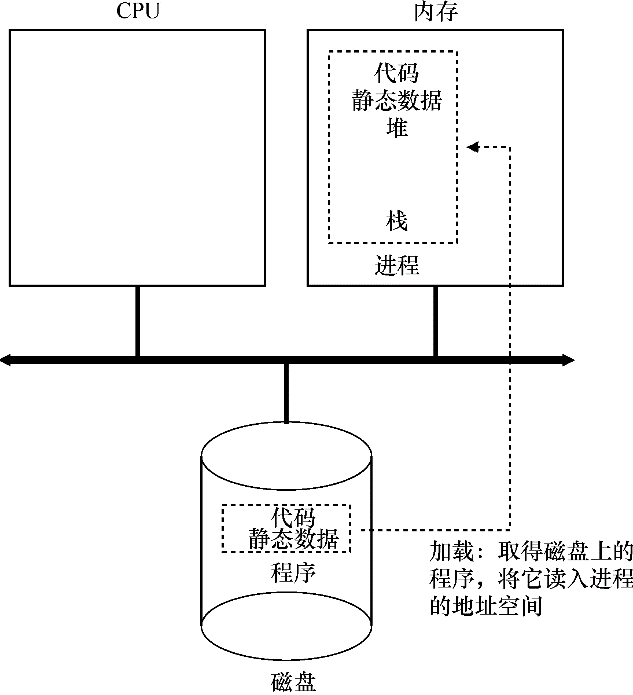

1. 将代码和所有静态数据（例如初始化变量）加载（load）到内存中，加载到进程的地址空间中。程序最初以某种可执行格式驻留在磁盘上

    > 现代操作系统惰性（lazily）执行该过程，即仅在程序执行期间需要加载的代码或数据片段，才会加载

2. 为程序的运行时栈（run-time stack或stack）分配一些内存。程序使用栈存放局部变量、函数参数和返回地址。操作系统也可能会用参数初始化栈。具体来说，它会将参数填入main()函数，即argc和argv数组。
3. 可能为程序的堆（heap）分配一些内存。堆用于显式请求的动态分配数据。起初堆会很小。随着程序运行，通过malloc()库API请求更多内存
4. 执行一些其他初始化任务。例如打开3个默认的文件描述符（标准输入、输出、错误）
5. 通过跳转到main()例程，OS将CPU的控制权转移到新创建的进程中，从而程序开始执行。

#### 进程状态

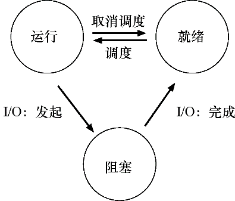

#### 数据结构

xv6 内核的 proc 结构

```c
// the registers will save and restore
// to stop and subsequently restart a process
// 上下文切换需要写入或者读取
struct context {
  int eip;
  int esp;
  int ebx;
  int ecx;
  int edx;
  int esi;
  int edi;
  int ebp;
};

// the different states a process can be in
enum proc_state { UNUSED, EMBRYO, SLEEPING,
                  RUNNABLE, RUNNING, ZOMBIE };

// the information xv6 tracks about each process
// including its register context and state
struct proc {
  char *mem;                   // Start of process memory
  uint sz;                     // Size of process memory
  char *kstack;                // Bottom of kernel stack
                               // for this process
  enum proc_state state;       // Process state
  int pid;                     // Process ID
  struct proc *parent;         // Parent process
  void *chan;                  // If non-zero, sleeping on chan
  int killed;                  // If non-zero, have been killed
  struct file *ofile[NOFILE];  // Open files
  struct inode *cwd;           // Current directory
  struct context context;      // Switch here to run process
  struct trapframe *tf;        // Trap frame for the
                               // current interrupt
};
```

#### 进程 API

`fork()`: 复制当前进程

> 父进程中返回码是子进程id，子进程中返回码是 0

```cpp
#include <stdio.h>
#include <stdlib.h>
#include <unistd.h>

int main(int argc, char *argv[])
{
    printf("hello world (pid:%d)\n", (int) getpid());
    int rc = fork();
    if (rc < 0) {        // fork failed; exit
        fprintf(stderr, "fork failed\n");
        exit(1);
    } else if (rc == 0) { // child (new process)
        printf("hello, I am child (pid:%d)\n", (int) getpid());
    } else {             // parent goes down this path (main)
        printf("hello, I am parent of %d (pid:%d)\n",
                rc, (int) getpid());
    }
    return 0;
}
```

`wait()`/`waitpid()`: 等待子进程：

```cpp
#include <stdio.h>
#include <stdlib.h>
#include <unistd.h>
#include <sys/wait.h>

int
main(int argc, char *argv[])
{
    printf("hello world (pid:%d)\n", (int) getpid());
    int rc = fork();
    if (rc < 0) {        // fork failed; exit
        fprintf(stderr, "fork failed\n");
        exit(1);
    } else if (rc == 0) { // child (new process)
        printf("hello, I am child (pid:%d)\n", (int) getpid());
    } else {    // parent goes down this path (main)
        int wc = wait(NULL);
        printf("hello, I am parent of %d (wc:%d) (pid:%d)\n",
                rc, wc, (int) getpid());
    }
    return 0;
}
```

`exec()`: 让当前进程执行新程序

```cpp
#include <stdio.h>
#include <stdlib.h>
#include <unistd.h>
#include <string.h>
#include <sys/wait.h>

int
main(int argc, char *argv[])
{
    printf("hello world (pid:%d)\n", (int) getpid());
    int rc = fork();
    if (rc < 0) {        // fork failed; exit
        fprintf(stderr, "fork failed\n");
        exit(1);
    } else if (rc == 0) { // child (new process)
        printf("hello, I am child (pid:%d)\n", (int) getpid());
        char *myargs[3];
        myargs[0] = strdup("wc");   // program: "wc" (word count)
        myargs[1] = strdup("p3.c"); // argument: file to count
        myargs[2] = NULL;          // marks end of array
        execvp(myargs[0], myargs); // runs word count
        printf("this shouldn't print out");
    } else {    // parent goes down this path (main)
        int wc = wait(NULL);
        printf("hello, I am parent of %d (wc:%d) (pid:%d)\n",
                rc, wc, (int) getpid());
    }
    return 0;
}
```

创建新进程 = `fork()` + `exec()`

事实证明，这种分离 `fork()` 及 `exec()` 的做法在构建 UNIX shell 的时候非常有用，因为这给了 shell 在 fork 之后 exec 之前运行代码的机会，这些代码可以在运行新程序前改变环境，从而让一系列有趣的功能很容易实现。


另外还可以通过 `kill()` 系统调用向进程发送信号（signal）


### 机制：受限直接执行

为了虚拟化CPU，操作系统需要以某种方式让许多任务共享物理CPU，让它们看起来像是同时运行。基本思想很简单：运行一个进程一段时间，然后运行另一个进程，如此轮换。通过以这种方式时分共享（time sharing）CPU，就实现了虚拟化。

这样的机制存在一些挑战：

1. 性能。如何在不增加系统开销的情况下实现虚拟化？
2. 控制权。如何有效地运行进程，同时保留对CPU的控制？控制权对于操作系统尤为重要，因为操作系统负责资源管理。如果没有控制权，一个进程可以简单地无限制运行并接管机器，或访问没有权限的信息。

#### 基本技巧：受限直接执行

为了使程序尽可能快地运行，操作系统开发人员想出了一种技术——我们称之为**受限的直接执行**（limited direct execution）。

> LDE 背后的想法很简单：让程序运行的大部分指令直接访问硬件，只在一些关键点（如进程发起系统调用或发生时钟中断）由操作系统介入来确保“在正确的时间，正确的地点，做正确的事”。

这个概念的“直接执行”部分很简单：只需直接在CPU上运行程序即可。

直接运行协议（无限制）

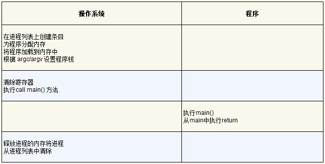

#### 问题1：受限制的操作

关键问题：如何执行受限制的操作？

一个进程必须能够执行I/O和其他一些受限制的操作，但又不能让进程完全控制系统。操作系统和硬件如何协作实现这一点？

硬件通过提供不同的执行模式来协助操作系统。在用户模式（user mode）下，应用程序不能完全访问硬件资源。在内核模式（kernel mode）下，操作系统可以访问机器的全部资源。还提供了陷入（trap）内核和从陷阱返回（return-from-trap）到用户模式程序的特别说明，以及一些指令，让操作系统告诉硬件陷阱表（trap table）在内存中的位置。

要执行系统调用，程序必须执行特殊的陷阱（trap）指令。该指令同时跳入内核并将特权级别提升到内核模式。完成后，操作系统调用一个特殊的从陷阱返回（return-from-trap）指令，如你期望的那样，该指令返回到发起调用的用户程序中，同时将特权级别降低，回到用户模式。

执行陷阱时，硬件需要小心，因为它必须确保存储足够的调用者寄存器，以便在操作系统发出从陷阱返回指令时能够正确返回。例如，在x86上，处理器会将程序计数器、标志和其他一些**寄存器推送到每个进程的内核栈**（kernel stack）上。从返回陷阱将从栈弹出这些值，并恢复执行用户模式程序。

系统调用过程：例如当你调用 `open()` 时，你正在执行对 C 库的过程调用。其中，无论是对于 open() 还是提供的其他系统调用，库都使用与内核一致的调用约定来将**参数**放在众所周知的位置（例如，在栈中或特定的寄存器中），将**系统调用号**也放入一个众所周知的位置（同样，放在栈或寄存器中），然后执行上述的陷阱指令。库中陷阱之后的代码准备好返回值，并将控制权返回给发出系统调用的程序。因此，C库中进行系统调用的部分是用汇编手工编码的，因为它们需要仔细遵循约定，以便正确处理参数和返回值，以及执行硬件特定的陷阱指令。

陷阱如何知道在OS内运行哪些代码？

内核通过在启动时设置**陷阱表（trap table）**来实现。当机器启动时，它在特权（内核）模式下执行，因此可以根据需要自由配置机器硬件。操作系统做的第一件事，就是告诉硬件在发生某些异常事件时要运行哪些代码。例如，当发生硬盘中断，发生键盘中断或程序进行系统调用时，应该运行哪些代码？操作系统通常通过某种特殊的指令，通知硬件这些陷阱处理程序的位置。一旦硬件被通知，它就会记住这些处理程序的位置，直到下一次重新启动机器，并且硬件知道在发生系统调用和其他异常事件时要做什么（即跳转到哪段代码）。

受限直接运行协议：


#### 问题2：在程序之间切换

关键问题：如何重获CPU的控制权？

操作系统如何重新获得CPU的控制权（regain control），以便它可以在进程之间切换？

答案是：时钟中断（timer interrupt。时钟设备可以编程为每隔几毫秒产生一次中断。产生中断时，当前正在运行的进程停止，操作系统中预先配置的中断处理程序（interrupt handler）会运行。此时，操作系统重新获得CPU的控制权，因此可以做它想做的事：停止当前进程，并启动另一个进程。

受限直接执行协议（时钟中断）


请注意，在此协议中，有**两种类型的寄存器保存/恢复**。第一种是发生时钟中断的时候。在这种情况下，运行进程的用户寄存器由硬件隐式保存，使用该进程的内核栈。第二种是当操作系统决定从A切换到B。在这种情况下，内核寄存器被软件（即OS）明确地保存，但这次被存储在该进程的进程结构的内存中。后一个操作让系统从好像刚刚由A陷入内核，变成好像刚刚由B陷入内核。

xv6的上下文切换代码:

```cpp
# void swtch(struct context **old, struct context *new);
#
# Save current register context in old
# and then load register context from new.
.globl swtch
swtch:
  # Save old registers
  movl 4(%esp), %eax # put old ptr into eax
  popl 0(%eax)        # save the old IP
  movl %esp, 4(%eax) # and stack
  movl %ebx, 8(%eax) # and other registers
  movl %ecx, 12(%eax)
  movl %edx, 16(%eax)
  movl %esi, 20(%eax)
  movl %edi, 24(%eax)
  movl %ebp, 28(%ea
  # Load new registers
  movl 4(%esp), %eax # put new ptr into eax
  movl 28(%eax), %ebp # restore other registers
  movl 24(%eax), %edi
  movl 20(%eax), %esi
  movl 16(%eax), %edx
  movl 12(%eax), %ecx
  movl 8(%eax), %ebx
  movl 4(%eax), %esp  # stack is switched here
  pushl 0(%eax)       # return addr put in place
  ret                 # finally return into new ctxt
```

!> 系统调用和上下文切换的性能：在具有2 GHz或3 GHz处理器的系统上的性能可以达到亚微秒级。

在系统调用期间发生时钟中断时会发生什么？

### 策略：进程调度

关键问题：如何开发调度策略？

我们该如何开发一个考虑调度策略的基本框架？什么是关键假设？哪些指标非常重要？哪些基本方法已经在早期的系统中使用？

#### 工作负载的假设

我们对操作系统中运行的进程（有时也叫工作任务）做出如下的假设：
1．每一个工作运行相同的时间。
2．所有的工作同时到达。
3．一旦开始，每个工作保持运行直到完成。
4．所有的工作只是用CPU（即它们不执行IO操作）。
5．每个工作的运行时间是已知的。

#### 调度指标：周转时间

任务的周转时间：任务完成时间减去任务到达系统的时间。

#### 先进先出（FIFO）

存在护航效应：一些耗时较少的潜在资源消费者被排在重量级的资源消费者之后

#### 最短任务优先（SJF）

在所有工作同时到达的假设，SJF 确实是一个最优调度算法

如果工作不是同时到达，长的任务先到，也会出现护航效应。

#### 最短完成时间优先（STCF）

向 SJF 添加抢占，称为最短完成时间优先（Shortest Time-to-Completion First，STCF）或抢占式最短作业优先（Preemptive Shortest Job First ，PSJF）调度程序。

在当前假设下（去掉第1， 2 个假设），STCF 是个最优秀的算法

#### 新的度量指标：响应时间

响应时间定义为从任务到达系统到首次运行的时间。

STCF和相关方法在响应时间上并不是很好。

如何构建对响应时间敏感的调度程序？

#### 轮转（RR）

轮转（Round-Robin，RR）调度：在一个时间片内运行一个工作，然后切换到运行队列中的下一个任务，而不是运行一个任务直到结束。它反复执行，直到所有任务完成。

> 时间片长度必须是时钟中断周期的倍数

时间片长度对于RR是至关重要的。越短，RR在响应时间上表现越好。然而，时间片太短是有问题的：突然上下文切换的成本将影响整体性能。因此，系统设计者需要权衡时间片的长度，使其足够长，以便**摊销**（amortize）上下文切换成本，而又不会使系统不及时响应。

上下文切换的成本不仅仅来自保存和恢复少量寄存器的操作系统操作。程序运行时，它们在**CPU高速缓存、TLB、分支预测器和其他片上硬件**中建立了大量的状态。切换到另一个工作会导致此状态被刷新，且与当前运行的作业相关的新状态被引入，这可能导致显著的性能成本

目前两种调度程序。第一种类型（SJF、STCF）优化周转时间，但对响应时间不利。第二种类型（RR）优化响应时间，但对周转时间不利。我们还有两个假设需要放宽：假设4（作业没有I/O）和假设5（每个作业的运行时间是已知的）。

#### 结合 I/O

STCF 调度中可以把有 I/O 的工作根据 I/O 的位置分为多个独立子工作，然后调度这些子工作。

#### 无法预知

我们介绍了调度的基本思想，并开发了两类方法。第一类是运行最短的工作，从而优化周转时间。第二类是交替运行所有工作，从而优化响应时间。

但是前面的所有调度都依赖于：知道每个工作的长度。真实情况下，操作系统通常对每个作业的长度知之甚少。因此，我们如何建立一个没有这种先验知识的SJF/STCF/RR？

### 调度：多级反馈队列（MLFQ）

关键问题：没有完备的知识如何调度？

没有工作长度的先验（priori）知识，如何设计一个能同时减少响应时间和周转时间的调度程序？

多级反馈队列（Multi-level Feedback Queue，MLFQ）是用历史经验预测未来的一个典型的例子，操作系统中有很多地方采用了这种技术

MLFQ 中有许多独立的队列，每个队列有不同的优先级。任何时刻，一个工作只能存在于一个队列中。MLFQ总是优先执行较高优先级的工作（即在较高级队列中的工作）。

MLFQ调度策略的关键在于如何设置优先级。MLFQ 会根据观察到的行为跳转作用的优先级。例如，如果一个工作不断放弃CPU去等待键盘输入，这是交互型进程的可能行为，MLFQ因此会让它保持高优先级。相反，如果一个工作长时间地占用CPU，MLFQ会降低其优先级。

MLFQ的两条基本规则。

`规则1`: 如果A的优先级 > B的优先级，运行A（不运行B）。  
`规则2`: 如果A的优先级 = B的优先级，轮转运行A和B。


#### 尝试1：改变优先级

`规则3`: 工作进入系统时，放在最高优先级（最上层队列）   
规则4a: 工作用完整个时间片后，降低其优先级（移入下一个队列）。   
规则4b: 如果工作在其时间片以内主动释放CPU，则优先级不变。   

当前 MLFQ 的一些问题：

1. 饥饿问题：如果系统有“太多”交互型工作，就会不断占用CPU，导致长工作永远无法得到CPU
2. 愚弄调度程序：进程在时间片用完之前，调用一个I/O操作（比如访问一个无关的文件），从而主动释放CPU。如此便可以保持在高优先级，占用更多的 CPU 时间。
3. 一个程序可能在不同时间表现不同。一个计算密集的进程可能在某段时间表现为一个交互型的进程

#### 尝试2： 提升优先级

解决饥饿问题的一个简单的思路是周期性地提升（boost）所有工作的优先级

`规则5`: 经过一段时间 S，就将系统中所有工作重新加入最高优先级队列。

> S 的值应该如何设置？

#### 尝试3：更好的计时方式

解决愚弄调度程序。

`规则4`：一旦工作用完了其在某一层中的时间配额（无论中间主动放弃了多少次CPU），就降低其优先级（移入低一级队列）。

#### MLFQ 调优及其它问题

配置多少队列？每一层队列的时间片配置多大？

多久提升一次进程的优先级？

大多数的MLFQ变体都支持不同队列可变的时间片长度。高优先级队列通常只有较短的时间片（比如10ms或者更少），因而这一层的交互工作可以更快地切换。相反，低优先级队列中更多的是CPU密集型工作，配置更长的时间片会取得更好的效果

其他一些MLFQ调度程序没用表，甚至没用本章中讲到的规则，有些采用数学公式来调整优先级。例如，FreeBSD调度程序（4.3版本），会基于当前进程使用了多少CPU，通过公式计算某个工作的当前优先级。另外，使用量会随时间衰减，这提供了期望的优先级提升，

#### MLFQ 总结

MLFQ有趣的原因是：它不需要对工作的运行方式有先验知识，而是通过观察工作的运行来给出对应的优先级。通过这种方式，MLFQ可以同时满足各种工作的需求：对于短时间运行的交互型工作，获得类似于SJF/STCF的很好的全局性能，同时对长时间运行的CPU密集型负载也可以公平地、不断地稳步向前。因此，许多系统使用某种类型的MLFQ作为自己的基础调度程序

### 调度：比例份额（彩票调度）

比例份额调度程序，有时也称为**公平份额调度程序**。

比例份额算法基于一个简单的想法：调度程序的最终目标，是确保每个工作获得一定比例的CPU时间，而不是优化周转时间和响应时间。

比例份额调度程序有一个非常优秀的现代例子名为**彩票调度**

关键问题：如何按比例分配CPU？

如何设计调度程序来按比例分配CPU？其关键的机制是什么？效率如何？

#### 基本概念：彩票数表示份额

彩票数（ticket）代表了进程（或用户或其他）占有某个资源的份额。一个进程拥有的彩票数占总彩票数的百分比，就是它占有资源的份额

通过不断定时地（比如，每个时间片）抽取彩票，彩票调度从概率上（但不是确定的）获得这种份额比例。抽取彩票的过程很简单：调度程序知道总共的彩票数（在我们的例子中，有100张）。调度程序抽取中奖彩票，这是从0和99之间的一个数，拥有这个数对应的彩票的进程中奖。

> 彩票调度最精彩的地方在于利用了随机性。优点：简单、轻量、快

#### 如何分配彩票

假设用户自己知道如何分配，因此可以给每个用户一定量的彩票，由用户按照需要自主分配给自己的工作。然而这种方案似乎什么也没有解决——还是没有给出具体的分配策略。因此对于给定的一组工作，彩票分配的问题依然**没有最佳答案**。

#### 另一个公平分配算法：步长调度

随机方式可以使得调度程序的实现简单（且大致正确），但**偶尔并不能产生正确的比例**，尤其在工作运行时间很短的情况下。

步长调度是一个确定性的公平分配算法。

系统中的每个工作都有自己的步长，这个值与票数值成反比。在上面的例子中，A、B、C这3个工作的票数分别是100、50和250，我们通过用一个大数分别除以他们的票数来获得每个进程的步长。比如用10000除以这些票数值，得到了3个进程的步长分别为100、200和40。我们称这个值为每个进程的**步长**（stride）。每次进程运行后，我们会让它的计数器（称为**行程（pass）值**） 增加它的步长，记录它的总体进展。

当需要进行调度时，选择目前拥有最小行程值的进程，并且在运行之后将该进程的行程值增加一个步长。

步长调度算法可以在每个调度周期后做到完全正确。

当然彩票调度有一个步长调度没有的优势——不需要**全局状态**。假如一个新的进程在上面的步长调度执行过程中加入系统，应该怎么设置它的行程值呢？设置成0吗？这样的话，它就独占CPU了。而彩票调度算法不需要对每个进程记录全局状态，只需要用新进程的票数更新全局的总票数就可以了。因此彩票调度算法能够更合理地处理新加入的进程。

### 多处理器调度

关键问题：如何在多处理器上调度工作

操作系统应该如何在多CPU上调度工作？会遇到什么新问题？已有的技术依旧适用吗？是否需要新的思路？

#### 多处理架构

多处理器的区别主要在于对硬件缓存（cache）的使用

> 缓存是基于局部性（locality）的概念，局部性有两种，即时间局部性和空间局部性

多处理器有各自的缓存，并共享同一个内存。这就存在**缓存一致性**问题。

硬件提供了这个问题的基本解决方案：通过**监控内存访问**，硬件可以保证获得正确的数据，并保证共享内存的唯一性。在基于总线的系统中，一种方式是使用总线窥探。每个缓存都通过监听链接所有缓存和内存的总线，来发现内存访问。如果CPU发现对它放在缓存中的数据的更新，会作废本地副本（从缓存中移除），或更新它（修改为新值）

多处理器调度的另一个问题是**缓存亲和度**。一个进程在某个CPU上运行时，会在该CPU的缓存中维护许多状态。下次该进程在相同CPU上运行时，由于缓存中的数据而执行得更快。相反，在不同的CPU上执行，会由于需要重新加载数据而很慢。

#### 单队列调度（SQMS）

单队列多处理器调度（SQMS）：简单地复用单处理器调度的基本架构，将所有需要调度的工作放入一个单独的队列中

优点：简单

短板：1. 扩展性差。访问调度队列需要加锁，性能损失大，处理器越多，性能越差。2. 缓存亲和性差

#### 多队列调度（MQMS）

在MQMS中，基本调度框架包含多个调度队列，每个队列可以使用不同的调度规则，比如轮转或其他任何可能的算法。当一个工作进入系统后，系统会依照一些启发性规则（如随机或选择较空的队列）将其放入某个调度队列。这样一来，每个CPU调度之间相互独立，就避免了单队列的方式中由于数据共享及同步带来的问题。

新问题：如何应对负载不均

最明显的答案是让工作移动，这种技术我们称为迁移（migration）。通过工作的跨CPU迁移，可以真正实现负载均衡。

一个基本的方法是采用一种技术，名为**工作窃取**。通过这种方法，工作量较少的（源）队列不定期地“偷看”其他（目标）队列是不是比自己的工作多。如果目标队列比源队列（显著地）更满，就从目标队列“窃取”一个或多个工作，实现负载均衡。

那么间隔多长时间去检查呢？找到合适的阈值仍然是黑魔法，这在系统策略设计中很常见。

#### Linux 多处理器调度

存在3种不同的调度程序：`O(1)`调度程序、完全公平调度程序（`CFS`）以及BF调度程序（`BFS`）

`O(1)` 和 `CFS` 采用多队列，而 `BFS` 采用单队列，这说明两种方法都可以成功。当然它们之间还有很多不同的细节。例如，**O(1)调度程序是基于优先级的（类似于MLFQ）**，随时间推移改变进程的优先级，然后调度最高优先级进程，来实现各种调度目标。交互性得到了特别关注。与之不同，**CFS是确定的比例调度方法（类似于步长调度）**。**BFS作为3个算法中唯一采用单队列的算法，也基于比例调度**，但采用了更复杂的方案，称为最早最合适虚拟截止时间优先算法


## 虚拟化 内存

用户程序生成的每个地址都是虚拟地址。操作系统只是为每个进程提供一个假象，具体来说，就是它拥有自己的大量私有内存。在一些硬件帮助下，操作系统会将这些假的虚拟地址变成真实的物理地址，从而能够找到想要的信息。

### 抽象：地址空间

早期的操作系统内存分配（一次只能运行一个程序）

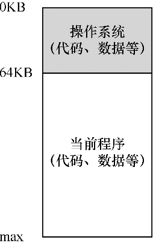

随着多道程序时代的到来，多道程序需要共享内存。

一种实现时分共享的方法，是让一个进程单独占用全部内存运行一小段时间（见图13.1），然后停止它，并将它所有的状态信息保存在磁盘上（包含所有的物理内存），加载其他进程的状态信息，再运行一段时间，这就实现了某种比较粗糙的机器共享。但是**这种方式太慢了**。

因此，在进程切换的时候，我们仍然将进程信息放在内存中，这样操作系统可以更有效率地实现时分共享。每个进程拥有一部分内存。

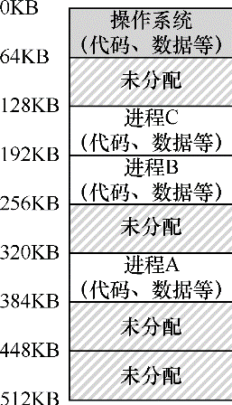

当多道程序同时驻留内存中，使**保护**（protection）成为重要问题。人们不希望一个进程可以读取其他进程的内存，更别说修改了。

因此操作系统需要提供一个易用的物理内存抽象。这个抽象叫作**地址空间**（address space），是运行的程序看到的系统中的内存

一个进程的地址空间包含运行的程序的所有内存状态（代码、静态数据、栈、堆）

> 堆（heap）用于管理动态分配的、用户管理的内存，C语言中调用 `malloc()` 或面向对象语言（如 C++ 或 Java）中调用 `new` 获得内存。

地址空间：

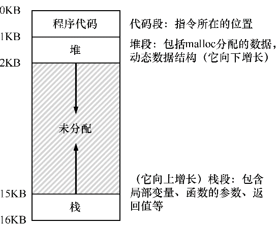

**关键问题：如何虚拟化内存**

操作系统如何在单一的物理内存上为多个运行的进程（所有进程共享内存）构建一个私有的、可能很大的地址空间的抽象？

例如当进程A尝试在地址0（虚拟地址）执行加载操作时，然而操作系统在硬件的支持下，出于某种原因，必须确保不是加载到物理地址0，而是物理地址320KB（这是A载入内存的地址）。这是内存虚拟化的关键。

> 隔离是建立可靠系统的关键原则。

虚拟内存系统的设计目标

- **透明**。让运行的程序不感知内存被虚拟化的事实
- **效率**。包括时间上（即不会使程序运行得更慢）和空间上（即不需要太多额外的内存来支持虚拟化）。为此引入了 TLB 硬件和多级页表设计。
- **保护**。当一个进程执行加载、存储或指令提取时，它不应该以任何方式访问或影响任何其他进程或操作系统本身的内存内容（即在它的地址空间之外的任何内容）

> 作为用户级程序的程序员，可以看到的任何地址都是虚拟地址。只有操作系统（和硬件）才知道物理地址。

### 内存操作 API

对于程序来说，有两种类型的内存。

- 栈（stack）内存，它的申请和释放操作是编译器来隐式管理的，所以有时也称为自动（automatic）内存。
- 堆（heap）内存，其中所有的申请和释放操作都由程序员显式地完成

C 程序通过 `void *malloc(size_t size)` 库函数申请堆内存：传入要申请的堆空间的大小，它成功就返回一个指向新申请空间的指针，失败就返回 NULL

事实证明，分配内存是等式的简单部分。知道何时、如何以及是否释放内存是困难的部分。要释放不再使用的堆内存，程序员只需调用 `free()`：

```c
int *x = malloc(10 * sizeof(int));
...
free(x);
```

!> 调用 free 函数时分配区域的大小不会被用户传入，必须由内存分配库本身记录追踪。

在使用malloc()和free()时会出现一些常见的错误。

1. 忘记分配内存

    ```c
    char *src = "hello";
    char *dst;        // oops! unallocated
    strcpy(dst, src); // segfault and die
    ```

2. 没有分配足够的内存

    ```c
    char *src = "hello";
    char *dst = (char *) malloc(strlen(src)); // too small!
    strcpy(dst, src); // work properly
    ```

3. 忘记初始化分配的内存
4. 忘记释放内存。称为内存泄漏。在这种情况下，当进程死亡时，操作系统才会清理其分配的所有页面

    > 系统中实际存在两级内存管理。第一级是由操作系统执行的内存管理，操作系统在进程运行时将内存交给进程，并在进程退出（或以其他方式结束）时将其回收。第二级管理在每个进程中，例如在调用 `malloc()` 和 `free()` 时，在堆内管理。因此，对于短时间运行的程序，泄露内存通常不会导致任何操作问题

5. 在用完之前释放内存。这种错误称为悬挂指针。随后的使用可能会导致程序崩溃或覆盖有效的内存（调用了 `free()`，但随后再次调用 `malloc()` 来分配其他内容）
6. 重复释放内存。未定义行为
7. 错误地调用 `free()`。传入一个无效的指针。

`malloc()` 和 `free()` 不是系统调用，而是库调用。malloc库管理虚拟地址空间内的空间，但是它本身是建立在一些系统调用之上的，这些系统调用会进入操作系统，来请求更多内存或者将一些内容释放回系统。

一个这样的**系统调用**叫作 `brk`，它被用来改变程序分断（break）的位置：堆结束的位置。它需要一个参数（新分断的地址），从而根据新分断是大于还是小于当前分断，来增加或减小堆的大小。另一个调用 `sbrk` 要求传入一个增量，但目的是类似的。

!> 请注意，你不应该直接调用brk或sbrk。它们被内存分配库使用.

还可以通过 `mmap()` 调用从操作系统获取内存。通过传入正确的参数，`mmap()` 可以在程序中创建一个匿名（anonymous）内存区域——这个区域不与任何特定文件相关联，而是与交换空间（swap space）相关联

另外，内存分配库还支持一些其他调用。例如，`calloc()` 分配内存，并在返回之前将其置零。`realloc()` 创建一个新的更大的内存区域，将旧区域复制到其中，并返回新区域的指针。

### 机制：地址转换

> 关键问题：如何高效、灵活地虚拟化内存

如何实现高效的内存虚拟化？如何提供应用程序所需的灵活性？如何保持控制应用程序可访问的内存位置，从而确保应用程序的内存访问受到合理的限制？如何高效地实现这一切？

我们利用了一种通用技术，有时被称为基于硬件的地址转换，简称为**地址转换**（address translation)。利用地址转换，硬件对每次内存访问进行处理（即指令获取、数据读取或写入），将指令中的虚拟地址转换为数据实际存储的物理地址。因此，在每次内存引用时，硬件都会进行地址转换，将应用程序的内存引用重定位到内存中实际的位置。

当然，仅仅依靠硬件不足以实现虚拟内存，因为它只是提供了底层机制来提高效率。操作系统必须在关键的位置介入，设置好硬件，以便完成正确的地址转换。因此它必须管理内存，记录被占用和空闲的内存位置，并明智而谨慎地介入，保持对内存使用的控制。

所有这些工作都是为了创造一种美丽的假象：每个程序都拥有私有的内存，那里存放着它自己的代码和数据。

**介入**是一种很常见又很有用的技术，计算机系统中使用介入常常能带来很好的效果。在虚拟内存中，硬件可以介入到每次内存访问中，将进程提供的虚拟地址转换为数据实际存储的物理地址

假设：
1. 用户的地址空间必须连续地放在物理内存中
2. 地址空间不是很大，具体来说，小于物理内存的大小
3. 每个地址空间的大小完全一样

物理内存和单个重定位的进程:

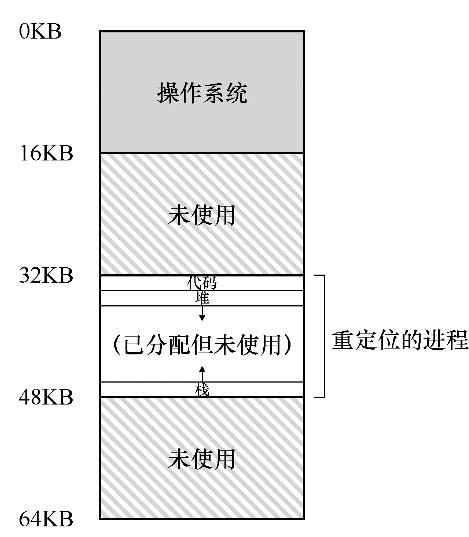

#### 动态（基于硬件）重定位

最初的地址转换：**基址加界限机制**，也称为**动态重定位**

每个 CPU 需要两个硬件寄存器：**基址（base）寄存器**和**界限（bound）寄存器**

采用这种方式，在编写和编译程序时假设地址空间从零开始。但是，当程序真正执行时，操作系统会决定其在物理内存中的实际加载地址，并将起始地址记录在基址寄存器中。当进程运行时，产生的所有内存引用，都会被处理器通过以下方式转换为物理地址

进程中使用的内存引用都是虚拟地址（virtual address），硬件接下来将虚拟地址加上基址寄存器中的内容，得到物理地址（physical address），再发给内存系统。

在动态重定位的过程中，只有很少的硬件参与，但获得了很好的效果。一个基址寄存器将虚拟地址转换为物理地址，一个界限寄存器确保这个地址在进程地址空间的范围内。

这种基址寄存器配合界限寄存器的硬件结构是芯片中的（每个CPU一对）。有时我们将CPU的这个负责地址转换的部分统称为**内存管理单元**（Memory Management Unit，MMU）。

动态重定位的硬件要求


动态重定位的操作系统职责：


受限直接执行协议（动态重定位）:


这个技术高效的关键是硬件支持，硬件快速地将所有内存访问操作中的虚拟地址（进程自己看到的内存位置）转换为物理地址（实际位置）。所有的这一切对进程来说都是透明的，进程并不知道自己使用的内存引用已经被重定位，制造了美妙的假象。

遗憾的是，这个简单的动态重定位技术有效率低下的问题。由于该进程的栈区和堆区并不很大，导致这块内存区域中大量的空间被浪费。这种浪费通常称为内部碎片，指的是已经分配的内存单元内部有未使用的空间（即碎片），造成了浪费。

> 即栈和堆之间，有一大块“空闲”空间。

为了更好地利用物理内存，避免内部碎片。第一次尝试是将基址加界限的概念稍稍泛化，得到**分段**的概念，

### 分段

> 关键问题：怎样支持大地址空间，同时栈和堆之间（可能）有大量空闲空间？

为了解决这个问题，分段的概念应运而生。在 MMU 中引入不止一个基址和界限寄存器对，而是给地址空间内的每个逻辑段一对。一个段只是地址空间里的一个连续定长的区域，在典型的地址空间里有 3 个逻辑不同的段：代码、栈和堆。分段的机制使得操作系统能够将不同的段放到不同的物理内存区域，从而避免了虚拟地址空间中的未使用部分占用物理内存。

在物理内存中放置段:

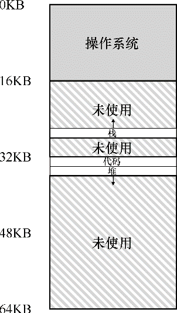

段寄存器的值


如果试图访问非法的地址，会导致段异常（segmentation violation）或段错误（segmentation fault）。

分段地址硬件转换逻辑

```
// get top 2 bits of 14-bit VA
Segment = (VirtualAddress & SEG_MASK) >> SEG_SHIFT
// now get offset
Offset = VirtualAddress & OFFSET_MASK
if (Offset >= Bounds[Segment])
    RaiseException(PROTECTION_FAULT)
else
    PhysAddr = Base[Segment] + Offset
    Register = AccessMemory(PhysAddr)
```

栈是反向增长的，因此转换时还得知道段的增长方向。

分段可以支持共享。要节省内存，有时候在地址空间之间共享（share）某些内存段是有用的。尤其是，**代码共享**很常见。

为了支持共享，需要一些额外的硬件支持，这就是保护位（protection bit）。通过将代码段标记为只读，同样的代码可以被多个进程共享，而不用担心破坏隔离。


有了保护位，前面描述的硬件算法也必须改变。除了检查虚拟地址是否越界，硬件还需要检查特定访问是否允许。

分段对操作系统提出了新的要求，1. 上下文切换时要保存和恢复各个段寄存器中的内容；2. 管理物理内容的空闲空间

由于段的大小不一，会导致内存的**外部碎片**问题。

该问题的一种解决方案是紧凑（compact）物理内存，重新安排原有的段。整理内存需要占用大量的处理器时间。

一种更简单的做法是利用**空闲列表管理算法**，试图保留大的内存块用于分配。相关的算法可能有成百上千种，包括传统的最优匹配、最坏匹配（worst-fit）、首次匹配以及像伙伴算法这样更复杂的算法。

### 空闲空间管理

如果要管理的空闲空间由大小不同的单元构成，管理就变得困难（而且有趣）。这种情况出现在用户级的内存分配库（如malloc()和free()），或者操作系统用分段（segmentation）的方式实现虚拟内存。

> 关键问题：如何管理空闲空间

要满足变长的分配请求，应该如何管理空闲空间？什么策略可以让碎片最小化？不同方法的时间和空间开销如何？

在堆上管理空闲空间的数据结构通常称为**空闲列表**。该结构包含了管理内存区域中所有空闲块的引用。

#### 追踪已分配空间的大小

`free(void *ptr)` 接口没有块大小的参数。大多数分配程序都会在头块（header）中保存一点额外的信息，它在内存中，通常就在返回的内存块之前

```cpp
typedef struct header_t { 
    int size;
    int magic;
} header_t;
```

```cpp
void free(void *ptr) {
    header_t *hptr = (void *)ptr - sizeof(header_t);
}
```

获得头块的指针后，库可以很容易地确定幻数是否符合预期的值，作为正常性检查（`assert(hptr->magic == 1234567)`），并简单计算要释放的空间大小（即头块的大小加区域长度）。

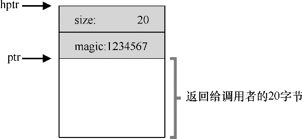

> 因此，如果用户请求N字节的内存，库不是寻找大小为N的空闲块，而是寻找N加上头块大小的空闲块。

#### 嵌入空闲列表

空闲链表节点：

```cpp
typedef struct  node_t { 
    int    size;
    struct  node_t *next;
} node_t;
```

堆内存初始化

```cpp
// mmap() returns a pointer to a chunk of free space 
node_t *head = mmap(NULL, 4096, PROT_READ|PROT_WRITE,
                   MAP_ANON|MAP_PRIVATE, -1, 0);
head->size    = 4096 - sizeof(node_t); 
head->next    = NULL;
```

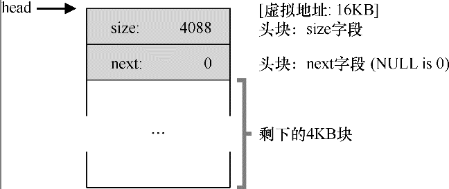

一次分配后


三次分配后

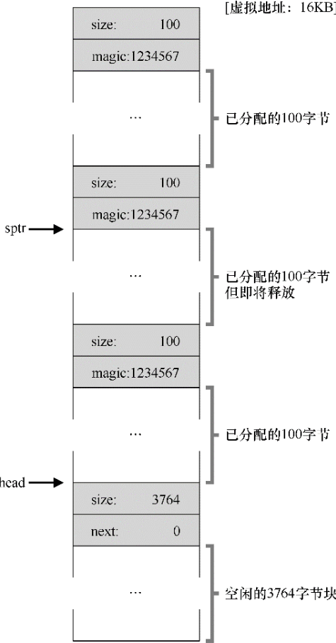

一次释放后

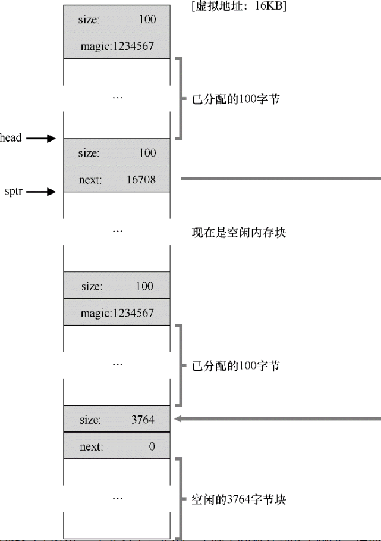

三次释放后


可见空间列表变得非常破碎，解决方案很简单：遍历列表，合并相邻块。

#### 让堆增长

大多数传统的分配程序会从很小的堆开始，当空间耗尽时，再向操作系统申请更大的空间。这意味着它们进行了某种系统调用（例如，大多数UNIX系统中的`sbrk`）

#### 基本策略

理想的分配程序可以同时保证快速和碎片最小化。

- 最优匹配
- 最差匹配
- 首次匹配
- 下次匹配

#### 其它方式

分离空闲列表：如果某个应用程序经常申请一种（或几种）大小的内存空间，那就用一个独立的列表，只管理这样大小的对象。其他大小的请求都交给更通用的内存分配程序。

slab 分配程序采用了分离空闲列表

因为合并对分配程序很关键， 一个好例子就是二分伙伴分配程序（binary buddy allocator）。

### 分页

由于不同长度的分段，会导致内存空间存在碎片化问题。

因此，值得考虑第二种方法：将空间分割成固定长度的分片。在虚拟内存中，我们称这种思想为**分页**。

分页可能最大的改进就是灵活性，另外就是让空闲空间管理更加简单。

> 关键问题：如何通过页来实现虚拟内存

如何通过页来实现虚拟内存，从而避免分段的问题？基本技术是什么？如何让这些技术运行良好，并尽可能减少空间和时间开销？

为了记录地址空间的每个虚拟页放在物理内存中的位置，操作系统通常为每个进程保存一个数据结构，称为页表（page table）。页表的主要作用是为地址空间的每个虚拟页面保存地址转换（address translation）


#### 页表存在哪里

页表往往比较大。（一个20位的VPN，假设每个页表条目需要4个字节，那这个页表就需要4MB内存，如果有100个进程，就需要 400MB 内存）

由于比较大，页表只能存储在内存中。


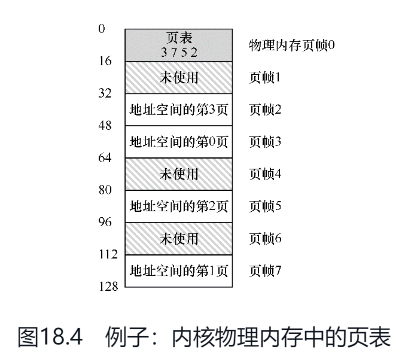

#### 页表中究竟有什么

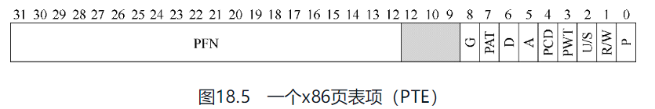

P: 存在位（present bit）, 表示该页是在物理存储器还是在磁盘上

R/W: 是否允许写入该页面

U/S: 确定用户模式进程是否可以访问该页面

PWT、PCD、PAT、G：确定硬件缓存如何为这些页面工作

A: 访问位（accessed bit），有时用于追踪页是否被访问，也用于确定哪些页很受欢迎，因此应该保留在内存中

D: 脏位（dirty bit）

#### 分页：也很慢

利用分页访问内存的过程：

```java
// Extract the VPN from the virtual address
VPN = (VirtualAddress & VPN_MASK) >> SHIFT

// Form the address of the page-table entry (PTE)
PTEAddr = PTBR + (VPN * sizeof(PTE))

// Fetch the PTE
PTE = AccessMemory(PTEAddr)

// Check if process can access the page
if (PTE.Valid == False)
    RaiseException(SEGMENTATION_FAULT)
else if (CanAccess(PTE.ProtectBits) == False)
    RaiseException(PROTECTION_FAULT)
else
    // Access is OK: form physical address and fetch it
    offset   = VirtualAddress & OFFSET_MASK
    PhysAddr = (PTE.PFN << PFN_SHIFT) | offset
    Register = AccessMemory(PhysAddr)
```

为了访问 PTE 会多一次内存引用，在这种情况下，可能会使进程减慢两倍或更多。

因此，实现分页需要解决上面两个实际问题

- **会导致较慢的机器（有许多额外的内存访问来访问页表）**
- **内存浪费（内存被页表塞满而不是有用的应用程序数据）**

### 分页：快速地址转换（TLB）

> 关键问题：如何加速地址转换
>
> 如何才能加速虚拟地址转换，尽量避免额外的内存访问？需要什么样的硬件支持？操作系统该如何支持？

想让某些东西更快，操作系统通常需要一些帮助。帮助常常来自操作系统的老朋友：硬件。我们要增加所谓的（由于历史原因）地址转换旁路缓冲存储器（translation-lookaside buffer，TLB），它就是频繁发生的虚拟到物理地址转换的硬件缓存（cache）。因此，更好的名称应该是地址转换缓存（address-translation cache）。对每次内存访问，硬件先检查TLB，看看其中是否有期望的转换映射，如果有，就完成转换（很快），不用访问页表（其中有全部的转换映射）。TLB带来了巨大的性能提升，实际上，因此它使得虚拟内存成为可能。

#### TLB 的基本算法

```java
VPN = (VirtualAddress & VPN_MASK) >> SHIFT
(Success, TlbEntry) = TLB_Lookup(VPN)
if (Success == True)    // TLB Hit
    if (CanAccess(TlbEntry.ProtectBits) == True)
        Offset   = VirtualAddress & OFFSET_MASK
        PhysAddr = (TlbEntry.PFN << SHIFT) | Offset
        AccessMemory(PhysAddr)
    else
        RaiseException(PROTECTION_FAULT)
else    // TLB Miss
    PTEAddr = PTBR + (VPN * sizeof(PTE))
    PTE = AccessMemory(PTEAddr)
    if (PTE.Valid == False)
        RaiseException(SEGMENTATION_FAULT)
    else if (CanAccess(PTE.ProtectBits) == False)
        RaiseException(PROTECTION_FAULT)
    else
        TLB_Insert(VPN, PTE.PFN, PTE.ProtectBits)
        RetryInstruction()
```

可见性能的提升关键在于**尽可能避免TLB未命中**

缓存的成功依赖于空间和时间局部性。

TLB 的加载单元是PTE，如果页越大，命中率越高。典型页的大小一般为4KB

既然像TLB这样的缓存这么好，为什么不做更大的缓存，装下所有的数据？可惜的是，这里我们遇到了更基本的定律，就像物理定律那样。如果想要快速地缓存，它就必须小，因为光速和其他物理限制会起作用。大的缓存注定慢，因此无法实现目的

#### 谁来处理TLB未命中

可能有两个答案：硬件或软件（操作系统）

现代 RISC 指令计算机一般都是让操作系统来处理。发生TLB未命中时，硬件系统会抛出一个异常，这会暂停当前的指令流，将特权级提升至内核模式，跳转至陷阱处理程序。这个陷阱处理程序是操作系统的一段代码，用于处理TLB未命中。

#### TLB 的内容

典型的TLB有32项、64项或128项，并且是全相联的（这就意味着一条地址映射可能存在TLB中的任意位置，硬件会并行地查找TLB）

格式可能是： `VPN ｜ PFN ｜ 其他位`

常见的其它位：

- 有效位
- 保护位

补充：TLB的有效位!=页表的有效位

在页表中，如果一个页表项（PTE）被标记为无效，就意味着该页并没有被进程申请使用，

TLB的有效位不同，只是指出TLB项是不是有效的地址映射。TLB有效位在系统上下文切换时起到了很重要的作用，通过将所有TLB项设置为无效，系统可以确保将要运行的进程不会错误地使用前一个进程的虚拟到物理地址转换映射。

#### 上下文切换时对TLB的处理

上下文切换时为了避免 TLB 污染，最简单的方法就是清空TLB(把所有条目的有效位置为 0)

但是这样会导致频繁切换进程时，TLB的命中率很低

为了减少这种开销，一些系统增加了硬件支持，实现跨上下文切换的TLB共享。比如有的系统在TLB中添加了一个地址空间标识符（Address Space Identifier，ASID）。可以把ASID看作是进程标识符（Process Identifier，PID），但通常比PID位数少（PID一般32位，ASID一般是8位）

当然，硬件也需要知道当前是哪个进程正在运行，以便进行地址转换，因此操作系统在上下文切换时，必须将某个特权寄存器设置为当前进程的ASID。

#### TLB 替换策略

和其它缓存的策略基本一致，LRU，随机等

#### 实际的 TLB 项

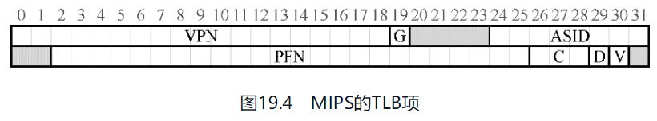

G: 全局位（Global bit），用来指示这个页是不是所有进程全局共享的。因此，如果全局位置为1，就会忽略ASID
ASID: 区分进程空间
C: Coherence 一致位，决定硬件如何缓存该页
D: dirty 脏位，表示该页是否被写入新数据
V: valid 有效位， 告诉硬件该项的地址映射是否有效。

### 分页：较小的表

> 关键问题：如何让页表更小？
>
> 简单的基于数组的页表（通常称为线性页表）太大，在典型系统上占用太多内存。如何让页表更小？关键的思路是什么？由于这些新的数据结构，会出现什么效率影响？

#### 简单的解决方案: 更大的页

这种方法的主要问题在于，大内存页会导致每页内的浪费，这被称为内部碎片（internal fragmentation）问题。所以大多数系统在常见的情况下使用相对较小的页大小：4KB（如x86）或8KB（如SPARCv9）

#### 混合方法：分页和分段

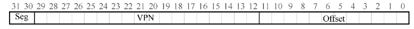

```java
SN           = (VirtualAddress & SEG_MASK) >> SN_SHIFT 
VPN          = (VirtualAddress & VPN_MASK) >> VPN_SHIFT 
AddressOfPTE = Base[SN] + (VPN * sizeof(PTE))
```

杂合方案的关键区别在于，每个分段都有界限寄存器，每个界限寄存器保存了段中最大有效页的值。以这种方式，与线性页表相比，杂合方法实现了显著的内存节省。栈和堆之间未分配的页不再占用页表中的空间（仅将其标记为无效）。

但是，分段并不像我们需要的那样灵活，因为它假定地址空间有一定的使用模式。例如，如果有一个大而稀疏的堆，仍然可能导致大量的页表浪费。其次，这种杂合导致外部碎片再次出现。尽管大部分内存是以页面大小单位管理的，但页表现在可以是任意大小（是PTE的倍数）。

#### 多级页表

另一种方法并不依赖于分段，但也试图解决相同的问题：**如何去掉页表中的所有无效区域，而不是将它们全部保留在内存中？**我们将这种方法称为多级页表

多级页表的基本思想很简单。首先，将页表分成页大小的单元。然后，如果整页的页表项（PTE）无效，就完全不分配该页的页表。为了追踪页表的页是否有效（以及如果有效，它在内存中的位置），使用了名为页目录（page directory）的新结构。页目录因此可以告诉你页表的页在哪里，或者页表的整个页不包含有效页。

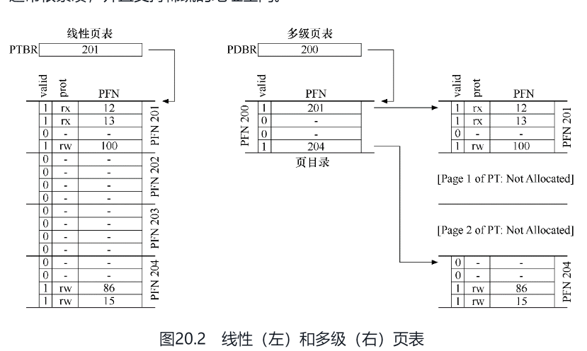

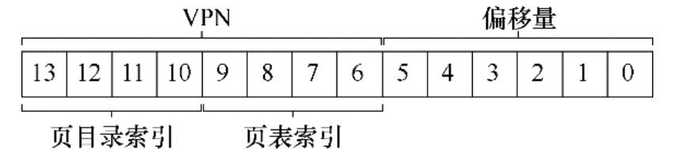

多级页表是有成本的，会导致更多的内存访问，因此多级表是一个时间—空间折中的例子。

```java
VPN = (VirtualAddress & VPN_MASK) >> SHIFT
(Success, TlbEntry) = TLB_Lookup(VPN)
if (Success == True)    // TLB Hit
    if (CanAccess(TlbEntry.ProtectBits) == True)
        Offset   = VirtualAddress & OFFSET_MASK
        PhysAddr = (TlbEntry.PFN << SHIFT) | Offset
        Register = AccessMemory(PhysAddr)
    else
        RaiseException(PROTECTION_FAULT)
else                  // TLB Miss
    // first, get page directory entry
    PDIndex = (VPN & PD_MASK) >> PD_SHIFT
    PDEAddr = PDBR + (PDIndex * sizeof(PDE))
    PDE     = AccessMemory(PDEAddr)
    if (PDE.Valid == False)
        RaiseException(SEGMENTATION_FAULT)
    else
        // PDE is valid: now fetch PTE from page table
        PTIndex = (VPN & PT_MASK) >> PT_SHIFT
        PTEAddr = (PDE.PFN << SHIFT) + (PTIndex * sizeof(PTE))
        PTE     = AccessMemory(PTEAddr)
        if (PTE.Valid == False)
            RaiseException(SEGMENTATION_FAULT)
        else if (CanAccess(PTE.ProtectBits) == False)
            RaiseException(PROTECTION_FAULT)
        else
            TLB_Insert(VPN, PTE.PFN, PTE.ProtectBits)
            RetryInstruction()
```

#### 反向页表

在反向页表（inverted page table）中，可以看到页表世界中更极端的空间节省。在这里，我们保留了一个页表，其中的项代表系统的每个物理页，而不是有许多页表（系统的每个进程一个）。页表项告诉我们哪个进程正在使用此页，以及该进程的哪个虚拟页映射到此物理页。

现在，要找到正确的项，就是要搜索这个数据结构。线性扫描是昂贵的，因此通常在此基础结构上建立散列表，以加速查找。

### 超越物理内存：机制

为了支持更大的地址空间，操作系统需要把当前没有在用的那部分地址空间找个地方存储起来。一般来说，这个地方有一个特点，那就是比内存有更大的容量。在现代系统中，硬盘（hard disk drive）通常能够满足这个需求。

#### 交换空间

在硬盘上开辟一部分空间用于物理页的移入和移出。在操作系统中，一般这样的空间称为交换空间（swap space），因为我们将内存中的页交换到其中，并在需要的时候又交换回去。因此，我们会假设操作系统能够以页大小为单元读取或者写入交换空间。为了达到这个目的，操作系统需要记住给定页的硬盘地址（disk address）。

交换空间不是唯一的硬盘交换目的地。二进制程序的代码页本来就是从硬盘上加载的，所以也可以使用硬盘中的二进制文件。

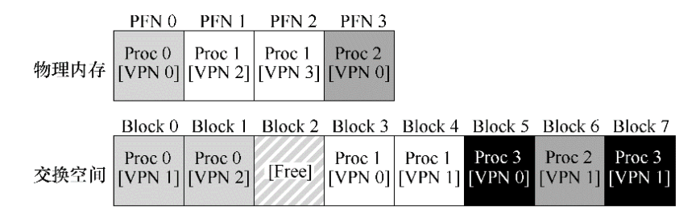

硬件（或操作系统，在软件管理TLB时）判断是否在内存中的方法，是通过页表项中的一条新信息，即`存在位（present bit）`。如果存在位为0，则会抛出页错误(page fault)。操作系统被唤起来处理页错误。一段称为“页错误处理程序（page-fault handler）”的代码会执行，来处理页错误

#### 页错误

操作系统可以用PTE中的某些位来存储硬盘地址，这些位通常用来存储像页的PFN这样的数据。当操作系统接收到页错误时，它会在PTE中查找地址，并将请求发送到硬盘，将页读取到内存中。

当硬盘I/O完成时，操作系统会更新页表，将此页标记为存在，更新页表项（PTE）的PFN字段以记录新获取页的内存位置，并重试指令

#### 内存满了怎么办

页交换策略。（和缓存的淘汰策略类似）

#### 页错误处理流程

硬件：

```java
VPN = (VirtualAddress & VPN_MASK) >> SHIFT
(Success, TlbEntry) = TLB_Lookup(VPN)
if (Success == True)    // TLB Hit
    if (CanAccess(TlbEntry.ProtectBits) == True)
        Offset     = VirtualAddress & OFFSET_MASK
        PhysAddr   = (TlbEntry.PFN << SHIFT) | Offset
        Register  = AccessMemory(PhysAddr)
    else
        RaiseException(PROTECTION_FAULT)
else                  // TLB Miss
    PTEAddr = PTBR + (VPN * sizeof(PTE))
    PTE = AccessMemory(PTEAddr)
    if (PTE.Valid == False)
        RaiseException(SEGMENTATION_FAULT)
    else
        if (CanAccess(PTE.ProtectBits) == False)
            RaiseException(PROTECTION_FAULT)
        else if (PTE.Present == True)
            // assuming hardware-managed TLB
            TLB_Insert(VPN, PTE.PFN, PTE.ProtectBits)
            RetryInstruction()
        else if (PTE.Present == False)
            RaiseException(PAGE_FAULT)
```

操作系统处理页错误

```java
PFN = FindFreePhysicalPage()
if (PFN == -1)               // no free page found
    PFN = EvictPage()        // run replacement algorithm
DiskRead(PTE.DiskAddr, pfn) // sleep (waiting for I/O)
PTE.present = True           // update page table with present
PTE.PFN     = PFN            // bit and translation (PFN)
RetryInstruction()           // retry instruction
```

#### 交换何时真正发生

为了保证有少量的空闲内存，大多数操作系统会设置高水位线（High Watermark，HW）和低水位线（Low Watermark，LW）。当操作系统发现有少于LW个页可用时，后台负责释放内存的线程会开始运行，直到有HW个可用的物理页。这个后台线程有时称为交换守护进程（swap daemon）或页守护进程（page daemon）

### 超越物理内存：策略

> 关键问题：如何决定踢出哪个页
>
> 操作系统如何决定从内存中踢出哪一页（或哪几页）？这个决定由系统的替换策略做出，替换策略通常会遵循一些通用的原则（下面将会讨论），但也会包括一些调整，以避免特殊情况下的行为。

平均内存访问时间计算公式：`AMAT = P(Hit)·T(M) + P(Miss)·T(D)`

现代系统中，磁盘访问的成本非常高，即使很小概率的未命中也会拉低正在运行的程序的总体AMAT

!> 由于分页到硬盘非常昂贵，因此频繁分页的成本太高。所以，过度分页的最佳解决方案往往很简单：购买更多的内存。

#### 最优替换策略

最优策略：替换内存中在最远将来才会被访问到的页，可以达到缓存未命中率最低。

> 为了更好地理解一个特定的替换策略是如何工作的，将它与最好的替换策略进行比较是很好的方法。这样就可以知道你的策略有多大的改进空间，也用于决定当策略已经非常接近最优策略时，停止做无谓的优化。

#### 替换策略

常见的策略有：FIFO，随机，LRU

像LRU这样的算法通常优于简单的策略（如FIFO或随机）。基于历史信息的策略带来了一个新的挑战：应该如何实现呢？

> 关键问题：如何实现LRU替换策略
> 
> 由于实现完美的LRU代价非常昂贵，我们能否实现一个近似的LRU算法，并且依然能够获得预期的效果？

#### 近似 LRU

最简单的是时钟算法

这个想法需要硬件增加一个使用位。

想象一下，系统中的所有页都放在一个循环列表中。时钟指针开始时指向某个特定的页。当必须进行页替换时，操作系统检查当前指向的页P的使用位是1还是0。如果是1，则意味着页面P最近被使用，因此不适合被替换。然后，P的使用位设置为0，时钟指针递增到下一页（P + 1）。该算法一直持续到找到一个使用位为0的页，使用位为0意味着这个页最近没有被使用过（在最坏的情况下，所有的页都已经被使用了，那么就将所有页的使用位都设置为0）。

时间算法还有个变种：在需要进行页替换时`随机`扫描各页，如果遇到一个页的引用位为1，就清除该位（即将它设置为0）。直到找到一个使用位为0的页，将这个页进行替换

> 这个变种的实现更加简单

#### 考虑脏页

如果页已被修改（modified）并因此变脏（dirty），则踢出它就必须将它写回磁盘，这很昂贵。如果它没有被修改，踢出就没成本。

为了支持这种行为，硬件应该包括一个修改位，每次写入页时都会设置此位

时钟算法也要做相应的修改，以扫描既未使用又干净的页先踢出。无法找到这种页时，再查找脏的未使用页面，

#### 其它虚拟内存策略

页面替换不是虚拟内存子系统采用的唯一策略。操作系统还必须决定何时将页载入内存。该策略有时称为页选择（page selection）策略

操作系统可能会猜测一个页面即将被使用，从而提前载入。这种行为被称为`预取`（prefetching）

另一个策略决定了操作系统如何将页面写入磁盘。当然，它们可以简单地一次写出一个。然而，许多系统会在内存中收集一些待完成写入，并以一种（更高效）的写入方式将它们写入硬盘。这种行为通常称为聚集（clustering）写入，或者就是分组写入（grouping）

#### 抖动

当内存就是被超额请求时，操作系统应该做什么，这组正在运行的进程的内存需求是否超出了可用物理内存？在这种情况下，系统将不断地进行换页，这种情况有时被称为抖动

一些早期的操作系统有一组相当复杂的机制，以便在抖动发生时检测并应对。

目前的一些系统采用更严格的方法处理内存过载。例如，当内存超额请求时，某些版本的Linux会运行“内存不足的杀手程序（out-of-memory killer）.这个守护进程选择一个内存密集型进程并杀死它.

### VAX/VMS 虚拟内存系统

VAX/VMS操作系统的虚拟内存管理器，它特别干净漂亮。

VAX-11为每个进程提供了一个32位的虚拟地址空间，分为512字节的页。因此，虚拟地址由23位VPN和9位偏移组成。此外，VPN的高两位用于区分页所在的段。因此，如前所述，该系统是分页和分段的混合体。

由于页大小非常小。系统通过两种方式，减少了页表对内存的压力。

1. 每个进程的地址空间分为两段，P0(代码和堆)，P1(栈)。每段一个页表，和堆之间未使用的地址空间部分不需要页表空间。
2. 通过在内核虚拟内存中放置用户页表。这样内存不够时可以交换到磁盘

将页表放入内核虚拟内存意味着地址转换更加复杂（需要查询系统页表）。幸运的是，VAX的硬件管理的TLB让所有这些工作更快，TLB通常（很有可能）会绕过这种费力的查找。

#### 一个真实的地址空间

研究VMS有一个很好的方面，我们可以看到如何构建一个真正的地址空间

例如代码段永远不会从第0页开始。相反，该页被标记为不可访问，以便为检测空指针（null-pointer）访问提供一些支持

```c
int *p = NULL; // set p = 0
*p = 10;      // try to store value 10 to virtual address 0
```

因此上面的代码会触发段错误

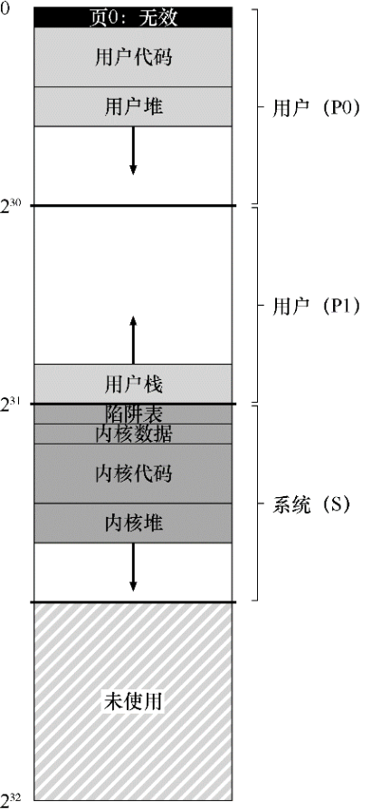

内核虚拟地址空间（即其数据结构和代码）是每个用户地址空间的一部分。在上下文切换时，操作系统改变P0和P1寄存器以指向即将运行的进程的适当页表。但是，它不会更改S基址和界限寄存器，并因此将“相同的”内核结构映射到每个用户的地址空间。

内核映射到每个地址空间，这种结构使得内核的运转更轻松。例如，如果操作系统收到用户程序（例如，在write()系统调用中）递交的指针，很容易将数据从该指针处复制到它自己的结构。通过这种构造（现在广泛使用），**内核几乎就像应用程序库一样**，尽管是受保护的。

#### 页替换

VAX中的页表项（PTE）包含以下位：一个有效位，一个保护字段（4位），一个修改（或脏位）位，为OS使用保留的字段（5位），最后是一个物理帧号码（PFN）将页面的位置存储在物理内存中。但是：`没有引用位`（no reference bit）！因此，VMS替换算法必须在没有硬件支持的情况下，确定哪些页是活跃的。

开发人员也担心会有`自私贪婪的内存`（memory hog）—— 一些程序占用大量内存，使其他程序难以运行。到目前为止，我们所看到的大部分策略都容易受到这种内存的影响。

为了解决这两个问题，提出了`分段的FIFO`（segmented FIFO）替换策略：每个进程都有一个可以保存在内存中的最大页数，称为`驻留集大小`（Resident Set Size，RSS）。每个页都保存在FIFO列表中。当一个进程超过其RSS时，“先入”的页被驱逐。

正如我们前面看到的，纯粹的FIFO并不是特别好。为了提高FIFO的性能，VMS引入了两个`二次机会列表`，页在从内存中被踢出之前被放在其中。具体来说，是全局的干净页空闲列表和脏页列表。当进程P超过其RSS时，将从其进程的FIFO中移除一个页。如果干净（未修改），则将其放在干净页列表的末尾。如果脏（已修改），则将其放在脏页列表的末尾。

如果另一个进程Q需要一个空闲页，它会从全局干净列表中取出第一个空闲页。但是，如果原来的进程P在回收之前在该页上出现页错误，则P会从空闲（或脏）列表中回收，从而避免昂贵的磁盘访问。**这些全局二次机会列表越大，分段的FIFO算法越接近LRU**。

#### 页聚集

VMS采用的另一个优化也有助于克服VMS中的小页面问题。通过聚集，VMS将大批量的页从全局脏列表中分组到一起，并将它们一举写入磁盘

#### 其它漂亮的虚拟内存技巧

VMS有另外两个现在成为标准的技巧：按需置零和写入时复制。

> 都是些惰性优化手段

利用按需置零，当页添加到你的地址空间时，操作系统的工作很少。它会在页表中放入一个标记页不可访问的条目。如果进程读取或写入页，则会向操作系统发送陷阱。此时，操作系统会完成寻找物理页的必要工作，将它置零，并映射到进程的地址空间。如果该进程从不访问该页，则所有这些工作都可以避免，从而体现按需置零的好处。

写时复制: 如果操作系统需要将一个页面从一个地址空间复制到另一个地址空间，不是实际复制它，而是将其映射到目标地址空间，并在两个地址空间中将其标记为只读。如果其中一个地址空间确实尝试写入页面，就会陷入操作系统.操作系统会注意到该页面是一个COW页面，因此（惰性地）分配一个新页，填充数据，并将这个新页映射到错误处理的地址空间

## 并发

操作系统必须用锁（lock）和条件变量（condition variable）这样的原语，来支持多线程应用程序。

操作系统是第一个并发程序，许多技术都是在操作系统内部使用的

因为中断可能随时发生，所以更新共享结构的代码（例如，分配的位图或文件的inode）是临界区。因此，从引入中断的一开始，OS设计人员就不得不担心操作系统如何更新内部结构。页表、进程列表、文件系统结构以及几乎每个内核数据结构都必须小心地访问，并使用正确的同步原语才能正常工作。

### 并发介绍

经典观点是一个程序只有一个执行点（一个程序计数器，用来存放要执行的指令），但多线程（multi-threaded）程序会有多个执行点（多个程序计数器，每个都用于取指令和执行）。换一个角度来看，每个线程类似于独立的进程，只有一点区别：它们共享地址空间，从而能够访问相同的数据。

与进程相比，线程之间的上下文切换有一点主要区别：地址空间保持不变（即不需要切换当前使用的页表）。

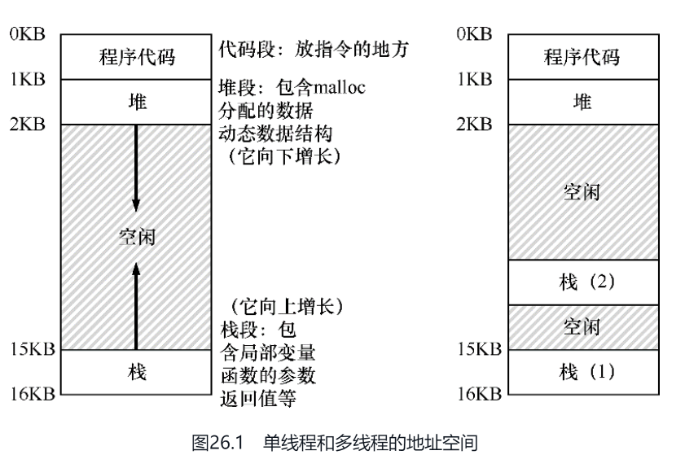

所有位于栈上的变量、参数、返回值和其他放在栈上的东西，将被放置在有时称为线程本地（thread-local）存储的地方，即相关线程的栈

有了并发，多个线程在修改共享数据时会很麻烦。

#### 核心问题：不可控的调度

例如给 counter(50) 加1

```java
mov 0x8049a1c, %eax 
add $0x1, %eax
mov %eax, 0x8049a1c
```

> 可以通过 `objectdump -d executable` 得到二进制程序的汇编代码

如果线程1运行完第一个指令，发生上下文切换，操作系统将当前正在运行的线程（它的程序计数器、寄存器，包括eax等）的状态保存到线程的TCB。

然后线程2被选中执行，并进入这段代码，并执行完毕，现在 counter 的值是 51。然后切换回线程1，寄存器 eax 的值是 50，执行完后两个指令，最后 counter 的值还是 51。也就是说加了两次，但是 counter 等于 51，而不是 52.

这里展示的情况称为`竞态条件`（race condition）：结果取决于代码的时间执行。

由于执行这段代码的多个线程可能导致竞争状态，因此我们将此段代码称为`临界区`（critical section）

> 临界区（critical section）是访问共享资源的一段代码，资源通常是一个变量或数据结构。

#### 原子性愿望

解决这个问题的一种途径是拥有更强大的指令，单步就能完成要做的事，从而消除不合时宜的中断的可能性。

但在一般情况下，不会有这样的指令。设想我们要构建一个并发的B树，并希望更新它。我们真的希望硬件支持“B树的原子性更新”指令吗？

因此，我们要做的是要求硬件提供一些有用的指令，可以在这些指令上构建一个通用的集合，即所谓的`同步原语`（synchronization primitive）。

#### 等待另一个线程

我们不仅要研究如何构建对同步原语的支持来支持原子性，还要研究支持在多线程程序中常见的睡眠/唤醒交互的机制。

### 插叙：线程 API

线程创建并等待线程完成

```c
#include <stdio.h>
#include <pthread.h>
#include <assert.h>
#include <stdlib.h>

typedef struct  myarg_t {
    int a;
    int b;
} myarg_t;

typedef struct  myret_t {
    int x;
    int y;
} myret_t;

void *mythread(void *arg) {
    myarg_t *m = (myarg_t *) arg;
    printf("%d %d\n", m->a, m->b);
    myret_t *r = Malloc(sizeof(myret_t));
    r->x = 1;
    r->y = 2;
    return (void *) r;
}

int
main(int argc, char *argv[]) {
    int rc;
    pthread_t p;
    myret_t *m;

    myarg_t args;
    args.a = 10;
    args.b = 20;
    Pthread_create(&p, NULL, mythread, &args);
    Pthread_join(p, (void **) &m);
    printf("returned %d %d\n", m->x, m->y);
    return 0;
}
```

锁：

```cpp
int pthread_mutex_lock(pthread_mutex_t *mutex); 
int pthread_mutex_unlock(pthread_mutex_t *mutex);

int pthread_mutex_trylock(pthread_mutex_t *mutex); 
int pthread_mutex_timedlock(pthread_mutex_t *mutex,
                           struct timespec *abs_timeout);
```

条件变量:

```cpp
int pthread_cond_wait(pthread_cond_t *cond, pthread_mutex_t *mutex); 
int pthread_cond_signal(pthread_cond_t *cond);
```

```cpp
pthread_mutex_t lock = PTHREAD_MUTEX_INITIALIZER; 
pthread_cond_t cond = PTHREAD_COND_INITIALIZER;

Pthread_mutex_lock(&lock); 
while (ready == 0)
    Pthread_cond_wait(&cond, &lock); 
Pthread_mutex_unlock(&lock);
```

> 在被唤醒之后返回之前，pthread_cond_wait()会重新获取该锁，

```cpp
Pthread_mutex_lock(&lock); 
ready = 1; 
Pthread_cond_signal(&cond); 
Pthread_mutex_unlock(&lock);
```

### 锁

并发编程的一个最基本问题：我们希望原子式执行一系列指令，但由于单处理器上的中断（或者多个线程在多处理器上并发执行），我们做不到。

POSIX库将锁称为`互斥量`（mutex）

```cpp
pthread_mutex_t lock = PTHREAD_MUTEX_INITIALIZER;

Pthread_mutex_lock(&lock);    // wrapper for pthread_mutex_lock()
balance = balance + 1;
Pthread_mutex_unlock(&lock);
```

#### 实现一个锁

> 关键问题：怎样实现一个锁如何构建一个高效的锁？
> 
> 高效的锁能够以低成本提供互斥，同时能够实现一些特性，我们下面会讨论。需要什么硬件支持？什么操作系统支持？

#### 评价锁

标准：

- 是否能完成它的基本任务，即提供互斥（mutual exclusion）
- 公平性（fairness）。当锁可用时，是否每一个竞争线程有公平的机会抢到锁？
- 性能。具体来说，是使用锁之后增加的时间开销

#### 控制中断

最早提供的互斥解决方案之一，就是在临界区关闭中断。这个解决方案是为单处理器系统开发的

```cpp
void lock() {
    DisableInterrupts();
}
void unlock() {
    EnableInterrupts();
}
```

这个方法的主要优点就是简单。

遗憾的是，缺点很多。

- 首先，这种方法要求我们允许所有调用线程执行特权操作（打开关闭中断），即信任这种机制不会被滥用。
- 第二，这种方案不支持多处理器。
- 第三，关闭中断导致中断丢失，可能会导致严重的系统问题。
- 最后一个不太重要的原因就是效率低。与正常指令执行相比，现代CPU对于关闭和打开中断的代码执行得较慢。

基于以上原因，只在很有限的情况下用关闭中断来实现互斥原语。例如，在某些情况下操作系统本身会采用屏蔽中断的方式，保证访问自己数据结构的原子性，或至少避免某些复杂的中断处理情况。

#### 基于软件的锁

```cpp
int flag[2];
int turn;
　
void init() {
    flag[0] = flag[1] = 0;      // 1->thread wants to grab lock
    turn = 0;                   // whose turn? (thread 0 or 1?)
}
void lock() {
    flag[self] = 1;             // self: thread ID of caller
    turn = 1 - self;            // make it other thread's turn
    while ((flag[1-self] == 1) && (turn == 1 - self))
        ; // spin-wait
}
void unlock() {
    flag[self] = 0;             // simply undo your intent
}
```

这个算法很巧妙，但是没有太多意义，因为只需要很少的硬件支持，实现锁就会容易很多。而且上面提到的方法无法运行在现代硬件（应为松散内存一致性模型），导致它们更加没有用处。

#### 测试并设置指令（原子交换）

最简单的硬件支持是测试并设置指令（test-and-set instruction），也叫作原子交换（atomic exchange）。

利用测试并设置的简单自旋锁:

```cpp
typedef struct  lock_t {
    int flag;
} lock_t;

void init(lock_t *lock) {
    // 0 indicates that lock is available, 1 that it is held
    lock->flag = 0;
}

void lock(lock_t *lock) {
    while (TestAndSet(&lock->flag, 1) == 1)
        ; // spin-wait (do nothing)
}

void unlock(lock_t *lock) {
    lock->flag = 0;
}
```

#### 评价自旋锁

首先是实现了互斥。

但是自旋锁没有公平性，可能会导致饿死。

对于性能，在单 CPU 的情况下，自旋锁的性能开销相当大。

但是，在多CPU上，自旋锁性能不错（如果线程数大致等于CPU数）

> 临界区一般都很短，因此很快锁就可用。自旋等待其他处理器上的锁，并没有浪费很多CPU周期，因此效果不错。

#### 比较并交换

某些系统提供了另一个硬件原语，即比较并交换指令（SPARC系统中是`compare-and-swap`，x86系统是`compare-and-exchange`）

该指令的伪代码

```cpp
int CompareAndSwap(int *ptr, int expected, int new) {
    int actual = *ptr;
    if (actual == expected)
        *ptr = new;
    return actual;
}
```

使用比较并交换指令实现的锁：

```cpp
void lock(lock_t *lock) {
    while (CompareAndSwap(&lock->flag, 0, 1) == 1)
        ; // spin
}
```

> 比较并交换指令比测试并设置更强大


#### 获取并增加

最后一个硬件原语是获取并增加（`fetch-and-add`）指令，它能原子地返回特定地址的旧值，并且让该值自增一。

会用获取并增加指令，实现一个更有趣的ticket锁

```cpp
int FetchAndAdd(int *ptr) {
    int old = *ptr;
    *ptr = old + 1;
    return old;
}
typedef struct  lock_t {
    int ticket;
    int turn;
} lock_t;

void lock_init(lock_t *lock) {
    lock->ticket = 0;
    lock->turn   = 0;
}

void lock(lock_t *lock) {
    int myturn = FetchAndAdd(&lock->ticket);
    while (lock->turn != myturn)
        ; // spin
}

void unlock(lock_t *lock) {
    FetchAndAdd(&lock->turn);
}
```

本方法能够保证所有线程都能抢到锁。只要一个线程获得了ticket值，它最终会被调度。之前的方法则不会保证。比如基于测试并设置的方法，一个线程有可能一直自旋，即使其他线程在获取和释放锁。

> 也就是说 ticket 锁具有公平性

#### 自旋过多：怎么办

> 关键问题：怎样避免自旋
> 
> 如何让锁不会不必要地自旋，浪费CPU时间？

硬件支持让我们有了很大的进展：我们已经实现了有效、公平（通过ticket锁）的锁。但是自旋浪费 CPU 的问题还存在

#### 简单方法：让出来吧，宝贝

第一种简单友好的方法就是，在要自旋的时候，放弃CPU

```cpp
void init() {
    flag = 0;
}

void lock() {
    while (TestAndSet(&flag, 1) == 1)
        yield(); // give up the CPU
}

void unlock() {
    flag = 0;
}
```

考虑在单CPU上运行两个线程，基于 `yield` 的方法十分有效。但是如果竞争的线程很多，会频繁得进行上下文切换，这种方法仍然成本很高。

而且可能会有饿死的问题。一个线程可能一直处于让出的循环，而其他线程反复进出临界区。

#### 使用队列：休眠替代自旋

显式地施加某种控制，决定锁释放时，谁能抢到锁。为了做到这一点，我们需要操作系统的更多支持，并需要一个队列来保存等待锁的线程。

简单起见，我们利用Solaris提供的支持，它提供了两个调用：`park()` 能够让调用线程休眠，`unpark(threadID)` 则会唤醒threadID标识的线程

使用队列，测试并设置、让出和唤醒的锁:

```cpp
typedef struct  lock_t {
    int flag;
    int guard;
    queue_t *q;
} lock_t;

void lock_init(lock_t *m) {
    m->flag = 0;
    m->guard = 0;
    queue_init(m->q);
}

void lock(lock_t *m) {
    while (TestAndSet(&m->guard, 1) == 1)
        ; //acquire guard lock by spinning
    if (m->flag == 0) {
        m->flag = 1; // lock is acquired
        m->guard = 0;
    } else {
        queue_add(m->q, gettid());
        m->guard = 0;
        park();
    }
}

void unlock(lock_t *m) {
    while (TestAndSet(&m->guard, 1) == 1)
        ; //acquire guard lock by spinning
    if (queue_empty(m->q))
        m->flag = 0; // let go of lock; no one wants it
    else
        unpark(queue_remove(m->q)); // hold lock (for next thread!)
    m->guard = 0;
}
```

这个代码中还有一个竞争条件：在 park() 调用之前，锁被另一个线程释放了，可能这个线程就会永远地睡下去了。这种问题有时称为唤醒/等待竞争（wakeup/waiting race）。

Solaris通过增加了第三个系统调用 `separk()`来解决这一问题。通过setpark()，一个线程表明自己马上要park。如果刚好另一个线程被调度，并且调用了unpark，那么后续的park调用就会直接返回，而不是一直睡眠。

lock 的代码可以修改为

```cpp
queue_add(m->q, gettid());
setpark(); // new code
m->guard = 0;
```

另外一种方案就是将guard传入内核。在这种情况下，内核能够采取预防措施，保证原子地释放锁，把运行线程移出队列。


#### 不同的操作系统，不同实现

Linux提供了`futex`。每个futex都关联一个特定的物理内存位置，也有一个事先建好的内核队列。

调用`futex_wait(address, expected)`时，如果address处的值等于expected，就会让调用线程睡眠。否则，调用立刻返回。调用`futex_wake(address)`唤醒等待队列中的一个线程

```cpp
void mutex_lock (int *mutex) {
    int v;
    /* Bit 31 was clear, we got the mutex (this is the fastpath) */
    if (atomic_bit_test_set (mutex, 31) == 0)
    return;
    atomic_increment (mutex);
    while (1) {
        if (atomic_bit_test_set (mutex, 31) == 0) {
            atomic_decrement (mutex);
            return;
        }
        /* We have to wait now. First make sure the futex value
        we are monitoring is truly negative (i.e. locked). */
        v = *mutex;
        if (v >= 0)
        continue;
        futex_wait (mutex, v);
    }
}

void mutex_unlock (int *mutex) {
    /* Adding 0x80000000 to the counter results in 0 if and only if
    there are not other interested threads */
    if (atomic_add_zero (mutex, 0x80000000))
    return;

    /* There are other threads waiting for this mutex,
    wake one of them up. */
    futex_wake (mutex);
```

利用一个整数，同时记录锁是否被持有（整数的最高位），以及等待者的个数（整数的其余所有位）。

#### 两阶段锁

Linux采用的是一种古老的锁方案 也称为两阶段锁（two-phase lock）。两阶段锁意识到自旋可能很有用，尤其是在很快就要释放锁的场景。因此，两阶段锁的第一阶段会先自旋一段时间，希望它可以获取锁。如果第一个自旋阶段没有获得锁，第二阶段调用者会睡眠，直到锁可用。上文的Linux锁就是这种锁，不过只自旋一次；更常见的方式是在循环中自旋固定的次数，然后使用futex睡眠。

#### 小结

以上的方法展示了如今真实的锁是如何实现的：一些硬件支持（更加强大的指令）和一些操作系统支持（例如Solaris的park()和unpark()原语，Linux的futex）

### 基于锁的并发数据结构

> 关键问题：如何给数据结构加锁？
> 
> 对于特定数据结构，如何加锁才能让该结构功能正确？进一步，如何对该数据结构加锁，能够保证高性能，让许多线程同时访问该结构，即并发访问（concurrently）？

#### 并发计数器

懒惰计数器通过多个局部计数器和一个全局计数器来实现一个逻辑计数器，其中每个CPU核心有一个局部计数器。为了保持全局计数器更新（以防某个线程要读取该值），局部值会定期转移给全局计数器，方法是获取全局锁，让全局计数器加上局部计数器的值，然后将局部计数器置零。这种局部转全局的频度，取决于一个阈值，这里称为S（表示sloppiness）。S越小，懒惰计数器则越趋近于非扩展的计数器。S越大，扩展性越强，但是全局计数器与实际计数的偏差越大。

```cpp
typedef struct  counter_t {
    int             global;            // global count
    pthread_mutex_t glock;             // global lock
    int             local[NUMCPUS];    // local count (per cpu)
    pthread_mutex_t llock[NUMCPUS];    // ... and locks
    int             threshold;         // update frequency
} counter_t;

// init: record threshold, init locks, init values
//       of all local counts and global count
void init(counter_t *c, int threshold) {
    c->threshold = threshold;

    c->global = 0;
    pthread_mutex_init(&c->glock,  NULL);

    int i;
    for (i = 0; i < NUMCPUS; i++) {
        c->local[i] = 0;
        pthread_mutex_init(&c->llock[i],  NULL);
    }
}

// update: usually, just grab local lock and update local amount
//        once local count has risen by 'threshold', grab global
//        lock and transfer local values to it
void update(counter_t *c, int threadID, int amt) {
    pthread_mutex_lock(&c->llock[threadID]);
    c->local[threadID] += amt;               // assumes amt > 0
    if (c->local[threadID] >= c->threshold) { // transfer to global
        pthread_mutex_lock(&c->glock);
        c->global += c->local[threadID];
        pthread_mutex_unlock(&c->glock);
        c->local[threadID] = 0;
    }
    pthread_mutex_unlock(&c->llock[threadID]);
}

// get: just return global amount (which may not be perfect)
int get(counter_t *c) {
    pthread_mutex_lock(&c->glock);
    int val = c->global;
    pthread_mutex_unlock(&c->glock);
    return val; // only approximate!
}
```

#### 并发链表

#### 并发队列

#### 并发散列表

### 条件变量

锁并不是并发程序设计所需的唯一原语。

在很多情况下，线程需要检查某一条件（condition）满足之后，才会继续运行.

> 关键问题：如何等待一个条件？
>
> 多线程程序中，一个线程等待某些条件是很常见的。简单的方案是自旋直到条件满足，这是极其低效的，某些情况下甚至是错误的。那么，线程应该如何等待一个条件？

线程可以使用`条件变量`（condition variable），来等待一个条件变成真。条件变量是一个显式队列，当某些执行状态（即条件，condition）不满足时，线程可以把自己加入队列，等待（waiting）该条件。

条件变量有两种相关操作：`wait()` 和 `signal()`。线程要睡眠的时候，调用wait()。当线程想唤醒等待在某个条件变量上的睡眠线程时，调用signal()。

父线程等待子线程：

```cpp
pthread_cond_wait(pthread_cond_t *c, pthread_mutex_t *m); 
pthread_cond_signal(pthread_cond_t  *c);

int done = 0;
pthread_mutex_t m = PTHREAD_MUTEX_INITIALIZER;
pthread_cond_t c = PTHREAD_COND_INITIALIZER;

void thr_exit() {
    Pthread_mutex_lock(&m);
    done = 1;
    Pthread_cond_signal(&c);
    Pthread_mutex_unlock(&m);
}

void *child(void *arg) {
    printf("child\n");
    thr_exit();
    return NULL;
}

void thr_join() {
    Pthread_mutex_lock(&m);
    while (done == 0)
        Pthread_cond_wait(&c, &m);
    Pthread_mutex_unlock(&m);
}

int main(int argc, char *argv[]) {
    printf("parent: begin\n");
    pthread_t p;
    Pthread_create(&p, NULL, child, NULL);
    thr_join();
    printf("parent: end\n");
    return 0;
}
```

wait()调用有一个参数，它是互斥量。它假定**在wait()调用时，这个互斥量是已上锁状态**。wait()的**职责是释放锁，并让调用线程休眠（原子地）**。当线程被唤醒时（在另外某个线程发信号给它后），它必须重新获取锁，再返回调用者。这样复杂的步骤也是为了避免在线程陷入休眠时，产生一些竞态条件


done 变量是必须的，否则在发起唤醒信号在wait之前就会出现问题，另外还可能出现假唤醒情况，因此 done 变量的判断要用 while

!> 调用 signal 和 wait 时要持有锁

!> 总是使用while循环

#### 生产者消费者问题

```cpp
int buffer[MAX];
int fill_ptr = 0;
int use_ptr   = 0;
int count = 0;

void put(int value) {
    buffer[fill_ptr] = value;
    fill_ptr = (fill_ptr + 1) % MAX;
    count++;
}

int get() {
    int tmp = buffer[use_ptr];
    use_ptr = (use_ptr + 1) % MAX;
    count--;
    return tmp;
}


cond_t empty, fill;
mutex_t mutex;

void *producer(void *arg) {
    int i;
    for (i = 0; i < loops; i++) {
        Pthread_mutex_lock(&mutex);                 // p1
        while (count == MAX)                        // p2
            Pthread_cond_wait(&empty, &mutex);      // p3
        put(i);                                     // p4
        Pthread_cond_signal(&fill);                 // p5
        Pthread_mutex_unlock(&mutex);               // p6
    }
}

void *consumer(void *arg) {
    int i;
    for (i = 0; i < loops; i++) {
        Pthread_mutex_lock(&mutex);               // c1
        while (count == 0)                            // c2
            Pthread_cond_wait(&fill, &mutex);     // c3
        int tmp = get();                              // c4
        Pthread_cond_signal(&empty);              // c5
        Pthread_mutex_unlock(&mutex);             // c6
        printf("%d\n", tmp);
    }
}
```

关键在于使用两个条件变量

#### 覆盖条件

如果在条件变量上等待的线程要满足的条件不一样，可以使用 `pthread_cond_broadcast()` 代替上述代码中的 `pthread_cond_signal()`，唤醒所有的等待线程。以确保唤醒能往下执行的线程。这种条件变量叫作覆盖条件（covering condition）

### 信号量

信号量可以作为与同步有关的所有工作的单一原语。也就是说可以用信号量作为锁和条件变量

> 关键问题：如何使用信号量？
>
> 如何使用信号量代替锁和条件变量？什么是信号量？什么是二值信号量？用锁和条件变量来实现信号量是否简单？不用锁和条件变量，如何实现信号量？

#### 信号量的定义

信号量是有一个整数值的对象，可以用两个函数来操作它。在POSIX标准中，是 `sem_wait()` 和 `sem_post()`。因为信号量的初始值能够决定其行为，所以首先要初始化信号量，才能调用其他函数与之交互，

```cpp
#include <semaphore.h>
sem_t s;
sem_init(&s, 0, 1);
```

wait 和 post 的定义：

```cpp
int sem_wait(sem_t *s) {
    decrement the value of semaphore s by one
    wait if value of semaphore s is negative
}

int sem_post(sem_t *s) {
    increment the value of semaphore s by one
    if there are one or more threads waiting, wake one
}
```

首先，sem_wait()要么立刻返回（调用sem_wait()时，信号量的值大于等于1），要么会让调用线程挂起，直到之后的一个post操作。

其次，sem_post()并没有等待某些条件满足。它直接增加信号量的值，如果有等待线程，唤醒其中一个。

最后，当信号量的值为负数时，这个值就是等待线程的个数[D68b]。

#### 二值信号量

```cpp
sem_t m;
sem_init(&m, 0, X); // initialize semaphore to X; what should X be?

sem_wait(&m);
// critical section here
sem_post(&m);
```

当初始值 X 为 1 时，就是二值信号量，拥有锁的特征

#### 信号量用作条件变量

```cpp
sem_t s;

void * child(void *arg) {
    printf("child\n");
    sem_post(&s); // signal here: child is done
    return NULL;
}

int main(int argc, char *argv[]) {
    sem_init(&s, 0, X); // what should X be?
    printf("parent: begin\n");
    pthread_t c;
    Pthread_create(c, NULL, child, NULL);
    sem_wait(&s); // wait here for child
    printf("parent: end\n");
    return 0;
}
```

信号量初始值应该是0。

#### 生产者/消费者（有界缓存区）问题

```cpp
sem_t empty;
sem_t full;
sem_t mutex;

void *producer(void *arg) {
    int i;
    for (i = 0; i < loops; i++) {
        sem_wait(&empty);            // line p1
        sem_wait(&mutex);            // line p1.5 (MOVED MUTEX HERE...)
        put(i);                      // line p2
        sem_post(&mutex);            // line p2.5 (... AND HERE)
        sem_post(&full);             // line p3
    }
}

void *consumer(void *arg) {
    int i;
    for (i = 0; i < loops; i++) {
        sem_wait(&full);             // line c1
        sem_wait(&mutex);            // line c1.5 (MOVED MUTEX HERE...)
        int tmp = get();             // line c2
        sem_post(&mutex);            // line c2.5 (... AND HERE)
        sem_post(&empty);            // line c3
        printf("%d\n", tmp);
    }
}

int main(int argc, char *argv[]) {
    // ...
    sem_init(&empty, 0, MAX);  // MAX buffers are empty to begin with...
    sem_init(&full, 0, 0);     // ... and 0 are full
    sem_init(&mutex, 0, 1);    // mutex=1 because it is a lock
    // ...
}
```

#### 读写锁

```cpp
typedef struct _rwlock_t {
    sem_t lock;      // binary semaphore (basic lock)
    sem_t writelock; // used to allow ONE writer or MANY readers
    int    readers;  // count of readers reading in critical section
} rwlock_t;

void rwlock_init(rwlock_t *rw) {
    rw->readers = 0;
    sem_init(&rw->lock, 0, 1);
    sem_init(&rw->writelock, 0, 1);
}

void rwlock_acquire_readlock(rwlock_t *rw) {
    sem_wait(&rw->lock);
    rw->readers++;
    if (rw->readers == 1)
    sem_wait(&rw->writelock); // first reader acquires writelock
    sem_post(&rw->lock);
}

void rwlock_release_readlock(rwlock_t *rw) {
    sem_wait(&rw->lock);
    rw->readers--;
    if (rw->readers == 0)
    sem_post(&rw->writelock); // last reader releases writelock
    sem_post(&rw->lock);
}

void rwlock_acquire_writelock(rwlock_t *rw) {
    sem_wait(&rw->writelock);
}

void rwlock_release_writelock(rwlock_t *rw) {
    sem_post(&rw->writelock);
}
```

上面的读写锁缺乏公平性。有写者等待时，如何能够避免更多的读者进入并持有锁?

!> 读写锁通常加入了更多开销（尤其是更复杂的实现），因此和其他一些简单快速的锁相比，读者写者锁在性能方面没有优势

#### 哲学家问题

关键在于修改某个或者某些哲学家的取餐叉顺序。

```cpp
void getforks() {
    if (p == 4) {
    sem_wait(forks[right(p)]);
    sem_wait(forks[left(p)]);
    } else {
    sem_wait(forks[left(p)]);
    sem_wait(forks[right(p)]);
    }
}
```

#### 如何实现信号量

用底层的同步原语（锁和条件变量），来实现自己的信号量，

```cpp
typedef struct  _Zem_t {
    int value;
    pthread_cond_t cond;
    pthread_mutex_t lock;
} Zem_t;

// only one thread can call this
void Zem_init(Zem_t *s, int value) {
    s->value = value;
    Cond_init(&s->cond);
    Mutex_init(&s->lock);
}

void Zem_wait(Zem_t *s) {
    Mutex_lock(&s->lock);
    while (s->value <= 0)
        Cond_wait(&s->cond, &s->lock);
    s->value--;
    Mutex_unlock(&s->lock);
}

void Zem_post(Zem_t *s) {
    Mutex_lock(&s->lock);
    s->value++;
    Cond_signal(&s->cond);
    Mutex_unlock(&s->lock);
}
```

我们可以把信号量当作锁和条件变量的泛化。但这种泛化有必要吗?

很奇怪，利用信号量来实现锁和条件变量，是棘手得多的问题。

信号量是编写并发程序的强大而灵活的原语。有程序员会因为简单实用，只用信号量，不用锁和条件变量。

!> 用信号量还是锁&条件变量，都尝试下然乎选最简单直观的

### 常见并发问题

> 关键问题：如何处理常见的并发缺陷
>
> 并发缺陷会有很多常见的模式。了解这些模式是写出健壮、正确程序的第一步。


#### 非死锁缺陷

非死锁问题占了并发问题的大多数。 

主要讨论其中两种(占比97%)：`违反原子性`（atomicity violation）缺陷和`错误顺序`（order violation）缺陷。

违反原子性：

```cpp
Thread 1::
if (thd->proc_info) {
    ...
    fputs(thd->proc_info, ...);
    ...
}

Thread 2::
thd->proc_info = NULL;
```

可以通过加锁来解决

错误顺序缺陷：

```cpp
Thread 1::
void init() {
    ...
    mThread = PR_CreateThread(mMain, ...);
    ...
}

Thread 2::
void mMain(...) {
    ...
    // mThread 可能为
    mState = mThread->State;
    ...
}
```

可以通过条件变量来解决

#### 死锁缺陷

> 关键问题：如何对付死锁
>
> 我们在实现系统时，如何避免或者能够检测、恢复死锁呢？这是目前系统中的真实问题吗？

产生死锁的条件：

- 互斥：线程对于需要的资源进行互斥的访问（例如一个线程抢到锁）。
- 持有并等待：线程持有了资源（例如已将持有的锁），同时又在等待其他资源（例如，需要获得的锁）。
- 非抢占：线程获得的资源（例如锁），不能被抢占。
- 循环等待：线程之间存在一个环路，环路上每个线程都额外持有一个资源，而这个资源又是下一个线程要申请的。

如果这4个条件的任何一个没有满足，死锁就不会产生。预防死锁的方法就是设法阻止某一个条件，从而解决死锁的问题。

破坏循环等待条件：最直接的方法就是获取锁时提供一个全序（total ordering）。复杂的系统，锁的全序很难做到，偏序（partial ordering）可能是一种有用的方法，安排锁的获取并避免死锁。

> 可以根据锁的地址作为获取锁的顺序

但是，顺序只是一种约定，粗心的程序员很容易忽略，导致死锁。

破坏持有并等待条件：可以通过原子地抢锁来避免。先抢到全局的prevention锁。

```cpp
lock(prevention);
lock(L1);
lock(L2);
...
unlock(prevention);
```

破坏抢占条件：

```cpp
top:
    lock(L1);
    if (trylock(L2) == -1) {
    unlock(L1);
    goto top;
}
```

但是会引来一个新的问题：活锁（livelock）

破坏互斥：设计各种无等待（wait-free）数据结构。

除了死锁预防，某些场景更适合死锁避免。通过调度避免死锁：Dijkstra提出的银行家算法。

这些方案的适用场景很局限。例如，在嵌入式系统中，你知道所有任务以及它们需要的锁。这种方法会限制并发。因此，通过调度来避免死锁不是广泛使用的通用方案。

检查和恢复：最后一种常用的策略就是允许死锁偶尔发生，检查到死锁时再采取行动。

很多数据库系统使用了死锁检测和恢复技术。死锁检测器会定期运行，通过构建资源图来检查循环。

### 基于事件的并发（进阶）

除了线程外的另一种并发方式。这种方式称为基于事件的并发（event-based concurrency）

> 关键问题：不用线程，如何构建并发服务器
>
> 不用线程，同时保证对并发的控制，避免多线程应用中出现的问题，我们应该如何构建一个并发服务器？

#### 基本想法：事件循环

```cpp
while (1) {
    events = getEvents(); 
    for (e in events)
        processEvent(e);
}
```

#### 重要API：select()（或 poll()）

知道了基本的事件循环，我们接下来必须解决如何接收事件的问题。大多数系统提供了基本的API，即通过select()或poll()系统调用。

```cpp
int select(int nfds,
           fd_set *restrict readfds, 
           fd_set *restrict writefds, 
           fd_set *restrict errorfds,
           struct timeval *restrict timeout);
```

select()检查I/O描述符集合，它们的地址通过readfds、writefds和errorfds传入，分别查看它们中的某些描述符是否已准备好读取，是否准备好写入，或有异常情况待处理

> 补充：阻塞（或同步，synchronous）接口在返回给调用者之前完成所有工作。非阻塞（或异步，asynchronous）接口开始一些工作，但立即返回，从而让所有需要完成的工作都在后台完成。


#### 使用 select()

```cpp
#include <stdio.h>
#include <stdlib.h>
#include <sys/time.h>
#include <sys/types.h>
#include <unistd.h>

int main(void) {
    // open and set up a bunch of sockets (not shown)
    // main loop
    while (1) {
        // initialize the fd_set to all zero
        fd_set readFDs;
        FD_ZERO(&readFDs);

        // now set the bits for the descriptors
        // this server is interested in
        // (for simplicity, all of them from min to max)
        int fd;
        for (fd = minFD; fd < maxFD; fd++)
            FD_SET(fd, &readFDs);

        // do the select
        int rc = select(maxFD+1, &readFDs, NULL, NULL, NULL);

        // check which actually have data using FD_ISSET()
        int fd;
        for (fd = minFD; fd < maxFD; fd++)
            if (FD_ISSET(fd, &readFDs))
                processFD(fd);
    }
}
```

#### 为何简单？无须锁

基于事件的服务器不能被另一个线程中断，因为它确实是单线程的

基于事件的系统中必须遵守一条规则：不允许阻塞调用。

那么遇到阻塞的系统调用怎么办？

#### 解决方案：异步I/O

许多现代操作系统已经引入了新的方法来向磁盘系统发出I/O请求，一般称为异步I/O。

这些接口使应用程序能够发出I/O请求，并在I/O完成之前立即将控制权返回给调用者，另外的接口让应用程序能够确定各种I/O是否已完成。

那么如何如何知道I/O何时完成，并且缓冲区（由aio buf指向）现在有了请求的数据？

可以通过周期性地轮询（poll）系统，以确定所述I/O是否尚未完成。但是这样效率很低

为了解决这个问题，一些系统提供了`基于中断`（interrupt）的方法。此方法使用`UNIX信号`（signal）在异步I/O完成时通知应用程序，从而消除了重复询问系统的需要。

补充 UNIX 信号：信号提供了一种与进程进行通信的方式。具体来说，可以将信号传递给应用程序。这样做会让应用程序停止当前的任何工作，开始运行信号处理程序（signal handler），即应用程序中某些处理该信号的代码。完成后，该进程就恢复其先前的行为。

在没有异步I/O的系统中，纯基于事件的方法无法实现。可以使用线程池来管理未完成的I/O，模拟基于事件的方式

#### 另一个问题：状态管理

基于事件的方法的另一个问题是，这种代码通常比传统的基于线程的代码更复杂。

当事件处理程序发出异步I/O时，它必须打包一些程序状态，以便下一个事件处理程序在I/O最终完成时使用。因为程序需要的状态在线程栈中。称之为手工栈管理（manual stack management），这是基于事件编程的基础

解决方案是使用一种称为“延续（continuation）”的老编程语言结构。这个想法很简单：基本上，在某些数据结构中，记录完成处理该事件需要的信息。当事件发生时（即磁盘I/O完成时），查找所需信息并处理事件。

#### 什么事情仍然很难

在现代多核系统上，无锁的简单事件处理已不再可能。

基于事件的方法的另一个问题是，它不能很好地与某些类型的系统活动集成，如分页（paging）。由于页错误导致的这种隐式阻塞很难避免，因此在频繁发生时可能会导致较大的性能问题。

还有一个问题是随着时间的推移，基于事件的代码可能很难管理，因为各种函数的确切语义发生了变化

## 持久性

### I/O 设备

> 关键问题：如何将I/O集成进计算机系统中
> 
> I/O应该如何集成进系统中？其中的一般机制是什么？如何让它们变得高效？

#### 系统架构

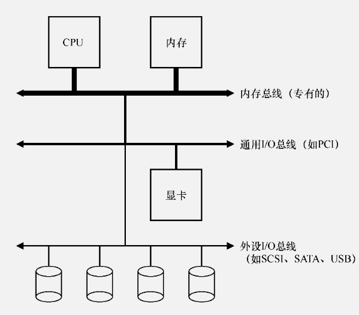

越快的总线越短，因此高性能的内存总线没有足够的空间连接太多设备。让要求高性能的设备（比如显卡）离CPU更近一些,

#### 标准设备

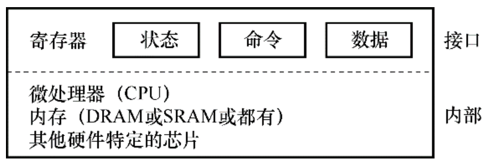

#### 标准协议

```cpp
While (STATUS == BUSY)
    ; // wait until device is not busy 
Write data to DATA register
Write command to COMMAND register
    (Doing so starts the device and executes the command) 
While (STATUS == BUSY)
    ; // wait until device is done with your request
```

如果主CPU参与数据移动（就像这个示例协议一样），我们就称之为编程的I/O（PIO）

这个简单的协议好处是足够简单并且有效。但是轮询过程比较低效，在等待设备执行完成命令时浪费大量CPU时间

> 关键问题：如何减少轮询开销
> 
> 操作系统检查设备状态时如何避免频繁轮询，从而降低管理设备的CPU开销？

#### 利用中断减少 CPU 开销

有了中断后，CPU 不再需要不断轮询设备，而是向设备发出一个请求，然后就可以让对应进程睡眠，切换执行其他任务。当设备完成了自身操作，会抛出一个硬件中断，引发CPU跳转执行操作系统预先定义好的中断服务例程（Interrupt Service Routine，ISR），或更为简单的中断处理程序（interrupt handler）。中断处理程序是一小段操作系统代码，它会结束之前的请求（比如从设备读取到了数据或者错误码）并且唤醒等待I/O的进程继续执行。

注意，使用中断并非总是最佳方案。如果设备非常快，那么最好的办法反而是轮询

另一个最好不要使用中断的场景是网络。网络端收到大量数据包，如果每一个包都发生一次中断，那么有可能导致操作系统发生活锁（livelock），即不断处理中断而无法处理用户层的请求。

另一个基于中断的优化就是合并（coalescing）。设备在抛出中断之前往往会等待一小段时间，在此期间，其他请求可能很快完成，因此多次中断可以合并为一次中断抛出，从而降低处理中断的代价

#### 利用 DMA 进行更高效的数据传送

> 关键问题：如何减少PIO的开销
> 
> 使用PIO的方式，CPU的时间会浪费在向设备传输数据或从设备传出数据的过程中。如何才能分离这项工作，从而提高CPU的利用率？

解决方案就是使用 `DMA`（Direct Memory Access）。DMA引擎是系统中的一个特殊设备，它可以协调完成内存和设备间的数据传递，不需要CPU介入。

为了能够将数据传送给设备，操作系统会通过编程告诉DMA引擎数据在内存的位置，要拷贝的大小以及要拷贝到哪个设备。在此之后，操作系统就可以处理其他请求了。当DMA的任务完成后，DMA控制器会抛出一个中断来告诉操作系统自己已经完成数据传输。

#### 设备交互的方法

> 关键问题：如何与设备通信
> 
> 硬件如何与设备通信？是否需要一些明确的指令？或者其他的方式？

主要有两种方式来实现与设备的交互。第一种办法相对老一些（在IBM主机中使用了多年），就是用明确的I/O指令。例如在x86上，in和out指令可以用来与设备进行交互。

第二种方法是内存映射I/O（memory- mapped I/O）。通过这种方式，硬件将设备寄存器作为内存地址提供

两种方法没有一种具备极大的优势。内存映射I/O的好处是不需要引入新指令来实现设备交互，

#### 纳入操作系统：设备驱动程序

> 关键问题：如何实现一个设备无关的操作系统
> 
> 如何保持操作系统的大部分与设备无关，从而对操作系统的主要子系统隐藏设备交互的细节？

在最底层，操作系统的一部分软件清楚地知道设备如何工作，我们将这部分软件称为设备驱动程序（device driver），所有设备交互的细节都封装在其中。

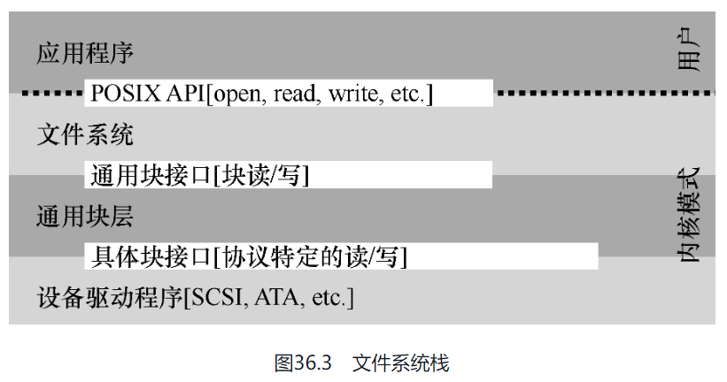

这种封装也有不足的地方。例如，如果有一个设备可以提供很多特殊的功能，但为了兼容大多数操作系统它不得不提供一个通用的接口，这样就使得自身的特殊功能无法使用。

查看Linux内核代码会发现，超过70%的代码都是各种驱动程序。

#### 小结

中断和DMA，用于提高设备效率。

访问设备寄存器的两种方式，I/O指令和内存映射I/O。

### 磁盘驱动器

> 关键问题：如何存储和访问磁盘上的数据
> 
> 现代磁盘驱动器如何存储数据？接口是什么？数据是如何安排和访问的？磁盘调度如何提高性能？

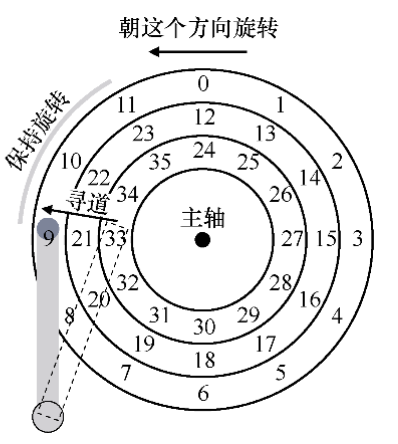

驱动器由大量扇区（512字节块）组成，每个扇区都可以读取或写入。在具有n个扇区的磁盘上，扇区从0到n−1编号。因此，我们可以将磁盘视为一组扇区，0到n−1是驱动器的地址空间（address space）.

多扇区操作是可能的。实际上，许多文件系统一次读取或写入4KB（或更多）。但是，在更新磁盘时，驱动器制造商唯一保证的是单个512字节的写入是原子的.

盘片（platter）开始，它是一个圆形坚硬的表面，通过引入磁性变化来永久存储数据。磁盘可能有一个或多个盘片。每个盘片有两面，每面都称为表面。

所有盘片都围绕主轴（spindle）连接在一起，主轴连接到一个电机，以一个恒定（固定）的速度旋转盘片（当驱动器接通电源时）。旋转速率通常以每分钟转数（Rotations Per Minute，RPM）来测量，典型的现代数值在7200～15000 RPM范围内。也就是以10000 RPM旋转的驱动器意味着一次旋转需要大约6ms。

数据在扇区的同心圆中的每个表面上被编码。我们称这样的同心圆为一个磁道（track）。

驱动器的每个表面有一个这样的磁头：感应（即读取）磁盘上的磁性图案，或者让它们发生变化（即写入）。读写过程由磁头（disk head）完成。磁头连接到单个磁盘臂（disk arm）上，磁盘臂在表面上移动，将磁头定位在期望的磁道上

要读取某个扇区的数据，首先磁头要移动到该扇区所在的磁道，这个过程叫做`寻道`，然后等待该扇区`旋转`到磁头下，最后`传输`数据。

#### 一些其它细节

许多驱动器采用某种形式的**磁道偏斜**（track skew），以确保即使在跨越磁道边界时，顺序读取也可以方便地服务

外圈磁道通常比内圈磁道具有更多扇区

驱动器会使用缓存来保存从磁盘读取或写入磁盘的数据，可以加快后续的请求。


#### I/O 时间：用数学

`T(I/O) = T(寻道) + T(旋转) + T(传输)`

> 磁盘的指标报告上一般会有平均寻道时间，旋转时间可以通过 RPM 来计算（取半圈的时间），传输时间就是传输大小除以峰值传输速率（数据量小时可以忽略不计）

`I/O 速率 = 大小(传输) / T(I/O)`


尽可能以顺序方式将数据传输到磁盘，并从磁盘传输数据。如果顺序不可行，至少应考虑以大块传输数据：越大越好。如果I/O是以小而随机方式完成的，则I/O性能将受到显著影响

#### 磁盘调度

由于I/O的高成本，操作系统在决定发送给磁盘的I/O顺序方面历来发挥作用。

SSTF：最短寻道时间优先

> 可能会导致饥饿

电梯（又称SCAN或C-SCAN）

> SCAN及其变种并不是最好的调度技术。特别是，SCAN（甚至SSTF）实际上并没有严格遵守SJF的原则。具体来说，它们忽视了旋转

SPTF：最短定位时间优先

> 根据旋转和寻道的综合时间来选择，操作系统通常不太清楚磁道边界在哪，也不知道磁头当前的位置（旋转到了哪里）。因此，SPTF通常在驱动器内部执行

在现代系统中，磁盘可以接受多个分离的请求。操作系统调度程序通常会选择它认为最好的几个请求（如16），并将它们全部发送到磁盘。磁盘然后利用其磁头位置和详细的磁道布局信息等内部知识，以最佳可能（SPTF）顺序服务于这些请求。

磁盘调度程序执行的另一个重要相关任务是I/O合并

> 在向磁盘发出I/O之前，系统应该等待多久？

### 廉价冗余阵列（RAID）

> 关键问题：如何得到大型、快速、可靠的磁盘
> 
> 我们如何构建一个大型、快速和可靠的存储系统？关键技术是什么？不同方法之间的折中是什么？

RAID 这种技术使用多个磁盘一起构建更快、更大、更可靠的磁盘系统

RAID 的优点：性能、容量、可靠性

RAID为使用它们的系统透明地（transparently）提供了这些优势，即RAID对于主机系统看起来就像一个大磁盘

在很高的层面上，RAID是一个非常专业的计算机系统：它有一个处理器，内存和磁盘。

#### RAID 0级：条带化


块的大小会影响阵列的性能。较小的块对于单文件来说并行度高，但是会增加定位时间（取最大定位时间）。较大的块则相反

这个级别的性能和容量都很好，倒是可靠性差，只要有任何一个块坏了，都会导致数据损坏

#### RAID 1级：镜像


#### RAID 4级：通过奇偶校验节省空间

基于奇偶校验的方法试图使用较少的容量，从而克服由镜像系统付出的巨大空间损失。不过，这样做的代价是——性能。


可以简单异或（XOR）函数做奇偶校验就相当不错

RAID-4容许1个磁盘故障，不容许更多。如果丢失多个磁盘，则无法重建丢失的数据。

#### RAID 5级: 旋转奇偶校验


RAID-5的工作原理与RAID-4几乎完全相同，只是它将奇偶校验块跨驱动器旋转

用于缓解每次写入都要修改存储校验值的同一磁盘的瓶颈问题

#### 比较

RAID容量、可靠性和性能: 

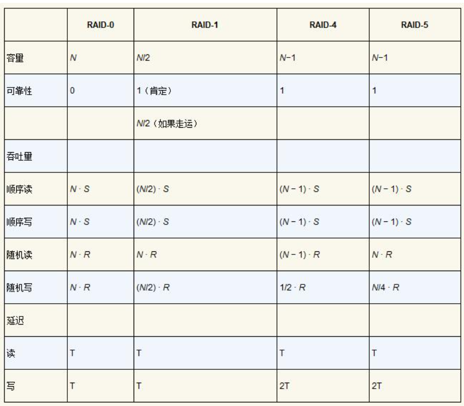

镜像RAID是简单的、可靠的，并且通常提供良好的性能，但是容量成本高。相比之下，RAID-5从容量角度来看是可靠和更好的，但在工作负载中有小写入时性能很差

### 插叙：文件和目录

到目前为止，我们看到了两项关键操作系统技术的发展：进程，它是虚拟化的CPU；地址空间，它是虚拟化的内存。

虚拟化拼图中还有关键的一块：持久存储（persistent storage）。内存在断电时，其内容会丢失，而持久存储设备会保持这些数据不变

> 关键问题：如何管理持久存储设备
> 
> 操作系统应该如何管理持久存储设备？都需要哪些API？实现有哪些重要方面？

#### 文件和目录

存储虚拟化形成了两个关键的抽象。

第一个是文件（file），就是一个线性字节数组。每个文件都有某种低级名称，通常称为inode号。

第二个抽象是目录，像文件一样，也有一个低级名字（即inode号），但是它的内容非常具体：它包含一个`（用户可读名字，低级名字）`对的列表。目录中的每个条目都指向文件或其他目录,通过将目录放入其他目录中，用户可以构建任意的目录树.

在UNIX系统中，你几乎可以想到的所有内容都是通过文件系统命名的。除了文件、设备、管道，甚至进程都可以在一个看似普通的旧文件系统中看到

#### 创建文件

```c
int fd = open("foo", O_CREAT | O_WRONLY | O_TRUNC);
```

`open()` 的一个重要方面是它的返回值：文件描述符（file descriptor）。文件描述符只是一个整数，是每个进程私有的，在UNIX系统中用于访问文件。

> 文件描述符是一个间接层，通过文件描述符，可以得到具体的 inode 及当前的偏移量

#### 读写文件

```bash
prompt> echo hello > foo 
prompt> cat foo
hello 
prompt>
```

可以通过 Linux 的 strace 工具跟踪程序在运行时所做的每个系统调用，然后将跟踪结果显示在屏幕上供你查看。

```bash
prompt> strace cat foo
...
open("foo", O_RDONLY|O_LARGEFILE)          = 3
read(3, "hello\n", 4096)                   = 6
write(1, "hello\n", 6)                     = 6 
hello
read(3, "", 4096)                          = 0
close(3)                                   = 0
...
prompt>
```

为什么第一次调用open()会返回3，而不是0或1？

每个正在运行的进程已经打开了3个文件：标准输入，标准输出），以及标准错误）。这些分别由文件描述符0、1和2表示。

#### 读取和写入，但不按顺序

使用 `lseek()` 系统调用可以调整偏移量

> lseek()调用只是在OS内存中更改一个变量，并不会触发 IO

#### 用 fsync 立即写入

调用 `write()`，只是告诉文件系统：请在将来的某个时刻，将此数据写入持久存储。出于性能的原因，文件系统会将这些写入在内存中缓冲（buffer）一段时间（例如5s或30s）。在稍后的时间点，写入将实际发送到存储设备。

如果需要更高的数据持久性保证，可以调用 `fsync(int fd)` 强制写入磁盘

```c
int fd = open("foo", O_CREAT | O_WRONLY | O_TRUNC); 
assert(fd > -1);
int rc = write(fd, buffer, size); 
assert(rc == size);
rc = fsync(fd); 
assert(rc == 0);
```

#### 文件重命名

```bash
prompt> mv foo bar
```

mv 的底层是调用 `rename(char * old, char * new)`

rename()调用提供了一个有趣的保证：它（通常）是一个**原子调用**，不论系统是否崩溃

对于支持某些需要对文件状态进行原子更新的应用程序，rename()非常重要。

通过 rename 实现文件的原子更新：

```c
int fd = open("foo.txt.tmp", O_WRONLY|O_CREAT|O_TRUNC); 
write(fd, buffer, size); // write out new version of file 
fsync(fd);
close(fd);
rename("foo.txt.tmp", "foo.txt");
```

#### 获取文件信息

使用 `stat()` 或 `fstat()` 系统调用获取文件元数据

```c
struct stat {
    dev_t    st_dev;        /* ID of device containing file */ 
    ino_t    st_ino;        /* inode number */
    mode_t    st_mode;      /* protection */
    nlink_t    st_nlink;    /* number of hard links */
    uid_t    st_uid;        /* user ID of owner */
    gid_t    st_gid;        /* group ID of owner */
    dev_t    st_rdev;       /* device ID (if special file) */
    off_t    st_size;       /* total size, in bytes */
    blksize_t st_blksize;   /* blocksize for filesystem I/O */
    blkcnt_t st_blocks;    /* number of blocks allocated */
    time_t    st_atime;     /* time of last access */
    time_t    st_mtime;     /* time of last modification */
    time_t    st_ctime;     /* time of last status change */
};
```

> 命令行工具 stat file

#### 删除文件

```bash
prompt> strace rm foo
...
unlink("foo")                     = 0
...
```

#### 创建目录

```bash
prompt> strace mkdir foo
...
mkdir("foo", 0777)                 = 0
...
prompt>
```

#### 读取目录

使用了opendir()、readdir()和closedir()这3个调用

```c
int main(int argc, char *argv[]) { 
    DIR *dp = opendir("."); 
    assert(dp != NULL);
    struct dirent *d;
    while ((d = readdir(dp)) != NULL) {
        printf("%d %s\n", (int) d->d_ino, d->d_name);
    }
    closedir(dp); 
    return 0;
}
```

```c
struct dirent {
    char         d_name[256];        /* filename */
    ino_t        d_ino;              /* inode number */
    off_t          d_off;     /* offset to the next dirent */
    unsigned short d_reclen;  /* length of this record */
    unsigned char  d_type;    /* type of file */
};
```

#### 删除目录

通过调用`rmdir()`来删除目录，要求该目录在被删除之前是空的（只有“.”和“..”条目）

#### 硬链接

在文件系统树中创建条目的新方法：`link()` 系统调用，有两个参数：一个旧路径名和一个新路径名

> 这也是 unlink() 名称的由来

```bash
prompt> echo hello > file 
prompt> cat file
hello
prompt> ln file file2 
prompt> cat file2 
hello
prompt> ls -i file file2 
67158084 file
67158084 file2 
prompt>
```

可以使用stat()来查看文件的引用计数

```bash
prompt> echo hello > file
prompt> stat file
... Inode: 67158084   Links: 1 ...
prompt> ln file file2
prompt> stat file
... Inode: 67158084   Links: 2 ...
prompt> stat file2
... Inode: 67158084   Links: 2 ...
prompt> ln file2 file3
prompt> stat file
... Inode: 67158084   Links: 3 ...
prompt> rm file
prompt> stat file2
... Inode: 67158084   Links: 2 ...
prompt> rm file2
prompt> stat file3
... Inode: 67158084   Links: 1 ...
prompt> rm file3
```

#### 符号链接

还有一种非常有用的链接类型，称为`符号链接`（symbolic link），有时称为`软链接`（soft link）。

硬链接有点局限：你不能创建目录的硬链接（因为担心会在目录树中创建一个环）。你不能硬链接到其他磁盘分区中的文件（因为inode号在特定文件系统中是唯一的，而不是跨文件系统），等等。因此，人们创建了一种称为符号链接的新型链接。

```bash
prompt> echo hello > file 
prompt> ln -s file file2 
prompt> cat file2
hello
prompt> stat file
 ... regular file ... 
prompt> stat file2
 ... symbolic link ...
prompt> rm file 
prompt> cat file2
cat: file2: No such file or directory
```

形成符号链接的方式，即将链接指向文件的路径名作为链接文件的数据。由于创建符号链接的方式，有可能造成所谓的悬空引用（dangling reference）。

#### 创建并挂载文件系统

使用 `mkfs` 工具：作为输入，为该工具提供一个设备（例如磁盘分区，例如/dev/sda1），一种文件系统类型（例如ext3），它就在该磁盘分区上写入一个空文件系统，从根目录开始。

创建的文件系统需要挂载到统一的文件系统树中进行访问。这个任务是通过 mount 程序实现的。

mount的作用很简单：以现有目录作为目标挂载点（mount point），本质上是将新的文件系统粘贴到目录树的这个点上。

```bash
prompt> mount -t ext3 /dev/sda1 /home/users
```

如你所见，路径名/home/users/现在指的是新挂载目录的根。因此mount的美妙之处在于：它将所有文件系统统一到一棵树中，而不是拥有多个独立的文件系统，这让命名统一而且方便。

运行 mount 程序可以查看系统上挂载的内容

```bash
prompt> mount
/dev/sda1 on / type ext3 (rw) 
proc on /proc type proc (rw) 
sysfs on /sys type sysfs (rw)
/dev/sda5 on /tmp type ext3 (rw)
/dev/sda7 on /var/vice/cache type ext3 (rw) 
tmpfs on /dev/shm type tmpfs (rw)
AFS on /afs type afs (rw)
```


### 文件系统实现

### 局部性和快速文件系统

### 崩溃一致性：FSCK和日志

### 日志结构文件系统

### 数据完整性和保护

## 分布式系统

### Sun 的网络文件系统（NFS）

### Andrew 文件系统（AFS）