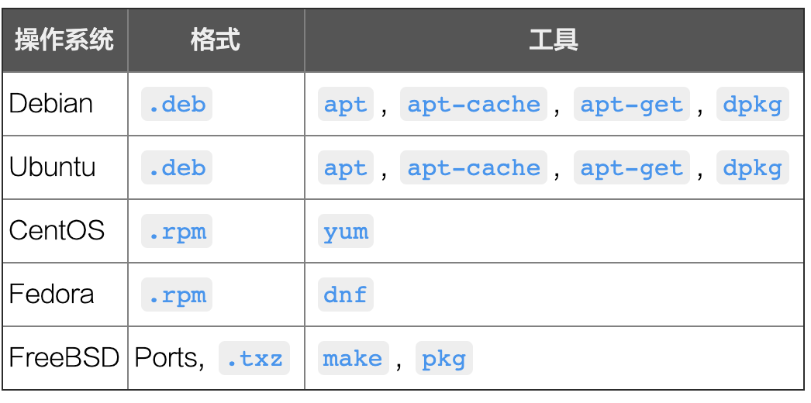

# Linux 包管理软件



## 包管理软件功能

- 指定仓库

- 更新本地仓库

    > 类似于 git 的 fetch

- 查找软件

- 安装软件（自动安装其依赖）

- 卸载软件

- 升级软件

- 查看软件列表

- 查看软件信息

## 镜像站

由于 Linux 包管理软件的官方仓库基本都在国外，国内访问需要指定镜像

- [阿里云镜像仓库](https://developer.aliyun.com/mirror/)

- [华为镜像仓库](https://mirrors.huaweicloud.com/)

- [腾讯云镜像仓库](https://mirrors.cloud.tencent.com/)

## yum

```bash
# 切换仓库后，需清理老缓存并重新生成新仓库缓存
yum cleann all
yum makecache

# 列出已有仓库
yum repolist

# 更新仓库
yum check-update

# 查找并安装软件
yum search wget
yum install -y wget

# 查找包含某个命令的软件包
yum provides *bin/nslookup

# 安装本地 rpm 包
yum install some.rpm

# 查看软件包信息
yum list wget
yum info wget

# 查看本地包信息
rpm -qa | grep <keyword>

# 升级软件包
yum update wget

# 删除软件包
yum remove wget
```

## apt-get

`apt` 是 `apt-get` 的简化命令

```bash
# 切换仓库后，更新索引
apt-get update

# 查找并安装软件
apt search wget
apt-get install -y wget

# 安装本地 deb 包
dpkg -i some.deb

# 升级软件包
apt-get upgrade wget

# 删除软件包
apt-get remove wget
```

## References

- [Linux 包管理基础: apt、yum、dnf 和 pkg](https://linux.cn/article-8782-1.html)

- [软件安装： RPM, SRPM 与 YUM 功能](http://cn.linux.vbird.org/linux_basic/0520rpm_and_srpm.php)
