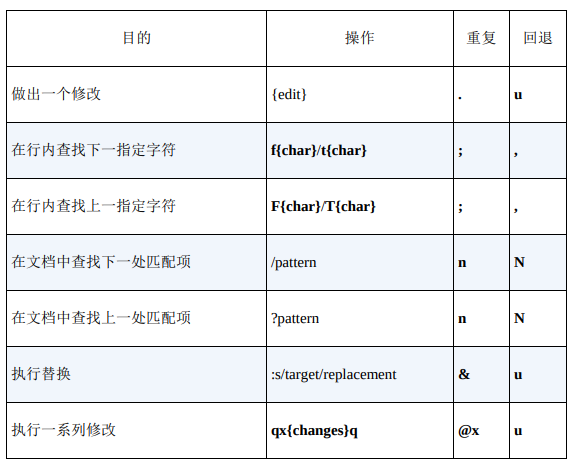

# Vim 实用技巧

## vimtutor

### 第一节

1. 移动光标：光标在屏幕文本中的移动既可以用箭头键，也可以使用 hjkl 字母键。  
 h (左移)	j (下行)       k (上行)	    l (右移)

2. Vim的进入: 欲进入 Vim 编辑器(从命令行提示符)，请输入：vim 文件名 <回车>

3. Vim的退出: 欲退出 Vim 编辑器，请输入 <ESC>   :q!   <回车> 放弃所有改动。 或者输入 <ESC>   :wq   <回车> 保存改动。

4. 文本编辑之删除：在正常模式下删除光标所在位置的字符，请按： x

5. 文本编辑之插入和添加：欲插入或添加文本，请输入：

 `i   输入欲插入文本   <ESC>`		在光标前插入文本  
 `A   输入欲添加文本   <ESC>`             在一行后添加文本  

特别提示：按下 <ESC> 键会带您回到正常模式或者撤消一个不想输入或部分完整
的命令。


### 第二节

  1. 欲从当前光标删除至下一个单词，请输入：dw
  2. 欲从当前光标删除至当前行末尾，请输入：d$
  3. 欲删除整行，请输入：dd

  4. 欲重复一个动作，请在它前面加上一个数字：2w
  5. 在正常模式下修改命令的格式是：
               operator   [number]   motion
     其中：  
       operator - 操作符，代表要做的事情，比如 d 代表删除  
       [number] - 可以附加的数字，代表动作重复的次数  
       motion   - 动作，代表在所操作的文本上的移动，例如 w 代表单词(word)， $ 代表行末等等。  

  6. 欲移动光标到行首，请按数字0键：0

  7. 欲撤消以前的操作，请输入：u (小写的u)  
     欲撤消在一行中所做的改动，请输入：U (大写的U)  
     欲撤消以前的撤消命令，恢复以前的操作结果，请输入：CTRL-R  

### 第三节

  1. 要重新置入已经删除的文本内容，请按小写字母 p 键。该操作可以将已删除的文本内容置于光标之后。如果最后一次删除的是一个整行，那么该行将置于当前光标所在行的下一行。

  2. 要替换光标所在位置的字符，请输入小写的 r 和要替换掉原位置字符的新字符即可。

  3. 更改类命令允许您改变从当前光标所在位置直到动作指示的位置中间的文本。  
     比如输入 ce 可以替换当前光标到单词的末尾的内容；输入 c$ 可以替换当
     前光标到行末的内容。

  4. 更改类命令的格式是：

	 `c   [number]   motion`

### 第四节

  1. CTRL-G 用于显示当前光标所在位置和文件状态信息。  
     G 用于将光标跳转至文件最后一行。  
     先敲入一个行号然后输入大写 G 则是将光标移动至该行号代表的行。  
     gg 用于将光标跳转至文件第一行。  

  2. 输入 / 然后紧随一个字符串是在当前所编辑的文档中正向查找该字符串。  
     输入 ? 然后紧随一个字符串则是在当前所编辑的文档中反向查找该字符串。  
     完成一次查找之后按 n 键是重复上一次的命令，可在同一方向上查  
     找下一个匹配字符串所在；或者按大写 N 向相反方向查找下一匹配字符串所在。  
     CTRL-O 带您跳转回较旧的位置，CTRL-I 则带您到较新的位置。  

  3. 如果光标当前位置是括号(、)、[、]、{、}，按 % 会将光标移动到配对的括号上。

  4. 在一行内替换头一个字符串 old 为新的字符串 new，请输入  :s/old/new  
     在一行内替换所有的字符串 old 为新的字符串 new，请输入  :s/old/new/g  
     在两行内替换所有的字符串 old 为新的字符串 new，请输入  :#,#s/old/new/g  
     在文件内替换所有的字符串 old 为新的字符串 new，请输入  :%s/old/new/g  
     进行全文替换时询问用户确认每个替换需添加 c 标志        :%s/old/new/gc  

### 第五节

  1. :!command 用于执行一个外部命令 command。

     请看一些实际例子：  
	 (MS-DOS)	  (Unix)  
	  `:!dir`		   `:!ls`		   -  用于显示当前目录的内容。  
	  `:!del FILENAME`   `:!rm FILENAME`   -  用于删除名为 FILENAME 的文件。  

  2. :w FILENAME  可将当前 VIM 中正在编辑的文件保存到名为 FILENAME 的文
     件中。

  3. v motion :w FILENAME 可将当前编辑文件中可视模式下选中的内容保存到文件
     FILENAME 中。

  4. :r FILENAME 可提取磁盘文件 FILENAME 并将其插入到当前文件的光标位置
     后面。

  5. :r !dir 可以读取 dir 命令的输出并将其放置到当前文件的光标位置后面。

### 第六节

  1. 输入小写的 o 可以在光标下方打开新的一行并进入插入模式。  
     输入大写的 O 可以在光标上方打开新的一行。  

  2. 输入小写的 a 可以在光标所在位置之后插入文本。  
     输入大写的 A 可以在光标所在行的行末之后插入文本。  

  3. e 命令可以使光标移动到单词末尾。

  4. 操作符 y 复制文本，p 粘贴先前复制的文本。

  5. 输入大写的 R 将进入替换模式，直至按 `<ESC>` 键回到正常模式。

  6. 输入 :set xxx 可以设置 xxx 选项。一些有用的选项如下：  
  	'ic' 'ignorecase'	查找时忽略字母大小写  
	'is' 'incsearch'	查找短语时显示部分匹配  
	'hls' 'hlsearch'	高亮显示所有的匹配短语  
     选项名可以用完整版本，也可以用缩略版本。

  7. 在选项前加上 no 可以关闭选项：  `:set noic`

### 第七节

  1. 输入 :help 或者按 `<F1>` 键或 `<Help>` 键可以打开帮助窗口。

  2. 输入 :help cmd 可以找到关于 cmd 命令的帮助。

  3. 输入 CTRL-W CTRL-W  可以使您在窗口之间跳转。

  4. 输入 :q 以关闭帮助窗口

  5. 您可以创建一个 vimrc 启动脚本文件用来保存您偏好的设置。

  6. 当输入 : 命令时，按 CTRL-D 可以查看可能的补全结果。按 `<TAB>` 可以使用一个补全。


## vim 出厂配置


Vim的出厂配置，指的就是激活了内置的插件功能，并且禁用了 vi 兼容模式时的配置。

```bash
# -u None: 不加载 vimrc
# -N: 使用 "nocompatible" 选项，防止进入 vi 兼容模式
vim -u None -N
```

激活vim内置插件的最小配置

```vim
# essential.vim
set nocompatible
filetype plugin on
```

```bash
vim -u code/essential.vim
```

## Vim 解决问题的方式

Vim对重复性操作进行了优化。它之所以能高效地重复，是因为它会记录我们最近的操作，让我们用一次按键就能重复上次的修改。关键在于*学会规划按键动作*

### 认识 `.` 命令

> `.` 命令可以让我们重复上次的修改，它是Vim中最为强大的多
面手。

“上次修改”可以指很多东西，一次修改的单位可以是字符、整行，甚至是整个文件。

x、dd以及 > 命令都是在普通模式中执行的命令，不过，每次进入插入模式时，也会形成一次修改。*从进入插入模式的那一刻起（例如，输入 i），直到返回普通模式时为止（输入 `<Esc>`）*，Vim会记录每一个按键操作。做出这样一个修改后再用 `.` 命令的话，它将会重新执行所有这些按键操作

### 不要自我重复

减少无关移动。

例子: 在四个行的行尾加分号：`A;<ESC>j.j.j.`

> 一键移动，另一键操作，真是太完美了！请留意这种应用模式

很多Vim的单键命令都可以被看成两个或多个其他命令的组合

| 复合命令 | 等效的长命令 |
| :--: | :--: |
| C | c$ |
| s | cl |
| S | ^C |
| I | ^i |
| A | $a |
| o | A |
| O | kA |

这些命令有个共同点：全都会从普通模式切换到插入模式。和 `.` 结合使用很高效。

### 以退为进

在一个字符前后各添加一个空格

例如在`+`符号左右增加空格: `f+s + <ESC>;.;.;.`

使移动可重复：`;` 命令会重复查找上次 `f` 命令所查找的字符

### 执行、重复、回退

在面对重复性工作时，我们需要让移动动作和修改都能够重复，这样就可以达到最佳编辑模式。

除了 `.`，`@:`可以用来重复任意Ex命令，`&` 可以重复上次的 `:substitute` 命令

移动回退：`f{char}` + `;` 移动过头，可以使用 `,` 往回移动
修改回退: `u` 可以回退上次修改，`U` 可以回退当前行所有修改, `CTRL-R` 重做修改

可重复的操作及回退:



### 查找并手动替换

查找单词有两种方式：

1. 通过 `/content` 查找
2. 移动到某个 content 下面，按 `*` 键，这会产生两个结果：一是光标跳到下一个匹配项上，二是所有出现这个词的地方都被高亮显示出来。
	> 如果没有看到高亮，可以运行下 `set hls`

例如将文本中的 content 单词替换成 copy，就可以先移动到 content 单词下，然后`*cwcopy<ESC>n.n.n.n.`

> 当然如果确认所有content都要替换，也可以直接使用 `:%s/content/copy/g` 命令

### 认识 `.` 范式

用一键移动，另一键执行

## 模式

## 普通模式

普通模式是Vim的自然放松状态，其他文本编辑器大部分时间都处于类似Vim插入模式的状态中，因此对Vim新手来说，把普通模式（normal mode）当成默认状态看起来很奇怪

许多普通模式命令可以在执行时指定执行的次数，这样它们就可以被执行多次。

普通模式命令的强大，很大程度上源于它可以把操作符与动作命令结合在一起。

### 停顿时请移开画笔

停顿时回到普通模式

### 把撤销单元切成块

可以自己控制撤销的粒度。

让每个“可撤销块”对应一次思考过程。例如经常在每句话的结尾停顿一下，想一想接下来该写什么。不管停顿的时间有多短，每次停顿都是一个自然的中断点，提示该退出插入模式了。当准备好继续写时，按 A 命令就可以回到原来的地方继续写作。

当处于插入模式时，如果光标位于行尾的话，另起一行最快的方式是按 `<CR>`。不过按 `<Esc>o`，可以控制更小的撤销粒度。

> 一般来讲，如果你停顿的时间长到足以问“我应该退出插入模式吗？”这个问题，就退出吧。

!> 在插入模式中移动光标会重置修改状态，这也会对 `.` 命令的操作产生影响。可以把这想象为先切换回普通模式，然后用 h 、j 、k 或 l 命令对光标进行了移动，唯一区别是我们并没有退出插入模式。

### 构造可重复的修改

在Vim中，要完成一件事，总是有不止一种方式。在评估哪种方式最好时，最显而易见的指标是效率，即*哪种手段需要的按键次数最少*。如果平局，就看*哪种手段更容易和 `.` 组成可重复修改*

例如在 `the end is nigh` 中，当前光标在最后的字母 h 上，可以使用以下手段删除最后的单词:

- 反向删除：`dbx`
- 正向删除：`bdw`
- 删除整个单词：`daw`

这三个方式都按键3次，其中最后一种可以和 `.` 组合成删除最后一个单词的含义，可重复，应该优先使用。

### 用次数做简单的算术运算

> 大多数普通模式命令可以在执行时指定次数，可以利用这个功能来做简单的算术运算。

`<C-a>` 和 `<C-x>` 命令分别对数字执行加和减操作。例如，如果把光标移到字符6上，执行 `10<C-a>` 就会把它变成15。

如果光标不在数字上，那么 `<C-a>` 命令将在当前行正向查找一个数字，如果找到了，它就径直跳到那里。

!> vim 默认会把 0 开头的数字当成是八进制，如果想要按十进制来加减，需要设置选项 `set nrformats=`

### 能够重复就别用次数

需要认真考虑次数与重复各自的优缺点

例如删除两个单词，可以有三种方式：`2dw`, `d2w`,`dw.`。

都是3次按键，前2个重复后都是删除两个单词，第3个重复只删除一个单词，撤销同理。

第3个的*粒度更小*，同时*不用计算次数*，执行多了就撤销即可，更加推荐。

> 记得，推荐的模式是：执行、重复、回退

只在必要的时候使用次数：删除多个单词后，重新编辑，这时后使用次数可以更加简单。

使用次数的另一个好处是：它保留了一个干净、连贯的撤销历史记录。

> 到底使用次数还是重复，取决于你怎么看保留干净撤销历史记录的价值，以及你是否觉得用次数令人生厌

### 双剑合璧，天下无敌

> Vim的强大很大程度上源自操作符与动作命令相结合

操作符 + 动作命令 = 操作

d{motion} 命令可以对一个字符（dl）、一个完整单词（daw）或一整个段落（dap）进行操作，它作用的范围由动作命令决定。c{motion}、y{motion} 以及其他一些命令也类似，它们被统称为操作符（operator）

> 通过 :h operator 查阅完整操作符

g~、gu 和 gU 命令要用两次按键来调用，我们可以把上述命令中的 g 当作一个前缀字符，用以改变其后面的按键行为。


操作符与动作命令的结合形成了一种语法。这种语法的第一条规则很简单，即一个操作由一个操作符，后面跟一个动作命令组成。学习新的动作命令及操作符，就像是在学习Vim的词汇一样。如果掌握了这一简单的语法规则，在词汇量增长时，就能表达更多的想法。

例如已知 `daw` 删除一个单词，学习了新的操作符`gU`（转大写），那么把一个单词全部字符转大写就是`gUaw`

Vim的语法只有一条额外规则，即当一个操作符命令被连续调用两次时，它会作用于当前行。`dd`代表删除当前行，`>>`缩进当前行,有个特例,`gUU`才代表当前行转大写。

常见操作符命令:


操作符和动作命令都可以进行自定义的扩展

自定义操作符，可以先阅读文档: `:h :map-operator`。可以参考 Tim Pope 的 `commentary.vim` 插件中的关于 `gc` 操作符的自定义，此操作会切换指定行的注释状态

Vim缺省的动作命令集已经相当全面了，所以一般定义新的动作命令及文本对象会常见

自定义动作命令，可以先阅读文档：`:h omap-info`。可以参考 Kanna Natsunno 的 `textobj-entire` 插件的实现，里面添加了两种新的文件对象：`ie` 和 `ae` ，作用于整个文本。

操作符待决模式：如果把Vim想象成有限状态机, 这就是一个只接受动作命令的状态。这个状态在调用操作符时被激活。可以按 `<ESC>` 退回普通模式。

由多个按键组成的操作符，输入完整后才会进入操作符待决模式，没输入完整前都只是在输入前缀，这些前缀也可以理解为命名空间，常见的命名空间：`:h g` `:h z` `:h ctrl-w` `:h [`

## 插入模式

大部分的Vim命令都在非插入模式中执行，不过有些功能在插入模式中会更好实现些

替换模式是插入模式的一种特例，它会替换文档中已有的字符

插入-普通模式，它是一个子模式，可以让我们执行一个普通模式 命令，之后马上又回到插入模式。

自动补全是插入模式中才能使用的高级功能

### 在插入模式中可即时更正错误

在输入错误时，可以用退格键删除错误的文本，然后再输入正确的内容。如果出错的地方靠近单词结尾，这或许是最快的修正方式。但是，如果出错的位置在单词开头呢？

专业打字员会建议先*删除整个单词*，然后再重新输入一遍。如果你能以每分钟超过60个单词的速度输入，那么重新输入一个词只需要1秒钟的时间。

> 退回普通模式操作会超过1秒，不建议

删除整个单词可以使用组合键，插入模式常用组合键:

| 按键操作 | 用途 |
| :--: | :--: |
| `<C-h>` | 删除前一个字符（同退格键） | 
| `<C-w>` | 删除前一个单词 |
| `<C-u>` | 删至行首 |

这些命令不是插入模式独有的，甚至也不是Vim独有的，在Vim的命令行模式中，以及在 bash shell中，也可以使用它们。

### 返回普通模式

| 按键操作 | 用途 |
| :--: | :--: |
| `<ESC>` | 切换到普通模式,经典模式 |
| `<C-[>` | 切换到普通模式（同ESC,作为一个替代） |
| `<C-o>` | 切换到插入-普通模式 | 

插入-普通模式是普通模式的一个特例，它能让我们执行一次普通模式命令。

例如，用 `zz` 命令可以重绘屏幕，并把当前行显示在窗口正中，这样就能够阅读当前行之上及之下的半屏内容。所以键入 `<C-o>zz` 很常用。

> 常用重绘屏幕命令: `zt` (重绘到顶部）`zz`（重绘到中间）`zb`（重绘到底部）

### 不离开插入模式，粘贴寄存器中的文本

!> 对Vim用户而言，大小写转换键是一个威胁。如果大小写转换键处于大写模式，而你尝试用k或j去移动光标，那么你触发的将会是K和J命令。   
简单地讲，K命令用于查看处于光标之下的那个单词的手册页（参见 `:h K` ），J命令则用来把当前行和下一行连接在一起（参见 `:h J` ）  
很多Vim用户都会重新映射大小写转换键，把它当成另外一个键用，如 `<Esc>` 或 `<Ctrl>`。`<Esc>`可以用`<C-[>`替代，所以改成 `<Ctrl>` 更好。     
要重新映射大小写转换键，最简单的方法是在操作系统级别进行映射。  
如果你照我的建议做，你将会永远忘掉大小写转换键，我保证你不会怀念它。

> `J` 命令可以用来替代 `dd` 删除空行，这样不会污染寄存器

在普通模式中通过 y 命令复制的内容会存储在复制专用寄存器中（编号`0`），然后在插入模式中，按 `<C-r>0` 可以把复制专用寄存器中的内容粘贴到光标所在位置。

这个命令的一般格式是 `<C-r>{register}`，其中 `{register}` 是想要插入的寄存器的名字（参见 `:h i_CTRL-R` ）。

如果寄存器中包含了大量的文本，你也许会发现屏幕的更新有些轻微的延时。这是因为Vim在插入寄存器内的文本时，其插入方式就如同这些文本是由键盘上一个个输进来的。

如果‘textwidth’ 或者 ‘autoindent’ 选项被激活了的话，最终就可能会出现不必要的换行或额外的缩进。

`<C-r><C-p>{register}` 命令则会更智能一些，它会按原义插入寄存器内的文本，并修正任何不必要的缩进（参见 `:h i_CTRL-R_CTRL-P` ），不过这个命令有点不太好输入！因此，如果想从一个寄存器里粘贴很多行文本的话，推荐切换到普通模式，然后使用某个粘贴命令

### 随时随地做运算

表达式寄存器（编号`=`）允许我们做一些运算，并把运算结果直接插入文档中

在插入模式中，输入 `<C-r>=` 就可以访问这一寄存器。这条命令会在屏幕的下方显示一个提示符，可以在其后输入要执行的表达式。输入表达式后敲一下 `<CR>`，Vim就会把执行的结果插入文档的当前位置了。

例如：在插入模式中，输入 `<C-r>=6+5<CR>` 就会插入`11`。

### 用字符编码插入非常用字符

只要知道某个字符的编码，就可以让Vim插入该字符。只需在插入模式中输入 `<C-v>{code}` 即可，其中 `{code}`是要插入字符的编码


想知道文档中任意字符的编码，只需把光标移到它上面并按 `ga` 命令，然后屏幕下方会显示出一条消息，分别以十进制和十六进制的形式显示出其字符编码


二合字母：左右书名号《和》 分别以二合字母<<及>>表示，普通分数（或常用分数）½、¼和¾则分别以二合字母12、14和34来表示。Vim的缺省二合字母集依从一定的惯例， `:h digraphs-default` 文档对此进行了总结。用命令 `:digraphs` 可以查看可用的二合字母列表，不过该命令的输出不太好阅读。也可以用 `:h digraph-table` 查看另一个更为有用的列表。


### 用替换模式替换已有文本

在替换模式中输入会替换文档中的已有文本，除此之外，该模式与插入模式完全相同。

用 `R` 命令可以由普通模式进入替换模式

替换模式在遇到`<Tab>`时，会当`<Tab>` 是一个字符进行替换。如果想要按屏幕宽度进行替换，可以使用虚拟替换模式，用`gR`触发

Vim也提供了单次版本的替换模式及虚拟替换模式。`r{char}` 和 `gr{char}` 命令允许覆盖一个字符，之后马上又回到普通模式

## 可视模式

Vim的可视模式允许选中一块文本区域并在其上进行操作

Vim具有3种不同的可视模式，分别用于操作字符文本、行文本和块文本。

也可以利用 `.` 命令来重复执行可视模式中的命令，然而只有在操作面向行的选区时，它才特别有用；而在操作面向字符的选区时，有时它无法达到我们的预期。

### 深入理解可视模式

很多普通模式中的光标移动命令，也能用在可视模式中。每次在可视模式中移动光标，都会改变高亮选区的边界

某些可视模式命令执行的基本功能与普通模式相同，但操作上有些细微的变化。

在普通模式中，先触发修改命令，然后使用动作命令指定其作用范围。然而，在可视模式中，要先选中选区，然后再触发修改命令

### 选择高亮选区

激活可视模式


可以在不同风格的可视模式间切换:


> 高亮选区的范围由其两个端点界定。其中一端固定，另一端可以随光标自由移动，可以用 `o` 键来切换其活动的端点。

> 在 windows 中 `<C-v>` 快捷键一般会被占用，可以改用 `<C-q>` 

### 重复执行面向行的可视命令

当使用 `.` 命令重复对高亮选区所做的修改时，此修改会重复作用于相同范围的文本。

例如，通过面向行的可视模式选中多行进行缩进 `<`，一次缩进后会退回到普通模式，如果要继续缩进，可以`gv`重选选区，再执行`<`命令，但更方便的方法是直接执行 `.` 命令。

> 要想让 < 和 > 命令正常工作，需要把 ‘shiftwidth’ 及 ‘softtabstop’ 的值设为4，并启用 ‘expandtab’ 选项。即`:set shiftwidth=4 softtabstop=4 expandtab`。具体查阅Vimcasts.org [1]上的“Tabs and Spaces”主题

### 只要可能，最好用操作符命令，而不是可视命令

可视模式可能比Vim的普通模式操作起来更自然一些，但是它有一个缺点：在这个模式下，`.` 命令有时会有一些异常的表现。

例如：`vitUj.j.` 会将三行 tag 内的文本转成大写，但是如果tag内的文本长度不一定，后两行多出的部分不会转大写，这是因为当一条可视模式命令重复执行时，它会影响相同数量的文本（参见 `:h visual-repeat` ）

如果想使点命令能够重复某些有用的工作，那么最好要远离可视模式。作为一般的原则，在做一系列可重复的修改时，最好首选操作符命令，而不是其对应的可视模式命令。

并非每个编辑任务都需要重复执行，对一次性的修改任务来说，可视模式完全够用，并且尽管Vim的动作命令允许进行精确的移动，但有时要修改的文本范围的结构很难用动作命令表达出来，而处理这种情形恰恰是可视模式擅长的。

### 用面向列块的可视模式编辑表格数据

例如在列间增加分割竖线：

```
Chapter             Page
Normal mode         15
Insert mode         31
Visual mode         44
```

- 移动到第一行空白处
- 删除多余的空白: `<C-v>3jx...`
- 增加竖线：`gvr|`
- 增加分割线：`yypVr-`

效果：

```
Chapter       |  Page
---------------------
Normal mode   |  15
Insert mode   |  31
Visual mode   |  44
```

### 修改列文本

用列块可视模式可以同时往若干行中插入文本。在编程时我们也时常受惠于此功能。

```
li.one   a{ background-image: url('/images/sprite.png'); }
li.two   a{ background-image: url('/images/sprite.png'); }
li.three a{ background-image: url('/images/sprite.png'); }
```

把文件 sprite.png从 images/ 目录移到了 components/ 目录

步骤：

- 移动到 images 的 i 上
- `<C-v>jjeccomponents<ESC>`

效果：

```
li.one   a{ background-image: url('/components/sprite.png'); }
li.two   a{ background-image: url('/components/sprite.png'); }
li.three a{ background-image: url('/components/sprite.png'); }
```

### 在长短不一的高亮块后添加文本

> 列块可视模式在操作由行列组成的方形代码块时表现得很好，然而，它并不仅限于操作方形的文本区域。

```js
var foo = 1
var bar = 'a'
var foobar = foo + bar
```

使用可视模式为上面的js代码每行最后增加分号，操作序列：`<C-v>jj$A;<ESC>`

> 在可视模式中，`I` 命令和 `A` 命令分别把光标置于选区的开头和结尾。在可视模式及操作符待决模式中，i 和 a 键沿用一个不同的约定。它们会被当作一个文本对象的组成部分

## 命令行模式

> 初时，先有 ed，ed 为 ex
之父，ex 为 vi 之父，而
vi为 Vim 之父。

> vi开创了区分模式编辑的范例。相应的，vi奉一个名为ex的行编辑器为先祖，这就是为什么会有 Ex 命令

### 认识 Vim 的命令行模式

在按下 `:` 键时，Vim会切换到命令行模式。可以输入一条命令，然后按 `<CR>` 执行它。在任意时刻，都可以按 `<Esc>` 键从命令行模式切换回普通模式。

在按 `/` 调出查找提示符或用 `<C-r>=` 访问表达式寄存器时，命令行模式也会被激活

Vim为几乎所有功能都提供了相应的Ex命令（参见 `:h ex-cmd-index` 可获得完整列表）

操作缓冲区文本的 Ex 命令:


Ex 命令的优势：普通模式命令一般操作当前字符或当前行，而 Ex 命令却可以在任意位置执行，这意味着无需移动光标就可以使用 Ex 命令做出修改。但使 Ex 命令脱颖而出的最让人赞叹的功能，是它们拥有能够在多行上同时执行的能力。

### 在一行或多个连续行上执行命令

用行号作为地址: 如果输入一条只包含数字的Ex 命令，那么 Vim 会把这个数字解析成一个地址，并把光标移动到该数字指定的行上。例如： `:3<CR>` 就会跳动第三行 `:3p<CR>` 就会跳到第三行并打印

用地址指定一个范围: 

- 打印3到5行: `:3,5p`
- 打印当前行到末尾：`:.,$p`
	> 符号 . 代表当前行的地址
- 打印所有行: `:%p` 等效于 `:1,$p`
	> 符号 % 也有特殊含义，它代表当前文件中的所有行

使用行块可视模式选中多行后，按下 `:` 键，命令行上会预先填充一个范围 `:'<,'>`。   
> 符号 `'<` 是代表高亮选区首行的位置标记，`'>` 则代表高亮选区的最后一行。这些位置标记即使在退出可视模式后仍然存在。如果尝试在普通模式下直接运行 `:'<,'>p`，它会始终回显上一次高亮选区选中的内容。

用模式指定范围: 例如打印html所有内容 `/<html>/,/<\/html>/p`

用偏移对地址进行修正: 例如打印html标记内所有内容 `/<html>/+1,/\/html>/-1p`

ex 命令的 range 符号：


第0行在文件中并不真实存在，但它作为一个地址，在某些特定场景下会很有用处。特别是在把指定范围内的行复制或移动到文件开头

### 使用‘:t’和‘:m’命令复制和移动行

:copy 命令（及其简写形式 :t）让我们可以把一行或多行从文档的一部分复制到另一部分，:move 命令则可以让我们把一行或多行移到文档的其他地方。

> :t 可以理解为 "Copy To"

:copy 命令格式： `:[range]copy {address}`


!> `:t.` 和 `yyp` 有个差别: yyp 会使用寄存器，:t. 则不会。因此，当不想覆盖默认寄存器中的当前内容时，有时会使用 :t. 来复制行。

!> 重复上次的 Ex 命令非常简单，只需按 `@:` 即可；`:<C-f>`命令行窗口选择之前的命令

移动选中文本行到文件最后面: `Vjj:m$<CR>`

### 在指定范围上执行普通模式命令

如果想在一系列连续行上执行一条普通模式命令，可以用 `:normal` 命令。

例如要给50行代码的最后增加分号，使用 `A;<ESC>j.j.j.` 序列会很烦；推荐使用 `A;<ESC>VG:normal .<CR>`  或者 `:.,$normal A;<CR>`

在执行指定的普通模式命令之前，Vim会先把光标移到该行的起始处，所以添加注释可以这样做：`:normal i//<CR>`.

> Ex 命令可以一次修改若干行。 :normal 命令则让我们可以把具有强大表现力的 Vim 普通模式命令与具有大范围影响力的 Ex 命令结合在一起，

### 重复上次的 Ex 命令

. 命令可以重复上次的普通模式命令。然而，如果想重复上次的 Ex 命令，得使用 @: 才行。知道如何回退上次的命令永远是有价值的，

类似于 `:bnext` 这类的跳转型 Ex 命令，可以通过 `<C-o>` 进行回退；对于修改型的 Ex 命令，可以用 `u` 进行回退

### 自动补全 Ex 命令

如同在shell中一样，在命令行上也可以用 `<Tab>` 键自动补全命令

`<C-d>` 命令会让Vim 显示可用的补全列表

当 Vim 只找到一个Tab 补全项时，它会直接使用整个补全项。但是如果 Vim 找到了多个补全项，那么会有几种做法。缺省情况下，首次按下 Tab 键时，Vim 会用第一个补全项补全，以后每按一下 Tab 键，就会依次遍历剩余的补全项。

可以通过 wildmode 选项来配置多个补全项的选择方式

如果习惯于 zsh 提供的自动补全菜单，可以试下下面的配置

```vim
set wildmenu
set wildmode=full
```

当 ‘wildmenu’ 选项被启用时，Vim 会提供一个补全导航列表。可以按 `<Tab>` 、`<C-n>` 或 `<Right>` 正向遍历其列表项，也可以用 `<S-Tab>`、`<C-p>` 或 `<Left>` 对其进行反向遍历

### 把当前单词插入命令行

在 Vim 的命令行下， `<C-r><C-w>` 映射项会复制光标下的单词并把它插入命令行中

> `*` 命令等效于输入 `/\<<C-r><C-w>\><CR>` 序列

例如：把文件中所有的 tally 改成 counter, 操作队列：先移动到一个 tally 下方，然后执行 `*cwcounter<ESC>:s//<C-r><C-w>/g`

### 回溯历史命令

Vim 缺省会记录最后20条命令，可以通过 `set history=200` 设置记录更多的历史命令

Vim 不仅会记录 Ex 命令的历史，还会为查找命令单独保存一份历史记录。在按 / 调出查找提示符后，用 `<Up>` 和 `<Down>` 键可以正向或反向遍历之前的查找记录。从本质上讲，查找提示符只是命令行模式的另一种形式。

命令行窗口就像是一个常规的 Vim 缓冲区，只不过它的每行内容都对应着命令历史中的一个条目。可以用 k 及 j 键在历史中向前或向后移动，也可以用 Vim 的查找功能查找某一行。在按下 `<CR>` 键时，会把当前行的内容当成Ex命令加以执行。

打开命令行窗口的方式：

| 命令 | 动作 |
| :--: | :--: |
| `q/` | 打开查找命令历史的命令行窗口 |
| `q:` | 打开 Ex 命令历史的命令行窗口 |
| `<C-f>` | 从命令行模式切换到命令行窗口 | 

!> `q:` 命令和 `:q` 命令很容易混淆

### 运行Shell命令

在 Vim 的命令行模式中，给命令加一个叹号前缀（参见 :h :!）就可以调用外部程序。

`:!{cmd}` 这种语法适用于执行一次性命令，但是如果想在 shell 中执行几条命令要怎么做？对于这种情况，可以执行 Vim 的 `:shell` 命令来启动一个交互的 shell 会话（参见 `:h :shell`）, 执行完后通过 exit 命令退出 shell 回到 vim

> 其实Ctrl-z 和 fg 命令比 Vim 提供的 :shell 和 exit 命令更加方便快捷

可以用 `:read !{cmd}` 命令，把 `{cmd}` 命令的输出读入当前缓冲区中（参见 `:h :read!`）

`:write !{cmd}` 做相反的事。它把缓冲区内容作为指定 `{cmd}` 的标准输入（参见 `:h :write_c`）

使用外部命令过滤缓冲区内容: 当给定一个范围时，`:!{cmd}` 命令就具有了不同的含义。由 `[range]` 指定的行会传给 `{cmd}` 作为标准输入，然后又会用 `{cmd}` 的输出覆盖 `[range]`内原本的内容

例如 `:2,$!sort -t',' -k2` 可以将所选范围进行排序

调用外部命令的方式:


### 批处理运行Ex命令

把Ex命令存成脚本并用 `:source` 来执行

## 文件

## 管理多个文件

### 用缓冲区列表管理打开的文件

在一次编辑会话中，可以打开多个文件。用Vim的缓冲区列表可以对这些文件进行管理。

文件与缓冲区的区别: 文件是存储在磁盘上的，而缓冲区存在于内存中。当Vim打开一个文件时，该文件的内容被读入一个具有相同名字的缓冲区。

缓冲区列表: Vim允许同时在多个缓冲区上工作


缓存区的操作:  

- `:ls` 命令会列出所有被载入内存中的缓冲区的列表
- `:bprev` 和 `:bnext` 在列表中反向或正向移动，每次移动一项；
- `:bfirst` 和 `:blast` 则分别跳到列表的开头和结尾；
- `:buffer N` 命令直接凭编号跳转到一个缓冲区,N 也可以是足以唯一标识缓存区的字符
- `:bufdo` 命令允许在 :ls列出的所有缓冲区上执行Ex 命令
- `:bdelete N1 N2 N3` 和 `:N,M bdelete` 删除缓冲区（不会删除对应的文件）

> Vim 内置的缓冲区管理功能缺乏灵活性。如果想对缓冲区进行组织，使其满足工作过程的需要，使用缓冲区列表并不是最佳选择。相反，最好是把工作区划分成多个分割窗口、标签页，或是使用参数列表。

### 用参数列表将缓冲区分组

参数列表的操作:

- `:args` 列出参数列表
- `:args {arglist}` 设置参数列表的内容。{arglist} 可以包括文件名、通配符，甚至是一条 shell 命令的输出结果
	```
	# 逐个指定文件
	:args index.html app.js
	# 用 Glob 模式指定文件
	:args **/*.js **/*.css
	# 用反引号结构指定文件, 可以用这种方式执行任意可用的shell命令
	:args `cat .chapters`
	```
-  `:next` 及 `:prev` 命令遍历参数列表中的文件
- `:argdo` 命令在列表中的每个缓冲区上执行同一条命令

### 管理隐藏缓冲区

Vim 对被修改过的缓冲区会给予特殊对待，以防未加保存就意外退出。

`:ls` 查看缓存区时，标记`a`表示是活动缓存区（active），标记`h`表示是隐藏缓存区， `%` 符号指明哪个缓冲区在当前窗口中可见， `#` 符号则代表轮换文件。按 `<C-^>` 可以在当前文件和轮换文件间快速切换

使用 `:q` 退出时，如果存在隐藏缓存区，会自动跳到该缓存区，提示存在未保存修改。如果想摒弃此修改，可以执行 `:edit!`，重新从磁盘读取此文件

在退出时，处理隐藏缓冲区的方式: 


默认情况下，Vim 不会让我们从一个改动过的缓冲区切换到其他缓冲区，除非使用带叹号的切换命令。这样会让:argdo、:bufdo 以及 :cfdo命令的执行过程变得困难, 这时可以启用 `hidden` 选项，这样就不用带叹号切换了，Vim 会在离开该缓冲区时自动将其设为隐藏。

### 将工作区切分成窗口

Vim 允许将工作区切分成若干窗口，在这些窗口里并排显示多个缓冲区。

窗口是缓冲区的显示区域（参见 :h window ）。既可以打开多个窗口，在这些窗口中显示同一个缓冲区，也可以在每个窗口里载入不同的缓冲区。

把工作区切分为窗口的几种方式：


窗口间切换的命令：


关闭窗口:


改变窗口大小及重新排列窗口: 


> 可以通过启用 `mouse` 选项使用鼠标调整窗口大小，这样更方便

> 窗口移动详见 `:h window-moving` 

### 用标签页将窗口分组

标签页是可以容纳一系列窗口的容器（参见 :h tabpage ）

用Vim的标签页可以把工作分隔到不同的工作区。Vim 中的标签页更像是 Linux 中的虚拟桌面，而不是像其他文本编辑器中的标签页

`lcd {path}` 命令让我们可以设置当前窗口的本地工作目录。如果创建了一个新标签页，并用 `:lcd` 命令切换到另一个目录，就可以把每个标签页限制在不同的工程范围内。

!> 注意：`:lcd` 只影响当前窗口，而非当前标签页。如果一个标签页包含了两个或更多的窗口，可以用 `:windo lcd {path}` 命令为所有这些窗口设置本地工作目录。

打开和关闭标签页：


在标签页中切换：


重排标签页：

用 `:tabmove [N]` 命令可以重新排列标签页。当 [N] 为0时，当前标签页会被移到开头；如果省略了 [N]，当前标签页会被移到结尾。如果终端支持鼠标，或是正在使用 GVim，那么也可以通过鼠标拖曳来进行重排操作。

## 打开及保存文件

### 用 `:edit` 命令打开文件

`:edit` 命令允许通过文件的绝对路径或相对路径来打开文件

```bash
# 查看当前目录
:pwd
# 相对于当前工作目录打开一个文件
:edit lib/xxx.js

# 相对于活动文件目录打开一个文件
# %通过Tab可展开为当前文件路径
:edit %<Tab>
# %:h 通过 Tab 可展开为当前目录路径，可通过这个方式快速基于当前文件目录选择其他文件
:edit %:h<Tab>
```

### 使用`:find`打开文件

:find 命令允许通过文件名打开一个文件，但无需输入该文件的完整路径。要想利用此功能，首先要配置 ‘path’ 选项

'path' 选项允许我们指定一些目录，当调用 :find 命令时，Vim 会在这些目录中进行查找

```vim
# 扩展 path 选项
:set path+=app/**
```

### 使用netrw 管理文件系统

netrw 插件是Vim 发行版的标配插件

用一个指向目录的路径启动Vim的话，Vim就会打开一个文件管理器窗口。

可以用 k 和 j 键上下移动光标。在按`<CR>` 键时，Vim 会打开光标下的条目。

要想返回上级目录，可以使用 `-` 键，或是把光标移到 .. 条目上再按`<CR>`

如果在调出文件管理器后，又想切换回刚才正在编辑的那个文件，可以使用`<C-^>` 命令。

常用命令：

| Ex 命令 | 缩写 | 用途 |
| :--: | :--: | :--: |
| `:edit .` | `:e.` | 打开文件管理器，并显示当前工作目录 |
| `:Explore` | `:E` | 打开文件管理器，并显示活动缓冲区所在的目录 |
| `:Sexplore` | `:Se` | 在一个水平切分窗口里打开文件管理器 |
| `:Vexplore` | `:Ve` | 在一个垂直切分窗口里打开文件管理器 |

此插件的杀手级功能，其名字正因为此功能而来，即netrw 可以通过网络读写文件

### 把文件保存到不存在的目录中

:edit {file} 命令一般用于打开一个已存在的文件，然而如果指定了一个不存在的文件路径，Vim 就会创建一个新的空白缓冲区。

当执行:write 命令时，Vim 就会尝试将此缓冲区的内容写到创建该缓冲区时指定的文件路径中。

如果目录不存在 :write 就会报错，可以通过 `:!mkdir -p %:h` 创建上层目录

### 以超级用户权限保存文件

```vim
:w !sudo tee % > /dev/null
``` 

## 更快地移动及跳转

### 用动作命令在文档中移动

## Reference

- [Vim 文档](https://vimhelp.org/)
