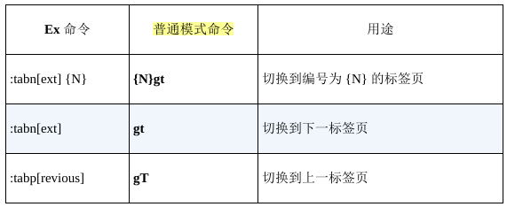

# Vim 实用技巧

## 常用命令

```bash
# 浏览当前编辑文件所在目录
:E
```

## FAQ

### 如何安装插件

1. 找一款合适的插件管理器，例如 [vim-plug](https://github.com/junegunn/vim-plug)
2. 通过插件管理器安装插件
3. 常用插件
    - [ctrlp](https://github.com/ctrlpvim/ctrlp.vim): 文件搜索

### 设置 tab 转换 空格

在 Vim 中，`sw`、`ts`、`sts`、`et` 是缩进和制表符相关的核心配置选项

- `sw`(shiftwidth): 定义每次缩进操作（如 `>>` 或 `<<`）的 空格数。
- `ts`(tabstop): 定义 Tab 字符 显示为多少个空格宽度（仅影响显示，不改变实际文件内容）。
- `sts`(softtabstop): 按下 `<Tab>` 键时插入的 空格数或 Tab 字符数（受 expandtab 影响）。
	- `:set et`：按 `<Tab>` 插入空格。
	- `:set noet`：按 `<Tab>` 插入实际 Tab 字符。
- `et`(expandtab): 是否将 Tab 转换为空格。

```vim
" 典型配置：用 4 个空格替代 Tab
set tabstop=4     " Tab 显示为 4 空格
set shiftwidth=4  " 缩进为 4 空格
set softtabstop=4 " 按 Tab 插入 4 空格
set expandtab     " 启用空格替代

" 缩写
set sw=4 ts=4 sts=4 et
```

### 文件名模糊搜索工程下的文件

1. 安装 [ctrlp.vim](https://github.com/ctrlpvim/ctrlp.vim) 插件，使用 `<C-p>` 快捷键打开文件名模糊搜索框搜索文件

2. vim 原生命令

```vim
" 添加当前目录及子目录到 path
:set path=.,**

:find 关键字<Tab>  " 按 Tab 补全文件名

:vimgrep /关键字/ **/*.*
:copen  " 打开结果列表，选择后回车跳转
```

### vim 颜色主题

[awesome-vim-colorschemes](https://github.com/rafi/awesome-vim-colorschemes?tab=readme-ov-file)

`~/.vimrc` 颜色主题配置：

```vim
" vim-plug 插件管理
call plug#begin()

" List your plugins here
Plug 'yorickpeterse/happy_hacking.vim'
Plug 'AlessandroYorba/Alduin'
Plug 'morhetz/gruvbox'
Plug 'dracula/vim'
Plug 'cocopon/iceberg.vim'
Plug 'ayu-theme/ayu-vim'
Plug 'crusoexia/vim-monokai'

call plug#end()
```

```vim
" 查看当前 colortheme
:colorscheme

" 设置当前主题
:colorscheme dracula
```

### 一个类IDE的缺省配置的 vim

推荐组合：neovim + lazyvim

1. 安装 [neovim](https://neovim.io/)
2. 安装 [lazyvim](https://lazyvim-github-io.vercel.app/zh-Hans/installation)。
    安装和启动过程中会通过 git 从 github 下载缺省的插件，需要解决科学上网的问题。比如通过 `export https_proxy=htpp://{username}:{password}@{hostname}:{port}` 配置 git http 代理。   
    > 建议在安装后运行 `:checkhealth` 检查哪些功能存在问题
3. 编程语言语法解析插件 TreeSitter 依赖于 C 编译器，可以安装: [clang](https://releases.llvm.org/download.html)，安装后将 clang 命令增加到 PATH 中
4. 文件查找依赖于 [fg](https://github.com/sharkdp/fd)

其它配置详见 [lazyvim文档](https://lazyvim-github-io.vercel.app/zh-Hans/)

[neovim + lazyvim 参考资料](https://youngxhui.top/2025/02/lazyvim/)

## vimtutor

### 第一节

1. 移动光标：光标在屏幕文本中的移动既可以用箭头键，也可以使用 hjkl 字母键。  
 h (左移)	j (下行)       k (上行)	    l (右移)

2. Vim的进入: 欲进入 Vim 编辑器(从命令行提示符)，请输入：vim 文件名 <回车>

3. Vim的退出: 欲退出 Vim 编辑器，请输入 <ESC>   :q!   <回车> 放弃所有改动。 或者输入 <ESC>   :wq   <回车> 保存改动。

4. 文本编辑之删除：在正常模式下删除光标所在位置的字符，请按： x

5. 文本编辑之插入和添加：欲插入或添加文本，请输入：

 `i   输入欲插入文本   <ESC>`		在光标前插入文本  
 `A   输入欲添加文本   <ESC>`             在一行后添加文本  

特别提示：按下 <ESC> 键会带您回到正常模式或者撤消一个不想输入或部分完整
的命令。


### 第二节

  1. 欲从当前光标删除至下一个单词，请输入：dw
  2. 欲从当前光标删除至当前行末尾，请输入：d$
  3. 欲删除整行，请输入：dd

  4. 欲重复一个动作，请在它前面加上一个数字：2w
  5. 在正常模式下修改命令的格式是：
               operator   [number]   motion
     其中：  
       operator - 操作符，代表要做的事情，比如 d 代表删除  
       [number] - 可以附加的数字，代表动作重复的次数  
       motion   - 动作，代表在所操作的文本上的移动，例如 w 代表单词(word)， $ 代表行末等等。  

  6. 欲移动光标到行首，请按数字0键：0

  7. 欲撤消以前的操作，请输入：u (小写的u)  
     欲撤消在一行中所做的改动，请输入：U (大写的U)  
     欲撤消以前的撤消命令，恢复以前的操作结果，请输入：CTRL-R  

### 第三节

  1. 要重新置入已经删除的文本内容，请按小写字母 p 键。该操作可以将已删除的文本内容置于光标之后。如果最后一次删除的是一个整行，那么该行将置于当前光标所在行的下一行。

  2. 要替换光标所在位置的字符，请输入小写的 r 和要替换掉原位置字符的新字符即可。

  3. 更改类命令允许您改变从当前光标所在位置直到动作指示的位置中间的文本。  
     比如输入 ce 可以替换当前光标到单词的末尾的内容；输入 c$ 可以替换当
     前光标到行末的内容。

  4. 更改类命令的格式是：

	 `c   [number]   motion`

### 第四节

  1. CTRL-G 用于显示当前光标所在位置和文件状态信息。  
     G 用于将光标跳转至文件最后一行。  
     先敲入一个行号然后输入大写 G 则是将光标移动至该行号代表的行。  
     gg 用于将光标跳转至文件第一行。  

  2. 输入 / 然后紧随一个字符串是在当前所编辑的文档中正向查找该字符串。  
     输入 ? 然后紧随一个字符串则是在当前所编辑的文档中反向查找该字符串。  
     完成一次查找之后按 n 键是重复上一次的命令，可在同一方向上查  
     找下一个匹配字符串所在；或者按大写 N 向相反方向查找下一匹配字符串所在。  
     CTRL-O 带您跳转回较旧的位置，CTRL-I 则带您到较新的位置。  

  3. 如果光标当前位置是括号(、)、[、]、{、}，按 % 会将光标移动到配对的括号上。

  4. 在一行内替换头一个字符串 old 为新的字符串 new，请输入  :s/old/new  
     在一行内替换所有的字符串 old 为新的字符串 new，请输入  :s/old/new/g  
     在两行内替换所有的字符串 old 为新的字符串 new，请输入  :#,#s/old/new/g  
     在文件内替换所有的字符串 old 为新的字符串 new，请输入  :%s/old/new/g  
     进行全文替换时询问用户确认每个替换需添加 c 标志        :%s/old/new/gc  

### 第五节

  1. :!command 用于执行一个外部命令 command。

     请看一些实际例子：  
	 (MS-DOS)	  (Unix)  
	  `:!dir`		   `:!ls`		   -  用于显示当前目录的内容。  
	  `:!del FILENAME`   `:!rm FILENAME`   -  用于删除名为 FILENAME 的文件。  

  2. :w FILENAME  可将当前 VIM 中正在编辑的文件保存到名为 FILENAME 的文
     件中。

  3. v motion :w FILENAME 可将当前编辑文件中可视模式下选中的内容保存到文件
     FILENAME 中。

  4. :r FILENAME 可提取磁盘文件 FILENAME 并将其插入到当前文件的光标位置
     后面。

  5. :r !dir 可以读取 dir 命令的输出并将其放置到当前文件的光标位置后面。

### 第六节

  1. 输入小写的 o 可以在光标下方打开新的一行并进入插入模式。  
     输入大写的 O 可以在光标上方打开新的一行。  

  2. 输入小写的 a 可以在光标所在位置之后插入文本。  
     输入大写的 A 可以在光标所在行的行末之后插入文本。  

  3. e 命令可以使光标移动到单词末尾。

  4. 操作符 y 复制文本，p 粘贴先前复制的文本。

  5. 输入大写的 R 将进入替换模式，直至按 `<ESC>` 键回到正常模式。

  6. 输入 :set xxx 可以设置 xxx 选项。一些有用的选项如下：  
  	'ic' 'ignorecase'	查找时忽略字母大小写  
	'is' 'incsearch'	查找短语时显示部分匹配  
	'hls' 'hlsearch'	高亮显示所有的匹配短语  
     选项名可以用完整版本，也可以用缩略版本。

  7. 在选项前加上 no 可以关闭选项：  `:set noic`

### 第七节

  1. 输入 :help 或者按 `<F1>` 键或 `<Help>` 键可以打开帮助窗口。

  2. 输入 :help cmd 可以找到关于 cmd 命令的帮助。

  3. 输入 CTRL-W CTRL-W  可以使您在窗口之间跳转。

  4. 输入 :q 以关闭帮助窗口

  5. 您可以创建一个 vimrc 启动脚本文件用来保存您偏好的设置。

  6. 当输入 : 命令时，按 CTRL-D 可以查看可能的补全结果。按 `<TAB>` 可以使用一个补全。


## vim 出厂配置


Vim的出厂配置，指的就是激活了内置的插件功能，并且禁用了 vi 兼容模式时的配置。

```bash
# -u None: 不加载 vimrc
# -N: 使用 "nocompatible" 选项，防止进入 vi 兼容模式
vim -u None -N
```

激活vim内置插件的最小配置

```vim
# essential.vim
set nocompatible
filetype plugin on
```

```bash
vim -u code/essential.vim
```

## Vim 解决问题的方式

Vim对重复性操作进行了优化。它之所以能高效地重复，是因为它会记录我们最近的操作，让我们用一次按键就能重复上次的修改。关键在于*学会规划按键动作*

### 认识 `.` 命令

> `.` 命令可以让我们重复上次的修改，它是Vim中最为强大的多
面手。

“上次修改”可以指很多东西，一次修改的单位可以是字符、整行，甚至是整个文件。

x、dd以及 > 命令都是在普通模式中执行的命令，不过，每次进入插入模式时，也会形成一次修改。*从进入插入模式的那一刻起（例如，输入 i），直到返回普通模式时为止（输入 `<Esc>`）*，Vim会记录每一个按键操作。做出这样一个修改后再用 `.` 命令的话，它将会重新执行所有这些按键操作

### 不要自我重复

减少无关移动。

例子: 在四个行的行尾加分号：`A;<ESC>j.j.j.`

> 一键移动，另一键操作，真是太完美了！请留意这种应用模式

很多Vim的单键命令都可以被看成两个或多个其他命令的组合

| 复合命令 | 等效的长命令 |
| :--: | :--: |
| C | c$ |
| s | cl |
| S | ^C |
| I | ^i |
| A | $a |
| o | A |
| O | kA |

这些命令有个共同点：全都会从普通模式切换到插入模式。和 `.` 结合使用很高效。

### 以退为进

在一个字符前后各添加一个空格

例如在`+`符号左右增加空格: `f+s + <ESC>;.;.;.`

使移动可重复：`;` 命令会重复查找上次 `f` 命令所查找的字符

### 执行、重复、回退

在面对重复性工作时，我们需要让移动动作和修改都能够重复，这样就可以达到最佳编辑模式。

除了 `.`，`@:`可以用来重复任意Ex命令，`&` 可以重复上次的 `:substitute` 命令

移动回退：`f{char}` + `;` 移动过头，可以使用 `,` 往回移动
修改回退: `u` 可以回退上次修改，`U` 可以回退当前行所有修改, `CTRL-R` 重做修改

可重复的操作及回退:


### 查找并手动替换

查找单词有两种方式：

1. 通过 `/content` 查找
2. 移动到某个 content 下面，按 `*` 键，这会产生两个结果：一是光标跳到下一个匹配项上，二是所有出现这个词的地方都被高亮显示出来。
	> 如果没有看到高亮，可以运行下 `set hls`

例如将文本中的 content 单词替换成 copy，就可以先移动到 content 单词下，然后`*cwcopy<ESC>n.n.n.n.`

> 当然如果确认所有content都要替换，也可以直接使用 `:%s/content/copy/g` 命令

### 认识 `.` 范式

用一键移动，另一键执行

## 模式

## 普通模式

普通模式是Vim的自然放松状态，其他文本编辑器大部分时间都处于类似Vim插入模式的状态中，因此对Vim新手来说，把普通模式（normal mode）当成默认状态看起来很奇怪

许多普通模式命令可以在执行时指定执行的次数，这样它们就可以被执行多次。

普通模式命令的强大，很大程度上源于它可以把操作符与动作命令结合在一起。

### 停顿时请移开画笔

停顿时回到普通模式

### 把撤销单元切成块

可以自己控制撤销的粒度。

让每个“可撤销块”对应一次思考过程。例如经常在每句话的结尾停顿一下，想一想接下来该写什么。不管停顿的时间有多短，每次停顿都是一个自然的中断点，提示该退出插入模式了。当准备好继续写时，按 A 命令就可以回到原来的地方继续写作。

当处于插入模式时，如果光标位于行尾的话，另起一行最快的方式是按 `<CR>`。不过按 `<Esc>o`，可以控制更小的撤销粒度。

> 一般来讲，如果你停顿的时间长到足以问“我应该退出插入模式吗？”这个问题，就退出吧。

!> 在插入模式中移动光标会重置修改状态，这也会对 `.` 命令的操作产生影响。可以把这想象为先切换回普通模式，然后用 h 、j 、k 或 l 命令对光标进行了移动，唯一区别是我们并没有退出插入模式。

### 构造可重复的修改

在Vim中，要完成一件事，总是有不止一种方式。在评估哪种方式最好时，最显而易见的指标是效率，即*哪种手段需要的按键次数最少*。如果平局，就看*哪种手段更容易和 `.` 组成可重复修改*

例如在 `the end is nigh` 中，当前光标在最后的字母 h 上，可以使用以下手段删除最后的单词:

- 反向删除：`dbx`
- 正向删除：`bdw`
- 删除整个单词：`daw`

这三个方式都按键3次，其中最后一种可以和 `.` 组合成删除最后一个单词的含义，可重复，应该优先使用。

### 用次数做简单的算术运算

> 大多数普通模式命令可以在执行时指定次数，可以利用这个功能来做简单的算术运算。

`<C-a>` 和 `<C-x>` 命令分别对数字执行加和减操作。例如，如果把光标移到字符6上，执行 `10<C-a>` 就会把它变成15。

如果光标不在数字上，那么 `<C-a>` 命令将在当前行正向查找一个数字，如果找到了，它就径直跳到那里。

!> vim 默认会把 0 开头的数字当成是八进制，如果想要按十进制来加减，需要设置选项 `set nrformats=`

### 能够重复就别用次数

需要认真考虑次数与重复各自的优缺点

例如删除两个单词，可以有三种方式：`2dw`, `d2w`,`dw.`。

都是3次按键，前2个重复后都是删除两个单词，第3个重复只删除一个单词，撤销同理。

第3个的*粒度更小*，同时*不用计算次数*，执行多了就撤销即可，更加推荐。

> 记得，推荐的模式是：执行、重复、回退

只在必要的时候使用次数：删除多个单词后，重新编辑，这时后使用次数可以更加简单。

使用次数的另一个好处是：它保留了一个干净、连贯的撤销历史记录。

> 到底使用次数还是重复，取决于你怎么看保留干净撤销历史记录的价值，以及你是否觉得用次数令人生厌

### 双剑合璧，天下无敌

> Vim的强大很大程度上源自操作符与动作命令相结合

操作符 + 动作命令 = 操作

d{motion} 命令可以对一个字符（dl）、一个完整单词（daw）或一整个段落（dap）进行操作，它作用的范围由动作命令决定。c{motion}、y{motion} 以及其他一些命令也类似，它们被统称为操作符（operator）

> 通过 :h operator 查阅完整操作符

g~、gu 和 gU 命令要用两次按键来调用，我们可以把上述命令中的 g 当作一个前缀字符，用以改变其后面的按键行为。


操作符与动作命令的结合形成了一种语法。这种语法的第一条规则很简单，即一个操作由一个操作符，后面跟一个动作命令组成。学习新的动作命令及操作符，就像是在学习Vim的词汇一样。如果掌握了这一简单的语法规则，在词汇量增长时，就能表达更多的想法。

例如已知 `daw` 删除一个单词，学习了新的操作符`gU`（转大写），那么把一个单词全部字符转大写就是`gUaw`

Vim的语法只有一条额外规则，即当一个操作符命令被连续调用两次时，它会作用于当前行。`dd`代表删除当前行，`>>`缩进当前行,有个特例,`gUU`才代表当前行转大写。

常见操作符命令:


操作符和动作命令都可以进行自定义的扩展

自定义操作符，可以先阅读文档: `:h :map-operator`。可以参考 Tim Pope 的 `commentary.vim` 插件中的关于 `gc` 操作符的自定义，此操作会切换指定行的注释状态

Vim缺省的动作命令集已经相当全面了，所以一般定义新的动作命令及文本对象会常见

自定义动作命令，可以先阅读文档：`:h omap-info`。可以参考 Kanna Natsunno 的 `textobj-entire` 插件的实现，里面添加了两种新的文件对象：`ie` 和 `ae` ，作用于整个文本。

操作符待决模式：如果把Vim想象成有限状态机, 这就是一个只接受动作命令的状态。这个状态在调用操作符时被激活。可以按 `<ESC>` 退回普通模式。

由多个按键组成的操作符，输入完整后才会进入操作符待决模式，没输入完整前都只是在输入前缀，这些前缀也可以理解为命名空间，常见的命名空间：`:h g` `:h z` `:h ctrl-w` `:h [`

## 插入模式

大部分的Vim命令都在非插入模式中执行，不过有些功能在插入模式中会更好实现些

替换模式是插入模式的一种特例，它会替换文档中已有的字符

插入-普通模式，它是一个子模式，可以让我们执行一个普通模式 命令，之后马上又回到插入模式。

自动补全是插入模式中才能使用的高级功能

### 在插入模式中可即时更正错误

在输入错误时，可以用退格键删除错误的文本，然后再输入正确的内容。如果出错的地方靠近单词结尾，这或许是最快的修正方式。但是，如果出错的位置在单词开头呢？

专业打字员会建议先*删除整个单词*，然后再重新输入一遍。如果你能以每分钟超过60个单词的速度输入，那么重新输入一个词只需要1秒钟的时间。

> 退回普通模式操作会超过1秒，不建议

删除整个单词可以使用组合键，插入模式常用组合键:

| 按键操作 | 用途 |
| :--: | :--: |
| `<C-h>` | 删除前一个字符（同退格键） | 
| `<C-w>` | 删除前一个单词 |
| `<C-u>` | 删至行首 |

这些命令不是插入模式独有的，甚至也不是Vim独有的，在Vim的命令行模式中，以及在 bash shell中，也可以使用它们。

### 返回普通模式

| 按键操作 | 用途 |
| :--: | :--: |
| `<ESC>` | 切换到普通模式,经典模式 |
| `<C-[>` | 切换到普通模式（同ESC,作为一个替代） |
| `<C-o>` | 切换到插入-普通模式 | 

插入-普通模式是普通模式的一个特例，它能让我们执行一次普通模式命令。

例如，用 `zz` 命令可以重绘屏幕，并把当前行显示在窗口正中，这样就能够阅读当前行之上及之下的半屏内容。所以键入 `<C-o>zz` 很常用。

> 常用重绘屏幕命令: `zt` (重绘到顶部）`zz`（重绘到中间）`zb`（重绘到底部）

### 不离开插入模式，粘贴寄存器中的文本

!> 对Vim用户而言，大小写转换键是一个威胁。如果大小写转换键处于大写模式，而你尝试用k或j去移动光标，那么你触发的将会是K和J命令。   
简单地讲，K命令用于查看处于光标之下的那个单词的手册页（参见 `:h K` ），J命令则用来把当前行和下一行连接在一起（参见 `:h J` ）  
很多Vim用户都会重新映射大小写转换键，把它当成另外一个键用，如 `<Esc>` 或 `<Ctrl>`。`<Esc>`可以用`<C-[>`替代，所以改成 `<Ctrl>` 更好。     
要重新映射大小写转换键，最简单的方法是在操作系统级别进行映射。  
如果你照我的建议做，你将会永远忘掉大小写转换键，我保证你不会怀念它。

> `J` 命令可以用来替代 `dd` 删除空行，这样不会污染寄存器

在普通模式中通过 y 命令复制的内容会存储在复制专用寄存器中（编号`0`），然后在插入模式中，按 `<C-r>0` 可以把复制专用寄存器中的内容粘贴到光标所在位置。

这个命令的一般格式是 `<C-r>{register}`，其中 `{register}` 是想要插入的寄存器的名字（参见 `:h i_CTRL-R` ）。

如果寄存器中包含了大量的文本，你也许会发现屏幕的更新有些轻微的延时。这是因为Vim在插入寄存器内的文本时，其插入方式就如同这些文本是由键盘上一个个输进来的。

如果‘textwidth’ 或者 ‘autoindent’ 选项被激活了的话，最终就可能会出现不必要的换行或额外的缩进。

`<C-r><C-p>{register}` 命令则会更智能一些，它会按原义插入寄存器内的文本，并修正任何不必要的缩进（参见 `:h i_CTRL-R_CTRL-P` ），不过这个命令有点不太好输入！因此，如果想从一个寄存器里粘贴很多行文本的话，推荐切换到普通模式，然后使用某个粘贴命令

### 随时随地做运算

表达式寄存器（编号`=`）允许我们做一些运算，并把运算结果直接插入文档中

在插入模式中，输入 `<C-r>=` 就可以访问这一寄存器。这条命令会在屏幕的下方显示一个提示符，可以在其后输入要执行的表达式。输入表达式后敲一下 `<CR>`，Vim就会把执行的结果插入文档的当前位置了。

例如：在插入模式中，输入 `<C-r>=6+5<CR>` 就会插入`11`。

### 用字符编码插入非常用字符

只要知道某个字符的编码，就可以让Vim插入该字符。只需在插入模式中输入 `<C-v>{code}` 即可，其中 `{code}`是要插入字符的编码


想知道文档中任意字符的编码，只需把光标移到它上面并按 `ga` 命令，然后屏幕下方会显示出一条消息，分别以十进制和十六进制的形式显示出其字符编码


二合字母：左右书名号《和》 分别以二合字母<<及>>表示，普通分数（或常用分数）½、¼和¾则分别以二合字母12、14和34来表示。Vim的缺省二合字母集依从一定的惯例， `:h digraphs-default` 文档对此进行了总结。用命令 `:digraphs` 可以查看可用的二合字母列表，不过该命令的输出不太好阅读。也可以用 `:h digraph-table` 查看另一个更为有用的列表。


### 用替换模式替换已有文本

在替换模式中输入会替换文档中的已有文本，除此之外，该模式与插入模式完全相同。

用 `R` 命令可以由普通模式进入替换模式

替换模式在遇到`<Tab>`时，会当`<Tab>` 是一个字符进行替换。如果想要按屏幕宽度进行替换，可以使用虚拟替换模式，用`gR`触发

Vim也提供了单次版本的替换模式及虚拟替换模式。`r{char}` 和 `gr{char}` 命令允许覆盖一个字符，之后马上又回到普通模式

## 可视模式

Vim的可视模式允许选中一块文本区域并在其上进行操作

Vim具有3种不同的可视模式，分别用于操作字符文本、行文本和块文本。

也可以利用 `.` 命令来重复执行可视模式中的命令，然而只有在操作面向行的选区时，它才特别有用；而在操作面向字符的选区时，有时它无法达到我们的预期。

### 深入理解可视模式

很多普通模式中的光标移动命令，也能用在可视模式中。每次在可视模式中移动光标，都会改变高亮选区的边界

某些可视模式命令执行的基本功能与普通模式相同，但操作上有些细微的变化。

在普通模式中，先触发修改命令，然后使用动作命令指定其作用范围。然而，在可视模式中，要先选中选区，然后再触发修改命令

### 选择高亮选区

激活可视模式


可以在不同风格的可视模式间切换:


> 高亮选区的范围由其两个端点界定。其中一端固定，另一端可以随光标自由移动，可以用 `o` 键来切换其活动的端点。

> 在 windows 中 `<C-v>` 快捷键一般会被占用，可以改用 `<C-q>` 

### 重复执行面向行的可视命令

当使用 `.` 命令重复对高亮选区所做的修改时，此修改会重复作用于相同范围的文本。

例如，通过面向行的可视模式选中多行进行缩进 `<`，一次缩进后会退回到普通模式，如果要继续缩进，可以`gv`重选选区，再执行`<`命令，但更方便的方法是直接执行 `.` 命令。

> 要想让 < 和 > 命令正常工作，需要把 ‘shiftwidth’ 及 ‘softtabstop’ 的值设为4，并启用 ‘expandtab’ 选项。即`:set shiftwidth=4 softtabstop=4 expandtab`。具体查阅Vimcasts.org [1]上的“Tabs and Spaces”主题

### 只要可能，最好用操作符命令，而不是可视命令

可视模式可能比Vim的普通模式操作起来更自然一些，但是它有一个缺点：在这个模式下，`.` 命令有时会有一些异常的表现。

例如：`vitUj.j.` 会将三行 tag 内的文本转成大写，但是如果tag内的文本长度不一定，后两行多出的部分不会转大写，这是因为当一条可视模式命令重复执行时，它会影响相同数量的文本（参见 `:h visual-repeat` ）

如果想使点命令能够重复某些有用的工作，那么最好要远离可视模式。作为一般的原则，在做一系列可重复的修改时，最好首选操作符命令，而不是其对应的可视模式命令。

并非每个编辑任务都需要重复执行，对一次性的修改任务来说，可视模式完全够用，并且尽管Vim的动作命令允许进行精确的移动，但有时要修改的文本范围的结构很难用动作命令表达出来，而处理这种情形恰恰是可视模式擅长的。

### 用面向列块的可视模式编辑表格数据

例如在列间增加分割竖线：

```
Chapter             Page
Normal mode         15
Insert mode         31
Visual mode         44
```

- 移动到第一行空白处
- 删除多余的空白: `<C-v>3jx...`
- 增加竖线：`gvr|`
- 增加分割线：`yypVr-`

效果：

```
Chapter       |  Page
---------------------
Normal mode   |  15
Insert mode   |  31
Visual mode   |  44
```

### 修改列文本

用列块可视模式可以同时往若干行中插入文本。在编程时我们也时常受惠于此功能。

```
li.one   a{ background-image: url('/images/sprite.png'); }
li.two   a{ background-image: url('/images/sprite.png'); }
li.three a{ background-image: url('/images/sprite.png'); }
```

把文件 sprite.png从 images/ 目录移到了 components/ 目录

步骤：

- 移动到 images 的 i 上
- `<C-v>jjeccomponents<ESC>`

效果：

```
li.one   a{ background-image: url('/components/sprite.png'); }
li.two   a{ background-image: url('/components/sprite.png'); }
li.three a{ background-image: url('/components/sprite.png'); }
```

### 在长短不一的高亮块后添加文本

> 列块可视模式在操作由行列组成的方形代码块时表现得很好，然而，它并不仅限于操作方形的文本区域。

```js
var foo = 1
var bar = 'a'
var foobar = foo + bar
```

使用可视模式为上面的js代码每行最后增加分号，操作序列：`<C-v>jj$A;<ESC>`

> 在可视模式中，`I` 命令和 `A` 命令分别把光标置于选区的开头和结尾。在可视模式及操作符待决模式中，i 和 a 键沿用一个不同的约定。它们会被当作一个文本对象的组成部分

## 命令行模式

> 初时，先有 ed，ed 为 ex
之父，ex 为 vi 之父，而
vi为 Vim 之父。

> vi开创了区分模式编辑的范例。相应的，vi奉一个名为ex的行编辑器为先祖，这就是为什么会有 Ex 命令

### 认识 Vim 的命令行模式

在按下 `:` 键时，Vim会切换到命令行模式。可以输入一条命令，然后按 `<CR>` 执行它。在任意时刻，都可以按 `<Esc>` 键从命令行模式切换回普通模式。

在按 `/` 调出查找提示符或用 `<C-r>=` 访问表达式寄存器时，命令行模式也会被激活

Vim为几乎所有功能都提供了相应的Ex命令（参见 `:h ex-cmd-index` 可获得完整列表）

操作缓冲区文本的 Ex 命令:


Ex 命令的优势：普通模式命令一般操作当前字符或当前行，而 Ex 命令却可以在任意位置执行，这意味着无需移动光标就可以使用 Ex 命令做出修改。但使 Ex 命令脱颖而出的最让人赞叹的功能，是它们拥有能够在多行上同时执行的能力。

### 在一行或多个连续行上执行命令

用行号作为地址: 如果输入一条只包含数字的Ex 命令，那么 Vim 会把这个数字解析成一个地址，并把光标移动到该数字指定的行上。例如： `:3<CR>` 就会跳动第三行 `:3p<CR>` 就会跳到第三行并打印

用地址指定一个范围: 

- 打印3到5行: `:3,5p`
- 打印当前行到末尾：`:.,$p`
	> 符号 . 代表当前行的地址
- 打印所有行: `:%p` 等效于 `:1,$p`
	> 符号 % 也有特殊含义，它代表当前文件中的所有行

使用行块可视模式选中多行后，按下 `:` 键，命令行上会预先填充一个范围 `:'<,'>`。   
> 符号 `'<` 是代表高亮选区首行的位置标记，`'>` 则代表高亮选区的最后一行。这些位置标记即使在退出可视模式后仍然存在。如果尝试在普通模式下直接运行 `:'<,'>p`，它会始终回显上一次高亮选区选中的内容。

用模式指定范围: 例如打印html所有内容 `/<html>/,/<\/html>/p`

用偏移对地址进行修正: 例如打印html标记内所有内容 `/<html>/+1,/\/html>/-1p`

ex 命令的 range 符号：


第0行在文件中并不真实存在，但它作为一个地址，在某些特定场景下会很有用处。特别是在把指定范围内的行复制或移动到文件开头

### 使用‘:t’和‘:m’命令复制和移动行

:copy 命令（及其简写形式 :t）让我们可以把一行或多行从文档的一部分复制到另一部分，:move 命令则可以让我们把一行或多行移到文档的其他地方。

> :t 可以理解为 "Copy To"

:copy 命令格式： `:[range]copy {address}`


!> `:t.` 和 `yyp` 有个差别: yyp 会使用寄存器，:t. 则不会。因此，当不想覆盖默认寄存器中的当前内容时，有时会使用 :t. 来复制行。

!> 重复上次的 Ex 命令非常简单，只需按 `@:` 即可；`:<C-f>`命令行窗口选择之前的命令

移动选中文本行到文件最后面: `Vjj:m$<CR>`

### 在指定范围上执行普通模式命令

如果想在一系列连续行上执行一条普通模式命令，可以用 `:normal` 命令。

例如要给50行代码的最后增加分号，使用 `A;<ESC>j.j.j.` 序列会很烦；推荐使用 `A;<ESC>VG:normal .<CR>`  或者 `:.,$normal A;<CR>`

在执行指定的普通模式命令之前，Vim会先把光标移到该行的起始处，所以添加注释可以这样做：`:normal i//<CR>`.

> Ex 命令可以一次修改若干行。 :normal 命令则让我们可以把具有强大表现力的 Vim 普通模式命令与具有大范围影响力的 Ex 命令结合在一起，

### 重复上次的 Ex 命令

. 命令可以重复上次的普通模式命令。然而，如果想重复上次的 Ex 命令，得使用 @: 才行。知道如何回退上次的命令永远是有价值的，

类似于 `:bnext` 这类的跳转型 Ex 命令，可以通过 `<C-o>` 进行回退；对于修改型的 Ex 命令，可以用 `u` 进行回退

### 自动补全 Ex 命令

如同在shell中一样，在命令行上也可以用 `<Tab>` 键自动补全命令

`<C-d>` 命令会让Vim 显示可用的补全列表

当 Vim 只找到一个Tab 补全项时，它会直接使用整个补全项。但是如果 Vim 找到了多个补全项，那么会有几种做法。缺省情况下，首次按下 Tab 键时，Vim 会用第一个补全项补全，以后每按一下 Tab 键，就会依次遍历剩余的补全项。

可以通过 wildmode 选项来配置多个补全项的选择方式

如果习惯于 zsh 提供的自动补全菜单，可以试下下面的配置

```vim
set wildmenu
set wildmode=full
```

当 ‘wildmenu’ 选项被启用时，Vim 会提供一个补全导航列表。可以按 `<Tab>` 、`<C-n>` 或 `<Right>` 正向遍历其列表项，也可以用 `<S-Tab>`、`<C-p>` 或 `<Left>` 对其进行反向遍历

### 把当前单词插入命令行

在 Vim 的命令行下， `<C-r><C-w>` 映射项会复制光标下的单词并把它插入命令行中

> `*` 命令等效于输入 `/\<<C-r><C-w>\><CR>` 序列

例如：把文件中所有的 tally 改成 counter, 操作队列：先移动到一个 tally 下方，然后执行 `*cwcounter<ESC>:s//<C-r><C-w>/g`

### 回溯历史命令

Vim 缺省会记录最后20条命令，可以通过 `set history=200` 设置记录更多的历史命令

Vim 不仅会记录 Ex 命令的历史，还会为查找命令单独保存一份历史记录。在按 / 调出查找提示符后，用 `<Up>` 和 `<Down>` 键可以正向或反向遍历之前的查找记录。从本质上讲，查找提示符只是命令行模式的另一种形式。

命令行窗口就像是一个常规的 Vim 缓冲区，只不过它的每行内容都对应着命令历史中的一个条目。可以用 k 及 j 键在历史中向前或向后移动，也可以用 Vim 的查找功能查找某一行。在按下 `<CR>` 键时，会把当前行的内容当成Ex命令加以执行。

打开命令行窗口的方式：

| 命令 | 动作 |
| :--: | :--: |
| `q/` | 打开查找命令历史的命令行窗口 |
| `q:` | 打开 Ex 命令历史的命令行窗口 |
| `<C-f>` | 从命令行模式切换到命令行窗口 | 

!> `q:` 命令和 `:q` 命令很容易混淆

### 运行Shell命令

在 Vim 的命令行模式中，给命令加一个叹号前缀（参见 :h :!）就可以调用外部程序。

`:!{cmd}` 这种语法适用于执行一次性命令，但是如果想在 shell 中执行几条命令要怎么做？对于这种情况，可以执行 Vim 的 `:shell` 命令来启动一个交互的 shell 会话（参见 `:h :shell`）, 执行完后通过 exit 命令退出 shell 回到 vim

> 其实Ctrl-z 和 fg 命令比 Vim 提供的 :shell 和 exit 命令更加方便快捷

可以用 `:read !{cmd}` 命令，把 `{cmd}` 命令的输出读入当前缓冲区中（参见 `:h :read!`）

`:write !{cmd}` 做相反的事。它把缓冲区内容作为指定 `{cmd}` 的标准输入（参见 `:h :write_c`）

使用外部命令过滤缓冲区内容: 当给定一个范围时，`:!{cmd}` 命令就具有了不同的含义。由 `[range]` 指定的行会传给 `{cmd}` 作为标准输入，然后又会用 `{cmd}` 的输出覆盖 `[range]`内原本的内容

例如 `:2,$!sort -t',' -k2` 可以将所选范围进行排序

调用外部命令的方式:


### 批处理运行Ex命令

把Ex命令存成脚本并用 `:source` 来执行

## 文件

## 管理多个文件

### 用缓冲区列表管理打开的文件

在一次编辑会话中，可以打开多个文件。用Vim的缓冲区列表可以对这些文件进行管理。

文件与缓冲区的区别: 文件是存储在磁盘上的，而缓冲区存在于内存中。当Vim打开一个文件时，该文件的内容被读入一个具有相同名字的缓冲区。

缓冲区列表: Vim允许同时在多个缓冲区上工作


缓存区的操作:  

- `:ls` 命令会列出所有被载入内存中的缓冲区的列表
- `:bprev` 和 `:bnext` 在列表中反向或正向移动，每次移动一项；
- `:bfirst` 和 `:blast` 则分别跳到列表的开头和结尾；
- `:buffer N` 命令直接凭编号跳转到一个缓冲区,N 也可以是足以唯一标识缓存区的字符
- `:bufdo` 命令允许在 :ls列出的所有缓冲区上执行Ex 命令
- `:bdelete N1 N2 N3` 和 `:N,M bdelete` 删除缓冲区（不会删除对应的文件）

> Vim 内置的缓冲区管理功能缺乏灵活性。如果想对缓冲区进行组织，使其满足工作过程的需要，使用缓冲区列表并不是最佳选择。相反，最好是把工作区划分成多个分割窗口、标签页，或是使用参数列表。

### 用参数列表将缓冲区分组

参数列表的操作:

- `:args` 列出参数列表
- `:args {arglist}` 设置参数列表的内容。{arglist} 可以包括文件名、通配符，甚至是一条 shell 命令的输出结果
	```
	# 逐个指定文件
	:args index.html app.js
	# 用 Glob 模式指定文件
	:args **/*.js **/*.css
	# 用反引号结构指定文件, 可以用这种方式执行任意可用的shell命令
	:args `cat .chapters`
	```
-  `:next` 及 `:prev` 命令遍历参数列表中的文件
- `:argdo` 命令在列表中的每个缓冲区上执行同一条命令

### 管理隐藏缓冲区

Vim 对被修改过的缓冲区会给予特殊对待，以防未加保存就意外退出。

`:ls` 查看缓存区时，标记`a`表示是活动缓存区（active），标记`h`表示是隐藏缓存区， `%` 符号指明哪个缓冲区在当前窗口中可见， `#` 符号则代表轮换文件。按 `<C-^>` 可以在当前文件和轮换文件间快速切换

使用 `:q` 退出时，如果存在隐藏缓存区，会自动跳到该缓存区，提示存在未保存修改。如果想摒弃此修改，可以执行 `:edit!`，重新从磁盘读取此文件

在退出时，处理隐藏缓冲区的方式: 


默认情况下，Vim 不会让我们从一个改动过的缓冲区切换到其他缓冲区，除非使用带叹号的切换命令。这样会让:argdo、:bufdo 以及 :cfdo命令的执行过程变得困难, 这时可以启用 `hidden` 选项，这样就不用带叹号切换了，Vim 会在离开该缓冲区时自动将其设为隐藏。

### 将工作区切分成窗口

Vim 允许将工作区切分成若干窗口，在这些窗口里并排显示多个缓冲区。

窗口是缓冲区的显示区域（参见 :h window ）。既可以打开多个窗口，在这些窗口中显示同一个缓冲区，也可以在每个窗口里载入不同的缓冲区。

把工作区切分为窗口的几种方式：


窗口间切换的命令：


关闭窗口:


改变窗口大小及重新排列窗口: 


> 可以通过启用 `mouse` 选项使用鼠标调整窗口大小，这样更方便

> 窗口移动详见 `:h window-moving` 

### 用标签页将窗口分组

标签页是可以容纳一系列窗口的容器（参见 :h tabpage ）

用Vim的标签页可以把工作分隔到不同的工作区。Vim 中的标签页更像是 Linux 中的虚拟桌面，而不是像其他文本编辑器中的标签页

`lcd {path}` 命令让我们可以设置当前窗口的本地工作目录。如果创建了一个新标签页，并用 `:lcd` 命令切换到另一个目录，就可以把每个标签页限制在不同的工程范围内。

!> 注意：`:lcd` 只影响当前窗口，而非当前标签页。如果一个标签页包含了两个或更多的窗口，可以用 `:windo lcd {path}` 命令为所有这些窗口设置本地工作目录。

打开和关闭标签页：


在标签页中切换：



重排标签页：

用 `:tabmove [N]` 命令可以重新排列标签页。当 [N] 为0时，当前标签页会被移到开头；如果省略了 [N]，当前标签页会被移到结尾。如果终端支持鼠标，或是正在使用 GVim，那么也可以通过鼠标拖曳来进行重排操作。

## 打开及保存文件

### 用 `:edit` 命令打开文件

`:edit` 命令允许通过文件的绝对路径或相对路径来打开文件

```bash
# 查看当前目录
:pwd
# 相对于当前工作目录打开一个文件
:edit lib/xxx.js

# 相对于活动文件目录打开一个文件
# %通过Tab可展开为当前文件路径
:edit %<Tab>
# %:h 通过 Tab 可展开为当前目录路径，可通过这个方式快速基于当前文件目录选择其他文件
:edit %:h<Tab>
```

### 使用`:find`打开文件

:find 命令允许通过文件名打开一个文件，但无需输入该文件的完整路径。要想利用此功能，首先要配置 ‘path’ 选项

'path' 选项允许我们指定一些目录，当调用 :find 命令时，Vim 会在这些目录中进行查找

```vim
# 扩展 path 选项
:set path+=app/**
```

### 使用netrw 管理文件系统

netrw 插件是Vim 发行版的标配插件

用一个指向目录的路径启动Vim的话，Vim就会打开一个文件管理器窗口。

可以用 k 和 j 键上下移动光标。在按`<CR>` 键时，Vim 会打开光标下的条目。

要想返回上级目录，可以使用 `-` 键，或是把光标移到 .. 条目上再按`<CR>`

如果在调出文件管理器后，又想切换回刚才正在编辑的那个文件，可以使用`<C-^>` 命令。

常用命令：

| Ex 命令 | 缩写 | 用途 |
| :--: | :--: | :--: |
| `:edit .` | `:e.` | 打开文件管理器，并显示当前工作目录 |
| `:Explore` | `:E` | 打开文件管理器，并显示活动缓冲区所在的目录 |
| `:Sexplore` | `:Se` | 在一个水平切分窗口里打开文件管理器 |
| `:Vexplore` | `:Ve` | 在一个垂直切分窗口里打开文件管理器 |

此插件的杀手级功能，其名字正因为此功能而来，即netrw 可以通过网络读写文件

### 把文件保存到不存在的目录中

:edit {file} 命令一般用于打开一个已存在的文件，然而如果指定了一个不存在的文件路径，Vim 就会创建一个新的空白缓冲区。

当执行:write 命令时，Vim 就会尝试将此缓冲区的内容写到创建该缓冲区时指定的文件路径中。

如果目录不存在 :write 就会报错，可以通过 `:!mkdir -p %:h` 创建上层目录

### 以超级用户权限保存文件

```vim
:w !sudo tee % > /dev/null
``` 

## 更快地移动及跳转

## 用动作命令在文档中移动

查阅 Vim 文档中的 `:h motion.txt` ，以获得一个完整的动作命令列表

### 让手指保持在本位行上

Vim也允许使用光标键来移动光标。不过，Vim 还提供了另外一种方式，即使用 h、j、k、l 键来移动光标

通常只用 h 和 l 键来解决 “差一错误”（off-by-one errors[3]）。也就是说，只有在距目标差一两个字符时，才会用到这两个键。除此之外，我基本不碰它们。

### 区分实际行与屏幕行

启用 ‘number’ 设置。启用后，以行号开头的行对应一个实际行，它们会占据屏幕上的一行或几行

j 和 k 命令会根据实际行向下及向上移动，gj 和 gk 则按屏幕行向下及向上移动。


### 基于单词移动


把 ea 命令连在一起可被解读为“在当前单词结尾后添加”。

把 gea 命令当成“在上一单词结尾后添加”的命令

理解单词和子串：

- 一个单词由字母、数字、下画线，或其他非空白字符的序列组成，单词间以空白字符分隔（参见 :h word ）
- 字串的定义则更简单，它由非空白字符序列组成，字串间以空白字符分隔（参见 :h WORD ）。

!> 字串比单词更长

如果想更快地移动，可以用面向字串的动作命令；而如果想以更细的粒度移动，则可以用面向单词的动作命令

面向字串的命令与其对应，这当中包括 W、B、E 和 gE

### 对字符进行查找

f{char} 命令是在 Vim 中移动的最快方式之一。它会在光标位置与当前行行尾之间查找指定的字符，如果找到了，就会把光标移到此字符上；如果未找到，则保持光标不动（参见 :h f ）

用 `;` 命令就可以重复该命令了, 用 `,` 命令可以再跳回来


当想在当前行内快速移动光标时，倾向于在普通模式中使用 f{char} 和 F{char} 命令；当与 d{motion} 或 c{motion} 一起使用时，更倾向于使用 t{char} 及 T{char} 命令

如果在用 f{char} 命令时，你养成了选择非常见字母的习惯，一次抵达目标的可能性就会大幅提高。例如要删除一个单词，选择其中的非常见单词移动，然后通过`daw`删除

### 通过查找进行移动

查找命令允许用很少几个键就能快速地跳转，跳转的距离可以很近，也可以很远

可以用 n 命令重复上次的查找命令，这样就可以跳到下个正确的匹配之处了。另外，如果按n 键的次数过多了，还可以用 N 命令再跳回来。

查找命令不仅限于在普通模式下使用，也可以在可视模式及操作符待决模式中使用它，

### 用精确的文本对象选择选区

文本对象允许操作括号、被引用的文本、XML标签以及其他文本中的常见结构。

参见 `:h text-objects`

Vim 的文本对象由两个字符组成，第一个字符永远是 i 或是 a。一般以 i 开头的文本对象会选择分隔符内部的文本，而以 a 开头的文本对象会选择包括分隔符在内的整个文本。为了便于记忆，可以把 i 想成“inside”，而把 a 想成“around”或“all”


> 只有在操作符待决模式中使用文本对象，才能真正展现出它们的强大能力。

### 删除周边，修改内部

Vim 的文本对象分为两类：一类是操作分隔符的文本对象，如i)、i" 和it；另一类用于操作文本块，如单词、句子和段落。


一般来说，d{motion} 命令和 aw、as 和 ap 配合起来使用比较好，而 c{motion} 命令和 iw 及类似的文本对象一起用效果会更好

### 设置位置标记，以便快速跳回

`m{a-zA-Z}` 命令会用选定的字母标记当前光标所在位置（参见 `:h m` ）。小写位置标记只在每个缓冲区局部可见，大写位置标记则全局可见。

`'{mark}` 命令跳到位置标记所在行，并把光标置于该行第一个非空白字符上；`` `{mark}`` 命令则把光标移动到设置此位置标记时光标所在之处，也就是说，它同时恢复行、列的位置（参见 :h mark-motions ）

`mm` 和 `` `m``  命令是一对便于使用的命令，它们分别设置位置标记 m，以及跳转到该标记

Vim 会自动设置一些位置标记，这些标记用起来非常方便


`` ` ` `` 标记是对跳转列表的补充，`` `. ``标记是对改变列表的补充

### 在匹配括号间跳转

% 命令允许在一组开、闭括号间跳转（参见 :h % ），它可作用于 ()、{}以及[]，

在执行 % 命令时，Vim 会自动为发生跳转的地方设置一个位置标记，而后就可以按`` ` ` ``跳回那里

> `<C-o>` 命令也能完成`` ` ` ``动作命令所做的工作

Vim 在发布时带了一个名为 matchit的插件，它增强了 % 命令的功能。激活此插件后，% 命令就可以在配对的关键字间跳转。

在 vimrc 中添加 `runtime macros/matchit.vim` 激活插件

另一个有用的插件 `surround.vim`，用它可以很容易地给选中的文本加分隔符。

`S"` 命令是surround.vim 提供的一个命令，可以把它解读为“用一对双引号把选中的文本括起来”

可以用surround.vim修改已有的分隔符。例如，可以用 `cs}]` 命令把 { London } 改成[ London ]，可以把它解读为“把周边的花括号{}改成方括号[]”

## 在文件间跳转

动作命令允许在一个文件中移动。跳转与之相似，不过它们也能够让我们在不同的文件之间跳转。

### 遍历跳转列表

动作命令在一个文件内移动，跳转则可以在文件间移动（虽然很快就会看到，有些动作命令也被归为跳转）

```bash
# 查看跳转列表
:jumps
```

任何改变当前窗口中活动文件的命令，都可以被称为跳转命令。Vim 会把执行跳转命令之前和之后的光标位置，记录到跳转列表中。例如，如果运行 :edit命令打开了一个新文件（参见技巧42），那么可以用 `<C-o>` 和 `<C-i>` 命令在这个新文件以及原本的文件之间来回跳转。

用 [count]G 命令直接跳到指定的行号也会被当成一次跳转，但每次向上或向下移动一行则不算。面向句子的动作及面向段落的动作都算跳转，但面向字符及面向单词的动作则不算。用一句话来概括，可以说**大范围的动作命令可能会被当成跳转，但小范围的动作命令只能算移动**

常见跳转命令：


倾向于把跳转列表当成一条“面包屑小径”[2]，它记录了我们在编辑会话中访问过的文件，用它就可以很容易地沿原路返回

Vim 可以同时维护多份跳转列表。实际上，**每个单独的窗口都拥有一份自己的跳转列表**。如果正在使用分割窗口或多标签页，那么 `<C-o>` 和 `<C-i>` 命令会始终在当前活动窗口的跳转列表范围内进行跳转。

### 遍历改变列表

Vim 会在编辑会话期间维护一张表，里面记载对每个缓冲区所做的修改，此表就是所谓的改变列表（change list，参见 :h changelist ）

```bash
# 查看改变列表
:change
```

要想跳到上次文档中更改过的地方，可以按 `g;`。它会跳到上次完成编辑时光标所在的行及列上，其结果与按 `u<C-r>` 类似，只是它不会对文档造成暂态的改变。

Vim 会自动创建一些位置标记，它们是对改变列表的一个有用补充。`'.` 和 `` `. `` 标记总是指向上次修改的位置（参见 `:h '.` ）， `` `^ `` 标记则会记录上次退出插入模式时光标所在的位置（参见 ``:h ^` ``）。

按 `g;` 命令，每次它都会把我们带到改变列表中较早的一个位置，`` `. ``则总是把我们带到改变列表的最后一项。

`'^` 标记指向上次插入的位置，它比上次修改的位置更具体一点。如果先退出插入模式，接着又在文档中四处移动，然后又想快速回到退出的地方继续编辑时，用 `gi` 命令就行了（`:h gi` ）。此命令会用`` `^ ``标记恢复光标位置，并切换到插入模式，这真是省时省力的好办法！

Vim 会为编辑会话中的每个单独缓冲区维护一个改变列表，而与之不同的是，每个窗口都会创建一个单独的跳转列表。

### 跳转到光标下的文件

Vim 会把文档中的文件名当成一个超链接。正确配置后，就可以用 `gf` 命令跳转到光标下的文件了

‘suffixesadd’ 选项允许指定一个或多个文件扩展名，当 Vim 用 gf 命令搜寻文件名时，会尝试使用这些扩展名

```vim
:set suffixesadd+=.rb
```

当使用 gf 命令时，Vim 会检查 'path' 目录列表中的每个目录，

> http链接可以通过 `gx` 命令在浏览器打开链接

跳转列表和改变列表如同“面包屑小径”一样，它们允许沿原路返回。而`gf` 和 `<C-]>` 命令像是“虫洞”，它把我们从代码的一个地方传送到另一个地方

### 用全局位置标记在文件间快速跳转

全局位置标记是一种书签，让我们可以在文件间跳转。全局标记在我们分析完代码，并想快速跳回一个文件时特别有用。

`m{letter}` 命令允许在当前光标位置创建一个位置标记（参见 `:h m` ）。小写字母会创建局部于缓冲区的标记，大写字母则创建全局标记。设置好标记后，就可以用 `'{letter}` 命令使光标快速回到标记所在之处（参见 `:h '` ）。

一般来说，要养成在使用与quickfix列表有关的命令前，如 `:grep`、`:vimgrep`及 `:make`，设置全局标记的习惯。另外，在执行与缓冲区列表或参数列表有关的命令前，如 `:args {arglist}`和 `:argdo`，也要设置全局标记。

## 寄存器

Vim的寄存器是一组用于保存文本的简单容器。

它们既可像剪贴板那样，剪切、复制和粘贴文本，也可以记录一系列按键操作，把它们录制成宏。

## 复制与粘贴

Vim提供了几十组寄存器用于保存文本，而并非只用系统单一的剪贴板。

### 用无名寄存器实现删除、复制与粘贴操作

通常情况下，在讨论剪切、复制与粘贴这3组操作时，指的都是操作系统剪贴板。不过，在Vim的术语里，我们操作的是寄存器，而并非剪贴板。

无名寄存器的常见用法：

- 调换字符: `xp`，可被用于“调换光标之后的两个字符”
- 调换文本行: `ddp`，可被用于“调换当前行和它的下一行”。
- 创建文本行的副本: `yyp`

无名寄存器的缺点：很容易会覆盖想要复制的内容, 例如复制了一段内容，在想要插入的位置替换一段内容时，需要先删除已有内容，这时删除的内容会覆盖想要复制的内容

### 深入理解Vim寄存器

Vim的删除、复制与粘贴命令都会用到众多寄存器中的某一个。可以通过给命令加 `"{register}` 前缀的方式指定要用的寄存器。若不指明，Vim将缺省使用无名寄存器。

检查寄存器内容： `:reg "{register}`

在插入模式中粘贴寄存器内容：`<C-r>{register}`

常用寄存器：

- 无名寄存器（缺省或者`""`): x、s、d{motion}、c{motion} 与 y{motion} 命令（以及它们对应的大写命令）都会覆盖无名寄存器中的内容
- 复制专用寄存器（`"0`）: 只有 y{motion} 命令会覆盖该寄存器，使用 `"0p` 可以解决上面的复制内容被覆盖的问题
- 有名寄存器（`"a – "z`）: 如果碰到需要将一段或多段文本粘贴到多处的情况，有名寄存器就会大显神通。用小写字母引用有名寄存器，会覆盖该寄存器的原有内容，而换用**大写字母的话，会将新内容添加到该寄存器的原有内容之后**
- 黑洞寄存器(`"_`): 只想删除文本却不想覆盖无名寄存器中的内容时，此命令很管用
- 系统剪贴板（`"+`）: X11剪贴板，用剪切、复制与粘贴命令操作
- 选择专用寄存器（`"*`）: X11主剪贴板，用鼠标中键操作。Windows与Mac OS X操作系统并没有主剪贴板的概念，因此 `"+` 寄存器与 `"*` 寄存器可以混用，它们都代表系统剪贴板。
- 表达式寄存器（`"=`）: 当从表达式寄存器获取内容时，Vim将跳到命令行模式，并显示提示符“=”。这时，可以输入一段Vim脚本表达式并按 `<CR>` 执行，

其它寄存器：


### 用寄存器中的内容替换高亮选区的文

在可视模式下使用 p 命令时，Vim将用指定的寄存器内容来替换高亮选区中的文本。该方法可以解决复制被覆盖的问题，因为没有删除。

在Vim的可视模式下使用 p 命令时。首先，从无名寄存器里取出内容，然后，把高亮选区中的内容存入无名寄存器。

### 把寄存器的内容粘贴出来

p 命令旨在将寄存器中的文本粘贴到光标之后（参见 :h p ）。作为补充，Vim也提供了（大写的）P 命令用于将文本插入光标之前

在插入模式中使用 `<C-r>{register}` 的映射项来粘贴面向字符的文本区域。通过这种方式，寄存器的文本总会被插入光标之前，就像我们在插入模式下手动输入它们一样

当要粘贴的内容来自于面向行的寄存器时，p 和 P 命令会把它们粘贴至当前行的上一行或下一行。

Vim提供的 gp 和 gP 命令也值得关注，因为它们同样可以将文本粘贴至在当前行之前或之后。不同的是，它们会把光标的位置移到被粘贴出来的文本结尾而不是开头。当复制多行文本时，gP 命令尤为管用，

## 模式

## global 命令

### 认识 global 命令

`:global` 命令允许在某个指定模式的所有匹配行上运行Ex命令

```
:[range] global[!] /{pattern}/ [cmd]
```

> global! 表示作用于不匹配的行

### 删除所有包含模式的文本行

删除所有的匹配行

```
/\v\<\/?\w+>
:g//d
```

:vglobal或简写的 :v命令恰好与 :g命令的操作相反。也就是说，它用于在指定模式的非匹配行上执行Ex命令

```
# 只保留匹配行
:v/href/d
```

### 将TODO项收集至寄存器

通过把 `:global`和 `:yank` 这两条命令结合在一起，可以把所有匹配 `{pattern}`的文本行收集到某个寄存器中

打印所有 TODO 行

```
:g/TODO
```

> :print是 :global命令的缺省 [cmd]，

复制 TODO 行到 a 寄存器

```
# 使用录制宏清理a寄存器内容
qaq
# 复制
:g/TODO/yank A
```

还可以将 :global命令与 :bufdo或 :argdo一起搭配使用，从一组文件中收集所有的TODO项

```
# 复制TODO行到文件末尾
:g/TODO/t$
```

### 将CSS文件中所有规则的属性按照字母排序

```
:g/{/ .+1,/}/-1 sort
```

:global命令的广义形式如下。

```
:g/{start}/ .,{finish} [cmd]
```

## 工具

## 编译代码，并通过Quickfix列表浏览错误信息

Quickfix列表作为Vim的核心功能，旨在将外部工具融入我们的工作过程当中。简单地来说，Quickfix列表会维护一组由文件名、行号、列号（可选）与消息组成的注释定位信息。从传统意义上讲，这些定位信息是由某个编译器所产生的一组错误信息，但也可能是由语法检查器、静态分析器或者其他工具输出的类似的警告信息。

### 不用离开Vim也能编译代码

使用 `:make` 命令默认触发 make 命令执行 Makefile

Vim除了会显示 make命令的输出结果外，还会解析结果中的每一行内容，并把文件名、行号以及错误信息提取出来。对于每一条出错信息，Vim都会在`quickfix`列表中为其创建一项记录。

运行完:make后，Vim会跳转到quickfix列表的第一项记录。也可以通过 `:make!` 命令不自动跳转，或者通过 `<C-o>` 命令返回原来的位置

### 浏览Quickfix列表


> 可以通过附加次数来快速跳转，例如 `:5cnext`

对于每一条用于填充quickfix列表的命令，都有一条对应的命令，把结果保存到位置列表。:make、:grep以及:vimgrep会使用quickfix列表，类似地，`:lmake`、`:lgrep`以及`:lvimgrep`将使用位置列表。二者有何不同呢？区别就在于，在任一特定的时刻，只能有一个quickfix列表，而位置列表却要多少有多少。

任何与位置列表交互的命令（:lnext、:lprev等），仅操作与当前活动窗口相关联的那个位置列表

### 回溯以前的Quickfix列表

运行 `:colder` 命令, 可以回溯quickfix列表之前的某个版本（Vim会保存最近的10个列表）。为了从旧的quickfix列表回到比较新的列表，可以运行 `:cnewer`。

### 定制外部编译器

‘makeprg’选项允许指定运行 :make时调用的程序（参见 :h 'makeprg' ）。

‘errorformat’ 选项允许我们指导Vim如何解析由 :make产生的输出结果（参见 :h 'errorformat'）。

用一条命令设置‘makeprg’与‘errorformat’:  `:compiler nodelint`

:compiler命令会激活一个编译器插件

查看 vim 自带的编译器插件：`:args $VIMRUNTIME/compiler/*.vim`

## 通过grep、vimgrep以及其他工具对整个工程进行查找

### 不必离开Vim也能调用grep

`:grep`命令，它允许在不离开编辑器的情况下调用外部程序。尽管该命令会缺省调用 grep

### 定制grep程序

执行Vim的 :grep命令时，`grepprg` 选项负责指定调用的shell程序（参见 :h 'grepprg' ）。 `grepformat`选项则指示Vim如何解析来自 :grep命令的输出结果（参见 :h 'grepformat' ），缺省配置如下：

```
grepprg="grep -n $* /dev/null"
grepformat="%f:%l:%m,%f:%l%m,%f  %l%m"
```

### 使用Vim内置正则表达式引擎的 Grep

`:vimgrep`命令允许使用Vim内置的正则表达式引擎在多个文件中查找。格式：`:vim[grep][!] /{pattern}/[g][j] {file} …`

例如：`:vim  /going/g  *.txt`

除了可以使用和`*`通配符外，也可以使用`##`符号，它将被扩展成参数列表中的所有文件（:h cmdline-special ）

```
:args  *.txt
:vim  /going/g ##
```

保持模式域为空，这会让:vimgrep使用当前的查找模式, 可以用 `<C-r>/` 把当前模式的内容填充到查找域。


## 自动补全

### 认识Vim的关键字自动补全

Vim的自动补全可以在插入模式下触发。

自动补全与大小写敏感性: ‘ignorecase’ 选项被启用后，无论是大写字母还是小写字母，Vim的查找命令都对它们一视同仁（正如技巧73讨论的那样），但这样做也有副作用，即在自动补全时也会忽略大小写。


### 与自动补全的弹出式菜单进行交互


`<C-n><C-p>`是最喜欢的技巧之一。前一个命令将触发自动补全功能，调出弹出式菜单，并选中补全列表中的第一项。第二条命令则选中补全列表的前一项，即在不关闭弹出式菜单的情况下回到输入的文本中。现在，可以继续输入文本，而Vim将实时过滤补全列表

### 掌握关键字的来龙去脉

#### 缓存区列表

填充自动补全单词列表最简单的方法就是使用当前缓冲区中的单词。基于当前文件关键字的补全功能就是这样实现的，它可以通过 `<C-x><C-n>`（参见 `:h compl-current` ）进行触发

#### 包含文件

Vim本身就理解C语言包含文件的方式，但通过设置 ‘include’ 选项（参见 :h 'include' ），也可以让它了解其他语言的对应提示符。

Vim在发布时本身就支持多种编程语言，因此一般情况下不用修改该项设置

#### 标签文件

Exuberant Ctags这个外部程序，它可以对源码进行扫描，找出里面的关键字，如函数名、类名，以及对应语言的其他重要结构。

标签文件还产出了一项有用的副产品，即一份可用于自动补全的关键字列表。可以用 `<C-x><C-]>`（参见 `:h compl-tag` ）命令将其调出来。

当要补全的单词属于编程语言对象（如函数名或者类名）时，标签自动补全可以很好地过滤非语言因素。

#### 合而为一

普通关键字自动补全，会把来自于缓冲区列表、包含文件以及标签文件的单词列表组合在一起，并生成补全建议。

用 `<C-n>` 组合键就可以触发普通关键字自动补全了，而更具针对性的补全方式则需要先按 `<C-x>`，再按另一个组合键来触发

可以通过 ‘complete’ 选项来定制普通关键字补全时扫描的位置。选项如下：

```
'complete' 'cpt'	string	(default: ".,w,b,u,t,i")
			local to buffer
	This option specifies how keyword completion |ins-completion| works
	when CTRL-P or CTRL-N are used.  It is also used for whole-line
	completion |i_CTRL-X_CTRL-L|.  It indicates the type of completion
	and the places to scan.  It is a comma separated list of flags:
	.	scan the current buffer ('wrapscan' is ignored)
	w	scan buffers from other windows
	b	scan other loaded buffers that are in the buffer list
	u	scan the unloaded buffers that are in the buffer list
	U	scan the buffers that are not in the buffer list
	k	scan the files given with the 'dictionary' option
	kspell  use the currently active spell checking |spell|
	k{dict}	scan the file {dict}.  Several "k" flags can be given,
		patterns are valid too.  For example: >
			:set cpt=k/usr/dict/*,k~/spanish
<	s	scan the files given with the 'thesaurus' option
	s{tsr}	scan the file {tsr}.  Several "s" flags can be given, patterns
		are valid too.
	i	scan current and included files
	d	scan current and included files for defined name or macro
		|i_CTRL-X_CTRL-D|
	]	tag completion
	t	same as "]"

```

### 使用字典中的单词进行自动补全 

为了激活该功能，需要为Vim提供一份合适的单词列表。最简单的方法就是通过运行 `:set spell`来激活Vim的拼写检查功能

旦输入 `<C-x><C-k>` 命令，所有位于拼写字典中的单词都会变成补全建议项。

如果不想激活拼写检查功能，也可以通过‘dictionary’ 选项来指定一个或多个含有单词列表的文件（参见 :h 'dictionary' ）

### 自动补全整行文本

面向行的自动补全功能可以通过 `<C-x><C-l>`（参见 `:h compl-whole-line` ）进行触
发。

### 自动补全文件名

文件名自动补全功能可以通过 `<C-x><C-f>` 命令（参见 `:h compl-filename` ）触发。

Vim的文件名自动补全功能只相对于工作目录的路径进行扩展，而不是相对于当前编辑文件的路径，理解这一点很重要。

如果要根据其它目录来扩展，可以通过 `:cd xxx` 命令来修改工作目录，扩展后，再通过 `:cd -` 回到原工作目录

### 根据上下文自动补全

全能补全是由Vim实现的intellsense 功能。它将提供一份为光标所处的上下文量身定做的补全建议列表。

全能补全功能可通过 `<C-x><C-o>` 命令（参见 `:h compl-omni` ）进行触发。

该功能由专用的文件类型插件实现，Vim 的发行版本身就支持十几种语言，可以通过 `:h compl-omni-filetypes` 找到完整的列表

## 利用Vim的拼写检查器，查找并更正拼写错误

### 对你的工作进行拼写检查

开启拼写检查：`:set spell`

在普通模式下，操作Vim拼写检查器的基本命令:


通过在 `z=` 命令前加编号前缀的方式，可以直接跳过提示，并采纳指定编号所指的更正建议。如果我们有足够的信心确保第一项建议是正确的，就可以直接运行 `1z=`，一气呵成。

### 使用其他拼写字典

一旦启用了Vim的拼写检查器，它将以英语字典作为缺省的拼写字 典进行单词比较。通过配置 ‘spelllang’ 选项（参见 `:h 'spelllang'` ），可以更改其缺省设置。但 ‘spelllang’ 选项并不是全局性的，它永远只在本地缓冲区生效。

Vim的发行版本身就内置了支持英语的拼写文件，但也可以 到http://ftp.vim.org/vim/runtime/spell/ 下载它支持的其他几十种语言的拼写文件。

### 将单词添加到拼写文件中

可以用 `zg` 命令（参见 `:h zg` ）把光标下的单词加到拼写文件中，使 Vim 可以识别它

`zw` 命令，用于把光标所在处的单词标记为拼写错误。在实现上，该命令允许把该单词从拼写文件中删除。

`zug`，用于撤销对光标下单词所执行的 `zg` 或 `zw` 命令。

Vim会把添加到字典中的单词保存至某个拼写文件中，这样一来，就可以一直使用它们。而拼写文件的名字由所使用的语言以及文件编码 类型决定。

通过配置 ‘spellfile’ 选项，可以指定一个文件路径，用于保存由 zg 和 zw 命令添加、删除的单词（参见 h 'spellfile' ）。

对于每一个被拼写检查器误判的单词，目前都有两种处理方式，既可以通过 `2zg` 将其添加到Vim的术语列表中，也可以通过 `1zg` 将其添加到缺省的单词列表中

### 在插入模式下更正拼写错误

在插入模式下通过 `<C-x>s` 命令更正拼写错误，该命令会触发一个特殊的自动补全功能（参见 `:h complspelling` ）。还可以通过 `<C-x><C-s>` 实现同样的功能，该命令更易于输入。

## Reference

- [Vim 文档](https://vimhelp.org/)
