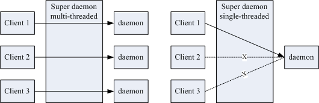

# 系统服务

Linux 系统服务本质上就是一些后台（`daemon`）进程

> 比如定时任务服务，就是 crond 进程提供的

> 这些后台进程的名称大多以 `d` 结尾

## 主要分类

- 可独立启动的 stand alone 的服务

- 透过一支 super daemon 来统一管理的服务

### stand alone 服务

优点: 持续提供服务，响应速度较快

### super daemon 管理的服务

这个 super daemon 一般是 `xinetd` 程序

> 如果没有 xinetd 程序，可以通过 `yum install -y xinetd`

这种机制比较有趣的地方在于， 当没有客户端的要求时，各项服务都是未启动的情况，等到有来自客户端的要求时， super daemon 才唤醒相对应的服务。当客户端的要求结束后，被唤醒的这个服务也会关闭并释放系统资源。



这种机制的好处是： 

- 由于 super daemon 负责唤醒各项服务，因此 super daemon 可以具有安全控管的机制，就是类似网络防火墙的功能啦！ 

- 由于服务在客户端的联机结束后就关闭，因此不会一直占用系统资源。

但是缺点是什么呢？ 

因为有客户端的联机才会唤醒该服务，而该服务加载到内存的时间需要考虑进去，因此服务的反应时间会比较慢一些啦！ 

## 服务的启动脚本和启动方式

### 启动脚本和相关目录

对于 daemon 程序，当然最简单就是直接运行可执行程序即可，但是很多情况，正确运行一个程序，除了代码，还会依赖于配置文件和运行环境。

因此通常 distribution 会给我们一个简单的 shell script 来进行启动的功能。 

该 script 可以进行环境的侦测、配置文件的分析、PID 文件的放置，以及相关重要交换文件案的锁住 (lock) 动作， 你只要运行该 script ，上述的动作就一口气连续的进行，最终就能够顺利且简单的启动这个 daemon 啰！而且一般以 shell script 的 `case....esac` 语法来提供启动、关闭、 观察此 daemon 的功能

> 自己开发的 daemon 也可以参考这里的脚本，使用 shell script 简化启动

那么这些 daemon 的启动脚本 (shell script) 放在哪里啊

- `/etc/init.d/*` ：启动脚本放置处

    > Linux 系统上几乎所有的服务启动脚本都放置在这里！事实上这是公认的目录，CentOS 实际上放置在 /etc/rc.d/init.d/ 啦！ 不过还是有配置连结档到 /etc/init.d/ 的！

- `/etc/sysconfig/*` ：各服务的初始化环境配置文件

    > 几乎所有的服务都会将初始化的一些选项配置写入到这个目录下

- `/etc/xinetd.conf, /etc/xinetd.d/*` ：super daemon 配置文件

    > super daemon 的主要配置文件为 /etc/xinetd.conf ，他所管理的其他 daemon 的配置则写在 /etc/xinetd.d/* 里头喔！

- `/etc/*` ：各服务各自的配置文件

    > 自己开发的服务，一般默认把配置放在这里

- `/var/lib/*` ：各服务产生的数据库

    > 一些会产生数据的服务都会将他的数据写入到 /var/lib/ 目录中。比如 MySQL 默认就是写入 /var/lib/mysql/ 这个目录下

- `/var/run/*` ：各服务的程序之 PID 记录处

    > 把 pid 记录到这里，方便 `/etc/init.d` 下的 shell script 对服务进行管理，比如 kill 掉进程，关闭服务

### Stand alone 的启动

上面说到几乎系统上面所有服务的启动脚本都在 `/etc/init.d/` 底下，因此可以通过执行这些启动脚本来启动 daemon

```bash
/etc/init.d/syslog start
```

为了不用每次都写 `/etc/init.d/` 这个前缀，Linux 提供了 `service` 这个程序来简化启动服务

> service 本质上是个 shell script，根据参数到 `/etc/init.d/` 去取得正确的服务来 start 或 stop

> distribution 一般默认提供 service 程序，如果没有，可以通过 `yum install initscripts -y` 安装

```bash
service syslog start
```

### Super daemon 的启动方式

Super daemon 本身是一支 stand alone 的服务

Super daemon 管理的服务必须在 /etc/xinetd.d/* 添加配置文件

比如 

```bash
[root@www ~]# vim /etc/xinetd.d/rsync
service rsync  <==服务名称为 rsync,通过该名称去 /etc/services 找端口
{
        disable = yes                     <==默认是关闭的！
        socket_type     = stream         <==使用 TCP 的联机机制之故
        wait            = no             <==可以同时进行大量联机功能
        user            = root           <==启动服务为 root 这个身份
        server          = /usr/bin/rsync <==就是这支程序启动 rsync 的服务啰
        server_args     = --daemon       <==这是必要的选项啊！
        log_on_failure  += USERID        <==登陆错误时，额外记录用户 ID
}
```

> 关于 xinetd 的配置可以参考 [鸟叔的 Linux 私房菜](http://cn.linux.vbird.org/linux_basic/0560daemons.php#etc_xinetd_conf)

> 可以通过配置实现防火墙的功能（比如限制访问的 IP）

如果想要启动该 daemon，就把 disable 改成 no

```bash
# 1. 先修改配置文件成为启动的模样：
[root@www ~]# vim /etc/xinetd.d/rsync
# 请将 disable 那一行改成如下的模样 (原本是 yes 改成 no 就对了)
service rsync
{
        disable = no
....(后面省略)....

# 2. 重新启动 xinetd 这个服务
[root@www ~]# /etc/init.d/xinetd restart
正在停止 xinetd:             [  确定  ]
正在激活 xinetd:             [  确定  ]

# 3. 观察启动的端口
[root@www ~]# grep 'rsync' /etc/services  <==先看看端口是哪一号
rsync           873/tcp               # rsync
rsync           873/udp               # rsync
[root@www ~]# netstat -tnlp | grep 873
tcp    0 0 0.0.0.0:873      0.0.0.0:*     LISTEN      4925/xinetd
# 注意看！启动的服务并非 rsync 喔！而是 xinetd ，因为他要控管 rsync 嘛！
# 若有疑问，一定要去看看图 1.1.1 才行！
```

### 系统服务的端口协定

众所周知，一些著名的系统服务有业界统一的端口约定，比如 httpd 监听 80 端口，sshd 监听 22 端口

那么这些端口约定是定义在哪里呢？那就是 `/etc/services`

```bash
[root@e302dcbc5192 /]# cat /etc/services | grep -E '^(ssh|http)\s'
ssh             22/tcp                          # The Secure Shell (SSH) Protocol
ssh             22/udp                          # The Secure Shell (SSH) Protocol
http            80/tcp          www www-http    # WorldWideWeb HTTP
http            80/udp          www www-http    # HyperText Transfer Protocol
http            80/sctp                         # HyperText Transfer Protocol
ssh             22/sctp                 # SSH
```

> 可以通过这个文件查看著名系统服务的端口

## chkconfig 设置系统服务开机自启动

```bash
# 查看服务的自启动配置
chkconfig --list [服务名称]

# 创建自己的系统服务
vim /etc/init.d/myvbird
#!/bin/bash
# chkconfig: 35 80 70
# description: 没啥！只是用来作为练习之用的一个范例
echo "Nothing"

# 添加到 chkconfig 管理
chkconfig --add myvbird; chkconfig --list myvbird
```

> 详见 [鸟叔的 Linux 私房菜--配置启动后立即启动服务的方法](http://cn.linux.vbird.org/linux_basic/0560daemons.php#starting_daemon)


## References

- [鸟叔的 Linux 私房菜--认识系统服务 (daemons)](http://cn.linux.vbird.org/linux_basic/0560daemons.php)