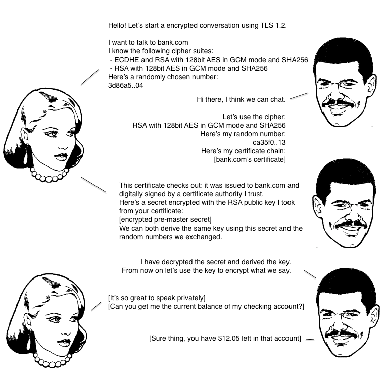

# HTTPS, SSL, TLS

传输层安全性协议(英语: Transport Layer Security, 缩写: TLS)及其前身安全套接层（英语：Secure Socket Layer，缩写：SSL）是一种安全协议，目的是为互联网通信提供安全及数据完整性保障。

网景公司（Netscape）在 1994 年推出 HTTPS 协议，以 SSL 进行加密，这是 SSL 的起源。

IETF 将 SSL 进行标准化，1999年公布TLS 1.0 标准文件（RFC 2246）。随后又公布 TLS1.1（RFC 4366,2006年）、TLS 1.2（RFC 5246，2008年）和TLS 1.3（RFC 8466,2018年）

> 目前推荐使用的是 TLS1.2 和 TLS1.3

## 协议过程

SSL/TLS协议的基本思路是采用公钥加密法，也就是说，客户端先向服务器端索要公钥，然后用公钥加密信息，服务器收到密文后，用自己的私钥解密。

但是，这里有两个问题。

（1）如何保证公钥不被篡改？

> 解决方法：将公钥放在数字证书中。只要证书是可信的，公钥就是可信的。

（2）公钥加密计算量太大，如何减少耗用的时间？

> 解决方法：每一次对话（session），客户端和服务器端都生成一个"对话密钥"（session key），用它来加密信息。由于"对话密钥"是对称加密，所以运算速度非常快，而服务器公钥只用于加密"对话密钥"本身，这样就减少了加密运算的消耗时间。

因此，SSL/TLS协议的基本过程是这样的：

（1） 客户端向服务器端索要并验证公钥。

（2） 双方协商生成"对话密钥"。

（3） 双方采用"对话密钥"进行加密通信。

上面过程的前两步，又称为"握手阶段"（handshake）。

## 握手过程

假定客户端叫做爱丽丝，服务器叫做鲍勃，整个握手过程可以用下图说明

> 爱丽丝（Alice）和鲍勃（Bob）是广泛地代入密码学和物理学领域的通用角色。



```
第一步，爱丽丝给出协议版本号、一个客户端生成的随机数（Client random），以及客户端支持的加密方法。

第二步，鲍勃确认双方使用的加密方法，并给出数字证书、以及一个服务器生成的随机数（Server random）。

第三步，爱丽丝确认数字证书有效，然后生成一个新的随机数（Premaster secret），并使用数字证书中的公钥，加密这个随机数，发给鲍勃。

第四步，鲍勃使用自己的私钥，获取爱丽丝发来的随机数（即Premaster secret）。

第五步，爱丽丝和鲍勃根据约定的加密方法，使用前面的三个随机数，生成"对话密钥"（session key），用来加密接下来的整个对话过程。
```

```
（1）生成对话密钥一共需要三个随机数。其中两个随机数是明文，最后一个是密文，三个一起随机性更强

（2）握手之后的对话使用"对话密钥"加密（对称加密），服务器的公钥和私钥只用于加密和解密"对话密钥"（非对称加密），无其他作用。

（3）服务器公钥放在服务器的数字证书之中。
``

## 生成证书

### openssl

```bash
# 生成 CA 私钥，无加密
openssl genrsa -out ca.key 2048
# 生成 CA 私钥使用 AES256 加密输出，后续的步骤需要输入密码
openssl genrsa -aes256 -passout pass:123456 -out ca.key 2048
# 生成 CSR (Certificate Signing Request) 证书签名请求文件，过程会要求输入证书相应信息
openssl req -new -key ca.key  -out ca.csr
# x509 命令生成 CA 根证书
openssl x509 -req -in ca.csr -signkey ca.key -out ca.crt

# 生成服务器私钥
openssl genrsa -out server.key 2048
# 生成服务器公钥，如果使用数字证书，这步不需要
openssl rsa -in server.key -pubout -out server.pem
# 服务器端需要向 CA 机构申请签名证书，在申请签名证书之前依然是创建自己的 CSR 文件
openssl req -new -key server.key -out server.csr
# 向自己的 CA 机构申请证书，签名过程需要 CA 的证书和私钥参与，最终颁发一个带有 CA 签名的证书
openssl x509 -req -CA ca.crt -CAkey ca.key -CAcreateserial -in server.csr -out server.crt

# 查看证书内容
openssl x509 -text -in server.crt

# 如果需要验证客户端，则需要生成客户端证书
# 生成客户端私钥
openssl genrsa -out client.key 2048
# 生成客户端公钥
openssl rsa -in client.key -pubout -out client.pem
# client 端 CSR
openssl req -new -key client.key -out client.csr
# client 端 CA 签名
openssl x509 -req -CA ca.crt -CAkey ca.key -CAcreateserial -in client.csr -out client.crt

# 把证书和密钥合并到一个 pem 文件，方便成对引用，管理
cat server.key server.crt > server.pem
```

证书默认有效期为 365 天，可另外指定

```
$ openssl help
Standard commands
asn1parse         ca                ciphers           cms
crl               crl2pkcs7         dgst              dhparam
dsa               dsaparam          ec                ecparam
enc               engine            errstr            gendsa
genpkey           genrsa            help              list
nseq              ocsp              passwd            pkcs12
pkcs7             pkcs8             pkey              pkeyparam
pkeyutl           prime             rand              rehash
req               rsa               rsautl            s_client
s_server          s_time            sess_id           smime
speed             spkac             srp               storeutl
ts                verify            version           x509

Message Digest commands (see the `dgst' command for more details)
blake2b512        blake2s256        gost              md4
md5               mdc2              rmd160            sha1
sha224            sha256            sha3-224          sha3-256
sha3-384          sha3-512          sha384            sha512
sha512-224        sha512-256        shake128          shake256
sm3

Cipher commands (see the `enc' command for more details)
aes-128-cbc       aes-128-ecb       aes-192-cbc       aes-192-ecb
aes-256-cbc       aes-256-ecb       aria-128-cbc      aria-128-cfb
aria-128-cfb1     aria-128-cfb8     aria-128-ctr      aria-128-ecb
aria-128-ofb      aria-192-cbc      aria-192-cfb      aria-192-cfb1
aria-192-cfb8     aria-192-ctr      aria-192-ecb      aria-192-ofb
aria-256-cbc      aria-256-cfb      aria-256-cfb1     aria-256-cfb8
aria-256-ctr      aria-256-ecb      aria-256-ofb      base64
bf                bf-cbc            bf-cfb            bf-ecb
bf-ofb            camellia-128-cbc  camellia-128-ecb  camellia-192-cbc
camellia-192-ecb  camellia-256-cbc  camellia-256-ecb  cast
cast-cbc          cast5-cbc         cast5-cfb         cast5-ecb
cast5-ofb         des               des-cbc           des-cfb
des-ecb           des-ede           des-ede-cbc       des-ede-cfb
des-ede-ofb       des-ede3          des-ede3-cbc      des-ede3-cfb
des-ede3-ofb      des-ofb           des3              desx
idea              idea-cbc          idea-cfb          idea-ecb
idea-ofb          rc2               rc2-40-cbc        rc2-64-cbc
rc2-cbc           rc2-cfb           rc2-ecb           rc2-ofb
rc4               rc4-40            rc5               rc5-cbc
rc5-cfb           rc5-ecb           rc5-ofb           seed
seed-cbc          seed-cfb          seed-ecb          seed-ofb
sm4-cbc           sm4-cfb           sm4-ctr           sm4-ecb
sm4-ofb           zlib
```

## keytool

`openssl` 默认使用 `PEM` 格式（形如`-----BEGIN CERTIFICATE----- ... ...-----END CERTIFICATE-----`）存放证书和私钥，`nginx/node.js` 可以使用该格式启动服务。

但是对于 Java 体系，默认使用的是自己的密钥库（`KeyStore`），常见的有 `JKS`, `JCEKS`, `PKCS12` 三个类型

> 在使用 tomcat 或 Java 客户端或 android 时，一般都是使用 KeyStore   
> KeyStore 的特点是可以存储多个服务器密码，有密码保护，二进制


## Refrences

- [SSL/TLS协议运行机制的概述](https://www.ruanyifeng.com/blog/2014/02/ssl_tls.html)
- [图解SSL/TLS协议](https://www.ruanyifeng.com/blog/2014/09/illustration-ssl.html)
- [HTTPS性能优化技巧](https://blog.httpwatch.com/2009/01/15/https-performance-tuning/)
- [HTTPS证书生成原理和部署细节](https://www.barretlee.com/blog/2015/10/05/how-to-build-a-https-server/)
- [openssl生成SSL证书的流程](https://www.cnblogs.com/kabi/p/7472976.html)
- [不同格式证书导入keystore方法](https://blog.csdn.net/peterwanghao/article/details/1761728)
- [DER、CRT、CER、PEM格式的证书及转换](https://blog.csdn.net/xiangguiwang/article/details/76400805)
- [使用keytool 生成证书](https://www.cnblogs.com/littleatp/p/5922362.html)
- [tomcat ssl/tls 配置](https://doc.yonyoucloud.com/doc/wiki/project/tomcat/ssl-tls.html)