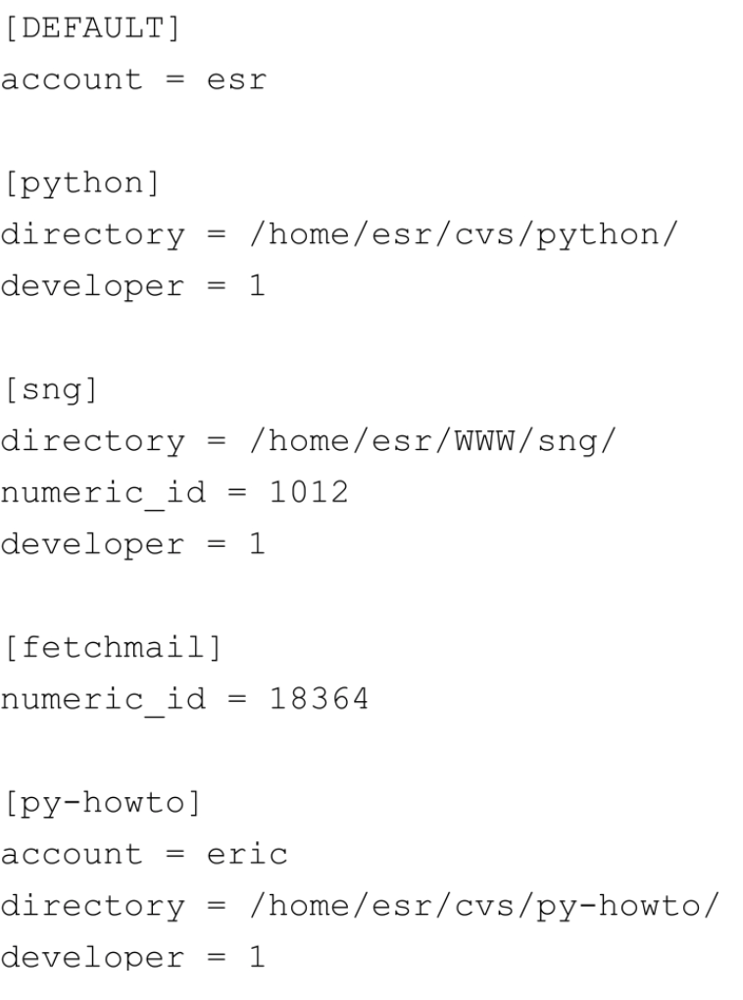

# Unix 编程艺术

## 哲学

Unix有它自己的文化；有独特的编程艺术；有一套影响深远的设计哲学。理解这些传统，会使你写出更好的软件，即使你是在非 Unix 平台上开发。

### Unix 之失

Unix文件在字节层次以上再无结构可言。文件删除了就没法恢复。Unix的安全模型公认地太过原始。作业控制有欠精致。命名方式非常混乱。或许拥有文件系统本身就是一个错误。

Unix最持久的异议恰恰来自Unix哲学的一个特性，这一条特性是Xwindow设计者首先明确提出的。X致力于提供一套 **“机制，而不是策略”​**，以支持一套极端通用的图形操作，从而把使用工具箱和界面的“观感”​（策略）推后到应用层。Unix其它系统级的服务也有类似的倾向：行为的最终逻辑被尽可能推后到使用端。

这个“错误”换来至关重要的优势：策略相对短寿，而机制才会长存。

### Unix 之得

- 开源软件    
    自由共享代码，随源代码发布就是 Unix 的文化特色
- 跨平台可移植性和开放标准   
    Unix API 是 “可移植操作系统标准”(Portable Operating System Standard) 的事实标准，因此，POS很快就被大家加了后缀变成了“POSIX”​[缩写为 POSIX 是为了读音更像 Unix]​
- Internet和万维网
    Unix对于TCP/IP的实现相对于其它系统更加稳固可靠
- 开源社区   
    由于代码共享，Unix 社区一直在吸纳最优秀的人才
- 从头到脚的灵活性   
    自诩比Unix现代和界面友好的操作系统，都有着脆弱狭隘难用的编程接口。在这样的操作系统中，完成设计者（指操作系统）预见的任务很容易，但如果要完成设计者没有预料到的任务，用户不是无计可施就是痛苦不堪。    
    相反，Unix具有非常彻底的灵活性。Unix提供众多的程序粘合手段，这意味着Unix基本工具箱的各种组件连纵开合后，将收到单个工具设计者无法想象的功效。Unix传统将重点放在尽力使各个程序接口相对小巧、简洁和正交——这也是另一个提高灵活性的方面。整个Unix系统，容易的事还是那么容易，困难的事呢，至少是有可能做到的。
- Unix Hack 之趣
    对于程序员和开发人员来说，如果完成某项任务所需要付出的努力对他们是个挑战却又恰好还在力所能及的范围内，他们就会觉得很有乐趣。因此，趣味性是一个峰值效率的标志    
    在 Unix 世界里，操作系统以成就感而不是挫折感来回报人们的努力。Unix 下的程序员通常会把Unix当作一个积极有效的帮手，而不是把操作系统当作一个对手还非得用蛮力逼迫它干活。
- Unix的经验别处也可适用

### Unix 哲学基础

Unix哲学起源于Ken Thompson早期关于如何设计一个服务接口简洁、小巧精干的操作系统的思考，

Unix管道的发明人、Unix传统的奠基人之一 Doug McIlroy 的 Unix 哲学：

- 让每个程序就做好一件事。如果有新任务，就重新开始，不要往原程序中加入新功能而搞得复杂。
- 假定每个程序的输出都会成为另一个程序的输入，哪怕那个程序还是未知的。输出中不要有无关的信息干扰。避免使用严格的分栏格式和二进制格式输入。不要坚持使用交互式输入。
- 尽可能早地将设计和编译的软件投入试用，哪怕是操作系统也不例外，理想情况下，应该是在几星期内。对拙劣的代码别犹豫，扔掉重写。
- 优先使用工具而不是拙劣的帮助来减轻编程任务的负担。工欲善其事，必先利其器。

总结：Unix哲学是这样的：一个程序只做一件事，并做好。程序要能协作。程序要能处理文本流，因为这是最通用的接口。

最伟大的C语言大师之一，Rob Pike 的 Unix 哲学：

原则1：你无法断定程序会在什么地方耗费运行时间。瓶颈经常出现在想不到的地方，所以别急于胡乱找个地方改代码，除非你已经证实那儿就是瓶颈所在。  
原则2：估量。在你没对代码进行估量，特别是没找到最耗时的那部分之前，别去优化速度。  
原则3：花哨的算法在n 很小时通常很慢，而n通常很小。花哨算法的常数复杂度很大。除非你确定n总是很大，否则不要用花哨算法（即使n很大，也优先考虑原则2）​。  
原则4：花哨的算法比简单算法更容易出bug、更难实现。尽量使用简单的算法配合简单的数据结构。(**拿不准就穷举**)   
原则5：数据压倒一切。如果已经选择了正确的数据结构并且把一切都组织得井井有条，正确的算法也就不言自明。编程的核心是数据结构，而不是算法  
原则6：没有原则6。

Unix 哲学可以概括为：

1. 模块原则：使用简洁的接口拼合简单的部件。   
    > 计算机编程的本质就是控制复杂度。   
    要编制复杂软件而又不至于一败涂地的唯一方法就是降低其整体复杂度——用清晰的接口把若干简单的模块组合成一个复杂软件如此一来，多数问题只会局限于某个局部，那么就还有希望对局部进行改进而不至牵动全身。
2. 清晰原则：清晰胜于机巧。  
    > 维护如此重要而成本如此高昂；在写程序时，要想到你不是写给执行代码的计算机看的，而是给将来阅读维护源码的人（包括你自己）看的。   
    为了取得程序一丁点的性能提升就大幅度增加技术的复杂性和晦涩性，这个买卖做不得。  
    永远不要去吃力地解读一段晦涩的代码三次，第二次就应该加注释
3. 组合原则：设计时考虑拼接组合。
    > 在输入输出方面，Unix传统极力提倡采用简单、文本化、面向流、设备无关的格式  
    在经典的Unix下，多数程序都尽可能采用简单过滤器的形式，即将一个输入的简单文本流处理为一个简单的文本流输出。  
    根据经验如果程序不采用简单的文本输入输出流，往往极难衔接。  
    GUI场景要把复杂的交互程序跟干粗活的算法程序分离开，然后用一个简单的命令流或者是应用协议将其组合在一起，这个数据格式尽量采用文本格式，以一点点格式解析的代价，换得可以使用通用工具来构造或解读数据流的好处
4. 分离原则：策略同机制分离，接口同引擎分离。  
    > 策略的变化要远远快于机制。这条准则告诉我们应该设法将接口和引擎剥离开来。  
    实现这种剥离的一个方法是，将应用按照一个库来编写，这个库包含许多由内嵌脚本语言驱动的服务程序，整个应用的控制流程则用脚本来撰写  
    另一个方法是将应用程序分成可以协作的前端和后端进程，通过套接字上层的专用应用协议进行通讯；前端实现策略，后端实现机制
5. 简洁原则：设计要简洁，复杂度能低则低。
    > 鼓励以简洁为美的软件文化  
    设法将程序系统分解为几个能够协作的小部分，并本能地抵制任何用过多噱头来粉饰程序的企图。
6. 吝啬原则：除非确无它法，不要编写庞大的程序。
7. 透明性原则：设计要可见，以便审查和调试。
    > 调试通常会占用四分之三甚至更多的开发时间  
    一个特别有效的减少调试工作量的方法就是设计时充分考虑透明性和显见性。  
    透明性是指一眼就能够看出软件是在做什么以及怎样做的,显见性指程序带有监视和显示内部状态的功能  
    调试选项的设置应该在设计之初便考虑进去  
    应该使用足够简单的输入输出格式，这样才能很容易地检验有效输入和正确输出之间的关系是否正确。  
    还应该提倡接口简洁，以方便其它程序对其进行操作——尤其是测试监视工具和调试脚本  
8. 健壮原则：健壮源于透明与简洁。
    > 健壮性指软件不仅能在正常情况下运行良好，而且在超出设计者设想的意外条件下也能够运行良好。  
    让程序健壮的方法，就是让程序的内部逻辑更易于理解,要做到这一点主要有两种方法：透明化和简洁化。程序越简洁，越透明，也就越健壮。  
    在有异常输入的情况下，保证软件健壮性的一个相当重要的策略就是避免在代码中出现特例  
    模块性（代码简朴，接口简洁）是组织程序以达到更简洁目的的一个方法。 
9. 表示原则：把知识叠入数据以求逻辑质朴而健壮。
    > 数据比代码更容易让人类理解。在设计中，应该主动将代码的复杂度转移到数据之中去。  
10. 通俗原则：接口设计避免标新立异。
    > 也叫 “最少惊奇原则”​  
    最易用的程序就是用户需要学习新东西最少的程序    
    设计接口的时候，尽量按照用户最可能熟悉的同样功能接口和相似应用程序来进行建模    
    关注目标受众。关注传统惯例。    
    最小立异原则的另一面是表象相似而实际却略有不同，这会极端危险
11. 缄默原则：如果一个程序没什么好说的，就沉默。
12. 补救原则：出现异常时，马上退出并给出足够错误信息。
13. 经济原则：宁花机器一分，不花程序员一秒。
    > 选择开发效率更高的编程语言和工具，节约程序员时间
14. 生成原则：避免手工hack，尽量编写程序去生成程序。
    > 对于代码生成器来说，需要手写的重复而麻木的高级语言代码，与机器码一样是可以批量生产的。当代码生成器能够提升抽象度时——即当生成器的说明性语句要比生成码简单时，使用代码生成器会很合算，而生成代码后就根本无需再费力地去手工处理了。  
    在 Unix 传统中，人们大量使用代码生成器使易于出错的细节工作自动化。Parser/Lexer 生成器就是其中的经典例子，而 makefile 生成器和 GUI 界面式的构建器(interface builder)则是新一代的例子。 
15. 优化原则：雕琢前先要有原型，跑之前先学会走。
    > 先制作原型，再精雕细琢。优化之前先确保能用。
16. 多样原则：决不相信所谓“不二法门”的断言。
    > Unix奉行的是广泛采用多种语言、开放的可扩展系统和用户定制机制。
17. 扩展原则：设计着眼未来，未来总比预想来得快。
    > 要为数据格式和代码留下扩展的空间  
    设计协议或是文件格式时，应使其具有充分的自描述性以便可以扩展。
    设计代码时，要有很好的组织，让将来的开发者增加新功能时无需拆毁或重建整个架构。

### Unix哲学之一言以蔽之

所有的Unix哲学浓缩为一条铁律: KISS(Keep It Simple, Stupid!)

### 应用Unix哲学

- 只要可行，一切都应该做成与来源和目标无关的过滤器。
- 数据流应尽可能文本化（这样可以使用标准工具来查看和过滤）​。
- 数据库部署和应用协议应尽可能文本化（让人可以阅读和编辑）​。
- 复杂的前端（用户界面）和后端应该泾渭分明。
- 如果可能，用C编写前，先用解释性语言搭建原型。
- 当且仅当只用一门语言编程会提高程序复杂度时，混用语言编程才比单一语言编程来得好。
- 宽收严发（对接收的东西要包容，对输出的东西要严格）​。
- 过滤时，不需要丢弃的信息决不丢。
- 小就是美。在确保完成任务的基础上，程序功能尽可能少。

### 运用Unix哲学的态度

如果不能确定什么是对的，那么就只做最少量的工作，确保任务完成就行，至少直到明白什么是对的。

要良好的运用Unix哲学，你就应该不断追求卓越。你必须相信，软件设计是一门技艺，值得你付出所有的智慧、创造力和激情

要良好地运用Unix哲学，你应该珍惜你的时间决不浪费。一旦某人已经解决了某个问题，就直接拿来利用，不要让骄傲或偏见拽住你又去重做一遍。永远不要蛮干；要多用巧劲，省下力气到需要的时候再用，好钢用在刀刃上。善用工具，尽可能将一切都自动化。

## 模块性：保持清晰，保持简洁

### 封装和最佳模块大小

模块化代码的首要特质就是封装。封装良好的模块不会过多向外部披露自身的细节，不会直接调用其它模块的实现码，也不会胡乱共享全局数据。模块之间通过应用程序编程接口(API)——一组严密、定义良好的程序调用和数据结构来通信。

API在模块间扮演双重角色。在实现层面，作为模块之间的滞塞点(choke point)，阻止各自的内部细节被相邻模块知晓；在设计层面，正是API（而不是模块间的实现代码）真正定义了整个体系。

有一种很好的方式来验证API是否设计良好：如果试着用纯人类语言描述设计（不许摘录任何源代码）​，能否把事情说清楚？一些最有能力的开发者，一开始总是定义接口，然后编写简要注释，对其进行描述，最后才编写代码

缺陷密度和模块大小关系图，曲线呈U形​。跟中间大小的模块相比，模块过大或者过小都会有更多的bug


> 假设其它所有因素（如程序员能力）都相同，200到400之间逻辑行的代码是“最佳点”​，可能的缺陷密度达到最小。这个大小与所使用的语言无关。逻辑行与物理行之间大概为两倍的折算率，即最佳物理行数建议应在400至800行之间。

### 紧凑性和正交性

#### 紧凑性

紧凑性就是一个设计是否能装进人脑中的特性。测试方法：有经验的用户通常需要操作手册吗？如果不需要，那么这个设计（或者至少这个设计的涵盖正常用途的子集）就是紧凑的。

极少有绝对意义上紧凑的软件设计，有一个紧凑的工作集：一个功能子集，能够满足专家用户80%以上的一般需求。通常只需要一个参考卡(reference card)或备忘单(cheat sheet)，而不是一本手册, 将此类设计称为“半紧凑型”。

> Unix系统调用API是半紧凑的，而C标准程序库无论如何都算不上是紧凑的。

人类短期记忆能够容纳的不连续信息数就是七，加二或减二。评测API紧凑性的很好的经验法则：编程者需要记忆的条目数大于七吗？如果大于七，则这个API不太可能算是严格紧凑的。

有些不具备紧凑性的设计具有足够的内部功能冗余，结果程序员通过选择某个工作的语言子集就能够搞出能满足80%普通任务的紧凑方言。该语言的程序员对工作子集的不同选择成了他们理解和修改代码的巨大障碍。

#### 正交性

正交性是有助于使复杂设计也能紧凑的最重要特性之一。在纯粹的正交设计中，任何操作均无副作用；每一个动作（无论是API调用、宏调用还是语言运算）只改变一件事，不会影响其它。无论你控制的是什么系统，改变每个属性的方法有且只有一个。

#### SPOT原则

关于特别重要的正交性的原则——**不要重复自身(Don't Repeat Yourself")**，意思是说：任何一个知识点在系统内都应当有一个唯一、明确、权威的表述。也称为“**真理的单点性(Single Point of Truth)**”或者**SPOT原则**。

!> 无论何时，重复代码都是危险信号。

通常，可以通过重构去除重复代码；也就是说，更改代码的组织而不更改核心算法

关于下面的重复代码问题值得思考：

- 如果代码中含有重复数据是因为在两个不同的地方必须使用两个不同的表现形式，能否写个函数、工具或代码生成程序，让其中一个由另一个生成，或两者都来自同一个来源？
- 如果文档重复了代码中的知识点，能否从部分代码中生成部分文档，或者反之，或者两者都来自同一个更高级的表现形式？
- 如果头文件和接口声明重复了实现代码中的知识点，是否可以找到一种方法，从代码中生成头文件和接口声明？

> Unix传统中SPOT原则在各种形式的代码生成器中充分体现。

### 软件是多层的

设计函数或对象的层次结构可以选择两个方向：
- 自底向上，从具体到抽象——从问题域中你确定要进行的具体操作开始，向上进行。
- 自顶向下，从抽象到具体——从最高层面描述整个项目的规格说明或应用逻辑开始，向下进行，直到各个具体操作

有一个非常具体的方法可以考量二者的差异，那就是问问设计是围绕主事件循环（常常具备与其非常接近的高级应用逻辑）组织，还是围绕主循环可能调用的所有操作的服务库组织代码。自顶向下的设计者通常先考虑程序的主事件循环，以后才插入具体的事件。自底向上的设计者通常先考虑封装具体的任务，以后再按某种相关次序把这些东西粘合在一起。

当以下三个条件都成立时，自顶向下不失为好方法：(a)能够精确预知程序的任务，(b)在实现过程中，程序规格不会发生重大变化，(c)在底层，有充分自由来选择程序完成任务的方式。

这些条件容易在相对接近最终用户和软件设计的较上层——应用软件编程——中得到满足

Unix程序员更倾向于自底向上的编程方式。

实际代码往往是自顶向下和自底向上的综合产物。同一个项目中经常同时兼有自顶向下的代码和自底向上的代码。这就导致了“胶合层”的出现。

胶合层是个挺讨厌的东西，必须尽可能薄，这一点极为重要。胶合层用来将东西粘在一起，但不应该用来隐藏各层的裂痕和不平整。

### Unix和面向对象语言

Unix程序员一直比其他程序员对OO更持怀疑态度，原因之一就源于多样性原则。OO 经常被过分推崇为解决软件复杂性问题的唯一正确办法。

Unix的模块化传统就是薄胶合层原则，也就是说，硬件和程序顶层对象之间的抽象层越少越好。OO语言鼓励“具有厚重的胶合和复杂层次”的体系。

### 模块式编码

在编写代码时，问问自己以下这些问题，可能会有助于提高代码的模块性：

- 有多少全局变量？全局变量对模块化是毒药
- 单个模块的大小是否在 Hatton 的“最佳范围”内？
- 模块内的单个函数是不是太大了？
- API 的入口点是不是超过七个？有没有哪个类有七个以上的方法？数据结构的成员是不是超过七个？
- 整个项目中每个模块的入口点数量如何分布？是不是不均匀？有很多入口点的模块真的需要这么多入口点吗？模块复杂性往往和入口点数量的平方成正比

## 文本化：好协议产生好实践

内存数据结构序列化的两个场景：
- 将应用数据存储在永久存储器中的文件格式，
- 在协作程序中（可能会通过网络）传递数据和命令的应用协议。

配置文件通常都可以手工编辑，体积很小，而数据文件通常由程序生成，多大都有可能。

如果担心性能问题，就在应用协议之上或之下的某个层面上压缩文本协议流

使用二进制协议的唯一正当理由是：如果要处理大批量的数据集，因而确实关注能否在介质上获得最大位密度，或是非常关心将数据转化为芯片核心结构所必须的时间或指令开销。

二进制格式通常指定了给定值的分配位数，要扩展位数非常困难。

当认为找到一种极端情况，有足够理由使用二进制文件格式或协议时，需仔细考虑扩展性，并在设计中为以后发展留出余地。

Unix经典文本格式

- Unix口令文件格式：一行一条、字段用冒号分隔  
    
- Usenet .newsrc 文件格式: 每行都为以第一个字段为名的新闻组设置属性。新闻组名称之后紧跟一个字符，表明文件对应的用户目前是否订阅了该组；冒号表示订阅，惊叹号表示没有订阅。其余部分是一系列逗号分隔的文章编号或文章编号范围，表明用户已经阅读过哪些文章  
    
- PNG格式是二进制文件格式中一个经过周密设计的优秀例子

### 数据文件元格式

#### DSV 格式

DSV代表“Delimiter-Separated Values（分隔符分隔值）”。

在Unix中，对字段值可能包含空格的DSV格式，**冒号是默认的分隔符**。比如 `/etc/passwd` `/etc/group` `/etc/inittab`

一般应通过反斜杠(`\`)转义符支持在数据域中包含冒号。读取这种文件的代码可通过忽略反斜线转义的换行符支持连续记录，并且允许通过C风格的反斜杠转义符嵌入非打印字符数据。

除了冒号，也有用其它分隔符：管道字符“|”​，甚至用ASCII NUL。Unix的旧学派做法偏爱TAB，但是 TAB 和 SPACE 在视觉上无法区别，已经不建议使用

Microsoft版CSV是个反面例子，其分割符的处理很复杂：如果字段值中存在分隔符，就将整个字段值包括在双引号内。如果字段值包含双引号，整个字段值也得包括在双引号内，字段中的单个双引号需要重复两遍才能表明自己并不结束整个字段。

Unix的方法是简单的用反斜杠转义分隔符，用双反斜杠表示反斜杠字面值。在解析文件时，这种设计只要检查一种特殊情况（转义符）​，发现转义符时只要一个操作（解析跟在转义符后的字符）​。

#### RFC 822 格式

RFC 822格式源自互联网电子邮件信息采用的文本格式

在这种元格式中，记录属性每行存放一个，以类似邮件头字段名的标记命名，用冒号后接空白作为结束。
字段名不得包含空格；通常用横线代替空格。
该行的其余部分都是属性值，除了结尾的空格和换行。
以tab（制表符）或whitespace（空格符）开始的物理行被解释为当前逻辑行的延续。
空行可能被解释为记录的结束，也可能表明接下来是非结构化的文本。

```
date: yyyy-MM-hh dd:mm:ss
source: xxx

some content
```

在Unix中，对那些带属性的或任何与电子邮件类似的信息，这都是传统而且首选的文本元格式。
一般来说，这种格式非常适合具有不同字段集合而字段中数据层次又扁平（没有递归或树形结构）的记录。

#### Cookie-Jar格式

适用记录只是一堆非结构化文本的情况。这种格式简单使用跟随%%的新行符（或者有时只有一个%）作为记录分隔符。


解析程序寻找记录分隔符时接受%后的空格是个好做法，有助于解决人为编辑的错误。更好的做法就是使用%%，并忽略从%%到行结束处的所有文本。


#### Record-Jar格式


Record-jar格式适合于那些类似DSV文件、但又有可变字段数目而且可能伴随无结构文本的字段属性关系集合。

#### XML

适合有复杂递归或嵌套数据结构的格式

XML 最严重的问题是无法很好和传统的 Unix 工具协作

#### Windows INI



这种格式可读性好，设计得不错，但和XML一样，不能与grep(1)或常规Unix脚本工具很好地配合使用。

如果数据围绕指定的记录或部分能够自然分成“名称-属性对”两层组织结构，.INI格式非常适用。
但这种格式并不适合数据存在完全递归树形结构的情况（XML更适合）​；
而对于简单的名称-值关系列表，这种格式又是大材小用（这时应使用DSV格式）​。

#### Unix文本文件格式的约定

- 如果可能，以新行符结束的每一行只存一个记录
- 如果可能，每行不超过80个字符
- 使用“＃”引入注释
- 支持反斜杠约定
- 在每行一条记录的格式中，使用冒号或任何连续的空白作为字段分隔符
- 不要过分区别tab和whitespace
- 优先选用十六进制而不是八进制
- 对于复杂的记录，使用“节(stanza)”格式：一个记录若有多行，就使用%%\n或%\n 作为记录分隔符
- 在节格式中，要么每行一个记录字段，要么让记录格式和RFC 822电子邮件头类似，用冒号终止的字段名关键字作为引导字段
- 在节格式中，支持连续行
- 要么包含一个版本号，要么将格式设计成相互独立的自描述字节块
- 注意浮点数取整问题
- 不要仅对文件的一部分进行压缩或二进制编码

#### 文件压缩的利弊

创建一个简单的工具来做好压缩，要比仅对文件某些部分进行特别压缩更有效，原因在于，压缩工具可以扫描所有数据，然后找到信息中的所有重复部分进行压缩。

纯文本，纯二进制或压缩文本, 具体取决于对存储经济性、可显性或让浏览工具编写起来尽可能简单等问题的权衡考虑

### 应用协议设计

#### 实例分析：SMTP，一个简单的套接字协议

C：行由发送邮件的邮件传输代理(MTA)发送，S：行由接收邮件的MTA返回。


请求的命令参数格式，应答由状态码和紧接其后的指示信息构成，以及“DATA”命令的有效数据部分以一个只有单个“.”的行结束。

SMTP 是互联网上仍在使用的最古老的两三个应用协议之一。这个协议简单有效，经受住了时间的考验。

> 如果说设计良好的互联网应用协议有个原型的话，那么这个原型一定是SMTP。

#### 实例分析：POP3，邮局协议

SMTP 是邮件发送者启动事务处理的“推(push)”协议，而 POP3是邮件接收者启动事务处理的“拉(pull)”协议。


与SMTP有一些不同之处，最明显的区别是POP3使用状态标记，而不是像SMTP那样使用3位数字的状态码。

#### 实例分析：IMAP，互联网消息访问协议

IMAP——另一个设计风格略有不同的邮局协议。


IMAP 对有效载荷部分的分隔方法略有不同，它不是用一个点号来结束，而是将有效载荷的长度直接放在有效载荷之前发送。

IMAP（为取代POP3协议而设计）是一个成熟而强大的互联网应用协议的优秀设计典范，值得学习和效仿。

### 应用协议元格式

就像数据文件元格式是为了简化存储的序列化操作而发展出来一样，应用协议元格式是为了简化网络间事务处理的序列化操作而发展出来的。

经典的互联网元协议是文本格式，使用单行请求和响应，但有效数据载荷可以多行。有效数据载荷要么是8位组数据作为前导，要么以“\r\n”行作为结束符。

#### 作为通用应用协议的HTTP

HTTP请求采用类似RFC-822/MIME格式的消息

## 透明性

如果实际上能预测到程序行为的全部或大部分情况，并能建立简单的心理模型，这个程序就是透明的，

如果软件系统所包含的功能是为了帮助人们对软件建立正确的“做什么、怎样做”的心理模型而设计，这个软件系统就是可显的

学习编写透明的代码是学习如何编写优雅代码的第一关，很难的一关——而关注代码的可显性则帮助我们学习如何编写透明的代码。优雅的代码既透明又可显。

### 为透明性和可显性而设计

#### 透明性之禅

在“这个设计能行吗？​”之后要提出的头几个问题就是“别人能读懂这个设计吗？这个设计优雅吗？​”

要追求代码的透明，最有效的方法很简单，就是不要在具体操作的代码上叠放太多的抽象层

太多的OO设计就像是意大利空心粉一样，把 “is-a”和“have-a”的关系弄得一团糟，或者以厚胶合层为特征，在这个胶合层中，许多对象的存在似乎只不过是为在陡峭的抽象金字塔上占个位置罢了。这些设计都不透明，它们（臭名昭著地）晦涩难懂并且难以调试。

要用设计简单而透明的算法和数据结构紧贴基面。

保持薄胶合层

#### 为透明性和可显性而编码

透明性和可显性同模块性一样，主要是设计的特性而不是代码的特性。以下这些问题需要好好思考：

- 程序调用层次中最大的静态深度是多少？如果大于四，就要当心。
- 代码是否具有强大、明显的不变性质？
- 每个 API 中的各个函数调用是否正交？或者是否存在太多的特征标志(magic flags)和模式位，使得一个调用要完成多个任务？
- 是否存在一些顺手可用的关键数据结构或全局唯一的记录器(scoreboard)，捕获了系统的高层级状态？这个状态是否容易被形象化和检验，还是分布在数目众多的各个全局变量或对象中，而难以找到？
- 程序的数据结构或分类和它们所代表的外部实体之间，是否存在清晰的一对一映射？
- 是否容易找到给定函数的代码部分？不仅单个函数、模块，还有整个代码，需要花多少精力才能读懂？
- 是否容易找到给定函数的代码部分？不仅单个函数、模块，还有整个代码，需要花多少精力才能读懂？
- 代码中有多少个magic number（意义含糊的常量）​？通过审查是否很容易查出实现代码中的限制（比如关键缓冲区的大小）​？

#### 透明性和避免过度保护

程序员经常建造过分精细的抽象城堡，这一倾向的近亲是过度保护底层细节。隐藏细节和无法访问细节有着重要区别。

不能展示其行为的程序使故障检测困难得多。所以，经验丰富的Unix用户实际上把调试和探测开关的存在视为良好程序的标志，不存在则认为程序可能有问题。

### 为可维护性而设计

如果作者以外的其他人能够顺利地理解和修改软件，则这个软件就是可维护的

一个非常重要的实践就是应用清晰原则：选择简单的算法

> 拿不准就穷举

另一个重要的实践是要包含开发者手册(hacker's guide)

## 多道程序设计

Unix 最具特点的程序模块化技法就是将大型程序分解成多个协作进程

平价的进程生成和简单的进程控制对能否以Unix风格编程起着关键作用

### 从性能调整中分离复杂度控制

在开发出可以把全局复杂度降至最低程度的干净体系之前，关注性能问题便是过早优化——万恶之源

例如线程的性能更优，但是线程不是降低而是提高了全局复杂度

另一个把程序划分成多个协作进程的重要原因是为了更强的安全性

在Unix下，必须由普通用户运行的程序，如果又必须拥有对安全性至关重要的系统资源的写访问权限，可以通过一个叫setuid bit的特性获得。通常，一个 setuid 程序只在一个或很少几个操作中需要特权。常常可以把这样的程序划分成两个协作进程，小进程需要setuid，大的则不需要

### Unix IPC 方法的分类

#### 把任务转给专门程序

被调用的程序经常通过`system(3)`的调用被指定为一个Unix Shell 命令，因此这通常称做对被调用程序`shell out`（外壳执行）。

专门程序通常借由文件系统与父进程进行通信，方法是在指定位置读取或修改文件

#### 管道、重定向和过滤器

管道线中所有阶段的程序是并发运行的，注意到这一点很重要。每一段等待前一段的输出作为输入，但在下一段能够运行前没有哪个段必须退出。

除了shell创建的匿名管道。还有一种变种，叫做“命名管道”，是一种特殊的文件。如果两个程序打开这个文件，一个读取，另一个写入，则命名管道扮演两者间的配接器。命名管道已经成了老古董；在使用中，大部分已经被我们下面将要讨论的命名套接字取代了

> 管线是单向的

#### 包装器

和 shellout 程序相对的是包装器(wrapper)。包装器或者将被调用程序专用化，或者为它创建新的接口。包装器经常用于隐藏shell管线的复杂细节。

包装器之所以存在，常常源于要指定参数来修改被调用程序的行为。

专用化包装器是Unix shell和其它脚本语言的经典用途。

#### 安全性包装器和Bernstein链

包装器脚本的常见用法是安全性包装器

#### 从进程

有时候，子程序通过连接到标准输入和标准输出的管道，交互地和调用程序收发数据。

在编写主/从进程对时，一个好方法是，让主进程支持命令行开关或环境变量来允许调用者设置自己的从进程命令。抛开其它好处，这尤其有利于调试。

#### 对等进程间通信

##### 临时文件

把临时文件作为协作程序之间的通信中转站使用，是最古老的IPC技法。

把临时文件作为IPC技法使用最明显的问题是，如果进程在临时文件可被删除前中断，则往往会遗留垃圾数据。

另一个更隐蔽的风险是，如果程序的多个实例都使用同一个名字作为临时文件名，则会产生冲突。这就是为什么shell脚本的惯例是在临时文件名中包含`$$`符号的原因；这个shell变量将被展开为载入shell的进程ID，从而有效地保证了文件名的唯一性

##### 信号 

要让同一台机器上的两个进程相互通信，最简单最原始的方法是一个进程向另一个发送信号

要让同一台机器上的两个进程相互通信，最简单最原始的方法是一个进程向另一个发送信号。Unix的信号是一种软中断形式：每个信号都对接收进程产生默认作用（通常是杀掉它）。进程可以声明信号处理程序，让信号处理程序覆盖信号的默认行为；处理程序是一个与接受信号异步执行的函数。

信号被设计进Unix，最初是作为操作系统就某些错误或关键事件通知程序的一种机制，并不是作为IPC功能设计进来的

随信号 IPC 经常使用的一种技法是所谓 pidfile。需要信号的程序会向已知位置写入一个包含进程 ID(PID)的小文件（通常放在/var/run 或调用用户的主目录下）。其它程序可以读取这个文件来获得PID。如果守护程序只允许一个实例运行，则pidfile也可作为隐含的文件锁使用。

##### 套接字

> 基于TCP/IP的BSD风格套接字已经成为主流的Unix IPC方法

##### 共享内存 

如果通信进程能够访问同一个物理内存，则共享内存将是它们之间最快的信息传递方法

共享内存可能以各种API的面貌呈现，但是在现代Unix中，共享内存的实现通常依靠使用`mmap(2)`，把文件映射成可以被多个进程共享的内存。POSIX定义了具有API的`shm_open(3)`功能，支持把文件作为共享内存使用，这通常是对操作系统的提示，告诉它无需把伪文件数据刷到磁盘上。

使用这些共享内存和信号量功能（shmget(2)、semget(2)及其类似机能）可以避免通过网络栈复制数据的开销

### 在设计层次上的进程划分

临时文件、交互性更强的主/从进程关系、套接字、RPC和其它一些双向IPC方法在某种程度上是等价的——它们都只不过是程序在生命期内交换数据的方法。

降低复杂度的有效方法是把程序划分成客户端/服务器对。

真实世界里的编程其实就是管理复杂度的问题。能够管理复杂度的工具都是好东西。但当这些工具的作用不是控制而是增加复杂度的时候，最好扔掉

## 微型语言 

> 程序员每百行代码出错率和所使用的编程语言在很大程度上无关。[插图]更高级的语言可以用更少的行数完成更多的任务，也意味着更少的bug。

Unix有个长期传统，即包容小型的、为专门应用领域特制、大量减少程序行数的语言。专门领域语言的实例包括无数 Unix 排版语言(troff，eqn，tbl，pic，grap)、shell实用程序(awk，sed，dc，bc)和软件开发工具(make，yacc，lex)。

专门领域语言和更灵活应用程序的运行控制文件(sendmail，BIND，X)之间、数据文件格式之间、脚本语言之间的界限都很模糊

传统术语“微型语言”以强调：明智的方法通常是保持这些设计尽可能小、尽可能简单。

至少有三种方式可以做好微型语言的设计，两种好的，一种危险的:

第一个正确方法是，预先认识到可以使用微型语言设计把编程问题的规格说明提升一个层次；与代码生成和数据驱动编程一样，微型语言允许我们切实利用“软件的缺陷率和使用的语言在很大程度上无关”这一事实；

第二个正确方法是，注意到规格说明文件格式越来越类似微型语言。规格说明是否试图描述控制流和数据部署？

错误方法是通过扩展变成微型语言：每次增加一个补丁或者一个仓促而就的特性。

所有十分复杂的规格说明文件都希望成为微型语言。但是很容易演进成复杂设计不良的微型语言。需要知道如何设计一门好的微型语言。

### 理解语言分类法

如果结构化的数据文件格式不仅表达了结构，而且在某些解释性上下文（也就是数据文件以外的存储）下表达执行行为时，这种格式开始接近于一种微型语言。

微型语言的范畴从声明性（具有隐式操作）发展到命令性（具有显式操作）。

有些针对专门任务的命令性微型语言几乎快成为通用解释器。当它们明确成为完备图灵机时，它们就是解释器——也就是说，可以进行条件和循环（或递归）操作，并且具有用于控制结构的特性。

### 应用微型语言

设计微型语言面临两个截然不同的挑战。一个挑战是在工具包中已经存在方便好用的微型语言时，认识到何时可以直接应用它们。另一个挑战是知道应该在什么时候为应用程序设计自定的微型语言

### 设计微型语言

#### 选择正确的复杂度

设计微型语言时要记住的第一要素是尽可能保持微型语言的简单

用结构化数据能满足要求的时候就不要用微型语言。

微型语言的优势之一是可以把一些自顶向下的决策放到微型语言的程序控制流中，从而帮助我们从自底向上的编程中得到一个良好的设计。但如果我们对微型语言设计的本身采取自底向上的方法，则最终我们很可能得到一种丑陋的语法，反映出一种薄弱的语言和未经仔细考虑的实现。

声明性微型语言应该具有一个明确、一致、类似自然语言的语法能够为人类所阅读。命令性微型语言则应该从用户应该熟悉的语言模型中套用一系列控制结构

#### 扩展和嵌入语言

一个非常重要的基础性问题是，能否通过扩展或嵌入现有脚本语言来实现自己的微型语言。这往往是实现命令性语言的正确办法，但对于声明性语言就不是那么合适了。

有时候，简单地在解释性语言中编写服务函数就可能实现命令性语言

这是编写微型语言最简单的方法。

#### 编写自定义语法

至于声明性微型语言，一个主要问题是，是否应该用XML作为语法基础并把语法规定为XML文档类型。对于层次复杂的说明性微型语言，这完全可能是正确做法

如果确实需要自定义语法，yacc和lex（或所用语言中的本地等价实现）也许是我们最好的朋友

#### 语言还是应用协议

微型语言引擎是否可被其它程序作为从进程交互调用。如果可以，我们的设计可能看上去不太像可供人类交互的会话式语言，而更像应用协议。

增加一个选项，改变会话行为，使其相应地更像应用协议，同时给出明确的输出结束分隔符和类似的字节补齐，也许是个不错的主意。

## 生成：提升规格说明的层次


