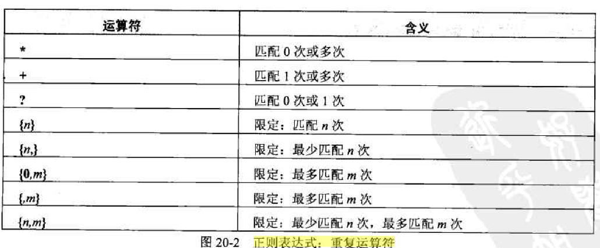
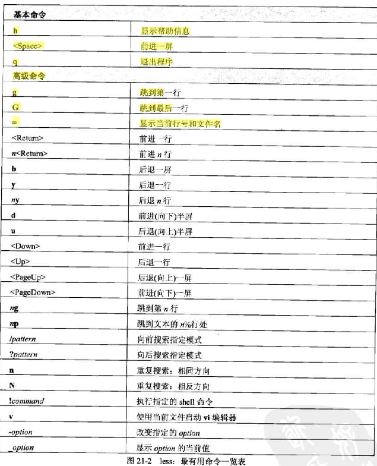
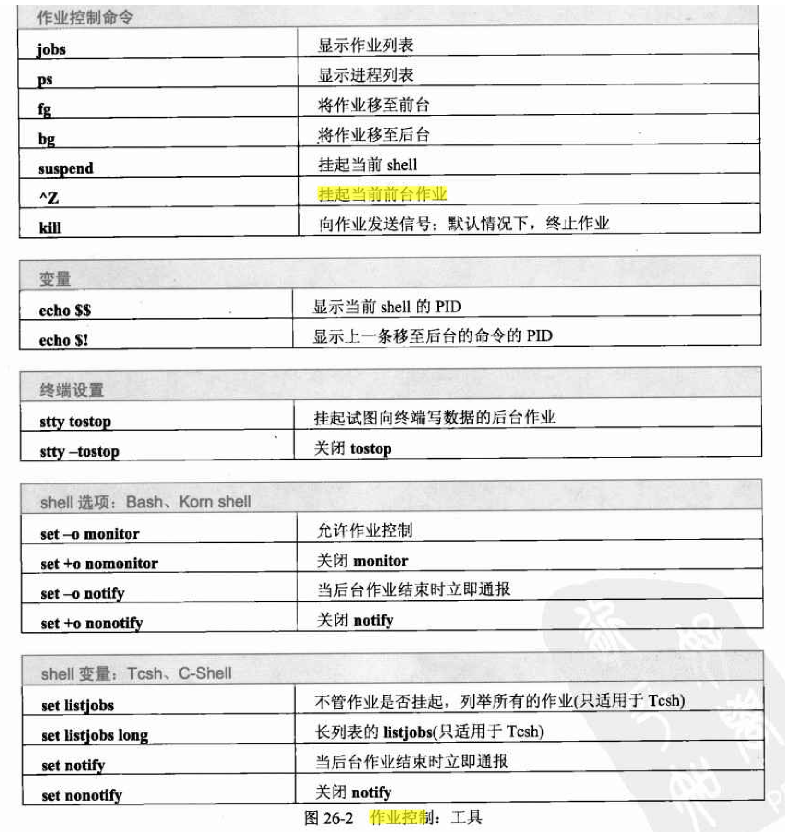

# Unix 和 Linux 教程

## 什么是 Linux？什么是 Unix?

Unix 是一种类型的计算机系统，而 Linux 是 Unix 系统一个特定家族的名称。

所有 Unix 操作系统都有两个重要的特征： 多任务和多用户。

> 当一个命名后面带个 `X`，可以想想是不是和 Unix 有关系

### 什么是内核

当计算机启动时，计算机要经历一系列的动作，这些动作构成引导过程。该过程的最后一个动作是启动一个非常复杂的程序，这个程序称为**内核(kernel) **。

内核的作用是控制计算机，充当操作系统的核心。由于这一点，所以内核总是一直运行

内核提供的服务：

- 内存管理（虚拟内存管理，包括分页）
- 进程管理（进程创建、终止、调度）
- 进程间通信（本地、网络）
- 输入输出（通过设备驱动程序，即实现与物理设备实际通信的程序）
- 文件管理
- 安全和访问控制
- 网络访问（如 TCP/IP)

内核可分为两大类：

- 单内核
    > 代表：Linux
    > 优点：速度快；缺点：难以设计和维护
- 微内核
    > 代表：FreeBSD
    > 优点：模块化设计，易于理解和维护，且更易于定制；缺点：比较慢

> Unix = 内核 + 实用工具

### Unix 的历史


### Linux 发行版

Linus Torvalds 和 Linux 项目所创建的只是一个内核，并不是一个完整的操作系统。

要形成一个操作系统，需要为内核寻找所需的各种组件， 并将它们组装在一起。

而这个事情已经有很多团队在做了，基于 Linux 的操作系统成为 *Linux 发行版(distribution)*

大多数 Linux 发行版都使用自由软件基金会的 GNU 实用工具。基于这一原因 ， FSF 坚持基于 Linux 的操作系统实际上应该称为 `GNU/Linux`

> Linux 基于开放源代码运动编写的通用公共许可证(general publie lieense, GPL)

> 当在软件上应用 GPL 协议时，允许任何人发行该软件、查看其源代码、修改该软件并发行
修改后的软件。此外， GPL 协议要求任何重新发行软件（包括修改后的版本）的人，都不能
剥夺软件的使用自由或者添加自己的限制—~这是 GPL 的关键部分。

### BSD 发行版

BSD 是 20 世纪 80 年代两大 Unix 主流之一（ 另一个是 `System V`) 。 BSD由加利福尼亚大学伯克利分校计算机科学系开发。

BSD 在完全重写了 AT&T 的 UNIX 代码后，重新命名为 `FreeBSD`.

> Macbook 的 OS X 系统就是基于 FreeBSD 构建的

FreeBSD 只适用于 PC 端，为了能移植到其它类型计算机上，提供了 `NetBSD`

另外，还有一个主要关注安全和密码学的版本：`OpenBSD`

> BSD 许可证远没有 GPL 严格。在 BSD 许可证之下，允许使用部分 BSD 创建新产品而不共享该新产品。

> 因为 BSD 许可证的原因，企业更愿意基于 BSD 构建自己的商业操作系统。

Linux 比 FreeBSD 更成功的原因：

- Linux 基于 GNUGPL 名义发行，而 GNUGPL 协议鼓励共享。
- Linus Torvalds 在 1991 年发行了 Linux 内核，而 386/BSD 直到 1992 年才发行，所以 Linux 在发行时间上占得先机

## Unix 连接

可以通过下述两个简单的公式来描述所有的计算机系统：

- 计算机＝终端＋主机
- 终端=输入设施＋输出设施

Unix 的两种终端：

- 字符终端：只使用文本
- 图形终端

> Unix 的 GUI 都基于 一个称为 X Window 的系统，而且对 X Window 的基本支持 由 一个称为 X 终端的图形终端提供

> `ssh -X` 远程连接 GUI

## Unix 基础知识

> 关于 CRLF 换行符的由来: 之前输出终端主要是打印机，打印机换行需要两个动作打印机的托架回车(carriage return)，然后换行(linefeed)

> 为了安全，Unix 登录时不会提示用户不存在，而是提示登录错误，让攻击者不知道到底是用户名还是密码错误。

> 用户标识习惯上只使用小写字母。

注销的方法：`logout`、`exit`、`login`、`^D`

> ^ 代表 Ctrl。^D 一般绑定 eof 符号，在 shell 中输入 eof，代表没有新的命令了，shell 会自动退出

> `passwd` 改变口令

> `last` 查看所有用户的登录信息

## GUI

GUI 相对于文本界面(也称命令行界面，CLI)的优势之一：一次可以看到多个程序，程序之间的切换也很方便

X Window 是一个为使用图形数据的程序提供服务的系统。在 Unix 世界中 ， X Window 在 3 个方面非常重要。

> 通常称 X Window 为 X，最重要的发行版是 X11

1. 它是儿乎所有 GUI 的基础 。
2. X Window 允许在远程计算机上运行程序，井在自己的计算机上显示完整的图形输出．
3. X Window 使得使用各式各样的硬件成为可能。此外，还可以同时使用不止一台显示器。

X Window 被设计成 GUI 和硬件之间的标准化界面，本身并不提供图形界面，提供实际 GUI 的是 *窗口管理器（Window manager）*。

但是窗口管理器也就提供基本的图形界面，但也就提供最基础的功能，用户体验并不好，所以又出现更上层的桌面环境(Desktop Environment)，也称桌面管理器

Unix GUI 的抽象层次


Linux 系统最流行的两种桌面环境: `KDE`（Kool Desktop Environment） 和 `Gnome`(GNU Network Object Model Environment)

> KDE 的窗口管理器是 `kwm` , Gnome 的窗口管理器是 `Metacity`

> KDE 先出现，但是 GNU 觉得许可证不够自由，因此又创建了 Gnome

> KDE 更美观；Gnome 更简单。

> Gnome 用户喜欢控制事情如何运转， 而 KDE 用户喜欢控制事情的外观

## Unix 基础知识 2

### 多任务

Unix中的执行单元是进程。

> 进程就是装载到内存中准备运行的程序，以及程序的数据与跟踪程序状态所需的信息

Unix 的多任务并行是通过多个进程轮流使用处理器一段极短的时间来实现的，这一段极短的时间称为时间片(time slice) 。典型的时间片通常是 10 毫秒。

> 时间片的长短往往是动态的

### GUI

GUI 的菜单项的文本单词中往往会有一个字母有下划线，使用 ALT(accelerator) 加速键和这个字母可以快速选择菜单。

### 运行级别

典型的 Linux 运行级别：

| 运行级别 | 描述 |
| :--: | :--: |
| 0 | 停机（关机）|
| 1 | 单用户模式：命令行 |
| 2 | 非标准化 |
| 3 | 多用户模式: 命令行 |
| 4 | 非标准化 |
| 5 | 多用户模式: GUI |
| 6 | 重新启动 |

在大多数情况下， Linux 默认引导至运行级别 3 或者运行级别 5

系统维护时，系统管理员将重启 Unix 系统到运行级别 1（单用户模式，也就是所谓系统维护模式）

修改默认运行级别：修改 `/etc/inittab` 中的 `initdefault` 的值

临时修改 init

```bash
sudo init 6 # 等同于运行 reboot 命令，重启
sudo init 0 # 等同于运行 shutdowm now 命令，关机
```

> 这是老的服务管理 init 程序才能用的方法，新的服务管理程序 systemd 可以参考 [系统服务](http://localhost:3000/#/docs/linux/system-service?id=%e7%ae%a1%e7%90%86-target-unit) 章节

### 切换超级用户

su(substitute userid)命令允许您变换到另一个用户标识. 
sudo(substitdute the userid and do something)命令允许您以另一个用户标识的名义执行一条单独的命令．

> sudo 输入一次口令后，在一定时间内不必再次输入， 大多数系统的默认时间是 5 分钟

> 需要用户标识位于 /etc/sudoers 中才能使用 sudo 命令

### 系统启动或者停止时发生什么事情?

查看系统消息

```bash
dmesg | less
```

## Unix 键盘的使用

### Unix 的终端

CLI 的使用方式有若干种。当使用自己的计算机时，可以使用虚拟控制台或者终端窗口（包括 Konsole 程序）。当使用远程主机时，可以通过 ssh 程序连接， ssh 程序将充当终端仿真器

Unix 最初的终端是 Teletype，所以后续的虚拟终端的名字都是 `tty` 开头的

Teletype 的输出是通过打印头在纸上打印实现的，所以输出也经常被称为 print(打印)

查看当前使用的终端

```bash
echo $TERM
```


### Unix 的键盘信号

Ctrl 键也被称为修饰键，一般简写为 `^`

Unix 中把很多 `^<key>` 的组合键绑定了一个信号，进程通过接收这些信号进行相应的处理

```bash
# 查看系统的键盘映射
stty -a
# 修改键盘映射
stty erase ^H
# 还原终端配置
stty sane
reset
```

> stty 是 set terminal（设置终端）的意思

常见的键盘信号：

| 信号 | 键 | 作用 |
| :--: | :--: | :--: |
| erase | `<Backspace>/<Delete>` | 删除键入的最后一个字符 |
| werase | `^W` | 删除键入的最后一个单词 |
| kill | `^X/^U` | 删除整行 |
| intr | `^C` | 停止正在运行的程序 |
| quit | `^\` | 停止程序并保存 core 文件 |
| stop | `^S` | 暂停屏幕显示 |
| start | `^Q` | 重新启动屏幕显示 |
| eof | `^D` | 指示已经没有数据 |

> Backspace 键属于快捷键，等同于 `^H`;Delete 等同于 `^?`

> 在 shell 中按下 `^D`, 接受到 eof 信号后，shell 会认为已经没有要执行的命令了，就会自动 logout

> quit 信号相比于 intr 信号的差异在于不仅停止程序，而且还会告诉 Unix 为此时内存中的内容制作一份副本。该信息存储在一个磁芯文件(core file) 中。

> 初期的计算机的内存使用的是 core（磁芯）设备，因此 core 也成了内存（memory）的代名词。以前程序调试是一个特别困难的过程，尤其是程序意外终止时．程序员使用的一种技术，就是使操作系统在程序终止时愉出该程序使用的内存中的内容一－这就是所谓的磁芯转储(core dump),coredump 其实就是内存转储，core file 就是内存文件。


### 返回和换行

Unix 最初的终端是 Teletype， Teletype 通过打印头在纸上打印来输出。在这种情况下换行需要两个指令，1. CR（carriage return，托架返回）把打印头的托架返回最左边位置；2. LF（linefeed，换行），使打印纸向上移动一行。因此，序列 CR-LF 执行打印一个新行所需的准备动作。

在键盘上，按下 `<Return>` 键或者 `^M`(它们等价）可以发送一个 CR 码。 按下 `<Linefeed>` 或者 `^J` 键可以发送 LF 码

> 以前的键盘有 Return 和 Linefeed 两个键

使用场景：

1. 文件中，Unix 使用 `^J` 字符标记每行的结束
2. 在终端输入字符时，在行的末尾按下 `<Return>` 键。 这样做可以发送返回字符，也就是 `^M`。
3. 当数据显示时，每次向终端发送一行字符,每行必须以 `^M^J` 结束。

> 如果输入时 `^M` 失效了，也可以使用 `^J` 代替

不同场景对于 `^M` `^J` 的使用不同，Unix 会在其中做转换

1. 在键入过程中，无论何时，当按下 `<Return>` 键时， Unix 都将返回字符改变为新行字符。也就是说， Unix 将 `^M` 改变为 `^J` 。
2. 当数据要写到终端上时， Unix 将每个新行字符改变为返回字符＋新行字符。也就是说， Unix 将 `^J` 改变为`^M^J`。

> 即输入时在每行的末尾按下 `Return` 即可，其它的让 Unix 去做

> Windows 的文件中使用 `^M^J` 标记每行的结束，因此 Windows 和 Unix 的文件互传要做好相应的转换，最后传输程序就能完成，如果不行，可以使用实用工具来做 `dos2unix`

## 实用工具

在系统中查找程序：

```bash
# 回答，将会运行那个程序
which date
# 备用
type date
# 备用
whence date
```

停止程序：

1. 等待输入时，通过 `^D` 发送 eof 让程序自行退出
2. 通过 `^C` 发出 intr 信号让程序停止

显示时间和日期

```bash
# 显示时间和日期
date
## 显示 UTC 时间
date -u
# 显示日历
cal
## 显示某一年的日历
cal 1952
```

> 所有的 Unix 系统都使用协调世界时 (Coordinated Universal Time, UTC), 它是格林威治标准时间(Greenwich Mean Time, GMT) 的现代名称。 Unix 在需要时默默地在 UTC 和本地时区之间进行转换。

查看系统信息

```bash
# 显示示系统已经运行多长时间（也就是连续运行）的有关信息：
uptime
# 查看计算机名称
hostname
# 显示操作系统名称
uname
## 显示操作系统更多的信息，主要是 Linux 内核版本
uname -a
```

查看自己的信息

```bash
# 显示当前用户标识
whoami
who am i
# 查看配额
quota
```

查看其它用户的信息

```bash
# 显示当前登录的所有用户标识
users
# 显示更多的信息
who
# 显示更多更多的信息
w
```

终端临时上锁

```bash
# 默认锁住 15 分钟，超时自动解锁。需要输入临时密码
lock
# 设置锁住 5 分钟
lock -5
```

让 Unix 提醒何时离开

```bash
# 10:30 提醒
leave 10:30
# 15 分钟后提醒
leave +15
```

内置计算器 `bc`

> bc 是一个完全可编程的数学解释器, 功能十分强大

bc 中可以使用变量

```
w=160
r=(w*2)*1000
d=(w/3)*2000
r+d
```

## Unix 手册与 Info

Unix 传统思想:

- 在请求帮助之前尽最大的努力自已解决间题：
- 当他人请求您的帮助时，心甘情愿地帮助他人。

> 这种思想被抽象成 `RTFM`（Read The Fucking Manual）

### 什么是 Unix 手册? man

Unix 内置了手册，通过 `man command` 可以学到其它任何命令

man 使用技巧：

1. 在看某个命令的手册时，发现一个关联命令，可以通过 `!man another-command<Return>` 来查看，看完后，按下 `q` 退出新的 man，然后按下 Return 回到老的 man

    > 在使用 man 时，可以使用 `!command` 执行命令，执行完毕后按 `Return` 返回 man

2. 如果系统没有安装 man 或者某个命令的手册不在，可以通过 Google 搜索 `"man comman"`（注意要带上双引号） 来查看手册

### Unix 手册的组织方式

整个手册分为 8 节，编号从 1 到 8

1. 命令

    > 最重要的部分，一般人只需要关注这节

    > 在查找信息或者处理问题时，如果看到了手册第 1 节中命令的引用，就应该花点时间看看该引用

2. 系统调用
3. 库函数
4. 特殊文件
5. 文件格式
6. 游戏
7. 杂项信息
8. 系统管理

> 每一节又被划分为几个小节。例如 ， 在一些 Linux 系统上，在第 3 节（库函数）中，就有以下几个小节：第 3 c 节是标准的 C 函数： 第 3f 节是Fortran 函数；第 3m 节是数学函数；第 3s 节是标准 1/0 函数；而第 3x 节则是特殊函数。

```bash
# 默认查看第一节
man kill
# 指定节号
man 2 kill
```

```bash
# 查看第一层级章节
man man
# 查看第二层级章节
man 1 intro
```

说明书页的标准格式

| 标头 | 含义 |
| :--: | :--: |
| Name | 命令的名称和用途 |
| Synopsis | 命令语法 |
| Description | 完整描述（可能很长） |
| Environment | 命令使用的环境变量 |
| Author | 程序员的名字 |
| Files | 对该命令重要的文件列表 |
| See alse | 查看相关信息的位置 |
| Diagnostics | 可能的错误和警告 |
| Bugs | 错误、缺点、 警告 |

```bash
# 查看多个命令的 Name 信息（会查找所有章节）
# 字母 f 代表单词 "files"。每个说明书页都存储在一个单独的文件中。当使用-f 选项时，就是告诉 man 查找哪些文件。
man -f time date
# 等效写法
whatis time date

# 查找 Name 中包含某个关键字的说明书页
man -k manual
# 等效写法
apropos manual
```

> 大多数命令实际上是程序。但是，有些最基本的命令是由 shell 本身执行的，这些命令称为内置命令（可以通过 `which` 和 `type` 来确认）．这些命令记录在 shell 的说明书页中．手册中没有它们各自的单独条目. 可以通过 `man bash` 等来查找内置命令的信息


### 命令语法

通常，Unix 命令语法可以表示为 

`命令名称 选项 参数`

> 有时候会看到称选项为开关(Switches)或者标志(Flags) ,

> `-` 选项一般可以组合在一起，例如, `-l -F` 可以组合成 `-lF`

> 连字符一般读 `dash`，但是老一辈程序员读 `minus`

除了最初的`单连字符+字母`的选项语法，后来 GNU 实用工具中为了让选项更容易理解和记忆，引入了 `--` `双连字符 + 单词` 的选项语法

> 有利有弊，较长选项键入速度较慢，并且更易于拼错

> BSD 系统的选项语法甚至没有连字符，都是字母

命令的每个部分之间需要用空白符隔开。

> 在命令行中空白符指的是一个或者多个连续的空格或者（对于一些 shell 来说）制表符。在其他情形中，空白符可能指一个或者多个连续的空格、制表符或者新行字符

Unix 命令语法规则:

**ls** [**-aAcCdfFgilLqrRstul**] [*filename*...]

1. 方括号中的项是可选的。
2. 不在方括号中的项是必选项，必须作为命令的一部分输入。
3. 黑体字必须按原样准确键入。
4. 斜体字必须用适当的值代替。
5. 后面接省略号（…）的参数可以重复任意多次。
6. 如果一个单独的选项和一个参数组合在一起，那么该选项和参数必须同时使用。

    > **man** [**-P** *pager*] [**-S** *sectionlist*] *name*...

7. 由（竖线）字符分开的两个或多个项，表示可以从这个列表中选择一个项

    > **who** [**-abdHilmpqrstTu**] [*file* | *argl* *arg2*]

> 在一些系统上， 没有黑体字和斜体字。在不显示斜体字的系统上，通常使用下划线代替斜体

作为一种语法摘要，一些版本的手册使用简化的形式，不会列出单个的选项，而是使用单词 "options" 表示。

无论在语法摘要中是否能看到选项，在详细的命令描述中都将枚举并解释各个选项。

## shell

shell 是一个程序，充当用户界面和脚本解释器，允许用户输入命令以及间接地访问内核的服务。

shell 的两大家族

1. Bourne Shell 家族：sh、ksh、bash

    > Bash 是历史上最流行的shell。名称 Bash 代表 "Bourne-agine shell"

2. C-Shell 家族: csh、tcsh

    > 语法类似于 C 语言

    > C-Shell 的最大缺点，不适合于编写 shell 脚本

```bash
# 查看系统上安装了哪些 shell
less /etc/shells
# 显示当前 shell 的名称
echo $SHELL
```

登录时启动的 shell 叫做登录 shell，在登录 shell 中启动的新 shell，是非登录 shell

修改登录时使用的 shell 有两种方法：

1. 修改 `/etc/passwd` 文件
2. 执行命令: **chsh** [**-s** *shell*] [*userid*]，比如修改当前用户标识的登录 shell 为 bash: `chsh -s /bin/bash`

    > 建议使用这种方法，更加的安全

shell 的基本特性

- 交互式 shell

    > shell 既可以充当用户界面(交互式 shell)，也可以作为脚本解释器（非交互式 shell）。

- 进程
- 环境变量
- shell 变量
- shell 选项
- 元字符
- 引用
- 外部命令
- 内置命令
- 搜索路径
- 命令替换
- 历史列表
- 自动补全
- 命令行编辑
- 别名
- 初始化文件
- 注释

### 变量和选项

当使用 Unix shell 时，有两种不同类型的变量。它们分别称为 "shell 变量”和“环境变量”

> 对于其它编程语言，变量的值会有多种类型，但是对于 shell, 变量几乎总是存储一种类型的数据，即字符，也就是一串纯文本字符

Unix 系统中，每个对象都被表示为一个文件或者进程。

在进程运行过程中，它需要访问所谓的环境，即一组用来存放信息的变呈

在子进程创建时，系统为子进程复制了父进程的环境。我们说于进程继承了父进程的环境。这意味着父进程可以访问的全部环境变量，现在子进程也可以访问。

> 即父进程的环境变量可以传递给子进程，但这个传递是复制的，也就是说子进程中就算修改环境变量也不会影响到父进程中的环境变量的值

环境变量类似于全局变量（对多进程有效），shell 变量类似于局部变量（只对当前进程有效）

> 环境变点并不是真正的全局变量，因为子进程对环境变量的修改并不能传递回父进程。

一般来说，全局变量的命名应该用全大写，局部变量用小写

但是在 Bourne shell 家族中，环境变量和 shell 变量都是全大写

这是因为在 Bourne shell 家族中 ，只允许创建局部变量。也就是说，**每个新变量被自动地设置为 shell 变量**。
如果希望某个变量同时成为环境变量，必须使用一个称为 `export` 的特殊命令。 
`export` 命令将 shell 变量修改为 "shell+环境”变量。当这样做时，就可以称将变量导出(export)到环境中。

> 即环境变量一定同时是 shell 变量，

```bash
# 显示环境变量
env
## 或者
printenv

# 显示 shell 变量+环境变量，
set

# 显示单个 shell 变量或者环境变量
echo ${VAR_NAME}
## 如果没有歧义，还可以省略掉花括号
echo $VAR_NAME

# 创建 shell 变量
NAME=value
# 导出环境变量
export NAME
# 创建并导出环境变量
export NAME=value

# 删除变量/复位变量
unset NAME
```

对于 C-Shell 家族来说，可以使用 shell 变量控制 shell 行为的各个方面。对千 Bourne shell 家族来说，则需要使用 shell 选项

shell 选项设置或复位的方式有两种。第一种，当 shell 启动时 ， 可以以普通的方式指定选项，即为命令指定一个或者多个选项

设置选项: **set** **-o** *option*

复位选项: **set** **+o** *option*

```bash
# 显示所有 shell 选项的当前状态
set -o
# 以一种紧缩的格式显示相同信息
set +o
```

Bourne shell 家族：交互式 shell 选项汇总


### 命令和定制

当使用 shell 时，还有许多其他字符拥有特殊的含义。我们称这样的字符为 **元字符(metacharacter)**

shell 中使用的元字符:


有时候， 可能希望按字面上的含义使用元字符，而不使用其特殊的含义。在这些情况中，必须告诉 shell 按字面意义解释字符。这样做时，可以称其为 **引用字符**。

字符的引用方法有 3 种：

- 使用反斜线引用单个字符（称为转义了这个字符）。

    > 当使用反斜线引用单个字符时，我们称反斜线为**转义字符(escape character)**。

- 使用单引号引用一串字符。
- 使用双引号引用一串字符，但是保留 `$`（美元）、`（反引号）和 \ 反斜线的特殊含义。

在解析命令之后, shell 决定如何处理命令，其可能性有两种。一些命令在 shell 的内部，这意味着 shell 可以直接解释它们。这些命令是内部命令， 通常称为 **内置命令**(builtincommand, 或者简称为 builtin) 。 其他所有命令是外部命令 ，即必须独自运行的独立程序。

> 当输入内置命令时， shell 在自己的进程内运行该命令

查看某条命令是不是内置命令最快捷的方式就是使用 `type` 命令。

**type** *command*...

```bash
# 显示所有内置命令列表
help

## 查看一个内置命令
help [-s] [command...]
```

> 当编写 shell 脚本时，可以使用特殊的内置命令 for 、if、 while 等来控制脚本流程．这些命令有时候称为关键字．


shell 如何知道在什么地方查找外部命令呢? shell 检查 PATH 环境变量。与所有的变量一样， PATH 包含一串字符，这串字符就是一系列目录名称，我们称之为**搜索路径**。

修改搜素路径

```bash
export PATH= "$PATH:$HOME/bin:." 
```

修改 shell 提示

```bash
export PS1="$ "
```

**命令替换**允许在一条命令中嵌入另一条命令。shell 首先执行嵌入的命令，并且用输出替换该命令。然后 shell 再执行整个命令。

```bash
export PS1=" `whoami` $"
```

> 反引号字符只在命今替换中使用

历史列表

```bash
# 指定历史命令列表的大小
export HISTSIZE=SO
# 查看历史列表
history
# 执行上一条命令
!!
# 执行某编号的命令
!24
```

> Bash 支持一个额外的特性，即使用 `^R` (可以认为它是*重新调用*键）．按 `^R` 键并键入一种棋式，然后 Bash 将重新调用包含该模式的最近一条命令

别名：

**alias** [*name*=*commands*] 

```bash
# 创建别名
alias info='date; uname; who'
# 显示所有别名
alias
# 删除别名
unalias info
# 删除所有别名
unalias -a
# 在有别名的情况下，运行原命令
\ls
```

### 初始化文件

**登录文件**、**环境文件**和**注销文件**允许您在 3 个不同的时间执行那些希望自动执行的命令，这 3 个时间分别为登录时、新 shell 启动时和注销时。


> 标识 `rc` 代表 "run commands, 运行命令"，也就是特定程序每次启动时自动运行的命令．

登录时启动的 shell 称为**登录 shell** 。其他的交互式 shell 称为**非登录 shell** 。

(1) 登录 shell 执行登录文件和环境文件。
(2) 非登录 shell 只执行环境文件。

但是 Bash 的登录 shell 只执行登录文件，而不执行环境文件。这意味着 Bash 用户为 了强制执行环境文件，必须在登录文件中末尾再写个额外的命令执行环境文件

初始化文件中应该放置什么内容？

登录文件有两项任务：设置环境以及初始化工作会话。因此，登录文件中应该包含下述命令： (1)创建或者修改环境变量的命令： (2)执行所有一次性操作的命令

> 环境变量能够被子进程所继承，所以在登录文件中配置即可

环境文件有一项不同的任务：设置不能在环境中保存的自定义项，特别是 shell 选项项、别名和函数。因为这些设置没有存储在环境中，所以每次启动新 shell 时必须重新创建它们

### 子 shell

有时候，可能希望在子 shell 中运行一小组命令，或者就一条命令，但又不希望启动一个全新的 shell。
Unix 为这种情况提供了一个特殊的工具：将命令括在圆括号中。这样就可以告诉 shell 在子 shell 中运行命令。

使用子 shell 的最常见的原因是防止 cd(change directory, 改变目录）命令影响当前的 shell。其通用格式为：

```bash
(cd directory; command)
```

### 命令的条件执行

```bash
# 命令1成功执行命令2
command1 && command2
# 命令1失败执行命令2
command1 || command2
```

## 标准 I/O: 重定向和管道

### Unix 设计准则

Unix 的设计准则可以用两句话概括：
- 程序或者命令应该是一个工具，它只完成一件事情，但一定要完成好这件事情。
- 当需要新工具时 ，最好对现有的工具进行组合，而不是编写一个新工具。

> 有时候将这一设计准则描述为："Small is beautiful(小的就是完美的）”或者 " Less is more(少的就更好）＂。

### 标准输入输出

为了方便连接工具，让程序无需关系输入和输出的来源，Unix 设计了一种读取数据的通用方法（称之为标准输入）和两种写出数据的通用方法（称之为标准输出和标准错误）

> 标准输入、标准输出和标准错误通常缩写为 stdin 、 stdout 和 stderr

在登录时， shell 会自动地将标准输入设置为键盘，将标准输出和标准错误设置为屏幕

当将标准输出发送给文件时，我们称之为重定向标准输出

```bash
# 重定向 stdout，覆盖
sort > names
# 重定向 stdout，追加
sort >> names
# 重定向 stdin
sort < /etc/passwd
```

> 为了避免重定向覆盖已有文件，可以开启选项 `set -o noclobber`，开启后可以用 `>|` 取代 `>` 临时忽略 noclobber，

在 Unix 进程中，每个输入源和每个输出目标都由一个唯一的数字标识，这个数字称为**文件描述符**(file descriptor)

重定向输入或输出的正式语法是在文件描述符数字之后使用 `<` 或 `>`

默认情况下， Unix 为每个进程提供 3 个预定义的文件描述符，而且大多数时候这已经够用。
默认的文件描述符是 0 代表标准输入， l 代表标准输出 ， 2 代表标准错误

所以重定向的标准语法是

*command* **0<** *inputfile* **1>** *outputfile* **2>** *errorfile*

组合标准输出和标准错误：

基本思想就是将一种类型的输出重定向到一个文件，然后再将另 种类型的输出重定向到同一个位置。相关语法为:

*command* *x***>** *outputfile* *y***>&***x* 

例如:

```bash
# &1 可以理解为引用 1 的重定向
sort 1> output 2>&1
# 简写
sort > output 2>&1
# 都追加
sort >> output 2>&1
```

抛弃输出

```bash
update > /dev/null 2>&1
```


### 管道线

定义了标准输入输出，确认让程序不再需要关注输入和输出的来源，但是再连接程序时，往往需要使用临时文件来做粘合，很是麻烦。

为了使这样的解决方法简单些， shell 允许创建一序列命令，
在这一序列命令中， 一个程序的标准输出可以自动地发送给下一个程序的标准输入。
当这样做时，两个程序之间的连接就是`管道(pipe)`, 而命令序列本身称为`管道线(pipeline)`

```bash
cat file1 file2 file3 | grep Harley | wc -l
```

当创建管道线时，必须使用能够从标准输入读取文本，并向标准输出写入文本的程序。我们称这样的程序为`过滤器`，许多程序都是过滤器

管道线分流：

有时候需要在管道线的某个环节保留一份输出。使用 tee 命令可以实现这一目的。tee 命令的作用就是从标准输入读取数据，并向标准
输出和一个文件各发送一份数据。 tee 命令的语法为

**tee** [**-a**] *file*...

```bash
who | tee temp.txt | less
```

## 过滤器

过滤器就是任何能够从标准输入读取文本数据并向标准输出写入文本数据（每次一行）的程序

最有用的 Unix 过滤器


```bash
# 在每行前面加个行号
cat -n data
# 比较二进制文件
cmp file1 file2
# 在二进制文件搜索字符串
strings /usr/bin/sort
```

sed 的替换语法

[/*address*|*pattern*/]**s/***search*/*replacement*/[**g**]

```bash
# 替换 5 到 10 行
sed '5,10s/harley/Harley/g' names
```

## 正则表达式

正则表达式(regular expression)通常简写为 `regex` 或 `re`, 是一种指定字符串模式的简洁方式

> 任何正则表达式和 NFA(nondeterministic finite automaton, 非确定性有限自动机）之间构建一个简单的映射关系是可行的





Unix 支持两种主要的正则表达式变体： 一个现代版本， 一个以前的废弃版本。
现代版本的正则表达式是**扩展正则表达式**(extended regular expression), 或者简称为 `ERE`
以前版本的正则表达式是**基本正则表达式**(basic regular expression), 或者简称为 `BRE`

基本正则表达式和扩展正则表达式之间的主要区别就是，对于基本正则表达式来说有一些特定的元字符不能使用(`? + |`)，而其他元字符必须使用反斜线引用(`{ } ( )`)


大部分程序都是默认支持 ERE 的，但是有些旧的程序，为了保留兼容性，还是默认支持 BRE

> Linux 显示 ASCII 码页的命令 `man ascii`

当遇到难以理解的正则表达式时，将它写在一张纸上。然后将正则表达式分成不同部分，纵向书写不同部分，一个在另一个之上。依次取不同部分，并将各部分的含义写在同一行上。

考虑下述正则表达式：
`\\\*.*[A- Z a- z)+\$ `

我们将这个正则表达式分隔成：
```
        \\ ~ 1 个＼（反斜线）字符
        \* ~ 1 个＊（星号）字符
        .* ~ 任意数整的其他字符
 [A-Za-z]+ ~ 1 个或多个大写字母或小写字母
        \$ ~ 1 个＄（美元符号）字符
```

## 显示文件


> 显示二进制文件还可以用 `base64`

查看文本文件最常用 `less`，如果没有可以用 `more` 或者 `vi -R`

> more 只能往下阅读，不太方便

在使用 less 显示文件时，有许多命令可以在查看文件的过程中使用，在任何时候您都可以按 `h` 键显示一个所有命令的列表．



终端驱动程序使用了所谓的**线路规程**(line discipline) 。

Unix 有两种主要的线路规程：规范模式(canonical mode) 和原始模式(raw mode) 。
在规范模式中，键入的字符累积在一个缓冲区（存储区域） 中，除非按下`<Return>`键， 否则不会向程序发送任何东西。
在原始模式（也称为非规范模式）中，只要键一按下，字符就直接发送给程序。

less 使用的明显是原始模式

## vi 编辑器

Unix 最初的编辑器都是面向行的(line editor)，随着屏幕的出现，出现了面向屏幕的编辑器 vi(visual editor，可视编辑器)

> 现在常用的 vim（vi improved） 是 vi 的改进版，其实 vim 是一个全新的程序，只是使用上兼容 vi 的习惯而已

## Unix 文件系统

### 基础

在 Unix 中, 文件的定义很广泛。 文件是任意源，有一个名称，可以从中读取数据；或者是任意目标，有—个名称，可以向其中写入数据。

文件类型：

- 普通文件
    - 文本文件
    - 二进制文件
- 目录
- 伪文件

    > 伪文件并不用来存储数据。大多数悄况下，伪文件用来访问内核提供的服务。

    - 特殊文件

        > 是物理设备的内部表示，也称为设备文件。

    - 命名管道

        > 通常将命名管道称为 FIFO( 发音为 ''fie-foe "), 主要用于进程间通信。之前讲的管道线用的是匿名管道。命名管道与匿名管道相似，它们都将一个进程的输出连接到另一个进程的输入。   
        > 但是，有两个重要的区别。首先，必须显式地创建命名管道。其次，当两个进程结束时，命名管道并不会消失。除非删除命名管道，否则它会一直存在。因此，一旦创建了命名管道，就可以反复地使用它。  
        > 的语法: 
        ```bash
        # 创建命名管道
        mkfifo fifotest
        # 一个进程写入
        grep bash /etc/passwd > fifotest
        # 一个进程读取
        wc -l < fifotest
        ```

    - proc 文件

        > 允许访问内核的信息，最初是用来提供正在运行的进程的信息，因此命名为 proc

Unix 将所有的特殊文件存放在 `/dev`(device, 设备）目录中


在 Unix 文件系统中，数十万个文件组织成一棵非常大的树，树的基就是根目录。在大多数情况下，并不是所有的文件都存储在同一个物理设备上。更准确地说，文件存储在许多不同类型的设备上，包括多个磁盘分区(每个磁盘分区被当作一个单独的设备)

每个存储设备都有自己的本地文件系统，其目录和子目录按照标准 Unix 方式组织成树。但是，在访问本地文件系统时，它的树必须附加到主树上．这可以通过将小型文件系统的根目录连接到主文件系统中的特定目录上来实现。当采用这种方式连接小型文件系统时，我们称 `挂载(mount)` 该文件系统。小文件系统在主树中附加到的目录称为 `挂载点(mountpoint)` 。最后，当断开文件系统时，称之为 `卸载(umount)` 文件系统。

```bash
# 显示当前挂载到系统上的所有文件系统列表
mount
# 挂载一个软盘驱动器文件系统到主树
mount /dev/fdO /media/floppy 
```

Unix 的文件系统层次结构标准要求使用特定的目录挂载文件系统。对于没有挂载在其他位置的固定介质（例如额外的硬盘）来说，指定目录是`/mnt` ; 对于可移动介质来说，目录是`/media` 。


- `/bin`: 这个目录存放最重要的系统程序，即系统管理员在单用户模式下管理系统所需的基本工具。
- `/boot`: 这是系统存放引导过程中所需全部文件的位置。内核必须位于这个目录或者根目录中
- `/lost+found`: 如果 Uni  没有正常地关机，那么那些仅完成部分写入的文件将受到损坏。下一次启动时会运行 fsck(filesystem check）的程序检
查文件系统并修复问题。如果发现损坏的文件， 那么 fsck 将挽救这些文件，并将它们移动到/lost+found 目录中。然后，系统管理员可以查看恢复的文件，适当地处置它们。
- `/sbin`: 名称/sbin 代表 "system binaries, 系统二进制文件”。这个目录中存放用于系统管理的程序

重要的目录: `/usr`


/usr/bin 是系统中大多数可执行程序的存放位置。

/usr/local/bin, 用来存放**不属于系统（发行版）自带**的程序。将软件存放在这里可以确保在系统升级时，不会覆盖软件。

/usr 的结构和根目录的结构很像，这是因为 /usr 本来就是设计为根目录的辅助系统，在以前快的存储很小，所以希望根文件系统只存放最重要的文件，即启动和解决问题所必须的文件。其他的文件都存储在 usr 文件系统(额外的设备)中。

unix 存放程序文件的目录


重要的目录：`/home`

在自己的 home 目录中，第一件事情就是创建一个 bin 子目录来存储自己的私人程序和 shell 脚本， 然后再将这个目录的名称（例如/ home/barley/bin) 放在自己的搜索路径中。

root 用户的 home 目录是 /root，这是因为 root 用户的 home 目录必须总是可用的，分开后一般用户的 `/home` 可以用额外的设备挂载

### 目录操作

为了列举用户标识 weedly 的 home 目录中的文件， 可以使用：`ls ~weedly`

Unix 认为根目录的父目录就是根目录自身。所以在根目录下 `cd ..` 进入的还是根目录

> 命名目录时，除非有很好的理由，否则只使用小写字母． 如杲想分隔单词，则可以使用 `_`或 `-`，

移动或者重命名目录: **mv** *directory* *target*

> 如果目标目录已经存在，那么 mv 将把顶始目录移动到目标目录中去

目录栈是一种高级工具，允许维护一个目录列 表 ，每当需要时，可以将工作目录改变为列表中的一个目录


> 不断执行 `pushd` 等同于 `cd -`

> 最佳的使用方法是在环境文件中把经常需要使用的目录先 push 到目录栈中

列举目录：

```bash
# 每个文件名占一行
ls -l
# 默认情况下， ls 按字母表顺序显示文件名。可以使用 -r 选项以相反的顺序显示文件名
ls -r
# 递归显示整个目录树
ls -R 
# 检查文件类型
ls -F
## 或者
ls --color
```


检查文件类型 file

`file /etc/passwd /bin/ / ~/hello.cc /usr/bin/find`

```
/etc/passwd:    ASCII text
/bin/:          directory
/:              directory
/root/hello.cc: C++ source, ASCII text
/usr/bin/find:  ELF 64-bit LSB shared object, x86-64, version 1 (SYSV), dynamically linked, interpreter /lib64/ld-linux-x86-64.so.2, for GNU/Linux 3.2.0, BuildID[sha1]=5af2fc2eb5f08b1a8f9e87053d29edf7e3a4eaa3, stripped, too many notes (256)
```

可执行文件的含义：

```
ELF: 可执行和链接格式(Executable a nd Linking Format), 可执行文件的标准文件格式。
64-bit: 字长。
LSB: 采用最低有效字节(Least Significant Byte)词序编译， x86 处理器使用。
shared object: 可执行文件（可共享，开启 pie 选项，常见的还有 executable）。
X86-64: 编辑文件的处理器体系结构。
version l(SYSV}: 内部文件格式的版本。
GNU/Linux 3.2.0 : 编译程序的操作系统和内核的版本。
dynamically linked(uses shared libs): 使用共享库， 而不是静态链接。
stripped: 将符号表移除的可执行文件。 这是由 strip 程序完成的，其目的是缩减可执\行文件的大小。
```

掌握磁盘空间的使用情况

```bash
# 查看每个文件的空间使用状况,-s(size)
ls -sh

# 显示目录下文件大小, -d(depth)
du -h -d 1 ~
# 只显示指定目录或者文件的大小,-s(sum)
du -hs ~

# 显示每个文件系统的磁盘空间使用情况
df -h
```

!> 文件所使用磁盘空间的数量不同于文件中数据的数量

在文件系统中，空间以固定大小的组块进行分配，我们将固定大小的组块称为 `块 (block)`, 根据文件系统的不同，块的大小有 512 字节、 I KB 、 2KB 或 4KB 等。

出于效率方面的考虑， 磁盘存储空间也以固定大小的组块分配，我们称之为 `分配单元(allocation unit)`或`簇(cluster)` 。分配单元的大小取决
于文件系统和存储设备。

文件即使只有一个字符，也会占用一个分配单元的大小

问题：一个文件包含有 8500 字节数据。这个文件需要多少个块呢？这要占用多大的
磁盘空间呢？
答案： 该文件包含 8500/ 1024=8.3K 字节的数据。假定块大小为 lK , 则这个文件需要
9 个块。假定磁盘空间以 8K 的分配单元分配，则这个文件占用两个分配单元， 或者 16K
的磁盘空间。

> 所以，可以通过查看一个小文件的大小来确定磁盘分配单元的大小，例如：`du -hs /etc/passwd`，结果一般是 4KB 或者 8KB

也可以通过 stat 查看， IO Block 代表分配单元（4KB），通过和 Blocks 计算得到文件系统的 block(512B)

```
# stat /etc/hosts
File: /etc/hosts
Size: 174             Blocks: 8          IO Block: 4096   regular file
Device: 820h/2080d      Inode: 54446       Links: 1
Access: (0644/-rw-r--r--)  Uid: (    0/    root)   Gid: (    0/    root)
```

通过使用通配符语法实现路径名扩展


显示目录树

```bash
# 显示目录树
tree / | less 
# 只显示目录
tree -d / | less
```

### 文件操作

创建文件

```bash
touch newfile
```

> touch 的主要目的就是在不改变文件的情况下改变文件的修改时间和访间时间，就如同您用手轻轻地触摸文件一样（其名称就是这样得来的）

touch 真正发挥作用的地方就是当急需一些临时文件时（假设准备练习文件命令）．当发生这种情况时，使用 touch 就是创建一组全新空文件的最快方式，例如： `touch testl test2 test3`

Unix 文件命名规则：

- 文件名可以长达 255 个字符
- 文件名可以包含除`／`（斜线）及 `null` 字符之外的任何字符。
    > `/` 用于路径，`null` 是所有位都是 0 的字符，用于表示字符串的末尾
- 创建对自己有意义的文件名

> 以大写字母开头的名称留给在某些方面特别重要的文件，比如 `README`。因为大写字母在 ASCil 码中位于小写字母之前，所以这样的名称在目录列表中位于前面，

```bash
# 复制文件
cp file1 file2
# 复制文件，并使目标文件和源文件拥有相同的修改时间、访问时间以及权限
cp -p file1 file2
# 复制目录
cp -r directory1 directory2
# 重命名
mv filename newfilename
# 移动文件到另一个目录
mv file directory1
# 移动目录。如果目录 new 不存在，那么目录 old 将被重命名为 new 。但是，如果目录 new 已经存在，那么 目录 old 将移入并成为 目录 new 的一个子目录
mv old new 

# 删除文件
rm filename
# 强制删除文件(用于设置了读权限的文件)
rm -f filename

# 删除目录
rm -r directory
# 强制删除目录(用于目录中有文件)
rm -rf directory
```

文件权限：

> 设置权限的目的，限制其他用户访问以及避免自己错误使用

权限有 3 种，包括

- 读权限(read permission)
- 写权限(write permission)
- 执行权限(execute permission)

对于普通文件来说，读权限允许用户标识读取该文件，写权限允许用户标识写该文件，执行权限允许用户标识执行该文件。

> 当然，对于一个不可执行的文件来说，拥有执行权限没有任何意义。通常，如果文件是程序或者某种类型的脚本，那么它就是可执行的。

对于目录而言，读权限允许用户标识读取目录中的文件名 。写权限允许用户标识修改目录（创建、移动、复制、删除）。执行权限允许用户搜索目录。

> 如果只拥有读权限，则只能列举目录中的文件名，仅此而已。除非拥有执行权限，否则不能查看文件的大小、查看子目录或者使用 cd 改变目录

每个文件有 3 组权限：一组针对属主、一组针对组、一组针对其他用户

一般来说用户运行的程序拥有的文件权限和用户是一样的。但是某些情况下可以通过 setuid 让程序的权限绑定某个 uid，而不是执行者的 uid。

> 最常见的是 passwd 程序，它能修改 /etc/passwd 这个 root 属主的文件，但是每个用户都能执行，就是通过 setuid 实现的。通常， setuid 只用来允许普通用户标识为了执行某个具体的任务而以临时特权来运行程序

创建文件的用户标识就是文件的属主，属主是可以改变文件权限的唯一用户标识

> 当然 root 用户也可以

显示用户标识和组标识的最简单方法就是使用 `id` 命令

一个用户标识可以属于多个组，`/etc/passwd` 文件中的是主组

显示用户所有组的方式: `groups [userid...]`

用户组的概念是在以前计算机资源紧缺，一般都很多人使用一台计算机才需要的分组管理。现在已经不怎么需要用户组了。

> 除非确实需要与组中的其他用户共享文件，否则最好完全忽略组这一思想．当设置文件权限时，只需将“组＂设置成和“每个人“拥有相同的权限即可．

通过 `ls -l` 即可查看文件权限

Unix 使用一个紧凑的 3 位数字的代码来表示一个完整的文件权限集。该代码称为文件模式(file mode), 或简称为模式(mode)。

比如 `600`, 分别是属主的权限、组的权限、其他所有用户标识的权限。

其中每个权限又是由读写执行权限相加得到的

- 4 = 读权限(即 `100`)
- 2 = 写权限(即 `010`)
- 1 = 执行权限(即 `001`)
- O = 没有权限(即 `000`)

改变文件的权限时，需要使用 chmod(change file m ode, 改变文件模式）命令：**chmod** *mode* *file*...

例如 chmod 644 essay1 essay2

> 为了避免问题，不要给不可执行的文件授子执行权限．

Unix 为新文件指定权限的方式： `umask`

当 Unix 创建新文件时，将根据文件的类型为文件指定下述几种模式：

- 666: 不可执行的普通文件
- 777: 可执行的普通文件
- 777: 目录

在这—初始模式上， Unix 再减去用户掩码(user mask)值。

设置用户掩码时，需要使用 umask 命令。该命令的语法为：**umask** [*mode*] 

假设您希望抑制组和其他任何人的写权限: `umask 022`

抑制组和其他所有人的所有权限: `umask 077`

显示用户掩码的当前值： `umask`

> 除非有很好的理由 ， 否则应该将 `umask 077` 命今放入登录文件， 从而使文件完全专有．如果希望共享文件， 则可以对文件使用 `chmod` 命今．

当 Unix 创建文件时， Unix 完成两件事情。  
第一， Unix 在存储设备上保留一块空间用来存储数据。   
第二， Unix 创建一个称为索引节点(index node)或 i 节点("i-node") 的结构，来存放文件的基本信息。i 节点包含使用文件所需的全部文件系统信息。

在 Linux 系统上，可以通过使用 `stat` 命令, 方使地查看某个特定文件的 i 节点的内容。

`stat filename`

带 `-i` 选项的 ls 命令也可以显示文件的 i 节点号: `ls -li`

文件系统将所有的 inode 存放在一个大表中，这个表称为 inode table。i 节点号对应的就是 inode table 的索引号


文件名和 inode 之间的连接称为链接。从概念上讲，链接将文件名和文件本身连接起来这就是为什么 **inode 不包含文件名** 的原因

> 这个链接关系维护在对应目录的数据块中

Unix 文件系统最出色的特征之一就是允许多重链接。换句话说，就是一个文件可以有不止一个名称。这是怎么回事呢？
文件的唯一标识符是其 i 节点号，而不是它的名称。因此，亳无疑问，多个文件名可以引用同一个 i 节点号。

```sh
# 创建新链接
ln file newname
# 将新链接放在指定的目录中
ln file directory

# 删除链接，如果文件已经没有链接， Unix 会删除该文件。
rm newname
```

普通链接有两个限制：
- 不能为目录创建链接。
- 不能为不同文件系统中的文件创建链接。

这时可以通过创建所谓的符号链接(symbol link) 来实现。

```sh
# 创建符号链接
ln -s file symbol
```

符号链接包含的不是文件的 inode 号 ， 而是原文件的路径名。每当访问符号链接时， Unix 借助该路径名查找文件。

为了区分两种类型的链接， 一般将常规的链接称为硬链接(hard link), 而将符号链接称为软链接(soft link) 。当只使用“链接”本身时，所指的是硬链接。

如果某一文件存在符号链接，那么在删除这个文件时，符号链接不会被删除。 实际上，在使用 Is 命令时，仍然会显示符号链接。但是，如果试图使用该链接，则会显示错误消息。

使用目录的符号链接时，需要关注下当前工作目录的路径

```sh
# 当前目录显示符号链接的路径
cd symbol
pwd

# cd 到真实目录
cd -P symbol
pwd

# 显示真实目录
cd symbol
pwd -P
```

搜索文件：

`whereis` 程序用来查看与特定 Unix 命令相关的文件： 二进制（可执行）文件、源义件和文档文件。

```bash
whereis ls
```

通过搜索数据库查看文件： `locate`

```bash
locate -r '.jpg$' > photos
```

通过搜索目录树查找文件： `find`

find 的一般思想就是搜索一个或多个目录树，根据指定的测试条件，查找满足特定标准的文件。一旦搜索完成， find 将对查找到的文件执行某种动作。

**find** *path*... *test*... *action*...

例如: `find /home/harley -name '*c' -type f -print`

路径: `/home/barley`
测试：`-name '*c' -type f`
动作：`-print`(默认动作)


使用 `!` 运算符对测试求反

```bash
# 查看是否拥有符号链接、命名管道、特殊文件
find  ~ \! -type f \! -type d -print 
```

find 搜索时经常会遇到没有权限的文件，可以通过将标准错误重定向到 `/dev/null` 除去错误信息

```bash
find / -type d -name bin -print 2> /dev/null
```


`find -exec` 为每个文件生成一条单独的命令。例如，如果搜索到了 57 个文件， 那么 `-exec` 将生成 57 条单独的命令。

如果匹配的文件很多，exec 的性能会很差。这时可以使用 `xargs`, 它可以运行任何使用参数指定的命令，并将标准输入作为命令的参数

```bash
find ~ -type f | xargs ls -l
```

## 进程和作业控制

!> 在 Unix 中，每个对象或者由文件表示，或者由进程表示。

简单地讲，文件就是一个输入源或者一个输出目标，而进程就是一个正在运行的程序。文件提供对数据的访问，而进程使事情发生。

更精确地讲，进程就是一个加载到内存中准备运行的程序，再加上程序所需的数据，以及跟踪管理程序状态所需的各种信息。所有的进程都由内核管理，内核是操作系统的核心部分。

当进程创建时， 内核赋予其一个唯一的标识号，这个标识号称为 PID。为了跟踪管理系统中的所有进程，内核维护了一个进程表(process table)。
按照 PID 索引，每个进程在进程表中有一个条目。除了 PID, 进程表中的每个条目还包含有描述及管理进程所需的信息。

> 和 inode table 和 inode 有异曲同工之妙

```sh
# 查看 shell 的PID
echo $$
```

调度器一直维护着一个所有正在等待执行的进程的列表。通过使用复杂的算法，调度器每次选择一个进程，给予这个进程在一个短暂的时间间隔（称为时间片）中 运行的机会（在多处理器系统中，调度器可以一次选择多个进程）。当讨论时间片的概念时，我们通常将处理时间称为 CPU 时间 。

那么进程是如何创建的呢？除了一个著名的例外之外， 每个进程都是由另一个进程创建的。


常用的 shell 就是个程序，当执行外部命令时，shell 会先使用 `fork` 系统调用创建一个全新的进程，原始进程成为父进程而新进程就成为子进程。
一旦进程分叉成功，就发生两件事情。首先，子进程使用 `exec` 系统调用将它自身从运行 shell 的进程变成运行外部程序的进程。其次，父进程使用 `wait` 系统调用暂停，直到子进程结束执行。

每当进程死亡时 ，进程所使用的所有资源一内存、文件等一一将被释放。此时，称杀死的进程为僵进程。但**仍然在进程表中保留着自己的条目**。是因为该条目包含着最近死亡的子进程的数据，而父进程可能对这些数据感兴趣。要等父进程获取到信息后，才会被删除。

如果父进程早于子进程死亡，那么子进程死亡后的僵进程也被称为**孤儿进程**。现代的 Unix 系统，孤儿进程将自动地被 `#1` 进程， 即 `init` 进程或者新的 `systemd` 进程。通过这种方式，每当孤儿进程死亡时， init 进程充当替身父进程，快速地清除僵进程。

当父进程创建子进程后，但没有等待子进程死亡，那么子进程死亡时，也会称为不会被删除的僵进程。对于这些进程，可以通过 kill 掉其父进程，让其被 #1 进程来回收

如何区分父进程和子进程？

当 fork 系统调用结束它的工作时，它向父进程和子进程各传递一个数值，这个数值称为返回值。子进程的返回值设置为 0, 父进程的返回值设置为新创建进程的进程 ID。

引导过程，即启动操作系统的一组复杂步骤。在引导过程的末尾，内核“手动”创建一个特殊的进程，而不是通过分叉。这个进程的 PID(进程 ID) 为
0 。#0 进程称为空闲进程(idle process) 。在执行一些重要的功能——例如初始化内核所需的数据结构一之后，空闲进程进行分叉，创建 #1 号进程。
当#0 进程变成空闲进程时，它已经有效地完成了它的目的，然后消失。进程 #1(init process) 执行设置内核及结束引导过程所需的剩余步骤。与空闲进程(#0)不同，初始化进程(#1)永远不会停止运行。

当 shell 在提示让用户输入一条新命令之前等待当前程序结束时，我们就称这样的进程为前台进程。
当 shell 启动一个程序，但是又让该程序自己运行时，我们就称这样的程序是后台进程。

后台启动一个程序只需在命令的末尾键入一个 `&`字符即可

创建延迟： sleep

```bash
# 睡眠 5s
sleep 5

sleep 5m
sleep 5h
sleep 5d
```

作业控制：

对于前台进程, 用户可以按 `^C` 键发送 `intr` 信号， 或者按 `^\` 键发送 `quit` 信号。 

> 两个信号之间唯一的区别就是 `quit` 信号生成一个供调试用的磁芯转储。

对于后台进程，需要通过 `kill` 命令来实现

对于前后进程的转换，需要引入**作业控制**的能力

作业控制的本质特性就是将每条输入的命令视为一个作业 ，该作业由一个唯一的作业号(job number)来标识

进程是正在执行或者准备执行的程序。作业指解释整个命令行所需的全部进程。进程由内核控制，而作业由 shell 控制。内核使用进程表记录进程，而 shell 也采用相同的方式，使用作业表(job table)记录作业。

> 管道线连接的多个进程被认为是一个单独的作业



```bash
# 挂起当前作业
^Z
# 查看作业列表
jobs
# 把作业运行成后台作业
bg
# 把作业运行成前台作业
fg

# 挂起当前 shell, 适合于多次切换用户时使用
suspend
# 挂起登录 shell
suspend -f 
```

fg 的语法:

**fg**
**fg** %[*job*]
%[*job*]


> `fg %-`  可以在两个作业之间快速地切换

bg 的语法: **bg** %[*job*]

查看进程： ps

对千 ps 选项来说， 有一个有趣的传统。 UNIX 选项通常以连字符(-)开头，而 BSD 选项前面没有连字符。当阅读说明书页时一定要记住这一点：如果选项前面有连字符，那么这个选项是 UNIX 选项；如果选项前面没有连字符，那么这个选项就是 BSD 选项。

UNIX 语法：**ps** [-**aefFly**] [-**p** *pid*] [-**u** *userid*]

BSD 语法：**ps** [**ajluvx**] [**p** *pid*] [**U** *userid*]

常用的选项

```bash
# 显示所有用户进程，完整输出
ps -ef
# 或者
ps aux

# 查看进程树
ps f
# 或者
ps -H

# 查看进程状态
ps j
```

查看进程状态：


向进程发送信号：kill

语法: **kill** [-*signal*] *pid*...|*jobid*...

```bash
# 显示支持的信号列表
kill -l

# 四种等价的写法，优先使用缩写或者名称
kill 3662
kill -15 3662
kill -TERM 3662
kill -SIGTERM 3662
```

> 常规的用户标识只能向自己的进程发送信号。超级用户允许向系统上的任何进程发送信号。


ps 有一个主要的限制：它只显示进程的静态快照，即瞬间的进程状态。可以使用 `top` 程序每隔几秒钟显示整个系统的统计更新，并且实时显示最垂要的进程的信息。它显示的是“顶端”进程，也就是那些使用最多 CPU 时间的进程。

top 语法: top [-d delay] [-n count] [-p pid[,pid]...] 

top 以原始模式工作，`q` 退出程序，`h` 帮助，`<Space>` 立即刷新显示

> 如果您正在使用的系统突然之间变得异常缓慢， 那么您以使用 top 程序查看系统到底发生了什么事情

# References

- [Unix & Linux 大学教程]()
