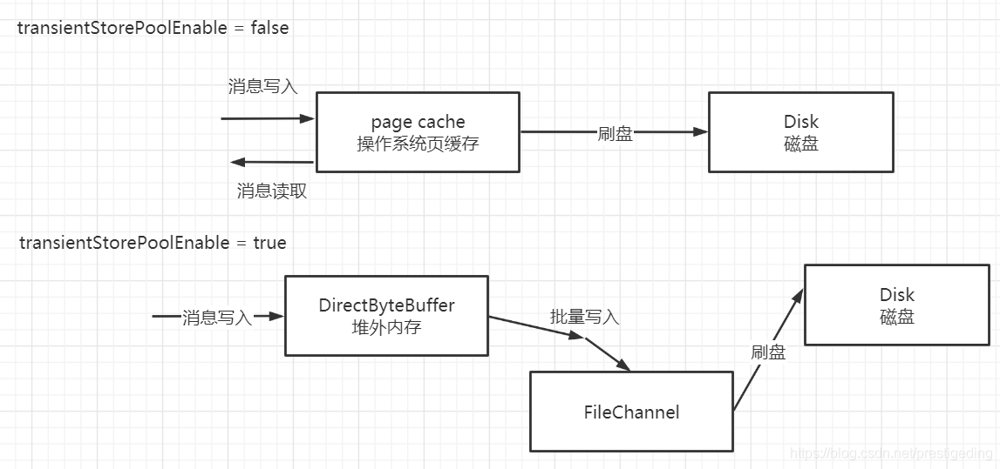

# RocketMQ vs Kafka

## 功能比较

RocketMQ 业务功能更为丰富

- 延时消息

- 广播消息

- 基于 tag 和 sql 服务端过滤

- 消息追踪

- 可视化运维

## 性能比较

### 文件布局

kafka 文件布局及副本同步:

RocketMQ 文件布局及副本同步

Kafka 属于多文件写入，在多topic，多分区的高并发写入场景，可能随机 IO 占比较大；

Rocketmq 属于严格单文件顺序写，但是在 SSD 和 RAID 磁盘阵列这类可以并行写的磁盘上，单文件写入反而无法充分利用磁盘IO的性能

### 数据写入方式

Kafka 使用 FileChannel 的 transferTo 写入，底层使用的是 sendfile 系统调用，即实现所谓的 零拷贝

RocketMQ 的消息写入支持 内存映射 与 FileChannel 写入两种方式

> 但 RocketMQ 基于 FileChannel 写入时调用的 API 却并不是 transferTo，而是先调用 writer，然后定时 flush 刷写到磁盘  
> 这是因为 RocketMQ 需要消息进行编码，但 Kafka 的消息编码是在发送端客户完成的，所以可以直接 transfer 写入文件

### 消息发送方式

Kafka 在消息发送客户端采用了一个双端队列，引入了批处理思想，并可通过 batch.size 和 linger.ms 两个参数平衡吞吐量和延迟

Rocketmq 没有消息批次的概念，而且消息会在服务端进行编码成存储格式再持久化，占用服务端 CPU

### 总结

从上面的对比来看，Kafka 在性能上综合表现确实要比 RocketMQ 更加的优秀，实践也证明了这一点

> 经验数据: Kafka TPS 比 RocketMQ 高一个数量级

## 选择

Rocketmq 业务功能更为丰富，业务应用优先选择 Rocketmq；

Kafka 吞吐量更优，大数据、日志场景优先使用；且延迟也不差，社区更为活跃，问题解决方案更多，在 Rocketmq 基础设施不够完善的情况下，业务应用也可选择 Kafka

## References

- [Kafka 和 Rocketmq 性能对比](https://blog.csdn.net/prestigeding/article/details/110408415)