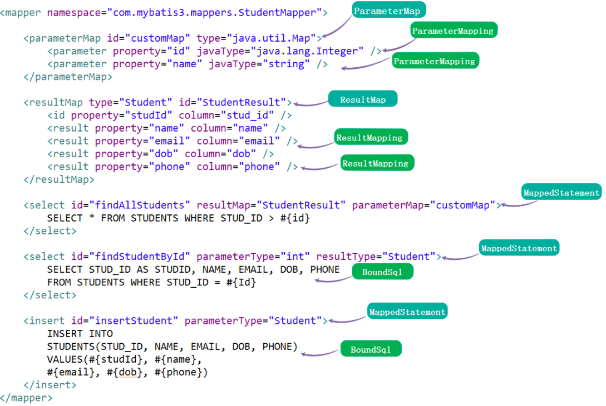

# Mybatis 源码解读

Mybatis 是一个开源的 ORM 框架，它简化了 Java 应用程序中数据库访问的实现

> Mybatis 属于半自动 ORM，需要自行配置对象、sql、表字段之间的关系。而 `Hibernate` 才是全自动 ORM 框架

本文用于记录 Mybatis 源码的关键部分，避免遗忘，方便后续快速阅读 Mybatis 源码

## Mybatis 的基本用法

```java
// 指定 Configuration 配置，包括 mapper 配置
String resource = "mybatis-config.xml";
InputStream inputStream = Resources.getResourceAsStream(resource);

// 生成 SqlSession 对象
SQLSessionFactory sqlSessionFactory = new SqlSessionFactoryBuilder().build(inputStream);
SqlSession sqlSession = sqlSessionFactory.openSession();

// 生成 StudentMapper 动态代理，真正的执行动作由 SqlSession 完成
StudentMapper studentMapper = sqlSession.getMapper(StudentMapper.class);
System.out.println(studentMapper.findAllStudents());
```

`mybatis-config.xml`

```xml
<?xml version="1.0" encoding="UTF-8"?>
<!DOCTYPE configuration PUBLIC "-//mybatis.org//DTD Config 3.0//EN" "http://mybatis.org/dtd/mybatis-3-config.dtd">
<configuration>
	<properties resource="jdbc.properties">
		<property name="username" value="root" />
		<property name="password" value="123" />
	</properties>
	<settings>
		<setting name="localCacheScope" value="STATEMENT"/>
		<setting name="cacheEnabled" value="false" />
		<setting name="lazyLoadingEnabled" value="true" />
		<setting name="multipleResultSetsEnabled" value="true" />
		<setting name="useColumnLabel" value="true" />
		<setting name="useGeneratedKeys" value="false" />
		<setting name="defaultExecutorType" value="REUSE" />
		<setting name="defaultStatementTimeout" value="25000" />
	</settings>
	<typeAliases>
		<typeAlias alias="Student" type="com.mybatis3.domain.Student" />
		<typeAlias alias="Teacher" type="com.mybatis3.domain.Teacher" />
	</typeAliases>
	<typeHandlers>
		<typeHandler handler="com.mybatis3.typehandlers.PhoneTypeHandler" />
	</typeHandlers>
	<environments default="development">
		<environment id="development">
			<transactionManager type="JDBC" />
			<dataSource type="POOLED">
				<property name="driver" value="${driver}" />
				<property name="url" value="${url}" />
				<property name="username" value="${username}" />
				<property name="password" value="${password}" />
			</dataSource>
		</environment>
	</environments>
	<mappers>
		<mapper resource="com/mybatis3/mappers/StudentMapper.xml" />
		<mapper resource="com/mybatis3/mappers/TeacherMapper.xml" />
	</mappers>
</configuration>
```

`StudentMapper.xml`



## Mybatis SQL 的执行流程图


## 关键类

### `SqlSession`

> `CURD` 的入口

```java
public interface SqlSession extends Closeable {
    <T> T selectOne(String var1);
    <T> T selectOne(String var1, Object var2);
    <E> List<E> selectList(String var1);
    <E> List<E> selectList(String var1, Object var2);
    <E> List<E> selectList(String var1, Object var2, RowBounds var3);
    <K, V> Map<K, V> selectMap(String var1, String var2);
    <K, V> Map<K, V> selectMap(String var1, Object var2, String var3);
    <K, V> Map<K, V> selectMap(String var1, Object var2, String var3, RowBounds var4);
    void select(String var1, Object var2, ResultHandler var3);
    void select(String var1, ResultHandler var2);
    void select(String var1, Object var2, RowBounds var3, ResultHandler var4);
    int insert(String var1);
    int insert(String var1, Object var2);
    int update(String var1);
    int update(String var1, Object var2);
    int delete(String var1);
    int delete(String var1, Object var2);
    void commit();
    void commit(boolean var1);
    void rollback();
    void rollback(boolean var1);
    List<BatchResult> flushStatements();
    void close();
    void clearCache();
    Configuration getConfiguration();
    <T> T getMapper(Class<T> var1);
    Connection getConnection();
}
```

### `Executor`

> `SqlSession` 的委托对象


### `Configuration`

> All-in-One 对象，Mybatis 数据集合，Mybatis 的初始化过程，就是组装 Configuration 的过程


### `XMLConfigBuilder`

> `mybatis-config.xml` 文件的解析类，解析成 `Configuration` 类

解析标签：

- properties
- settings
- typeAliases
- plugins
- objectFactory
- objectWrapperFactory
- reflectorFactory
- environments
- databaseIdProvider
- typeHandlers
- mapper(详见 `XMLMapperBuilder`)

### `XMLMapperBuilder`

> `xxMapper.xml` 文件的解析类

解析标签

- parameterMap -> `ParameterMap`

    

- resultMap -> `ResultMap`

    

- select|insert|update|delete -> `MappedStatement`

    

- sql -> `Map<String, XNode> sqlFragments`

    1. 解析节点

    ```xml
    <select id="countAll" resultType="int">
		select count(1) from (
			<include refid="studentProperties"></include>
		) tmp
	</select>
    ```

    2. include 节点替换为 sqlFragment 节点

    ```xml
    <select id="countAll" resultType="int">
		select count(1) from (
				<sql id="studentProperties">
					select 
						stud_id as studId
						, name, email
						, dob
						, phone
					from students
				</sql>
		) tmp
	</select>
    ```

    3. 将 sqlFragment 的子节点（文本节点）insert 到 sqlFragment 节点的前面。注意，对于dom来说，文本也是一个节点，叫 TextNode。

    ```xml
    <select id="countAll" resultType="int">
		select count(1) from (
				select 
						stud_id as studId
						, name, email
						, dob
						, phone
					from students
				<sql id="studentProperties">
					select 
						stud_id as studId
						, name, email
						, dob
						, phone
					from students
				</sql>
		) tmp
	</select>
    ```

    4. 移除 sqlFragment 节点

    ```xml
    <select id="countAll" resultType="int">
		select count(1) from (
				select 
						stud_id as studId
						, name, email
						, dob
						, phone
					from students
		) tmp
	</select>
    ```


## References

- [Mybatis 3.4.x 技术内幕](https://my.oschina.net/zudajun?tab=newest&catalogId=3532897)
- [Quick Guide to MyBatis](https://www.baeldung.com/mybatis)
- [MyBatis with Spring](https://www.baeldung.com/spring-mybatis)
- [使用MyBatis简化枚举类值的存储和读取](https://segmentfault.com/a/1190000012564028)
- [官方文档](https://mybatis.org/mybatis-3/zh/index.html)