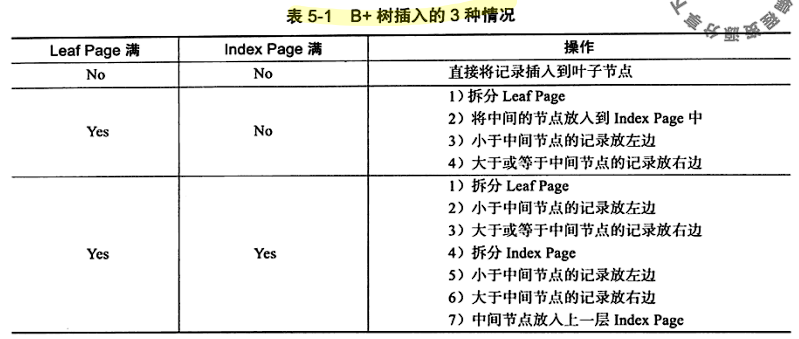
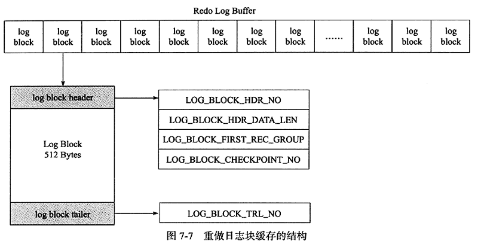
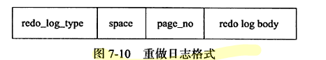
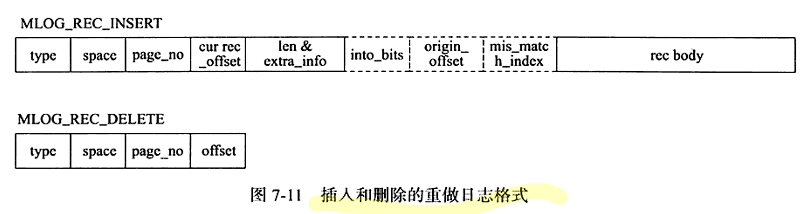
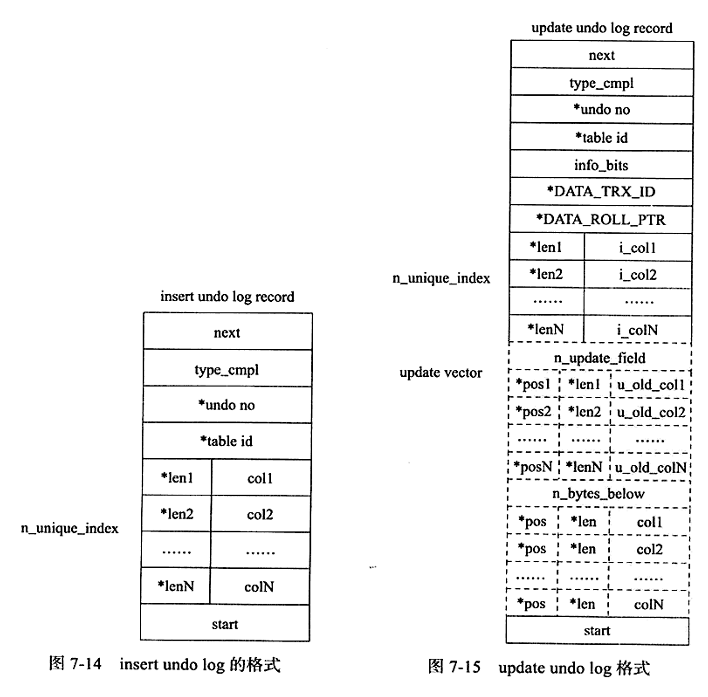
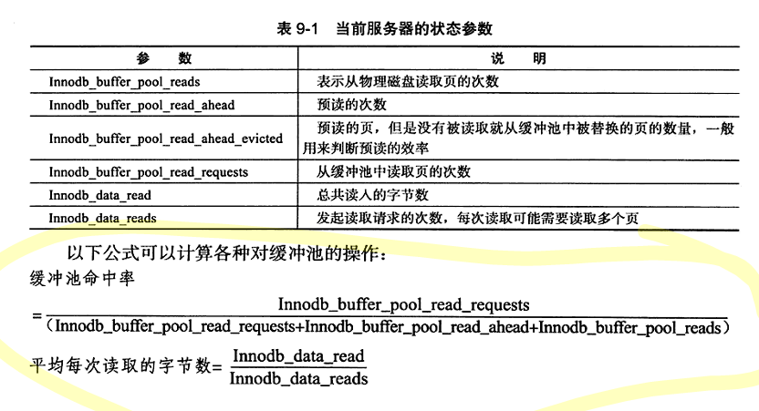

# MySQL 技术内幕--InnoDB 存储引擎

## MySQL 体系结构和存储引擎

### 定义数据库和实例

数据库：物理操作系统文件或其他形式文件类型的集合。在MySQL数据库中，数据库文件可以是 frm、MYD、MYI、ibd结尾的文件。

实例：MySQL 数据库由后台线程以及一个共享内存区组成。

从概念上来说，数据库是文件的集合，是依照某种数据模型组织起来并存放于二级存储器中的数据集合；数据库实例是程序，是位于用户和操作系统之间的一层数据管理软件，用户对数据库数据的任何操作，包括数据库定义、数据查询、数据维护、数据库运行控制等都是在数据库实例下进行的，应用程序只能通过数据库实例才能和数据库打交道。

MySQL 被设计为一个单进程多线程架构的数据库。也就是说 MySQL 数据库实例在系统上的表现就是一个进程。

```bash
# 启动 mysql 进程
./mysqld_safe &
# 查看 mysql 进程
ps -ef | grep mysqld
# 查看当 mysql 数据库实例启动时，会在哪些位置查找配置文件。
# Linux 中默认中 /etc/my.cnf -> /etc/mysql/my.cnf -> /usr/local/mysql/etc/my.cnf -> ~/my.cnf
# 如果多个配置文件存在同一个参数，后者会覆盖前者
mysql --help | grep my.cnf
```

配置文件中有一个参数 `datadir`，该参数指定了数据库所在的路径。Linux 中默认是 `/usr/local/mysql/data/`

```bash
mysql> show variables like 'datadiar' \G;
mysql> system ls-lh /usr/local/mysql/data
```

### MySQL 体系结构


### MySQL 存储引擎

MySQL 数据库区别于其它数据库的最重要的一个特点就是其插件式的表存储引擎。

!> 存储引擎是基于表的，而不是数据库。也就是说不同的表可以选择不同的存储引擎。

> 可以通过 `SHOW ENGINES` 语句查看当前使用的 MySQL 数据库所支持的存储引擎，也可以通过查询 `information_schema.engines` 表

InnoDB 存储引擎将数据放在一个逻辑的表空间中，这个表空间就想黑盒一样由 InnoDB 存储引擎自身进行管理。从 MySQL 4.1 版本开始，可以将每个表存放到独立的 `ibd` 文件中。

InnoDB 通过使用多版本并发控制（MVCC）来获得高并发性，并且实现了 SQL 标准的 4 种隔离级别，默认为 REPEATABLE 级别。同时，使用一种被称为 next-key locking 的策略来避免幻读现象的产生。除此之外，InnoDB 存储引擎还提供了插入缓冲（insert buffer），二次写（double write），自适应哈希索引（adaptive hash index），预读（read ahead）等高性能和高可用的功能。

### 连接 MySQL

常用的进程通信方式有管道、命名管道、TCP/IP套接字、UNIX域套接字。

#### TCP/IP

在通过 TCP/IP 连接时，MySQL 数据库会先检查一张权限视图，用来判断发起请求的客户端IP是否允许连接到 MySQL 实例。

`select host,user,passwork from mysql.user;`

#### 命名管道和共享内存

配置文件中启用 `--enable-named-pipe`

配置文件中启用 `--shared-memory`, 同时 MySQL 客户端还必须使用 `protocol=memory`

#### UNIX 域套接字

可以在配置文件中指定套接字文件的路径，如 `--socket=/tmp/mysql.sock`

查看 UNIX 域套接字文件路径：`show variables like 'socket';`

## InnoDB 存储引擎

### 版本


```sql
# 查看 mysql 版本
SELECT VERSION();
# 查看 inndob 版本
SHOW VARIABLES LIKE 'innodb_version'\G;
```

### InnoDB 体系结构


#### 后台线程

主要作用是负责刷新内存池中的数据，保证缓冲池中的内存缓存的是最近的数据。此外将已修改的数据文件刷新到磁盘文件，同时保证在数据库发生异常的情况下 InnoDB 能恢复到正常运行状态。

- Master Thread：非常核心的后台线程，主要负责将缓冲池中的数据异步刷新到磁盘中，保证数据的一致性，包括脏页的刷新（1.2版本后由Page Cleaner Thread 处理）、合并插入缓冲（INSERT BUFFER）、UNDO 页的回收（1.1版本后由Purge Thread处理）。
- IO Thread：负责 AIO 请求的回调处理。有4个种类（write、read、insert buffer、log IO thread）

    ```sql
    # 查看 read、write IO Thread 数量
    SHOW VARIABLES LIKE 'innodb_%io_threads'\G
    # 观察 IO Thread 
    SHOW ENGINE INNODB STATUS\G
    ```
- Purge Thread：回收已经使用并分配的 undo 页。

    ```sql
    SHOW VARIABLES LIKE 'innodb_purge_threads'\G
    ```

- Page Cleaner Thread: 刷新脏页

#### 内存


- 缓冲池

    简单来说就是一块内存区域，通过内存的速度来弥补磁盘速度较慢对数据库性能的影响。
    读取页时，先判断缓冲池有没有，没有再读磁盘。
    修改页时，先修改缓冲池，然后再以一定的频率刷新到磁盘上。（Checkpoint 机制）

    > 默认页大小是 16KB

    ```sql
    # 查看缓冲池大小
    SHOW VARIABLES LIKE 'innodb_buffer_pool_size'\G
    # 1.0.x 版本开始，为了减少资源竞争、增加并发处理能力，允许有多个缓冲池实例。每个页根据哈希值平均分配到不同缓冲池实例中。
    # 查看缓冲池实例数量
    SHOW VARIABLES LIKE 'innodb_buffer_pool_instances'\G

    # 查看缓冲池状态，
    SHOW ENGINE INNODB STATUS \G
    # 或者
    SELECT POOL_ID,POOL_SIZE,FREE_BUFFERS,DATABASE_PAGES FROM information_schema.INNODB_BUFFER_POOL_STATS\G
    ```

    缓冲池中的页通过 LRU 算法管理。并对传统的 LRU 算法做了一点优化：新读取的页并不是放到首部，而是放在 midpoint 位置。midpoint 之前的部分称为 new 列表，midpoint 之后的部分称为 old 列表。新读取的页需要在old列表中存活一段时间才能加入new部分（这个动作称为 page made young，如果最后没有加入，则称为 page not made young）。

    ```sql
    # 查看 midpoint 值，单位是 %。（距离尾部的百分比）。如果预估热点数据较多，可以把这个值调小一点。
    SHOW VARIABLES LIKE 'innodb_old_blocks_pct'\G
    # 新读取的页加入 new 列表的等待时间
    SHOW VARIABLES LIKE 'innodb_old_blocks_time'\G

    # 查看缓冲池状态，主要关心缓冲命中率指标（Buffer pool hit rate） ，通常该值不应该小于 95%，否则就要看看是否是由于全表扫描引起的 LRU 列表被污染的问题
    SHOW ENGINE INNODB STATUS \G
    # 或者
    SELECT POOL_ID,HIT_RATE,PAGES_MADE_YOUNG,PAGES_NOT_MADE_YOUNG FROM information_schema.INNODB_BUFFER_POOL_STATS\G

    # 观察每个LRU列表中每个页的具体信息
    SELECT TABLE_NAME,SPACE,PAGE_NUMBER,PAGE_TYPE FROM information_schema.INNODB_BUFFER_PAGE_LRU WHERE SPACE = 1;
    ```

- 重做日志缓冲

    一般不需要设置得很大，因为一般情况下每一秒会将重做日志缓冲刷新到日志文件，只需要保证每秒产生的事务量在这个缓冲大小之内即可。(通常 8MB 就够了)

    重做日志刷到磁盘的三种情况:
    1. Master Thread 每秒刷一次
    2. 每个事务提交时
    3. 重做日志缓冲剩余空间小于 1/2 时

    ```sql
    # 重做日志缓冲大小配置
    SHOW VARIABLES LIKE 'innodb_log_buffer_size'\G
    ```

- 额外的内存池

    在对一些数据结构本身的内存进行分配时，需要从额外的内存池中进行申请。

### Checkpoint 技术

checkpint 所做的事情是将缓冲池中的脏页刷回磁盘

目的是解决以下问题：

- 缩短数据库的恢复时间
    当数据库宕机时，不需要重做所有日志，因为 checkpoint 之前的页都已经刷新会磁盘。只需要恢复checkpoint后的重做日志。
- 缓冲池不够用时，将脏页刷新到磁盘
- 重做日志不可用时，刷新脏页
    重做日志设计上是一个环形，如果不够用，需要checkpoint刷新脏页

对于 InnoDB 存储引擎而言，其是通过 LSN（Log Sequence Number）来标记版本的，而 LSN 是 8 字节的数字，其单位是字节。每个页有 LSN，重做日志中也有 LSN，Checkpoint 也有 LSN。

Checkpoint的关键在于每次刷新多少页到磁盘，每次从哪里取脏页，以及什么时间触发 Checkpoint。

数据库关闭时默认会将所有脏页都刷新会磁盘。

运行时都只刷新一部分脏页，有以下几种 Checkpoint

- Master Thread Checkpoint
    每秒或者每十秒的频率
- FLUSH_LRU_LIST Checkpoint
    需要保证 LRU 列表中有差不多 100 个空闲页可供使用，通过 `innodb_lru_scan_depth` 控制。新版本在 Page Cleaner 线程中进行，淘汰 LRU 尾端的脏页。
- Async/Sync Flush Checkpoint
    重做日志文件不可用时。从脏页列表中选取。新版本在 Page Cleaner 线程中进行
- Dirty Page too much Checkpoint
    由 `innodb_max_dirty_pages_pct` 控制

### Master Thread 工作方式

InnoDB 存储引擎的主要工作都是在 Master Thread 中完成的

#### InnoDB 1.0.x 版本之前

Master Thread 具有最高的线程优先级。其内部由多个循环组成：主循环（loop），后台循环（backgroup loop），刷新循环（flush loop），暂停循环（suspend loop）。Master Thread 会根据数据库运行的状态在这几个循环中进行切换。

大多数操作都在 loop 中，其中有两大部分：每秒的操作和每十秒的操作

每秒的操作：
- 日志缓冲刷新会磁盘，即使这个事务还没有提交（总是）
- 合并插入缓冲（可能）
- 至多刷新100个InnoDB的缓冲池中的脏页到磁盘（可能）
- 如果当前没有用户活动，则切换到 backgroup loop（可能）

每十秒的操作：
- 刷新 100 个脏页到磁盘（可能）
- 合并至多5个插入缓冲（总是）
- 将日志缓冲刷新到磁盘（总是）
- 删除无用的 Undo 页（总是）
- 刷新 100 个或者 10 个脏页到磁盘（总是）

backgroup loop（没有用户活动或者数据关闭会切到该循环）:

- 删除无用的 Undo 页（总是）
- 合并 20 个插入缓冲（总是）
- 跳回到主循环（总是）
- 不断刷新 100 个页知道符合条件（可能，跳转到 flush loop 中完成）

若 flush loop 中也没有什么事情可以做了，InnoDB 存储引擎会切换到 suspend loop，将 Master Thread 挂起。

Master Thread 的伪代码：

```c
void master_thread() {
    goto loop;
loop:
    for (int i = 0; i < 10; i++) {
        thread_sleep(1)
        do log buffer flush to disk
        if (last_one_second_ios < 5) {
            do merge at most 5 insert buffer
        }
        if (buf_get_modified_ratio_pct > innodb_max_dirty_pages_pct) {
            do buffer pool flush 100 dirty page
        }
        if (no user activity) {
            goto backgroup loop
        }
    }
    if (last_ten_second_ios < 200) {
        do buffer pool flush 100 dirty page
    }
    do merge at most 5 insert buffer
    do log buffer flush to disk
    do full purge
    if (buf_get_modified_ratio_pct > 70%) {
        do buffer pool flush 100 dirty page
    } else {
        buffer pool flush 10 dirty page
    }
    goto loop;
backgroup loop:
    do full purge
    do merge 20 insert buffer
    if not idle:
        goto loop;
    else
        goto flush loop;
flush loop:
    do buffer pool flush 100 dirty page
    if (buf_get_modified_ratio_pct > innodb_max_dirty_pages_pct) {
        goto flush loop
    }
    goto suspend loop
suspend loop:
    suspend_thread()
    waiting event
    goto loop;
}
```

#### InnoDB 1.2.x 版本之前

1.0.x 版本之前对于脏页的刷新个数做了很多硬编码，不适合 SSD。

1.0.x 版本提供了参数 innodb_io_capacity，用来表示磁盘 IO 的吞吐量，默认值为 200。对于刷新到磁盘脏页的数量，规则如下：

- 合并插入缓冲数量为 innodb_io_capacity 的 5%
- 刷新脏页的数量为 innodb_io_capacity

1.0.x 版本 innodb_max_dirty_pages_pct 默认值从 90% 改成 75%

添加 innodb_purge_batch_size 控制每次 full purge 回收的 Undo 页数量，默认是 20

#### InnoDB 1.2.x 版本

伪代码：

```c
if InnoDB is idle
    srv_master_do_idle_tasks();
else
    srv_master_do_active_tasks();
```

其中 `srv_master_do_idle_tasks()` 就是之前版本中每10秒的操作，`srv_master_do_active_tasks()` 处理的是之前每秒中的操作。同时对于刷新脏页的操作，从 Master Thread 线程分离到一个单独的 Page Cleaner Thread，从而减轻了 Master Thread 的工作，同时进一步提高了系统的并发性。

### InnoDB 关键特性

#### 插入缓冲（Insert Buffer）

由于聚集索引的特性，对于非聚集索引的插入或者更新往往都是随机的

对于非聚集索引的插入或更新操作，不是每一次直接插入到索引页中，而是先判断插入的非聚集索引页是否在缓冲池中，若在，则直接插入；若不在，则先放入到一个 Insert Buffer 对象中。然后再以一定的频率和情况进行 Insert Buffer 和辅助索引页子节点的 merge 操作，这是通常能将多个插入合并到一个操作中（因为在一个索引页中），这就大大提供了对于非聚集索引插入的性能。

Insert Buffer 的使用需要同时满足以下两个条件：

- 索引是辅助索引
- 索引不是唯一索引

通过 `SHOW ENGINE INNODB STATUS \G` 的 merged recs（插入记录数） 和 merges(合并次数) 指标，（1- merges / merged recs） 可以得到减少的IO次数。

目前 Insert Buffer 存在一个问题是：在写密集的情况下，插入缓冲占用过多的缓冲池内存，默认最大可以占到 1/2 的缓冲池内存。

1.0.x 引入了 `Change Buffer`, 可以视为 Insert Buffer 的升级：对 INSERT、DELETE、UPDATE 都进行缓冲，分别是 Insert Buffer、Delete Buffer、Purge buffer。

Change Buffer 的适用对象依然是非唯一的辅助索引

1.2.x 版本，可以通过 innodb_change_buffer_max_size 控制 Change Buffer 最大适用内存的数量

Insert Buffer 的数据结构是一颗 B+ 树。全局只有一棵 Insert Buffer B+ 树，存放在共享表空间中，默认就是 ibdata1 中。


在 InnoDB 引擎中，每个表有一个唯一的 space_id。marker 用来兼容老版本的 insert buffer。offset 表示页所在的偏移量


Merge Insert Buffer 的操作可能发生在以下几种情况下：

- 辅助索引页被读取到缓冲池时
- Insert Buffer Bitmap 也追踪到该辅助索引页已无可用空间时
- Master Thread

#### 两次写（Double Write）

如果说 Insert Buffer 带给 InnoDB 存储引擎的是性能上的提升，那么 doublewrite 带来就是数据页的可靠性

16KB 的页，只写了前 4 KB，之后发生了宕机，被称为部分写失效。

> 重做日志中只记录了对页中的某个位置的修改，无法恢复整个页


脏页刷新时先 memcpy 到内存的 doublewrite buffer，然后写入共享表空间文件（fsync），然后再写入各表空间文件中（部分失效就用共享表空间来恢复）

```sql
# 查看 doublewrite 运行情况
SHOW GLOBAL STATUS LIKE 'innodb_dblwr%'\G
```

#### 自适应哈希索引（Adaptive Hash Index）

hash 时间复杂度为 O(1)，一般只需要一次查询

在生产环境中，B+ 树的高度一般为 3~4 层，故需要 3~4 次查询

InnoDB 存储引擎会监控对表上各索引页的查询。如果观察到建立哈希索引可以带来速度的提升，则建立哈希索引，称之为自适应哈希索引。

AHI 只能用来搜索等值的查询，而且需要查询的条件一样

可以通过观察 `SHOW ENGINE INNODB STATUS` 的结果及参数 `innodb_adaptive_hash_index` 来考虑是禁用或启动此特性

#### 异步 IO（Async IO）

AIO 的一个优势是可以进行 IO Merge 操作

参数 `innodb_user_native_aio` 用来控制是否启用 Native AIO，在 Linux 下默认启用

#### 刷新邻接页（Flush Neightbor Page）

当刷新一个脏页时，检测该页所在区（extent）的所有页，如果是脏页，那么一起进行刷新。

通过参数 `innodb_flush_neighbors` 控制。机械硬盘建议启用，固态硬盘建议关闭

### 启动、关闭与恢复

在关闭时，参数 `innodb_fast_shutdown` 影响行为

- 0。完成所有的 full purge、merge insert buffer、脏页刷新
- 1。默认值。数据脏页刷新
- 2。只将日志写入日志文件

参数 `innodb_force_recovery` 影响启动时的恢复，默认为 0(完成所有恢复)

## 文件

### 参数文件

告诉 MySQL 实例启动时在哪里可以找到数据库文件，并且指定某些初始化参数，这些参数定义了某种内存结构的大小等设置，还会介绍各种参数的类型。

参数文件可以通过 `mysql --help | grep my.cnf` 来寻找

MySQL 实例可以不需要参数文件，因为有默认值

参数可以理解为一个键/值对。可以通过命令 `SHOW VARIABLES` 查看数据库中的所有参数，也可以通过 LIKE 来过滤参数名。还可以通过 information_schema 架构下的 `GLOBAL_VARIALBES` 视图来进行查找。还可以用 `SELECT @@var_name` 来查看。

参数可以分为两大类：

- 动态类型：可以在运行时修改。可以通过 set 命令修改
    ```sql
    # global 和 session 表明该修改是基于当前会话还是整个实例的生命周期
    SET {global | session} system_var_name = expr
    # 或者
    SET {@@global. | @@session. | @@}system_var_name = expr
    ```
    若想在数据库实例下次启动该参数修改还能生效，就只能改参数文件了
- 静态类型
    运行时只读。修改会报错

### 日志文件

#### 错误日志（error log）

对 MySQL 的启动、运行、关闭过程进行了记录。

```sql
SHOW VARIABLES LIKE 'log_error'\G
```

#### 慢查询日志（slow query log）

在 MySQL 启动时可以设置一个阈值(`long_query_time`)，将运行时间超过(大于)该值的所有 SQL 语句都记录到慢查询日志文件中。

```sql
# 阈值配置
SHOW VARIABLES LIKE 'long_query_time'\G
# 慢查询日志开关
SHOW VARIABLES LIKE 'log_slow_queries'\G
# 慢查询日志文件路径
SHOW VARIABLES LIKE 'slow_query_log_file'\G
# 将没有使用索引的SQL语句也记录到慢查询日志开关
SHOW VARIABLES LIKE 'log_queries_not_using_indexes'\G
# 每分钟允许记录到 slow log 的且未使用索引的 SQL 语句次数
log_throttle_queries_not_using_indexes
```

可以通过 mysqldumpslow 命令查看慢查询日志文件

```bash
mysqldumpslow xxx-slow.log

# 执行时间最长的 10 条 SQL
mysqldumpslow -s al -n 10 xxx-slow.log
```

MySQL 5.1 开始可以将慢查询的日志记录放入一张表中。位置是 `mysql.slow_log`

```sql
# 设置慢查询日志输出到表中，默认是 FILE
SET GLOBAL log_output='TABLE'

# 构建一条慢查询日志
select sleep(10)\G

# 查询慢查询日志
select * from mysql.slow_log\G
```

#### 查询日志（log）

记录了所有对 MySQL 数据库请求的信息，无论这些请求是否得到了正确的执行。默认文件名为：主机名.log

MySQL 5.1 开始可以放入一张表中(`mysql.general_log`)

```sql
# 查询日志开关
SHOW VARIABLES LIKE 'general_log'\G
# 查询日志位置
SHOW VARIABLES LIKE 'general_log_file'\G

# 设置查询日志输出到表中，默认是 FILE
SET GLOBAL log_output='TABLE'
# 查询慢查询日志
select * from mysql.general_log\G
```

#### 二进制日志（binlog）

记录了对 MySQL 数据库执行更改的所有操作，但是不包括 SELECT 和 SHOW 这类操作。

```sql
# 执行修改操作
UPDATE t SET a = 1 WHERE a = 2;
# 查看当前的binlog文件名
SHOW MASTER STATUS\G
# 查看binlog事件
SHOW BINLOG EVENTS IN 'mysql.000008'\G
```

二进制日志主要有以下的作用：

- 恢复
- 复制
- 审计

通过配置参数`log-bin[=name]`可以启动二进制日志。如果不指定 name，则默认二进制日志文件名为主机名，后缀名为二进制日志的序列号，所在路径为数据目录(datadir).

xxx.index 为二进制的索引文件，用来存储过往产生的二进制日志序号

二进制日志的相关参数:

- max_binlog_size: 单个二进制日志文件最大值，默认是 1G
- binlog_cache_size：所有未提交的事务的二进制日志会被记录到一个缓冲中，默认为 32k，基于会话的。通过 show global status 查看 binlog_cache_use, binlog_cache_disk_use 的状态来判断当前大小是否合适
- sync_binlog： 二进制日志并不是在每次写的时候同步到磁盘。每写多少次缓冲就同步到磁盘。
- binlog-do-db：需要写入哪些库的日志
- binlog-ignore-db：需要忽略哪些库的日志
- log-slave-update：slave 默认不会将 master 的二进制日志写入到自己的二进制日志。如果需要，则设置该参数
- binlog_format：
    - `STATEMENT`: 记录逻辑SQL语句。遇到rand，uuid等函数会导致数据的不一致
    - `ROW`：记录表的行更改情况。缺点是数据量大
    - `MIXED`：默认采用 STATEMENT，某些情况使用 ROW

    在通常情况下，设置为 ROW，可以为数据库的恢复和复制带来更好的可靠性。


查看二进制文件的内容

```bash
mysqlbinlog --start-position=203 test.000004
# ROW 模式，需要加上 -vv
mysqlbinlog -vv --start-position=203 test.000004
```

### 套接字文件

```sql
SHOW VARIABLES LIKE 'socket'\G
```

### pid 文件

```sql
SHOW VARIABLES LIKE 'pid_file'\G
```

### 表结构定义文件

MySQL 数据的存储是根据表进行的，每个表都会有与之对应的文件。`frm` 为后缀名的文件记录了表的结构定义。

### InnoDB 存储引擎文件

之前介绍的文件都是 MySQL 数据库本身的文件，和存储引擎无关

#### 表空间文件

InnoDB 采用将存储的数据按表空间进行存放的设计。默认的表空间文件名为 ibdata1，通过 `innodb_data_file_path` 参数设置该文件的路径和数量

```cnf
[mysqld]
innodb_data_file_path=/db/ibdata1:2000M;/dr2/db/ibdata2:2000M:autoextend
```

默认所有表的数据都会记录到该共享表空间中。若设置了参数 `innodb_file_per_table`，则每个表产生一个独立表空间。独立表空间的命名规则为：表名.ibd。

这些单独的表空间文件劲存储该表的数据、索引和插入缓冲 BITMAP 等信息，其余信息还是存放在默认的表空间中.


#### 重做日志文件

默认情况下，数据目录下会有两个名为 ib_logfile0 和 ib_logfile1 的文件。

每个 InnoDB 存储引擎至少有1个重做日志文件组，每个文件组至少有2个重做文件。日志文件组中以循环写入的方式运行，例如先写文件1，满了再写文件2，满了再写文件1.

影响重做日志文件的参数：

- innodb_log_file_size
- innodb_log_files_in_group
- innodb_mirrored_log_groups
- innodb_log_group_home_dir

和二进制日志的区别

1. 二进制日志记录MySQL数据库所有有关的日志记录，包括各种存储引擎的日志。InnoDB重做日志只记录本存储引擎的事务日志
2. 无论是哪种格式，二进制日志记录的都是逻辑日志。重做日志记录的是关于每个页的更改的物理情况
3. 二进制日志仅在事务提交前进行提交。重做日志在事务进行中也在不断得写入


## 表

### 索引组织表

在 InnoDB 存储引擎中，表都是根据主键顺序组织存放的，这种存储方式的表称为索引组织表。

如果在创建表时没有显式地定义主键，则会按如下方式选择或创建主键：

- 如果表中有非空的唯一索引，则该列即为主键。如果有多个，则选择建表时第一个定义的
- 如果没有，则自动创建一个6字节大小的指针

可以通过 `_rowid` 显式表的主键，不过这种方式只能用于查看单个列为主键的情况

### InnoDB 逻辑存储结构


#### 表空间

默认情况下数据都在共享表空间 ibdata1.

如果启用了 innodb_file_per_table 参数，每张表内的数据可以单独放到一个表空间内，但是这些表空间存放的只是数据、索引和插入缓冲 Bitmap 页，其它数据，如 undo 信息，插入缓冲索引页、系统事务信息、二次写缓冲等还是存放在原理的共享表中。

#### 段

表空间是由各个段组成的，常见的段有数据段、索引段、回滚段等。

数据段是 B+ 树的叶子节点，索引段是 B+ 树的非叶子节点。

#### 区

区是由连续页组成的空间，在任何情况下每个区的大小都为 1MB。在默认情况下，InnoDB 存储引擎页的大小为 16KB，即一个区中一共有 64 个连续的页。页可以通过 KYE_BLOCK_SIZE 参数来压缩，或者通过 innodb_page_size 来修改大小，但是区的大小总是 1M。

在用户启动了参数 innodb_file_per_table 后，创建的表默认大小是96KB。区的大小总是 1M，那么表空间至少是 1MB 才对。其实这是因为在每个段开始时，先用32个页大小的碎片页（fragment page）来存放数据，在使用完这些页之后才是区的申请。

#### 页

页 是 InnoDB 磁盘管理的最小单位。默认大小是 16KB，可以通过参数 innodb_page_size 修改，若设置完成，则所有表中页的大小都为 innodb_page_size ，不可以对其再次进行修改，除非通过 mysqldump 导入和导出操作来产生新的库。

常见的页类型：

- 数据页（B-tree Node）
- undo 页（undo Log Page）
- 系统页（System Page）
- 事务数据页（Transaction system Page）
- 插入缓冲位图页（Insert Buffer Bitmap）
- 插入缓冲空闲列表页（Insert Buffer Free List）
- 未压缩的二进制大对象页（Uncompressed BLOB Page）
- 压缩的二进制大对象页（compressed BLOB Page）

#### 行

InnoDB 数据是按行进行存放的。每个页存放的行记录也是有硬性定义的，最多允许存放 16KB/2 - 200 行的记录，即 79992 行。

### InnoDB 行记录格式

```sql
# 查看表的行记录格式，Row_format 字段
show table status like 'mytest'\G
```

InnoDB 1.0.x 版本之前，InnoDB 存储引擎提供了 `Compact` 和 `Redundant`（兼容更老版本） 两种格式来存放行记录数据。

#### Compact 行记录格式


变长字段长度列表：记录非 NULL 的变长字段的长度的列表，且是按照列的顺序逆向放置的。

大于 255 的用两个字节，小于等于255的用一个字节。变长字段的长度最大不可以超过 2 字节，因此 VARCHAR类型的最大长度限制为 65535.

NULL 标志位：用二进制位的方式表示某行数据是否为 NULL。

记录头信息：


接下来就是列数据，除了用户定义的列外，还有两个隐藏列，事务ID列和回滚指针列，分别为6字节和7字节大小。若 InnoDB 表没有定义主键，每行还会增加一个6字节的 rowid 列。

比如一个表

```sql
CREATE TABLE mytest (
    t1 VARCHAR(10),
    t2 VARCHAR(10),
    t3 CHAR(10),
    t4 VARCHAR(10)
) ENGINE=INNODB CHARSET=LATIN1 ROW_FORMAT=COMPACT;
INSERT INTO mytest VALUES ('a', 'bb', 'bb', 'ccc');
INSERT INTO mytest VALUES ('d', NULL, NULL, 'fff');
```

通过 `hexdump -c -v mytest.ibd` 可以看到第一行数据：

   


第二行数据：


不管是 CHAR 类型还是 VARCHAR 类型，在 compact 格式下 NULL 值都不占用任何存储空间

#### Redundant 行记录格式


NULL 的 CHAR 类型在 Redundant 行记录格式需要占用空间。

#### 行溢出数据

MySQL 官方手册中定义的 VARCHAR 类型最大支持 65535，单位是字节。由于其它开销，真实只允许 65532，也就说在 latin1 编码下是 65532，在 GBK 编码下是 32767， 在 UTF8 编码下是 21845。

另外，65535 长度限制是指所有 VARCHAR 列的长度总和，如果列的长度总和超过了这个长度，依然无法创建。

InnoDB 存储引擎的页为 16KB，即 16384 字节，怎么能存放 65532 字节呢？

在一般情况下，数据都是存放在页类型为 `B-tree node` 中。但是当发生行溢出时，数据存放在页类型为 `Uncompress BLOB` 页中。B-tree node 中只保存数据的前 768 字节。


那么多长会溢出呢？每个页至少应该有两条行记录。如果页中只能存放一条记录，那么就会把行数据存放在溢出页。根据实验，如果表中仅有一个varchar列，那么这个列的长度不超过 8098 就不会溢出。

对于 TEXT 或 BLOB 的数据类型，也和 VARCHAR 一样的规则：至少保证一个页能存放两条记录。

#### Compressed 和 Dynamic 行记录格式

这是新版本的行记录格式

对于存放在 BLOB 中的数据采用了完全的行溢出的方式


Compressed 行记录格式的另一个功能就是存储在其中的行数据会以 zlib 的算法进行压缩，因此对于 BLOB、TEXT、VARCHAR 这类大长度类型的数据能够进行非常有效的存储。

#### CHAR 的存储格式

对于多字节编码的 CHAR 数据类型的存储，InnoDB存储引擎在内部将其视为变成字符类型。这也意味着变成长度列表中会记录 CHAR 数据类型的长度。

CHAR 类型被明确视为了变成字符类型，但是对于未能占满长度的字符还是填充 Ox20。

### InnoDB 数据页结构


### Named File Format 机制

1.0.x 版本之前的文件格式定义为 Antelope，新版本支持的文件格式定义为 Barracuda，并且向下兼容。


```sql
# 查看mysql版本
SELECT @@version\G
# 查看 innodb 版本
SHOW VARIABLES LIKE 'innodb_version'\G
# 查看文件格式
SHOW VARIABLES LIKE 'innodb_file_format'\G
```

### 约束

#### 数据完整性

关系型数据库系统和文件系统的一个不同点是，关系数据库本身能保证存储数据的完整性，不需要应用程序的控制。

几乎所有的关系型数据库都提供了约束机制来保证数据的完整性。

数据完整性有以下三种形式：

- 实体完整性保证表中有一个主键
- 域完整性保证数据每列的值满足特定的条件。
    - 选择合适的数据类型
    - 外键约束
    - 编写触发器
    - DEFAULT
- 参照完整性保证两张表之间的关系。
    - 外键

对于 InnoDB 存储引擎本身而言，提供了以下几种约束：

- Primary Key
- Unique Key
- Foreign Key
- Default
- NOT NULL

#### 约束的创建和查找

约束的创建可以采用以下两种方式：

- 表创建时就进行约束定义
- 利用 ALTER TABLE 命令来进行创建约束

```sql
create table u (
    id INT,
    name VARCHAR(20),
    id_card CHAR(18),
    PRIMARY_KEY (id),
    UNIQUE KEY (name);
)

ALTER TABLE u
ADD UNIQUE KEY uk_id_card(id_card);
```

主键的约束名为 PRIMARY，唯一索引的默认约束名与列名相同。

```sql
# 查看表的约束信息
SELECT constraint_name,constraint_type FROM information_schema.TABLE_CONSTRAINTS where table_schema='mytest' and table_name = 'p'\G
# 查看库的外键信息
SELECT * FROM information_schema.REFERENTIAL_CONSTRAINTS WHERE constraint_schema='mytest'\G
```

#### 约束和索引的区别

约束是一个逻辑的概念，用来保证数据的完整性，而索引是一个数据结构，既有逻辑上的概念，在数据库中还代表着物理存储的方式。

#### 对错误数据的约束

在某些默认设置下，MySQL 数据库允许非法的或不正确的数据的插入或更新，有或者转化成一个合法的值，如向 NOT NULL 的字段插入一个 NULL 值，MySQL 数据库会将其更改为 0 再进行插入，可以通过 `show warnings\G` 查看告警。如果希望报错而不是警告，可以设置 sql_mode 为 STRICT_TRANS_TABLES.

#### ENUM 和 SET 约束

MySQL 不支持传统的 CHECK 约束，可以通过 ENUM 和 SET 类型来解决部分的约束需求。

```sql
CREATE TABLE a (
    id INT,
    sex ENUM('male', 'female')
);
```

只限于对离散数值的约束。对于连续值的范围约束或更复杂的约束，需要通过触发器来实现

#### 触发器与约束

[官方文档](https://dev.mysql.com/doc/refman/5.7/en/create-trigger.html)

触发器的作用是在执行 INSERT、DELETE、UPDATE 命令之前或之后自动调用 SQL 命令或存储过程。

```
CREATE
[DEFINER = { user | CURRENT_USER }]
TRIGGER trigger_name BEFER|AFTER INSERT|UPDATE|DELETE
ON tbl_name FOR EACH ROW trigger_stmt
```

#### 外键约束

[官方文档](https://dev.mysql.com/doc/refman/5.7/en/create-table-foreign-keys.html)

```
[CONSTRAINT [symbol]] FOREIGN KEY
    [index_name] (col_name, ...)
    REFERENCES tbl_name (col_name,...)
    [ON DELETE reference_option]
    [ON UPDATE reference_option]

reference_option:
    RESTRICT | CASCADE | SET NULL | NO ACTION | SET DEFAULT
```

在导入过程中忽视外键的检查

```sql
SET foreign_key_checks = 0;
LOAD DATA...
SET foreign_key_checks = 1;
```

### 视图

在 MySQL 数据库中，视图（view）是一个命名的虚表，它由一个 SQL 查询来定义，可以当作表使用。但是视图中的数据没有实际的物理存储。

#### 视图的作用

视图的主要用途之一是被用做一个抽象装置，在一定程度上起到一个安全层的作用。

```
CREATE
    [OR REPLACE]
    [ALGORITHM = {UNDEFINED | MERGE | TEMPTABLE}]
    [DEFINER = user]
    [SQL SECURITY { DEFINER | INVOKER }]
    VIEW view_name [(column_list)]
    AS select_statement
    [WITH [CASCADED | LOCAL] CHECK OPTION]
```

某些视图可以进行更新操作，称为可更新视图。WITH CHECK OPTION 就是针对可更新视图添加检查。

`show tables` 除了持久表，也会显示视图。

如果只想查看持久表

```sql
# 查看持久表和视图
show tables;

# 查看持久表
select * from information_schema.TABLES
where table_type = 'BASE TABLE' and table_schema=database()\G;

# 查看视图
select * from information_schema.VIEWS
where table_schema=database()\G;
```

#### 物化视图

Oracle支持物化视图，但是Mysql不支持。但是可以通过另一张表和触发器来模拟。

### 分区表

分区功能并不是在存储引擎层完成的，但是需要存储引擎的支持。

MySQL数据库至此hi的分区类型为水平分区，并不支持垂直分区。此外，MySQL的分区是局部分区索引，一个分区中既存放了数据由存放了索引。

> 水平分区将一个表不同行分配到不同的物理文件中，垂直分区将一个表的不同列分配到不同的物理文件中

> 全局分区是指数据存放在各个分区中，但是所有数据的索引放在一个对象中。

```sql
# 查看当前数据库是否启动了分区功能
show variables like '%partition%'\G;

# 或者
show plugins;
```

MySQL 支持的几种类型分区：

- RANGE 分区：行数据基于属于一个给定连续区间的列值被放入分区。
- LIST 分区：和 RANGE 分区类似，只是面向的是离散的值
- HASH 分区：根据用户自定义的表达式的返回值来进行分区，返回值不能为负数
- KEY 分区：根据 MySQL 数据库提供的哈希函数来进行分区。

不论创建何种类型的分区，如果表中存在主键或唯一索引时，分区列必须是唯一索引的一个组成部分。如果没有主键和唯一索引，可以指定任何一列为分区列。

#### 分区类型

- RANGE 分区

```sql
CREATE TABLE employees (
    id INT NOT NULL,
    fname VARCHAR(30),
    lname VARCHAR(30),
    hired DATE NOT NULL DEFAULT '1970-01-01',
    separated DATE NOT NULL DEFAULT '9999-12-31',
    job_code INT NOT NULL,
    store_id INT NOT NULL
)
PARTITION BY RANGE (store_id) (
    PARTITION p0 VALUES LESS THAN (6),
    PARTITION p1 VALUES LESS THAN (11),
    PARTITION p2 VALUES LESS THAN (16),
    PARTITION p3 VALUES LESS THAN (21)
);


# 查看分区信息
select * from information_schema.PARTITIONS where table_schema=database() AND table_name = 'employees'\G;
```

RANGE 分区主要用于日期列的分区

```sql
CREATE TABLE employees (
    id INT NOT NULL,
    fname VARCHAR(30),
    lname VARCHAR(30),
    hired DATE NOT NULL DEFAULT '1970-01-01',
    separated DATE NOT NULL DEFAULT '9999-12-31',
    job_code INT,
    store_id INT
)
PARTITION BY RANGE ( YEAR(separated) ) (
    PARTITION p0 VALUES LESS THAN (1991),
    PARTITION p1 VALUES LESS THAN (1996),
    PARTITION p2 VALUES LESS THAN (2001),
    PARTITION p3 VALUES LESS THAN MAXVALUE
);
```

- LIST 分区

```sql
CREATE TABLE employees (
    id INT NOT NULL,
    fname VARCHAR(30),
    lname VARCHAR(30),
    hired DATE NOT NULL DEFAULT '1970-01-01',
    separated DATE NOT NULL DEFAULT '9999-12-31',
    job_code INT,
    store_id INT
)
PARTITION BY LIST(store_id) (
    PARTITION pNorth VALUES IN (3,5,6,9,17),
    PARTITION pEast VALUES IN (1,2,10,11,19,20),
    PARTITION pWest VALUES IN (4,12,13,14,18),
    PARTITION pCentral VALUES IN (7,8,15,16)
);
```

- HASH 分区

```sql
CREATE TABLE employees (
    id INT NOT NULL,
    fname VARCHAR(30),
    lname VARCHAR(30),
    hired DATE NOT NULL DEFAULT '1970-01-01',
    separated DATE NOT NULL DEFAULT '9999-12-31',
    job_code INT,
    store_id INT
)
PARTITION BY HASH( YEAR(hired) )
PARTITIONS 4;
```

- KEY 分区

```sql
CREATE TABLE k1 (
    id INT NOT NULL PRIMARY KEY,
    name VARCHAR(20)
)
PARTITION BY KEY()
PARTITIONS 2;
```

- COLUMNS 分区

> RANGE、LIST、HASH、KEY 分区都要求数据必须是整型

COLUMNS 分区可以直接使用非整型的数据进行分区，可以视为 RANGE 和 LIST 的一种进化

```sql
CREATE TABLE employees_by_lname (
    id INT NOT NULL,
    fname VARCHAR(30),
    lname VARCHAR(30),
    hired DATE NOT NULL DEFAULT '1970-01-01',
    separated DATE NOT NULL DEFAULT '9999-12-31',
    job_code INT NOT NULL,
    store_id INT NOT NULL
)
PARTITION BY RANGE COLUMNS (lname)  (
    PARTITION p0 VALUES LESS THAN ('g'),
    PARTITION p1 VALUES LESS THAN ('m'),
    PARTITION p2 VALUES LESS THAN ('t'),
    PARTITION p3 VALUES LESS THAN (MAXVALUE)
);
```

```sql
CREATE TABLE customers_1 (
    first_name VARCHAR(25),
    last_name VARCHAR(25),
    street_1 VARCHAR(30),
    street_2 VARCHAR(30),
    city VARCHAR(15),
    renewal DATE
)
PARTITION BY LIST COLUMNS(city) (
    PARTITION pRegion_1 VALUES IN('Oskarshamn', 'Högsby', 'Mönsterås'),
    PARTITION pRegion_2 VALUES IN('Vimmerby', 'Hultsfred', 'Västervik'),
    PARTITION pRegion_3 VALUES IN('Nässjö', 'Eksjö', 'Vetlanda'),
    PARTITION pRegion_4 VALUES IN('Uppvidinge', 'Alvesta', 'Växjo')
);
```

#### 子分区（subpartitioning）

子分区是在分区的基础上在进行分区，也被称为复合分区（compoiste partitioning）。允许在 RANGE 和 LIST 分区上再进行 HASH 或 KEY 的子分区。

```sql
CREATE TABLE ts (id INT, purchased DATE)
    PARTITION BY RANGE( YEAR(purchased) )
    SUBPARTITION BY HASH( TO_DAYS(purchased) )
    SUBPARTITIONS 2 (
        PARTITION p0 VALUES LESS THAN (1990),
        PARTITION p1 VALUES LESS THAN (2000),
        PARTITION p2 VALUES LESS THAN MAXVALUE
    );
```

#### 分区中的 NULL 值

Mysql 数据库的分区总是视 NULL 值小于任何一个非 NULL 值，这和数据库中处理 NULL 值的 ORDERY BY 操作是一样的

RANGE 分区把 NULL 值放在最左边分区

LIST 分区必须显式指定哪个分区中放入 NULL 值

HASH 和 KEY 分区函数中 NULL 值返回 0

#### 分区和性能

对于 OLAP 的应用，分区的确是可以很好地提高查询的性能。

对于 OLTP 的应用，分区应该非常小心。对于一张大表，一般的 B+ 树需要 2-3 次的磁盘IO。因此 B+ 树可以很好地完成操作，不需要分区的帮助，并且设计不好的分区会带来严重的性能问题。

> 100W 和 1000W 行的数据本身构成的 B+ 树的层次都是一样的，可能都是 2 层。

#### 在表和分区间交流数据

MySQL 5.6 支持分区或子分区中的数据与另一个非分区的表中数据进行交换

```sql
ALTER TABLE pt
    EXCHANGE PARTITION p
    WITH TABLE nt;
```

## 索引和算法

> 索引太多，应用程序的性能可能会受到影响。而索引太小，对查询性能又会产生影响。要找到一个平衡点。

### InnoDB 索引概述

支持的常见索引：

- B+ 树索引
- 全文索引
- 哈希索引

InnoDB 存储引擎支持的哈希索引是自适应的，InnoDB 会根据表的使用情况自动为表生成哈希索引，不能人为干预是否在一张表中生成哈希索引。

> B+ 树中的 B 不是代表 binary，而是 balance。

B+ 树索引并不能找到一个给定键值的具体行，而是数据行所在的页，把页读到内存中再查找具体的行数据。

### 数据结构和算法

#### 二分查找法

每页 Page Directory 中的槽是按主键的顺序存放的，对于某一条具体记录的查询是通过对 Page Directory 进行二分查找得到的。

#### 二叉查找树和平衡二叉树
    
二叉查找树会因为左右子树差异太多导致查询效率不高，因此引入了平衡二叉树，平衡二叉树的插入、更新、删除都需要额外的左旋或者右旋来维护平衡性，一般多用于内存结构，所以开销还可以接受

#### B+ 树

B+ 树是为磁盘或者其它直接存取设备设计的一种平衡二叉树。

在 B+ 树中，所有记录节点都是按键值的大小顺序存放在同一层的叶子节点上，由各叶子节点指针进行连接。



旋转发生在 Leaf Page 已满，但是其左右兄弟没有满的情况下，并不会急于去做拆分页的操作，而是将记录移到所在页的兄弟节点上（左兄弟优先）


B+ 树使用填充因子来控制树的删除变化，50% 是填充因子可设的最小值。

### B+ 树索引

B+ 索引在数据库中有一个特点是高扇出性，因此在数据库中，B+ 树的高度一般都在 2~4 层，这也就是说查找某个键值的行记录时最多只需要 2 到 4 次 IO。

数据库中的 B+ 树索引可以分为聚集索引和辅助索引。聚集索引与辅助索引不同的是，叶子节点存放的是否是一整行的信息。

#### 聚集索引

聚集索引的叶子节点称为数据页，存放的是完整的每行的数据，而在非数据页的索引页中，存放的仅仅是键值及指向数据页的偏移量。

聚集索引的存储并不是物理上连续的，而是逻辑上连续的。
- 页之间通过双向链表链接，页按照主键的顺序排序；
- 页中的记录也是通过双向链表进行维护的，物理存储上可以不按照主键存储。

聚集索引的另一个好处是，它对于主键的排序查找和范围查找速度非常快。

#### 辅助索引

叶子节点并不包含行记录的全部数据，除了包含键值，还包含主键

#### B+ 树索引的分裂

B+ 树索引页的分裂并不总是从页的中间记录开始，这样可能会导致页空间的浪费。比如自增的插入。

InnoDB 的 Page Header 通过以下部分用来保存插入的顺序信息，以决定是向左还是向右进行分裂：
- PAGE_LAST_INSERT
- PAGE_DIRECTION
- PAGE_N_DIRECTION

若插入是随机的，则取页的中间记录作为分裂点的记录。

#### B+ 树索引的管理

##### 索引管理

```sql
CREATE [UNIQUE | FULLTEXT | SPATIAL] INDEX index_name
    [index_type]
    ON tbl_name (key_part,...)
    [index_option]
    [algorithm_option | lock_option] ...

key_part:
    col_name [(length)] [ASC | DESC]

index_option: {
    KEY_BLOCK_SIZE [=] value
  | index_type
  | WITH PARSER parser_name
  | COMMENT 'string'
}

index_type:
    USING {BTREE | HASH}

algorithm_option:
    ALGORITHM [=] {DEFAULT | INPLACE | COPY}

lock_option:
    LOCK [=] {DEFAULT | NONE | SHARED | EXCLUSIVE}
```

创建删除索引

方式一：

```sql
ALTER TABLE tbl_name
    | ADD {INDEX | KEY} [index_name]
    [index_type] (key_part,...) [index_option] ...

ALTER TABLE tbl_name
    | DROP {INDEX | KEY} index_name
```

方式二：

```sql
CREATE [UNIQUE | FULLTEXT | SPATIAL] INDEX index_name
    [index_type]
    ON tbl_name (key_part,...)[index_option]
    [algorithm_option | lock_option] ...

DROP INDEX index_name ON tbl_name
    [algorithm_option | lock_option] ...
```

也可以只索引一个列的开头部分数据

```sql
alter table t add key idx_b (b(100));
```

查看表的索引信息

```sql
show index from t\G
```

其中 Cardinality 值非常关键，优化器会根据这个值来判断是否使用这个索引。但是这个值并不是实时更新的。如果需要更新索引 Cardinality 信息，可以使用 `ANALYZE TABLE t\G`

> 建议在一个非高峰时间，对应用程序下的几张核心表做 ANALYZE TABLE 操作，这能使优化器和索引更好地工作。

Cardinality 除以 表的行数应尽可能接近 1， 如果非常小，那么需要考虑是否可以删除此索引。

##### Fast Index Creation

对于索引的增加或者删除这类DDL操作，mysql 5.5版本之前（不包括5.5）操作过程为：
- 创建一张新的表，表结构为修改后的结构
- 把原表数据导入新表
- 删除原表
- 把新表重名为原来的表名

整个过程表不可访问，如果是个大表，会需要很长的时间。

InnoDB 1.0.x 版本开始支持 Fast Index Creation的索引创建方式：对于辅助索引的创建，InnoDB对表加一个S 锁，在创建过程中，不需要重建表，速度会提高很多，过程中表也可以查询，只是无法更新；对于删除辅助索引就更简单了，只需将辅助索引的空间标记为可用，同时删除表的索引定义即可。

FIC方式只限定于辅助索引，对于主键的创建和删除同样需要重建一张表。

##### Online DDL

MySQL 5.6 版本开始支持 Online DDL，其允许辅助索引创建的同时，还允许 DML 更新操作，极大地提供了数据库的可用性。

此外，不仅仅是辅助索引，其它DDL操作也支持：
- 辅助索引的创建与删除
- 改变自增长值
- 添加或删除外键索引
- 列的重命名

InnoDB实现 Online DDL 的原理是在执行创建或者删除操作的同时，将 INSERT、UPDATE、DELETE这类DML操作日志写入到一个缓存中，待完成索引创建后再重做应用到表示，以此达到数据的一致性。这个缓存的大小由参数 innodb_online_alter_log_max_size 控制，默认的大小为 128MB。

### Cardinality

对于什么时候添加B+树索引，一般的经验是，在访问表中很少一部分时使用B+树索引才有意义。

对于性别、地区、类型字段，可取值的范围很小，称为低选择性，这时添加B+树索引完全没有必要。
相反，如果某个字段的取值范围很广，几乎没有重复，即属于高选择性。

可通过 `show index from table_name` 的 Cardinality 列来判断选择性，`Cardinality/n_rows_in_table` 越接近1，选择性越高.

Cardinality 是个预估值，是通过采样的方法来完成的。

Innodb 内部更新 Cardinality 的策略为：
- 表中 1/16 的数据已发生过变化
- stat_modified_counter 》 20 0000 0000


采样的策略：默认随机取8个叶子节点来统计每个页不同记录的个数，然后 `Cardinality=(P1+P2+...+P8)*left_node_nums/8`，由于随机性，每次采样得到的 Cardinality 值可能是不同的。

`show index from table_name` 会触发随机采样，即使表数据没有变化，每次得到的 Cardinality 也可能不同。如果叶子节点小于等于8个，每次得到的就是相同的。

会触发Cardinality重新计算的语句：
- analyze table
- show table status
- show index
- 访问 information_schema 下的表 tables 和 statistics 时

采样相关参数的配置请查看 [官方文档](https://dev.mysql.com/doc/refman/5.7/en/analyze-table.html)

### B+树索引的使用

#### 不同应用中B+树索引的使用

OLTP 应用往往只需要获取表中少部分的数据，很适合使用B+树索引；

OLAP 大部分场景都是需要获取大部分数据的，不适合使用B+树索引；不过，通常还是会需要对时间字段进行索引的，因为大多数统计需要根据时间维度进行数据的筛选。

#### 联合索引

联合索引是只对表的多个列进行索引。

在多个列的过滤时通过联合索引可以取到更少的数据行，性能更好；

同时也可以用于左侧部分列的过滤，一举多得；当然理论上可能层次比单个列的索引多

此外，联合索引还适用于左侧列过滤，右侧列排序的场景，可以无需filesort。

#### 覆盖索引

即从辅助索引中就可以得到查询的记录，无需查询聚集索引中的记录，可以减少大量的IO操作。

```mysql
select count(*) from table_name
```

比如以上语句，innodb大概率会选择辅助索引来统计。

> explain 结果中的 Extra 列为 Using index 就代表进行了覆盖索引操作

当查询条件和返回字段都只涉及辅助索引的列或者主键时，就会使用覆盖索引。

#### 优化器选择不适用索引的情况

这种情况多发生于范围查找、JOIN链接操作等情况下。

对于不能进行索引覆盖的情况，优化器选择辅助索引的情况是，通过辅助索引查找的数据是少量的。如果当前访问的数据占整个表数据的较大部分时（一般是20%左右），优化会选择通过聚集索引来查找数据。

这是由当前传统机械硬盘特性所决定的，即利用顺序读来替换随机读的查找。如果使用的是固态硬盘，可尝试使用关键字`FORCE INDEX` 来强制使用某个索引，如：

```mysql
select * from table_name force index(order_id)
where order_id > 10000 and order_id < 20000
```

#### 索引提示

显示告诉优化器使用哪个索引

主要有两种情况可能需要用到 INDEX HINT：

- MySQL 数据库的优化器错误地选择了某个索引，导致SQL语句运行的很慢。这种情况随着mysql的迭代已经非常少见，优化器在绝大部分情况下工作得都非常有效和正确。

- 某 SQL 语句可以选择的索引非常多，这时优化器选择执行计划时间的开销可能会大于SQL语句本身。例如，优化器分析Range查询本身就是比较耗时的操作。

```mysql
select * from table_name use index(order_id)
where order_id > 10000 and order_id < 20000
```

USE INDEX 只是告诉优化器可以选择该索引，但是实际上优化器还是会再根据自己的判断来选择，如果确定使用某个索引，更可靠的是使用 FORCE INDEX。

index hint 更多内容详见[官方文档](https://dev.mysql.com/doc/refman/5.7/en/index-hints.html)

#### Multi-Range Read 优化

目的是为了减少磁盘的随机访问。可适用于 range，ref，eq_ref 类型的查询

MRR的好处：

- MRR使数据访问变得较为顺序。在查询辅助索引时，首先根据得到的查询结果，按照主键进行排序，并按照主键排序的顺序进行书签查找
- 减少缓冲池中页被替换的次数
- 批量处理对键值的查询操作

MRR的工作方式：

- 将查询得到的辅助索引键值放于一个缓存中，这时数据是根据辅助索引键值排序的
- 将缓存中的键值根据 rowId 进行排序
- 根据 rowId 的排序顺序来访问实际的数据文件

启用 MRR:

```mysql
# mrr_cost_based 表示是否通过 cost based 的方法启用 mrr，设置为 off，表示总是启用
set @@optimizer_switch='mrr=on,mrr_cost_based=off'
```

当使用了 MRR，explain 结果中的 Extra 列可以看到 `Using MRR` 提醒

更多内容详见[官方文档](https://dev.mysql.com/doc/refman/5.7/en/mrr-optimization.html)

#### Index Condition Pushdown(ICP) 优化

将WHERE的部分过滤操作放在存储引擎层，以提高性能。

支持 range、ref、eq_ref、ref_or_null 类型的查询，对应的 Extra 列提示是 `Using Index Condition`

使用 ICP 优化的WHERE过滤条件是该索引可以覆盖到的范围。

更多内容详见[官方文档](https://dev.mysql.com/doc/refman/5.7/en/index-condition-pushdown-optimization.html)

### 哈希算法

#### Innodb 存储引擎中的哈希算法

冲突机制采用链表方式，哈希函数采用除法散列。对于除法散列，数组的大小取值为略大于2倍的缓存池页数量的质数。例如：当前innodb_buffer_pool_size大小为10M，即共有640个16KB的页，则需要略大于640*2=1280的质数，也就是1399.

页是通过 space_id 和 offset 来标识的

则关键字=space_id<<20+space_id+offset，然后通过除法散列到各个槽中去

#### 自适应哈希索引

由 Innodb 存储引擎控制的，DBA无法干预

可通过 `show engine innodb status` 查看当前自适应哈希的使用状况

自适应函数只会用于等值的查找，对于范围查找就无能为力了。

通过 `innodb_adaptive_hash_index` 来禁用或启用，默认为开启

更多内容详见[官方文档](https://dev.mysql.com/doc/refman/5.7/en/innodb-adaptive-hash.html)

### 全文检索

#### InnoDB 全文检索

全文检索通常使用倒排索引（inverted index）来实现。

在事务提交时将分词插入到 FTS Index Cache中，然后再批量更新写入到磁盘中。

FTS Index Cache 是一个红黑树结果，其根据（word，ilist）进行排序。

参数 innodb_ft_cache_size 用来控制 FTS Index Cache 的大小，默认值为 32M。

有全文索引的表会自动加上一个列 `FTS_DOC_ID BIGINT UNSIGNED NOT NULL`及其 Unique Index。

对于删除操作，其在事务提交时，不删除磁盘 Auxiliary Table 中的记录，而只是删除 FTS Cache Index 中的记录，最后也只是记录其 FTS Document ID 并将其保存在 DELETE auxiliary table 中。这样会导致索引越来越大，可以手动执行 OPTIMIZE TABLE 彻底删除。

```mysql
# 查看分词信息
SET GLOBAL innodb_ft_aux_table='test/fts_a';
select * from information_schema.INNODB_FT_INDEX_TABLE:

# 查看被删除的文档ID
select * from innodb_ft_deleted;

# 彻底删除（限制只清理已删除的文档ID，不触发 Cardinlity 的统计等）
set global innodb_optimize_fulltext_only=1;
optimize table test.fts_a;
set global innodb_optimize_fulltext_only=0;
```

stopword list 表示该列表中的 word 不需要对其进行索引分词操作。innodb 默认的 stopword list 是 information_schema.INNODB_FT_DEFAULT_STOPWORD。可以通过参数 innodb_ft_server_stopword_table 来自定义 stopword list

```mysql
create table user_stopword (value VARCHAR(30))；
set global innodb_ft_server_stopword_table = "test/user_stopword"
```

当前Innodb的全文索引存在以下限制：

- 每张表只能有一个全文检索的索引
- 由多列组合而成的全文检索的索引列必须使用相同的字符集与排序规则。
- 不支持没有单词界定符（delimiter）的语言，如中文、日语、韩语等.

#### 全文检索

语法:

```
MATCH (col1,col2,...) AGAINST (expr [search_modifier])

search_modifier:
  {
       IN NATURAL LANGUAGE MODE
     | IN NATURAL LANGUAGE MODE WITH QUERY EXPANSION
     | IN BOOLEAN MODE
     | WITH QUERY EXPANSION
  }
```

各种查询模式：

- Natural Language

    默认模式

    ```mysql
    select * from fts_a where match(body) against ('Porridge' IN NATURAL LANGUAGE MODE);

    # 简写
    select * from fts_a where match(body) against ('Porridge');
    ```

    结果按相关性倒序

    ```mysql
    # 查看相关性
    select fts_doc_id,body,MATCH(body) against ('Porridge') as relevance from fts_a;
    ```

    参数 innodb_ft_min_token_size 和 innodb_ft_max_token_size 控制查询字符的长度，如果不在这个范围内，会忽略该词的搜索。

- Boolean

    ```mysql
    select * from fts_a where match(body) against ('+Pease -hot' in boolean mode);
    ```

更多内容详见[官方文档](https://dev.mysql.com/doc/refman/5.7/en/fulltext-search.html)

## 锁

锁是数据库系统区别于文件系统的一个关键特性。数据库系统使用锁是为了这次会对共享资源进行并发访问，提供数据的完整性和一致性。

不同数据库对于锁的实现完全不同。Innodb 存储引擎锁的实现和 Oracle 数据库非常类似，提供一致性的非锁定读、行级锁支持。行级锁没有相关额外的开销，并可以同时得到并发性和一致性。

### lock 与 latch

在数据库中， lock和latch都可以被称为“锁”

| | lock | latch |
| :--: | :--: | :--: |
| 对象 | 事务 | 线程 |
| 保护 | 数据库内容 | 内存数据结构 |
| 持续时间 | 整个事务过程 | 临界资源 |
| 模式 | 行锁、表锁、意向锁 | 读写锁、互斥量 |
| 死锁 | 通过 waits-for graph、time out 等机制进行死锁检测与处理 | 无死锁检测与处理机制。仅通过应用程序加锁的顺序保证无死锁的情况发生 |
| 存在于 | Lock Manager 的哈希表中 | 每个数据结构的对象中 |

查看 latch 信息： `show engine innodb mutex` 

查看 lock 信息：`show engine innodb status` 及 information_schema 下的 innodb_trx、innodb_locks、 innodb_lock_waits 来观察锁的信息。

### InnoDB 存储引擎中的锁

[官方文档](https://dev.mysql.com/doc/refman/5.7/en/innodb-locking.html)

#### 锁的类型

Innodb存储引擎实现了如下两种标准的行级锁
- 共享锁（S Lock），允许事务读一行数据
- 排它锁（X Lock），允许事务删除或更新一行数据

为了支持在不同粒度上进行加锁操作，InnoDB支持一种额外的锁方式，称为意向锁。意向锁是将锁定的对象分为多个层次，意向锁意味着事务希望在更细粒度上进行加锁。

InnoDB支持意向锁设计比较简练，其意向锁即为表级别的锁。设计目的主要是为了在一个事务中掲示下一层将被请求的锁类型。其支持两种意向锁：
- 意向共享锁（IS Lock），事务想要获得一张表中某几行的共享锁。
- 意向排他锁（IX Lock），事务想要获得一张表中某几行的排它锁

| | X	| IX |	S |	IS |
| :-- | :-- | :-- | :-- | :-- |
| X	| Conflict |	Conflict |	Conflict |	Conflict |
| IX	| Conflict |	Compatible |	Conflict |	Compatible |
| S	| Conflict |	Conflict |	Compatible |	Compatible |
| IS	| Conflict |	Compatible |	Compatible |	Compatible |

可以 `show engine innodb status` 查看当前锁请求的信息

也可以通过 `show full processlist` 来判断

最好还是通过  `information_schema` 下的 `innodb_trx`、`innodb_locks`、 `innodb_lock_waits` 来观察锁的信息。

```mysql
# 查看事务信息，可以获取到哪个事务处于 lock wait 状态，以及 wait 的锁是哪个
select * from information_schema.innodb_trx\G

# 获取锁信息，根据锁的 lock_data 判断锁之间的wait关系
select * from information_schema.innodb_locks\G

# 直接查看当前事务之前的wait关系
select * from information_schema.innodb_lock_waits\G
```

#### 一致性非锁定读

指 Innodb 通过行多版本控制的方法来读取当前执行时间数据库中行的数据，这种方法无需加锁。

这种方法读取的是快照数据。快照数据其实就是当前行数据之前的历史版本，每行记录可能有多个版本，一般称为行多版本技术，由此带来的并发控制，称为多版本并发控制(MVCC)。

MVCC 是通过 undo 段来完成的

在事件隔离级别 READ COMMITTED 和 REPEATABLE READ（默认）下，Innodb都使用非锁定的一致性读。然而，对于快照数据的定义却不相同。READ COMMITTED 级别，总是读取被锁定行的最新一份快照数据；REPEATABLE READ 级别，总是读取事务开始时的行数据版本。

#### 一致性锁定读

```mysql
select ... for update
select ... lock in share mode
```

#### 自增长与锁

Innodb，每个有自增长值的表都有一个自增长计数器。

插入数据有三种模式，通过 innodb_autoic_lock_mode 控制：

- 0。通过 `select max(auto_inc_col) from t for update` 获取计数器的值，这种实现方式称做 AUTO-INC Locking。这种锁其实是采用了一种特殊的表锁机制，并不会等事务完成才释放，插入数据后立即释放。但并发插入性能还是较差，特别是对于 insert ... select 这种批量插入

- 1（默认值）。对于简单的能确定插入数量的插入语句，会用互斥量（mutex）去对内存中的计数器进行累加的操作，对于无法确定插入数量的插入语句，还是使用 AUTO-INC Locking方式。在这种方式下 statement-based 方式的 replication 还是能很好地工作。

- 2。所有插入语句都使用互斥量的方式。性能最高的方式，然后自增长的值可能不是连续的。此外更重要的是基于 statement-base replication 会出现不一致问题，因此使用这个模式，应该使用 row-base replication。

更多内容详见[官方文档](https://dev.mysql.com/doc/refman/5.7/en/innodb-auto-increment-handling.html)

#### 外键和锁

对于外键值的插入或更新，首先需要查询父表中的记录，这时使用的是 `select ... lock in share mode` 方式，即主动对父表加一个S锁。

### 锁的算法。

#### 行数的3中算法

- Record Lock：单个行记录上的锁
- Gap Lock：间隙锁，锁定一个范围，但不包括记录本身
- Next-Key Lock：Gap Lock+Record Lock，锁定一个范围，并且锁定记录本身。

Next-Key 的设计目的是为了解决 Phantom Problem

当查询的索引含有唯一属性，Next-Key Lock会降级为 Record Lock

```mysql
create table z (a INT, b INT, PRIMARY KEY(a), KEY(b));
insert into z select 1,1;
insert into z select 3,1;
insert into z select 5,3;
insert into z select 7,6;
insert into z select 10,8;

select * from z where b = 3 for update;
```

查询会访问到辅助索引和聚集索引。聚集索引有唯一性，只需要加 Record Lock；辅助索引，需要加上 `(1,3]` 的 Next-Key Lock以及加上 `(3,6)` 的 gap lock。

Gap Lock 的作用是为了阻止多个事务将记录插入到同一个范围内，导致 Phantom Problem 问题。

#### 解决 Phantom Problem

Phantom Problem 是指在同一个事务下，连续执行两次同样的 SQL 语句可能导致不同的结果，第二次的 SQL 语句可能会返回之前不存在的行。

可以通过 Next-Key Locking 机制在应用层面首先唯一性的检查

```mysql
select * from table where col=xxx lock in share mode;

if not found any row:
    # unique for insert value
    INSERT INTO table VALUES(...);
```

这种唯一性检查机制不会存在一致性问题，可能会导致死锁，这种情况也是只有一个事务的插入操作会成功，而其余的事务会抛出死锁的错误。

### 锁问题

#### 脏读

所谓脏数据是指事务对缓存池中行记录的修改，并且还没有被提交。READ UNCOMMITTED 隔离级别会出现。

#### 不可重复读

在一个事务中两次读到的数据是不一样的情况。

和脏读的区别是：脏读是读到未提交的数据，而不可重复读读到的是已经提交的数据，但是其违反了数据库事务一致性的要求。

一般来说，不可重复读是可以接受的。因此很多数据库厂商的默认隔离级别设置为 READ COMMITTED，这种隔离级别允许不可重复读的现象。

在 Innodb 中，通过使用 Next-KEY Lock 算法来避免不可重复读的问题。在 MySQL 官方文档中将不可重复读的问题定义为 Phantom Problem。Innodb 的默认事务隔离级别时 READ REPEATABLE，采用 Next-Key Lock 算法，避免了不可重复读的现象。

#### 丢失更新现象。

一个事务的更新操作会被另一个事务的更新操作所覆盖。

数据库本身不会出现丢失更新问题，丢失更新更多是应用程序逻辑的问题，最常见的场景是：根据读取的值进行更新，这种场景可以通过用 `select ... for update`来读取解决这个问题。

### 阻塞

因为不同锁之间的兼容性关系，在有些时刻一个事务中的锁需要等待另一个事务中的锁释放它占用的字段。阻塞并不是一件坏事，其是为了确保事务可以并发且正确地运行。

参数 innodb_lock wait timeout 用来控制等待的时间（默认是50秒），
innodb_rollback_on_timeout 用来设定是否在等待超时时对进行中的事务进行回滚操作（默认是OFF）。

需要注意，默认情况下超时不会自动回滚，也是抛出错误，既没有commit，也没有 rollback。而这时十分危险的状态，因此用户必须判断是否需要commit还是rollback，之后再进行下一步的操作

### 死锁

死锁是指两个或两个以上的事务在执行过程中，因争夺资源而造成的一种互相等待的现象。

解决死锁最简单的一种方法就是超时，然后将死锁的一个事务回滚，尽量回滚做了更少事情的事务（undo log 较少，回滚更快）。

除了超时机制，当前数据库还普遍采用 wait-for graph 的方式来进行死锁检测，这种方式更加的主动。Innodb就是用的这种方式。这种方式需要保存两种信息：

- 锁的信息链表
- 事务等待链表

通过上述链表可以构造出一张图，若图中存在环路，就代表存在死锁。在每个事务请求锁并发生等待时都会判断是否存在回路，若存在则有所。通常innodb会选择回滚undo量最小的事务。

### 锁升级

锁升级是将当前锁的粒度降低。比如把一个表的1000个行锁升级为一个页锁，或者将页锁升级为表所。

Innodb存储引擎不存在锁升级的问题。因为其不是根据每个记录来产生行锁的，而是根据每个事务访问的每个页对锁进行管理的，采用的是位图的方式。因此不管一个事务锁住页中的一个记录还是多个记录，其开销通常都是一致的。

## 事务

事务是数据库区别于文件系统的重要特性之一。

事务会把数据库从一种一致性状态转换为另一种一致状态。

innodb 的事务完全符合 ACID 的特性
- 原子性（atomicity）
- 一致性（consistency）
- 隔离性（isolation）
- 持久性（durability）

前一章的锁就是用于实现事务的隔离性。

### 事务的分类

- 扁平事务
    最简单的事务，所有操作要么都执行，要么都回滚
- 带保存点的扁平事务
    允许在事务执行过程中回滚到同一事务中较早的一个状态。
- 链事务
    带保存点的扁平事务在每个保存点并不会真正保存，如果系统崩溃就是得重新开始。链事务每个保存点会真正提交，锁也会释放，回滚也只限于前一个保存点。
- 嵌套事务
    层次结构。子事务可以提交也可以回滚，但其提交不是真正的提交，要等待父事务提交才会真正提交，父事务回滚会引起其所有子事务一起回滚，即使是已经提交的子事务。
- 分布式事务

innodb 支持扁平事务、带有保存点的扁平事务、链事务、分布式事务。不原生支持嵌套事务，可以通过带有保存点的事务来模拟串行的嵌套事务。

### 事务的实现

事务隔离性由前一章的锁来实现。原子性、一致性、持久性通过数据库的 redo log 和 undo log 来完成。redo log 称为重做日志，用来保证事务的原子性和持久性。undo log 用来保证事务的一致性。

undo 并不是 redo 的逆过程。redo 和 undo 的作用都可以视为是一种恢复操作，redo 恢复提交事务修改的页操作，而 undo 回滚行记录到某个特定版本。redo通常是物理日志，记录的是页的物理修改操作。undo是逻辑日志，根据每行记录进行记录。

#### redo

用来实现事务的持久性，即事务 ACID 中的 D。由两部分组成：1.重做日志缓存（redo log buffer）；2.重做日志文件（redo log file）

redo log 用来保证事务的持久性，undo log 用来帮助事务回滚及MVCC的功能。redo log 都是顺序写的，数据库运行时不需要读；undo log 是需要进行随机读写的

参数 innodb_flush_log_at_trx_commit 用来控制重做日志刷新到磁盘的策略。默认值为1，表示事务提交时调用 fsync；0 表示事务提交时不进行写入重做日志文件操作，仅在 master thread 中完成；2 表示事务提交时将重做日志缓冲写入重做日志文件，但仅写入文件系统的缓存中，不进行 fsync 操作。

重做日志和二进制日志的差异

- 重做日志是在Innodb存储引擎层产生，而二进制日志是在 MySQL 数据库的上层产生的。
- 日志内容形式不一样。二进制日志是一种逻辑日志，其记录的是sql语句；而重做日志是物理格式日志，其记录的是对每个页的修改。
- 写入磁盘的时间点不一样。二进制日志只在事务提交完成后进行一次写入，而重做日志在事务进行中不断被写入。

重做日志都是以 512 字节存储的。这意味着重做日志缓冲、重做日志文件都是以快的方式进行保存的，称之为重做日志块（redo log block）。由于重做日志块的大小和磁盘的扇区大小一样，都是 512 字节，因此重做日志的写入可保证原子性，不需要 doublewrite 技术。



重做日志除了日志本身以外，还有日志块头（12字节）和日志块尾（8字节）组成。故每个重做日志块实际可以存储的大小为 492 字节。

log group 是重做日志组，其中有多个重做日志文件。InnoDB实际只有一个 log group。log group 由多个相同大小的重做日志文件组成。InnoDB 1.2之前重做日志文件总大小要小于4G，InnoDB 1.2 之后提高为 512G。

log buffer 根据一定的规则将内存中的 log block 刷新到磁盘。具体规则：1.事务提交时；2.当 log buffer 中有一半的内存空间已经被使用时；3.log checkpoint 时

log block 被追加到 redo log file 的最后，当一个 redo log file 被写满时，会接着写入下一个 redo log file，其使用方式为 round-robin

每个 redo log file 的前 2KB 的部分不保存 log block 信息，而是保存一些状态信息，所以 redo log file 的写入并不是都是顺序写入。

重做日志格式：



> Innodb 1.2 版本，一共有51种重做日志类型。



LSN 是 Log Sequence Number 的缩写，其代表的是日志序列号。在 InnoDB 存储引擎中， LSN 占用 8 字节，并且单调递增。LSN 表示的含义有：

- 重做日志写入的总量
- checkpoint 的位置
- 页的版本

LSN表示事务写入重做日志的字节的总量。在页中，LSN表示该页最后刷新时的LSN的大小。数据库进行恢复操作时，通过日志的LSN和页的LSN的大小来判断是否需要重做。
 
可以通过 `SHOW ENGINE INNODB STATUS` 查看 LSN 的情况

- Log sequence number 表示当前的 LSN，Log flushed up to 表示刷新到重做日志文件的 LSN，Last checkpoint at 表示刷新到磁盘的LSN。

Innodb 在启动时都会尝试进行恢复操作。因为重做日志记录的是物理日志，因此恢复的速度比较快。由于checkpoint（redo log file header有记录）表示刷新到磁盘页上的LSN，因此仅需恢复checkpoint开始的部分。
重做日志记录的操作是幂等的，可重复执行。

#### undo

[文档](https://dev.mysql.com/doc/refman/5.7/en/innodb-undo-logs.html)

与 redo 不同，undo 存放在数据库内部的一个特殊段（segment）中，这个段成为 undo 段。undo 段位于共享表空间中。

undo是逻辑日志，因此只是将数据库逻辑地恢复到原来的样子。所有修改都被逻辑地取消了，但是数据结构和页本身在回滚之后可能不大相同。

当Innodb回滚时，它实际上做的是与先前相反的工作。对于每个 insert，innodb 会完成一个 delete；对于每个 delte，innodb 会完成一个 insert；对于每个 update，innodb会执行一个相反的update。

除了回滚操作，undo 的另一个作用是 mvcc，即在 innodb 中 MVCC 的实现是通过 undo 来完成的。当用户读取一行记录时，若该记录已经被其它事务占用，当前事务可以通过 undo 读取之前的行版本信息，以此实现非锁定读取。

此外，undo log 会产生 redo log，这是因为 undo log 也需要持久性的保护

innodb 对 unod 同样采用段的方式管理。首先 innodb 有 rollback segment，每个 rollback segment 中记录了 1024 个 undo log segment，而在每个 undo log segment 中进行 undo 页的申请。从1.1版本开始 innodb 支持最大 128 个 rollback segment，故其支持同时在线的事务限制为 128 * 1024。

相关参数：

- innodb_undo_directory : 设置 rollback segment 文件所在的路径，默认是 `.`,表示当前 innodb 存储引擎的目录，也就是 `datadir`
- innodb_undo_logs : 设置 rollback segment 的个数，默认值为 128
- innodb_undo_tablespaces : 用来构成 rollback segment 文件的数量

事务提交后并不能马上删除 undo log 及 undo log 所在的页。这是因为可能还有其它事务需要通过 undo log 来得到行记录之前的版本。故事务提交时将 undo log 放入一个链表中，是否可以最终删除 undo log 及 undo log 所在页由purge线程来判断。

此外，若为每个事务分配一个单独的 undo 页会非常浪费存储空间，因此在 innodb 的设计中对 undo 页可以进行重用。具体来说，当事务提交时，首先将 undo log 放入链表，然后判断 undo 页的使用空间是否小于 3/4，若是则表示该 undo 页可以被重用，之后新的 undo log 记录在当前 undo log 的后面。

可以通过 `show engine innodb status` 中的 `History list length` 来查看链表中 undo log 的数量。

在 innodb 中，undo log 分为

- insert undo log
- update undo log

insert undo log 是指在 insert 操作中产生的 undo log，可以在事务提交后直接删除，不需要进行 purge 操作。insert undo log 只需要记录所有主键的列和值，在进行 rollback 操作时，根据这些值可以定位到具体的记录，然后进行删除即可。



update undo log 记录的是对 delete 和 update 操作产生的undo log。该 undo log 可能需要提供 MVCC 机制，因此不能在事务提交时就删除。update undo log 需要记录更多的内容，必须要 update 操作导致发送改变的列和值。type_cmpl 可能的值如下：

- 12 TRX_UNDO_UPD_EXIST_REC 更新 non-delete-mark的记录
- 13 TRX_UNDO_UPD_DEL_REC 将 delete 的记录标记为 not delete
- 14 TRX_UNDO_DEL_MARK_REC 将记录标记为 delete

delete 操作并不直接删除记录，而只是将记录标记为已删除，也就是将记录的delete flag 设置为 1。而记录最终的删除是在 purge 操作中完成的。

update 主键的操作其实分两步完成。首先将原主键记录标记为已删除，因此需要产生一个类型为 TRX_UNDO_DEL_MARK_REC 的 undo log，之后插入一条新的记录，因此需要产生一个类型为 TRX_UNDO_INSERT_REC 的 undo log。

#### purge

参数 innodb_purge_batch_size 用来设置每次 purge 操作需要清理的 undo page 数量，默认值为300.

#### group commit

为了提供事务提交时 fsync redo log 的效率，提供了 group commit 的功能，即一次 fsync 可以刷新确保多个事务日志被写入文件。

### 事务控制语句

在 mysql 命令行的默认设置下，事务都是自动提交的（auto commit）的。

显示地开启一个事务需要使用命令 `BEGIN`、 `START TRANSACTION`，或者执行命令 `SET AUTOCOMMIT = 0`，禁用当前会话的自动提交。

- `COMMIT`: 提交事务
- `ROLLBACK`: 回滚
- `SAVEPOINT identifier`: 创建一个保存点
- `RELEASE SAVEPOINT identifier`: 删除一个保存点
- `ROLLBACK TO [SAVEPOINT] identifier`: 回滚到某个保存点
- `SET TRANSACTION`: 设置隔离级别

Innodb 中的事务都是原子的，这种保护还延伸到单个语句，一个语句要么完全成功，要么完全回滚（语句回滚）。因此一条语句失败并抛出异常时，并不会导致先前已经执行的语句自动回滚，所有的执行都会得到保留，必须由用户自己来决定是否对其进行提交或回滚的操作。

### 隐式提交的 sql 语句

- DDL 语句
- 修改 mysql 架构的操作：CREATE USER、GRANT等。
- 管理语句：ANALYZE TABLE 等

!> TRUNCATE TABLE 语句是 DDL，因此虽然和对整张表执行 DELETE 的结果是一样的，但它是不能被回滚的，同时会自动提交事务。

### 对事务操作的统计

计算 TPS 的方法是：（com_commit + com_rollback）/ time 。 利用这种方法进行计算的前提是：所有事件必须都是显式提交的。隐式提交不会计算到这两个变量中。

或者用 (handler_commit + handler_rollback) / time

### 事务的隔离级别

InnoDB中选择 REPEATABLE READ 的事务隔离级别并不会有任何性能的损失。同样地，即使使用 READ COMMITTED 的隔离级别，也不会得到性能的大幅度提升。

### 分布式事务

[文档](https://dev.mysql.com/doc/refman/5.7/en/xa.html)

### 不好的事务习惯

- 在循环中提交：导致大量的 fsync，性能差
- 使用自动提交
- 使用自动回滚：抛出异常时自动回滚

### 长事务

回滚的代价高，重新开始事务的代价也高。

对于长事务的问题，有时可以通过转化为小批量的事务来进行处理。

## 备份与恢复

### 概述

根据备份的方法划分

- Hot Backup（热备） -- 数据库运行中直接备份
- Cold Backup（冷备） -- 数据库停止时备份
- Warm Backup（温备） -- 数据库运行中进行，但是会对当前数据库的操作有所影响，如加一个全局读锁以保证备份数据的一致性。

根据备份后文件的内容划分

- 逻辑备份 -- 一般是可读的文本文件，如 mysqldump 和 select * into outfile 方法。
- 裸文件备份 -- 复制数据库的物理文件

根据备份数据库的内容来分：

- 完全备份
- 增量备份
- 日志备份 -- 二进制日志

对于mysql，官方没有提供真正的增量备份的方法，大部分是通过二进制日志完成增量备份的工作，效率较低。对于真正的增量备份，只需要记录当前每页最后的检查点的LSN，如果大于之前全备时的 LSN，则备份该页，这也是 xtrabackup 工具增量备份的原理。

对于 innodb，因为支持 MVCC 功能，因此实现一致的备份比较简单。对于 mysqldump 可以添加 --single-transaction 选项获得innodb的一致性备份（一般都要加上）。

### 冷备

对于 innodb 的冷备，只需要备份 mysql 数据库的 frm 文件，共享表空间文件，独立表空间文件（*.ibd），重做日志文件。另外建议定期备份mysql数据库的配置文件 my.cnf。

### 逻辑备份

#### mysqldump

[文档](https://dev.mysql.com/doc/refman/5.7/en/mysqldump.html)

通常用来完成 dump 数据库的备份及不同数据库之间的移植。

语法： `mysqldump [argrments] >file_name`

```bash
# 备份所有数据库
mysqldump -all-databases >dump.sql
# 备份指定的多个数据库
mysqldump --databases db1 db2 db3 >dump.sql
# 备份某个数据库
mysqldump --single-transaction test >test_backup.sql
# 备份某个数据库，加上 create database
mysqldump --single-transaction --add-drop-database test >test_backup.sql
# 建立一个 replication，包含 CHANGE MASTER 语句
mysqldump --single-transaction --master-date=1 test >test_backup.sql
```

#### select ... into outfile

[文档](https://dev.mysql.com/doc/refman/5.7/en/select-into.html)

```mysql
select * into outfile '/home/mysql/a.txt' from a;
```

#### 逻辑备份的恢复

mysqldump备份文件就是导出的sql语句，一般只需要执行这个文件就可以了

```bash
mysql -uroot -p <test_backup.sql
# 或者
mysql> source /home/mysql/test_backup.sql
```

通过 mysqldump-tab 或者通过 select into outfile 导出的数据可以通过命令 load data infile 来导入

[文档](https://dev.mysql.com/doc/refman/5.7/en/load-data.html)

```mysql
load data infile '/home/mysql/a.txt' into table a;
```

mysqlimport 是 load data infile 的命令接口，可以用来导入多张表，并且支持并发导入。

```bash
mysqlimport --use-threads=2 test /home/mysql/t.txt /home/mysql/s.txt
```

### 二进制日志备份与恢复

推荐的二进制日志的服务器配置：

```
[mysqld]
log-bin = mysql-bin
sync-binlog = 1
innodb_support_xa = 1
```

在备份二进制日志文件前，可以通过 flush logs 命令来生成一个新的二进制日志文件，然后备份之前的二进制日志。

可以通过 mysqlbinlog 恢复二进制日志

```bash
mysqlbinlog binlog.[0-10]* | mysql -u root -p test
```

### 热备

xtrabackup 是 percona 公司开发的开源热备工具。

增量备份：

1. 完成一个全备，并记录此时检查点的 LSN
2. 在进行增量备份时，比较表空间中每个页的LSN是否大于上次备份时的LSN

```bash
# full backup
./xtrabackup --backup --target-dir=/backup/base
# incremental backup
./xtrabackup --backup --target-dir=/backup/delta --incremental-basedir=/backup/base

# prepare
./xtracbackup --prepare --target-dir=/backup/bash
# apply incremental backup
./xtrabackup --prepare --target-dir=/backup/bash --incremental-dir=/backup/delta
```

### 快照备份

mysql 本身不支持快照功能，因此快照备份时是通过文件系统支持的快照功能对数据库进行备份。

一般使用写时复制（copy-on-write）技术来创建快照。

在对 innodb 存储引擎文件做快照时，数据库无需关闭。虽然此时数据库中可能还有任务需要往磁盘上写数据，但这不会妨碍备份的正确性。因为 innodb 是事务安全的引擎，在下次恢复时，数据库会自动检查表空间中页的状态，并决定是否应用重做日志，恢复就好像数据库被意外重启了。

### 复制

详见 [其它章节](./replication.md)

## 性能调优

### 选择合适的 CPU

OLAP是CPU密集型的操作，OLTP是IO密集型的操作。

多核CPU中，可以通过修改参数 innodb_read_io_threads 和 innodb_write_io_threads 来增大 IO 的线程。

### 内存的重要性

内存的大小是最能直接反映数据库的性能。内存的大小直接影响了数据库的性能。内存足够大，那么所有对数据文件的操作都可以在内存中进行。

如果判断当前数据库的内存是否已经达到瓶颈了呢。可以通过查看当前服务器的状态，比较物理磁盘的读取和内存读取的比例来判断缓冲池的命中率，通常 innodb 存储引擎的缓冲池的命中率不应该小于 99%。

```mysql
show global status like 'innodb%read%'\G;
```



### 硬盘对数据库性能的影响

### 合理地设置 RADID

### 操作系统的选择

### 不同的文件系统对数据库性能的影响

### 选择合适的基准测试工具

#### sysbench

对于 inndob 的应用来说，可能更关心磁盘和oltp的性能，因此主要测试 fileio 和 oltp 这两个项目。

```bash
# 查看有哪些项目
sysbench
# 参看 fileio 磁盘测试选项
sysbench --test=fileio help
# 准备测试文件
sysbench --test=fileio --file-num=16 --file-total-size=2G prepare
# 实际测试
sysbench --test=fileio --file-total-size=2G --file-test-mode=rndrd --max-time=180 --max-requests=10000000 --num-threads=16 --init-rng=on --file-num=16 --file-extra-flags=direct --file-fsync-freq=0 --file-block-size=16384
# 清理测试产生的文件
sysbench --test=fileio --file-num=16 --file-total-size=2G cleanup

# oltp 测试，准备阶段
sysbench --test=oltp --oltp-table-size=80000000 --db-driver=mysql --mysql-socket=/tmp/mysql.sock --mysql-user=root prepare
# 测试阶段
sysbench --test=oltp --oltp-table-size=80000000 --oltp-read-only=off --init-rng=on --num-threads=16 --max-requests=0 --oltp-dist-type=uniform --max-time=3600 --mysql-user=root --mysql-socket=/tmp/mysql.sock --db-driver=mysql run > res
```

#### mysql-tpcc

## InnoDB 存储引擎源代码的编译和调试