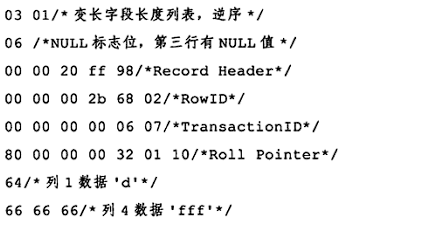

# MySQL 技术内幕--InnoDB 存储引擎

## MySQL 体系结构和存储引擎

### 定义数据库和实例

数据库：物理操作系统文件或其他形式文件类型的集合。在MySQL数据库中，数据库文件可以是 frm、MYD、MYI、ibd结尾的文件。

实例：MySQL 数据库由后台线程以及一个共享内存区组成。

从概念上来说，数据库是文件的集合，是依照某种数据模型组织起来并存放于二级存储器中的数据集合；数据库实例是程序，是位于用户和操作系统之间的一层数据管理软件，用户对数据库数据的任何操作，包括数据库定义、数据查询、数据维护、数据库运行控制等都是在数据库实例下进行的，应用程序只能通过数据库实例才能和数据库打交道。

MySQL 被设计为一个单进程多线程架构的数据库。也就是说 MySQL 数据库实例在系统上的表现就是一个进程。

```bash
# 启动 mysql 进程
./mysqld_safe &
# 查看 mysql 进程
ps -ef | grep mysqld
# 查看当 mysql 数据库实例启动时，会在哪些位置查找配置文件。
# Linux 中默认中 /etc/my.cnf -> /etc/mysql/my.cnf -> /usr/local/mysql/etc/my.cnf -> ~/my.cnf
# 如果多个配置文件存在同一个参数，后者会覆盖前者
mysql --help | grep my.cnf
```

配置文件中有一个参数 `datadir`，该参数指定了数据库所在的路径。Linux 中默认是 `/usr/local/mysql/data/`

```bash
mysql> show variables like 'datadiar' \G;
mysql> system ls-lh /usr/local/mysql/data
```

### MySQL 体系结构


### MySQL 存储引擎

MySQL 数据库区别于其它数据库的最重要的一个特点就是其插件式的表存储引擎。

!> 存储引擎是基于表的，而不是数据库。也就是说不同的表可以选择不同的存储引擎。

> 可以通过 `SHOW ENGINES` 语句查看当前使用的 MySQL 数据库所支持的存储引擎，也可以通过查询 `information_schema.engines` 表

InnoDB 存储引擎将数据放在一个逻辑的表空间中，这个表空间就想黑盒一样由 InnoDB 存储引擎自身进行管理。从 MySQL 4.1 版本开始，可以将每个表存放到独立的 `ibd` 文件中。

InnoDB 通过使用多版本并发控制（MVCC）来获得高并发性，并且实现了 SQL 标准的 4 种隔离级别，默认为 REPEATABLE 级别。同时，使用一种被称为 next-key locking 的策略来避免幻读现象的产生。除此之外，InnoDB 存储引擎还提供了插入缓冲（insert buffer），二次写（double write），自适应哈希索引（adaptive hash index），预读（read ahead）等高性能和高可用的功能。

### 连接 MySQL

常用的进程通信方式有管道、命名管道、TCP/IP套接字、UNIX域套接字。

#### TCP/IP

在通过 TCP/IP 连接时，MySQL 数据库会先检查一张权限视图，用来判断发起请求的客户端IP是否允许连接到 MySQL 实例。

`select host,user,passwork from mysql.user;`

#### 命名管道和共享内存

配置文件中启用 `--enable-named-pipe`

配置文件中启用 `--shared-memory`, 同时 MySQL 客户端还必须使用 `protocol=memory`

#### UNIX 域套接字

可以在配置文件中指定套接字文件的路径，如 `--socket=/tmp/mysql.sock`

查看 UNIX 域套接字文件路径：`show variables like 'socket';`

## InnoDB 存储引擎

### 版本


```sql
# 查看 mysql 版本
SELECT VERSION();
# 查看 inndob 版本
SHOW VARIABLES LIKE 'innodb_version'\G;
```

### InnoDB 体系结构


#### 后台线程

主要作用是负责刷新内存池中的数据，保证缓冲池中的内存缓存的是最近的数据。此外将已修改的数据文件刷新到磁盘文件，同时保证在数据库发生异常的情况下 InnoDB 能恢复到正常运行状态。

- Master Thread：非常核心的后台线程，主要负责将缓冲池中的数据异步刷新到磁盘中，保证数据的一致性，包括脏页的刷新（1.2版本后由Page Cleaner Thread 处理）、合并插入缓冲（INSERT BUFFER）、UNDO 页的回收（1.1版本后由Purge Thread处理）。
- IO Thread：负责 AIO 请求的回调处理。有4个种类（write、read、insert buffer、log IO thread）

    ```sql
    # 查看 read、write IO Thread 数量
    SHOW VARIABLES LIKE 'innodb_%io_threads'\G
    # 观察 IO Thread 
    SHOW ENGINE INNODB STATUS\G
    ```
- Purge Thread：回收已经使用并分配的 undo 页。

    ```sql
    SHOW VARIABLES LIKE 'innodb_purge_threads'\G
    ```

- Page Cleaner Thread: 刷新脏页

#### 内存


- 缓冲池

    简单来说就是一块内存区域，通过内存的速度来弥补磁盘速度较慢对数据库性能的影响。
    读取页时，先判断缓冲池有没有，没有再读磁盘。
    修改页时，先修改缓冲池，然后再以一定的频率刷新到磁盘上。（Checkpoint 机制）

    > 默认页大小是 16KB

    ```sql
    # 查看缓冲池大小
    SHOW VARIABLES LIKE 'innodb_buffer_pool_size'\G
    # 1.0.x 版本开始，为了减少资源竞争、增加并发处理能力，允许有多个缓冲池实例。每个页根据哈希值平均分配到不同缓冲池实例中。
    # 查看缓冲池实例数量
    SHOW VARIABLES LIKE 'innodb_buffer_pool_instances'\G

    # 查看缓冲池状态，
    SHOW ENGINE INNODB STATUS \G
    # 或者
    SELECT POOL_ID,POOL_SIZE,FREE_BUFFERS,DATABASE_PAGES FROM information_schema.INNODB_BUFFER_POOL_STATS\G
    ```

    缓冲池中的页通过 LRU 算法管理。并对传统的 LRU 算法做了一点优化：新读取的页并不是放到首部，而是放在 midpoint 位置。midpoint 之前的部分称为 new 列表，midpoint 之后的部分称为 old 列表。新读取的页需要在old列表中存活一段时间才能加入new部分（这个动作称为 page made young，如果最后没有加入，则称为 page not made young）。

    ```sql
    # 查看 midpoint 值，单位是 %。（距离尾部的百分比）。如果预估热点数据较多，可以把这个值调小一点。
    SHOW VARIABLES LIKE 'innodb_old_blocks_pct'\G
    # 新读取的页加入 new 列表的等待时间
    SHOW VARIABLES LIKE 'innodb_old_blocks_time'\G

    # 查看缓冲池状态，主要关心缓冲命中率指标（Buffer pool hit rate） ，通常该值不应该小于 95%，否则就要看看是否是由于全表扫描引起的 LRU 列表被污染的问题
    SHOW ENGINE INNODB STATUS \G
    # 或者
    SELECT POOL_ID,HIT_RATE,PAGES_MADE_YOUNG,PAGES_NOT_MADE_YOUNG FROM information_schema.INNODB_BUFFER_POOL_STATS\G

    # 观察每个LRU列表中每个页的具体信息
    SELECT TABLE_NAME,SPACE,PAGE_NUMBER,PAGE_TYPE FROM information_schema.INNODB_BUFFER_PAGE_LRU WHERE SPACE = 1;
    ```

- 重做日志缓冲

    一般不需要设置得很大，因为一般情况下每一秒会将重做日志缓冲刷新到日志文件，只需要保证每秒产生的事务量在这个缓冲大小之内即可。(通常 8MB 就够了)

    重做日志刷到磁盘的三种情况:
    1. Master Thread 每秒刷一次
    2. 每个事务提交时
    3. 重做日志缓冲剩余空间小于 1/2 时

    ```sql
    # 重做日志缓冲大小配置
    SHOW VARIABLES LIKE 'innodb_log_buffer_size'\G
    ```

- 额外的内存池

    在对一些数据结构本身的内存进行分配时，需要从额外的内存池中进行申请。

### Checkpoint 技术

checkpint 所做的事情是将缓冲池中的脏页刷回磁盘

目的是解决以下问题：

- 缩短数据库的恢复时间
    当数据库宕机时，不需要重做所有日志，因为 checkpoint 之前的页都已经刷新会磁盘。只需要恢复checkpoint后的重做日志。
- 缓冲池不够用时，将脏页刷新到磁盘
- 重做日志不可用时，刷新脏页
    重做日志设计上是一个环形，如果不够用，需要checkpoint刷新脏页

对于 InnoDB 存储引擎而言，其是通过 LSN（Log Sequence Number）来标记版本的，而 LSN 是 8 字节的数字，其单位是字节。每个页有 LSN，重做日志中也有 LSN，Checkpoint 也有 LSN。

Checkpoint的关键在于每次刷新多少页到磁盘，每次从哪里取脏页，以及什么时间触发 Checkpoint。

数据库关闭时默认会将所有脏页都刷新会磁盘。

运行时都只刷新一部分脏页，有以下几种 Checkpoint

- Master Thread Checkpoint
    每秒或者每十秒的频率
- FLUSH_LRU_LIST Checkpoint
    需要保证 LRU 列表中有差不多 100 个空闲页可供使用，通过 `innodb_lru_scan_depth` 控制。新版本在 Page Cleaner 线程中进行，淘汰 LRU 尾端的脏页。
- Async/Sync Flush Checkpoint
    重做日志文件不可用时。从脏页列表中选取。新版本在 Page Cleaner 线程中进行
- Dirty Page too much Checkpoint
    由 `innodb_max_dirty_pages_pct` 控制

### Master Thread 工作方式

InnoDB 存储引擎的主要工作都是在 Master Thread 中完成的

#### InnoDB 1.0.x 版本之前

Master Thread 具有最高的线程优先级。其内部由多个循环组成：主循环（loop），后台循环（backgroup loop），刷新循环（flush loop），暂停循环（suspend loop）。Master Thread 会根据数据库运行的状态在这几个循环中进行切换。

大多数操作都在 loop 中，其中有两大部分：每秒的操作和每十秒的操作

每秒的操作：
- 日志缓冲刷新会磁盘，即使这个事务还没有提交（总是）
- 合并插入缓冲（可能）
- 至多刷新100个InnoDB的缓冲池中的脏页到磁盘（可能）
- 如果当前没有用户活动，则切换到 backgroup loop（可能）

每十秒的操作：
- 刷新 100 个脏页到磁盘（可能）
- 合并至多5个插入缓冲（总是）
- 将日志缓冲刷新到磁盘（总是）
- 删除无用的 Undo 页（总是）
- 刷新 100 个或者 10 个脏页到磁盘（总是）

backgroup loop（没有用户活动或者数据关闭会切到该循环）:

- 删除无用的 Undo 页（总是）
- 合并 20 个插入缓冲（总是）
- 跳回到主循环（总是）
- 不断刷新 100 个页知道符合条件（可能，跳转到 flush loop 中完成）

若 flush loop 中也没有什么事情可以做了，InnoDB 存储引擎会切换到 suspend loop，将 Master Thread 挂起。

Master Thread 的伪代码：

```c
void master_thread() {
    goto loop;
loop:
    for (int i = 0; i < 10; i++) {
        thread_sleep(1)
        do log buffer flush to disk
        if (last_one_second_ios < 5) {
            do merge at most 5 insert buffer
        }
        if (buf_get_modified_ratio_pct > innodb_max_dirty_pages_pct) {
            do buffer pool flush 100 dirty page
        }
        if (no user activity) {
            goto backgroup loop
        }
    }
    if (last_ten_second_ios < 200) {
        do buffer pool flush 100 dirty page
    }
    do merge at most 5 insert buffer
    do log buffer flush to disk
    do full purge
    if (buf_get_modified_ratio_pct > 70%) {
        do buffer pool flush 100 dirty page
    } else {
        buffer pool flush 10 dirty page
    }
    goto loop;
backgroup loop:
    do full purge
    do merge 20 insert buffer
    if not idle:
        goto loop;
    else
        goto flush loop;
flush loop:
    do buffer pool flush 100 dirty page
    if (buf_get_modified_ratio_pct > innodb_max_dirty_pages_pct) {
        goto flush loop
    }
    goto suspend loop
suspend loop:
    suspend_thread()
    waiting event
    goto loop;
}
```

#### InnoDB 1.2.x 版本之前

1.0.x 版本之前对于脏页的刷新个数做了很多硬编码，不适合 SSD。

1.0.x 版本提供了参数 innodb_io_capacity，用来表示磁盘 IO 的吞吐量，默认值为 200。对于刷新到磁盘脏页的数量，规则如下：

- 合并插入缓冲数量为 innodb_io_capacity 的 5%
- 刷新脏页的数量为 innodb_io_capacity

1.0.x 版本 innodb_max_dirty_pages_pct 默认值从 90% 改成 75%

添加 innodb_purge_batch_size 控制每次 full purge 回收的 Undo 页数量，默认是 20

#### InnoDB 1.2.x 版本

伪代码：

```c
if InnoDB is idle
    srv_master_do_idle_tasks();
else
    srv_master_do_active_tasks();
```

其中 `srv_master_do_idle_tasks()` 就是之前版本中每10秒的操作，`srv_master_do_active_tasks()` 处理的是之前每秒中的操作。同时对于刷新脏页的操作，从 Master Thread 线程分离到一个单独的 Page Cleaner Thread，从而减轻了 Master Thread 的工作，同时进一步提高了系统的并发性。

### InnoDB 关键特性

#### 插入缓冲（Insert Buffer）

由于聚集索引的特性，对于非聚集索引的插入或者更新往往都是随机的

对于非聚集索引的插入或更新操作，不是每一次直接插入到索引页中，而是先判断插入的非聚集索引页是否在缓冲池中，若在，则直接插入；若不在，则先放入到一个 Insert Buffer 对象中。然后再以一定的频率和情况进行 Insert Buffer 和辅助索引页子节点的 merge 操作，这是通常能将多个插入合并到一个操作中（因为在一个索引页中），这就大大提供了对于非聚集索引插入的性能。

Insert Buffer 的使用需要同时满足以下两个条件：

- 索引是辅助索引
- 索引不是唯一索引

通过 `SHOW ENGINE INNODB STATUS \G` 的 merged recs（插入记录数） 和 merges(合并次数) 指标，（1- merges / merged recs） 可以得到减少的IO次数。

目前 Insert Buffer 存在一个问题是：在写密集的情况下，插入缓冲占用过多的缓冲池内存，默认最大可以占到 1/2 的缓冲池内存。

1.0.x 引入了 `Change Buffer`, 可以视为 Insert Buffer 的升级：对 INSERT、DELETE、UPDATE 都进行缓冲，分别是 Insert Buffer、Delete Buffer、Purge buffer。

Change Buffer 的适用对象依然是非唯一的辅助索引

1.2.x 版本，可以通过 innodb_change_buffer_max_size 控制 Change Buffer 最大适用内存的数量

Insert Buffer 的数据结构是一颗 B+ 树。全局只有一棵 Insert Buffer B+ 树，存放在共享表空间中，默认就是 ibdata1 中。


在 InnoDB 引擎中，每个表有一个唯一的 space_id。marker 用来兼容老版本的 insert buffer。offset 表示页所在的偏移量


Merge Insert Buffer 的操作可能发生在以下几种情况下：

- 辅助索引页被读取到缓冲池时
- Insert Buffer Bitmap 也追踪到该辅助索引页已无可用空间时
- Master Thread

#### 两次写（Double Write）

如果说 Insert Buffer 带给 InnoDB 存储引擎的是性能上的提升，那么 doublewrite 带来就是数据页的可靠性

16KB 的页，只写了前 4 KB，之后发生了宕机，被称为部分写失效。

> 重做日志中只记录了对页中的某个位置的修改，无法恢复整个页


脏页刷新时先 memcpy 到内存的 doublewrite buffer，然后写入共享表空间文件（fsync），然后再写入各表空间文件中（部分失效就用共享表空间来恢复）

```sql
# 查看 doublewrite 运行情况
SHOW GLOBAL STATUS LIKE 'innodb_dblwr%'\G
```

#### 自适应哈希索引（Adaptive Hash Index）

hash 时间复杂度为 O(1)，一般只需要一次查询

在生产环境中，B+ 树的高度一般为 3~4 层，故需要 3~4 次查询

InnoDB 存储引擎会监控对表上各索引页的查询。如果观察到建立哈希索引可以带来速度的提升，则建立哈希索引，称之为自适应哈希索引。

AHI 只能用来搜索等值的查询，而且需要查询的条件一样

可以通过观察 `SHOW ENGINE INNODB STATUS` 的结果及参数 `innodb_adaptive_hash_index` 来考虑是禁用或启动此特性

#### 异步 IO（Async IO）

AIO 的一个优势是可以进行 IO Merge 操作

参数 `innodb_user_native_aio` 用来控制是否启用 Native AIO，在 Linux 下默认启用

#### 刷新邻接页（Flush Neightbor Page）

当刷新一个脏页时，检测该页所在区（extent）的所有页，如果是脏页，那么一起进行刷新。

通过参数 `innodb_flush_neighbors` 控制。机械硬盘建议启用，固态硬盘建议关闭

### 启动、关闭与恢复

在关闭时，参数 `innodb_fast_shutdown` 影响行为

- 0。完成所有的 full purge、merge insert buffer、脏页刷新
- 1。默认值。数据脏页刷新
- 2。只将日志写入日志文件

参数 `innodb_force_recovery` 影响启动时的恢复，默认为 0(完成所有恢复)

## 文件

### 参数文件

告诉 MySQL 实例启动时在哪里可以找到数据库文件，并且指定某些初始化参数，这些参数定义了某种内存结构的大小等设置，还会介绍各种参数的类型。

参数文件可以通过 `mysql --help | grep my.cnf` 来寻找

MySQL 实例可以不需要参数文件，因为有默认值

参数可以理解为一个键/值对。可以通过命令 `SHOW VARIABLES` 查看数据库中的所有参数，也可以通过 LIKE 来过滤参数名。还可以通过 information_schema 架构下的 `GLOBAL_VARIALBES` 视图来进行查找。还可以用 `SELECT @@var_name` 来查看。

参数可以分为两大类：

- 动态类型：可以在运行时修改。可以通过 set 命令修改
    ```sql
    # global 和 session 表明该修改是基于当前会话还是整个实例的生命周期
    SET {global | session} system_var_name = expr
    # 或者
    SET {@@global. | @@session. | @@}system_var_name = expr
    ```
    若想在数据库实例下次启动该参数修改还能生效，就只能改参数文件了
- 静态类型
    运行时只读。修改会报错

### 日志文件

#### 错误日志（error log）

对 MySQL 的启动、运行、关闭过程进行了记录。

```sql
SHOW VARIABLES LIKE 'log_error'\G
```

#### 慢查询日志（slow query log）

在 MySQL 启动时可以设置一个阈值(`long_query_time`)，将运行时间超过(大于)该值的所有 SQL 语句都记录到慢查询日志文件中。

```sql
# 阈值配置
SHOW VARIABLES LIKE 'long_query_time'\G
# 慢查询日志开关
SHOW VARIABLES LIKE 'log_slow_queries'\G
# 慢查询日志文件路径
SHOW VARIABLES LIKE 'slow_query_log_file'\G
# 将没有使用索引的SQL语句也记录到慢查询日志开关
SHOW VARIABLES LIKE 'log_queries_not_using_indexes'\G
# 每分钟允许记录到 slow log 的且未使用索引的 SQL 语句次数
log_throttle_queries_not_using_indexes
```

可以通过 mysqldumpslow 命令查看慢查询日志文件

```bash
mysqldumpslow xxx-slow.log

# 执行时间最长的 10 条 SQL
mysqldumpslow -s al -n 10 xxx-slow.log
```

MySQL 5.1 开始可以将慢查询的日志记录放入一张表中。位置是 `mysql.slow_log`

```sql
# 设置慢查询日志输出到表中，默认是 FILE
SET GLOBAL log_output='TABLE'

# 构建一条慢查询日志
select sleep(10)\G

# 查询慢查询日志
select * from mysql.slow_log\G
```

#### 查询日志（log）

记录了所有对 MySQL 数据库请求的信息，无论这些请求是否得到了正确的执行。默认文件名为：主机名.log

MySQL 5.1 开始可以放入一张表中(`mysql.general_log`)

```sql
# 查询日志开关
SHOW VARIABLES LIKE 'general_log'\G
# 查询日志位置
SHOW VARIABLES LIKE 'general_log_file'\G

# 设置查询日志输出到表中，默认是 FILE
SET GLOBAL log_output='TABLE'
# 查询慢查询日志
select * from mysql.general_log\G
```

#### 二进制日志（binlog）

记录了对 MySQL 数据库执行更改的所有操作，但是不包括 SELECT 和 SHOW 这类操作。

```sql
# 执行修改操作
UPDATE t SET a = 1 WHERE a = 2;
# 查看当前的binlog文件名
SHOW MASTER STATUS\G
# 查看binlog事件
SHOW BINLOG EVENTS IN 'mysql.000008'\G
```

二进制日志主要有以下的作用：

- 恢复
- 复制
- 审计

通过配置参数`log-bin[=name]`可以启动二进制日志。如果不指定 name，则默认二进制日志文件名为主机名，后缀名为二进制日志的序列号，所在路径为数据目录(datadir).

xxx.index 为二进制的索引文件，用来存储过往产生的二进制日志序号

二进制日志的相关参数:

- max_binlog_size: 单个二进制日志文件最大值，默认是 1G
- binlog_cache_size：所有未提交的事务的二进制日志会被记录到一个缓冲中，默认为 32k，基于会话的。通过 show global status 查看 binlog_cache_use, binlog_cache_disk_use 的状态来判断当前大小是否合适
- sync_binlog： 二进制日志并不是在每次写的时候同步到磁盘。每写多少次缓冲就同步到磁盘。
- binlog-do-db：需要写入哪些库的日志
- binlog-ignore-db：需要忽略哪些库的日志
- log-slave-update：slave 默认不会将 master 的二进制日志写入到自己的二进制日志。如果需要，则设置该参数
- binlog_format：
    - `STATEMENT`: 记录逻辑SQL语句。遇到rand，uuid等函数会导致数据的不一致
    - `ROW`：记录表的行更改情况。缺点是数据量大
    - `MIXED`：默认采用 STATEMENT，某些情况使用 ROW

    在通常情况下，设置为 ROW，可以为数据库的恢复和复制带来更好的可靠性。


查看二进制文件的内容

```bash
mysqlbinlog --start-position=203 test.000004
# ROW 模式，需要加上 -vv
mysqlbinlog -vv --start-position=203 test.000004
```

### 套接字文件

```sql
SHOW VARIABLES LIKE 'socket'\G
```

### pid 文件

```sql
SHOW VARIABLES LIKE 'pid_file'\G
```

### 表结构定义文件

MySQL 数据的存储是根据表进行的，每个表都会有与之对应的文件。`frm` 为后缀名的文件记录了表的结构定义。

### InnoDB 存储引擎文件

之前介绍的文件都是 MySQL 数据库本身的文件，和存储引擎无关

#### 表空间文件

InnoDB 采用将存储的数据按表空间进行存放的设计。默认的表空间文件名为 ibdata1，通过 `innodb_data_file_path` 参数设置该文件的路径和数量

```cnf
[mysqld]
innodb_data_file_path=/db/ibdata1:2000M;/dr2/db/ibdata2:2000M:autoextend
```

默认所有表的数据都会记录到该共享表空间中。若设置了参数 `innodb_file_per_table`，则每个表产生一个独立表空间。独立表空间的命名规则为：表名.ibd。

这些单独的表空间文件劲存储该表的数据、索引和插入缓冲 BITMAP 等信息，其余信息还是存放在默认的表空间中.


#### 重做日志文件

默认情况下，数据目录下会有两个名为 ib_logfile0 和 ib_logfile1 的文件。

每个 InnoDB 存储引擎至少有1个重做日志文件组，每个文件组至少有2个重做文件。日志文件组中以循环写入的方式运行，例如先写文件1，满了再写文件2，满了再写文件1.

影响重做日志文件的参数：

- innodb_log_file_size
- innodb_log_files_in_group
- innodb_mirrored_log_groups
- innodb_log_group_home_dir

和二进制日志的区别

1. 二进制日志记录MySQL数据库所有有关的日志记录，包括各种存储引擎的日志。InnoDB重做日志只记录本存储引擎的事务日志
2. 无论是哪种格式，二进制日志记录的都是逻辑日志。重做日志记录的是关于每个页的更改的物理情况
3. 二进制日志仅在事务提交前进行提交。重做日志在事务进行中也在不断得写入


## 表

### 索引组织表

在 InnoDB 存储引擎中，表都是根据主键顺序组织存放的，这种存储方式的表称为索引组织表。

如果在创建表时没有显式地定义主键，则会按如下方式选择或创建主键：

- 如果表中有非空的唯一索引，则该列即为主键。如果有多个，则选择建表时第一个定义的
- 如果没有，则自动创建一个6字节大小的指针

可以通过 `_rowid` 显式表的主键，不过这种方式只能用于查看单个列为主键的情况

### InnoDB 逻辑存储结构


#### 表空间

默认情况下数据都在共享表空间 ibdata1.

如果启用了 innodb_file_per_table 参数，每张表内的数据可以单独放到一个表空间内，但是这些表空间存放的只是数据、索引和插入缓冲 Bitmap 页，其它数据，如 undo 信息，插入缓冲索引页、系统事务信息、二次写缓冲等还是存放在原理的共享表中。

#### 段

表空间是由各个段组成的，常见的段有数据段、索引段、回滚段等。

数据段是 B+ 树的叶子节点，索引段是 B+ 树的非叶子节点。

#### 区

区是由连续页组成的空间，在任何情况下每个区的大小都为 1MB。在默认情况下，InnoDB 存储引擎页的大小为 16KB，即一个区中一共有 64 个连续的页。页可以通过 KYE_BLOCK_SIZE 参数来压缩，或者通过 innodb_page_size 来修改大小，但是区的大小总是 1M。

在用户启动了参数 innodb_file_per_table 后，创建的表默认大小是96KB。区的大小总是 1M，那么表空间至少是 1MB 才对。其实这是因为在每个段开始时，先用32个页大小的碎片页（fragment page）来存放数据，在使用完这些页之后才是区的申请。

#### 页

页 是 InnoDB 磁盘管理的最小单位。默认大小是 16KB，可以通过参数 innodb_page_size 修改，若设置完成，则所有表中页的大小都为 innodb_page_size ，不可以对其再次进行修改，除非通过 mysqldump 导入和导出操作来产生新的库。

常见的页类型：

- 数据页（B-tree Node）
- undo 页（undo Log Page）
- 系统页（System Page）
- 事务数据页（Transaction system Page）
- 插入缓冲位图页（Insert Buffer Bitmap）
- 插入缓冲空闲列表页（Insert Buffer Free List）
- 未压缩的二进制大对象页（Uncompressed BLOB Page）
- 压缩的二进制大对象页（compressed BLOB Page）

#### 行

InnoDB 数据是按行进行存放的。每个页存放的行记录也是有硬性定义的，最多允许存放 16KB/2 - 200 行的记录，即 79992 行。

### InnoDB 行记录格式

```sql
# 查看表的行记录格式，Row_format 字段
show table status like 'mytest'\G
```

InnoDB 1.0.x 版本之前，InnoDB 存储引擎提供了 `Compact` 和 `Redundant`（兼容更老版本） 两种格式来存放行记录数据。

#### Compact 行记录格式


变长字段长度列表：记录非 NULL 的变长字段的长度的列表，且是按照列的顺序逆向放置的。

大于 255 的用两个字节，小于等于255的用一个字节。变长字段的长度最大不可以超过 2 字节，因此 VARCHAR类型的最大长度限制为 65535.

NULL 标志位：用二进制位的方式表示某行数据是否为 NULL。

记录头信息：


接下来就是列数据，除了用户定义的列外，还有两个隐藏列，事务ID列和回滚指针列，分别为6字节和7字节大小。若 InnoDB 表没有定义主键，每行还会增加一个6字节的 rowid 列。

比如一个表

```sql
CREATE TABLE mytest (
    t1 VARCHAR(10),
    t2 VARCHAR(10),
    t3 CHAR(10),
    t4 VARCHAR(10)
) ENGINE=INNODB CHARSET=LATIN1 ROW_FORMAT=COMPACT;
INSERT INTO mytest VALUES ('a', 'bb', 'bb', 'ccc');
INSERT INTO mytest VALUES ('d', NULL, NULL, 'fff');
```

通过 `hexdump -c -v mytest.ibd` 可以看到第一行数据：

   


第二行数据：



不管是 CHAR 类型还是 VARCHAR 类型，在 compact 格式下 NULL 值都不占用任何存储空间

#### Redundant 行记录格式


NULL 的 CHAR 类型在 Redundant 行记录格式需要占用空间。

#### 行溢出数据

MySQL 官方手册中定义的 VARCHAR 类型最大支持 65535，单位是字节。由于其它开销，真实只允许 65532，也就说在 latin1 编码下是 65532，在 GBK 编码下是 32767， 在 UTF8 编码下是 21845。

另外，65535 长度限制是指所有 VARCHAR 列的长度总和，如果列的长度总和超过了这个长度，依然无法创建。

InnoDB 存储引擎的页为 16KB，即 16384 字节，怎么能存放 65532 字节呢？

在一般情况下，数据都是存放在页类型为 `B-tree node` 中。但是当发生行溢出时，数据存放在页类型为 `Uncompress BLOB` 页中。B-tree node 中只保存数据的前 768 字节。


那么多长会溢出呢？每个页至少应该有两条行记录。如果页中只能存放一条记录，那么就会把行数据存放在溢出页。根据实验，如果表中仅有一个varchar列，那么这个列的长度不超过 8098 就不会溢出。

对于 TEXT 或 BLOB 的数据类型，也和 VARCHAR 一样的规则：至少保证一个页能存放两条记录。

#### Compressed 和 Dynamic 行记录格式

这是新版本的行记录格式

对于存放在 BLOB 中的数据采用了完全的行溢出的方式


Compressed 行记录格式的另一个功能就是存储在其中的行数据会以 zlib 的算法进行压缩，因此对于 BLOB、TEXT、VARCHAR 这类大长度类型的数据能够进行非常有效的存储。

#### CHAR 的存储格式

对于多字节编码的 CHAR 数据类型的存储，InnoDB存储引擎在内部将其视为变成字符类型。这也意味着变成长度列表中会记录 CHAR 数据类型的长度。

CHAR 类型被明确视为了变成字符类型，但是对于未能占满长度的字符还是填充 Ox20。

### InnoDB 数据页结构


### Named File Format 机制

1.0.x 版本之前的文件格式定义为 Antelope，新版本支持的文件格式定义为 Barracuda，并且向下兼容。


```sql
# 查看mysql版本
SELECT @@version\G
# 查看 innodb 版本
SHOW VARIABLES LIKE 'innodb_version'\G
# 查看文件格式
SHOW VARIABLES LIKE 'innodb_file_format'\G
```

### 约束

#### 数据完整性

关系型数据库系统和文件系统的一个不同点是，关系数据库本身能保证存储数据的完整性，不需要应用程序的控制。

几乎所有的关系型数据库都提供了约束机制来保证数据的完整性。

数据完整性有以下三种形式：

- 实体完整性保证表中有一个主键
- 域完整性保证数据每列的值满足特定的条件。
    - 选择合适的数据类型
    - 外键约束
    - 编写触发器
    - DEFAULT
- 参照完整性保证两张表之间的关系。
    - 外键

对于 InnoDB 存储引擎本身而言，提供了以下几种约束：

- Primary Key
- Unique Key
- Foreign Key
- Default
- NOT NULL

#### 约束的创建和查找

约束的创建可以采用以下两种方式：

- 表创建时就进行约束定义
- 利用 ALTER TABLE 命令来进行创建约束

```sql
create table u (
    id INT,
    name VARCHAR(20),
    id_card CHAR(18),
    PRIMARY_KEY (id),
    UNIQUE KEY (name);
)

ALTER TABLE u
ADD UNIQUE KEY uk_id_card(id_card);
```

主键的约束名为 PRIMARY，唯一索引的默认约束名与列名相同。

```sql
# 查看表的约束信息
SELECT constraint_name,constraint_type FROM information_schema.TABLE_CONSTRAINTS where table_schema='mytest' and table_name = 'p'\G
# 查看库的外键信息
SELECT * FROM information_schema.REFERENTIAL_CONSTRAINTS WHERE constraint_schema='mytest'\G
```

#### 约束和索引的区别

约束是一个逻辑的概念，用来保证数据的完整性，而索引是一个数据结构，既有逻辑上的概念，在数据库中还代表着物理存储的方式。

#### 对错误数据的约束

在某些默认设置下，MySQL 数据库允许非法的或不正确的数据的插入或更新，有或者转化成一个合法的值，如向 NOT NULL 的字段插入一个 NULL 值，MySQL 数据库会将其更改为 0 再进行插入，可以通过 `show warnings\G` 查看告警。如果希望报错而不是警告，可以设置 sql_mode 为 STRICT_TRANS_TABLES.

#### ENUM 和 SET 约束

MySQL 不支持传统的 CHECK 约束，可以通过 ENUM 和 SET 类型来解决部分的约束需求。

```sql
CREATE TABLE a (
    id INT,
    sex ENUM('male', 'female')
);
```

只限于对离散数值的约束。对于连续值的范围约束或更复杂的约束，需要通过触发器来实现

#### 触发器与约束

[官方文档](https://dev.mysql.com/doc/refman/5.7/en/create-trigger.html)

触发器的作用是在执行 INSERT、DELETE、UPDATE 命令之前或之后自动调用 SQL 命令或存储过程。

```
CREATE
[DEFINER = { user | CURRENT_USER }]
TRIGGER trigger_name BEFER|AFTER INSERT|UPDATE|DELETE
ON tbl_name FOR EACH ROW trigger_stmt
```

#### 外键约束

[官方文档](https://dev.mysql.com/doc/refman/5.7/en/create-table-foreign-keys.html)

```
[CONSTRAINT [symbol]] FOREIGN KEY
    [index_name] (col_name, ...)
    REFERENCES tbl_name (col_name,...)
    [ON DELETE reference_option]
    [ON UPDATE reference_option]

reference_option:
    RESTRICT | CASCADE | SET NULL | NO ACTION | SET DEFAULT
```

在导入过程中忽视外键的检查

```sql
SET foreign_key_checks = 0;
LOAD DATA...
SET foreign_key_checks = 1;
```

### 视图

在 MySQL 数据库中，视图（view）是一个命名的虚表，它由一个 SQL 查询来定义，可以当作表使用。但是视图中的数据没有实际的物理存储。

#### 视图的作用

视图的主要用途之一是被用做一个抽象装置，在一定程度上起到一个安全层的作用。

```
CREATE
    [OR REPLACE]
    [ALGORITHM = {UNDEFINED | MERGE | TEMPTABLE}]
    [DEFINER = user]
    [SQL SECURITY { DEFINER | INVOKER }]
    VIEW view_name [(column_list)]
    AS select_statement
    [WITH [CASCADED | LOCAL] CHECK OPTION]
```

某些视图可以进行更新操作，称为可更新视图。WITH CHECK OPTION 就是针对可更新视图添加检查。

`show tables` 除了持久表，也会显示视图。

如果只想查看持久表

```sql
# 查看持久表和视图
show tables;

# 查看持久表
select * from information_schema.TABLES
where table_type = 'BASE TABLE' and table_schema=database()\G;

# 查看视图
select * from information_schema.VIEWS
where table_schema=database()\G;
```

#### 物化视图

Oracle支持物化视图，但是Mysql不支持。但是可以通过另一张表和触发器来模拟。

### 分区表

分区功能并不是在存储引擎层完成的，但是需要存储引擎的支持。

MySQL数据库至此hi的分区类型为水平分区，并不支持垂直分区。此外，MySQL的分区是局部分区索引，一个分区中既存放了数据由存放了索引。

> 水平分区将一个表不同行分配到不同的物理文件中，垂直分区将一个表的不同列分配到不同的物理文件中

> 全局分区是指数据存放在各个分区中，但是所有数据的索引放在一个对象中。

```sql
# 查看当前数据库是否启动了分区功能
show variables like '%partition%'\G;

# 或者
show plugins;
```