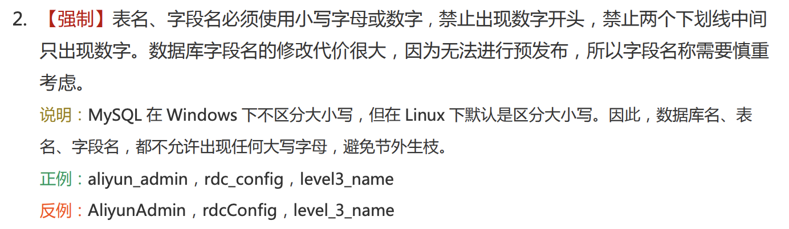
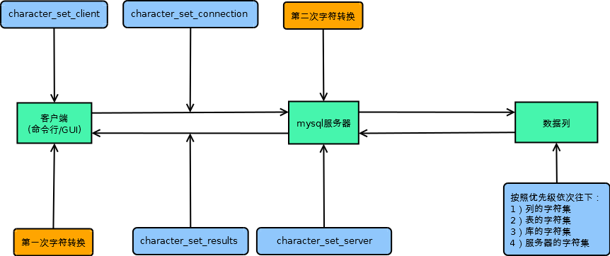

# Mysql 常见问题

## MySQL 表名大小写问题

!> MySQL 在 Linux 环境下区分大小写，window 环境下不区分大小写

!> 即在 Linux 种大小写不同的同名表属于不同的表

```bash
# 创建大小写不同的同名表
mysql> create table t_case(id serial, content varchar(255) not null default '');
Query OK, 0 rows affected (0.02 sec)

mysql> create table T_CASE(id serial, content varchar(255) not null default '');
Query OK, 0 rows affected (0.01 sec)

# 往小写表中插入数据
mysql> insert into t_case(content) values('1');
Query OK, 1 row affected (0.00 sec)

# 小写表可查到数据
mysql> select * from t_case;
+----+---------+
| id | content |
+----+---------+
|  1 | 1       |
+----+---------+
1 row in set (0.00 sec)

# 大写表查不到数据
mysql> select * from T_CASE;
Empty set (0.00 sec)
```

!> 这种大小不同的同名表很容易导致写错 SQL，应该杜绝使用

表名建议遵循《阿里巴巴 Java 开发手册》



## 插入或者更新数据过大: ERROR 2006(HY000): MySQL server has gone away

> 场景：在导库的时候，导出的 sql 文件一般都很大，导入新的数据库实例经常会遇到报这个错

查看 Server 端可以接受的最大包大小

```sql
show global variables like '%max_allowed_packet%';
```

解决方法：

- 通过命令暂时修改包大小（重启数据库实例后失效）

    ```sql
    set global max_allowed_packet = 1 * 1024 * 1024;
    ```

- 修改配置文件 `/etc/mysql/my.cnf` （重启数据库实例后才能生效）

    ```
    [mysqld]
    max_allowed_packet = 20M
    ```

> 如果是导库这样的一次性场景，建议通过命令行暂时修改，完成后再改回来

[相关问题](https://stackoverflow.com/questions/10474922/error-2006-hy000-mysql-server-has-gone-away)

## MySQL 中文乱码

MySQL 中文乱码是一个很常见的问题，解决的思路就是将服务端和客户端编码为 `utf8`

> MySQL 默认编码是 `latin1`, 这种编码在应用端不常见，建议统一成最常用的 `utf8`

### 查询数据库实例编码

```sql
show variables like '%char%';
```

结果默认如下:

```bash
+--------------------------+----------------------------+
| Variable_name            | Value                      |
+--------------------------+----------------------------+
| character_set_client     | latin1                     |
| character_set_connection | latin1                     |
| character_set_database   | latin1                     |
| character_set_filesystem | binary                     |
| character_set_results    | latin1                     |
| character_set_server     | latin1                     |
| character_set_system     | utf8                       |
| character_sets_dir       | /usr/share/mysql/charsets/ |
+--------------------------+----------------------------+
```

参数解析:

> - character_set_client: 客户端来源数据使用的字符集
> - character_set_connection: 连接层字符集
> - character_set_database：当前选中数据库的默认字符集
> - character_set_filesystem：把 os 上文件名转化成此字符集，默认 binary结果集的编码
> - character_set_results: 查询结果字符集
> - character_set_server: 默认的内部操作字符集
> - character_set_system: 系统元数据字符集
> - character_set_dir: 字符集的路径

查看行数据存储的字符集

> 读取的顺序: `列字符集 -> 表字符集 -> 库字符集 -> character_set_server`

```sql
show create table test;
```

### 字符集转化流程



【插入流程】

1. 客户端设定了自己的编码（character_set_client），接收用户的输入；
2. 客户端将用户的输入“转换”成连接的编码（character_set_connection） =====> 第一次转换
3. 客户端将转换后的数据发送给服务器；                               =====> 传输不会导致编码转换
4. 服务器收到客户端的数据，再判断数据列的字符集，进行字符转换       =====> 第二次转换
5. 服务器将数据存储（例如磁盘）                                     =====> 存储不会导致编码转换

【读取流程】

> 略去前面的sql语句处理流程，从数据读取开始

1. 服务器从存储（例如磁盘）读取数据                                 =====> 存储不会导致编码转换，因此从存储读取也不需要
2. 服务器判断当前连接返回结果的字符集（character_set_results），
   将读取的数据转换为结果集要求的数据                               =====> 逆向的第一次转换，对应正向的第二次编码转换
3. 服务器将数据发送给客户端                                         =====> 传输不会导致编码转换
4. 客户端收到服务器的数据，根据客户端的字符集（character_set_client）进行编码转换          =====> 逆向第二次转换，对应正向第一次编码转换
5. 客户端显示数据                                                   =====> 你能看到乱码的时候

总结如下：

> 对于 mysql 官方客户端，自己插入和查询数据不会存在乱码，除非是其他不同连接插入的数据；

> 对于 JDBC 连接，保证 JDBC 设置的字符集和服务端的 `character_set_connection`, `character_set_results` 三者相等

### 统一编码为 utf8

> 解决编码问题的最佳方案就是统一编码

- 服务端

修改 `/etc/mysql/my.cnf` 文件

```ini
[mysql]
default-character-set = utf8

[mysql.server]
default-character-set = utf8

[mysqld_safe]
default-character-set = utf8

[client]
default-character-set = utf8

[mysqld]
character-set-server = utf8
```

设置后的字符集

```bash
mysql> show variables like '%char%';
+--------------------------+----------------------------+
| Variable_name            | Value                      |
+--------------------------+----------------------------+
| character_set_client     | utf8                       |
| character_set_connection | utf8                       |
| character_set_database   | utf8                       |
| character_set_filesystem | binary                     |
| character_set_results    | utf8                       |
| character_set_server     | utf8                       |
| character_set_system     | utf8                       |
| character_sets_dir       | /usr/share/mysql/charsets/ |
+--------------------------+----------------------------+
```

> 暂时修改编码验证，可以通过 `SET NAMES utf8` 命令同时设置 `character_set_client/character_set_connection/character_set_results` 的字符集

- 客户端编码显示声明 utf8

在 jdbc url 后面添加 `useUnicode=true&characterEncoding=utf8`

如:

```
jdbc:mysql://localhost:3306/test?useUnicode=true&characterEncoding=utf8
```

### References

- [MySQL 乱码问题终极指南](https://blog.csdn.net/yunhua_lee/article/details/7391089)

- [MySQL 查看与修改编码方式(mysql、数据库、表)](https://blog.csdn.net/lyhDream/article/details/42340871)

