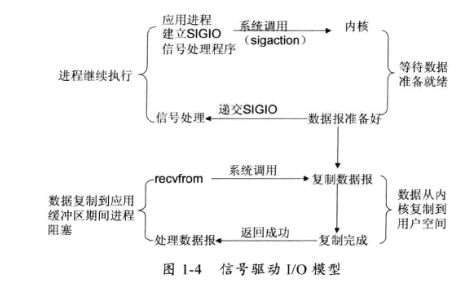

# Netty

Netty 是一个高性能通信框架，简化了 Java NIO 网络编程，并对于网络编程中的各种问题提供了解决方案。

> 涉及 Java 高性能网络通信，Netty 是首选底层框架

Java 1.4 出现的 NIO 类库，让 Java 有了高性能网络编程的能力

但是 NIO 编程问题众多且难以排查，导致难以普及，Netty 简化了 NIO 的编程，且内置解决了众多 NIO 问题

Netty 让 Java 在高性能服务器领域有了和 C++ 的一比之力

## 5 种 IO 模型

- 阻塞 IO 模型


- 非阻塞 IO 模型


- IO 复用模型


- 信号驱动 IO 模型



- 异步 IO


## IO 多路复用

IO 多路复用主要有两种实现 select 和 epoll。

select 使用数据存储监听的 socket，数组大小限制了监听的 socket 数量，其次通过轮询来寻找可用的就绪的 socket，寻找性能会随着 socket 数量的增长而降低

epoll 的优势：

- 支持一个进程打开的 socket 描述符（FD）不受限制（仅受限于操作系统的最大文件句柄数）
- I/O 效率不会随着 FD 数目的增加而线性下降
- 使用 mmap 加速内核与用户空间的消息传递
- epoll 的 API 更加简单

## Java NIO 的发展

Java 1.4 出现 NIO 类库，这时底层使用的是 select/poll

> 这里的 NIO 实际上是 IO 多路复用模型

Java 1.5 update 10，底层用 epoll 替代

Java 1.7 出现了 NIO2 类库

> 这里的 NIO2 实际上是 AIO（异步IO）模型，Netty 5 使用了这个库，但是由于发现这个库存在的一些问题，目前还未能发布。

## 选择 Netty 的理由

Java 原始 NIO 库存在以下问题:

- NIO 的类库和 API 繁杂
- 需要熟悉 Java 多线程编程、Reactor模型等额外技能。
- 可靠性能力补齐，工作量和难度都非常大
- JDK NIO 存在一些 bug，比如 epoll bug 会导致 Selector 空轮询

而 Netty 是业界最流行的 NIO 框架之一，它的健壮性、功能、性能、可定制性和可扩展性在同类框架中都是首屈一指的，而且已经得到无数商业项目的验证

Netty 的优点:

- API  使用简单，开发门槛低
- 功能强大，预置了多种编解码功能，支持多种主流协议
- 定制能力强，可以通过 ChannelHandler 对通信框架进行灵活地扩展
- 性能高，通过与其它业界主流的 NIO 框架对比，Netty 的综合性能最优
- 成熟、稳定，修复了已经发现的所有 JDK NIO BUG
- 社区活跃
- 经历了大规模的商业应用考验

> 虽然 Netty API 比 Java 原始 NIO 简单，但还是不够简单，因此往往会再包一层进行使用，比如以 Netty 作为通信框架搭建的 RPC 框架

## 粘包和拆包

粘包：TCP 为了提高吞吐量，可能会把应用层多条数据以一个包发出
拆包: 应用层数据太多，TCP 会把数据拆成多个包发出

解决策略

- 消息定长

> Netty 对应的解码器 `FixedLengthFrameDecoder`

- 分隔符，比如在每条应用层数据尾部增加回车换行符进行分割

> Netty 对应的 `LineEncoder` 和 `LineBasedFrameDecoder`,以及通用的 `DelimiterBasedFrameDecoder`

- 将消息分为消息头和消息体，消息头包含表示消息总长度（或者消息体长度）的字段，通常设计思路为消息头的第一个字段使用 int32 来表示消息的总长度

> 这个策略最为通用和常见，在 Netty 中的对应的编解码器是 `LengthFieldPrepender` 和 `LengthFieldBasedFrameDecoder`

- 更复杂的应用层协议

## Netty Demo

```java
public class NettyServer {
    public static void main(String[] args) {
        NioEventLoopGroup acceptorEventLoop = new NioEventLoopGroup();
        NioEventLoopGroup workerEventLoop = new NioEventLoopGroup();
        ServerBootstrap serverBootstrap =
                new ServerBootstrap()
                        .group(acceptorEventLoop, workerEventLoop)
                        .channel(NioServerSocketChannel.class)
                        .childHandler(new ChannelInitializer<SocketChannel>() {
                            @Override
                            protected void initChannel(SocketChannel socketChannel) throws Exception {
                                socketChannel.pipeline()
                                        .addLast(new LengthFieldBasedFrameDecoder(65535, 0, 2, 0, 2))
                                        .addLast(new StringDecoder())
                                        .addLast(new LengthFieldPrepender(2))
                                        .addLast(new StringEncoder())
                                        .addLast(new HelloHandler());
                            }
                        });

        try {
            ChannelFuture f = serverBootstrap.bind(10086).sync();
            f.channel().closeFuture().sync();
        } catch (InterruptedException e) {
            e.printStackTrace();
            acceptorEventLoop.shutdownGracefully();
            workerEventLoop.shutdownGracefully();
        }

    }

    private static class HelloHandler extends ChannelDuplexHandler {
        @Override
        public void channelActive(ChannelHandlerContext ctx) throws Exception {
            ctx.writeAndFlush("welcome to hello server");
        }

        @Override
        public void channelRead(ChannelHandlerContext ctx, Object msg) throws Exception {
            if (!(msg instanceof String)) {
                ctx.fireChannelRead(msg);
                return;
            }
            System.out.println("message from client: " + msg);
            ctx.write("ack:" + msg);
        }

        @Override
        public void channelReadComplete(ChannelHandlerContext ctx) throws Exception {
            ctx.flush();
        }
    }
}
```

```java
public class NettyClient {
    public static void main(String[] args) {
        NioEventLoopGroup eventLoopGroup = new NioEventLoopGroup();
        Bootstrap bootstrap = new Bootstrap()
                .group(eventLoopGroup)
                .channel(NioSocketChannel.class)
                .handler(new ChannelInitializer<SocketChannel>() {
                    @Override
                    protected void initChannel(SocketChannel socketChannel) throws Exception {
                        socketChannel.pipeline()
                                .addLast(new LengthFieldBasedFrameDecoder(65535, 0, 2, 0, 2))
                                .addLast(new StringDecoder())
                                .addLast(new LengthFieldPrepender(2))
                                .addLast(new StringEncoder())
                                .addLast(new HelloHandler());
                    }
                });
        try {
            ChannelFuture f = bootstrap.connect("localhost", 10086).sync();
            f.channel().closeFuture().sync();
        } catch (InterruptedException e) {
            e.printStackTrace();
            eventLoopGroup.shutdownGracefully();
        }
    }

    private static class HelloHandler extends ChannelDuplexHandler {
        @Override
        public void channelRead(ChannelHandlerContext ctx, Object msg) throws Exception {
            if (!(msg instanceof String)) {
                ctx.fireChannelRead(msg);
            }
            String str = (String) msg;
            if (str.startsWith("welcome")) {
                for (int i = 0; i < 1000; i++) {
                    ctx.write("msg" + i);
                }
            } else {
                System.out.println(msg);
            }
        }

        @Override
        public void channelReadComplete(ChannelHandlerContext ctx) throws Exception {
            ctx.flush();
        }
    }
}
```

## Netty 高性能之道

- 异步非阻塞通信

- 高效的 Reactor 线程模型

    - Reactor 单线程模型
    - Reactor 多线程模型
    - 主从 Reactor 多线程模型

- 高性能的序列化框架
    - 序列化后的码流大小
    - 序列化和反序列化的性能（CPU资源占用）
    - 是否支持跨语言

- 零拷贝

- 内存池

- 无锁化的串行设计

- 高效的并发编程

## References

- [《Netty权威指南》]()
- [多路复用技术 epoll 分析](https://cloud.tencent.com/developer/article/1534231)