# Excel 基础

## 快速入门

## 准确高效地录入数据

## 商务表格制作和打印技巧

## 简单快速统计分析

值的显示方式：

## 批量化的数据整理妙招

## 自动化的公式计算

## 简单快速让数据说话

## 专业的商业图表制作

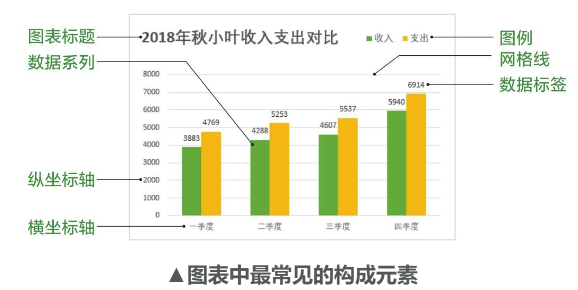


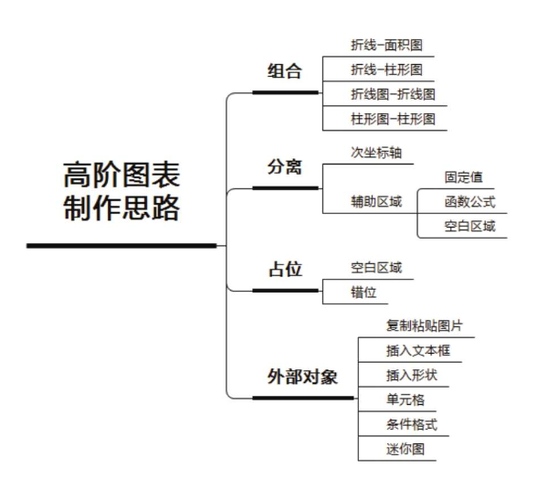

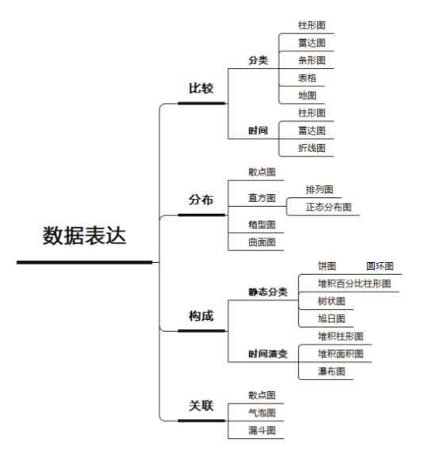

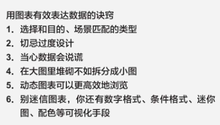

## Excel高手的效率秘籍

### 函数速查表

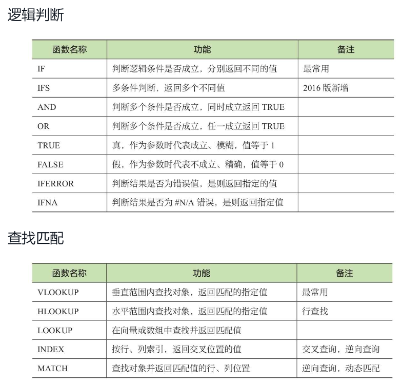
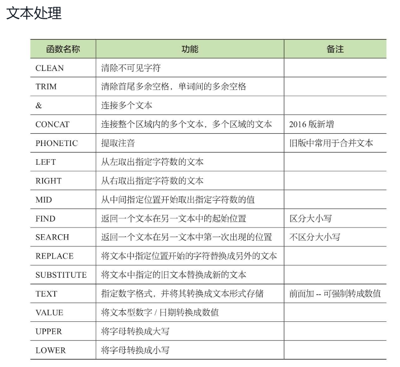
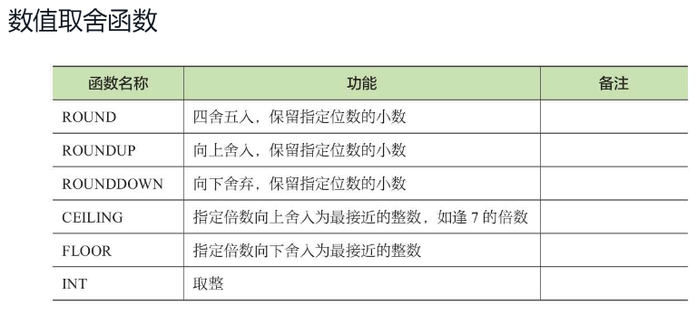
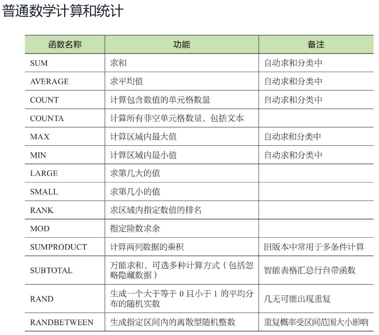
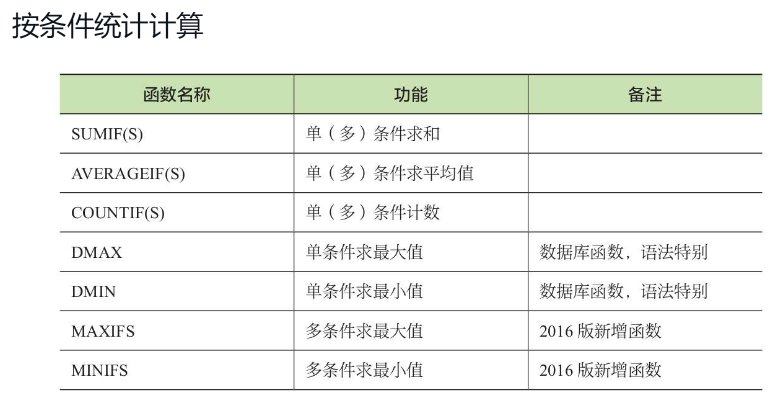
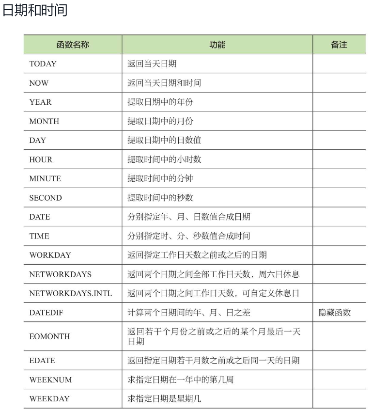
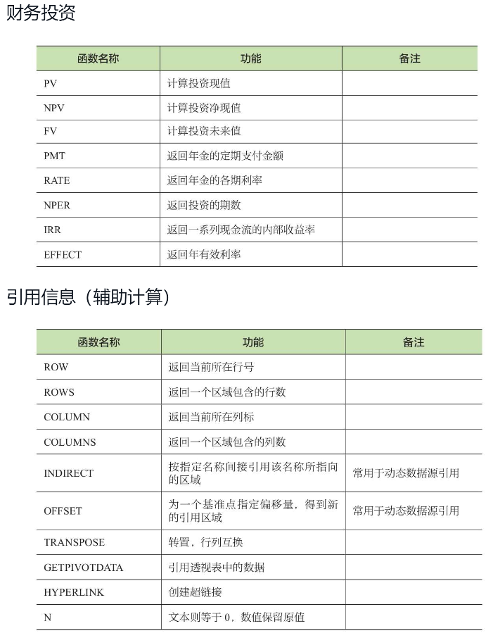

## References

- [和秋叶一起学Excel](https://weread.qq.com/web/reader/3db3251071d7bc463dbd46f)