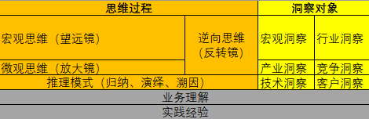
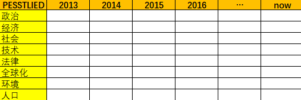

# 洞察力提升最佳实践

不还原，就看不到本来面目；不抽象，就无法深入思考

对世界的洞察是最重要的。没有洞察，就没有方向；没有方向，就没有思想；没有思想，就没有理论；没有理论，就没有战略

业务的洞察是对人员能力的洞察，对工作改进的洞察。有了洞察能力，才能发现当前的问题，设定前进的方向，所以，发现问题要比解决问题更重要。

丰富横向知识的能力，提高纵向作战能力

学习和实践要相互结合，学思践悟，重在悟

## 洞察力的本质

> 洞察力就是看清事物本质的能力

洞察的本质就是要有扎实的理论知识，通过实践过程中的深入研究，才能准确地揭示事物的本质和规律，把零散的信息系统化，把粗浅的认识深刻化，抓住关键，找到规律，看到本质

## 洞察力的三个层次

1. Data : 回答发生了什么；What is the fact
2. Information : 回答为什么; What is changing? And why
3. Insight : 下一步该怎么办; What shall we do; So what? What is next

## 拓展你的洞察思维

## 洞察方法

### 宏观洞察

### 产业洞察

分为7个维度
1. 产业趋势：技术趋势、产业节奏、产业链、创新力量
    顺之者昌，逆之者亡。
    重点识别颠覆式创新和渐进式创新。
2. 市场空间：分为TAM（整体空间）、SAM（可参与空间）、TM（目标市场）。
    自上而下使用各种过滤条件削减得到预计数据。
    自下而上收集每个参与者的数据得到市场总体规模
3. 市场格局：
4. 对手策略：关注对手差异化策略和价值主张
    对手的核心竞争力是什么？
    给客户带来什么价值
5. 应用场景：深入客户业务流程，了解客户如何
    使用产品与解决方案，给客户带来的价值
6. 客户战略与痛点：客户战略是最重要的客户需求
    只有解决客户最关键的痛点，才是最有价值的需求
7. 市场细分：从行业、国家/区域、客户、产品/服务类别四维度切分市场。

### 行业洞察

PReDICT方法论：

- 初阶领域：看清楚现象 + 理解本质
    - Philosophy（理）：建立认知，一定领域的运行规律和原理
    - Resemblance（象）：定性分析，看得到的事，概貌、关系、动态
    - Data（数）：定量分析，可度量的数，结果
- 高阶心法：整合信息 + 梳理逻辑
    - Integration（通）：集成分析，定性+定量，集成，交叉验证
    - Coherence（通）：逻辑分析，强化的逻辑线、故事线
    - Trends（变）：行动对策，趋势预判与对策、校验/迭代，行动建议

关键行业：政府、金融、能源、交通、制造

行业客户（CSPA）洞察实践：

1. 宏观环境
2. 经营情况
3. 战略解读
4. 业务场景
5. 组织与生态
6. ICT 现网
7. 机会点与需求

### 客户洞察

维度：

1. 战略
2. 经营
3. 组织，组织和重要人员变化往往是战略启动的标志之一
4. 网络，打造一套标准化的指标和健康值
5. 商业，比经营洞察更细，将具体的业务发展分析和财务数据
6. 流程，灵活匹配客户流程，争取最大程度的耦合

### 竞争洞察

从友商的战略、经营、组织、业务和战场五个维度进行分析。指导 How to beat 或 How to learn

战略：可以通过对比多个友商之间的共同点和不同点

经营主要看财报分析

|                |                | ××年 | ××年 | ××年 |
| -------------- | -------------- | ---- | ---- | ---- |
| 成长性         | 销售收入       |      |      |      |
|                | 研发费用       |      |      |      |
| 盈利性         | 销售毛利率     |      |      |      |
|                | 营业利润率     |      |      |      |
|                | 归母净利润率   |      |      |      |
| 运营资产效率   | DSO(天)        |      |      |      |
|                | DPO(天)        |      |      |      |
|                | ITO(天)        |      |      |      |
|                | 经营性净现金流 |      |      |      |
| 风险           | 资产负债率     |      |      |      |

组织是公司的排兵布阵，是对战略的落实。平时保存友商的公司组织架构，发生变化时，通过对比前后变化，分析其战略意图

### 技术洞察

- 延续性技术
    - 看趋势：找源头、看演进
    - 看行业
    - 看客户
    - 看竞争
    - 看自己
- 颠覆性技术/前沿性技术
    - 技术驱动
    - 目标驱动
    - 双轮驱动

围绕技术沙盘展开：要有领域技术框架。做软件技术的洞察，参考ACM和IEEE的学术分类框架

## 洞察工作的指示

1. 选择最被关注的洞察范畴和对象，按战略相关性、重要性排序
2. 望远镜和显微镜相结合
3. 提炼、升华，要形成系统性的观点和结论
4. 观点和结论要和SP中的战略主题相匹配

## 洞察实战篇

通过展会去了解行业信息，关键是接触到关键节点的人物，建立人际关系，从中收集更多的信息

洞察最关键而基础的是要清晰定义目标、原则，才能有的放矢、运作高效、行稳致远

在有限的时间和预算条件下做信息收集，想要获得100%准确的信息，基本是不可能，也是不可取的。获得相对准确的信息，同时将这些信息进行相互校验，是比较现实的做法