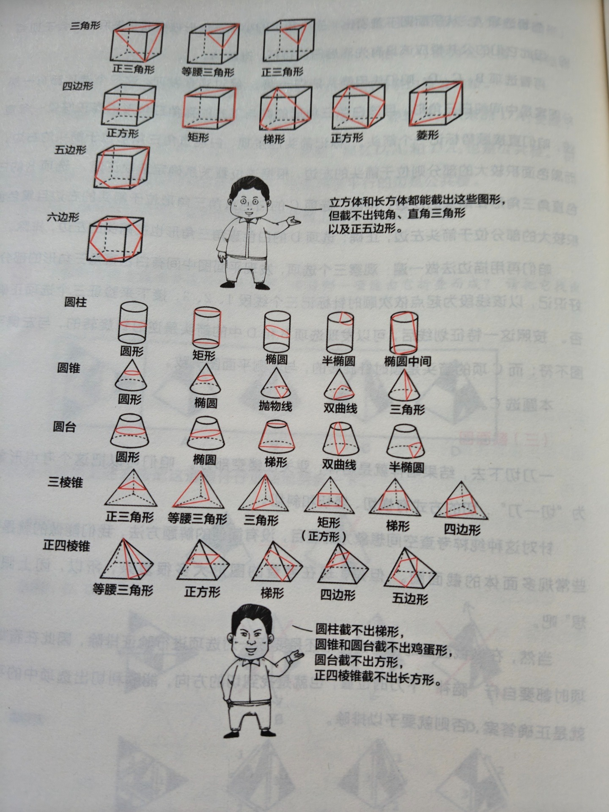

## 数字推理

### 基础数列

| 数列类型       | 定义/特点                     | 示例                                   |
| :------------- | :---------------------------- | :------------------------------------- |
| **等差数列**   | 后项与前项的差为常数          | 1, 3, 5, 7, 9, ...                     |
| **等比数列**   | 后项与前项的比为常数          | 1, 2, 4, 8, 16, ...                    |
| **质数数列**   | 由所有质数按顺序排列          | 2, 3, 5, 7, 11, 13, ...                |
| **周期数列**   | 按固定周期重复出现            | 1, 3, 5, 1, 3, 5, ...                  |
| **简单幂次数列** | 自然数的平方、立方等          | 平方：1, 4, 9, 16, ... 立方：1, 8, 27, 64, ... |
| **简单递推数列** | 后项由前项通过运算得到        | 递推和：1, 2, 3, 5, 8, 13, ... 递推差：86, 52, 34, 18, 16, 2, 14, -12, ... 递推积：1, 2, 2, 4, 8, 32, 256, ... 递推商：1, 2, 1/2, 4, 1/8, 32, ... |

### 多重数列

特点：数字比较多，有时候会出现两个括号

解题思路:

- 把数拆开看
- 奇数项和偶数项分别呈规律
- 把数字两两看成一组，简单计划后出现规律

### 分数数列

1. 观察整体趋势
2. 趋势相同 -> 要么分子、分母单独成规律，要么分子分母合在一起成规律
3. 趋势有波动（忽大忽小） -> 可把变换项进行约分以获得规律

### 做商数列

1. 若相邻的数字间存在倍数关系
2. 两两做商
3. 再看是哪种基础数列

### 幂次数列

1. 数字本身是幂或数字附近有幂
2. 改成幂的形式
3. 观察底数和幂的规律

### 图形数列

1. 圆形/三角形: 找周边数字与中间数字数字的运算关系
2. 方格形：按同行、同列等规律“凑大数”

### 多级数列

这类数列中的数字变化较为平稳，一般通过两两作差或求和，得出新的规律，进而选出正确选项。这里要注意一个细节：作差的方向要保持一致。

### 递推数列

特点是表面规律不明显，核心是通过数字间的运算（加、减、乘、除、幂、倍等）来寻找规律。

解题步骤：
1. 观察数字：初步判断可能的运算方式。
2. 寻找规律：选取数列中的几项，尝试不同运算组合，找到递推关系。
3. 验证规律：将找到的规律代入其他数字，验证其一致性。

| 运算类型 | 核心规律 | 典型示例 | 解题提示 |
| :--- | :--- | :--- | :--- |
| **递推和** | 从第三项起，每一项 = 前两项之和 | 1, 2, 3, 5, 8, 13... | 数列增长平缓，后项 ≈ 前两项之和 |
| **递推差** | 从第三项起，每一项 = 前两项之差 | 86, 52, 34, 18, 16, 2... | 数列有增有减，后项 ≈ 前两项之差 |
| **递推积** | 从第三项起，每一项 = 前两项之积 | 1, 2, 2, 4, 8, 32... | 数列增长迅猛，后项 ≈ 前两项之积 |
| **递推商** | 从第三项起，每一项 = 前两项之商 | 1, 2, 1/2, 4, 1/8... | 数列波动大，后项 ≈ 前两项之商 |
| **倍数递推** | 每一项 = 前一项 × 倍数 ± 修正项 | 2, 5, 11, 23, 47... | 后项 ≈ 前一项的倍数关系 |
| **幂次递推** | 每一项 = 前一项的幂次 ± 修正项 | 2, 5, 26, 677... | 后项 ≈ 前一项的平方/立方 |

**使用技巧**：

1.  **先看趋势**：增长平缓优先试“和”；增长迅猛优先试“积”或“幂”；波动大优先试“商”或“差”。
2.  **修正项**：如果直接运算不成立，尝试加上或减去一个简单的修正项（如 +1, -2）。
3.  **多试几项**：用前三项验证规律，再用第四项确认，避免偶然巧合。

## 图形推理

图形推理的核心是**掌握常见规律+按题型锁定观察逻辑**，不同出题形式对应不同的解题路径，核心总结如下：

核心前提：图形变化规律本身并不复杂，难点在于图形掺杂导致的视觉干扰；对图形不敏感的情况下，可通过**实战积累技巧**突破。

五大出题形式及解题逻辑：

| 出题形式 | 核心解题步骤 | 关键观察技巧 |
| :--- | :--- | :--- |
| **一组图** | 先从左至右依次观察，无规律则隔空跳着看 | 例：“1，3，5”“2，4，6”式间隔规律 |
| **二组图** | 第一组图找规律 → 第二组图验证规律 | 两组规律可相似（如一组顺时针、一组逆时针） |
| **九宫格** | 先找规律（第一行/列）→ 再验证（第二行/列）→ 最后应用（第三行/列） | 优先横看、竖看；极少情况按“米”“S”“O”形顺序观察 |
| **分组分类** | 分析每组图形特征，将具有**相同规律**的图形归为一组 | 聚焦图形的属性、数量、位置等核心特征的共性 |
| **空间类** | 依托空间想象能力，结合题型特征分析 | 涉及六面体、四面体、截面图、立体拼合、三视图；需通过多练强化空间思维 |

### 图形位置

图形位置分为**动态位置**和**静态位置**两大类，常考的是动态位置。

动态位置（核心考点）：
- **特点**：图形组成元素相同，仅位置发生变化。
- **三种考察形式**：
  1.  **平移**：元素按上下、左右、对角线做直线运动，或按顺/逆时针方向移动。移动步数可以是固定的，也可以是递增的（如依次走1、2、3步）。
  2.  **旋转**：元素按一定角度（常见45°、60°、90°、120°、180°等）做顺时针或逆时针运动。
  3.  **翻转**：元素上下、左右沿着对称轴“折过去”。

静态位置：
- **特点**：图形一般不规则，但整体辨识度较高。
- **四种考察形式**：
  1.  **相离**：图形无公共点，包括外离和内含。
  2.  **相连**：图形有连接点，包括点连接（相切）和线连接。
  3.  **相交**：图形之间有公共区域，需关注相交区域的交点、形状和边数等。
  4.  **相同元素排列**：包括直线排列（相邻、相间）和环状排列（相邻、相对）。

### 图形样式

特点是图形元素相似

| 考点类型 | 核心原则/规律 | 常见表现形式 | 解题提示 |
| :--- | :--- | :--- | :--- |
| **元素重复** | 识别重复模式 | 图形整体、边框、内容等重复出现 | 重点观察重复元素的位置和数量变化 |
| **加减求同异** | 图形之间做加减法 | 图形合并/拆分，保留相同/不同部分 | 求同：留相同；求异：留不同，类似图形加减法 |
| **叠加运算** | 元素叠加产生新元素 | 黑白运算（如“黑+白=白”） | 注意：“黑+白”≠“白+黑”，需按题干规则 |
| **元素转化** | 元素间存在倍数关系 | 如☆ = 2×△ | 找到元素间的换算比例，统一成一种元素 |

### 图形属性

特点是图形元素组成不相同、不相似，核心考查图形的内在属性

| 考点类型 | 核心内容 | 常见考查点 |
| :--- | :--- | :--- |
| **对称性** | - 轴对称：沿一条直线折叠后两边完全重合 - 中心对称：绕中心点旋转180°后与原图重合 - 既中心对称又轴对称 | 对称轴的方向（水平、竖直、斜向）、数量；判断对称类型 |
| **曲直性** | - 全直线图形：仅由直线构成 - 全曲线图形：仅由曲线构成 - 曲直混合图形：同时包含直线和曲线 | 区分图形的线条构成类型 |
| **开闭性** | - 全封闭图形：边界完全闭合，无任何开口 - 全开放图形：边界不闭合，存在开口 - 半开放半封闭图形：既有封闭区域又有开口 | 判断图形的封闭/开放状态 |

### 图形数量

图形数量类题目的**判定前提**是：图形组成元素不同，且无属性规律时，优先考虑数量规律。核心考查五大维度：

| 核心维度 | 细分考点 | 关键观察点 |
| :--- | :--- | :--- |
| **点** | 交点、顶点、切点、端点（出头点）、大黑点数 | 重点关注曲线与直线的交点，可单独成规律 |
| **线** | 直线、曲线、一笔画 | 数线条数量，或判断图形能否一笔画成 |
| **角** | 直角、锐角、钝角 | 数特定类型角的数量，关注角的属性 |
| **面** | 封闭空间 | 考查面的形状、相同形状面的个数、最大面的形状与属性 |
| **元素** | 小元素的种类、个数、部分数 | 区分元素类型，数个数，判断独立部分数量 |

解题关键：
1. **先定性后定量**：先确定属于点、线、角、面、元素中的哪一类，再针对性计数。
2. **特殊优先**：遇到曲线与直线结合，优先数曲直交点；遇到复杂图形，优先试一笔画或面的数量。
3. **细节关注**：面的考点需兼顾“数量”与“形状属性”，元素考点需区分“种类”与“部分数”。

### 图形关系

图形关系的核心是判断两个图形间的**位置关系**，主要分为**相离**和**相交**两大类，其中**相交**是考查重点。

核心分类与考点层级：

| 基础关系 | 细分类型 | 核心考查维度 |
| :--- | :--- | :--- |
| **相离** | 无公共部分 | 较简单，极少单独考查 |
| **相交** | **交于点** | 图形仅以点接触，无公共边/面 |
| | **交于线** | 1. 数量：相交边的条数 2. 长短：相交边为长边或短边 3. 整体/部分：相交边是完整边或部分边 |
| | **交于面** | 1. 形状：相交区域的几何形状 2. 数量：相交面的个数 3. 属性：相交面的对称/曲直等属性 |

解题逻辑：
1. **先判大类**：首先确定图形是“相离”还是“相交”；
2. **再定细分**：若为相交，进一步判断是交于**点**、**线**还是**面**；
3. **最后量化**：针对细分类型，从数量、形状、长短等维度提取规律。

### 图形功能

图形功能类题目，核心是识别**黑点、白点、箭头、线、小图形（三角、圆）**等功能元素，它们的作用是对图形中的其他元素进行标注或指示，主要考点如下：

1. 点（黑点、白点）
- **方位**：标注点在图形中的位置（如在角上、边上、内部）。
- **空间**：标注点所在的封闭区域或空间位置。
- **特征**：标注点所在图形的特征（如角、线、点等）。

2. 箭头（线）
- **方向**：指示图形的旋转、移动或指向方向。
- **元素**：指示箭头指向的图形元素。
- **关系**：指示平行或垂直等位置关系。

3. 线
- **连接**：连接不同的图形元素，形成特定的结构或关系。

### 空间重构

- 六面体
    - 看公共边
    - 看公共点
    - 画箭头
    - 画边法
    - 移动法

- 四面体
    - 排除法
    - 公共边
    - 箭头法
    - 画边法

- 截面图
    

- 视图（注意图形之间的分界线及它们之间的先后顺序）
    - 主视图（前视图）
    - 上视图
    - 左视图
    - 右视图
- 拼合
    - 立体拼合
    - 平面拼合

## 定义推理

**出题方式**：题目给出一个或多个定义，要求从四个选项中选出符合或不符合该定义的选项，本质考查阅读理解能力，关键在于挖掘题目中的所有要素。

**重点关注信息**：
1.  **主体和客体**：主体是行为发起者，客体是行为对象。
2.  **定语和状语**：起到限定、解释关键信息的作用，需高度重视。
3.  **标点符号**：如句号、冒号、破折号、括号、顿号、分号等，可辅助划分信息层次。

**解题原则**：
1.  **强化审题**：标注关键信息，看清问题是“符合”还是“不符合”，以及是单定义还是多定义。
2.  **不做联想**：严格以题目内容为准，避免个人主观认识干扰判断。
3.  **择优选择**：当选项差异不明显时，通过比较选出最优解。

## 类比推理

**考查方式**：
- 两词型：A : B
- 三词型：A : B : C
- 填空型：A 对于（ ）相当于（ ）对于 B

**常考关系类型**：
1.  **逻辑关系**：全同、并列（矛盾、反对）、包含、交叉、对应、全异、条件、因果等。
2.  **语义关系**：近义、反义、比喻象征义等。
3.  **语法关系**：主谓、主宾、动宾、偏正等。

**解题特点与注意事项**：
- 类比推理是**假设性推理**，无需追求“完全合理”，找到相似关系即可。
- 常与**常识判断**结合，对考生知识面要求更高。
- 难度提升后，常需进行**二级辨析**，即通过拆词、研究细节来确定最优答案。
- 类比有点像“对对子”，需要关注词与词之间的对应和匹配。

|关系类型|核心特征|判断技巧|典型示例|
| ---- | ---- | ---- | ---- |
|**全同关系**|概念外延完全等同，可划等号|造句验证：A是B，且B是A|① 番茄：西红柿 ② 首都：北京|
|**并列关系** （矛盾/反对）|矛盾关系：非此即彼，无第三者 反对关系：存在第三者，范围并列|矛盾：除A外无B； 反对：A、B之外还有C|矛盾：男人：女人 反对：苹果：香蕉|
|**包含关系** （种属/组成）|种属：A属于B的一种 组成：A是B的组成部分|种属：A是B的一种； 组成：A是B的一部分|种属：老虎：哺乳动物 组成：轮胎：汽车|
|**交叉关系**|概念外延有重合，也有独立部分|造句验证：有的A是B，有的A不是B，有的B是A|青年：教师 党员：学生|
|**对应关系**|词项间通过某种关联形成匹配|结合常识/逻辑找唯一/或然联系|功能：手机：通话 材料：面粉：馒头 因果：下雨：地面湿|
|**全异关系**|概念之间没有相同的属概念，词和词之间“八竿子打不着”|||
|**条件关系**|如果A就一定B，此时A是B的充分条件；如果没有A就一定没有B，此时A是B的必要条件|||
|**因果关系**|若A是B的因，则B是A的果|||
|**语义关系** （近义/反义/象征）|近义：含义相近；反义：含义相反 象征：用具体代抽象/特定表含义|近义：开心：愉悦 反义：前进：后退 象征：鸽子：和平|
|**语法关系** （主谓/动宾/偏正）|主谓：主体+动作 动宾：动作+对象 偏正：修饰+中心语|分析词性和语法结构|主谓：学生：学习 动宾：打扫：教室 偏正：美丽：花朵|

当一级判断无法锁定唯一答案时，从以下维度进一步辨析：
1. **词性**：名词（具体/抽象）、动词、形容词
2. **感情色彩**：褒义、贬义、中性
3. **范畴**：自然/人工、古代/现代、具体/抽象
4. **程度**：轻微/强烈、初级/高级
5. **细节特征**：形状、材质、功能侧重点

## 逻辑判断

**题型定位**：
- 属于逻辑判断中难度较高的必考题型，常与其他推理方式结合考查。
- 题干中会出现明显的逻辑关联词，解题核心是**先翻译，再推理**，严格依据公式，避免主观臆断。

### 翻译推理

#### 一、充分条件（前推后）
- **典型关联词**：如果…那么…、只要…就…、所有…都…、要想…必须…、若…则…、为了…一定…、…是…的充分条件
- **逻辑公式**：`A → B`（A是B的充分条件，B是A的必要条件）
- **推理规则**：
  - 肯前必肯后：`A → B`
  - 否后必否前：`¬B → ¬A`（逆否等价）
  - ❌ 否前/肯后：`¬A` 不能推 `¬B`，`B` 不能推 `A`

---

#### 二、必要条件（后推前）
- **典型关联词**：只有…才…、不…不…、除非…否则不…、…是…的必要条件/基础/前提
- **逻辑公式**：`B → A`（A是B的必要条件）
- **推理规则**：与充分条件一致，遵循“肯前必肯后，否后必否前”

---

#### 三、且关系（A ∧ B）
- **含义**：A和B同时成立
- **典型关联词**：和、且、不仅…而且…、虽然…但是…
- **推理规则**：
  - 全真才真，一假则假
  - `¬(A ∧ B) = ¬A ∨ ¬B`（德摩根定律）

---

#### 四、或关系（A ∨ B）
- **含义**：A和B至少一个成立
- **典型关联词**：或者…或者…、至少一个
- **推理规则**：
  - 一真则真，全假才假
  - `¬(A ∨ B) = ¬A ∧ ¬B`（德摩根定律）
  - 否定肯定式：`A ∨ B`，若 `¬A`，则 `B`

---

#### 五、要么…要么…（二选一）
- **含义**：A和B有且仅有一个成立
- **推理规则**：
  - 一真一假才成立，全真/全假都不成立
  - 否定一个，必肯定另一个；肯定一个，必否定另一个

---

常见等价关系：
| 原命题 | 等价命题 |
| :--- | :--- |
| `A → B` | `¬B → ¬A`（逆否等价） |
| `¬(A ∧ B)` | `¬A ∨ ¬B` |
| `¬(A ∨ B)` | `¬A ∧ ¬B` |
| `A ∨ B` | `¬A → B` |

### 分析推理

**题型特征**：
题目给出一组对象和相关信息，要求将对象与信息进行匹配或排序。

常用解题方法:
1. **排除法**✅
   - 适用场景：题干信息为真且选项信息充分。
   - 操作：用已知条件逐一排除不符合的选项，直至选出正确答案。

2. **代入法**🔄
   - 适用场景：题干信息有真有假。
   - 操作：将选项代入题干验证，符合条件的即为正确答案。

3. **最大信息法**📊
   - 适用场景：题目中某个信息出现次数最多。
   - 操作：以出现次数最多的信息为切入点进行推理。

4. **确定信息法**🎯
   - 适用场景：题干存在明确的确定信息。
   - 操作：以确定信息为起点，逐步推导其他信息。

5. **矛盾法**⚔️
   - 适用场景：选项或条件存在一真一假的矛盾关系。
   - 操作：利用矛盾关系快速锁定真假，辅助解题。

6. **假设法**🤔
   - 适用场景：信息不足，无法精准确定答案。
   - 操作：合理假设某一条件成立，推导验证是否符合题意。

7. **表格法**📋
   - 适用场景：情况复杂、信息较多。
   - 操作：通过画表格梳理对象与信息的对应关系，简化推理。

---

常见矛盾关系补充：
1. **逻辑命题矛盾**：
   - “A” ↔ “非A”
   - “A且B” ↔ “非A或非B”
   - “A或B” ↔ “非A且非B”
   - “A→B” ↔ “A且非B”

2. **模态/量词矛盾**：
   - “所有” ↔ “有些不”
   - “有些” ↔ “所有不”
   - “可能” ↔ “必然不”
   - “必然” ↔ “可能不”

### 加强论证

**题型特征**：
- 常考题型，提问关键词包括“支持”“加强”“前提”“假设”等。
- 解题思路分两步：一是找准论点和论据；二是辨析选项，找出最准确的答案。

加强方式（按力度排序）:
1.  **加强论点**：换种方式重复论点，直接强化结论。
2.  **加强论据**：肯定原有论据或增加新论据，增强论证基础。
3.  **搭桥**：在论点和论据之间建立必然联系，消除逻辑断层，是力度较强的加强方式。
4.  **找准前提或必要条件**：指出“没它不行”，即如果该条件不成立，论点必然不成立。
5.  **强化因果**：排除其他支持论点的原因，保证只有题干给出的原因能推出论点。
6.  **举例强化**：举出符合题目要求的案例，增强说服力。
7.  **类比**：论证力度非常弱，属于假设推理，常作为优先排除项，需慎重使用。

加强论证常见选项陷阱速记表:

| 陷阱类型 | 核心特征 | 典型表现 | 识别技巧 |
| :--- | :--- | :--- | :--- |
| **无关选项** | 与论点/论据无逻辑关联 | 1. 讨论其他主体或话题 2. 引入不相关的背景信息 | 问自己：“这个选项能让结论更可信吗？” |
| **偷换概念** | 看似相关，实则改变核心含义 | 1. 将“健康”偷换为“长寿” 2. 将“销量”偷换为“利润” | 比对选项与题干的核心词语，看是否一致 |
| **诉诸权威** | 用专家/机构背书代替论证 | “某权威机构认为……”“专家表示……” | 权威观点≠有效论证，需看其是否有数据或逻辑支撑 |
| **诉诸无知** | 用“无法证明”来支持论点 | “没有证据表明A会导致B，所以A不会导致B” | 缺乏证据≠结论成立，这是典型的逻辑谬误 |
| **类比不当** | 用相似性代替必然性 | “A和B很像，A有C属性，所以B也有C属性” | 类比论证力度极弱，一般作为干扰项排除 |
| **因果倒置** | 将结果误认为原因 | 题干：A导致B；选项：B导致A | 注意时间先后和逻辑方向，避免颠倒因果 |
| **另有他因** | 提出其他可能的影响因素 | “可能是C导致了B，而不是A” | 这是削弱项，而非加强项，需注意区分 |
| **过度绝对** | 表述过于极端，超出范围 | “所有”“全部”“必然”等绝对化词语 | 题干若未使用绝对表述，选项过于绝对通常不选 |

避坑小口诀:
- 无关偷换先排除，权威类比要警惕。
- 因果倒置是削弱，过度绝对不选它。
- 前提必要是关键，搭桥加强力度大。

### 削弱论证

**题型特征**：
常考题型，提问关键词有“削弱”“质疑”“反驳”等。
解题思路和加强论证一致，解题方法则相反。

削弱方式（按力度排序）:
1.  **否定论点**：直接否定结论，是力度最强的削弱方式。
2.  **否定论据**：要么直接否定原有论据的真实性，要么增加反向论据来削弱。
3.  **拆桥**：切断论点和论据之间的逻辑联系，让论据无法支持论点。
4.  **削弱因果**：
    - 因果倒置：将题干的因果关系颠倒（题干说A→B，选项说B→A）。
    - 另有他因：提出其他可能导致结果的原因，削弱题干因果的唯一性。
5.  **否定前提**：指出题干论证的前提条件不成立，让整个论证失去基础。

快速解题步骤:
1.  **找论点和论据**：先定位题干的结论（论点）和支撑结论的依据（论据）。
2.  **判断削弱类型**：根据选项特征，判断属于否定论点、否定论据、拆桥、削弱因果还是否定前提。
3.  **选择最优选项**：优先选择力度最强的削弱方式（通常是否定论点）。

削弱论证的核心是通过否定论点、否定论据、拆桥、削弱因果、否定前提这五种方式，破坏题干的逻辑联系，从而达到削弱结论的目的。

### 归纳推理

**题型特征**：
- 选考题型，与翻译推理形式相仿，但题干无明显逻辑关联词。
- 提问方式主要为“由此（不能）可推出”，考查考生能否根据题干和选项的理解选出最优解。

解题原则:
1.  **话题一致**：选项与题干讨论的话题必须保持一致，避免偏离主题。
2.  **尊重题干**：严格依据题干内容，不进行过度引申或主观推断。
3.  **谨慎对待“绝对化”表述**：如“最、更、首要、绝对的”等，这类表述容易夸大或超出题干信息，需重点验证。
4.  **优先考虑可能性表述**：如“可能、有些、或许”等，这类表述更贴合归纳推理“从个别到一般”的逻辑，更易成为正确答案。

注意事项:
- 做归纳推理时，**不能进行翻译推理式的严格逻辑推导**，而是基于题干信息进行合理归纳和可能性推断。
- 选项若出现与题干矛盾、偷换概念或过度绝对的表述，应优先排除。

### 真假推理

**题型特征**：
- 考查频次较低，一般利用题目中的**矛盾关系**解题。
- 常见特征为“几人陈述，其中一真一假/只有一人说真话”等，核心是通过矛盾关系锁定真假范围。

解题核心:
1.  **找矛盾**：先在题干陈述中找到互为矛盾的两句话，这两句话必然一真一假。
2.  **定范围**：根据题干“只有一真”或“只有一假”的条件，判断其余陈述的真假性。
3.  **得结论**：由其余陈述的真假，推出最终结论。

---

**补充说明**：
关于矛盾关系的具体类型（如“A”与“非A”、“A且B”与“非A或非B”、“所有”与“有些不”等），在分析推理部分已有详细介绍，此处不再赘述。

### 集合推理

#### 1. 六个基本表述
这类题目用来判定集合之间的真假关系，有六个基础表述：
1. **所有S都是P**（全称肯定）：比如“所有的云彩都是白色的”
2. **所有S都不是P**（全称否定）：比如“所有的云彩都不是白色的”
3. **有的S是P**（特称肯定）：比如“有的云彩是白色的”
4. **有的S不是P**（特称否定）：比如“有的云彩不是白色的”
5. **某个S是P**（单称肯定）：比如“有一朵云彩是白色的”
6. **某个S不是P**（单称否定）：比如“有一朵云彩不是白色的”

#### 2. 关键概念：“有的”的含义
这里的**“有的”**是逻辑中的特殊概念，它的范围是**至少一个，最多全部**。
- 比如“有的云彩是白色的”，可能是1朵、几朵，也可能是所有云彩都是白色的。

#### 3. 常见真假关系（矛盾/反对）
- **矛盾关系**：
  - “所有S都是P” ↔ “有的S不是P”（必然一真一假）
  - “所有S都不是P” ↔ “有的S是P”（必然一真一假）
  - “某个S是P” ↔ “某个S不是P”（必然一真一假）
- **反对关系**：
  - “所有S都是P”和“所有S都不是P”：至少一假（不能同时为真）
  - “有的S是P”和“有的S不是P”：至少一真（不能同时为假）

这类题目核心是掌握**六个集合表述**、**“有的”的特殊含义**，以及**矛盾/反对关系的真假判定规则**，从而快速判断集合间的真假关系✅

### 解释原因

**题型特征**：
- 考查频次较低，核心任务是化解题干中看似矛盾的现象。
- 题干通常呈现一组**冲突或反常的事实**，要求找出合理的原因来解释这一现象。

核心解题思路（三步走）：
1. **找矛盾**：精准定位题干中存在的冲突点、反常现象或矛盾事实（这是解题的关键前提）。
2. **寻原因**：从选项中筛选能够合理解释该矛盾的选项，要求选项能同时兼顾矛盾的双方，而非只解释其中一方。
3. **择最优**：当多个选项均能解释矛盾、差异较小时，需遵循“择优原则”，选择解释力度最强、最贴合题干逻辑的选项。

解题关键提醒
- 正确选项需**兼顾矛盾双方**，不能只针对其中一方进行说明。
- 避免选择**无关选项**（与矛盾现象无逻辑关联）、**加深矛盾选项**（让冲突更明显）。

### 类似推理

**题型特征**：
- 题干给出一段推理，要求从选项中选出**推理方式或错误与题干一致**的选项。
- 核心原则：**只看形式，不看内容**，即只关注推理的结构、逻辑关系或逻辑错误，不考虑题干和选项内容本身的真假。

解题要点：
1.  **形式优先**：忽略题干和选项的具体内容，重点分析其逻辑结构（如充分条件、必要条件、三段论、逻辑谬误等）。
2.  **灵活处理**：题干的推理方式或错误可能涵盖本书所有内容，需要综合运用之前学过的逻辑知识进行判断。
3.  **匹配结构**：将题干的推理结构抽象化，再与选项逐一比对，找到结构或错误完全一致的选项。