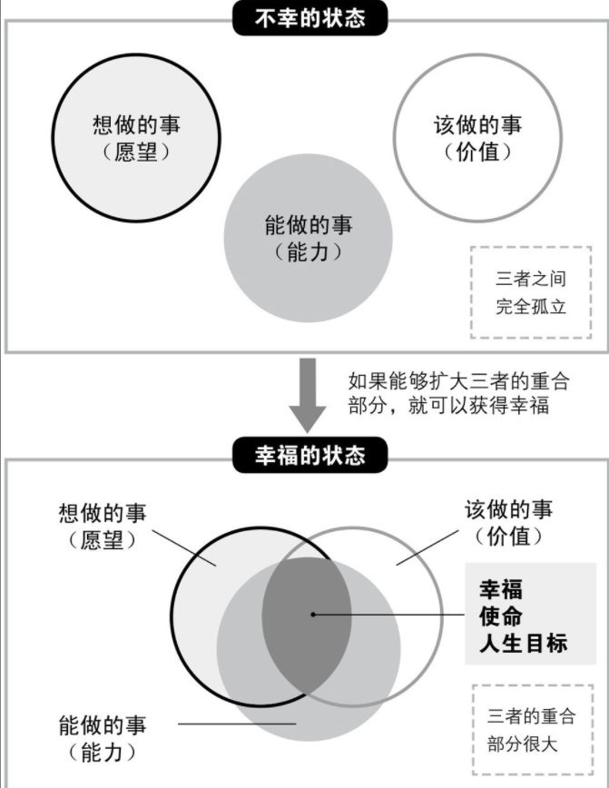

# 《10 人以下小团队管理手册》笔记

如何用人？对于主管职位，是个永恒的话题。

## 问题的背景

几十人、几百人的主管最重要的工作是决策与判断。

而 10 人以下团队主管会和下属混在一起工作，更需要处理和下属的关系，如何用人对于这类主管更为重要和困难

## 主管的职责是什么

### 认清自己的职责

主管：通过下属实现经营者的目标的人

关键点：`实现经营者的目标` 和 `通过下属实现`

### 主管不是传声筒

经营者的话要先消化再传达

> 比如，经营者可能只是提出了要做什么，主管要消化提出具体的方案再传达

为什么需要主管来传达

> 公司规模大，经营者的想法要想准确地传达给每个人基本不太可能，这就需要主管来解读和传达

主管的职责：根据每一名下属的能力水平来解释经营者的想法，活跃在现场，带领团队实现目标。

## 主管的工作这样做

### 主管的四项工作

- 制定方针
- 推进业务
- 掌控下属
- 协助领导

这些工作的基础是 “经营者的目标”

其中最重要的是员工管理

管理员工，首先得掌握他们的能力特点

- 掌握哪些技能
- 工作是否积极
- 性格怎样
- 埋头苦干型还是团队协作型
- 擅长哪些领域工作
- 习惯等待具体指示，还是自己全权负责

### 工作最拼的人不适合当主管

作为主管，一定要尽量降低自己的目标，用更多的精力专心支援下属

### 用人要看能力和意愿

根据能力和意愿调整用人策略

### 每个人都要定目标

目标不清晰，下属不行动

自发性目标：和下属交流一同设置的目标

半强制性目标：直接把目标分配给下属（针对缺乏责任感的下属）

### 目标管理分为三种

`目标管理` 的原意并不是 `管理目标`，而是 `使用目标进行管理`，其目的在于 `通过制定目标，使下属能够自发地工作`

`使用目标进行管理`，也可以看作 `制定目标` `过程评价` , 最后 `考核下属` 的过程

三种目标管理

### 目标就是必须完成的 “定额任务”

目标中的数字要有根据，让下属理解目标数值的含义

### 将 “团队力” 发挥到极致

为什么要组建团队？

> 为了把每个人的能力综合起来，形成更强大的力量

如何形成更强大的力量?

> 人尽其才，各得其所，发挥团队成员的强项，实现 1+1>=2

主管需要做什么？

> 主管的工作就是发现谁擅长什么、不擅长什么，并据此给每名下属量身定制合适目标和职责

### 公司目标与个人目标要一致

扩大公司目标和个人（下属）目标的重合度也是主管的工作

### 目标要随时调整

情况发生变化时，主管必须当机立断，迅速调整方向，并向下属说明自己的想法

不要担心 “朝令夕改”

### 眼光放长远，心态放平和

像家长一样守护下属

有些事情，只要站到高处才能看清

> 站在比现在所处位置高两级的地方看问题

站在更高的高度看问题，但是对待下属不能有居高临下的姿态

### 提前察觉 “中间事项”，立即采取补救措施

怎么察觉？

> 信息收集和自我提高

### 支援下属提高干劲和自信

不让下属感到 “被支援”

引导下属去思考，去解决问题，而不是直接给解决方案

### 表明对下属的期待

交办工作时，告诉下属 “你要取得什么样的结果”，而不是 “你要做什么”

### 评价下属要基于“事实”

没有中间过程的负面评价会失去下属的信任

要说清楚评价的根据

平时留意下属的行为和态度，以备考核时有理有据地评价

### 让下属自己汇报成绩

让下属自己汇报成绩时公正评价中不可或缺的一环

### 没有下属会百分百认同主管的评价

如何让下属认同你的评价？

> 关键在于沟通

### 目标制定、指导和评价的 6 个月周期

对于下属的指导和评价可以按照固定周期进行，在每个周期中重复以下三个步骤：

1. 制定目标
2. 让下属挑战目标
3. 给予评价

这个流程体系有助于高效地激发下属的干劲，提升工作业绩

制定目标

让下属挑战目标

给予评价

## 点燃下属的工作热情

### 通过倾听提升下属的工作动力

怎么倾听？

> 倾听下属的困扰，引导他思考解决方案

### 主管要谈梦想和愿景

### 通过引导下属的潜意识让他更加自信

方法：四行日记

## 主管的心胸和气魄

### 首先从改变自己开始

不要埋怨公司和下属

### 下属不是客户的奴隶

### 责任我来负 的真正含义

辞职不等于负责任

真正的负责: 损失多少，下次就赚回多少

### 用人的根本是 “发自真心地为下属着想”

### 不要批评，要发火

### 下属遇到困难时主管就要显身手

### 了解并支持下属的人生规划

### 教给下属工作与幸福的方程式

## 了解 FFS 理论，打造最强团队

