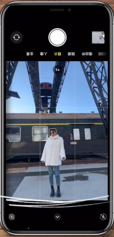
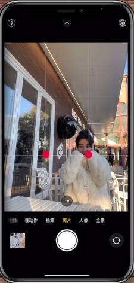
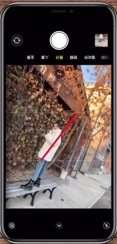

# 摄影技巧

## 人像照

首先打开照相的 `九宫格参考线`

握手机姿势： `手机倒立` + `顶部向内倾斜`

- 全身照：人的全身填充 `中间列的底部两格`

    

- 半身照和背影照： 拍照主体放在 `中间四个交叉点` 上

    

- 侧身照：`45%` 旋转屏幕，把腿放在九宫格的 `对角线` 上

    

[References](https://www.bilibili.com/video/BV19f4y1T7sK?spm_id_from=333.999.0.0)