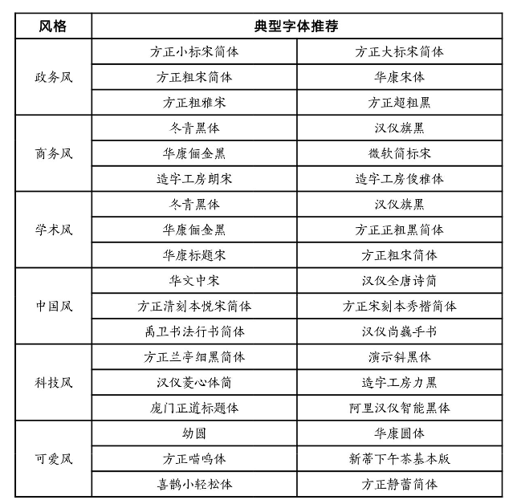
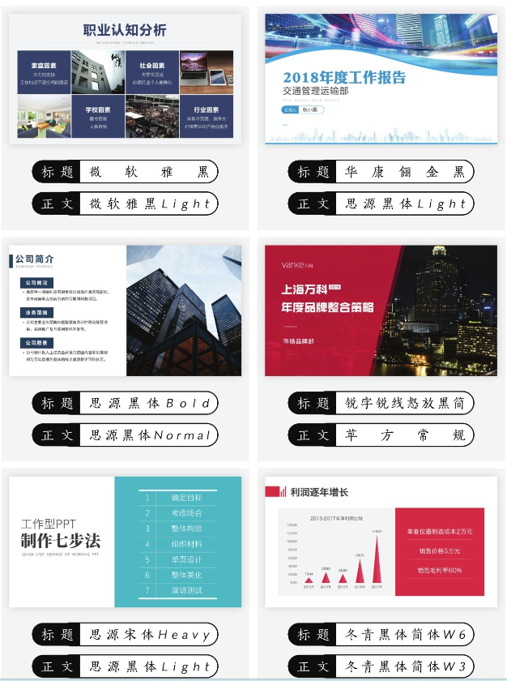
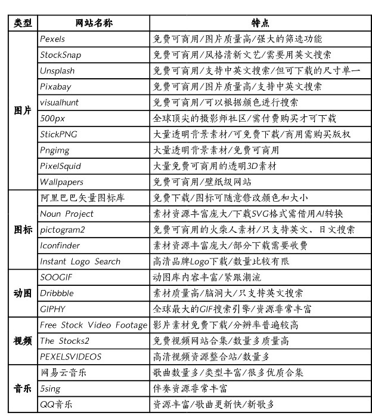

# 工作型 PPT

工作型PPT，唯“快”不破！利用有效的时间去创造更高的业务价值，再通过PPT来展现自己的成果。

工作型PPT的第一目的是沟通，能够将信息有效地传达给受众。

## 模板之快

## 美化之快

## 文字之快

字体风格气质

工作类PPT字体搭配

## 素材之快

素材资源网站:

## 配色之快

## 动画之快

## 图表之快

## 文案之快

## 逻辑之快

## 习惯之快

## References

- [工作量PPT该这样做](https://weread.qq.com/web/reader/99132ed0723fba5d9914194)