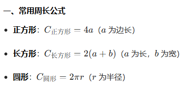
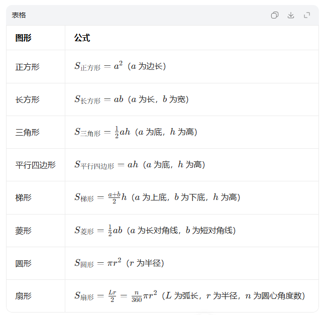

# 数量关系

## 基础方法

### 代入排除法

### 利用数字特性法

#### 奇偶性

- 和差奇偶性（**同偶异奇**）： `奇数 +/- 奇数 = 偶数` `偶数 +/- 偶数 = 偶数` `奇数 +/- 偶数 = 奇数`   
- 乘积奇偶性(**有偶为偶，双奇为奇**): `奇数 * 奇数 = 奇数` `奇数 * 偶数 = 偶数` `偶数 * 偶数 = 偶数`

#### 倍数特性

一、基础倍数表达形式
- 若 A/B = m/n,（m,n 互质，即 m/n 为最简分数），则：
  - A 是 m 的倍数，B 是 n 的倍数
  - A +/- B 是 m +/- n 的倍数
- 通用结论：若 a,b 能被 c 整除，则 a +/- b 也能被 c 整除

二、常见数的整除判定法则
1.  **2、5 及其次方**
    - 被 2/5 整除：末位数字能被 2/5 整除
    - 被 4/25 整除：末两位数字能被 4/25 整除
    - 被 8/125 整除：末三位数字能被 8/125 整除

2.  **3、9 整除判定**
    - 被 3 整除：各位数字之和能被 3 整除
    - 被 9 整除：各位数字之和能被 9 整除

纯整除问题（含“整除”“乘积”等关键词）：**优先考查 3、9 的整除性质**，其次是 2、5 及其次方的应用。

### 运用公式法

方程

### 枚举法

### 赋值法

## 工程问题

- 工作总量=工作效率*工作时间
- 工作效率=工作总量/工作时间
- 工作时间=工作总量/工作效率

## 行程问题

### 常规问题

1.  **基础公式**： 路程 = 速度 × 时间（s = vt）
2.  **比例关系**
    - 时间相同：路程与速度成正比
    - 速度相同：路程与时间成正比
    - 路程相同：速度与时间成反比
3. **单位换算**：
```tex
    1\ \text{米/秒} = 3.6\ \text{千米/时}
```
4.  **等距离平均速度公式**:  
```tex
\bar{v} = \frac{2v_1v_2}{v_1 + v_2}
```
> 适用场景：**两段路程相等**（如去程与返程、上坡与下坡等），已知两段速度，求全程平均速度。
> 当题目给出两个速度且行驶路程相同时，可直接套用**等距离平均速度公式**快速求解。

### 追及问题

**核心公式**：
```tex
\text{追击路程} = \text{速度差（大速度} - \text{小速度）} \times \text{追击时间}
```

> 适用于直线追及场景，可直接套用。

**环形运动追及特殊情况**:

1.  **同位置出发**：
    - 追上 N 次 = 速度快的一方超过慢的一方 N 圈
    - 追及距离 = N * 环形周长（即“套圈” N 次）
2.  **不同位置出发**：
    - 第一次追上：追及距离为初始间距
    - 之后每追上一次：速度快的一方多跑 **1个环形周长**（即多“套圈”1次）

### 相遇问题

两个主体**相向而行**，最终碰面，核心是利用**速度和**计算共同走过的路程。

**核心公式**:
```tex
\text{相遇路程} = \text{速度和} \times \text{相遇时间}
```

> 单次相遇可直接套用此公式。

**多次相遇规律**
1.  **直线运动**
    - 若全程为 s：
      - 第1次相遇：路程和 = 1s
      - 第2次相遇：路程和 = 3s
      - 第3次相遇：路程和 = 5s
      - **总结公式**：第 n 次相遇，两人路程和 = (2n-1)s

2.  **环形运动**
    - **同位置出发**：n 次相遇 = 两人共同走完 n 个环形周长
    - **不同位置出发**：第一次相遇后，之后每多相遇1次，就多共同走完1个环形周长

### 流水问题

**核心公式**:
- 顺水速度 = 船速 + 水速
- 逆水速度 = 船速 - 水速

## 利润问题

| 类别       | 公式                                                                 |
|------------|----------------------------------------------------------------------|
| 基础关系     | 售价 = 成本（进价） + 利润                                           |
| 利润率       | 利润率 = 利润 ÷ 成本 = (售价 − 成本) ÷ 成本 = 售价 ÷ 成本 − 1         |
| 折扣计算     | 售价 = 定价 × 折扣（例：打6折 → 售价 = 定价 × 60%）                  |
| 折扣率计算   | 折扣率 = 减让价格 ÷ 定价 → 售价 = 定价 × (1 − 折扣率)                |
| 总量公式     | 总成本 = 单个成本 × 数量<br>总利润 = 单个利润 × 数量<br>总销售额 = 单个售价 × 数量 |

解题方法: 
1.  **首选方程法**：题目问什么就设什么为未知数，围绕收入、成本、利润列等式。
2.  **备选赋值法**：条件合适时，给成本/定价赋具体数值简化计算。
3.  **特殊枚举法**：少数情况用枚举验证答案。
4.  **分批销售关键**：总销售收入 = 第一部分收入 + 第二部分收入 + ……，抓销售收入列方程。

易错点提醒:
- ❌ 混淆**折扣**和**折扣率**：折扣是实际售价占定价的比例，折扣率是优惠部分占定价的比例，二者相加为100%。
- ❌ 利润率计算基数：利润率永远是**利润÷成本**，不是利润÷售价。

## 溶液问题

核心公式：
- **溶液 = 溶质 + 溶剂**
- **浓度 = (溶质 / 溶液) × 100%**
- **溶质 = 浓度 × 溶液**

解题关键在于**溶质相对稳定**，可抓住“**溶质不变**”这一核心突破，有时也可将溶质设为特殊值简化计算。

直观理解（以奶茶为例）：
- **溶质**：奶茶中的茶底、奶粉等有效成分
- **溶剂**：水
- **溶液**：整杯奶茶

## 排列组合与概率问题

一、排列（与顺序有关）
- **定义**：从 n 个不同元素中取出 m（m <= n）个元素，按一定顺序排成一列。
- **核心公式**：
    ```tex
    A_n^m = P_n^m = \frac{n!}{(n-m)!} = n(n-1)(n-2)\cdots(n-m+1)
    ```
- **计算要点**：从 n 开始连续取前 m 个数相乘。
- **例子**：5人中选3人站队，方式有 
```tex
A_5^3 = 5 \times 4 \times 3 = 60
```
种。

---

#### 二、组合（与顺序无关）
- **定义**：从 n 个不同元素中取出 m（m <= n）个元素，不考虑顺序。
- **核心公式**：
```tex
C_n^m = C_n^{n-m} = \frac{n!}{(n-m)! \, m!} = \frac{n(n-1)\cdots(n-m+1)}{m(m-1)\cdots 2 \times 1} = \frac{A_n^m}{A_m^m}
```
- **性质**：
```tex
C_n^m = C_n^{n-m}
```
（如 
```tex
C_5^2 = C_5^3
```
）。
- **例子**：5人中选3人参加活动，方式有 
```tex
C_5^3 = \frac{5 \times 4 \times 3}{3 \times 2 \times 1} = 10
``` 
种。

| 类型 | 核心区别 | 公式特点 |
|------|----------|----------|
| 排列 | **强调顺序**，顺序不同则结果不同 | 分子为连续乘积，分母无 m! |
| 组合 | **不强调顺序**，只看选取的元素 | 分子为连续乘积，分母为 m! |

排列组合常见题型:
| 题型特征 | 典型例子 | 解题方法 | 公式 |
|----------|----------|----------|------|
| **排队/排序问题**（有顺序要求） | 5人排队、数字排列、座位安排 | 排列法 | A_n^m = \frac{n!}{(n-m)!} |
| **选人参会/组队**（无顺序要求） | 从10人中选3人开会、选班委 | 组合法 | \(C_n^m = \frac{n!}{m!(n-m)!}\) |
| **分步选取+排序** | 先选3人，再给这3人分配不同岗位 | 先组合后排列 | \(C_n^m \times A_m^m = A_n^m\) |
| **对称组合** | 选2人/选\(n-2\)人结果相同 | 利用性质 \(C_n^m = C_n^{n-m}\) | 简化计算（如 \(C_{10}^8 = C_{10}^2\)） |
| **相邻元素** | 甲乙必须相邻的排队方式 | 捆绑法 | 把相邻元素看作1个整体，再整体排列 |
| **不相邻元素** | 甲乙不能相邻的排队方式 | 插空法 | 先排其他元素，再将不相邻元素插入空隙 |
| **环形排列** | 圆桌就座 | 固定1人定位，其余排列 | \(A_{n-1}^{n-1}\) |
| **重复元素排列** | 用3个A、2个B拼单词 | 除法去重 | \(\frac{n!}{n_1!n_2!\cdots}\)（\(n_1,n_2\)为重复元素个数） |

快速判断技巧：
1.  **看是否有顺序**：
    -   有顺序（位置/角色不同）→ 用**排列** \(A_n^m\)
    -   无顺序（只看人选/组合）→ 用**组合** \(C_n^m\)
2.  **看是否分步**：
    -   先选再排 → 先组合后排列（\(C_n^m \times A_m^m\)）
    -   直接排 → 排列公式
3.  **看是否有特殊限制**：
    -   相邻/不相邻 → 捆绑/插空法
    -   重复元素 → 除法去重

## 最值问题

最值问题是数量关系中易拿分的高频题型，**最不利情况题** 适合用**抽屉原理**解决。

抽屉原理核心定义：
将**多于 n 个**的物体放到 n 个抽屉里，则至少有一个抽屉里的东西不少于2件。
- 例子：把5个苹果放进4个抽屉，先在每个抽屉放1个苹果（共4个），剩余1个苹果无论放入哪个抽屉，该抽屉都有2个苹果，因此至少有一个抽屉的苹果数为2。

解题思路：
1.  **列出“最不利情形”**：构造出刚好不满足条件的极端情况（即离成功只差一步的情况）。
2.  **“加1”得结果**：在最不利情形的基础上再加1，就是保证满足条件的最小值。

## 容斥问题

容斥问题本质是**计数问题**，核心是剔除重复计算的部分，保证统计结果准确。
题目会给出多个元素，其中部分元素重复参与了不同活动，需要去除重复计数后得到真实的参与活动总元素数。

基础公式：
```tex
\text{元素总数} - \text{未参加活动元素数} = \text{参加活动元素数} = \text{参加任意活动的总元素数} - \text{重复计数元素数}
```

核心逻辑：**把重复计数的部分剔除出去**，避免多算。

直观理解:
- **元素总数**：所有研究对象的总量
- **未参加活动元素数**：完全不参与任何活动的对象数量
- **参加活动元素总数**：参与至少一项活动的对象真实数量
- **重复计数元素数**：同时参与多项活动、被重复统计的对象数量

## 几何问题

### 平面几何





### 立体几何

一、正方体
- **棱长总和**：\(L = 12a\)（\(a\) 为棱长）
- **表面积**：\(S = 6a^2\)
- **体积**：\(V = a^3\)

二、长方体
- **棱长总和**：\(L = 4(a+b+h)\)（\(a\) 长，\(b\) 宽，\(h\) 高）
- **表面积**：\(S = 2(ab+ah+bh)\)
- **体积**：\(V = abh\)

三、圆柱
- **底面积**：\(S_{\text{底}} = \pi r^2\)
- **侧面积**：\(S_{\text{侧}} = 2\pi rh\)（\(r\) 底面半径，\(h\) 高）
- **表面积**：\(S_{\text{表}} = 2\pi r^2 + 2\pi rh\)
- **体积**：\(V = \pi r^2 h\)

四、圆锥
- **底面积**：\(S_{\text{底}} = \pi r^2\)
- **侧面积**：\(S_{\text{侧}} = \pi r l\)（\(l\) 为母线长，\(l = \sqrt{r^2+h^2}\)）
- **表面积**：\(S_{\text{表}} = \pi r^2 + \pi r l\)
- **体积**：\(V = \frac{1}{3}\pi r^2 h\)

五、球
- **表面积**：\(S = 4\pi r^2\)
- **体积**：\(V = \frac{4}{3}\pi r^3\)

六、常用解题理念
1.  **等体积转化**：比如把不规则物体浸入水中，用排开水的体积求物体体积。
2.  **展开图问题**：圆柱/圆锥侧面展开后是矩形/扇形，可结合平面几何求最短路径。
3.  **切割与拼接**：切割后表面积会增加切面面积，拼接则减少重叠面面积。

### 解题方法

- 辅助线
- 等比例缩放
- 几何最值问题
- 一笔画问题

## 数列问题

考试中**等差数列是重点**，等比数列考查概率极低。

等差数列核心公式：

1.  **通项公式**：
    ```tex
    a_n = a_1 + (n-1)d
    ```
    （\(a_1\) 为首项，\(d\) 为公差，\(n\) 为项数）

2.  **求和公式**：
    \[
    S_n = \frac{n(a_1 + a_n)}{2}
    \]

3.  **对称公式**：
    若 \(m+n = i+j\)，则 \(a_m + a_n = a_i + a_j\)
    例：\(a_7 + a_3 = a_1 + a_9\)（因为 \(7+3=1+9\)）

4.  **平均数与等差中项**：
    - 平均数：\(\frac{a_1 + a_n}{2}\)
    - **奇数项**：平均数 = 等差中项，\(S_n = n \times \text{等差中项}\)
    - **偶数项**：平均数 = 中间两项的平均数，\(S_n = n \times \frac{\text{中间两项之和}}{2}\)

等比数列核心公式:
1.  **通项公式**：
    \[
    a_n = a_1 \times q^{n-1}
    \]
    （\(a_1\) 为首项，\(q\) 为公比，\(q \neq 1\)）

2.  **求和公式**：
    \[
    S_n = \frac{a_1(1 - q^n)}{1 - q} \quad (q \neq 1)
    \]

3.  **对称公式**：
    若 \(m+n = i+j\)，则 \(a_m \cdot a_n = a_i \cdot a_j\)

四、解题关键提示:
- 做等差数列题时，**优先利用等差中项和对称性质**，能大幅简化计算。
- 奇数项等差数列直接用“总和 = 项数 × 等差中项”，计算更快。

## 牛吃草问题

一、题型本质

由牛顿提出，核心是**“此消彼长”**：存量（如原有草量）随时间变化，同时存在消耗（如牛吃草）与新增（如草生长）两种力量，最终求存量耗尽的时间或相关变量。
可演变为：排队买票、窗口办业务、采砂挖矿、植被开采等同类问题。

二、核心公式
```tex
y = (N - x) \times T
```
- **y**：现有存量（如原有草量）
- **N**：减少存量的变数（如牛的数量）
- **x**：新增存量（如草的生长速度）
- **T**：全部存量消失的时间

三、关键逻辑
1.  **公式变形**：可推导为 \(T = \frac{y}{N - x}\)，用于直接计算时间；也可联立多组条件求解 \(y\)、\(x\) 等未知量。
2.  **“吃不完”的条件**：当 \(N ≤ x\) 时，消耗速度 ≤ 新增速度，存量会持续增加，永远无法耗尽。
3.  **解题思路**：先根据两组“牛数-天数”条件列方程，求出 \(x\)（新增速度）和 \(y\)（原有存量），再代入求解目标问题。

四、典型应用场景
- 经典场景：几头牛吃一片匀速生长的草地，求吃完天数/最多可养牛数。
- 衍生场景：
  - 排队问题：窗口办理业务，每分钟新增人数固定，求开几个窗口可在指定时间内清空队伍。
  - 资源开采：矿场原有储量+新生成量，求开采队多久能采完。

## 植树问题

一、核心公式（总长、间隔、棵数关系）

| 植树类型               | 公式                                      |
|------------------------|-------------------------------------------|
| **两端不植树**         | 总长 = 间隔 × (棵数 + 1)                  |
| **一端不植树（环形）** | 总长 = 间隔 × 棵数                        |
| **两端植树**           | 总长 = 间隔 × (棵数 - 1)                  |

二、公式变形与记忆技巧
- 已知总长和间隔，求棵数：
  - 两端植树：\(\text{棵数} = \frac{\text{总长}}{\text{间隔}} + 1\)
  - 一端不植树（环形）：\(\text{棵数} = \frac{\text{总长}}{\text{间隔}}\)
  - 两端不植树：\(\text{棵数} = \frac{\text{总长}}{\text{间隔}} - 1\)
- 记忆口诀：**两端植树“+1”，两端不植“-1”，一端/环形“不加不减”**。

三、典型应用场景
- 直线型道路两侧种树、路灯安装
- 圆形/椭圆形花坛种树（等价于一端不植树）
- 楼梯台阶数、排队间隔等同类“间隔计数”问题

## 方阵问题

### 一、实心方阵

1. 正方形实心方阵（N排N列）

- **总人数**：\( \text{总人数} = N^2 \)
- **最外层人数**：\( \text{最外层人数} = 4N - 4 \)（4个顶点重复计数，需减去）
- **每层人数**：\( \text{每层人数} = \text{该层每边人数} \times 4 - 4 \)
- **相邻层规律**：每向内一层，每边人数少2，总人数少8

2. 长方形实心方阵（M排N列）

- **总人数**：\( \text{总人数} = M \times N \)
- **最外层人数**：\( \text{最外层人数} = 2(M + N) - 4 \)

### 二、空心方阵

- **总人数**：
  1.  大实心方阵人数 − 小实心方阵人数
  2.  \( \frac{(\text{最外层人数} + \text{最内层人数}) \times \text{层数}}{2} \)
  3.  中间层人数 × 层数
- **层数**：\( \text{层数} = \frac{\text{最外层人数} - \text{最内层人数}}{8} + 1 \)
- **中间层人数**：\( \text{中间层人数} = \frac{\text{最外层人数} + \text{最内层人数}}{2} \)

三、关键说明
- 若无特殊说明，**方阵默认指正方形方阵**。
- 空心方阵本质是“多层嵌套的实心方阵”，相邻两层人数差恒为8。

## 比赛问题

一、循环赛（每队之间都要交手）

| 类型 | 规则 | 总场次公式 |
|------|------|------------|
| **单循环** | 每两队只比赛1次 | \( \displaystyle C_n^2 = \frac{n(n-1)}{2} \) |
| **双循环** | 每两队比赛2次（主客场） | \( \displaystyle A_n^2 = n(n-1) \) |

二、淘汰赛（输者直接淘汰）

1.  **决出冠亚军**：需要淘汰 \(n-1\) 支队伍，共进行 \(\boldsymbol{n-1}\) 场比赛。
2.  **决出前四名**：在冠亚军基础上增加三四名决赛，共进行 \(\boldsymbol{n}\) 场比赛。
3.  **轮空规则**：参赛人数为奇数时会出现轮空，**轮空场次 = 其他队伍比赛的场次**（本质是让比赛场次平衡）。

三、解题提示

- 循环赛本质是**组合/排列问题**，单循环对应组合数，双循环对应排列数。
- 淘汰赛核心是“淘汰人数 = 比赛场次”，只需关注需要淘汰多少队伍即可。
- 题目灵活多变，需先明确赛制再套用对应公式。

## 时间问题

| 考点类型       | 核心知识点                                                                 | 解题关键                                                                 |
|----------------|--------------------------------------------------------------------------|--------------------------------------------------------------------------|
| **平年闰年判断** | 1. 非世纪年：能被4整除为闰年<br>2. 世纪年：能被400整除为闰年<br>3. 平年365天，闰年366天 | 先看年份是否为世纪年，再用整除规则判断                                   |
| **大小月天数**   | 1. 31天：一、三、五、七、八、十、腊<br>2. 30天：四、六、九、十一<br>3. 二月：平年28，闰年29 | 熟记口诀“一三五七八十腊，三十一天永不差”                                 |
| **周期计算**     | 1. 每隔 N 天 = 每 N+1 天<br>2. 多周期最小公倍数为总周期                | 先统一“每N天”表述，再求最小公倍数；日期推算用“总天数÷7看余数”            |
| **钟表角度计算** | 1. 时针0.5°/分，分针6°/分，速度差5.5°/分<br>2. 表盘大格30°，小格6°         | 追及问题：角度差÷5.5°=追及时间；相遇/垂直问题先算初始角度差              |
| **钟表特殊频率** | 1. 垂直：每昼夜44次<br>2. 重合/180°：每昼夜各22次                         | 注意12点前后的重复情况，避免多算/漏算                                    |
| **钟表快慢问题** | 按比例计算实际时间：实际时间 = 标准时间 × （正常速度/异常速度）| 先求钟表的速度比，再根据走时偏差反推实际时间                            |

## 年龄问题

一、基本常识
- **年龄计算**：年龄 = 当前年份 − 出生年份
- **核心规律**：
  1.  人与人之间的**年龄差永远不变**，是解题的关键突破口。
  2.  随着时间推移，两人之间的**年龄倍数会不断变小**。
- **生肖顺序**：鼠、牛、虎、兔、龙、蛇、马、羊、猴、鸡、狗、猪（12年一循环）。

二、特殊考点
- 若题目中提到某人年龄是**平方数**，常见符合实际的平方数有：\(9\)、\(36\)、\(64\)（可作为解题的数字线索）。

## 鸡兔同笼问题

方程

## 盈亏问题

把一定数量的物品分给若干对象，按不同标准分配会出现**盈（余出）**或**亏（数不够）**的结果，需要求解物品数量或分配对象数量。

核心公式：
```tex
\text{数量} = \frac{\text{盈亏差}}{\text{两次分配标准的差}}
```

盈亏差计算规则:
- **一盈一亏**：盈亏差 = 盈的数量 + 亏的数量
  - 例：一次盈8个，一次亏6个 → 盈亏差 = \(8 + 6 = 14\)
- **两盈/两亏**：盈亏差 = 大的数 − 小的数
  - 例：一次盈8个，一次盈2个 → 盈亏差 = \(8 - 2 = 6\)
  - 例：一次亏8个，一次亏2个 → 盈亏差 = \(8 - 2 = 6\)

解题思路:
1.  先根据分配结果计算**盈亏差**
2.  再求出**两次分配标准的差**（如每人分几个的差值）
3.  代入核心公式，求出分配对象数量，再求物品总数

不行就方程

## 余数问题

余数问题的核心是利用**余数与除数的关系**，结合最小公倍数快速求解满足条件的数。


一、核心公式与场景

| 类型       | 核心公式                                                                 | 适用场景                                                                 |
|------------|--------------------------------------------------------------------------|--------------------------------------------------------------------------|
| **余同加余** | 被除数 = 最小公倍数 × \(n\) + 余数                                       | 多个除法算式**余数相同**<br>例：除3余2、除5余2、除6余2 → 数 = \(30n+2\)，最小数为32 |
| **和同加和** | 被除数 = 最小公倍数 × \(n\) +（除数+余数）                               | 多个除法算式**除数+余数的和相同**<br>例：除7余1、除6余2、除5余3 → 和均为8，数 = \(210n+8\)，最小数为218 |
| **差同减差** | 被除数 = 最小公倍数 × \(n\) −（除数−余数）                               | 多个除法算式**除数−余数的差相同**<br>例：除7余6、除6余5、除3余2 → 差均为1，数 = \(42n−1\)，最小数为41 |

二、解题关键

1.  **先判断类型**：看余数、除数+余数、除数−余数是否分别相同，对应套用三类公式。
2.  **求最小公倍数**：计算所有除数的最小公倍数，作为通项的周期部分。
3.  **确定常数项**：根据“余同/和同/差同”确定要加或减的常数。
4.  **求最小数**：令 \(n=1\) 或合适的整数，得到满足条件的最小正整数。
