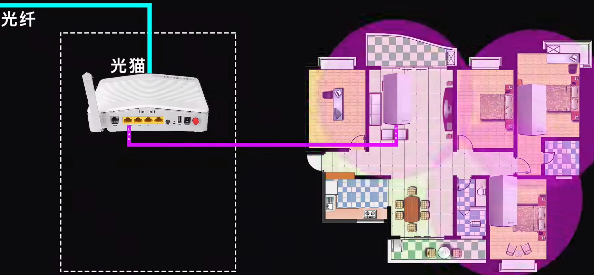

# 电脑选配

## 装机

## 测试软件

## CPU

## GPU

## 主板

## 内存条

## 固态硬盘

## 散热器

## 电源

## 显示器

[视频](https://www.bilibili.com/video/BV1oW411U76W)

## 机械键盘

[视频](https://www.bilibili.com/video/BV1tt41147Fr)

## 手柄

[手柄测试网站](https://hardwaretester.com/gamepad)

[教程视频](https://www.bilibili.com/video/BV1tS4y1E75c)

## 超频

## 手机

## 笔记本电脑

## 组网方案

[视频](https://www.bilibili.com/video/BV1Tf4y1i7GS)

实现家里高质量的无缝漫游（基于无线wifi协议 802.11k + 802.11v + 802.11r ，简称 kvr 漫游协议）

1. 最优方案： AP + AC （贵+预埋网线）

2. 最优方案2：WIFI6有线回传Mesh （需要预埋网线，不然用明线丑）

3. 最优方案3：三频路由器组无线Mesh （需要买贵的三频路由器，2.4G+5G+5G，其中一个5G用以路由器中的无线沟通）

4. 最优方案4：双频路由器组无线Mesh （占用部分 5G 频段速度，5G频段速度下降）

5. 方案5：高性能无线路由器（一个路由器，核心区域5G，其它区域2.4G）

## 智能家居

[视频](https://www.bilibili.com/video/BV1se411T7CF)

1. 核心：小爱音箱pro，功能:空调遥控器,蓝牙Mesh网关,语音助手,地震播报功能
2.门窗传感器 
3.智能灯/智能开关
4.米家小夜灯
选配
人体传感器 
空白NFC卡

通过自定义条件和操作来让音响控制其他指定家电，比如门窗传感器触发开门，则通过智能开关打开大厅的灯，并播报“欢迎回家”。

## 游戏设置

[视频](https://www.bilibili.com/video/BV1Zz4y1U7aB)

电脑配置低，游戏卡顿，提高帧数的两个方法：

1. 调低除材质纹理、各项异性过滤、动态模糊、景深、炫光、高光外的其他图像选项，抗锯齿改成 FXAA快速近似模糊。
2. 把显示器分辨率调成 720p

调试过程中可以使用 [MSI Afterburner](https://www.msi.com/Landing/afterburner/graphics-cards) 显示帧数（帧数30以上就比较流畅了）

