# 电脑选配

## 装机

## 测试软件

[视频](https://www.bilibili.com/video/BV1q7411C7px)

[MSI Afterburner](https://www.msi.com/Landing/afterburner/graphics-cards)：硬件信息和帧率监控软件

[aida64](https://www.aida64.com/downloads): 功能全面的电脑检测软件，用于电脑信息检测和电脑稳定性测试、磁盘测试、内存和缓冲测试、GPU测试、显示器测试

[AS SSD Benchmark](https://as-ssd-benchmark.en.softonic.com/#google_vignette): 硬盘测试软件。

3D Mark: 专业的测试CPU和GPU性能的软件(可以在steam购买)

## CPU

[视频](https://www.bilibili.com/video/BV1nt411B7ky)

[桌面CPU性能天梯图](https://www.mydrivers.com/zhuanti/tianti/cpu/index.html)
[笔记本CPU性能天梯图](https://www.mydrivers.com/zhuanti/tianti/cpum/index.html)

## GPU

[视频](https://www.bilibili.com/video/BV1Ct411Z7nL)

[桌面显卡性能天梯图](https://www.mydrivers.com/zhuanti/tianti/gpu/index.html)
[笔记本核显性能排行榜](https://rank.kkj.cn/Computer101.shtml)

## 主板

## 内存条

## 固态硬盘

## 散热器

## 电源

## 显示器

[视频](https://www.bilibili.com/video/BV1oW411U76W)

[显示器连接线视频](https://www.bilibili.com/video/BV1rJ411z7Z6)

## 机械键盘

[视频](https://www.bilibili.com/video/BV1tt41147Fr)

## 手柄

[手柄测试网站](https://hardwaretester.com/gamepad)

[教程视频](https://www.bilibili.com/video/BV1tS4y1E75c)

## 鼠标

[视频](https://www.bilibili.com/video/BV13b411z7P7/)

## 超频

## 手机

[视频](https://www.bilibili.com/video/BV1Gb411v7a8/)

[手机处理器性能天梯图](https://www.mydrivers.com/zhuanti/tianti/01/index.html)

[屏幕PPI计算器](https://www.itpwd.com/tools/ppicalc.php)

## 笔记本电脑

[视频](https://www.bilibili.com/video/BV1No4y1B7eH)

[图吧工具箱--硬件工具箱](https://www.tbtool.cn/)

通过查看硬盘通电次数判断是否是新机（几十次是正常的，如果只有几次或者很多就是翻新的或者旧的）

通过“鼠标设置”关闭“提高指针精确度”选项（只有DPI很低的鼠标才需要开启该选项，该选项会影响游戏体验）

通过“传递优化高级设置”把上传设置调到最新（占用带宽）

笔记本电脑硬件一般CPU和GPU都是焊死在主板上的，无法升级或者更换；最多可以换下硬盘。

## 组网方案

[视频](https://www.bilibili.com/video/BV1Tf4y1i7GS)

实现家里高质量的无缝漫游（基于无线wifi协议 802.11k + 802.11v + 802.11r ，简称 kvr 漫游协议）

1. 最优方案： AP + AC （贵+预埋网线）

2. 最优方案2：WIFI6有线回传Mesh （需要预埋网线，不然用明线丑）

3. 最优方案3：三频路由器组无线Mesh （需要买贵的三频路由器，2.4G+5G+5G，其中一个5G用以路由器中的无线沟通）

4. 最优方案4：双频路由器组无线Mesh （占用部分 5G 频段速度，5G频段速度下降）

5. 方案5：高性能无线路由器（一个路由器，核心区域5G，其它区域2.4G）

## 智能家居

[视频](https://www.bilibili.com/video/BV1se411T7CF)

1. 核心：小爱音箱pro，功能:空调遥控器,蓝牙Mesh网关,语音助手,地震播报功能
2.门窗传感器 
3.智能灯/智能开关
4.米家小夜灯
选配
人体传感器 
空白NFC卡

通过自定义条件和操作来让音响控制其他指定家电，比如门窗传感器触发开门，则通过智能开关打开大厅的灯，并播报“欢迎回家”。

## 游戏设置

[视频](https://www.bilibili.com/video/BV1Zz4y1U7aB)

电脑配置低，游戏卡顿，提高帧数的两个方法：

1. 调低除材质纹理、各项异性过滤、动态模糊、景深、炫光、高光外的其他图像选项，抗锯齿改成 FXAA快速近似模糊。
2. 把显示器分辨率调成 720p

调试过程中可以使用 [MSI Afterburner](https://www.msi.com/Landing/afterburner/graphics-cards) 显示帧数（帧数30以上就比较流畅了）

