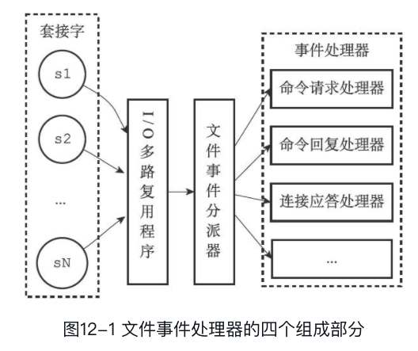
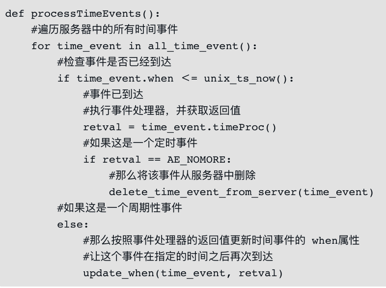
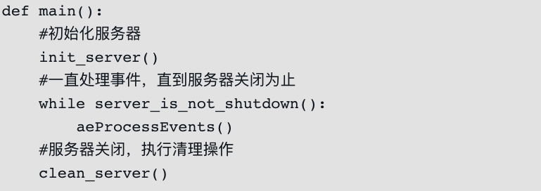
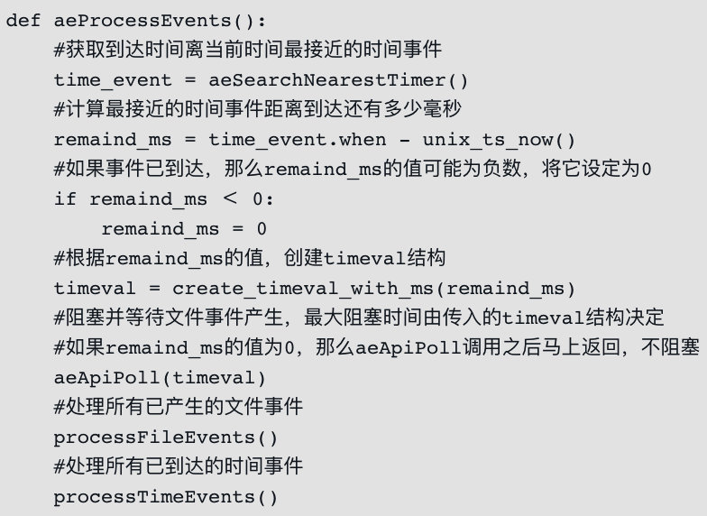

# 事件驱动

Redis 服务器是一个事件驱动程序，服务器处理的事件分为时间事件和文件事件两类。

## 文件事件机制

文件事件处理器是 Redis 基于 Reactor 模式实现的网络通信程序。

## 时间事件

时间事件分为定时事件和周期性事件：定时事件只在指定的时间到达一次，而周期性事件则每隔一段时间到达一次。

服务器将所有时间事件都放在一个无序链表中，每当时间事件执行器运行时，它就遍历整个链表，查找所有已到达的时间事件，并调用相应的事件处理器

服务器在一般情况下只执行 `serverCron` 函数一个时间事件，并且这个事件是周期性事件。所以无序列表并不影响性能

serverCron 的主要工作:

- 更新服务器的各类统计信息，比如时间、内存占用、数据库占用情况等。

- 清理数据库中的过期键值对。

- 关闭和清理连接失效的客户端。

- 尝试进行AOF或RDB持久化操作。

- 如果服务器是主服务器，那么对从服务器进行定期同步。

- 如果处于集群模式，对集群进行定期同步和连接测试

## 事件的调度和执行

