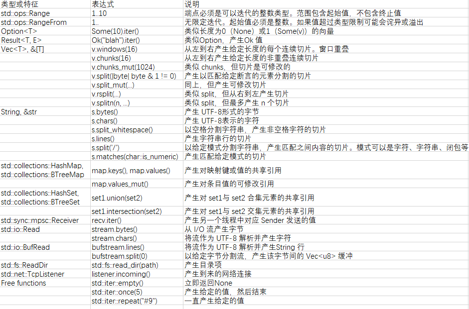

# Rust 语言特性

Rust 的定位是一门系统编程语言，主打性能和安全，适用于资源受限场景的编程。

Rust 的优势是 `speed`，`concurrency` 和 `safety`。

分别对应着 Rust 的三个设计目标：`零抽象开销`，`可靠并发`，`内存安全`。

零抽象开销是从 C++ 中借鉴的设计。至于可靠并发和内存安全是通过所有权（ownership）、移动（move）、借用（borrow）、生命周期（lifetime）机制来实现。

对于内存管理，主要有两种方式：

1. 手动管理（c/c++）。优点：及时清理内存，性能好；缺点：无法保证内存安全，容易出现内存泄漏。
2. GC（java/python/go...）。优点：内存安全；缺点：占用内存多；GC 时 stop the world，无法用于时延要求高的场景。

> 对于手动管理的内存泄漏问题，可以用 C++ 中的 RAII 编程模式来规避。但是 dangling pointers 等内存安全问题还是无法保证。

C/C++ 中最令人害怕的就是 undefined behavior。而 Rust 中解决了这些问题，常见的 dangling pointers、double free、null pointer deferences 能在编译期发现，数组越界问题通过编译期和运行期检查一起保证。

> 在 Rust 中，如果代码能够通过编译，就不会有 undefined behavior。

## 代码风格

struct、enum、trait 用大写字母开头的驼峰式(`CamelCase`)

变量、方法、函数、字段 用小写字母+下划线（`snake_case`）

关键字都是小写，而且尽量缩写，比如 `fn` `impl` `pub` `u32`


## 变量

Rust 通过 `let` 关键字声明变量，**默认是不可变变量**。声明可变变量，需要添加 `mut` 关键字。

```rust
let cv: u32 = 10;
let mut v: u32 = 20;
```

!> Rust 变量之间赋值，如果类型实现了 `Copy` Trait(特征)，就执行拷贝，否则默认执行 `move`；如果要深拷贝，需要显式调用类型的 `clone` 方法（需要实现 `Clone` Trait）。  
（和 C++ 相反，C++ 默认是 Copy/深拷贝，move 反而需要显示使用 `std::move` 函数）

基本类型基本都是 `Copy`，通过 `struct` 和 `enum` 自定义的类型不会默认实现 `Copy` Trait, 如果所有字段都是 `Copy` 类型，也可以通过 `#[derive(Copy, Clone)]` 来实现 `Copy` Trait。（如果有字段不是 `Copy` 类型，编译器会报错）

> `&T` 引用也实现了 `Copy` Trait，但是 `&mut T` 不是

> `Copy` Trait 要求实现其的类型必须要实现 `Clone` Trait

> 一个值只拥有栈上数据的，都应该是 `Copy`

### 全局变量

#### 静态常量

关键字 `const`，必须指明类型，全大写，**可以在任意作用域定义**，只能是常量表达式(编译期得到结果)，不能重复定义，生命周期是 `'static`，编译器会尽力内联。

```rust
const MAX_ID: usize =  usize::MAX / 2;
fn main() {
   println!("用户ID允许的最大值是{}",MAX_ID);
}
```

#### 静态变量

静态变量和静态常量类似，除了以下两点：

- 关键字 `static` / `static mut`
- 静态变量不会被内联，在整个程序中，静态变量只有一个实例，所有的引用都会指向同一个地址
- 存储在静态变量中的值必须要实现 Sync trait

```rust
static mut REQUEST_RECV: usize = 0;
```

由于在多线程下会有安全问题，Rust 要求 **必须使用 unsafe 语句块才能访问和修改 static 变量**

除了显式使用 unsafe，还是用原子类型、Mutex、CellRef、Cell等内部可变性类型作为静态变量，这是也可以修改。

静态初始化有一个致命的问题：无法用函数进行静态初始化。

这是可以使用社区提供的 `lazy_static` 宏

```rust
use std::sync::Mutex;
use lazy_static::lazy_static;
lazy_static! {
    static ref NAMES: Mutex<String> = Mutex::new(String::from("Sunface, Jack, Allen"));
}

fn main() {
    let mut v = NAMES.lock().unwrap();
    v.push_str(", Myth");
    println!("{}",v);
}
```

`Box::leak` 也可以用作运行期初始化的全局动态配置

```rust
#[derive(Debug)]
struct Config {
    a: String,
    b: String,
}
static mut CONFIG: Option<&mut Config> = None;

fn init() -> Option<&'static mut Config> {
    let c = Box::new(Config {
        a: "A".to_string(),
        b: "B".to_string(),
    });

    Some(Box::leak(c))
}


fn main() {
    unsafe {
        CONFIG = init();

        println!("{:?}", CONFIG)
    }
}
```

## 类型

由于 Rust 是静态类型语言，所以要写出函数参数、返回值、struct 字段以及其它结构体的类型。

为了提高效率，Rust 提供了两个特性：

1. 类型推断。Rust 可以根据你写出的类型推断其余大部分值的类型。

    > Rust 的类型推断比 C++ 的 auto 更智能

    比如根据后续的代码推断 Vec 的类型

    ```rust
    // 根据返回值推断出 v 的类型
    fn build_vector() -> Vec<i16> {
        let mut v = Vec::new();
        v.push(10);
        v.push(20);
        v
    }
    ```

2. 泛型函数。

    > 大部分静态语言都有这个特性（C++ 的最强大，Java 的只是擦除式泛型），动态语言中变量就可以用于任何类型，不需要泛型。

### 数字类型

- 有符号整型: `i8` `i16` `i32` `i64` `i128`

- 无符号整型: `u8` `u16` `u32` `u64` `u128`

- 机器字(内存地址的宽度 32 or 64 bit): `isize` `usize`

    > usize 能代表内存的最大值，所以很适合用于表达集合的长度和索引，比如Rust 要求数组索引必须是 usize 类型、

- 浮点数: `f32` `f64`

数字字面量可以通过加上类型后缀表示具体的类型，比如 `42u8` `1729usize`。

> 如果没有类型后缀，Rust 会根据上下文来推断其适合的类型。如果存在多个适合的类型，其中存在 `i32` 则取 `i32`，否则编译报错。如果推断不出来，也会报错。

另外，加上前缀 `0x` `0o` `0b` 可以表示十进制（`0xcafe`）、八进制(`0o106`)、二进制(`0b0010_1010`)。还可以用下划线来分割数字，增强可读性，比如 `4_296_967_295`


可以使用 `as` 操作符，进行转换,

```rust
// 无损转换
assert_eq!(10_i8 as i16, 10_u16);
// 截断
assert_eq!(1000_i16 as u8, 232_u8);
```

!> Rust 中不会隐式转换数字类型，即使时从小到大。

和其它语言不同，Rust 的基础类型可以拥有方法。比如

```rust
assert_eq!(2_u16.pow(4), 16);
assert_eq!((-4_i32).abs(), 4);
assert_eq!(0b101101_u8.count_ones(), 4);

assert_eq!(5f32.sqrt() * 5f32.sqrt(), 5.);
assert_eq!((-1.01f64).floor(), -2.0);
```

!> Rust 有个重要的特性：可以通过 trait 给已有的类型添加方法，包括基本类型。因此我们也可以给基础类型加自定义方法。

当整数运算溢出时，debug build 会 panic，release build 会 wraps round。

如果默认的行为不行，也可以通过调用方法的方式来控制行为

```rust
// checked_xxx 方法返回 Option，溢出时是 None
assert_eq!(10_u8.checked_add(20), Some(30));
assert_eq!(10_u8.checked_add(20), Some(30));

// wrapping_xxx 溢出时 wrap
assert_eq!(500_i16.wrapping_mul(500), -12144);

// saturating_xxx 溢出时取最大值或者最小值
assert_eq!(32760_i16.saturating_add(10), 32767);
assert_eq!((-32760_i16).saturating_sub(10), -32768);

// overflowing_xx 返回 tuple，溢出时 wrap，tuple 的第二个值为 true
assert_eq!(255_u8.overflowing_sub(2), (253, false));
assert_eq!(255_u8.overflowing_add(2), (1, true));
```


### bool

和其它语言一致，bool 类型只有两个值 `true` `false`。

> bool 类型占用一个字节的内存

bool 类型能转成整型

```rust
assert_eq!(false as i32, 0);
assert_eq!(true as i32, 1);
```

!> 但是，其它所有类型都不能转成 bool 类型(隐式和显式都不行)。

!> bool 值要么是 bool 字面量，要么是布尔表达式产生。

### 字符

Rust 的 char 类型是个 Unicode 字符，占用 32 bit。

`*` `\xHH`(ASCII 字符) `\u{HHHHHH}`(任何 Unicode 字符)

!> Rust 的 char 和 string 采用的编码不一样，string 采用的是 UTF8（1-4 byte 可变编码）

> 此外，用 `b'A'` 能表示一个字节的 ASCII 字符字面量，本质上是 u8 类型。

```rust
assert_eq!('*' as i32, 42);


assert_eq!('*'.is_alphabetic(), false);
assert_eq!('β'.is_alphabetic(), true);
assert_eq!('8'.to_digit(10), Some(8));
assert_eq!('a'.len_utf8(), 1);
assert_eq!(std::char::from_digit(2, 10), Some('2'));
```

### 元组

tuple 由各种类型的值组成。

```rust
let tuple_val = ("test", 1985); // (&str, i32)
```

> 和数组一样，tuple 也是存放在栈内存中

和数组不一样，tuple 的值可以是不同的类型，其次只允许用常量作为索引。

tuple 常用于函数返回多个值。

```rust
fn split_at(&self, mid: usize) -> (&str, &str);

let text = "I see the eigenvalue in thine eye";
let temp = text.split_at(21);
let head = temp.0;
let tail = temp.1;
assert_eq!(head, "I see the eigenvalue ");
assert_eq!(tail, "in thine eye");
```

tuple 可用 pattern-matching 语法进行赋值

```rust
let text = "I see the eigenvalue in thine eye";
let (head, tail) = text.split_at(21);
assert_eq!(head, "I see the eigenvalue ");
assert_eq!(tail, "in thine eye");
```

!> 此外，如果一个函数不指定返回类型，默认就是返回 `()` 类型。即 `fn swap<T>(x: &mut T, y: &mut T);` 等价于 `fn swap<T>(x: &mut T, y: &mut T) -> ();`

### 指针类型

Rust 中由几种表示内存地址的类型（references、boxes、unsafe pointers）

#### 引用

通过 `&x` 表示式，可以获取 x 的一个引用，这个过程叫做借用(borrow)

> `&` 符号类似于 C++ 的取址运算符，但得到的不是原始指针，而是引用

引用不会为 null。

> Rust 中也没有 null，而是用 Option 来表示。Java 中也有 Option，但是 Rust 的 pattern-matching 和各种语法糖，让 Option 的使用十分的流畅

> 传递引用会导致 dangling pointers 的问题，Rust 通过引入引用的生命周期概念来让编译器发现这些问题。

引用有两种: 

- `&T`: 不可变、共享的引用。类似于 C++ 中的 `const T*`
- `&mut T`: 可变、 排他的引用。类似于 C++ 中的 `T*`


#### Boxes

Rust 的值默认分配在栈上，要想分配到堆上，最简单的方式就是使用 `Box::new`

```rust
let t = (12, "eggs");
let b = Box::new(t); // allocate a tuple in the heap
```

Box 运用了 RAII 的方式（实现了 `Drop` trait），销毁 Box 时会调用 drop 方法，释放其拥有的堆内存。

Box 默认只能 move。类似于 C++ 中的 `std::unique_ptr`

#### Raw Pointers

原始指针类型:

- `*mut T`

- `*const T`

原始指针类型可以通过引用 `as` 转换得到，但是原始指针的只能在 `unsafe` 块中解引用


### Arrays，Vectors，Slices

Rust 中有 3 种表示一系列值的类型: 

- 数组：`[T; N]`

    > 栈分配

    ```rust
    // 初始化数组
    let lazy_caterer: [u32; 6] = [1, 2, 4, 7, 11, 16];
    let taxonomy = ["Animalia", "Arthropoda", "Insecta"];

    assert_eq!(lazy_caterer[3], 7);
    assert_eq!(taxonomy.len(), 3);

    // 指定初始值和大小
    let mut sieve = [true; 10000];

    // 数组排序
    let mut chaos = [3, 5, 4, 1, 2];
    chaos.sort();
    assert_eq!(chaos, [1, 2, 3, 4, 5]);
    ```

- 向量: `Vec<T>`

    [文档](https://doc.rust-lang.org/std/vec/struct.Vec.html)

    > 元素在堆上动态分配。栈上只有堆内存第一个元素指针、容量、当前元素个数

    ```rust
    // 使用 new 关联函数创建
    let v: Vec<u8> = Vec::new();

    // 创建指定容量的 Vec
    let v2: Vec<u8> = Vec::with_capacity(2);
    assert_eq!(v2.len(), 0);
    assert_eq!(v2.capacity(), 2);

    // vec! 宏简化向量的初始化，等同于先 Vec::new 创建，然后 push 元素
    let mut primes = vec![2, 3, 5, 7];
    // product 是元素的乘积
    assert_eq!(primes.iter().product::<i32>(), 210);
    // 动态增加元素
    primes.push(11);
    primes.push(13);
    assert_eq!(primes.iter().product::<i32>(), 30030);

    // 指定初始值和个数
    let mut primes2 = vec![0, rows * cols]

    // 通过 iterator 的 collect 方法得到向量
    let v3: Vec<i32> = (0..5).collect();
    assert_eq!(v3, [0, 1, 2, 3, 4]); 

    // for..in 遍历
    for item in &v3 {
        println!("{}", item)
    }

    for index in 0..v3.len() {
        println!("{}:{}", index, v3[index]);
    }
    ```

- 切片: `&[T]` `&mut [T]`

    切片写作 `[T]`，表示数组或向量的一个范围。由于切片可以是任意长度，因此不能直接保存在变量中，也不能作为函数参数传递。**切片永远只能按引用传递**，因此也常把切片的引用直接称为切片。

    切片的引用是个胖指针(fat pointer)，包含切片第一个元素的指针和元素的个数。

    > 常见的字符串字面量的类型 `&str` 也是个胖指针

    切片引用非常适合操作一串同类数据的函数，无论这串数据存储爱数组、向量，抑或栈还是堆上。

    !> 定义一个需要处理一串同类数据的函数，用切片引用作为入参类型是个很不错的选择

    ```rust
    let v: Vec<f64> = vec![0.0, 0.707, 1.0, 0.707];
    let a: [f64; 4] = [0.0, -0.707, -1.0, -0.707];
    // 数组和向量的引用能够自动解引用成切片的引用
    let sv: &[f64] = &v;
    let sa: &[f64] = &a;
    let sv1: &[f64] = &v[0..2]
    ```

    > 数组、向量的引用实现了 `Deref` Trait，会隐式得调用 deref 方法转换成切片引用。因此数组、向量能使用切片引用的所有方法。


### 字符串类型

Rust 的字符串使用的是 UTF8 编码。

字面量是 `&str` 类型。

> &str 是个胖指针，包含实际数据的地址及其长度

> 编译时就会把字面量存放在程序的 data segment 中，&str 存储的就是其地址

```rust
let speech = "\"Ouch!\" said the well.\n";
// 字面量可以跨多行，每行后面的换行符和第二行的空白符会保留
println!("In the room the women come and go,
    Singing of Mount Abora");

// 跨多行，不会保留换行符和第二行的空白符
println!("It was a bright, cold day in April, and \
    there were four of us—\
    more or less.");

// raw string，不存在转义字符，r后面的 # 的个数不定，也可以没有，根据文本中是否存在 "### 的内存来决定个数
println!(r###"
    This raw string started with 'r###"'.
    Therefore it does not end until we reach a quote mark ('"')
    followed immediately by three pound signs ('###'):
"###);
```


Byte 字符串就是带前缀 b 的字符串字面量，类型是 `&[u8;N]`，非 UTF8 编码。

Byte 字符串字面量和普通的字符串字面量一样，可以使用转义符，也有 raw string（前缀是 `br"`）,但是只能是 ASCII 和 `\xHH` 转义序列

```rust
let method = b"GET";
assert_eq!(method, &[b'G', b'E', b'T']);
```

本质上，Rust 中的字符串内部就是 `Vec<u8>` 类型，只是保证了存储的是格式完好的 UTF8 编码。所以 `&str` 本质上就是 `&[u8]` 切片

Rust 的字符串类型 String，和 Vec 很像，操作也很像。

[文档](https://doc.rust-lang.org/std/string/struct.String.html)

同样 String 实现了 Deref Trait，其引用可以隐式转换成 `&str`

```rust
// 根据 &str 得到
let error_message = "too many pets".to_string();
let hello = String::from("Hello, world!");

// format! 宏生成
let str = format!("{}°{:02}′{:02}″N", 24, 5, 23), "24°05′23″N".to_string()

// push
let mut hello = String::from("Hello, ");
hello.push('w');
hello.push_str("orld!");

// 拼接多个字符串
let bits = vec!["veni", "vidi", "vici"];
assert_eq!(bits.concat(), "venividivici");
assert_eq!(bits.join(", "), "veni, vidi, vici");
```

字符串支持 `==` 等关系运算符

```rust
assert!("ONE".to_lowercase() == "one");

assert!("peanut".contains("nut"));
assert_eq!(" _ ".replace(" ", "■"), "■_■");
assert_eq!(" clean\n".trim(), "clean");
for word in "veni, vidi, vici".split(", ") {
    assert!(word.starts_with("v"));
}
```

Rust 保证字符串是有效的 UTF-8。但是再与其它系统操作是，需要处理不是 UTF8 的字符串。可以使用以下的方法：

- 对于 Unicode 文本，使用 `String` 和 `&str`。
- 处理文件名时，使用 `std::path::PathBuf` 和 `&Path`。
- 处理根本不是字符数据的二进制数据时，使用 `Vec<u8>` 和 `&[u8]`。
- 处理以操作系统原生形式表示的环境变量名和命令行参数时，使用 `OsString` 和 `&OsStr`。
- 与使用空字符结尾字符串的 C 库互操作时，使用 `std::ffi::CString` 和 `&CStr`。

### 类型转换

#### as 操作符

```rust
let x = 17; // x is type i32
let index = x as usize; // convert to usize
```

as 的使用场景：

- 数字类型之间转换
- `bool`, `char`, C-like `enum` 类型转整数类型（**反之不行**）

    > 可用 `std::char::form_u32()` 把整型转成 `char` ，返回值是 `Option<char>`, 如果不是有效的 Unicode 编码，返回 `None`
    
    > 有一个例外，`u8` 可以转成 `char`，因为 `u8` 都是有效的 Unicode 编码

- 引用转成原始指针，只读原始指针转可变原始指针(`&T as *T`, `*T as *mut T`)

#### 隐式转换

实现了 `Deref` 特征的类型，在初始化、赋值、函数参数、返回值、match 等场景会被自动 `deRef`:

常见的有:

- `&String` -> `&str`
- `&Vec<i32>` -> `&[i32]`
- `&Box<Chessboard>` -> `&Chessboard`

#### 点操作符

方法调用的点操作符看起来简单，实际上非常不简单，它在调用时，会发生很多魔法般的类型转换，例如：自动引用、自动解引用，强制类型转换直到类型能匹配等。

假设有一个方法 foo，它有一个接收器(接收器就是 self、&self、&mut self 参数)。如果调用 value.foo()，编译器在调用 foo 之前，需要决定到底使用哪个 Self 类型来调用。现在假设 value 拥有类型 T。
 
1. 编译器检查是否可以直接调用 `T::foo(value)`，称之为值方法调用
2. 如果不行(例如方法类型错误或者特征没有针对 Self 进行实现，上文提到过特征不能进行强制转换)，那么编译器会尝试增加自动引用，例如会尝试以下调用： `<&T>::foo(value)` 和 `<&mut T>::foo(value)`(当然前提是 value 本身得是 mut)，称之为引用方法调用
3. 若上面两个方法依然不工作，编译器会试着解引用 T ，然后再进行尝试。这里使用了 `Deref` 特征 —— 若 `T: Deref<Target = U>` (T 可以被解引用为 U)，那么编译器会使用 U 类型进行上述两步的尝试，称之为解引用方法调用
4. 若 T 不能被解引用，且 T 是一个定长类型(在编译器类型长度是已知的)，那么编译器也会尝试将 T 从定长类型转为不定长类型，例如将 [i32; 2] 转为 [i32]
5. 若还是不行，那编译器就报错

> 另外 `[]` 操作符其实是个语法糖，本质上是调用 `Index` 特征的 `index()` 方法，即 `array[0]` 等价于 `array.index(0)`，所以其也适用于点操作符的规则

## 所用权、引用、生命周期

对于内存管理，几乎所有编程语言的处理方式可以归为两派：

1. 安全优先派使用垃圾收集器来管理内存，让 GC 来自动释放不可达对象。这种方式可以解决内存泄漏和悬空指针等内存安全问题。但是 GC 会导致 stop the world，不适用于时延要求高的场景；同时 GC 的存在让对象的释放延后了，程序会占用更大的内存；GC 本身的管理也会耗费一定的 CPU 和内存资源。

    > 几乎所有的现代语言都是这个流派。包括 Java、Go、Javascript、Python等。

1. 控制优先派让程序自己管理内存。自己管理内存，容易出现悬空指针等内存安全问题。

    > 代表语言是 C 和 C++

Rust 的目标是性能和安全。

Rust 通过给所有权+引用生命周期的方式打破了内存管理安全和性能无法兼得的僵局。

> 所有权本质上就是 RAII 思想

Rust 语言内置了所有权机制，并通过编译器检查来保证。

### 所有权原则

- Rust 中每一个值都被一个变量所拥有，该变量被称为值的所有者
- 一个值同时只能被一个变量所拥有，或者说一个值只能拥有一个所有者
- 当所有者(变量)离开作用域范围时，这个值将被丢弃(drop)

!> 可以和 C++ 的 unique_ptr +  move + RAII 类比理解

与变量拥有自己的值一样，struct 也有用自己的字段。元祖、数组和向量则拥有自己的元素。

可以通过树来描述所有权关系：你的所有者是你的父节点，你拥有的值是你的子节点，每个树的根节点则是某一个变量。当控制流超出了这个变量所在的作用域时，整个树都会被清除。

也就是说每个值都是一个所有权树的节点，而这个树的根节点就是一个变量。

对于栈上的值，默认就满足所有权原则。

对于堆上的值，Rust 提供了 `Box<T>` 智能指针来创建满足所有权原则的堆上数据.

[Box 文档](https://doc.rust-lang.org/std/boxed/struct.Box.html)

> `Box<T>` 是创建堆对象最常用的方式

> 类似于 C++ 中的 `unique_ptr`

上述规则太严厉，很多场景无法实现，为此 Rust 对规则进行了扩展：

- 可以把值从一个所有者转移到另一个所有者
- 标准库提供了基于引用计数的指针类型 Rc 和 Arc，使用它们可以在满足某些限制条件的前提下将值指定给多个所有者。
- 对一个值，可以“借用其引用”。引用是生命期有限的非所有指针。

### 转移/移动（move）

在 Rust 中，对多数类型而言，给变量赋值、给函数传值或从函数返回值这样的操作不会复制值，而是转移（move）值。
所谓转移，就是原来的所有者让渡这个值的所有权给目标所有者，并变成未初始化状态。

> 和 C++ 的 move 语义一致，大多数场景就是把转移堆内存的指针；不一样的是转移后，原来的变量在 C++ 中处于未定义状态，使用会有危险；而 Rust 直接通过编译器检查不给用了(可以赋值)。

!> Rust 中的赋值默认就是转移，而 C++ 中默认是拷贝

如果不需要值的所有权，但是又需要访问值时，可以借用其引用。

### 借用规则

- 同一时刻，你只能拥有要么一个可变引用, 要么任意多个不可变引用
- 引用必须总是有效的

!> 引用并不拥有值的所有权，所以 `*&T` 不能触发 move，除非 T 实现 Copy，否则会报错

!> 引用的作用域不是块作用域，但是从声明到不再使用的代码行

Rust 中的引用不会为空，取引用运算法 `&T`, 解引用运算符 `*T`。取引用的过程也叫借用

> 另外还有一种借用的语法: `let ref variable = T;` 等价于 `let variable = &T;`

> 引用一般需要显示借用，但是`.` 运算符可以隐式借用引用

> 用法上类似于 C++ 中的引用，获取和解引用语法类似于 C++ 的原始指针。

> 和 C++ 引用一样，Rust 引用可以修改指向

引用有两种：共享引用(`&T`)、可变引用(`&mut T`)

> `&T` 是 Copy 的

可以存在引用的引用，`.` 运算法可以解开多层引用，操作真实的对象

```rust
struct Point { x: i32, y: i32 }
let point = Point { x: 1000, y: 729 };
let r: &Point = &point;
let rr: &&Point = &r;
let rrr: &&&Point = &rr;

// . 运算法可以解开多层引用，操作真实的对象
assert_eq!(rrr.y, 729);
```

同样，比较运算符也可以解开多层引用(前提是引用的层级要一致，否则编译会报类型不匹配的错误)

```rust
let x = 10;
let y = 10;
let rx = &x;
let ry = &y;
let rrx = &rx;
let rry = &ry;

assert!(rrx <= rry);
assert!(rrx == rry);
assert!(!std::ptr::eq(rrx, rry))
```

借用表达式的引用

```rust
fn factorial(n: usize) -> usize {
 (1..n+1).fold(1, |a, b| a * b)
}
// 引用声明周期和变量生命周期一致
let r = &factorial(6);
// 引用生命周期到语句结束
assert_eq!(r + &1009, 1729);
```

> 引用一般只包含简单的地址，但是切片引用和 trait object 引用是个胖指针，包括地址以及长度或者 vtbl 地址。

借用的第二条规则是为了解决悬空指针的问题，但是要怎么保证呢？

为此 Rust 引用了 lifetime 机制。

### 生命周期

Rust 给程序中的每个引用类型附加一个生命期（lifetime），生命期的长短与如何使用该引用匹配。

`生命期`是程序中可以安全使用引用的一个范围，比如一个词法块、一个语句、一个表达式、某个变量的作用域，等等。

> 生命期完全是 Rust 在编译时虚构的东西。而在运行时，引用就是一个地址，其生命期取决于自身的类型，没有运行时表示。

!> 引用的生命期从借用的代码行开始到，最后一次使用的代码行

一般，Rust 会自动推导引用生命期及其使用范围的有效期。

```rust
{
 let r;
 {
    let x = 1;
    // 变量的作用域超过了引用的生命期，编译会报错
    r = &x;
 }
 assert_eq!(*r, 1); // bad: reads memory `x` used to occupy
}
```

生命周期的标注语法:

```rust
&i32        // 一个引用
&'a i32     // 具有显式生命周期的引用
&'a mut i32 // 具有显式生命周期的可变引用

fn longest<'a>(x: &'a str, y: &'a str) -> &'a str; // 函数

// 结构体
// 结构体的生命期要满足 'a 和 'b 的最小值
struct S<'a, 'b> { 
    x: &'a i32,
    y: &'b i32
}
```

编译器使用三条消除规则来确定哪些场景不需要显式地去标注生命周期：

- 每一个引用参数都会获得独自的生命周期
- 若只有一个输入生命周期(函数参数中只有一个引用类型)，那么该生命周期会被赋给所有的输出生命周期
- 若存在多个输入生命周期，且其中一个是 &self 或 &mut self，则 &self 的生命周期被赋给所有的输出生命周期

!> 一般只有在定义函数（不满足消除规则）或者自定义类型包含引用字段的情况下，才需要显式标注引用的生命周期。


另外，为了保证引用的有效性，在共享引用生命周期内，引用的目标值都是只读的：不能重新给它赋值或转移该值

```rust
let v = vec![4, 8, 19, 27, 34, 10];
let r = &v;
let aside = v; // 将向量转移到aside
r[0]; // 不行：使用v，可是它已经变成未初始化了
```

> `'static` 是预设的生命周期，表示引用的生命周期和程序的生命周期一致，字符串字面量的 `&str` 就是这个生命周期

### 共享所有权

真实场景经常会出现一个对象确定应该被多个对象管理的情况。

为了满足这种场景，Rust 提供了 `Rc`(`reference count`) 和 `Arc` 类型

> 类似于 C++ 的 `shared_ptr`

[Rc 文档](https://doc.rust-lang.org/std/rc/struct.Rc.html)

`Rc` 通过实现 `Clone` Trait 来共享所有权，当最后一个 Rc 被清除后，Rust 也会清除对应的值。

```rust
use std::rc::Rc;
// Rust可以推断所有这些类型，这里写出来是为了清楚
let s: Rc<String> = Rc::new("shirataki".to_string());
let t: Rc<String> = s.clone();
let u: Rc<String> = s.clone();
```

共享所有权，导致编译器难以检查借用规则，所以 **`Rc` 中的值默认是不可变的**。如果需要修改值，可用 `Atomic` 类或者使用 `Cell<>` `RefCell<>`(内部可变性智能指针)包装。

> 当然通过 `unsafe` 也可以修改，`Cell` `RefCell` 内部也是通过 `unsafe` 实现的，但是不建议自行使用 `unsafe`

由于 clone 和 drop 会修改引用计算，多线程会存在数据竞争问题，所有 `RC` 不能用于多线程，而是应用使用 `Arc`。

[Arc 文档](https://doc.rust-lang.org/std/sync/struct.Arc.html)

> `Arc` 通过原子语义保证并发安全问题，性能差于 `RC`

`Arc` 中的数据默认也是不可变的，除非内部数据是 `Atomic` 类或者使用 `Mutex<>` 包装

> `Cell` `RefCell` 不是并发安全的，也不能用

共享所有权，很容易出现互相引用的问题，这样会导致内存无法释放，这时可以使用 `std::rc::Weak`

[Weak 文档](https://doc.rust-lang.org/std/rc/struct.Weak.html)

> 类似于 C++ 中的 `weak_ptr`

## 表达式和语句

[文档](https://doc.rust-lang.org/reference/statements-and-expressions.html)

Rust 是所谓的表达式语言

> 表达式语言可追溯到 Lisp

C 族语言中的大多数的控制流工具是语句，而在 Rust 中，它们全是表达式。

!> C 族语言常见的语句和表达式在 Rust 大部分都是表达式

!> 表达式返回值，语句不会

### 语句

Rust 中的语句有四种：

- Item : `fn`、`struct` 或 `use` 等
- let 变量声明语句
- 表达式加分号结束或者表达式返回`()`

    > 表达式返回 `()` 就不需要额外加分号了

    > 表达式有值返回，强行加分号会有编译 warning：unused result，可以使用 `let _ = expression;` 处理

- 宏调用

#### let 声明

除了表达式和分号，块还可以包含多个任意声明。最常见的是用于声明局部变量的 `let` 声明：

```rust
// 类型和初始值是可选的，分号是必需的。
let name: type = expr;
```

和其它语言不一样，在同一作用域中，可以创建同名变量，前面的变量会被覆盖

```rust
for line in file.lines() {
    let line = line?;
    ...
}
```

### 表达式

#### 块与分号

代码块，同样也是表达式。块产生值，其可以用于任何需要值的地方。块的值就是其内部最后一个表达式的值。

如果最后一个语句加上了分号，那么这个块会默认返回 unit type `()`

```rust
let display_name = match post.author() {
    Some(author) => author.name(),
    None => {
        let network_info = post.get_network_metadata()?;
        let ip = network_info.client_address();
        ip.to_string()
    }
};

let msg = {
    // let声明：分号是必需的
    let dandelion_control = puffball.open();
    // 表达式+分号：方法调用，返回值被清除
    dandelion_control.release_all_seeds(launch_codes);
    // 表达式不带分号：方法被调用，返回值保存于msg中
    dandelion_control.get_status()
};
```

!> `let` 声明不返回值，比如加上分号

!> 表达式+分号, 返回值被清除

```rust
if preferences.changed() {
    // 编译会报错
    page.compute_size() // 噢，漏掉了分号
}
```

空语句可以出现在块中

```rust
loop {
 work();
 play();
 ; // <-- 空语句
}
```

#### 条件表达式

```rust
if condition1 {
    block1
} else if condition2 {
    block2
} else {
    block_n
}
```

> if 表达式要求每个分支都要返回相同的类型，如果没有 else block，那么 if block 也必须返回 `()`

```rust
match code {
    0 => println!("OK"),
    1 => println!("Wires Tangled"),
    2 => println!("User Asleep"),
    // 类似于 switch 的 default
    _ => println!("Unrecognized Error {}", code)
}
```

match 表达式看起来类似于 C 的 switch 语句，但其实会更灵活，因为其可以使用**模式匹配**

> 模式匹配是 Rust 内置的 mini 语言

```rust
match value {
    pattern => expr,
    ...
}

match params.get("name") {
    Some(name) => println!("Hello, {}!", name),
    None => println!("Greetings, stranger.")
}
```

!> match 的所有模式中必须至少有一个匹配，否则编译器会报错

> match 的所有分支也都必须返回相同类型的值

if 可以使用模式匹配，那就是 `if let` 语句

```rust
if let pattern = expr {
    block1
} else {
    block2
}

if let Some(cookie) = request.session_cookie {
    return restore_session(cookie);
}
```

if let 是 match 的一个子集，等价于 

```rust
match expr {
    pattern => { block1 }
    _ => { block2 }
}
```

#### 循环表达式

四种类型

```rust
while condition {
    block
}
// 类似于 if let
while let pattern = expr {
    block
}

loop {
    block
}

for pattern in iterable {
    block
}
```

Rust 中的 for 循环只提供了 range 语法，但是结合 `..` 语法糖可以很简单的模拟 for-i 语句。

`..` 操作符会产生 Range 对象，`0..20`(半开区间) 等价于 `std::ops::Range { start: 0, end: 20 }`，另外 `0..` `..20` `0..=20` 等写法也会产生对应 Range 类型的对象。这些 Range 类型都实现了 `std::iter::Iterable` Trait（for 循环只能作用于 `Iterable`，）

```rust
for index in 0..20 {
    print!({}, index);
}
```

for 循环本身也是个语法糖，等价于

```rust
while let Some(item) = iterable.into_iter().next() {
    ...
}
```

for 循环也是默认使用 move

```rust
let strings: Vec<String> = error_messages();
for s in strings { // each String is moved into s here...
    println!("{}", s);
}
// ...and dropped here
println!("{} error(s)", strings.len()); // error: use of moved value
```

如果不想被 move，可以使用 `&strings` 引用替代

循环表达式可以使用 `break` `continue` 语句，break 语句可以返回值，还可以指定跳出的 label

```rust
// Find the square root of the first perfect square
// in the series.
let sqrt = 'outer: loop {
    let n = next_number();
    for i in 1.. {
        let square = i * i;
        if square == n {
        // Found a square root.
            break 'outer i;
        }
        if square > n {
            // `n` isn't a perfect square, try the next
            break;
        }
    }
};
```

#### return 表达式

return 用来退出当前函数，并返回一个值。

函数 block 一般使用最后一个表达式作为返回值，如果要提前返回，就需要使用 return

常用于 `Option<T>` 和 `Result<T, E>` 的 `?` 操作符就是个使用 return 的语法糖

```rust
let output = File::create(filename)?;

// 等价于
let output = match File::create(filename) {
    Ok(f) => f,
    Err(err) => return Err(err)
};
```

前面说过，if 表达式的所有分支必须是相同的类型。如果把这个规则强加给以 `break` 或 `return` 表达式结尾的块、无穷 `loop`、对 `panic!()` 或 `std::process::exit()` 的调用，则是不明智的。这些表达式共有的特点是它们都不以惯常的方式结束，不返回值。

不正常结束的表达式通常被指定为特殊类型 `!`，就是说这些表达式永远不会返回。比如 `std::process::exit()` 的函数签名中返回类型就是 `!`

#### 函数和方法调用

```rust
let x = gcd(1302, 462); // function call
let room = player.location();   // method call
let mut numbers = Vec::new();   // type-associated function call
let mut numbers2 = Vec::<i32>::new(); // 关联方法指定类型参数
```

#### Fields 和 Elements 访问

```rust
// 获取 struct 的 field 值
game.black_pawns 
// 获取 tuple like struct 的 field
coords.1 
// 获取数组或者向量的值
pieces[i]
// 获取数据或者向量的切片引用
let second_half = &game_moves[midpoint .. end];
```

Range 语法糖的本质：

> Range 对象都实现了 `Iterable`

```
..      // RangeFull
a ..     // RangeFrom { start: a }
.. b     // RangeTo { end: b }
a .. b    // Range { start: a, end: b }
..= b       // RangeToInclusive { end: b }
a ..= b     // RangeInclusive::new(a, b)
```

#### 引用操作符和解引用操作符

引用操作符: `&` `&mut`

解引用操作符: `*`

> 当使用 `.` 操作符时会自动解引用，因此 `*` 操作符一般只需要用于读或者写引用对象的值

```rust
let padovan: Vec<u64> = compute_padovan_sequence(n);
for elem in &padovan {
    draw_triangle(turtle, *elem);
}
```

#### 算术、位运算、比较、逻辑运算符

算术: `+` `-` `*` `/` `%`
位运算: `&` `|` `^` `<<` `>>` `!`
比较: `==` `!=` `<` `<=` `>` `>=`
逻辑：`&&` `||` `!`

> Rust 有无符号整数，所以不需要 Java 中的 `>>>` 运算符

```rust
println!("{}", -100);
let x = 1234.567 % 10.0;

let hi: u8 = 0xe0;
let lo = !hi;   // 0x1f
```

#### 赋值运算符

```rust
total += item.price;
```

!> Rust 没有 C 的 `++` `--` 运算符

#### 闭包 Closures

```rust
// 自动推导入参和返回值类型
let is_even = |x| x % 2 == 0;
// 显式标注入参和返回值类型
let is_even = |x: u64| -> bool { x % 2 == 0 };  // ok
// 调用闭包
is_even(14)
```

## 模式匹配

[文档](https://doc.rust-lang.org/reference/patterns.html)

其它语言中也有一定的模式匹配，比如 Python 的解包（unpack）和 JavaScript 的解构（destructure）。

但是 Rust 中的模式匹配更加的强大，有点像能够匹配任意数据的正则表达式。可以用模式**测试某个值是否具有特定格式**，或者**一次性把结构体或元组的多个字段提取到本地变量**中。模式还有一点跟正则表达式很像：**非常简洁**，通常只要一行代码即可达到目的。

模式匹配可以用于:

- `let` 声明
- 函数或者闭包的参数
- `match` 表达式
- `if let` 表达式
- `while let` 表达式
- `for` 表达式

支持的模式类型：


> 模式之间可以互相组合

```rust
// 元组模式
let (x, y) = (1, 2);               // "(x, y)" is an irrefutable pattern

// 字面量模式、多个模式、范围模式、通配符模式
for i in -2..8 {
    match i {
        1 => println!("It's a one"),
        2|4 => println!("It's either a two or a four"),
        5..7 => println!("five to seven"),
        _ => println!("Matched none of the arms"),
    }
}

// 结构体模式
match balloon.location {
    Point { x: 0, y: height } =>
        println!("straight up {} meters", height),
    Point { x: x, y: y } =>
        println!("at ({}m, {}m)", x, y),
}

match get_account(id) {
    ...
    // 使用 ... 忽略多个不关心的字段
    Some(Account { name, language, ... }) => language.show_custom_greeting(name),
}

use std::cmp::Ordering::*;
// 组合多种模式
match (x.cmp(&0), y.cmp(&0)) {
    (Equal, Equal) => "at the origin",
    (_, Equal) => "on the x axis",
    (Equal, _) => "on the y axis",
    (Greater, Greater) => "in the first quadrant",
}

// 数组或者切片匹配
fn greet_people(names: &[&str]) {
    match names {
        [] => { println!("Hello, nobody.") },
        [a] => { println!("Hello, {}.", a) },
        [a, b] => { println!("Hello, {} and {}.", a, b) },
        [a, .., b] => { println!("Hello, everyone from {} to {}.", a, b) }
    }
}
```

## 错误处理

Rust 中有两种错误处理方法：`panic` 和 `Result<T, E>`

Result 用来表示程序外部导致的问题

panic 表示不应该发生的错误

### Panic

常见的 Panic 场景：

- 数组越界
- 除以 0
- 调用 Result 的 `.expect()`
- assert 断言错误
- 调用 `panic!()` 宏

以上情形的共性在于它们都由程序员的错误所导致。因此我们的经验是：“最好不要 panic”。

panic 触发后的处理过程:

1. 在终端打印错误消息
2. 栈被展开
3. 线程退出，如果 panic 的是主线程，则退出进程

panic 是线程级别的

可以使用 `std::panic::catch_unwind()` 方法捕获 panic，让代码继续执行。但是一般只在 UT 代码或者被 C/C++ 调用时才使用。

`panic` 不是 `crash`，也不是 `undefined behavior`。更像 Java 的 `RuntimeException` 和 C++ 的 `std::logic_error`。

代码写得好，理论上是不会发生 panic 的。但是哪有完美的代码，为保证程序更加健壮，可以使用线程和 `catch_unwind()` 来处理
诧异。

!> 触发第一个 panic， 在栈展开过程中，如果某个 `drop` 方法触发了第二个 panic，会直接中止进程

### Result

和 Go 类似，Rust 没有 exception。

取而代之，可以通过返回 `Result<T, E>` 类型来表达函数可能失败

```rust
enum Result<T, E> {
    Ok(T),
    Err(E),
}
```

```rust
// 成功返回 Ok(weather)，weather 是 WeatherReport 类型；失败返回 Err(error_value)，error_value 是 io::Error 类型
fn get_weather(location: LatLng) -> Result<WeatherReport, io::Error>
```

Go 是用返回 `value, err` 元组表达失败，这也导致出现了大量的 `if err != nil` 的错误判断，这也是 Go 被诟病最多的一个点。

Rust 中**用 match 表达式和模式匹配处理 Result**，类似于其它语言中的 `try/catch`

```rust
match get_weather(hometown) {
    Ok(report) => {
        display_weather(hometown, &report);
    }
    Err(err) => {
        println!("error querying the weather: {}", err);
        schedule_weather_retry();
    }
}
```

同时，Result 也提供了一些方法来简化处理

- `result.is_ok()`, `result.is_err()` : 判断函数成功还是失败
- `result.ok()`: 返回 `Option<T>`，Err 时就是 `None`
- `result.err()`: 返回 `Option<E>`, Err 时有值
- `result.unwrap_or(fallback)`: 返回 `T`, Err 时取 `fallback` 默认值
- `result.unwrap_or_else(fallback_fn)`: 返回 `T`, Err 时调用 `fallback_fn`，取其默认值
- `result.unwrap()`: 返回 `T`, Err 时 panic
- `result.expect(message)`: 返回 `T`, Err 时 panic，panic 打印 message 作为错误信息
- `result.as_ref()`, `result.as_mut()`: 返回 `Result<&T, &E>` 或者 `Result<&mut T, &mut E>`

一般一个模块内会用同一 Err 类型，所以经常会 alias Result 来简化 Result 的书写

```rust
// 类型别名
pub type Result<T> = result::Result<T, Error>;

// 使用类型别名
fn remove_file(path: &Path) -> Result<()>
```

打印错误信息:

```rust
// 打印错误信息
println!("error: {}", err);
// 打印错误信息到标准错误输出
writeln!(stderr(), "error: {}", err);
// 打印 Err 类型内容
println!("error: {:?}", err);

// 获取错误信息
let err_msg = err.to_string();
// 获取上级 Err, 返回的是 Option 类型
let err_source = err.source();
```

> Rust 标准库的错误类型一般不包含 stack trace，`err.source` 都是 None, 但是三方 `anyhow` crate 提供了对应的错误类型。

Rust 还提供了一种语法糖用于简化`传播错误`，即 `?` 操作符

```rust
let weather = get_weather(hometown)?;

// 等价于
let weather = match get_weather(hometown) {
    Ok(success_value) => success_value,
    Err(err) => return Err(err)
};
```

如果一个函数有多个错误类型，可以使用以下的 Result 定义

```rust
type GenericError = Box<dyn std::error::Error + Send + Sync + 'static>;
type GenericResult<T> = Result<T, GenericError>;
```

对应返回通用错误的函数，可以使用 `error.downcast_ref::<ErrorType>()` 进行向下转型

```rust
loop {
    match compile_project() {
        Ok(()) => return Ok(()),
        Err(err) => {
            if let Some(mse) = err.downcast_ref::<MissingSemicolonError>() {
                insert_semicolon_in_source_code(mse.file(), mse.line())?;
                continue;
            }
            return Err(err);
        }
    }
}
```

main 函数默认返回 `()`，直接使用 `?` 操作符会编译报错，最简单的方式用 `.expect("msg")`，如果还是想要 `?`，可以修改 main 函数的返回值为 Result 类型，main 会以 `{:?}` 的方式打印返回值。

如何定义自己的错误类型?

```rust
// 最简洁的定义
#[derive(Debug, Clone)]
pub struct JsonError {
    pub message: String,
    pub line: usize,
    pub column: usize,
}

// 让错误类型可打印
use std::fmt;
impl fmt::Display for JsonError {
    fn fmt(&self, f: &mut fmt::Formatter) -> Result<(),
    fmt::Error> {
    write!(f, "{} ({}:{})", self.message, self.line,
    self.column)
}
}
// Errors should implement the std::error::Error trait,
// but the default definitions for the Error methods are fine.
impl std::error::Error for JsonError { }
```

如果想要更简洁，可以使用 `thiserror` crate 

```rust
// 生成和上面一样的代码
use thiserror::Error;
#[derive(Error, Debug)]
#[error("{message:} ({line:}, {column})")]
pub struct JsonError {
    message: String,
    line: usize,
    column: usize,
}
```

Rust 的 Result 的设计：

> 和 Java 的 checked exception 的目的很像，但 Result 的实现更优雅，简洁

- 要求程序员必须显式决定怎么处理错误，并记录在代码中
- 最常见的错误处理决定就是传播错误，这时用 `?` 操作就可以完成
- 函数返回值显式包含错误类型，能很清晰地知道哪些函数可能会失败
- Rust 检查返回 Result 是否被使用，不让 Result 被忽略
- Result 也是一个数据类型，所以在同一个集合中存储成功和错误结果很简单。因而对部分成功的结果建模也很容易。

如此设计的代价，就是你会发现自己在 Rust 中要比在其他语言中花更多时间来思考和权衡错误处理。


## 空处理

Rust 没有提供 null 类型，而是通过枚举 `Option<T>` 的方式来表达可能为 None

> 这种方式很好，一个函数是否会返回 None 一目了然，让程序员不会忽略处理 None

> Java8 中也有 `Optional<T>`，但是由于向后兼容型，无法强制使用，实际代码中还是大量使用 null。而且 java 的 Optional 语法远不如 Rust 的简洁。

```rust
enum Option<T> {
    None,
    Some(T),
}
```

## 函数

函数可以定义在 block 内，但是不能访问 block 的局部变量

```rust
use std::io;
use std::cmp::Ordering;
fn show_files() -> io::Result<()> {
    let mut v = vec![];
    ...
    fn cmp_by_timestamp_then_name(a: &FileInfo, b: &FileInfo) -> Ordering {
        ...
    }
    v.sort_by(cmp_by_timestamp_then_name);
    ...
}
```

## struct 结构体

结构体把各种类型的值聚集为一个值，以便作为一个整体来处理。

Rust 有 3 中结构体类型：`name-filed` `tuple-like` `unit-like`

### Named-Filed Structs

```rust
// 声明
struct GrayscaleMap {
    pixels: Vec<u8>,
    size: (usize, usize)
}

let width = 1024;
let height = 576;
// 使用 struct 表达式构造
let image = GrayscaleMap {
    pixels: vec![0; width * height],
    size: (width, height)
};

fn new_map(size: (usize, usize), pixels: Vec<u8>) -> GrayscaleMap
{
    assert_eq!(pixels.len(), size.0 * size.1);
    // 传递的变量名和字段名一致时，可以缩写
    GrayscaleMap { pixels, size }
}
```

和其它 item 一样，struct 默认是 private，只能在当前 moudle 及其子 module 访问。

另外，struct 的 fileds 默认也是 private，如果要被外部放开，需要独立标识 `pub`

```rust
// struct 外部可访问，但其 fields 不可以
pub struct GrayscaleMap {
    pixels: Vec<u8>,
    size: (usize, usize)
}
// struct 及其 fields 外部可访问
pub struct GrayscaleMap {
    pub pixels: Vec<u8>,
    pub size: (usize, usize)
}
```

!> fields 不可访问时，无法使用 `sturct 表达式`构造，需要 struct 单独提供构造方法，常规的就是提供 `new` 关联函数，类似于 `Vec::new()`

`struct 表达式` 还可以使用 `..` 对象解构语法

> 类似于 ES6

> 这种情况要特别关注，原对象的字段是否被 move

```rust
struct Broom {
    name: String,
    height: u32,
    health: u32,
    position: (f32, f32, f32),
    intent: BroomIntent
}

let mut broom1 = Broom { height: b.height / 2, .. b };
// Initialize `broom2` mostly from `broom1`. Since `String` is not `Copy`, we must clone `name` explicitly.
let mut broom2 = Broom { name: broom1.name.clone(), .. broom1 }
```

### Tuple-Like Structs

```rust
// 声明
struct Bounds(usize, usize);
// struct 表达式构造
let image_bounds = Bounds(1024, 768);
// 使用
assert_eq!(image_bounds.0 * image_bounds.1, 786432);

// pub 声明
pub struct Bounds(pub usize, pub usize);
```

tuple-like struct 适合于经常需要使用模式匹配来查询元素，很适合创建新类型（`newtype`）

```rust
// 创建一个 wrapper 类
struct Ascii(Vec<u8>);
```

### Unit-Like Structs

```rust
struct Onesuch;

let o = Onesuch;
```

这种类型的值不占内存，非常像unit type `()`

常用的 `..` 表达式就是 unit-like struct `RangeFull` 的缩写

unit-like 在使用 trait 的时候也很有用

### struct 内存布局

在内存中，named-field 和 tuple-like 的 struct 一样都是值的集合。

```rust
struct GrayscaleMap {
 pixels: Vec<u8>,
 size: (usize, usize)
}
```


与 C 和 C++ 不同，Rust 不保证结构体的字段或元素在内存中会以某种顺序存储，上面的示意图只展示了一种可能的布局。

可以使用 `#[repr(C)]` 属性要求 Rust 以兼容 C 和 C++ 的方式在内存中存储结构体。

### 定义方法

与 C++ 或 Java 直接在结构体或者类中定义方法不同，在 Rust 中定义方法要使用单独的 `impl` 块

```rust
pub struct Queue {
    older: Vec<char>,
    younger: Vec<char>
}

impl Queue {
    pub fn push(&mut self, c: char) {
        self.younger.push(c);
    }
    pub fn pop(&mut self) -> Option<char> {
        if self.older.is_empty() {
            if self.younger.is_empty() {
                return None;
            }
            use std::mem::swap;
            swap(&mut self.older, &mut self.younger);
            self.older.reverse();
        }
        self.older.pop()
    }
}
```

方法也称为`关联函数（associated funtion）`，因为它们是与特定类型关联的。与关联函数相对的叫`自由函数（free function）`，即不是作为 impl 块中的构成项定义的函数。

类似于 Python，Rust 的方法需要显式传入 `self`/`&self`/`&mut self` 参数（这个参数可以省略标注类型）

> 使用 `self` 会转移所有权，导致原对象变成未初始化状态

还可以定义根本不将 self 作为参数的方法。这样的方法就成了与结构体类型本身而非该类型的值关联的函数。遵循 C++ 和 Java 的传统，Rust 称这些方法为`静态方法`。静态方法通常用于定义构造器函数(一般命名为 `new()`)

```rust
impl Queue {
    pub fn new() -> Queue {
        Queue { older: Vec::new(), younger: Vec::new() }
    }
}

let mut q = Queue::new();
```

> 在 impl 块中可以用 `Self` 作为当前类型的简写，这样返回值可以改为 `-> Self`

`impl` 块具备可扩展性，也就是一个类型可以定义多个 impl 块，但这些块必须全部位于定义该类型的同一个 crate 中

和 C++、java 不一样，Rust 将类型与方法的定义分开，这样有几个考虑：

- 更容易找到类型的数据成员。在很大的 C++ 类定义中，寻找数据成员往往比较困难。
- 尽管可以考虑将方法定义与命名字段结构体的语法结合起来，但对于类元组结构体和类基元结构体而言就会显得不够简洁
- 同样的 impl 语法也能轻松地用于实现特型，

另外, `impl` 还可以定义`关联 consts`

> 可以用这种方式来定义常量类

```rust
impl Vector2 {
    const ZERO: Vector2 = Vector2 { x: 0.0, y: 0.0 };
    const UNIT: Vector2 = Vector2 { x: 1.0, y: 0.0 };
}

let scaled = Vector2::UNIT.scaled_by(2.0);
```

### Strusts 带生命周期参数

如果结构体类型包含引用，则必须指定这些引用的生命期。

```rust
// 理解为：给定任意生命期 'elt，都可以创建一个包含具有该生命期引用的 Extrema<'elt>。
struct Extrema<'elt> {
    greatest: &'elt i32,
    least: &'elt i32
}
// 使用
fn find_extrema<'s>(slice: &'s [i32]) -> Extrema<'s> {
 let mut greatest = &slice[0];
 let mut least = &slice[0];
 for i in 1..slice.len() {
    if slice[i] < *least { least = &slice[i]; }
    if slice[i] > *greatest { greatest = &slice[i]; }
 }
 Extrema { greatest, least }
}

// 根据生命周期的消除规则，其实可以不用显式标注生命周期
fn find_extrema(slice: &[i32]) -> Extrema {
    ...
}
```

### 为 struct 派生标准 traits

常见的标准 traits

- `Copy`: 传递时使用 copy，而不是 move。
- `Clone`: 克隆，一般代表深拷贝
- `Debug`: 用于 `{:?}` 打印
- `PartialEq`: 用于 `==` `!=` 操作符
- `PartialOrd`: 用于 `<` `>` `<=` `>=` 操作符

Rust 通过 `[dervie]` 属性可以调用相应的宏来自动生成这些标准 traits 对于当前 struct 的实现代码，所以没有特殊需要一般不用自己实现。

```rust
#[derive(Copy, Clone, Debug, PartialEq)]
struct Point {
 x: f64,
 y: f64
}
```

## Enum

Rust 的枚举十分的强大，像错误处理的 `Result<T, E>` 和空处理的 `Option<T>` 等都是通过枚举实现的。

和常见的枚举一样，Rust 的枚举可以定义一个你自己的类型，值是一组命名常量；特别的是 Rust 的枚举还可以包含数据，而且是不同类型的数据。

> Rust 的枚举更像是 C++ 的 `enum + union`

> Java 的 enum 也可以包含数据，但是数据是声明枚举常量时就写死的，而且是同类型的。

Rust 的枚举常用于表示 **一个值有几种可能的结果**。使用枚举的“代价”是**必须使用模式匹配**。

### C-Style Enum

Rust 也可以使用 `C-style enum`

```rust
enum Ordering {
    Less,
    Equal,
    Greater,
}

fn compare(n: i32, m: i32) -> Ordering {
    if n < m {
        Ordering::Less
    } else if n > m {
        Ordering::Greater
    } else {
        Ordering::Equal
    }
}

// 也可以使用 use 引入枚举常量
use self::Order::*;

fn compare(n: i32, m: i32) -> Ordering {
    if n < m {
        Less
    } else if n > m {
        Greater
    } else {
        Equal
    }
}
```

enum 一般存储为整型，默认从 0 开始。类型默认是满足要求的最小整型（大多数情况是 `u8`）。

> 可以使用 `std::mem::size_of()` 函数判断对象大小

```rust
use std::mem::size_of;
assert_eq!(size_of::<Ordering>(), 1);

// 显式指定具体存储的值
enum HttpStatus {
    Ok = 200,
    NotModified = 304,
    NotFound = 404,
    ...
}

// 判断枚举对象大小
assert_eq!(size_of::<HttpStatus>(), 2);

// 可以使用 as 把枚举转换成整型
assert_eq!(HttpStatus::Ok as i32, 200);

// 整型无法转成枚举，需要自己写代码实现，也可以使用 `enum_primitive` crate 中的 macro 自动生成转换代码
fn http_status_from_u32(n: u32) -> Option<HttpStatus> {
    match n {
    200 => Some(HttpStatus::Ok),
    ...
    _ => None,
    }
}
```

和 struct 一样，可以派生 trait 和 impl 方法

```rust
#[derive(Copy, Clone, Debug, PartialEq, Eq)]
enum TimeUnit {
    Seconds, Minutes, Hours, Days, Months, Years,
}

impl TimeUnit {
    /// Return the plural noun for this time unit.
    fn plural(self) -> &'static str {
        match self {
            TimeUnit::Seconds => "seconds",
            TimeUnit::Minutes => "minutes",
            TimeUnit::Hours => "hours",
            TimeUnit::Days => "days",
            TimeUnit::Months => "months",
            TimeUnit::Years => "years",
        }
    }
    /// Return the singular noun for this time unit.
    fn singular(self) -> &'static str {
        self.plural().trim_end_matches('s')
    }
}
```

### 带数据的 Enum

其实 Rust 的枚举常量拥有和 struct 相同的三种语法：`named-field`, `tuple-like`, `unit-like`。上面的 c-style enum 其实是 `unit-like` 语法。

另外两种语法就是带有数据的 enum。

!> 和 struct 不一样，enum 中的枚举常量默认就是 `pub`，枚举常量的数据字段也是 `pub`

```rust
// 三种语法
enum RelationshipStatus {
    Single,
    InARelationship,
    ItsComplicated(Option<String>),
    ItsExtremelyComplicated {
        car: DifferentialEquation,
        cdr: EarlyModernistPoem,
    },
}
```

### Enum 的内存布局

内存占用 = 枚举整数 + 最大的枚举常量的所有字段

```rust
enum RoughTime {
    InThePast(TimeUnit, u32),
    JustNow,
    InTheFuture(TimeUnit, u32),
}
```


### 基于 Enum 实现树形数据结构

> 枚举可以用来快速实现类似树的数据结构，而且表达出色的简洁（远超其它语言）

```rust
enum Json {
 Null,
 Boolean(bool),
 Number(f64),
 String(String),
 Array(Vec<Json>),
 Object(Box<HashMap<String, Json>>)
}
```

比如流行的 `serde_json` crate 包就是这样定义 Json 的


## 特征（Trait）

一段代码可以处理不同类型的值，甚至是未发明的类型。这种特性叫做多态性。

多态性一般有两种实现方式

- 编译期多态
- 运行期多态

编译期多态一般就是通过泛型实现。而运行期多态，往往通过继承来实现。

而 **Rust 不支持继承**，而是通过**特征（Trait）对象**来实现。

特征类似于其它语言中的接口或者抽象基类，但是更强大。**特征具有扩展性**，可以给已有的类型（甚至是三方库的类型）扩展新的特征

也正是因为可以随机给类型扩展新的特征，导致类型中的特征方法很容易冲突，为此 Rust 定了个特有的规则

!> 特型本身必须在作用域中。否则，特型的所有方法都是隐藏的。

> 为了简化使用，Rust 会自动导入标准库常用的特征，所以 `Clone` `Iterator` 等特征的方法可以直接调用

通常，特征代表一种能力，即某类型能做什么。

### 特征对象

> Rust 中实现多态的两种方法：泛型、特征对象

Rust 不允许声明特征类型的变量，因为特征类型是没有大小的。特征类型的声明语法是 `dyn TraitName`(`dyn` 是为了区分类型和特征)

> Java 语言可以声明接口类型的变量，是因为其所有对象都放在堆上，变量只是个指针

> 栈的大小是编译器就分配好的，所以放置在栈上的对象大小必须可在编译期可知

和其它可变类型（切片）一样，只能声明其引用类型变量。

指向一个特征类型的引用，称为特征对象 `trait object`。

```rust
use std::io::Write;
let mut buf: Vec<u8> = vec![];
let writer: dyn Write = buf; // 错误：Write没有固定大小
let writer: &mut dyn Write = &mut buf; // 正确
```

特征对象的布局


可见，特征对象也是个胖指针，由真实类型对象指针和 vtbl（虚表） 组成。

由于内存中并不包含真实类型的信息，所以 Rust 不支持特征对象向下转型具体类型。

Rust 会自动转换具体类型引用为特征对象。类似于也会转换 `Box<File>` to `Box<dyn Write>`,

`Box<dyn Write>` 类似于 `&mut dyn Write`，也是个 fat pointer，包含的内容也一样。

> 智能指针也可以声明特征对象


### 泛型+特征

Rust 中泛型和特征是紧密联系的，泛型通常需要使用特征来限制其类型参数的范围。

```rust
fn say_hello<W: Write>(out: &mut W) -> std::io::Result<()> {
    out.write_all(b"hello world\n")?;
    out.flush()
}

// 类型参数限制多个特征
use std::hash::Hash;
use std::fmt::Debug;
fn top_ten<T: Debug + Hash + Eq>(values: &Vec<T>) { ... }
```

如果类型参数和要指定的特征比较多，会导致签名可读性比较差，这时可以用 `where` 语法

```rust
fn run_query<M: Mapper + Serialize, R: Reducer + Serialize>(data: &DataSet, map: M, reduce: R) -> Results
{ ... }

/// 等价于
fn run_query<M, R>(data: &DataSet, map: M, reduce: R) -> Results
    where M: Mapper + Serialize,
    R: Reducer + Serialize
{ ... }

```

### 泛型 or 特征对象？

特征对象和泛型都可以实现多态，那么什么时候用特征对象呢？

如果一个集合中需要包含多个类型的值，那么就要特征对象。

> 泛型集合只能包含一种类型的对象

另外，如果想要减少编译后代码的大小，也可以使用特征对象。

> 泛型代码对于每种不同的类型，编译期会生成多份代码

泛型也有三点优势：

- 速度。泛型是编译期多态，运行期没有额外开销，而特征对象需要运行期通过 vtbl 指针进行动态转发调用。
- 并非所有特征都支持特征对象。特征支持的某些特性，比如静态方法，只对泛型有效，完全没有考特征对象。
- 可以同时使用多个特征。Rust 不支持 `&mut (dyn Debug + Hash + Eq)` 这样的写法

### 特征的定义和实现

```rust
// 特征定义
trait Visible {
    fn draw(&self, canvas: &mut Canvas);
    fn hit_test(&self, x: i32, y: i32) -> bool;
}
// 实现特征
impl Visible for Broom {
    fn draw(&self, canvas: &mut Canvas) {
        for y in self.y - self.height - 1 .. self.y {
            canvas.write_at(self.x, y, '|');
        }
        canvas.write_at(self.x, self.y, 'M');
    }
    fn hit_test(&self, x: i32, y: i32) -> bool {
        self.x == x
        && self.y - self.height - 1 <= y
        && y <= self.y
    }
}
```

特征实现时可以调用具体类型的方法

#### 默认方法

特征可以定义默认方法

```rust
trait Write {
    fn write(&mut self, buf: &[u8]) -> Result<usize>;
    fn flush(&mut self) -> Result<()>;
    // 默认方法
    fn write_all(&mut self, buf: &[u8]) -> Result<()> {
        let mut bytes_written = 0;
        while bytes_written < buf.len() {
            bytes_written += self.write(&buf[bytes_written..])?;
        }
        Ok(())
    }
    ...
}
```

特征方法中用 `Self` 表示实现时的具体类型

```rust
pub trait Clone {
    fn clone(&self) -> Self;
    ...
}
```

#### 子特征（特征约束）

可以将一个特征声明为另一个特征的扩展（子特征），实现子特征的类型，必须也要实现父特征

> 子特征方法实现时可以调用父特征方法

```rust
trait Creature: Visible {
 fn position(&self) -> (i32, i32);
 fn facing(&self) -> Direction;
 ...
}

impl Visible for Broom {
 ...
}
impl Creature for Broom {
 ...
}
```

其实，Rust 的**子特征只是 `where` 语句的一种缩写**

```rust
// 等价的语法
trait Creature where Self: Visible {
    ...
}
```

> 这种语法更好理解

#### 静态方法

特征可以包含静态方法

```rust
trait StringSet {
    /// Return a new empty set.
    fn new() -> Self;
    /// Return a set that contains all the strings in `strings`.
    fn from_slice(strings: &[&str]) -> Self;
    /// Find out if this set contains a particular `value`.
    fn contains(&self, string: &str) -> bool;
    /// Add a string to this set.
    fn add(&mut self, string: &str);
}

// Create sets of two hypothetical types that impl StringSet:
let set1 = SortedStringSet::new();
let set2 = HashedStringSet::new();
```

但是含有静态方法的特征，无法定义特征对（虚函数表没有静态方法）。如果想要定义，可以加上 `Self: Sized` 限制(告诉 Rust：特征对象将免于支持这个方法)

```rust
trait StringSet {
 fn new() -> Self
    where Self: Sized;
 fn from_slice(strings: &[&str]) -> Self
    where Self: Sized;
 fn contains(&self, string: &str) -> bool;
 fn add(&mut self, string: &str);
}
```

#### 完全限定方法调用

其实特征中非静态方法也可以使用完全限定方法调用

```rust
// 四种等价的调用方式

// value.method
"hello".to_string()

// 限定方法调用（制定了具体类型或者特征）
str::to_string("hello")
ToString::to_string("hello")

// 完全限定方法调用（指定了具体类型和特征）
<str as ToString>::to_string("hello")
```

除了完全限定方法调用，其它方式都由编译器来确定识别具体的类型和特征。

#### 函数参数和返回值中的特征（impl Trait）

`impl TraitName` 可以作为函数参数或者返回值的类型，和泛型差不多，都是让编译器确定其类型。

但是和泛型不一样，它不会生成多份代码，只是让编译器补充类型，如果存在多个调用，而且类型不同就是编译报错。

主要用途是简化参数类型和返回值的书写；另外也可以增加函数签名的灵活性，比如返回 Trait，就算内部具体的返回类型变了，函数签名也不用改，编译器会自动改的。

```rust
// 实现了 Summary 特征的参数
pub fn notify(item: &impl Summary) {
    println!("Breaking news! {}", item.summarize());
}

// 返回值实现了 Summary 特征
fn returns_summarizable() -> impl Summary {
    Weibo {
        username: String::from("sunface"),
        content: String::from(
            "m1 max太厉害了，电脑再也不会卡",
        )
    }
}
```

#### 定义类型之间关系的特征

到目前为止，每一种特型似乎都是独立的：特型是类型可以实现的一组方法。

实际上，在需要**多个类型相互协作**的情况下，特征同样能派上用场，因为特征可以用来描述类型之间的关系。比如

- `std::iter::Iterator` 特征需要把迭代器类型及其产生的值类型关联起来
- `std::ops::Mul`  特型关联可以参与乘法运算的类型。在表达式 a * b 中，a 和 b 这两个值的类型可以相同，也可以不同。

```rust
pub trait Iterator {
    type Item;

    fn next(&mut self) -> Option<Self::Item>;
    ...
}

//（截取自std::env标准库模块的代码）
impl Iterator for Args {
    // 指定 item 的类型
    type Item = String;

    fn next(&mut self) -> Option<String> {
    ...
    }
    ...
}
```

`type Item` 称为 `关联类型`，所有实现 Iterator 的类型都必须指定 item 的类型。

同时，泛型代码也可以使用关联类型

```rust
fn collect_into_vector<I: Iterator>(iter: I) -> Vec<I::Item> {
    let mut results = Vec::new();
    for value in iter {
        results.push(value);
    }
    results
}
```

where 语句中也可以限定关联类型

```rust
fn dump<I>(iter: I)
    where I: Iterator, I::Item: Debug
{
    ...
}

// 更简单的写法
fn dump<I>(iter: I)
    where I: Iterator<Item=String>
{
...
}
```

#### 关联常量

类似于 structs 和 enums，traits 也可以定义关联常量

```rust
trait Greet {
    const GREETING: &'static str = "Hello";
    fn greet(&self) -> String;
}
```

而且，可以只声明不初始化，让实现类型定制关联常量的值

```rust
trait Float {
    const ZERO: Self;
    const ONE: Self;
}

impl Float for f32 {
    const ZERO: f32 = 0.0;
    const ONE: f32 = 1.0;
}
impl Float for f64 {
    const ZERO: f64 = 0.0;
    const ONE: f64 = 1.0;
}
```

#### 特征+类型的可扩展性

特征具有扩展性，Rust 允许在任意类型上实现任意新的特型。

> 可以随意地给基础类型比如 u32，添加自己的特征方法

为了避免滥用，Rust 制定了`孤儿规则`: **如果你想要为类型 A 实现特征 T，那么 A 或者 T 至少有一个是在当前 crate 中定义的！**

另外，为了避免冲突，还要求：特型本身必须要在或者导入当前作用域中。否则，特型的所有方法都是隐藏的。

如果确实需要在外部类型上实现外部特征，可以使用 `newtype`。

简而言之：就是为一个元组结构体创建新类型。该元组结构体封装有一个字段，该字段就是希望实现特征的具体类型。

```rust
use std::fmt;

struct Wrapper(Vec<String>);

impl fmt::Display for Wrapper {
    fn fmt(&self, f: &mut fmt::Formatter) -> fmt::Result {
        write!(f, "[{}]", self.0.join(", "))
    }
}

fn main() {
    let w = Wrapper(vec![String::from("hello"), String::from("world")]);
    println!("w = {}", w);
}
```


## 泛型

Rust 的泛型不及 C++ 的模板元编程强大，语法上更像 Java 的泛型，但是其和 C++ 一样是真正的泛型（编译期生成多份代码）

### 泛型函数

```rust
fn say_hello<W: Write>(out: &mut W) -> std::io::Result<()> {
    out.write_all(b"hello world\n")?;
    out.flush()
}
```

### 泛型方法

```rust
impl PancakeStack {
    fn push<T: Topping>(&mut self, goop: T) ->
        PancakeResult<()> {
        goop.pour(&self);
        self.absorb_topping(goop)
    }
}
```

### 泛型别名

```rust
type PancakeResult<T> = Result<T, PancakeError>;
```

### 泛型 Structs

```rust
// 加入类型参数
pub struct Queue<T> {
    older: Vec<T>,
    younger: Vec<T>
}
// impl 上要有类型参数
impl<T> Queue<T> {
    pub fn new() -> Self{
        // 无需写类型参数，有自动类型推断
        Queue { older: Vec::new(), younger: Vec::new() }
    }
    pub fn push(&mut self, t: T) {
        self.younger.push(t);
    }
    pub fn is_empty(&self) -> bool {
        self.older.is_empty() && self.younger.is_empty()
    }
    ...
}
```

泛型 struct 调用静态方法时，可以使用 `::<>` 操作符。但是通常让 Rust 为你推断就好了

```rust
let mut q = Queue::<char>::new();

let mut r = Queue::new();
```

类似于 C++ 的模板，Rust 也支持一定程度的特化

```rust
impl Queue<f64> {
    fn sum(&self) -> f64 {
        ...
    }
}
```

### 泛型 Enum

```rust
enum Option<T> {
    None,
    Some(T),
}
enum Result<T, E> {
    Ok(T),
    Err(E),
}

// An ordered collection of `T`s.
enum BinaryTree<T> {
    Empty,
    NonEmpty(Box<TreeNode<T>>),
}
// A part of a BinaryTree.
struct TreeNode<T> {
    element: T,
    left: BinaryTree<T>,
    right: BinaryTree<T>,
}
```

### 泛型特征

```rust
/// std::ops::Mul，支持*操作符的类型实现的特型
pub trait Mul<RHS=Self> {
    /// 应用*操作符之后返回的结果类型
    type Output;
    /// *操作符对应的方法
    fn mul(self, rhs: RHS) -> Self::Output;
}
```

!> 特征的孤儿规则遇到泛型特征有点不一样：即使泛型 Trait 和要实现的类型都不在当前的 crate，但是类型参数在当前 crate 也可以。

比如在当前 crate 定义 `WindowSize`，就可以给 f64 实现 `Mul<WindowSize>` 特征

> 这是因为泛型是在调用时才会生成，所以本质上 `Mul<WindowSize>` 就在当前 crate 定义的

!> 操作符重载的原理就是泛型特征

`lhs * rhs` 表达式就是 `Mul::mul(lhs, rhs)` 的简写。


### 泛型+生命周期

生命周期在前面

```rust
fn nearest<'t, 'c, P>(target: &'t P, candidates: &'c [P]) -> &'c
{
    ...
}
```

```rust
/// std::ops::Mul，支持*操作符的类型实现的特型
pub trait Mul<RHS> {
    /// 应用*操作符之后返回的结果类型
    type Output;
    /// *操作符对应的方法
    fn mul(self, rhs: RHS) -> Self::Output;
}
```

### 如何确定类型参数的特征约束

简而言之就是：编译 -> 根据报错完善特征约束 -> 编译 -> 根据报错完善特征约束 ->...

**那为什么不把泛型设计得更像 C++ 模板，让所有约束都隐含在代码中？**

Rust 的这种设计的一个优点是可以让泛型代码具有向前兼容的能力。你可以修改一个公有泛型函数或方法的实现，只要不改变签名，就不会给它的任何用户造成麻烦。

> 而 C++ 修改模板方法，很容易导致之前的调用方失败

另一个优点在于，对编译器的检查更加友好，能获取到更加信息的错误提示

最重要的好处是它们在代码和文档里都存在。这样只要你一看到 Rust 泛型函数的签名，就能确切知晓它接收什么样的参数。

## 操作符重载

[文档](https://doc.rust-lang.org/reference/expressions/operator-expr.html)


`PartialEq` 是部分相等的意思，那为啥是部分相等呢？

传统的相等关系有 3 个要求：

1. 对称性。x == y -> y == x
2. 传递性。x == y, y == z -> x == z
3. 自反性。x == x

问题在于第三个规则，Rust 的浮点数有一个特殊的值 NaN，它是无法进行相等性比较

```rust
assert!(f64::is_nan(0.0/0.0));
// NaN 不等于自身
assert_eq!(0.0/0.0 == 0.0/0.0, false);
assert_eq!(0.0/0.0 != 0.0/0.0, true);
```

Rust 的操作符只符合前两个要求，所以叫作**部分相等关系**，使用 `PartialEq` Trait

标准库也定义了 `Eq` Trait， 作为 PartialEq 的子特征

```rust
// 不需要定义方法，只是个标记特征
trait Eq: PartialEq<Self> { }
```

HashMap 就要求 key 必须实现 `Eq` Trait, 浮点数只实现了 `PartialEq`，所以不能用作 key。

> 自定义的类型如果要用于 HashMap 的 key 这类场景，必须实现 `Eq` Trait

`PartialOrd` Trait 也是差不多的原因。对应 `Ord`

```rust
// 任何与 NaN 的比较都返回 false：
assert_eq!(0.0/0.0 < 0.0/0.0, false);
assert_eq!(0.0/0.0 > 0.0/0.0, false);
assert_eq!(0.0/0.0 <= 0.0/0.0, false);
assert_eq!(0.0/0.0 >= 0.0/0.0, false);
```


另外数组下标访问符 `[]` 也对应了 `Index` 或者 `IndexMut` Trait 的 `index(idx)` 方法

## 常见的特征

Rust 是一门类型系统丰富的语言，其很多能力都是基于 Trait 构建的。下面列举一些常用的特征：

- `std::ops::Drop`: 类似于 C++ 的析构函数，Rust 在清除其内容前会调用

    ```rust
    trait Drop {
        fn drop(&mut self);
    }
    ```

- `std::marker::Sized`: 标记特征，代表固定大小的类型。**Rust 为其适用的所有类型`自动实现`了这个特征**，开发者不能自己实现。唯一需要使用 Sized 的场景，就是约束类型参数。

- `std::clone::Clone`: 代表一个值能够拷贝自己。Rust 默认是 move，如果要实现 C++ 默认的拷贝功能，需要实现 `Clone` 特征，显式调用 `clone` 方法。

    > Rust 有提供相应的宏来自动生成 Clone 代码，值需要标记属性 `#[derive(Clone)]` 即可

    ```rust
    trait Clone: Sized {
        fn clone(&self) -> Self;
        fn clone_from(&mut self, source: &Self) {
            *self = source.clone()
        }
    }

    #[derive(Clone)]
    struct MyType {}
    ```

- `std::marker::Copy`: 标记特征。，对于大多数类型而言，赋值会转移值，而不是复制值。不拥有任何资源的简单类型可以是 `Copy` 类型，这种类型的**赋值会生成值的副本**，而不是转移值并让原始变量变成未初始化。

    > Rust只允许类型在字节对字节的深度复制能满足要求的情况下实现 Copy。

    > 任何实现 Drop 特型的类型不能是 Copy。Rust 认为如果一个类型需要特殊的清理代码，那就一定需要特殊的复制代码，

    > Copy 也可以通过 `derive` 属性让 Rust 生成派生代码

    ```rust
    trait Copy: Clone { }

    #[derive(Copy, Clone)]
    impl Copy for MyType { }
    ```

- `std::ops::Deref` 和 `std::ops::DerefMut`: 修改解引用操作符 `*` 和 `.` 操作符在自定义类型上的行为。

    > `.` 操作符可能引用很多次的 `Deref`

    > `Deref` 和 `DerefMut` 特型的设计初衷是为了实现智能指针类型（如 `Box`、`Rc` 和 `Arc`），以及某些会频繁通过引用来使用的类型的所有者版本（如 `Vec<T>` 和 `String` 就是 `[T]` 和 `str` 的所有者版本）

    > `Deref` 遇到泛型参数不会自动解引用，可能导致特征约束失败，需要显示进行转换，比如调用 `deref` 方法、`*` 操作符、`as` 类型转换等。

    ```rust
    trait Deref {
        type Target: ?Sized;
        fn deref(&self) -> &Self::Target;
    }
    trait DerefMut: Deref {
        fn deref_mut(&mut self) -> &mut Self::Target;
    }
    ```

- `std::default::Default`: 表示某个类型有默认值。Rust 的所有集合类型都实现了 Default。

    > 使用场景1：泛型函数返回某个值的集合，希望让调用者通过类型参数决定到底构建什么集合来返回。比如 iterator 的 partition 方法。
    
    > 使用场景2： 为表示大量参数集合（大部分参数通常不需要改变）的结构体生成默认值

    > 如果类型 T 实现了 Default，那么标准库会自动为 `Rc<T>`、`Arc<T>`、`Box<T>`、`Cell<T>`、`RefCell<T>`、`Cow<T>`、`Mutex<T>` 和 `RwLock<T>` 实现 Default。如果元组类型的所有元素类型都实现了 Default，且该元组类型也实现了 Default，

    > Rust 没有为结构体类型隐式实现 Default，但是如果结构体的所有字段都实现了 Default，则可以使用 `#[derive(Default)]` 自动为结构体实现 Default。

    ```rust
    trait Default {
        fn default() -> Self;
    }


    use std::collections::HashSet;
    let squares = [4, 9, 16, 25, 36, 49, 64];
    // 指定要返回的集合类型
    let (powers_of_two, impure): (HashSet<i32>, HashSet<i32>) = squares.iter().partition(|&n| n & (n-1) == 0);
    assert_eq!(powers_of_two.len(), 3);
    assert_eq!(impure.len(), 4);

    // 只指定部分字段的值，其它字段取默认值
    let params = glium::DrawParameters {
        line_width: Some(0.02),
        point_size: Some(0.02),
        .. Default::default()
    };
    ```

- `AsRef` `AsMut`: 一个类型如果实现了 `AsRef<T>`，就意味着可以有效地向它借用一个 `&T`。顾名思义，`AsMut` 就是可修改引用。比如说，`Vec<T>` 实现了 `AsRef<[T]>`，`String` 实现了 `AsRef<str>`

    > AsRef 通常用于使函数在接收参数的类型中更加灵活。

    ```rust
    trait AsRef<T: ?Sized> {
        fn as_ref(&self) -> &T;
    }
    trait AsMut<T: ?Sized> {
        fn as_mut(&mut self) -> &mut T;
    }

    // 用于泛型函数，约束类型参数
    fn open<P: AsRef<Path>>(path: P) -> Result<File>;
    ```

    > 对于任意类型 T 和 U，如果 `T: AsRef<U>`，则 `&T:AsRef<U>` 也成立，

    ```rust
    impl<'a, T, U> AsRef<U> for &'a T
        where T: AsRef<U>,
                T: ?Sized, U: ?Sized
    {
        fn as_ref(&self) -> &U {
            (*self).as_ref()
        }
    }
    ```

- `std::convert::From` `std::convert::Into`: 表示类型转换，即消费一种类型的值，然后返回另一种类型的值。

    > 标准库自动实现了每种类型到自身的简单转换，即每种类型 T 都实现了 `From<T>` 和 `Into<T>`。

    ```rust
    trait Into<T>: Sized {
        fn into(self) -> T;
    }
    trait From<T>: Sized {
        fn from(T) -> Self;
    }

    /// 和 AsRef 的用法类似，Into 可以让函数更灵活地接受参数
    use std::net::Ipv4Addr;
    fn ping<A>(address: A) -> std::io::Result<bool>
        where A: Into<Ipv4Addr>
    {
        let ipv4_address = address.into();
        ...
    }

    /// From 主要用于泛型构造函数
    let addr1 = Ipv4Addr::from([66, 146, 219, 98]);
    let addr2 = Ipv4Addr::from(0xd076eb94_u32);
    ```

    > 有了 From 的适当实现，标准库可以**自动实现对应的 Into 特型**。在定义自己的类型时，**如果它有只接收一个参数的构造函数，那应该将它们写成针对适当类型的 `From<T>` 的实现**，然后就能自动获得对应的 `Into` 实现。

    ```rust
    impl<T, U> Into<T> for U: where T: From<U>
    {
        fn into(self) -> T {
            T::from(self)
        }
    }
    ```

    > From 和 Into 的主要目的是把转换和构造的方法规范固定下来（即为了规范代码写法）

## Closures 闭包

[文档](https://doc.rust-lang.org/reference/expressions/closure-expr.html)

### 捕获变量

闭包最重要的特性就是捕获函数的局部变量。

> 即使是块内函数也不会捕获作用域中的值。

```rust
fn sort_by_statistic(cities: &mut Vec<City>, stat: Statistic) {
    // 虽然闭包中的 stat 是 Statistic 类型
    // 但是闭包保存的是 &stat，解引用得到 stat，这里要求 Statistic 是 Copy 类型，因为引用不拥有所有权，解引用后也无法 move
    cities.sort_by_key(|city| -city.get_statistic(stat));
}
```

Rust 默认捕获的是局部变量的引用。那么要怎么保证引用的安全性呢？

GC 语言没有这个问题，C/C++ 让程序员来保证引用的对象不会提前析构。而 Rust 的方法和前面一致，**使用生命周期机制来保证**。

除了借用捕获，还是通过 move 捕获。

```rust
fn start_sorting_thread(mut cities: Vec<City>, stat: Statistic)
 -> thread::JoinHandle<Vec<City>>
{
    let key_fn = move |city: &City| -> i64 { -city.get_statistic(stat) };
    thread::spawn(move || {
        cities.sort_by_key(key_fn);
        cities
    })
}
```

> 如果想要保留原有对象，可以先 clone 再 move clone 出来的对象

### 函数和闭包的类型

Rust 中函数和闭包都可以作为值进行传递。

```rust
fn city_population_descending(city: &City) -> i64 {
    -city.population
}
```

上述函数的类型是 `fn(&City) -> i64`。

```rust
|| -city.population
```

闭包每次定义都是不同的类型，但是其会自动实现 `Fn(&City) -> i64` 特征。这个特殊语法内置在这门语言中。

同时函数也会自动实现这个特征。

所以如果要定义能接受函数和闭包的泛型参数，可以使用 `Fn` 特征来约束

### 闭包的性能

Rust 闭包的设计保证它非常快，比函数指针还要快，快到完全可以用在强度和性能要求极高的环境下。

闭包的内存布局:


注意，这里没有包含指向其代码的指针。这是不必要的，只要 Rust 知道闭包的类型，就知道调用它时该执行什么代码。

闭包 c 没有捕获局部变量，所以不占内存。

编译器经常会把对闭包的调用行内化，这样就连图中所示的小结构体也会被优化掉。
    
### 闭包和安全

闭包的引用问题可以通过生命周期管理，另外如果在闭包内 drop 掉捕获的值，那么多次调用闭包可能会出现安全问题。

```rust
let my_str = "hello".to_string();
let f = || drop(my_str);
```

闭包捕获变量有三种途径，恰好对应函数参数的三种传入方式：`转移所有权`、`可变借用`、`不可变借用`。

相应的闭包自动实现的 Fn 特征也有三种：

- `FnOnce`: 该类型的闭包会拿走被捕获变量的所有权。Once 顾名思义，说明该闭包只能运行一次
- `FnMut`: 它以可变借用的方式捕获了环境中的值，因此可以修改该值
- `Fn`: 它以不可变借用的方式捕获环境中的值 

**一个闭包实现了哪种 Fn 特征取决于该闭包如何使用被捕获的变量，而不是取决于闭包如何捕获它们。**

> 闭包的 move 本身强调的就是后者，闭包如何捕获变量。所以闭包实现哪种 Fn 特征和

实际上，一个闭包并不仅仅实现某一种 Fn 特征，规则如下：

- 所有的闭包都自动实现了 `FnOnce` 特征，因此任何一个闭包都至少可以被调用一次
- 没有移出所捕获变量的所有权的闭包自动实现了 `FnMut` 特征
- 不需要对捕获变量进行改变的闭包自动实现了 `Fn` 特征


编译器会检查 `FnOnce` 特征的闭包只能调用一次。

> 在泛型代码中传递 Fn 时，建议先使用 Fn 特征，然后编译器会告诉你正误以及该如何选择。

### 闭包的 copy 和 move

闭包赋值时：

捕获共享引用的闭包是 Copy
捕获可变引用的闭包是 move

move 闭包捕获的值是 Copy 时闭包也是 Copy
move 闭包捕获的值是 move 时闭包也是 move

## 迭代器

> 迭代器是函数语言的核心特性，它赋予了 Rust 远超于循环的强大表达能力。

迭代器是一个可以产生一系列值的值，通常要使用循环来操作。

Rust 的 for 循环是使用迭代器最自然的语法，但迭代器本身也提供了丰富的 `map`、`filter`、`joining`、`collect` 等方法。

> Rust 的迭代器承担了 Java 中 Stream 的能力

> 在 Rust 中，迭代器是惰性的，意味着如果你不使用它，那么它将不会发生任何事：

### Iterator 和 IntoIterator 特征

迭代器指的是任何实现 `std::iter::Iterator` 特型的值。

```rust
trait Iterator {
    type Item;
    fn next(&mut self) -> Option<Self::Item>;
    ...
    // many default methods，比如 map filter collect
}
```

任何实现 `std::iter::IntoIterator` 的类型为可迭代类型（`iterable`）。

```rust
trait IntoIterator where Self::IntoIter::Item == Self::Item {
    type Item;
    type IntoIter: Iterator;
    fn into_iter(self) -> Self::IntoIter;
}
```

Rust 的 for 循环就是作用于 iterable 类型，本质上就是 iterable 相关操作的简写语法糖。

> Iterator 本身也实现了 Iterable，简单地返回自身，所以 for 也可以用于 Iterator

```rust
let v = vec!["antimony", "arsenic", "aluminum", "selenium"];

for element in &v {
    println!("{}", element);
}

// 等价于
let mut iterator = (&v).into_iter();
while let Some(element) = iterator.next() {
    println!("{}", element);
}
```

### 创建迭代器

为了能用于 for 循环，所有可迭代类型都实现了 `IntoIterator` 特征。而且一般给 `T` `&T` `&mut T` 三种形式分别实现了该特征。

> HashMap 和 HashSet 因为其不可在迭代中改变 key 的值，所以没有实现 `&mut T` 形式

所以创建迭代器最统一的方法就是调用 `IntoIterator` 的 `into_iter()` 方法。

另外考虑迭代器经常用于遍历查询，使用 `&T` 的形式概率比较高。为了减少误操作，更方便地得到引用类型的迭代器，大多数集合都实现了两种便捷的方法：

- `iter()`：得到共享引用迭代器,
- `iter_mut()`：得到可变引用迭代器。

> 这两个方法只是一种约定，没有语言层面的约束，也不是某个特征的方法。

> 如果不是用于 for 循环，一般都会使用这两个方法

```rust
let v = vec![4, 20, 12, 8, 6];
let mut iterator = v.iter();
assert_eq!(iterator.next(), Some(&4));
assert_eq!(iterator.next(), Some(&20));
assert_eq!(iterator.next(), Some(&12));
assert_eq!(iterator.next(), Some(&8));
assert_eq!(iterator.next(), Some(&6));
assert_eq!(iterator.next(), None);
```

另外，还可以通过标准库提供的 `std::iter::from_fn` 和 `std::iter::successors` 函数结合闭包创建迭代器

> 这两个函数都要求闭包实现 `FnMut` 特征

```rust
use rand::random;
use std::iter::from_fn;

/// from_fn 创建的迭代器每次 next 就是调用一次闭包生成迭代项
let lengths: Vec<f64> = 
    from_fn(|| Some((random::<f64>() - random::<f64>()).abs()))
    .take(1000)
    .collect();

/// 通过 move 捕获，获得状态，生成序列
fn fibonacci() -> impl Iterator<Item=usize> {
    let mut state = (0, 1);
    std::iter::from_fn(move || {
        state = (state.1, state.0 + state.1);
        Some(state.0)
    })
}
assert_eq!(fibonacci().take(8).collect::<Vec<_>>(),
vec![1, 1, 2, 3, 5, 8, 13, 21]);

use num::Complex;
use std::iter::successors;
fn escape_time(c: Complex<f64>, limit: usize) -> Option<usize> {
    let zero = Complex { re: 0.0, im: 0.0 };
    // successors 适合于每个迭代项依赖于上一个迭代项的场景
    successors(Some(zero), |&z| { Some(z * z + c) })
        .take(limit)
        .enumerate()
        .find(|(_i, z)| z.norm_sqr() > 4.0)
        .map(|(i, _z)| i)
}
```

很多集合类型会提供 `drain` 方法，以一个集合的可修改引用为参数，返回一个能把每个元素所有权传给消费者的迭代器。

```rust
use std::iter::FromIterator;
let mut outer = "Earth".to_string();
let inner = String::from_iter(outer.drain(1..4));
assert_eq!(outer, "Eh");
assert_eq!(inner, "art");
```

标准库中其他迭代器：



### 迭代器适配器

> Rust 通过迭代器适配器的方式实现了 Java Stream 的能力

迭代器适配器，顾名思义，会返回一个新的迭代器，这是实现链式方法调用的关键：`v.iter().map().filter()...`

迭代器适配器是惰性的，意味着你需要一个**消费者适配器**来收尾，最终将迭代器转换成一个具体的值

```rust
let v1: Vec<i32> = vec![1, 2, 3];

let v2: Vec<_> = v1.iter().map(|x| x + 1).collect();

assert_eq!(v2, vec![2, 3, 4]);
```

迭代器适配器都是通过 `Iterator` 特征的默认方法返回的，种类很多，具体可以参考[文档](https://doc.rust-lang.org/std/iter/trait.Iterator.html)

常见的迭代器适配器:

- `map`、`filter`
- `filter_map`: 等于 `map` + `filter` => `Option<>`
- `flat_map`: 把每个迭代项转成 Iterator 返回
- `flatten`: flat_map 的简化版，用于迭代项实现了 `IntoIterator`。也常用于 `Option<T>` 集合去掉 None 元素
- `take`、`take_while`: 在取得一定项数之后或闭包决定中断时终止迭代。
- `skip`、`skip_while`: 跳过一定数量的项，或者直到一个可以接受的项。比如用于跳过命令行参数时的命令名
- `peekable`: 在不消费下一项的情况下探测下一项。调用这个方法可以将几乎任何迭代器转换为可探测的迭代器。就是先 `peek`,根据情况再 `next`
- `fuse`: 将任何适配器转换为第一次返回 None 之后始终继续返回 None 的迭代器。
- `inspect`: 用于迭代器适配器管道的调试，简单地对每一项的共享引用应用一个闭包，然后再产生相应的项。常用打印项
- `chain`: 将一个迭代器添加到另一个适配器后面
- `enumerate`: 向序列中添加连续的索引。对于产生项为 A,B,C... 的迭代器，其返回的迭代器则产生 (0, A),(1, B)
- `zip`: 两个适配器组合为一个适配器，产生之前两个迭代器项的项对（元祖）。enumerate 的效果可以通过 zip 实现
- `by_ref`: 借用迭代器的一个可修改引用。在通过适配器消费完迭代器的项之后，借用结束，恢复对原始迭代器的访问。
- `cloned`: 一个产生引用的迭代器转换为产生基于引用克隆的值的迭代器。自然地，引用值的类型必须实现 Clone
- `cycle`: 返回一个无休止重复底层迭代器的迭代器。底层迭代器必须实现 std::clone::Clone

只要迭代器上的某个方法 A 在其内部调用了 next 方法，那么 A 就被称为`消费性适配器`：因为 next 方法会消耗掉迭代器上的元素，所以方法 A 的调用也会消耗掉迭代器上的元素。

消费迭代器：

- `count`、`sum`、`product`(相乘)
- `max`、`min`、`max_by`、`min_by`
- `eq` `gt` `lt` `le` `ge`
- `any` `all`
- `position` `rposition`
- `fold` `rfold`：等于 reduce
- `nth`
- `last`
- `find` `rfind` `find_map`
- `collect`: 构建 Rust 标准库中的任何集合。

    > collect 本身并不知道如何构建这些集合类型。相反地，Vec 或HashMap 等集合类型知道如何基于迭代器构建自己，所以它们实现了`std::iter::FromIterator` 特型，而 collect 只是一个快捷方式而已。

    > 这也体现了 Rust 的一个设计方法：提供一个通用的泛型方法，用特征约束类型参数，通过特征方法来实现，把具体实现方法交给具体类型自行实现。

- `extend`: 将一个迭代器的项添加到集合中

    > 和 collect 同样的实现思路。所有的标准库集合都实现了 `std::iter::Extend` 特型

- `partition`: 把一个迭代器的项分成两个集合，然后使用闭包决定哪一项属于哪个集合

- `for_each` `try_for_each`

## 数据结构


`std::hash::Hash` 是标准库中可散列类型的特型。`HashMap` 的键和 `HashSet` 的值必须同时实现 `Hash` 和 `Eq`。

大多数实现 Eq 的内置类型也实现了 Hash。整数类型、char 和 String 都是可以散列的，因此只要元组、数组、切片和向量的元素是可以散列的，它们就是可以散列的。

标准库的一个原则是一个值无论保存在哪里或者怎么指向它，都应该有相同的散列码。因此，引用与它指向的值有相同的散列码，而 Box 与装箱的值有相同的散列码。

结构体和枚举默认没有实现 Hash，但可以派生一个实现：

```rust
/// 需要所有字段都是可 hash 的
#[derive(Clone, PartialEq, Eq, Hash)]
enum MuseumNumber {
 ...
}
```

自定义 hash 算法需要实现 `std::hash::BuildHasher`

Rust 默认的散列算法是广为人知的 `SipHash-1-3` 算法。SipHash 很快，而且散列冲突控制得非常出色。并且很安全

如果保存很多小键，如整数或非常短的字符串，且没有安全要求，则有可能实现更快的散列函数。fnv 包实现了这样一个算法，即 `Fowler-Noll-Vo` 散列。

```toml
[dependencies]
fnv = "1.0"
```

```rust
extern crate fnv;
use fnv::{FnvHashMap, FnvHashSet};
/// 默认使用FNV散列函数的HashMap
pub type FnvHashMap<K, V> = HashMap<K, V, FnvBuildHasher>;
/// 默认使用FNV散列函数的HashSet
pub type FnvHashSet<T> = HashSet<T, FnvBuildHasher>;
```

## IO

Rust 标准库针对输入和输出的特性是通过 3 个特型，即 `Read`、`BufRead`(支持读取文档行) 和 `Write`。实现的值也被称为 `reader` `buffered reader` `writer`。


### reader 和 writer

[Read API](https://doc.rust-lang.org/std/io/trait.Read.html)

[BufRead API](https://doc.rust-lang.org/std/io/trait.BufRead.html)

实现一个简单的 grep ：

```rust
use std::io;
use std::io::prelude::*;
fn grep(target: &str) -> io::Result<()> {
    let stdin = io::stdin();
    // 为了线程安全，Rust 标准库用互斥量保护 stdin。为此要调用 .lock()。
    for line_result in stdin.lock().lines() {
        let line = line_result?;
        if line.contains(target) {
            println!("{}", line);
        }
    }
    Ok(())
}
```

所谓缓冲，简单来说就是给读取器和写入器一块内存（缓冲区），用来暂时保存输入和输出数据。缓冲可以减少系统调用

BufReader 缓冲区的实际默认大小有几千字节，因此一次系统 `read` 可以应付几百次 `.read_line()` 调用

为 File 或其他非缓冲读取器创建缓冲读取器通过 `BufReader::new(reader)` 就可以实现。设置缓冲区的大小，可以使用 `BufReader::with_capacity(size, reader)`。

`reader.lines()` 等方法返回的是 Iterator，可以使用 Iterator 的相关能力(链式调用 or for 循环)

```rust
// 标准库中为 Result 实现了 FromIterator, io::Result<Vec<String>> 是一个集合类型
let lines = reader.lines().collect::<io::Result<Vec<String>>>()?;
```

[Write API](https://doc.rust-lang.org/std/io/trait.Write.html)

> 操作输入主要是使用特征方法完成的。输出则有点不同，Rust 提供了很多宏来操作。

要向一个写入器发送输出，可以使用 `write!()` 和 `writeln!()` 宏。其返回 Result，因此必须处理错误

> print 宏不返回 Result，它们只会在写入失败时诧异。因为写入的是终端，所以很少失败。

```rust
writeln!(io::stderr(), "error: world not helloable")?;
writeln!(&mut byte_vec, "The greatest common divisor of {:?} is {}", numbers, d)?;
```

> reader 和 write 都会在被 drop 时自动关闭。

`BufWriter::new(writer)` 也会给任何写入器添加缓冲。设置缓冲区的大小，可以使用 `BufWriter::with_capacity(size, writer)`。

> 在 BufWriter 被 drop 时，所有剩余缓冲数据都会写入底层写入器。

```rust
let file = File::create("tmp.txt")?;
let writer = BufWriter::new(file);
```

常见的 reader 和 writer

- `io::stdin()`
- `io::stdout()` `io::stderr`
- `Vec<u8>`: 实现了 Write
- `Cursor::new(buf)`: 参数 buf 可以是实现 `AsRef<[u8]>` 的任何类型(`&str` `&[u8]`)，用于创建读取 String 的读取器。
- `std::net::TcpStream`: 即是 reader 又是 writer
- `std::process::Command`: 创建一个子进程，将数据导入其标准输入
- `io::sink()`: 无操作 write。所有写入方法都返回 Ok，但数据会被丢弃。
- `io::empty()`: 无操作 reader。读取始终成功，但返回输入终止。
- `io::repeat(byte)`: 返回的 reader 会反复给出指定字节。

### 文件的读写

[File API](https://doc.rust-lang.org/std/fs/struct.File.html)

最简单的方式：

- `std::fs::File::open(filename)`: 打开已有文件供读取
- `std::fs::File::create(filename)`: 创建新文件供写入

更灵活的方式([OpenOptions](https://doc.rust-lang.org/std/fs/struct.OpenOptions.html))：

> builder 模式

```rust
use std::fs::OpenOptions;
let log = OpenOptions::new()
    .append(true) // 如果文件存在，则在末尾追加内容
    .open("server.log")?;
let file = OpenOptions::new()
    .write(true)
    .create_new(true) // 如果文件存在则失败
    .open("new_file.txt")?;
```

File 实现了 Seek 特型

```rust
// Seek 特征的定义
pub trait Seek {
    fn seek(&mut self, pos: SeekFrom) -> io::Result<u64>;
}
pub enum SeekFrom {
    Start(u64),
    End(i64),
    Current(i64)
}

// 使用方法
file.seek(SeekFrom::Start(0)) 表示跳到开始位置，
file.seek(SeekFrom::Current(-8)) 表示后退 8 字节。
```

### 文件与目录

Rust 字符串始终是有效的 Unicode。而 Linux 等操作系统的文件名未必是有效的 Unicode。由于 String 的安全性要求，这些字符无法写入 `String` 对象。为此 Rust 引用了 `std::ffi::OsStr` 和 `OsString`。

OsStr 是一种字符串类型，但它是 UTF-8 的超集。它的任务是在当前系统上表示所有文件名、命令行参数和环境变量，无论它们是不是有效的Unicode。

因此就有了两个字符串类型：`str` 对应实际的 Unicode 字符串，`OsStr` 对应操作系统可能吐出来的任何东西。

此外，`std::path::Path` 也是用于处理文件名的，Path 与 OsStr 其实是一样的，只是增加了很多与文件名相关的便捷方法.


每种字符串类型都有一个对应的拥有类型。比如，`String` 拥有分配在堆上的 str，`std::ffi::OsString` 拥有分配在堆上的 OsStr，而 `std::path::PathBuf` 拥有分配在堆上的 Path。

这些类型都实现了 `AsRef<Path>` 特征，因此可以轻松声明一个接收“任何文件名类型”作为参数的泛型函数

[Path API](https://doc.rust-lang.org/std/path/struct.Path.html)

```rust
fn swizzle_file<P>(path_arg: P) -> io::Result<()>
 where P: AsRef<Path>
{
 let path = path_arg.as_ref();
 ...
}
```

> Path 拥有很多文件名的操作方法

Path 的方法:

- `Path::new(str)`：从 &str/&OsStr 到 Path
- `path.to_str`: 从 Path 到 &str，返回类型是 `Option<&str>`
- `path.display()`: 用于打印路径
- `path.parent()`
- `path.file_name()`
- `path.is_absolute()` `path.is_relative`
- `path1.join(path2)`
- `path.components()`: 返回给定路径各组件的迭代器
- `path.exists()` `path.is_file()` `path.is_dir()`  `path.canonicalize()` `path.read_dir()`: 查询文件系统的方法

Rust 也提供了很多函数用于文件系统操作


## Attritues

Attritues 是 Rust 中给编译器的说明或者建议，可以装饰所有的 Item。

[文档](https://doc.rust-lang.org/reference/attributes.html)

语法格式:

- 内部语法：`#![MetaItem]`(作用于父元素)
- 外部语法：`#[MetaItem]`(作用于下方元素)

MetaItem 的语法：

- `MetaWord`
- `MetaWord = "str"`
- `MetaWord(param1, param2)`
- `MetaWord(namedparam1 = "str1", namedparam2 = "str2")`

```rust
// 作用于 crate，指定 crate 的类型
#![crate_type = "lib"]

// 标记该函数为测试函数，cargo test 执行
#[test]
fn test_foo() {
    /* ... */
}

// 条件编译
#[cfg(target_os = "linux")]
mod bar {
    /* ... */
}

// 消除编译器的某些警告或者错误
#[allow(non_camel_case_types)]
type int8_t = i8;
```

## Test

Rust 提供多种编写测试的方法；

- `#[test]` attribute
    > 可以在 module 中编写，获取足够的访问权限

- `#[cfg(test)]` test module

    ```rust
    #[cfg(test)] // include this module only when testing
    mod tests {
        fn roughly_equal(a: f64, b: f64) -> bool {
            (a - b).abs() < 1e-6
        }
        #[test]
        fn trig_works() {
            use std::f64::consts::PI;
            assert!(roughly_equal(PI.sin(), 0.0));
        }
    }
    ```

- `tests/xx.rs` 下的集成测试

    ```rust
    // tests/unfurl.rs - Fiddleheads unfurl in sunlight
    use fern_sim::Terrarium;
    use std::time::Duration;

    #[test]
    fn test_fiddlehead_unfurling() {
    let mut world =
    Terrarium::load("tests/unfurl_files/fiddlehead.tm");
    assert!(world.fern(0).is_furled());
    let one_hour = Duration::from_secs(60 * 60);
    world.apply_sunlight(one_hour);
    assert!(world.fern(0).is_fully_unfurled());
    }
    ```

- 文档注释的代码块

提供的断言方法:

- `assert!` 宏
- `assert_eq!` 宏
- `#[should_panic]` attribute

命令行:

```bash
# 执行所有 Tests
cargo test
# 执行名称中包含 math 的 Tests
cargo test math
# 指定测试线程,第一个 -- 是指后面的参数不是给 cargo 的参数，而是 test 的参数
cargo test -- --test-thread 1
# 显示成功的 Tests 的输出
cargo test -- --no-capture
```

> cargo build 会跳过测试代码

## 注释

[文档](https://doc.rust-lang.org/reference/comments.html)

- 行注释: `//`
- 块注释: `/* ...... */`
- 文档行注释: `///` 和 `//!`
- 文档块注释: `/** ... */` 和 `/*! ... */`

### Document

> 当 crate pushlish 到 `crate.io` 后，其文档会自动部署到 `docs.rs` 中

命令行:

```bash
# 生成文档，--no-deps（只生成当前 crate 的文档），--open（在浏览器打开文档）
cargo doc --no-deps --open

# 文档单元测试
# 底层执行的是 rustdoc --test
cargo test
```

文档注释 `///` 和 `//!`

也可以使用等价的 Attribute `#[doc]` 和 `#![doc]`

Rust 文档注释使用的是 Markdown 格式，除了支持 Markdown 的基础语法，还有一些自定义的语法，比如使用 Rust Item 的路径作为 link，格式:

```
[`pathOfItem`]
```

还可以使用 `#[doc(alias="route")` 给 Item 起别名用于 path link。

另外，文档注释中的代码块还可以编写单元测试

```rust
use std::ops::Range;
/// Return true if two ranges overlap.
///
/// assert_eq!(ranges::overlap(0..7, 3..10), true);
/// assert_eq!(ranges::overlap(1..5, 101..105), false);
///
/// If either range is empty, they don't count as overlapping.
///
/// assert_eq!(ranges::overlap(0..0, 0..10), false);
///
pub fn overlap(r1: Range<usize>, r2: Range<usize>) -> bool {
 r1.start < r1.end && r2.start < r2.end &&
```

本质上，每个代码块都会抽取出独立的文件，类似于

```rust
use ranges;
fn main() {
 assert_eq!(ranges::overlap(0..7, 3..10), true);
 assert_eq!(ranges::overlap(1..5, 101..105), false);
}
```

> 因此文档测试不是在模块内的，对于模块内的访问权限需要关注下

如果不想在文档中显示代码块中的某些代码，可以在每行的开头加上 `#`.

不想执行的文档测试，代码块语法标识成 `no_run`。当然如果标记成其它语法，也会被忽略，比如 `cpp` `sh` 等