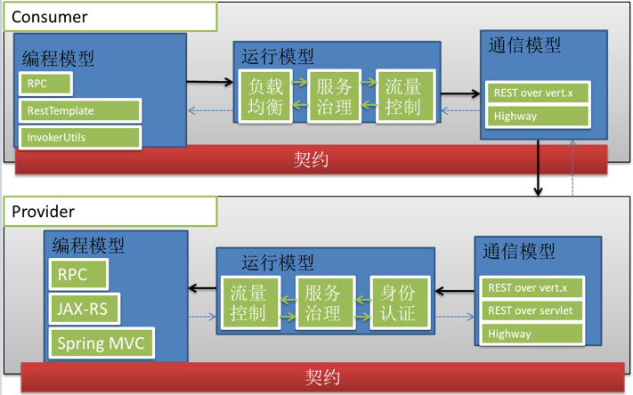
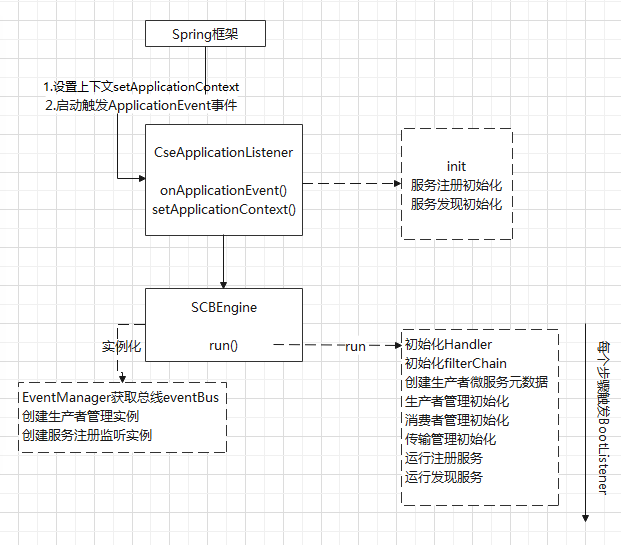
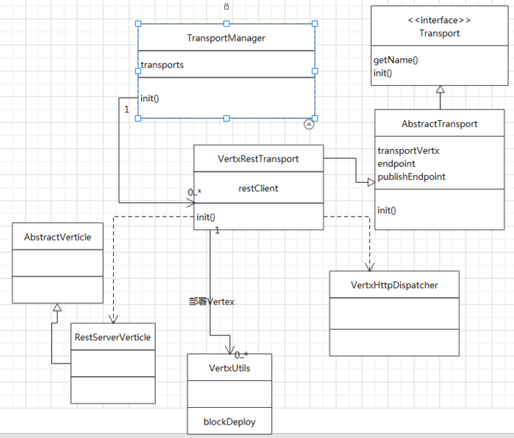
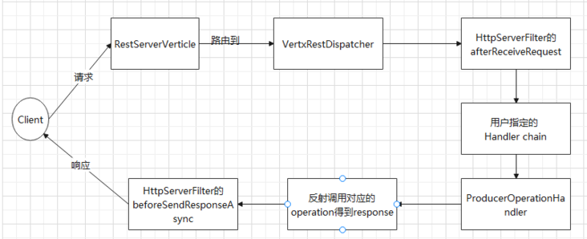
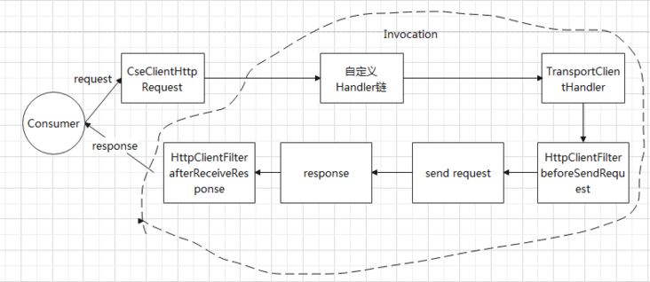
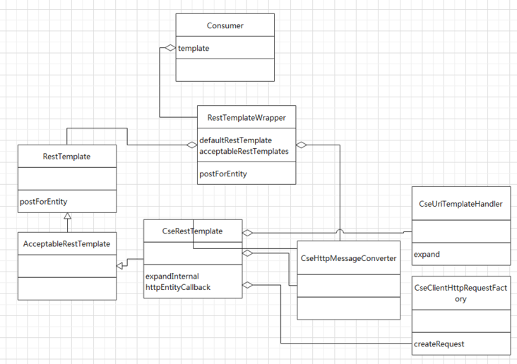

# ServiceComb 导读

`ServiceComb` 是华为贡献给 Apache 基金会的一个微服务框架，定位可类比于 `Spring Cloud` 和 `Dubbo`

> ServiceComb 最初在华为内部叫做 CSE（Cloud Service Engine），所有源码中会出现 Cse 相关的命名

## ServiceComb 的优势在哪？

ServiceComb 的特点：

- 支持多种开发风格： `REST(JAX-RS、Spring MVC）` 和 `RPC`
- 多种通信协议, `HTTP over Vert.x`、`Http Over Servlet`、`Highway` 等
- 统一一致的服务提供者、服务消费者处理链，以及基于契约的开箱即用的服务治理能力

### 相对于 Dubbo

- 等价的高性能：ServiceComb 通过 Highway (java 私有协议 + protobuffer 编解码) 也拥有和 Dubbo 等价的高性能
- 支持 http
- 更好的服务治理： ServiceComb 的服务治理更加的完善

### 相对于 Spring Cloud

- 微服务架构实现更加紧凑：ServiceComb 可以开箱即用，Spring Cloud 的实现比较松散，需要整合大量的 Netflix 组件
- 支持高性能通信协议和二进制编解码

### 缺点

起步太晚，市场份额小，社区也不如 Spring Cloud 和 Dubbo 的活跃

## 架构设计

ServiceComb 的运行架构

从这个图可以看出 ServiceComb 的设计理念是将编程规范、服务治理等切面、通信协议和编解码协议分成三个独立的模块，每个模块弄成插件式的，然后通过规范的接口装配起来，通过这样达到可以灵活的组合每个模块想要的实现。

比如团队更喜欢 Dubbo 这类的 RPC 编码风格，编程模型就选 RPC 风格，然后希望暴露 http Rest 接口，通信模型就可以选 Rest overt vert.x，如果有规范需要部署到 Tomcat 等 Servlet 容器中，就选 Rest over servlet

模型设计：

- 编程模型：通过识别不同模型的注解调用相应的解析插件，统一解析成 OperationMeta
- 运行模型：通过 SPI 加载 Handler 组成 Handler chain，切面功能主要在这里实现
- 通信模型：基于 Transport 接口，用 SPI 加载插件

## 启动过程解析

### 总启动过程解析

Servicecomb 的启动方式主要是通过 Spring 扫描 `classpath*:META-INF/spring/*.bean.xml` 来加载主要的 bean

`classpath*:META-INF/spring/cse.bean.xml` 文件中注入了 `CseApplicationListener` 以及通过扫描包 `org.apache.servicecomb` 来加载 servicecomb 的相关 bean

`CseApplicationListener` 作为 servicecomb 的启动入口，监听 spring 的 onRefresh 事件，然后启动 servicecomb

### ProducerProviderManager 初始化

1. 将项目中所有标注了 `RpcSchema/RestSchema/RestController` 注解的类识别出来生成 `ProducerMeta`

2. 加载 `ProducerMeta` 涉及到的 Swagger 文件、注解等资源生成对应的契约文件，契约文件代表了这个 Schema 的详细接口信息

3. 根据契约文件创建最后的 `SchemaMeta`，并注册到 `ProducerMicroserviceMeta` 中去。创建 `SchemaMeta` 的过程中会逐层初始化 `Schema` 和`Operation`

### TransportManager 传输服务启动

1. 在 `SCBEngine` 引擎的 `run` 方法中，调用 `transportManager.init(this)`;完成启动传输服务
2. `TransportManager` 通过 SPI 发现 `Transport` 接口实现类，`VertxRestTransport` 是其中之一，一个服务中是可以同时启动多个Transport的，开放不同的端口
3. 执行 `Transport` 的初始化逻辑，将对应的 `Endpoint` 添加到 `RegistrationManager` 中用于服务注册
4. `TransportManager` 通过服务发现，找到 `VertxHttpDispatcher` ，这个是 ServiceComb 路由分发器, 然后由 `VertxRestTransport` 装配到 Vertx 的请求 handler 中
5. Transport 的初始化逻辑中会根据配置调用 `VertxUtils.blockDeploy()` 方法部署对应的服务 `Verticle` 启动服务器

## Producer 处理请求过程

## Consumer 发起请求过程

`Consumer` 发送请求，主要是用 Spring 的 `RestTemplate`, `ServiceComb` 做了一层包装，兼容 `ServiceComb` 格式的 URL format：`cse://microserviceName/business url`，如 `cse://business/business/v1/channel/news/subscribe`。包装类主要的类图如下

