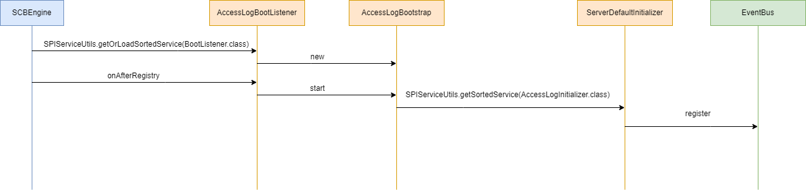

# AccessLog

## 绑定 AccessLogHandler 发送 ServerAccessLogEvent 事件

```java
public class RestServerVerticle extends AbstractVerticle {
    // ...

    @Override
    public void start(Promise<Void> startPromise) throws Exception {
        // ...

        Router mainRouter = Router.router(vertx);
        // 绑定 AccessLogHandler
        mountAccessLogHandler(mainRouter);
    }

    private void mountAccessLogHandler(Router mainRouter) {
        // 通过 AccessLogConfig 读取相关配置，比如这里的开关
        if (!AccessLogConfig.INSTANCE.isServerLogEnabled()) {
        return;
        }
        LOGGER.info("access log enabled, pattern = {}", AccessLogConfig.INSTANCE.getServerLogPattern());
        mainRouter.route().handler(context -> {
        // 构造 ServerAccessLogEvent 事件对象
        ServerAccessLogEvent accessLogEvent = new ServerAccessLogEvent()
            .setRoutingContext(context)
            .setMilliStartTime(System.currentTimeMillis())
            .setLocalAddress(LocalHostAccessItem.getLocalAddress(context));
        context.response().endHandler(event ->
            // 在 response 返回的最后发送 ServerAccessLogEvent 事件
            EventManager.post(accessLogEvent.setMilliEndTime(System.currentTimeMillis())));
        context.next();
        });
    }
}
```

## 监听 ServerAccessLogEvent 事件



## 打印 AccessLog 日志

```java
public class ServerDefaultInitializer implements AccessLogInitializer {
  // 可以通过在外面指定这个 logger 的 appender 来将 accesslog 写到自定义的文件
  private static Logger LOGGER = LoggerFactory.getLogger("accesslog");

  private AccessLogGenerator accessLogGenerator;

  @Override
  public void init(EventBus eventBus, AccessLogConfig accessLogConfig) {
    if (!accessLogConfig.isServerLogEnabled()) {
      return;
    }
    // 指定 accessLog pattern
    accessLogGenerator = new AccessLogGenerator(accessLogConfig.getServerLogPattern());
    eventBus.register(this);
  }

  @Subscribe
  @AllowConcurrentEvents
  public void onRequestReceived(ServerAccessLogEvent accessLogEvent) {
    // accessLog 通过 AccessLogGenerator 生成
    LOGGER.info(accessLogGenerator.generateServerLog(accessLogEvent));
  }
}
```

```java
public class AccessLogGenerator {
  /*
   * traversal this array to generate access log segment.
   */
  private AccessLogItem<RoutingContext>[] accessLogItems;

  // 通过 VertxRestAccessLogPatternParser 解析 pattern
  private AccessLogPatternParser<RoutingContext> logPatternParser = new VertxRestAccessLogPatternParser();

  @SuppressWarnings("unchecked")
  public AccessLogGenerator(String rawPattern) {
      // 通过 VertxRestAccessLogPatternParser 解析 pattern
    List<AccessLogItem<RoutingContext>> accessLogItemList = logPatternParser.parsePattern(rawPattern);
    accessLogItems = Iterables.toArray(accessLogItemList, AccessLogItem.class);
  }

  public String generateServerLog(ServerAccessLogEvent accessLogEvent) {
    StringBuilder log = new StringBuilder(128);
    for (AccessLogItem<RoutingContext> accessLogItem : getAccessLogItems()) {
      accessLogItem.appendServerFormattedItem(accessLogEvent, log);
    }
    return log.toString();
  }
}
```

```java
public class VertxRestAccessLogPatternParser implements AccessLogPatternParser<RoutingContext> {
  private List<VertxRestAccessLogItemMeta> metaList = new ArrayList<>();

  public VertxRestAccessLogPatternParser() {
    List<VertxRestAccessLogItemMeta> loadedMeta = loadVertxRestLogItemMeta();
    // ...
  }

  private List<VertxRestAccessLogItemMeta> loadVertxRestLogItemMeta() {
    // 获取
    return SPIServiceUtils.getOrLoadSortedService(VertxRestAccessLogItemMeta.class);
  }

  @Override
  public List<AccessLogItem<RoutingContext>> parsePattern(String rawPattern) {
    LOGGER.info("parse the pattern of access log: [{}]", rawPattern);
    List<AccessLogItemLocation> locationList = matchAccessLogItem(rawPattern);
    locationList = fillInPlainTextLocation(rawPattern, locationList);

    return convertToItemList(rawPattern, locationList);
  }

  private List<AccessLogItemLocation> matchAccessLogItem(String rawPattern) {
    List<AccessLogItemLocation> locationList = new ArrayList<>();
    int cursor = 0;
    while (cursor < rawPattern.length()) {
      AccessLogItemLocation candidate = null;
      for (VertxRestAccessLogItemMeta meta : metaList) {
        // 通过 logItemMeta 构建  LogItemLocation
      }

    return locationList;
  }
}
```

```java
// 组合模式，内置默认的 LogItemMeta
public class DefaultCompositeVertxRestAccessLogItemMeta extends CompositeVertxRestAccessLogItemMeta {
  private static final List<VertxRestAccessLogItemMeta> SUPPORTED_META = new ArrayList<>();

  static {
    final AccessLogItem<RoutingContext> httpMethodItem = new HttpMethodAccessItem();
    SUPPORTED_META.add(new VertxRestAccessLogItemMeta("%m", config -> httpMethodItem));
    SUPPORTED_META.add(new VertxRestAccessLogItemMeta("cs-method", config -> httpMethodItem));
    SUPPORTED_META.add(new VertxRestAccessLogItemMeta("%s", config -> new HttpStatusAccessItem()));
    SUPPORTED_META.add(new VertxRestAccessLogItemMeta("sc-status", config -> new HttpStatusAccessItem()));
    SUPPORTED_META.add(new VertxRestAccessLogItemMeta("%T", config -> new DurationSecondAccessItem()));
    SUPPORTED_META.add(new VertxRestAccessLogItemMeta("%D", config -> new DurationMillisecondAccessItem()));
    SUPPORTED_META.add(new VertxRestAccessLogItemMeta("%h", config -> new RemoteHostAccessItem()));
    SUPPORTED_META.add(new VertxRestAccessLogItemMeta("%v", config -> new LocalHostAccessItem()));
    SUPPORTED_META.add(new VertxRestAccessLogItemMeta("%p", config -> new LocalPortAccessItem()));
    SUPPORTED_META.add(new VertxRestAccessLogItemMeta("%B", config -> new ResponseSizeAccessItem("0")));
    SUPPORTED_META.add(new VertxRestAccessLogItemMeta("%b", config -> new ResponseSizeAccessItem("-")));
    SUPPORTED_META.add(new VertxRestAccessLogItemMeta("%r", config -> new FirstLineOfRequestAccessItem()));
    final AccessLogItem<RoutingContext> urlPathItem = new UrlPathAccessItem();
    SUPPORTED_META.add(new VertxRestAccessLogItemMeta("%U", config -> urlPathItem));
    SUPPORTED_META.add(new VertxRestAccessLogItemMeta("cs-uri-stem", config -> urlPathItem));
    final AccessLogItem<RoutingContext> queryStringItem = new QueryStringAccessItem();
    SUPPORTED_META.add(new VertxRestAccessLogItemMeta("%q", config -> queryStringItem));
    SUPPORTED_META.add(new VertxRestAccessLogItemMeta("cs-uri-query", config -> queryStringItem));
    SUPPORTED_META.add(new VertxRestAccessLogItemMeta("cs-uri", config -> new UrlPathWithQueryAccessItem()));
    SUPPORTED_META.add(new VertxRestAccessLogItemMeta("%H", config -> new RequestProtocolAccessItem()));
    SUPPORTED_META.add(new VertxRestAccessLogItemMeta("%t", config -> new ConfigurableDatetimeAccessItem()));
    SUPPORTED_META.add(new VertxRestAccessLogItemMeta("%SCB-traceId", config -> new TraceIdAccessItem()));
    SUPPORTED_META.add(new VertxRestAccessLogItemMeta("%SCB-transport", config -> new TransportAccessItem()));

    SUPPORTED_META.add(new VertxRestAccessLogItemMeta("%{", "}t", ConfigurableDatetimeAccessItem::new));
    SUPPORTED_META.add(new VertxRestAccessLogItemMeta("%{", "}i", RequestHeaderAccessItem::new));
    SUPPORTED_META.add(new VertxRestAccessLogItemMeta("%{", "}o", ResponseHeaderAccessItem::new));
    SUPPORTED_META.add(new VertxRestAccessLogItemMeta("%{", "}C", CookieAccessItem::new));
    SUPPORTED_META.add(new VertxRestAccessLogItemMeta("%{", "}SCB-ctx", InvocationContextAccessItem::new));
  }

  // ...
}
```
