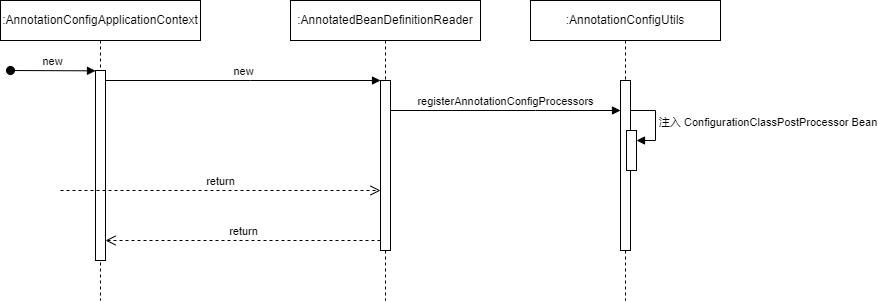

# Bean 的解析

## 通过注解 Spring 导入 Bean 的方式

1. 通过 `AnnotationConfigApplicationContext` 构造函数的入参指定 `@Configuration` bean
2. 通过 `@Configuration` Bean 上的 `@Import` 注解导入 `@Configuration` `ImportSelector` `ImportBeanDefinitionRegistrar` 或者常规的 Component 作为 bean
3. 通过 `@Configuration` Bean 上的 `@ComponentScan` 扫描其它 bean
4. 通过 `@Configuration` 方法上的 `@Bean` 注解导入 bean

## @Configuration 的解析

核心类：`ConfigurationClassParser`

调用过程：

注入 ConfigurationClassPostProcessor Bean后处理器

 

`ConfigurationClassPostProcessor` 会在 BeanFactory 中找出所有 `@Configuration` BeanDefinition, 然后委托 `ConfigurationClassParser` 处理。

`ConfigurationClassParser` 会递归处理 `@Configuration` Class 上的 `@Import` `@ImportResource` `@Bean` 等注解获取关联的 BeanDefinition 集合，然后通过 `ConfigurationClassBeanDefinitionReader` 将这些 BeanDefinition 注册。

值得一提，`ConfigurationClassBeanDefinitionReader` 也会处理 `@Component` 下的 `@Bean`, 设置为 lite 模型，而 `@Configuration` 下的 `@Bean` 为 full 模式。 

> full 模式会对 `@Configuration` 进行提升。该类会被 CGLIB 代理，Spring 会生成该类的子类，并使用这个子类来实现代理。这样可以确保配置类中的 @Bean 方法之间能够相互引用（即调用 @Bean 方法时不会创建新的实例，而是返回 Spring 容器中的单例实例）。例如，配置类 A 中的 @Bean 方法 bean1() 调用了同一个类中的 bean2() 方法，Spring 会确保 bean2() 方法返回的也是同一个 bean2 实例。

## @Bean 的解析

核心类: `AnnotateBeanDefinitionReader`

## @ComponentScan 发现 Bean

核心类: `ClassPathScanningCandidateComponentProvider`

