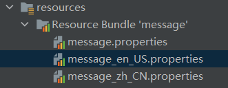

# 国际化

国际化是一个很常见的主题，支持多语言是软件走出国门的必需功能

## ResourceBundle

Java 提供了 `java.util.ResourceBundle` 类来支持国际化功能

### 简单例子



> 图中出现的 `Resource Bundle 'message'` 文件夹其实并不存在，只是 IDE 的一个显示方式，本质上三个 message properties 文件是位于 `resources` 目录下的

```properties
# message.properties

# message_zh_CN.properties
hello=你好

# message_en_US.properties
hello=Hello
```

```java
public class ResourceBundleTests {
    @Test
    public void when_zh_CN() {
        ResourceBundle bundle = ResourceBundle.getBundle("message", new Locale("zh", "CN"));
        Assertions.assertEquals("你好", bundle.getString("hello"));
    }

    @Test
    public void when_en_US() {
        ResourceBundle bundle = ResourceBundle.getBundle("message", new Locale("en", "US"));
        Assertions.assertEquals("Hello", bundle.getString("hello"));
    }

    @Test
    public void get_default_locale_when_locale_properties_file_not_exists() {
        ResourceBundle bundle = ResourceBundle.getBundle("message", new Locale("en"));
        // 找不到取默认 locale
        Assertions.assertEquals("你好", bundle.getString("hello"));
    }
}
```

> ResourceBundle 从 classpath 中寻找国际化文件

### 国际化文件选择逻辑

假设当前 JVM 的默认 locale 是 `zh` `CN`

```java
ResourceBundle.getBundle("message", new Locale("en", "US", "UNIX"));
```

寻找文件的顺序

```
1. message_en_US_UNIX
2. message_en_US
3. message_en
4. message_zh_CN
5. message_zh
6. message
```

上一节的测试用例就可以通过这个来解释，寻找的路径 `message_en(Not Found) -> message_zh_CN(Found)`

```java
    @Test
    public void get_default_locale_when_locale_properties_file_not_exists() {
        ResourceBundle bundle = ResourceBundle.getBundle("message", new Locale("en"));
        // 找不到取默认 locale
        Assertions.assertEquals("你好", bundle.getString("hello"));
    }
```

### 继承

```properties
# message.propertis
sex=man

# message_zh.properties
name=张三

# message_zh_CN.properties

```

```java
    @Test
    public void testInheritance() {
        // 继承
        ResourceBundle bundle = ResourceBundle.getBundle("message", new Locale("zh", "CN"));
        Assertions.assertEquals("张三", bundle.getString("name"));
        Assertions.assertEquals("man", bundle.getString("sex"));
    }
```

!> 继承和文件寻找是互相独立的逻辑，先文件寻找，再根据找到的文件进行继承

### FAQ

#### ResourceBundle 读取的国际化文件出现乱码？

- 问题根因

    > ResourceBundle 读取文件时默认的字符集时 `ISO-8859-1`, 而文件编码大多数采用 `UTF-8`, 这样会出现乱码

- 解决方案1：

    > 转成 unicode 编码 `\uXXXX`

    1. 使用 jdk 工具 `native2ascii`
    2. 使用 IDEA 工具 `Settings -> File Encoding -> 勾选 Transport native-to-ascii conversion`

- 解决方案2：

    > 自定义 Control

    ```java
    public class UTF8Control extends ResourceBundle.Control {

        @Override
        @Nullable
        public ResourceBundle newBundle(String baseName, Locale locale, String format, ClassLoader loader, boolean reload)
                throws IllegalAccessException, InstantiationException, IOException {

            // Special handling of default encoding
            if (format.equals("java.properties")) {
                String bundleName = toBundleName(baseName, locale);
                final String resourceName = toResourceName(bundleName, "properties");
                final ClassLoader classLoader = loader;
                final boolean reloadFlag = reload;
                InputStream inputStream;
                try {
                    inputStream = AccessController.doPrivileged((PrivilegedExceptionAction<InputStream>) () -> {
                        InputStream is = null;
                        if (reloadFlag) {
                            URL url = classLoader.getResource(resourceName);
                            if (url != null) {
                                URLConnection connection = url.openConnection();
                                if (connection != null) {
                                    connection.setUseCaches(false);
                                    is = connection.getInputStream();
                                }
                            }
                        } else {
                            is = classLoader.getResourceAsStream(resourceName);
                        }
                        return is;
                    });
                } catch (PrivilegedActionException ex) {
                    throw (IOException) ex.getException();
                }
                if (inputStream != null) {
                    // 通过 UTF-8 编码读取文件
                    try (InputStreamReader bundleReader = new InputStreamReader(inputStream, StandardCharsets.UTF_8.name())) {
                        return loadBundle(bundleReader);
                    }
                } else {
                    return null;
                }
            } else {
                // Delegate handling of "java.class" format to standard Control
                return super.newBundle(baseName, locale, format, loader, reload);
            }
        }

        private ResourceBundle loadBundle(Reader reader) throws IOException {
            return new PropertyResourceBundle(reader);
        }
    }
    ```

    ```java
    @Test
    public void when_use_utf8_control() {
        ResourceBundle bundle = ResourceBundle.getBundle("message", new Locale("zh", "CN"), new UTF8Control());
        Assertions.assertEquals("你好", bundle.getString("hello"));
    }
    ```

> 大项目中推荐使用方案二，只是很小的地方使用了国际化，就用方案一解决

## Spring MessageSource

Spring 提供了 `MessageSource` 作为国际化接口

其中，实现类 `ResourceBundleMessageSource` 就是使用 `ResourceBundle` 作为获取国际化数据的

```java
public class ResourceBundleMessageSource extends AbstractResourceBasedMessageSource implements BeanClassLoaderAware {
    // ...

    protected ResourceBundle doGetBundle(String basename, Locale locale) throws MissingResourceException {
		ClassLoader classLoader = getBundleClassLoader();
		Assert.state(classLoader != null, "No bundle ClassLoader set");

		MessageSourceControl control = this.control;
		if (control != null) {
			try {
				return ResourceBundle.getBundle(basename, locale, classLoader, control);
			}
			catch (UnsupportedOperationException ex) {
				// Probably in a Jigsaw environment on JDK 9+
				this.control = null;
				String encoding = getDefaultEncoding();
				if (encoding != null && logger.isInfoEnabled()) {
					logger.info("ResourceBundleMessageSource is configured to read resources with encoding '" +
							encoding + "' but ResourceBundle.Control not supported in current system environment: " +
							ex.getMessage() + " - falling back to plain ResourceBundle.getBundle retrieval with the " +
							"platform default encoding. Consider setting the 'defaultEncoding' property to 'null' " +
							"for participating in the platform default and therefore avoiding this log message.");
				}
			}
		}

		// Fallback: plain getBundle lookup without Control handle
		return ResourceBundle.getBundle(basename, locale, classLoader);
	}

    //...

}
```

### 注入 MessageSource

MessageSource 被使用的地方

`AbstractApplicationContext#refresh` -> `AbstractApplicationContext#initMessageSource`

```java
public abstract class AbstractApplicationContext extends DefaultResourceLoader implements ConfigurableApplicationContext {
    public static final String MESSAGE_SOURCE_BEAN_NAME = "messageSource";

    protected void initMessageSource() {
		ConfigurableListableBeanFactory beanFactory = getBeanFactory();
		if (beanFactory.containsLocalBean(MESSAGE_SOURCE_BEAN_NAME)) {
			this.messageSource = beanFactory.getBean(MESSAGE_SOURCE_BEAN_NAME, MessageSource.class);
			// Make MessageSource aware of parent MessageSource.
			if (this.parent != null && this.messageSource instanceof HierarchicalMessageSource) {
				HierarchicalMessageSource hms = (HierarchicalMessageSource) this.messageSource;
				if (hms.getParentMessageSource() == null) {
					// Only set parent context as parent MessageSource if no parent MessageSource
					// registered already.
					hms.setParentMessageSource(getInternalParentMessageSource());
				}
			}
			if (logger.isTraceEnabled()) {
				logger.trace("Using MessageSource [" + this.messageSource + "]");
			}
		}
		else {
			// Use empty MessageSource to be able to accept getMessage calls.
			DelegatingMessageSource dms = new DelegatingMessageSource();
			dms.setParentMessageSource(getInternalParentMessageSource());
			this.messageSource = dms;
			beanFactory.registerSingleton(MESSAGE_SOURCE_BEAN_NAME, this.messageSource);
			if (logger.isTraceEnabled()) {
				logger.trace("No '" + MESSAGE_SOURCE_BEAN_NAME + "' bean, using [" + this.messageSource + "]");
			}
		}
	}
}
```

可见，注入 MessageSource 只需要定义一个名为 `messageSource` 的 bean 即可

```xml
    <bean id="messageSource" class="org.springframework.context.support.ResourceBundleMessageSource">
        <property name="basename" value="exceptions"/>
    </bean>
```

### 使用 MessageSource

ApplicationContext 本身就有实现 `MessageSource` 接口

```java
public interface ApplicationContext extends EnvironmentCapable, ListableBeanFactory, HierarchicalBeanFactory,
		MessageSource, ApplicationEventPublisher, ResourcePatternResolver {
    // ...
}
```

并委托给 `messageSource` 的 bean 进行国际化

```java
public abstract class AbstractApplicationContext extends DefaultResourceLoader
		implements ConfigurableApplicationContext {
    // ...

    @Override
	public String getMessage(String code, @Nullable Object[] args, @Nullable String defaultMessage, Locale locale) {
		return getMessageSource().getMessage(code, args, defaultMessage, locale);
	}

    // ...
}
```

> 因此，直接通过 `ApplicationContext#getMessage()` 即可获取国际化

### 语言 Locale 的获取

在 Spring web 项目中一般通过 `LocalContextHolder#getLocale()` 获取 Locale

`LocaleContextHolder` 的设置

```java
public abstract class FrameworkServlet extends HttpServletBean implements ApplicationContextAware {
    protected final void doGet(HttpServletRequest request, HttpServletResponse response) throws ServletException, IOException {
        this.processRequest(request, response);
    }

    protected final void processRequest(HttpServletRequest request, HttpServletResponse response) throws ServletException, IOException {
        // ...

        // locale context 由 DispatcherServlet 重写
        LocaleContext localeContext = this.buildLocaleContext(request);
        
        // ...

        this.initContextHolders(request, localeContext, requestAttributes);

        // ...

        this.doService(request, response);

        // ...
    }

    private void initContextHolders(HttpServletRequest request, @Nullable LocaleContext localeContext, @Nullable RequestAttributes requestAttributes) {
        if (localeContext != null) {
            LocaleContextHolder.setLocaleContext(localeContext, this.threadContextInheritable);
        }

        if (requestAttributes != null) {
            RequestContextHolder.setRequestAttributes(requestAttributes, this.threadContextInheritable);
        }

    }
}
```

`DispatcherServlet#buildLocaleContext`

```java
public class DispatcherServlet extends FrameworkServlet {
    private void initLocaleResolver(ApplicationContext context) {
        try {
            this.localeResolver = (LocaleResolver)context.getBean("localeResolver", LocaleResolver.class);
            if (this.logger.isTraceEnabled()) {
                this.logger.trace("Detected " + this.localeResolver);
            } else if (this.logger.isDebugEnabled()) {
                this.logger.debug("Detected " + this.localeResolver.getClass().getSimpleName());
            }
        } catch (NoSuchBeanDefinitionException var3) {
            this.localeResolver = (LocaleResolver)this.getDefaultStrategy(context, LocaleResolver.class);
            if (this.logger.isTraceEnabled()) {
                this.logger.trace("No LocaleResolver 'localeResolver': using default [" + this.localeResolver.getClass().getSimpleName() + "]");
            }
        }

    }

    protected LocaleContext buildLocaleContext(final HttpServletRequest request) {
        LocaleResolver lr = this.localeResolver;
        return lr instanceof LocaleContextResolver ? ((LocaleContextResolver)lr).resolveLocaleContext(request) : () -> {
            return lr != null ? lr.resolveLocale(request) : request.getLocale();
        };
    }
}
```

默认没有设置 `localeResolver` 时，会通过 `HttpServletRequest#getLocale()` 获取 locale

HttpServletRequest 的实现类一般是 tomcat 中的 `Request`，它是使用请求头 `accept-language` 来生成 Locale 的

```java
public class Request implements HttpServletRequest {
    // ...

    @Override
    public Locale getLocale() {

        if (!localesParsed) {
            parseLocales();
        }

        if (locales.size() > 0) {
            return locales.get(0);
        }

        return defaultLocale;
    }

    protected void parseLocales() {

        localesParsed = true;

        // Store the accumulated languages that have been requested in
        // a local collection, sorted by the quality value (so we can
        // add Locales in descending order).  The values will be ArrayLists
        // containing the corresponding Locales to be added
        TreeMap<Double, ArrayList<Locale>> locales = new TreeMap<>();

        Enumeration<String> values = getHeaders("accept-language");

        while (values.hasMoreElements()) {
            String value = values.nextElement();
            parseLocalesHeader(value, locales);
        }

        // Process the quality values in highest->lowest order (due to
        // negating the Double value when creating the key)
        for (ArrayList<Locale> list : locales.values()) {
            for (Locale locale : list) {
                addLocale(locale);
            }
        }
    }
}
```

> 由此可见，默认情况下，Spring Web 工程的 `LocaleContextHolder#getLocale()` 的值是由请求头 `accept-language` 决定的

但是，在实际情况下，可能并不是通过请求头 `accept-language` 获取 Locale

这时可以配置 `LocaleResolver` Bean 来设置 Locale

```java
@Configuration
public class AppConfig {
    @Bean
    public LocaleResolver localeResolver() {
        return new MyLocaleResolver();
    }

    private class MyLocaleResolver implements LocaleResolver {
        @Override
        public Locale resolveLocale(HttpServletRequest request) {
            String language = request.getHeader("language");
            if (!StringUtils.isEmpty(language)) {
                return new Locale(language);
            }
            return Locale.getDefault();
        }

        @Override
        public void setLocale(HttpServletRequest request, HttpServletResponse response, Locale locale) {

        }
    }
}
```

## Spring Boot MessageSource

详见 `MessageSourceAutoConfiguration`

> 主要是自动挂装配了一个 MessageSource bean

## References

- [A Guide to the ResourceBundle](https://www.baeldung.com/java-resourcebundle)
- [Spring 国际化文档](https://docs.spring.io/spring-framework/docs/current/reference/html/core.html#context-functionality-messagesource)
- [Spring Boot 国际化文档](https://docs.spring.io/spring-boot/docs/current/reference/html/features.html#features.internationalization)