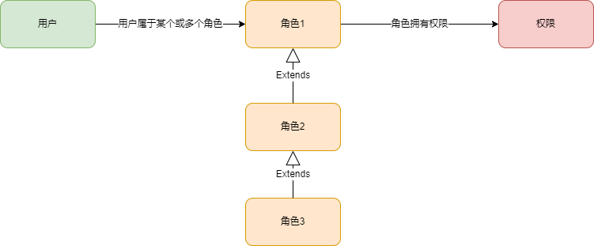
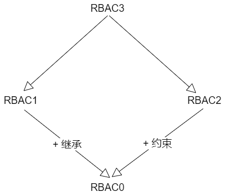

# RBAC 权限模型

RBAC 就是一个权限模型，这个模型是经过时间沉淀之后，相当通用、成熟且被大众接受认可的一个模型。

RBAC (Role-Based Access Control)，即：基于角色的权限控制。通过角色关联用户，角色关联权限的方式间接赋予用户权限。

## 模型图解

### RBAC0 -- 基础模型

这个模型中又包含了两种变化

1. 用户和角色是多对一关系，即：一个用户只属于一种角色，一种角色可以有多个用户担当

2. 用户和角色是多对多关系，即：一个用户可同时充当多种角色，一种角色可以有多个用户担当

> 优先考虑多对多，扩展性好

### RBAC1 -- RBAC0 + 继承

使用场景：如某个业务部门，有经理、主管、专员。主管的权限不能大于经理，专员的权限不能大于主管。

### RBAC2 -- RBAC0 + 约束

基于RBAC0模型，增加了对角色的一些限制：角色互斥、基数约束、先决条件角色等。

- **角色互斥**：同一用户不能分配到一组互斥角色集合中的多个角色，互斥角色是指权限互相制约的两个角色。案例：请款系统中一个用户不能同时被指派给申请角色和审批员角色。

- **基数约束**：一个角色被分配的用户数量受限，它指的是有多少用户能拥有这个角色。案例：一个角色专门为公司CEO创建的，那这个角色的数量是有限的。

- **先决条件角色**：指要想获得较高的权限，要首先拥有低一级的权限。案例：先有副总经理权限，才能有总经理权限。

- **运行时互斥**：例如，允许一个用户具有两个角色的成员资格，但在运行中不可同时激活这两个角色，案例：同一个用户拥有多个角色，角色的权限有重叠，以较大权限为准。

### RBAC3 -- RBAC0 + RBAC1 + RBAC2

### 总结

!> 每一种模型都不是一成不变的，在 RBAC0 的基础上延伸的 1，2，3 只是对基础模型的一种扩展，包含但不限于，要根据实际需求来选择如何使用

## 用户组

当平台用户基数增大，角色类型增多时，如果直接给用户配角色，管理员的工作量就会很大。

这时候我们可以引入一个概念“用户组”，就是将相同属性的用户归类到一起。

用户组的优点，除了减少工作量，还有更便于理解、增加多级管理关系等。如：我们在进行组织机构配置的时候，除了加入部门，还可以加入职级、岗位等层级，来为用户组内部成员的权限进行等级上的区分。

## References

- [RBAC 权限模型](https://juejin.cn/post/6844903905931821063)
