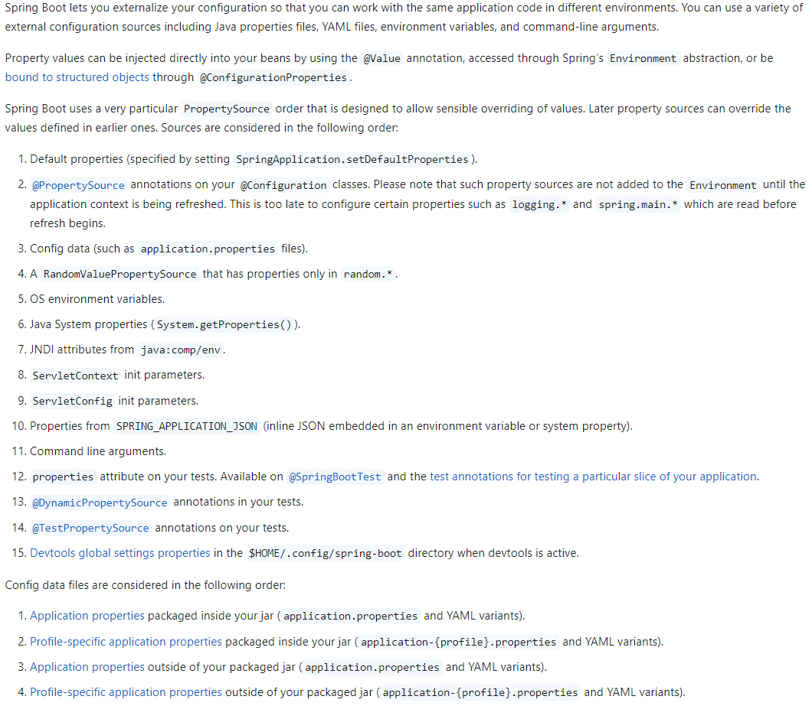
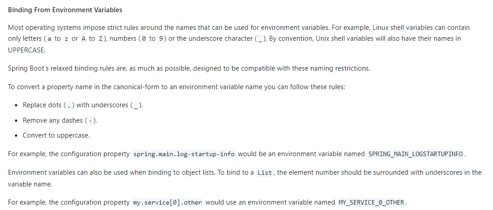

# Spring Boot 外部化配置

## 环境变量配置源的三种用法0

1. `SPRING_APPLICATION_JSON`: 值为 json 字符串，是用环境变量表达的 `application.yml`、
2. 单个配置的环境变量：

    

3. 在 application.yml 中引用环境变量。直接使用 `${ENV_NAME}` 来引用 

## 关于复杂类型的多配置源合并

数组类型配置在多个配置源，会被整个元素一起覆盖，而不是元素字段合并。要想不整体覆盖，可以改成 Map 类型

[官方文档](https://docs.spring.io/spring-boot/reference/features/external-config.html#features.external-config.typesafe-configuration-properties.merging-complex-types)

## References

- [官方文档](https://docs.spring.io/spring-boot/reference/features/external-config.html)