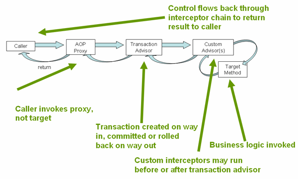

# Spring 事务

## 事务的分类

### 本地事务

支持一种资源的事务

缺点：

- 只支持一种资源
- 事务代码无法复用到其它资源

### 全局事务（分布式事务）

支持多种资源的事务

实现方案：

- JTA：复杂、需要 JNDI、应用服务器环境相关（代码难以重用）
- EJB CMT：不需要 JNDI（但本身需要 JNDI）、应用服务器环境相关（代码难以重用）、依赖 EJBs（EJB 由于其缺点已不再推荐使用）

## Spring 事务

优势：

- 兼容本地事务和全局事务的一致的事务模型，代码可复用

- 支持声明式和编程式

- 简单

### 核心组件

- 事务策略类：`PlatformTransactionManager`

    > `PlatformTransactionManager` 适用于同步类型资源，对于 Reactive 资源要使用 `ReactiveTransactionManager`

    ```java
    public interface PlatformTransactionManager extends TransactionManager {
        TransactionStatus getTransaction(@Nullable TransactionDefinition definition) throws TransactionException;

        void commit(TransactionStatus status) throws TransactionException;

        void rollback(TransactionStatus status) throws TransactionException;
    }
    ```

    > 各种资源的事务实现自己的策略类，常见的由数据库策略 `DataSourceTransactionManager`, JTA 全局事务策略 `JtaTransactionManager`

    ```xml
    <bean id="dataSource" class="org.apache.commons.dbcp.BasicDataSource" destroy-method="close">
        <property name="driverClassName" value="${jdbc.driverClassName}" />
        <property name="url" value="${jdbc.url}" />
        <property name="username" value="${jdbc.username}" />
        <property name="password" value="${jdbc.password}" />
    </bean>

    <bean id="txManager" class="org.springframework.jdbc.datasource.DataSourceTransactionManager">
        <property name="dataSource" ref="dataSource"/>
    </bean>
    ```

    ```xml

        <jee:jndi-lookup id="dataSource" jndi-name="jdbc/jpetstore"/>

        <bean id="txManager" class="org.springframework.transaction.jta.JtaTransactionManager" />

    ```

    > Spring 事务从操作上就是将一个 `PlatformTransactionManager` 实现类注入到 Spring 容器，然后通过 @EnableTransactionManagement 使能事务管理，即可使用

    > 不同资源的本地事务只能实现自己的事务策略类，注入 Spring 容器即可

- 事务定义： `TransactionDefinition`

    - 传播性：父事务和子事务之间的关系
    - 隔离性：不同事务之间的隔离性
    - 超时：事务的超时时间
    - 只读状态：事务是否可读，可根据该状态做优化

- 事务状态： `TransactionStatus`

    > 设置和获取事务状态，走相应的逻辑

### 事务的传播

[官方文档](https://docs.spring.io/spring-framework/docs/current/reference/html/data-access.html#tx-propagation)

- `REQUIRED`: 如果当前线程已存在可用的事务，则用已存在的事务

    > 子方法异常会导致整个事务 Rollback

    

- `REQUIRES_NEW`: 每次都启用新事务

    > 子方法异常只会 Rollback 子事务

    

- `NESTED`: 使用已存在的事务

    > 子方法异常只会 Rollback 到上次的 savepoints，只有某些资源支持

### 声明式事务管理

> 推荐的事务使用方法

## Spring 事务的基本用法

1. `@EnableTransactionManagement` 使能事务

2. 配置 `PlatformTransactionManager`

    > 很多资源的 starter 会自动配置 `PlatformTransactionManager` Bean

3. 在需要事务的类和方法上添加 `@Transaction` 注解

## Spring 事务实现

Spring Transation 基于 Spring AOP 实现



### 装配 Spring Transaction 拦截器

Spring Transaction 一般通过 `@EnableTransactionManagement` 启动

> 也可自行配置关键的事务 Bean 进行使用


核心 Bean

- Advisor: `BeanFactoryTransactionAttributeSourceAdvisor`

    > pointcut 为 BeanFactory 中方法或者所在类由 `@Transactional` 注解的 bean

    > 使用 `TransactionInterceptor` 作为拦截器

    > `@EnableTransactionManagement#order` 决定拦截顺序，默认是最小优先级(最后执行)

- Advice: `TransactionInterceptor`

    > 注入 `TransactionManager` Bean (TransactionManager Bean 一般由 starter 自动配置，也可自行配置)

    > 拦截 `@Transactional` 方法，在方法前使用 `TransactionManager` 开启事务，方法后使用 `TransactionManager` 提交或者回滚事务

### TransactionManager 的选择逻辑

`TransactionInterceptor#determineTransactionManager`

```java
    @Nullable
    protected TransactionManager determineTransactionManager(@Nullable TransactionAttribute txAttr) {
        if (txAttr != null && this.beanFactory != null) {
            String qualifier = txAttr.getQualifier();
            if (StringUtils.hasText(qualifier)) {
                return this.determineQualifiedTransactionManager(this.beanFactory, qualifier);
            } else if (StringUtils.hasText(this.transactionManagerBeanName)) {
                return this.determineQualifiedTransactionManager(this.beanFactory, this.transactionManagerBeanName);
            } else {
                TransactionManager defaultTransactionManager = this.getTransactionManager();
                if (defaultTransactionManager == null) {
                    defaultTransactionManager = (TransactionManager)this.transactionManagerCache.get(DEFAULT_TRANSACTION_MANAGER_KEY);
                    if (defaultTransactionManager == null) {
                        defaultTransactionManager = (TransactionManager)this.beanFactory.getBean(TransactionManager.class);
                        this.transactionManagerCache.putIfAbsent(DEFAULT_TRANSACTION_MANAGER_KEY, defaultTransactionManager);
                    }
                }

                return defaultTransactionManager;
            }
        } else {
            return this.getTransactionManager();
        }
    }
```

## 编程式事务

核心模板类: `TransactionTemplate`

```java
public class SimpleService implements Service {

    // single TransactionTemplate shared amongst all methods in this instance
    private final TransactionTemplate transactionTemplate;

    // use constructor-injection to supply the PlatformTransactionManager
    public SimpleService(PlatformTransactionManager transactionManager) {
        this.transactionTemplate = new TransactionTemplate(transactionManager);
        // the transaction settings can be set here explicitly if so desired
        this.transactionTemplate.setIsolationLevel(TransactionDefinition.ISOLATION_READ_UNCOMMITTED);
        this.transactionTemplate.setTimeout(30); // 30 seconds
    }

    public Object someServiceMethod() {
        return transactionTemplate.execute(new TransactionCallback() {
            // the code in this method runs in a transactional context
            public Object doInTransaction(TransactionStatus status) {
                updateOperation1();
                return resultOfUpdateOperation2();
            }
        });
    }
}
```

或者定义一个 `TransactionTemplate` Bean

```xml
<bean id="sharedTransactionTemplate"
        class="org.springframework.transaction.support.TransactionTemplate">
    <property name="isolationLevelName" value="ISOLATION_READ_UNCOMMITTED"/>
    <property name="timeout" value="30"/>
</bean>
```

## References

- [Spring 事务管理文档](https://docs.spring.io/spring-framework/docs/current/reference/html/data-access.html#transaction)
- [Spring 多事务管理器配置](https://docs.spring.io/spring-framework/docs/current/reference/html/data-access.html#tx-multiple-tx-mgrs-with-attransactional)